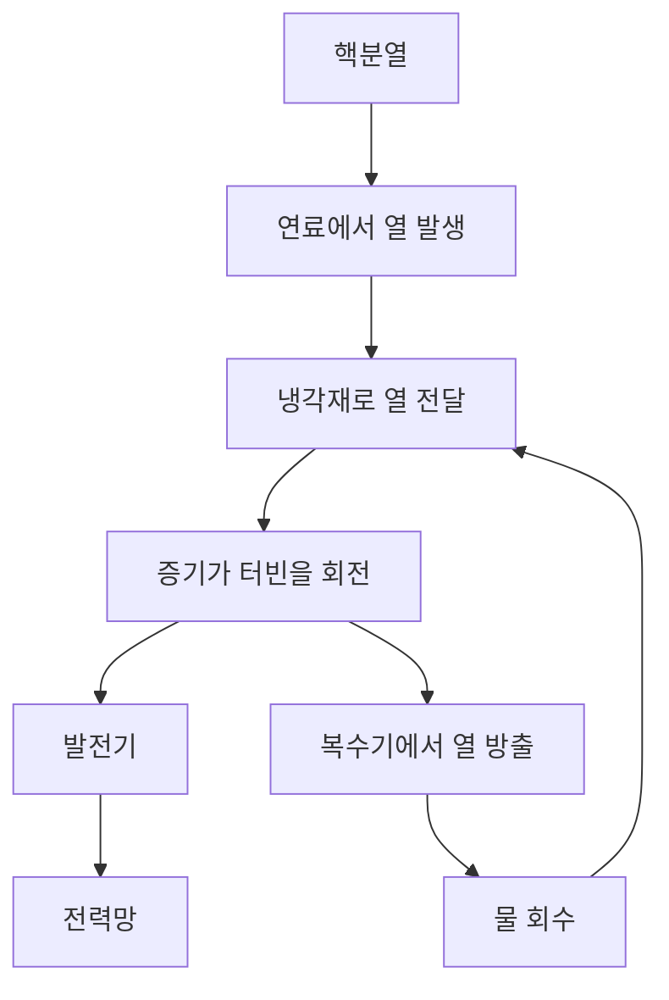
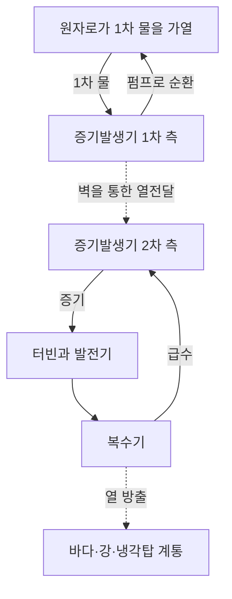

## 1. 원자력 발전소의 마지막에는 회전하는 발전기가 있다

원자력 발전이라는 말을 들으면 원자에서 전기를 직접 꺼내는 장치를 떠올릴 수 있습니다. 하지만 널리 쓰이는 원자력 발전소 대부분에서 실제로 전기를 만드는 것은 터빈에 연결된 발전기입니다. 원자로가 열을 만들고, 그 열로 증기를 발생시키며, 증기가 터빈을 돌립니다.

이 큰 흐름은 석탄이나 천연가스의 열을 이용하는 증기 발전과 같습니다. 차이는 열의 출처입니다. 화력 발전은 주로 화학 반응을, 원자력 발전은 원자핵의 변화를 이용합니다. 핵분열과 발전기 사이에는 순환하는 물, 증기 발생 장치, 배관, 터빈, 복수기 등 여러 설비가 있습니다.

이 흐름을 따라가면 장점과 과제를 함께 이해할 수 있습니다. 적은 연료로 큰 열을 얻지만, 열을 밖으로 옮기지 못하면 연료가 과열됩니다. 연쇄 반응을 멈춘 뒤에도 이미 생겨난 방사성 물질이 계속 열을 냅니다. **원자로를 정지시키는 것과 발전소를 충분히 식히는 것은 같은 일이 아닙니다.**

이 글은 상업 발전에 널리 쓰이는 **경수로**를 중심으로 설명합니다. 도식은 기능을 보여 주며 실제 배관 설계나 운전 절차를 나타내지 않습니다. 가벼운 원자핵을 합치는 핵융합은 여기서 다루는 핵분열과 다른 반응입니다. [미국 에너지부의 원자로 기초 설명][doe-reactor]

## 2. 연료를 태우는 것과 원자핵을 바꾸는 것은 다르다

물질은 원자로 이루어집니다. 원자 중심에는 양성자와 중성자로 구성된 원자핵이 있고, 그 주변에 전자가 있습니다. 석탄이 탈 때는 탄소와 산소 같은 원자 사이의 결합이 바뀝니다. 주로 전자가 관여하는 화학 반응이며, 탄소 원자핵 자체가 다른 원소로 변하는 것은 아닙니다.

핵분열에서는 무거운 원자핵이 비교적 가벼운 두 원자핵과 다른 생성물로 나뉩니다. 반응 전후의 핵 구성에 따른 에너지 차이가 방출됩니다. 원자핵을 개별 양성자와 중성자로 완전히 분리하는 데 필요한 에너지를 결합 에너지라고 합니다.

더 단단하게 결합한 상태가 되면서 에너지가 나온다는 점이 이상하게 느껴질 수 있습니다. 높은 선반에서 물체가 떨어지는 상황을 생각해 봅시다. 에너지가 낮은 상태로 이동하면서 그 차이가 방출됩니다. 무언가를 부순다는 사실만으로 에너지가 생기는 것은 아닙니다. 에너지를 넣어 주어야 하는 반응도 있습니다.

핵자 하나당 결합 에너지는 매우 가벼운 원자핵에서 중간 질량의 원자핵으로 갈수록 대체로 커지며, 철과 니켈 부근에서 큰 값을 가집니다. 따라서 적절한 반응에서는 무거운 핵을 나누거나 가벼운 핵을 합치는 두 방식 모두 에너지를 방출할 수 있습니다. [ATOMICA: 원자핵의 구조][binding]

질량 차이와 방출 에너지의 관계는 다음과 같습니다.

$$
E=\Delta m c^2
$$

$\Delta m$은 정지 질량의 차이이고 $c$는 빛의 속도입니다. 연료 전체가 사라져 전기가 된다는 뜻은 아닙니다. 핵분열 조각과 중성자는 남고, 질량 차이에 해당하는 에너지가 운동 에너지와 방사선 등으로 나타납니다. 그 열을 전부 전기로 바꿀 수도 없습니다.

## 3. 핵분열 에너지는 먼저 연료를 가열한다

우라늄-235는 경수로에서 쓰는 대표적인 핵분열성 동위원소입니다. 중성자를 흡수한 원자핵은 들뜬 상태를 거쳐 분열할 수 있으며, 이때 핵분열 조각, 중성자, 감마선 등이 나옵니다. 생성되는 핵종의 조합은 다양하므로 매번 같은 두 원소가 나오는 것은 아닙니다.

방출 에너지의 상당 부분은 빠르게 움직이는 핵분열 조각이 가집니다. 이 조각이 주변 물질과 충돌하며 느려지면서 연료를 가열합니다. 열은 연료 피복관을 지나 냉각재로 전달됩니다. 핵반응에서 가정의 콘센트까지 도달하는 동안 에너지의 형태는 여러 번 바뀝니다.

공학적인 어림값으로는 핵분열 한 번당 약 200 MeV의 열을 사용할 수 있습니다. 중성미자가 일부 에너지를 가져가고 중성자 포획에서도 에너지가 나오므로, 정확한 수지는 핵종과 계산 범위에 따라 달라집니다. [ATOMICA: 핵분열 반응][fission]

1 전자볼트는 약 $1.602\times10^{-19}$ J입니다. 따라서 200 MeV는 약 $3.20\times10^{-11}$ J입니다. 한 번의 반응만 보면 작지만, 일상적인 양의 물질에도 원자는 엄청나게 많이 들어 있습니다.

$$
\dot N\approx\frac{P_{\mathrm{th}}}{E_f}
$$

$P_{\mathrm{th}}$는 열출력, $E_f$는 핵분열 한 번당 열, $\dot N$은 초당 핵분열 횟수입니다. 30억 W를 위 에너지로 나누면 초당 약 $9.4\times10^{19}$회의 핵분열이 됩니다. 규모를 이해하기 위한 계산이며 정밀한 원자로 연료 계산은 아닙니다.

적은 연료로 큰 출력을 얻는다는 것은 단위 질량당 에너지가 높다는 의미입니다. 핵분열 한 번마다 거대한 폭발이 일어난다는 뜻이 아닙니다. 미시적인 반응을 일정하게 이어 가려면 연쇄 반응을 제어해야 합니다.

## 4. 임계는 연쇄 반응이 균형을 이루는 상태다

어떤 핵분열에서 나온 중성자가 다른 핵분열을 일으키고, 그 반응이 다시 중성자를 내놓습니다. 이것이 연쇄 반응입니다. 모든 중성자가 여기에 참여하지는 않습니다. 핵분열을 일으키지 않고 흡수되거나 노심 밖으로 빠져나가는 중성자도 있습니다.

이 균형을 나타내는 것이 **유효 증배계수** $k_{\mathrm{eff}}$입니다. 개념적으로는 중성자 수가 한 세대에서 다음 세대로 어떻게 변하는지 알려 줍니다.

| 상태 | 조건 | 전반적인 경향 |
|---|---|---|
| 미임계 | $k_{\mathrm{eff}}<1$ | 외부 중성자원을 제외하면 연쇄 반응이 줄어듦 |
| 임계 | $k_{\mathrm{eff}}=1$ | 세대 사이의 균형이 유지됨 |
| 초임계 | $k_{\mathrm{eff}}>1$ | 연쇄 반응이 증가하는 경향 |

일상어에서 느껴지는 위기라는 인상과 달리, 원자로의 임계 자체가 사고를 뜻하지는 않습니다. 일정 출력으로 운전하는 원자로는 중성자의 생성과 손실이 균형을 이룹니다. 임계라는 말만으로 출력 크기도 알 수 없습니다. 낮은 출력과 높은 출력 모두에서 임계일 수 있습니다.

세대만을 고려한 단순한 모형은 다음과 같습니다.

$$
N_g=N_0\left(k_{\mathrm{eff}}\right)^g
$$

100세대 뒤의 중성자 수 비율은 0.99일 때 약 0.366배, 1.00이면 1배, 1.01이면 약 2.70배입니다. 작은 차이도 누적됩니다. 다만 이 식에는 세대 시간, 지발 중성자, 온도 변화, 제어 장치가 없습니다. **실제 출력 변화에 몇 초가 걸리는지는 이 식으로 예측할 수 없습니다.**

## 5. 감속재, 흡수재, 냉각재는 서로 다른 일을 한다

원자로에 물과 막대가 있다는 사실만 알아서는 부족합니다. 중성자를 느리게 하는 것, 흡수하는 것, 열을 옮기는 것은 서로 다른 기능입니다.

**감속재**는 중성자 에너지를 낮춥니다. 핵분열 중성자는 빠르게 나오며, 경수로에서는 물속 원자핵과 충돌하면서 느려집니다. 우라늄-235는 낮은 중성자 에너지 영역에서 핵분열 확률이 높아지는 성질이 있고, 설계는 이를 이용합니다.

**제어용 흡수재**는 중성자를 포획해 연쇄 반응에 참여할 수 있는 수를 줄입니다. 제어봉이 이 역할을 합니다. 중성자를 느리게 만드는 것과 반응의 연결에서 제거하는 것은 다릅니다. 제어봉이 단순히 중성자의 속도를 늦춘다고 설명하면 두 기능을 혼동하게 됩니다.

**냉각재**는 연료의 열을 밖으로 운반합니다. 경수로의 물은 감속재와 냉각재를 겸하지만, 모든 원자로가 그런 것은 아닙니다. 다른 형식에서는 흑연으로 감속하고 기체로 냉각하기도 합니다. [미국 원자력규제위원회 교육 자료][nrc-reactors]

| 기능 | 바꾸는 대상 | 경수로의 대표적인 예 |
|---|---|---|
| 감속 | 중성자의 에너지 | 물 |
| 흡수와 반응 제어 | 연쇄 반응에 이용되는 중성자 수 | 제어봉과 그 밖의 흡수재 |
| 냉각과 열 수송 | 연료와 계통의 온도 | 순환하는 물 |
| 밀봉·격리 | 방사성 물질의 이동 | 피복관, 압력 경계, 격납 설비 |

물이 두 역할을 하므로 온도와 밀도 변화는 냉각과 중성자 거동 모두에 영향을 줍니다. 원자로에서는 핵물리와 열전달, 유체 흐름이 밀접하게 연결됩니다.

## 6. 지발 중성자와 온도 피드백이 제어의 시간을 만든다

핵분열 중성자의 대부분은 즉시 방출됩니다. 하지만 일부는 핵분열 생성물의 방사성 붕괴를 거쳐 뒤늦게 나옵니다. 이 **지발 중성자**는 비율이 작아도 원자로 거동의 시간 척도에 큰 영향을 줍니다.

즉발 중성자만으로 유지되고 빠르게 커지는 반응과, 균형을 이루는 데 지발 중성자가 필요한 반응은 다르게 움직입니다. 이 차이는 정상적인 제어에서 중요합니다. 사람과 기계는 개별 핵분열을 하나씩 막는 대신 전체 중성자 수지를 조절합니다. [IAEA: 핵물리와 원자로 이론][reactor-theory]

온도가 높아질 때 반응도를 낮추는 물리적 효과도 있습니다. 연료 온도 상승에 따른 도플러 효과는 우라늄-238 등에서의 중성자 흡수를 바꾸어 중요한 음의 피드백을 제공합니다. [ATOMICA: 가압경수로 노심 설계][core-design]

그러나 뜨거워지면 언제나 안전하게 멈춘다고 일반화할 수는 없습니다. 감속재 밀도, 증기 비율, 연료 상태의 영향은 원자로 설계와 운전 조건에 따라 달라집니다. 물리적 피드백에 계측, 제어 계통, 정지 장치를 함께 사용합니다.

핵분열 생성물은 과거 운전 이력도 중요하게 만듭니다. 예를 들어 제논-135는 중성자를 강하게 흡수하며, 그 양은 이전 출력에 영향을 받습니다. 출력 조정은 불꽃 세기를 손잡이로 바꾸는 것처럼 단순하지 않습니다. 지금의 온도와 출력뿐 아니라 이전 운전도 고려해야 합니다.

## 7. 가압경수로: 압력을 높인 물로 별도 회로를 가열한다

가압경수로, 즉 PWR은 1차 냉각재를 높은 압력으로 유지해 노심에서 열을 받아도 대규모 비등이 일어나지 않도록 합니다. 뜨거운 물은 증기발생기로 들어가 금속 벽을 사이에 두고 2차 계통의 물에 열을 전달합니다.

2차 증기는 터빈으로 가고 1차 물은 원자로로 돌아갑니다. 정상 상태에서는 물이 섞이지 않은 채 열만 전달됩니다. 원자로의 물을 그대로 터빈으로 보내는 것은 PWR의 기본 구조가 아닙니다.

이 구조는 방사성 물질이 포함될 수 있는 1차 냉각재와 터빈 계통을 분리합니다. 하지만 증기발생기 전열관은 중요한 경계이므로 검사가 필요합니다. 회로를 나눴다고 유지보수가 사라지는 것이 아니라, 건전성을 유지해야 하는 경계가 생기는 것입니다.

가압기는 1차 압력을 조절하고 펌프는 냉각재를 순환시킵니다. 실제 발전소에는 압력, 온도, 물의 양을 측정하고 유지하는 보조 계통도 있습니다. [미국 에너지부: PWR의 원리][pwr]

## 8. 비등경수로: 원자로 안에서 증기를 만든다

비등경수로, 즉 BWR은 원자로 내부에서 의도적으로 물을 끓입니다. 증기 속 액체 물방울을 분리한 뒤 터빈으로 보내고, 일을 마친 증기는 응축시켜 급수로 되돌립니다.

PWR과 달리 노심을 통과한 물에서 생긴 증기가 터빈 계통까지 가므로 그곳에도 방사선 관리가 필요합니다. 기본 증기 사이클에는 PWR처럼 1차와 2차 사이에서 열을 교환하는 별도 증기발생기가 없습니다. [미국 원자력규제위원회: BWR][bwr]

| 비교 항목 | PWR | BWR |
|---|---|---|
| 증기가 주로 생기는 곳 | 증기발생기 2차 측 | 원자로 내부 |
| 노심의 물 | 높은 압력으로 대규모 비등 억제 | 비등을 이용 |
| 터빈으로 가는 유체 | 2차 증기 | 원자로에서 생성된 증기 |
| 기본 구성 | 증기발생기로 회로 분리 | 원자로와 터빈을 증기로 직접 연결 |
| 공통 요구 기능 | 냉각, 정지, 격리, 열 방출 | 냉각, 정지, 격리, 열 방출 |

둘 다 물을 쓰지만 계통은 다릅니다. 겉보기의 단순함만으로 안전성이나 비용을 판단할 수 없습니다. 사고 대응 기능, 검사 접근성, 재료, 운전 조건까지 비교해야 합니다.

## 9. 열을 전부 전기로 바꿀 수 없는 이유

증기터빈은 뜨겁고 압력이 높은 증기의 팽창을 회전으로 바꿉니다. 발전기는 전자기 유도로 회전을 전기로 바꿉니다. 복수기는 증기를 식혀 다시 물로 만듭니다. 부피가 크게 줄어들어 터빈 출구의 낮은 압력을 유지하는 데 도움이 되고, 작동 유체를 다시 펌프로 보내기도 쉬워집니다.

냉각은 비효율을 숨기기 위한 부속 기능이 아닙니다. 순환하는 열기관은 고온부에서 열을 받아 그 일부를 저온부로 내보내야 합니다. 온도가 유한한 두 열원 사이에서는 이상적인 기관조차 모든 열을 일로 바꿀 수 없습니다.

$$
\eta_{\mathrm{Carnot}}=1-\frac{T_c}{T_h}
$$

온도에는 섭씨가 아니라 켈빈 절대온도를 씁니다. 고온부 570 K, 저온부 300 K를 가정하면 이상적 한계는 약 47%입니다. 실제로는 열교환기, 마찰, 증기 상태, 터빈과 발전기의 손실로 효율이 더 낮습니다. 이 계산은 실제 사이클의 여러 온도를 두 온도로 단순화한 예입니다.

경수로 발전의 대략적인 열효율은 3분의 1 정도입니다. 핵분열 중 3분의 1만 일어난다는 의미가 아니라, 열 가운데 전기로 바뀌는 비율입니다. 온도를 높이면 효율을 높일 수 있지만 재료, 부식, 압력, 연료의 한계가 제약합니다. [ATOMICA: 원자력 발전의 배출열][thermal]

열출력 3,000 MW, 효율 33%인 가상 발전소라면 전기출력은 990 MW이고 약 2,010 MW를 열로 내보내야 합니다.

$$
P_e=\eta P_{\mathrm{th}},\qquad
P_{\mathrm{out}}=P_{\mathrm{th}}-P_e
$$

이 단순 수지는 보조 설비의 전력 소비를 따로 계산하지 않습니다. 실제 지표에서는 발전기 출력과 펌프 등의 소비를 뺀 순송전 출력을 구분합니다. 남은 큰 열량을 처리하려면 대규모 냉각 설비가 필요합니다. 해안에서는 바닷물, 내륙에서는 강이나 냉각탑을 이용할 수 있습니다. 냉각탑의 흰 기둥은 대개 눈에 보이는 물방울이며, 그 모습만으로 방사성 물질 방출을 판단할 수 없습니다.

## 10. 붕괴열: 정지해도 새로운 열이 나온다

제어봉과 정지 조치는 연쇄 반응의 발열을 크게 줄입니다. 그러나 운전 중 생성된 방사성 동위원소는 노심에 남습니다. 이들의 붕괴가 에너지를 내므로 **정지 후에도 붕괴열이 계속 발생합니다.**

전기난로의 스위치를 끄는 비유만으로는 부족합니다. 원자로에는 저장된 열이 있을 뿐 아니라 정지 뒤에도 새 열이 생깁니다. 기다리기만 할 수 없고, 열을 제거하는 경로를 유지해야 합니다. [IAEA: 원자력 안전의 기본 원칙][safety-basics]

한 가지 방사성 동위원소의 남은 원자 수는 다음과 같습니다.

$$
N(t)=N(0)\,2^{-t/T_{1/2}}
$$

$T_{1/2}$는 반감기입니다. 반감기가 짧은 핵종은 빨리 줄고 긴 핵종은 천천히 줄어듭니다. 하지만 사용후핵연료에는 여러 핵종과 붕괴 사슬이 있으므로 전체 붕괴열을 하나의 반감기로 표현할 수 없습니다. 이전 출력, 운전 기간, 연료 조성도 영향을 줍니다.

규모를 가늠해 보면 3,000 MW의 1%도 30 MW입니다. 이는 정지 후 특정 시점의 붕괴열 비율을 제시하는 값이 아닙니다. 큰 출력의 작은 일부도 상당할 수 있다는 예입니다. 작은 백분율을 사실상 0으로 받아들이면 안 됩니다.

정지, 냉각, 전원, 계측은 이어져 있습니다. 정지 뒤에도 냉각이 필요하고, 펌프와 밸브가 요구될 수 있으며, 계측기로 상태를 파악합니다. 사고에 대비한 설비는 이 기능의 연결을 보존해야 합니다.

## 11. 안전은 멈추고, 식히고, 가두는 기능의 조합이다

안전을 두꺼운 벽 하나로 이해할 수는 없습니다. 반응을 억제하고 열을 제거하며 방사성 물질의 이탈을 막는 능력이 함께 필요합니다.

연료 펠릿은 일부 방사성 생성물을 붙잡고, 피복관은 연료와 냉각재를 구분합니다. 압력 경계와 격납 설비는 추가 장벽입니다. 물질마다 억제되는 정도가 다르고, 사고 때의 온도와 압력은 장벽의 상태를 바꿀 수 있습니다. 벽의 수만 세어 누출이 불가능하다고 할 수 없습니다.

**다중성**은 개별 기기의 고장에 대비해 여분을 둡니다. 그러나 같은 높이의 같은 방에 있는 여러 장비는 한꺼번에 침수될 수 있습니다. 서로 다른 원리나 전원을 쓰는 **다양성**, 물리적 분리를 포함한 **독립성**도 중요합니다. 똑같은 예비 장비를 늘린다고 공통 원인 고장이 없어지지는 않습니다.

| 기능 | 잃었을 때의 결과 | 설계에서 고려할 점 |
|---|---|---|
| 반응 정지 | 발열을 충분히 억제하지 못함 | 정지 수단, 계측, 신뢰할 수 있는 작동 |
| 연료 냉각 | 연료·구조물 과열과 손상 가능성 | 열 제거 경로, 물, 전원, 시간 여유 |
| 물질 격리 | 방사성 물질 이동·방출 | 장벽 건전성, 압력, 누설 관리 |
| 상태 파악 | 의사 결정이 어려워짐 | 신뢰성 있는 계측, 전원, 통신, 훈련 |

피동안전은 중력이나 자연순환 같은 현상으로 동력 장치 의존도를 낮춥니다. 피동이라는 말이 무조건 또는 무기한 작동한다는 뜻은 아닙니다. 물의 양, 압력 차, 밸브 상태, 이용 가능한 최종 열제거원 등의 조건이 있습니다.

후쿠시마 제1원전 사고 이후 미국 원자력규제위원회는 설치된 전원을 쓸 수 없을 때 안전 기능을 유지하고 사용후핵연료 저장 수조를 감시하는 대책을 강화했습니다. 외부 사건이 전원, 냉각, 계측을 동시에 훼손할 수 있다는 것이 더 넓은 교훈입니다. [미국 원자력규제위원회: 후쿠시마의 교훈][fukushima]

## 12. 물리학의 발견이 발전소가 되기까지

핵분열 발견, 지속적인 연쇄 반응 입증, 전기 생산, 전력망 공급은 서로 다른 이정표입니다.

1938년 말 한과 슈트라스만의 실험 결과에 이어 마이트너와 프리슈가 핵이 갈라지는 과정으로 이를 설명했습니다. 원자핵에서 큰 에너지를 얻을 가능성이 드러났지만, 반응을 관찰하는 것과 안정적으로 이용하는 것은 달랐습니다. [미국물리학회: 핵분열의 발견과 해석][discovery]

1942년 12월 2일 페르미의 연구진은 시카고 파일-1에서 제어된 자립 연쇄 반응을 달성했습니다. 이것은 상업 발전소가 아니었습니다. 전시 군사 계획과 깊이 연결된 연구에서 중요한 물리적 능력을 입증한 것이며, 이후의 민간 이용이 그 배경을 지우지는 않습니다. [아르곤 국립연구소: CP-1][cp1]

1951년 미국 EBR-I는 전기를 만들어 전구를 켰습니다. 1954년 소련 오브닌스크 원자로는 전력망에 전기를 공급했습니다. 이후 실증·선박용 원자로의 경험, 재료 제조, 증기 기계, 규제 체계의 발전이 상업 발전에 기여했습니다. [아이다호 국립연구소: EBR-I][ebr], [IAEA 역사 자료][iaea-history]

| 단계 | 중심 질문 | 필요한 능력 |
|---|---|---|
| 반응 이해 | 왜 에너지가 나오는가? | 핵물리와 측정 |
| 연쇄 반응 유지 | 제어하며 지속할 수 있는가? | 중성자 수지, 제어, 차폐 |
| 발전 실증 | 열로 기계와 발전기를 돌릴 수 있는가? | 냉각재, 열교환기, 터빈 |
| 상업 운전 | 여러 해 동안 안정적으로 공급할 수 있는가? | 재료, 정비, 연료, 운전 조직 |
| 장기 책임 | 전체 수명주기를 관리할 수 있는가? | 규제, 폐기물, 비용, 사회적 합의 |

흥미로운 발견만으로 원자력 발전이 저절로 탄생하지는 않았습니다. 재료의 건전성을 유지하고 정비, 정지, 장기 운전을 관리하려면 반응을 만드는 것 이상의 공학이 필요했습니다.

## 13. 광석을 그대로 원자로에 넣지 않는다

연료는 채굴, 가공, 필요한 경우 동위원소 조성 조정, 제조, 사용, 사용 후 관리 과정을 거칩니다. 이것을 핵연료 주기라고 부릅니다. 주기라는 말이 모든 물질이 처음으로 돌아온다는 뜻은 아닙니다. 정책에 따라 직접 처분하거나 일부 물질을 회수해 재사용할 수 있습니다.

천연 우라늄은 대부분 우라늄-238이고 우라늄-235는 약 0.7%입니다. 일반적인 경수로 연료는 우라늄-235 비율을 수%로 높입니다. 보통 이산화우라늄을 작은 소결 펠릿으로 만들고 금속 피복관 안에 넣습니다. 여러 연료봉을 묶으면 연료 집합체가 됩니다. [IAEA: 원자력 발전의 기초][fuel-basics]

운전 중에는 핵분열성 동위원소가 소비되고 생성물이 쌓이며, 중성자 흡수로 다른 동위원소도 만들어집니다. 처음 있던 우라늄-235만 모두 쓸 때까지 태우는 과정으로 설명할 수 없습니다.

연료 교체는 우라늄이 전부 사라져야 하는 작업이 아닙니다. 반응 유지 능력, 흡수성 물질의 축적, 재료 건전성, 노심 출력 분포를 함께 고려합니다. 물질이 남아 있다고 현재의 배치에서 안전하고 경제적으로 계속 사용할 수 있는 것은 아닙니다.

열이 펠릿, 틈, 피복관, 냉각재를 지나므로 제조 품질도 중요합니다. 어느 부분의 열전달이 나빠지면 출력이 같아도 내부 온도가 달라집니다. 연료 설계는 핵물리뿐 아니라 재료과학과 열전달에 기반합니다. [미국 에너지부: 핵연료 주기][fuel-cycle]

## 14. 사용후핵연료: 저장과 처분은 다르다

원자로에서 꺼낸 직후의 사용후핵연료는 방사선을 내고 붕괴열을 발생시킵니다. 처음에는 수조의 물이 냉각과 차폐를 제공하고, 조건을 충족한 연료는 나중에 건식 저장으로 옮길 수 있습니다. 시기와 조건은 연료와 시설에 따라 다릅니다.

물은 열을 제거하고 방사선을 약화합니다. 건식 저장에서는 용기와 구조물이 격리·차폐 기능을 제공하면서 열이 빠져나가도록 합니다. 물 밖으로 옮겼다고 방사능이 사라지는 것은 아닙니다.

**저장은 대체로 지속적 관리와 회수 가능성을 전제로 하고, 처분은 장기간의 격리를 목표로 합니다.** 재처리에서도 불필요한 물질과 공정 폐기물이 남습니다. 재사용을 선택한다고 폐기물 관리 문제가 없어지지는 않습니다. [IAEA: 사용후핵연료 저장][spent-fuel]

방사성 폐기물은 하나의 균일한 물질이 아닙니다. 정비 폐기물, 해체 자재, 사용후핵연료 관련 폐기물은 핵종, 방사능, 발열, 부피가 다릅니다. 적절한 관리는 무엇이 포함되어 있고 어떤 경로로 사람이나 환경에 도달할 수 있는지에 달려 있습니다.

지층 처분은 폐기물 형태, 용기, 주변 인공 장벽과 지질을 조합해 물질 이동을 제한합니다. 긴 시간을 평가하려면 실험, 관측, 지하수 이해, 모델링이 필요합니다. 부지 선정, 감시, 책임, 지역사회와의 대화도 공학과 함께 중요합니다.

미래 관리를 미뤄 두면 비용과 편익이 흐려집니다. 발전 중 연료비뿐 아니라 배출된 물질과 발전소 폐쇄 이후까지 평가해야 합니다.

## 15. 출력, 발전량, 비용을 구분하자

100만 kW라는 정격은 순간적인 전력을 나타냅니다. kWh는 시간에 걸쳐 공급한 에너지입니다. 둘을 혼동하면 설비 크기와 실제 기여를 혼동하게 됩니다.

1 GW 발전소가 연간 이용률 90%로 운전한다는 가정에서는 약 7.884 TWh를 생산합니다.

$$
E_{\mathrm{year}}=P_{\mathrm{rated}}\times8760\,\mathrm{h}\times CF
$$

$CF$는 설비 이용률이며 단순한 신뢰도 지표가 아닙니다. 연료 교체, 검사, 수요에 따른 출력 감소, 규제에 따른 정지가 모두 영향을 줍니다. 90%는 예제 값이지 어느 나라나 발전소의 보장 수치가 아닙니다.

원자력은 연료 에너지 밀도가 높고 원자로에서 화석연료를 태우지 않습니다. 저탄소 전원에 속하지만 채굴, 가공, 건설, 해체 때문에 수명주기 배출량이 0은 아닙니다. 비교할 때는 평가 범위를 일치시켜야 합니다. [IPCC 제6차 평가보고서: 에너지 시스템][ipcc]

건설 기간과 초기 투자는 경제성에 중요합니다. 지연은 공사비뿐 아니라 금융 비용에도 영향을 줍니다. 기존 발전소의 수명 연장과 신규 건설은 다른 경제적 사례입니다.

전력망에서는 수요 변화, 다른 발전원, 송전 능력, 저장, 예비력도 중요합니다. 원자력 출력은 전혀 바꿀 수 없다는 말도, 언제나 자유롭게 수요를 따라갈 수 있다는 말도 지나친 단순화입니다. 기술적 유연성과 연료·정비·경제성을 고려한 실제 운전은 구별해야 합니다.

## 16. 소형·차세대 원자로가 바꾸려는 것

소형모듈원자로, 즉 SMR은 작은 단위와 모듈화로 제조, 건설, 배치 방식을 바꾸려는 접근입니다. 하나의 핵반응 기술을 가리키지 않으며, 경수로부터 다른 냉각재와 노심 개념까지 포함합니다. [IAEA: SMR이란][smr]

작은 설비는 공장 제작이 쉬워지고 한 기당 필요한 자본이 줄어들 수 있습니다. 반대로 규모의 경제 일부를 잃을 수 있습니다. 반복 생산의 이점은 실제 주문, 설계 표준화, 규제, 공급망이 뒷받침되어야 합니다.

다른 설계는 고온 산업열 공급, 고속 중성자 이용, 다른 냉각재 채택을 목표로 합니다. 열의 활용 범위, 자원 이용, 폐기물 특성, 안전 기능, 건설 방식 등이 목표입니다. 한 가지를 개선한다고 나머지가 자동으로 해결되지는 않습니다.

차세대 원자로 보도에서는 개념, 실험 시설, 실증 발전소, 상업 운전을 구분해야 합니다. 계획과 장기간 운전으로 입증된 시스템은 같지 않습니다. 가능성을 평가하려면 이미 달성한 것과 앞으로 증명해야 할 것을 나눠 보아야 합니다.

## 17. 원자력 뉴스를 읽을 때 확인할 다섯 가지

결론에 앞서 어떤 대상을 측정한 주장인지 확인합시다.

1. **어떤 출력인가?** 원자로 열출력, 발전기 출력, 순송전 출력은 다릅니다.
2. **어떤 상태인가?** 운전 중, 정지 직후, 장기 정지, 연료 인출 뒤에는 열부하와 필요한 설비가 다릅니다.
3. **어디까지의 범위인가?** 노심, 1차 계통, 건물, 부지, 환경은 관련 물질과 과정이 다릅니다.
4. **어떤 물리량인가?** Bq는 방사능, Gy는 단위 질량당 흡수 에너지인 흡수선량, Sv는 방사선 영향 평가에 쓰입니다. 숫자만 직접 비교할 수 없습니다. [미국 원자력규제위원회: 방사선 측정][radiation]
5. **어떤 기간과 비용인가?** 연료 공급, 건설, 폐쇄, 폐기물 관리 포함 여부에 따라 결과가 달라집니다.

건강 영향은 방사선 종류, 노출 경로, 시간, 측정 조건도 고려해야 합니다. 여기서는 물리량을 구분하며, 고립된 숫자만으로 개인의 건강 영향을 판단하지 않습니다.

핵분열 물리학은 열을 제공합니다. 공학은 그 열을 옮기고 전기를 생산하며 그 이후에도 제어를 유지해 유용한 전원으로 만듭니다. **열을 만들 수 있는지만 묻지 말고, 어디로 흐르는지, 그 경로가 끊기면 어떻게 되는지, 이후 물질을 누가 관리하는지 물어야 합니다.** 이것이 원자력 발전을 이해하는 핵심입니다.

## 참고 자료와 그림의 범위

계산은 가정을 명시한 학습용 어림값이며 실제 발전소의 성능이나 안전 여유 평가가 아닙니다. 표지 이미지는 AI로 생성한 개념도입니다. 치수, 배관, 색상은 공학 설계도를 의미하지 않습니다.

- [미국 에너지부: 원자로 기초][doe-reactor], [PWR][pwr], [핵분열][doe-fission], [핵연료 주기][fuel-cycle]
- [ATOMICA: 핵 구조][binding], [핵분열][fission], [PWR 노심][core-design], [배출열][thermal] (일본어)
- [미국 원자력규제위원회: 교육 자료][nrc-reactors], [BWR][bwr], [후쿠시마 교훈][fukushima], [방사선 물리량][radiation]
- [IAEA: 원자로 이론][reactor-theory], [안전 원칙][safety-basics], [역사][iaea-history], [연료 기초][fuel-basics], [저장][spent-fuel], [SMR][smr]
- [아르곤 국립연구소: CP-1][cp1], [아이다호 국립연구소: EBR-I][ebr], [미국물리학회: 핵분열 발견][discovery]
- [IPCC: 제6차 평가보고서 제3실무그룹 제6장][ipcc]

[doe-reactor]: https://www.energy.gov/ne/articles/nuclear-101-how-does-nuclear-reactor-work
[binding]: https://atomica.jaea.go.jp/data/detail/dat_detail_03-06-03-01.html
[fission]: https://atomica.jaea.go.jp/data/detail/dat_detail_03-06-03-04.html
[nrc-reactors]: https://www.nrc.gov/education-regulatory-research/the-student-corner/unit-3-nuclear-reactorsenergy-generation
[reactor-theory]: https://gnssn.iaea.org/main/bptc/BPTC%20Module%20Documents/Module01%20Nuclear%20physics%20and%20reactor%20theory.pdf
[core-design]: https://atomica.jaea.go.jp/data/detail/dat_detail_02-04-02-01.html
[pwr]: https://www.energy.gov/ne/articles/infographic-how-does-pressurized-water-reactor-work
[bwr]: https://www.nrc.gov/reactors/power/bwrs
[thermal]: https://atomica.jaea.go.jp/data/detail/dat_detail_01-04-03-02.html
[safety-basics]: https://gnssn.iaea.org/main/bptc/BPTC%20Module%20Documents/Module03%20Basic%20principles%20of%20nuclear%20safety.pdf
[fukushima]: https://www.nrc.gov/regulations-legislation/fact-sheets-brochures/backgrounder-on-nrc-response-to-lessons-learned-from-fukushima
[doe-fission]: https://www.energy.gov/science/doe-explainsnuclear-fission
[cp1]: https://www.ne.anl.gov/About/cp1-pioneers/
[ebr]: https://inl.gov/ebr/
[iaea-history]: https://www-pub.iaea.org/MTCD/Publications/PDF/Pub1032_web.pdf
[fuel-basics]: https://nucleus-qa.iaea.org/sites/graphiteknowledgebase/wiki/Guide_to_Graphite/Fundamentals%20of%20Nuclear%20Power.aspx
[fuel-cycle]: https://www.energy.gov/ne/nuclear-fuel-cycle
[spent-fuel]: https://nucleus-apps.iaea.org/nss-oui/Content/Index?CollectionId=m_f7375b40-3d77-4ea5-a2e3-77090916bc67__8_0&type=PublishedCollection
[ipcc]: https://www.ipcc.ch/report/ar6/wg3/chapter/chapter-6/
[smr]: https://www.iaea.org/newscenter/news/what-are-small-modular-reactors-smrs
[discovery]: https://journals.aps.org/prl/50years/timeline
[radiation]: https://www.nrc.gov/facilities-safety/radiation-protection/radiation-and-its-health-effects/measuring-radiation
