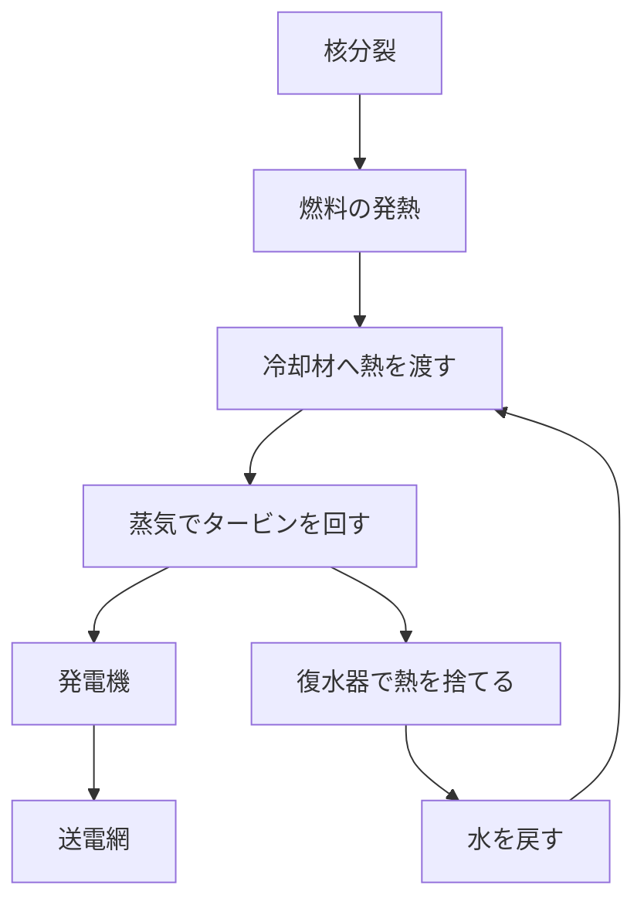
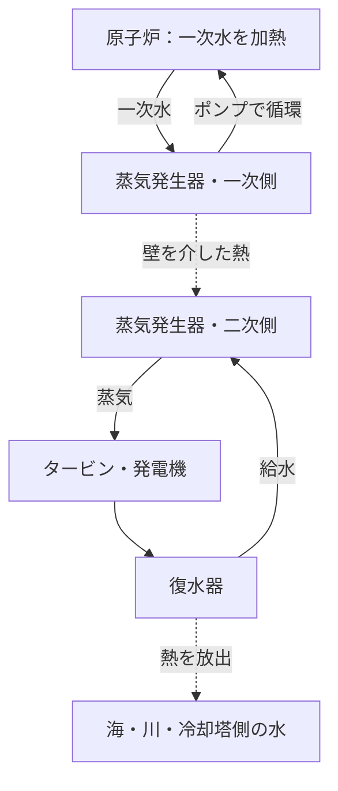

## 1. 原子力発電所の出口には、回転する発電機がある

原子力発電という言葉から、原子が直接電気を放出する装置を想像するかもしれません。しかし、現在広く使われる原子力発電所の大部分では、最後に電気を作るのはタービンにつながった発電機です。原子炉が熱を作り、その熱で蒸気を発生させ、蒸気の力でタービンを回します。

この大きな流れは、石炭や天然ガスの熱を使う蒸気発電と共通しています。違うのは熱の出所です。火力発電では主に化学反応、原子力発電では原子核の変化を使います。「核分裂」と「発電機」の間には、熱を運ぶ水、蒸気を作る装置、配管、タービン、復水器など、多くの機械が存在します。

この構造を理解すると、原子力の特徴も課題も見えやすくなります。少量の燃料から大きな熱を得られる一方、熱を運べなくなると燃料が過熱します。また、連鎖反応を止めても、それまでに生じた放射性物質が熱を出し続けます。**原子炉を止めることと、発電所を十分に冷えた状態にすることは同じではありません。**

本記事では、商用発電で広く使われる**軽水炉**を中心に説明します。図は役割を理解するための模式図で、実際の配管配置や運転手順を示すものではありません。核融合発電は軽い原子核を結合させる別方式であり、ここで扱う核分裂炉とは区別します。[米国エネルギー省の原子炉入門][doe-reactor]

## 2. 燃やすことと、原子核を変えることの違い

物質は原子からできています。原子の中心には陽子と中性子からなる原子核があり、その周囲に電子が存在します。石炭を燃やすと、炭素などの原子と酸素の結び付き方が変わります。これは主として電子が関わる化学反応であり、炭素の原子核そのものが別の元素へ変わるわけではありません。

核分裂では、重い原子核が二つの比較的軽い原子核などへ分かれます。反応前後で原子核の結び付き方が変わり、その差に対応するエネルギーが外へ出ます。原子核をばらばらの陽子と中性子に分けるのに必要なエネルギーを、結合エネルギーと呼びます。

ここで「強く結び付くほどエネルギーを放出する」という点が直感と逆に感じられるかもしれません。高い棚の上にある物体が低い位置へ落ちるとエネルギーを外へ渡すように、より低いエネルギーの状態へ移る差が取り出されます。単に「原子核を壊すからエネルギーが出る」のではありません。壊すだけならエネルギーを必要とする反応もあります。

核子一個あたりの結合エネルギーは、非常に軽い原子核から中程度の重さへ向かうと大きくなり、鉄やニッケル付近で大きな値をとります。このため、重い核を分ける核分裂と、軽い核を結び付ける核融合の両方で、適切な反応を選べばエネルギーを得られます。[ATOMICA：原子核の構造][binding]

質量とエネルギーの関係は、次の式で表せます。

$$
E=\Delta m c^2
$$

ここで $\Delta m$ は反応前後の静止質量の差、$c$ は光速です。燃料全体が消えて電気になるという意味ではありません。反応後も分裂片や中性子などは残り、差の一部が運動エネルギーや放射線として現れます。さらに発電所では、得られた熱のすべてを電気に変えられるわけでもありません。

## 3. 核分裂のエネルギーは、まず燃料を温める

軽水炉の代表的な核分裂性核種はウラン235です。ウラン235の原子核が中性子を吸収すると、励起した状態を経て分裂する場合があり、分裂片、中性子、ガンマ線などが生まれます。分裂後の核種の組合せは一通りではありません。「毎回必ず同じ二元素になる」と覚えるのは正しくありません。

放出エネルギーの大きな部分は、分裂片が高速で飛び出す運動エネルギーになります。分裂片は燃料内部の物質と衝突して減速し、そのエネルギーが熱へ変わります。熱は燃料から被覆管を通って冷却材へ移ります。核反応の瞬間から家庭のコンセントまで、エネルギーは何度も姿を変えているのです。

工学的な概算では、核分裂一回あたりに熱として利用できるエネルギーを約200 MeVとして扱います。中性微子が持ち去る分や、中性子捕獲で生じるエネルギーなどがあるため、厳密な収支は核種や対象範囲によって変わります。[ATOMICA：核分裂反応][fission]

1 eVは約 $1.602\times10^{-19}$ Jなので、200 MeVは約 $3.20\times10^{-11}$ Jです。一回だけでは非常に小さい値に見えます。しかし、原子は日常の量の物質にも膨大な数含まれています。

$$
\dot N\approx\frac{P_{\mathrm{th}}}{E_f}
$$

$P_{\mathrm{th}}$ は熱出力、$E_f$ は一回の核分裂あたりの熱、$\dot N$ は一秒あたりの核分裂回数です。熱出力30億Wをこの値で割ると、約 $9.4\times10^{19}$ 回／秒になります。これは出力の桁を理解するための計算であり、実炉の詳細な燃焼解析ではありません。

「少ない燃料で大出力」とは、核分裂一回が日常的に巨大な爆発を起こすという意味ではなく、単位質量あたりに取り出せるエネルギーが大きいという意味です。そして、その大量の微視的な反応を安定して続けるために、次の連鎖反応の制御が必要になります。

## 4. 「臨界」は、連鎖反応が一定に続く状態

一回の核分裂で生まれた中性子が別の核分裂を起こし、そこでまた中性子が生まれる。これが連鎖反応です。ただし、すべての中性子が次の核分裂に使われるわけではありません。燃料以外に吸収されるものや、炉心の外へ漏れるものもあります。

この収支を表す重要な量が、**実効増倍率** $k_{\mathrm{eff}}$ です。直感的には、ある世代の中性子が次の世代の中性子を何倍生むかを示します。

| 状態 | 条件 | 連鎖反応の大まかな傾向 |
|---|---|---|
| 未臨界 | $k_{\mathrm{eff}}<1$ | 外部中性子源などを別にすると衰える |
| 臨界 | $k_{\mathrm{eff}}=1$ | 世代間で釣り合い、一定に維持される |
| 超臨界 | $k_{\mathrm{eff}}>1$ | 増加する方向に向かう |

日常語の「危険な限界」と異なり、原子炉の臨界は、それだけで事故を意味しません。一定出力で運転する原子炉では、中性子の収支を釣り合わせます。逆に、単に臨界と分かっただけでは出力の大きさは分かりません。小さな出力での臨界も、大きな出力での臨界もあります。

ごく単純化して、世代ごとの中性子数を $N_g$ とすれば、次のモデルで増減の意味をつかめます。

$$
N_g=N_0\left(k_{\mathrm{eff}}\right)^g
$$

たとえば100世代後の比は、0.99なら約0.366、1.00なら1、1.01なら約2.70です。わずかな差でも積み重なることが分かります。ただし、この式には世代の時間、遅発中性子、温度変化、制御装置などが入っていません。**何秒で出力が何倍になるかを予測する式としては使えません。**

## 5. 減速材・制御材・冷却材は、別の仕事をする

原子炉に水や棒が入っていることを知っていても、それぞれの役割を混同すると仕組みが見えなくなります。特に重要なのが、減速、吸収、熱輸送の違いです。

**減速材**は、中性子の速度を落とします。核分裂で生まれた中性子は速いので、軽水炉では水中の原子核などとの衝突を通してエネルギーを下げます。ウラン235は、低いエネルギーの中性子に対して核分裂を起こす確率が大きくなる領域があり、これを利用します。

**制御材**は、中性子を吸収して連鎖反応に使われる数を減らします。制御棒などがその役割を担います。速度を落とすことと、反応に使われる中性子を取り除くことは別です。「制御棒で中性子をゆっくりにする」という説明では、機能を取り違えています。

**冷却材**は、燃料から熱を運び出します。軽水炉では同じ水が減速材と冷却材を兼ねますが、これは普遍的な組合せではありません。原子炉の種類によっては、減速材に黒鉛、冷却材にガスを使うなど、役割を別の物質に担わせます。[米国原子力規制委員会の原子炉教材][nrc-reactors]

| 機能 | 何を変えるか | 軽水炉での代表例 |
|---|---|---|
| 減速 | 中性子のエネルギー | 水 |
| 吸収・反応制御 | 連鎖反応に使える中性子の数 | 制御棒など |
| 冷却・熱輸送 | 燃料と系統の温度 | 循環する水 |
| 閉じ込め | 放射性物質の移動 | 被覆管、圧力境界、格納設備 |

水が二つの役割を持つため、水の温度や密度が変わると冷却だけでなく中性子の振る舞いにも影響します。原子炉は、核反応の装置と熱流体の装置が強く結び付いたシステムなのです。

## 6. 制御を可能にする遅発中性子と、温度のフィードバック

核分裂に伴う中性子の多くは、分裂の直後に生じる即発中性子です。一方、一部は分裂生成物の放射性崩壊を経て遅れて生まれます。これが**遅発中性子**です。割合は小さくても、原子炉の時間的な振る舞いに大きく影響します。

直ちに生まれる中性子だけで急激に反応が増える状態と、遅れて生まれる中性子を含めて釣り合う状態とでは、出力が変化する時間尺度が異なります。通常の制御では、この違いが重要です。人や機械があらゆる核分裂を一つずつ止めているわけではなく、中性子全体の収支を調整しています。[IAEA：原子核物理と原子炉理論][reactor-theory]

さらに、温度が上がると反応が弱まる方向に働く物理的な作用があります。燃料温度の上昇によりウラン238などの中性子吸収が変わるドップラー効果は、その代表です。これは炉心設計で重要な負のフィードバックになります。[ATOMICA：PWRの炉心設計][core-design]

ただし、「温度が上がれば必ず安全に止まる」と一般化してはいけません。減速材の密度、蒸気の割合、燃料状態による影響は炉型や運転状態によって変わります。物理的なフィードバック、計測、制御装置、停止設備を重ねて設計します。

もう一つ、時間差を生むのが核分裂生成物の変化です。たとえばキセノン135は中性子を強く吸収し、その量は出力の履歴に影響されます。発電所の出力調整は、単純に火のつまみを回すようにはいきません。現在の温度や出力だけでなく、少し前までどう運転していたかも、炉心の状態に関係します。

## 7. PWR：高圧の水で熱を運び、別の水を沸かす

PWRは加圧水型原子炉です。原子炉を通る一次系の水には高い圧力をかけ、炉心で熱を受けても全体として沸騰しにくい状態を保ちます。その熱い水を蒸気発生器へ送り、金属管などの壁を隔てて二次系の水へ熱を渡します。

二次系で生じた蒸気がタービンへ向かい、一次系の水は原子炉へ戻ります。一次系と二次系は、通常の状態では水そのものを混ぜずに熱を交換します。「高圧の原子炉水をそのままタービンへ送る」のがPWRの基本構造、という説明は誤りです。

この分離は、放射性物質を含み得る一次系とタービン側を分けるうえで意味があります。ただし、蒸気発生器の伝熱管などは両者の境界であるため、その健全性の確認が欠かせません。系統を分ければ点検が不要になるのではなく、重要な境界が増えるのです。

一次系の圧力を調整する加圧器、冷却材を循環させるポンプなども働きます。ここでは水の流れを簡略化していますが、実際には圧力・温度・水量を測り、適切に保つための補助系統が付属します。[DOE：PWRの仕組み][pwr]

## 8. BWR：原子炉で作った蒸気をタービンへ送る

BWRは沸騰水型原子炉です。こちらは原子炉内で水を沸騰させることを利用します。発生した蒸気から液滴を分離し、タービンへ送ります。蒸気は仕事をした後に復水器で水に戻り、給水として原子炉へ戻されます。

PWRと違い、炉心を通った水に由来する蒸気がタービン系統まで行くため、タービン周辺にも放射線管理上の配慮が必要です。一方、PWRのように一次系から二次系へ熱を渡す蒸気発生器は、基本的な蒸気サイクルにはありません。[NRC：沸騰水型原子炉][bwr]

| 比較点 | PWR | BWR |
|---|---|---|
| 主に蒸気を作る場所 | 蒸気発生器の二次側 | 原子炉内 |
| 炉心側の水の扱い | 高圧を保ち、バルクの沸騰を抑える | 炉心内の沸騰を利用する |
| タービンへ向かう流体 | 二次系の蒸気 | 原子炉で発生した蒸気 |
| 主な構成上の特徴 | 蒸気発生器を介して系統を分ける | 原子炉とタービンを直接の蒸気系統で結ぶ |
| 共通する課題 | 燃料冷却、停止、閉じ込め、熱の放出 | 燃料冷却、停止、閉じ込め、熱の放出 |

どちらも「水を使う」だけでは同じではありません。また、構造が単純に見えることだけで、安全性や経済性の優劣を即断することもできません。事故時に必要な機能、点検のしやすさ、材料、運転条件などを含めて比較する必要があります。

## 9. なぜ、熱をすべて電気にできないのか

蒸気タービンは、高温・高圧の蒸気が膨張する際のエネルギーを回転へ変えます。発電機はその回転を電磁誘導によって電気へ変えます。タービンを出た蒸気は復水器で冷やされ、水に戻ります。水に戻すと体積が大きく減り、蒸気を低圧側へ流れやすくするとともに、再びポンプで送りやすくなります。

ここで、冷却は損失を隠すための付属設備ではありません。熱機関が繰り返し仕事をするには、高温側から熱を受け取り、低温側へ一部を渡す必要があります。理想的な熱機関でも、温度差が有限である限り、熱を全部仕事へ変換することはできません。

$$
\eta_{\mathrm{Carnot}}=1-\frac{T_c}{T_h}
$$

温度 $T_h$ と $T_c$ は摂氏ではなく絶対温度Kで表します。高温側570 K、低温側300 Kという仮定なら、理想上限は約47%です。実際には、熱交換時の温度差、摩擦、蒸気の状態、タービンや発電機の損失などがあり、これより低くなります。この二温度モデルは説明用で、実際の蒸気サイクルの温度分布を二点で置き換えたものです。

軽水炉の発電効率の目安は、おおむね3分の1です。これは「核分裂が3分の1しか起きない」ことではなく、得られた熱のうち電気になる割合の話です。高温にできるほど熱効率を高めやすい一方、材料の耐熱性、腐食、圧力、燃料の安全限界などが制約になります。[ATOMICA：原子力発電所の温排水][thermal]

熱出力3,000 MW、効率を33%とする仮想的な発電所なら、電気出力は990 MW、残り約2,010 MWは熱として外へ出す必要があります。

$$
P_e=\eta P_{\mathrm{th}},\qquad
P_{\mathrm{out}}=P_{\mathrm{th}}-P_e
$$

これは補機動力などを細かく分けない概算です。実際には発電機の出力から、ポンプなど発電所自身が使う電力を差し引いた送電端出力も区別します。大きな冷却水設備がある理由は、この膨大な熱の処理にあります。海沿いの発電所は海水へ、内陸では川や冷却塔を通して環境へ熱を渡します。冷却塔の白い雲は通常、水滴として見えるものであり、見た目だけで放射性物質の放出量を判断することはできません。

## 10. 停止しても熱が残る――崩壊熱の重要性

制御棒などで連鎖反応を抑えると、核分裂による発熱は大きく減ります。しかし、炉内には運転中に生じた多数の放射性核種が残っています。それらが崩壊するときのエネルギーが熱になるため、**停止後も崩壊熱が発生します**。

電気ヒーターのスイッチを切って、蓄えられた熱が冷めていく状況だけを想像すると不十分です。原子炉では、すでに蓄積された熱に加えて、停止後にも新たな熱が生成されます。したがって、しばらく待つだけでなく、熱を運び出す経路を維持する必要があります。[IAEA：原子力安全の基本原則][safety-basics]

一種類の放射性核種の個数は、半減期 $T_{1/2}$ を使って次のように表せます。

$$
N(t)=N(0)\,2^{-t/T_{1/2}}
$$

半減期が短いものは速く減り、長いものはゆっくり減ります。ただし、使用済燃料には多くの核種があり、崩壊によって別の放射性核種も生じます。原子炉全体の崩壊熱を一つの半減期で表すことはできません。停止前の出力、運転期間、燃料組成も影響します。

規模感だけをつかむため、3,000 MWの熱出力の「1%」を考えると30 MWです。これは実際の特定時刻の崩壊熱を示す値ではありませんが、元の出力が大きい設備では小さな割合でも大きな熱源になることが分かります。百分率だけを見て「ほとんどゼロ」と考えるのは危険な読み方です。

停止、冷却、電源、計測は独立した言葉に見えて、実際にはつながっています。停止しても冷却が必要で、冷却にはポンプや弁が関わり、その状態を知るには計器が必要です。事故対策では、このつながりを途中で切らさない設計が重要になります。

## 11. 安全を支えるのは「止める・冷やす・閉じ込める」の連鎖

安全対策を一枚の厚い壁だけで理解することはできません。炉心での反応を抑える機能、熱を逃がす機能、放射性物質を外へ出しにくくする機能を、重ね合わせて維持します。

燃料ペレットは放射性物質の一部を内部にとどめ、被覆管が冷却材との境界になります。さらに原子炉の圧力境界や格納設備などが働きます。ただし、どの物質もすべて同じように保持されるわけではなく、事故時の温度や圧力で障壁の状態も変わります。「壁が何重だから絶対に漏れない」という数え方では不十分です。

設備を複数用意する**多重性**は、一台の故障への備えになります。しかし、同じ部屋の同じ高さに置いた機器は、浸水で同時に失われるかもしれません。異なる原理や電源を使う**多様性**、物理的に離す**独立性**も重要です。予備を増やすだけで、共通の原因による故障をなくせるわけではありません。

| 守りたい機能 | 失われたときの問題 | 設計で考える観点 |
|---|---|---|
| 反応の停止 | 発熱が十分に抑えられない | 複数の停止手段、計測、確実な作動 |
| 燃料の冷却 | 温度が上がり、燃料や構造物が損傷する | 熱の逃げ道、水源、電源、時間的余裕 |
| 閉じ込め | 放射性物質が移動・放出する | 障壁の健全性、圧力、漏えい管理 |
| 状態の把握 | 適切な判断が難しくなる | 計器の信頼性、電源、通信、訓練 |

受動的な安全設備は、重力や自然循環などを利用して、外部動力への依存を減らす考え方です。ただし「受動的」は、無条件・無期限に機能するという意味ではありません。水量、圧力差、熱を受け取る先、弁の状態などの成立条件があります。

福島第一原子力発電所の事故後、米国NRCも、設置済みの電源が使えなくなった状況で安全機能を維持する対策や、使用済燃料プールの監視などを強化しました。教訓は一つの装置名ではなく、外部災害が電源・冷却・計測を同時に傷め得るという、システム全体の見方にあります。[NRC：福島事故からの教訓への対応][fukushima]

## 12. 実験室の発見が、発電所になるまで

原子力発電の歴史では、「核分裂を発見した」「連鎖反応を維持した」「電気を作った」「電力網へ供給した」を区別すると流れが整理できます。これらは一つの発明で同時に達成されたわけではありません。

1938年末のハーンとシュトラスマンの実験結果を受け、マイトナーとフリッシュは核が分裂するという物理的解釈を示しました。この発見は、原子核の内部から大きなエネルギーを取り出せる可能性を開きました。しかし、反応が起こることと、安定して利用できることは別です。[米国物理学会：核分裂の発見と解釈][discovery]

1942年12月2日、フェルミらはシカゴ・パイル1で制御された自続的な連鎖反応を実現しました。これは電力会社の発電所ではなく、連鎖反応を人為的に維持できることを確かめた重要な段階です。研究は第二次世界大戦中の軍事計画とも深く結び付いており、後の平和利用だけを切り離して語ることはできません。[アルゴンヌ国立研究所：CP-1][cp1]

1951年には米国の実験炉EBR-Iが電気を作り、電球を点灯させました。1954年には旧ソ連のオブニンスクで原子炉による電力が電力網へ供給されました。その後、船舶用原子炉や発電実証で蓄えられた知識、材料製造、蒸気機関の技術、規制制度などが商用発電へつながっていきます。[アイダホ国立研究所：EBR-I][ebr]、[IAEAの歴史資料][iaea-history]

| 段階 | 問い | 必要になる技術 |
|---|---|---|
| 核反応の理解 | なぜエネルギーが出るか | 核物理、測定 |
| 自続反応の実証 | 反応を続けて制御できるか | 中性子収支、制御、遮へい |
| 発電の実証 | 熱を機械・電気へ渡せるか | 冷却材、熱交換器、タービン |
| 商用化 | 長く安定して供給できるか | 材料、保守、燃料供給、運用体制 |
| 長期的な利用 | 廃止まで責任を持てるか | 規制、廃棄物管理、費用、社会的合意 |

こうして見ると、原子力発電は「すごい物理現象を見つけたので発電所ができた」という直線的な歴史ではありません。反応を起こすことよりも、材料を長期間健全に保ち、停止や点検を含めて管理することに、多くの工学的努力が必要だったのです。

## 13. 燃料は、鉱石のまま炉に入れるわけではない

ウラン燃料は採掘から始まり、加工、必要な同位体組成への調整、燃料製造、使用、使用後の管理へ進みます。この全体を燃料サイクルと呼びます。「サイクル」という言葉でも、すべてが同じ場所へ戻るとは限りません。一度使った燃料を直接処分する方針と、一部の物質を回収して再利用する方針があります。

天然ウランの大部分はウラン238で、ウラン235は約0.7%です。一般的な軽水炉燃料ではウラン235の割合を数%へ高めたものを使います。その燃料は通常、二酸化ウランの小さな焼結体であるペレットに加工され、金属の被覆管に収められます。多数の燃料棒をまとめたものが燃料集合体です。[IAEA：原子力発電の基礎][fuel-basics]

燃料は運転中に変化します。核分裂性の核種が消費され、核分裂生成物が蓄積し、中性子の吸収によって新しい核種も生まれます。「初めに入れたウラン235だけを、そのまま最後まで燃やす」という単純な過程ではありません。

また、燃料を交換するのは、すべてのウランがなくなったからとは限りません。反応の維持、吸収する生成物の蓄積、材料の健全性、炉心全体の出力分布などを考慮します。化学的に燃料が残っていることと、安全で経済的に使い続けられることは別です。

燃料製造の品質管理も重要です。燃料が出す熱を外へ渡す道筋には、ペレット、隙間、被覆管、冷却材があります。どこかで熱が伝わりにくくなれば、同じ出力でも内部温度が変わります。核物理だけでなく、材料科学と熱伝達が燃料設計を支えています。[DOE：核燃料サイクル][fuel-cycle]

## 14. 使用済燃料と廃棄物――「保管」と「処分」は違う

原子炉から取り出した直後の使用済燃料は、放射線を出し、崩壊熱も持っています。まず水を使った貯蔵などで冷却と遮へいを行い、その後、条件を満たせば乾式貯蔵などへ移す方法があります。具体的な期間や条件は燃料や設備によって異なります。

水は熱を取り去ると同時に、放射線を弱める役割も果たします。乾式貯蔵では、容器や周囲の構造が閉じ込めと遮へいを担い、熱を外へ逃がす設計をとります。「水から出せばもう放射線がなくなった」という意味ではありません。

**貯蔵は将来の取り出しや管理を前提とすることが多く、処分は長期の隔離を目指す別の段階です。** 再処理する方針でも、不要な物質や処理に伴う廃棄物は残ります。再利用を選べば廃棄物問題が消える、という説明は正確ではありません。[IAEA：使用済燃料の貯蔵][spent-fuel]

放射性廃棄物も一種類ではありません。運転・保守で生じる物、解体で生じる物、使用済燃料や再処理に関係する物では、含まれる核種、放射能、発熱、量が違います。必要な管理方法を考えるには、「放射性」という一語ではなく、何がどれだけ含まれ、どの経路で人や環境に届く可能性があるかを見る必要があります。

地層処分では、廃棄物の形態、容器、埋め戻し材、地質などを組み合わせて移動を抑える考え方が使われます。長い時間を扱うため、実験、観測、地下水の理解、モデル計算を組み合わせて評価します。技術的な成立性に加え、立地の選定、監視、責任の所在、地域との対話が重要になります。

将来必要になる管理を後回しにすると、発電の費用と便益が見えにくくなります。発電中の燃料費だけでなく、取り出した後、発電所を閉じた後まで含めて考える必要があります。

## 15. 原子力を比較するときは、出力・電力量・費用を分ける

発電所の「100万kW」は、ある瞬間にどれほど電力を供給できるかという出力です。一方、kWhは時間をかけて供給した電力量です。この違いを混同すると、発電所の規模と実際の貢献を正しく比較できません。

出力1 GWの発電所が、年間を通じて平均的に定格の90%に相当する発電をしたという仮定なら、電力量は約7.884 TWhになります。

$$
E_{\mathrm{year}}=P_{\mathrm{rated}}\times8760\,\mathrm{h}\times CF
$$

$CF$ は設備利用率であり、故障の少なさだけを表す指標ではありません。燃料交換、点検、需要に応じた抑制、規制上の停止なども結果に反映されます。この90%は計算用の仮定で、どの国や発電所にも当てはまる保証値ではありません。

原子力は燃料のエネルギー密度が高く、運転時に化石燃料を燃焼させない低炭素電源です。ただし、採掘、燃料加工、建設、廃止措置などまで含めれば温室効果ガス排出はゼロではありません。比較には同じ範囲のライフサイクル評価を使う必要があります。[IPCC第6次評価報告書・エネルギーシステム][ipcc]

経済性では、建設期間と初期投資が重要です。完成までの時間が長くなると、工事費だけでなく資金調達の負担も変わります。既存設備を延長して使う場合と、初めから新設する場合を同じ条件として論じるべきではありません。

さらに、電力系統全体では、需要の変動、他の電源、送電容量、蓄電、停止時の予備力も関係します。「原子力は出力を変えられない」という断定も、「いつでも自由に追従できる」という断定も粗すぎます。技術的な調整能力と、燃料管理・保守・経済性を含めた実際の運用は区別します。

## 16. 小型炉や新型炉は、何を変えようとしているのか

小型モジュール炉、いわゆるSMRは、小さな出力単位やモジュール化によって製造・建設・配置などを変えようとする考え方です。ただし、SMRは一つの核反応方式の名前ではありません。軽水炉型もあれば、別の冷却材や炉心概念を使う設計もあります。[IAEA：SMRとは何か][smr]

一台を小さくすると、工場で製造しやすくなったり、一度に投じる資金を小さくできたりする可能性があります。一方、大型化による規模の経済を得にくくなります。量産による効果も、実際に何台作り、どこまで同じ設計を使え、規制や供給網をどう整えるかで変わります。

高温の熱を産業へ供給する炉、速い中性子を利用する炉、異なる冷却材を使う炉なども研究・開発されています。目標は、熱の利用範囲、燃料資源の利用、廃棄物の性質、安全機能、建設方法などさまざまです。ある特徴を改善したから、ほかの課題も同時に解決したとは限りません。

新型炉の記事を読むときは、設計案、試験設備、実証炉、商用運転を区別しましょう。「計画されている」と「長期間にわたって実際に運転できている」には大きな距離があります。技術の可能性を評価するには、達成したことと、今後確かめるべきことの境界を見ることが大切です。

## 17. ニュースを読むための、五つの確認点

原子力発電の話題を理解するときは、賛否の結論に急ぐ前に、次の五点を確認すると議論の位置が分かります。

1. **何の出力か。** 原子炉の熱出力、発電機の電気出力、送電端出力は同じ数値ではありません。
2. **どの状態か。** 運転中、停止直後、長期停止、燃料取り出し後では、残る熱や必要な設備が違います。
3. **どの境界を見ているか。** 炉心、一次系、建屋、敷地、環境では、対象となる物質や現象が異なります。
4. **何を測っているか。** 放射能を表すBq、単位質量あたりの吸収エネルギーである吸収線量を表すGy、放射線影響の評価に用いるSvは、違う量の単位です。数字だけを並べて比較できません。[NRC：放射線の測定][radiation]
5. **どの期間と費用を含むか。** 発電中だけか、燃料供給、建設、廃止、廃棄物管理までかで評価が変わります。

線量などの健康影響を評価するには、放射線の種類、被ばく経路、時間、測定条件などが必要です。ここでは単位の意味を区別するにとどめ、個別の健康判断を単純な数値だけで行いません。

原子力発電の中心にあるのは、核分裂で熱を得る物理です。しかし、社会で使える電源にするのは、その熱を安全に運び、電気へ変え、止めた後も管理する工学です。**「熱を作れるか」だけでなく、「どこへ熱が流れるか」「流れが止まったらどうするか」「使い終えた物を誰が管理するか」まで追うこと。** それが、原子力発電を仕組みから理解する近道です。

## 参考資料と図の位置付け

本文の数値例は、条件を明示した学習用の概算です。実際の設備性能や安全余裕を算定するものではありません。アイキャッチはAI生成の概念イラストで、機器の寸法・配管・色は実機の設計図を表しません。

- [DOE：原子炉の仕組み][doe-reactor]
- [ATOMICA：原子核の構造][binding]、[核分裂反応][fission]
- [NRC：原子炉と発電の教材][nrc-reactors]、[BWR][bwr]
- [IAEA：原子核物理と原子炉理論][reactor-theory]、[原子力安全の基本原則][safety-basics]
- [ATOMICA：PWRの炉心設計][core-design]、[温排水][thermal]
- [DOE：PWRの解説][pwr]、[核分裂][doe-fission]、[核燃料サイクル][fuel-cycle]
- [NRC：福島事故の教訓への対応][fukushima]
- [アルゴンヌ国立研究所：CP-1][cp1]、[アイダホ国立研究所：EBR-I][ebr]
- [IAEA：歴史資料][iaea-history]、[燃料の基礎][fuel-basics]、[使用済燃料の貯蔵][spent-fuel]、[SMR][smr]
- [IPCC：第6次評価報告書、第3作業部会、第6章][ipcc]
- [米国物理学会：核分裂の発見と解釈][discovery]、[NRC：放射線の測定][radiation]

[doe-reactor]: https://www.energy.gov/ne/articles/nuclear-101-how-does-nuclear-reactor-work
[binding]: https://atomica.jaea.go.jp/data/detail/dat_detail_03-06-03-01.html
[fission]: https://atomica.jaea.go.jp/data/detail/dat_detail_03-06-03-04.html
[nrc-reactors]: https://www.nrc.gov/education-regulatory-research/the-student-corner/unit-3-nuclear-reactorsenergy-generation
[reactor-theory]: https://gnssn.iaea.org/main/bptc/BPTC%20Module%20Documents/Module01%20Nuclear%20physics%20and%20reactor%20theory.pdf
[core-design]: https://atomica.jaea.go.jp/data/detail/dat_detail_02-04-02-01.html
[pwr]: https://www.energy.gov/ne/articles/infographic-how-does-pressurized-water-reactor-work
[bwr]: https://www.nrc.gov/reactors/power/bwrs
[thermal]: https://atomica.jaea.go.jp/data/detail/dat_detail_01-04-03-02.html
[safety-basics]: https://gnssn.iaea.org/main/bptc/BPTC%20Module%20Documents/Module03%20Basic%20principles%20of%20nuclear%20safety.pdf
[fukushima]: https://www.nrc.gov/regulations-legislation/fact-sheets-brochures/backgrounder-on-nrc-response-to-lessons-learned-from-fukushima
[doe-fission]: https://www.energy.gov/science/doe-explainsnuclear-fission
[cp1]: https://www.ne.anl.gov/About/cp1-pioneers/
[ebr]: https://inl.gov/ebr/
[iaea-history]: https://www-pub.iaea.org/MTCD/Publications/PDF/Pub1032_web.pdf
[fuel-basics]: https://nucleus-qa.iaea.org/sites/graphiteknowledgebase/wiki/Guide_to_Graphite/Fundamentals%20of%20Nuclear%20Power.aspx
[fuel-cycle]: https://www.energy.gov/ne/nuclear-fuel-cycle
[spent-fuel]: https://nucleus-apps.iaea.org/nss-oui/Content/Index?CollectionId=m_f7375b40-3d77-4ea5-a2e3-77090916bc67__8_0&type=PublishedCollection
[ipcc]: https://www.ipcc.ch/report/ar6/wg3/chapter/chapter-6/
[smr]: https://www.iaea.org/newscenter/news/what-are-small-modular-reactors-smrs
[discovery]: https://journals.aps.org/prl/50years/timeline
[radiation]: https://www.nrc.gov/facilities-safety/radiation-protection/radiation-and-its-health-effects/measuring-radiation
