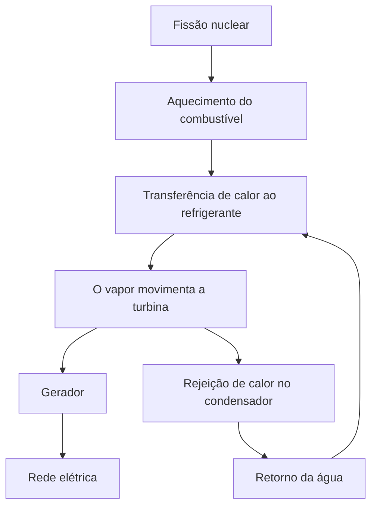
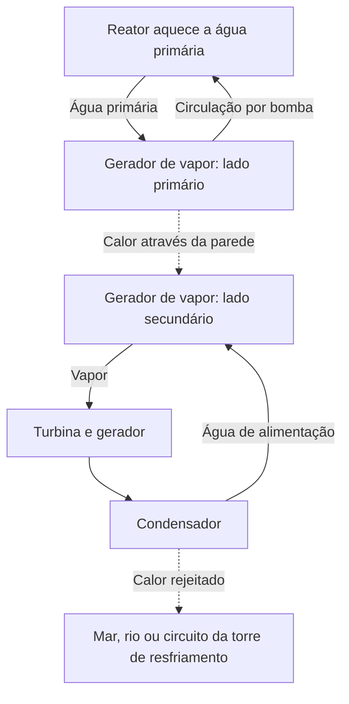

## 1. No fim do processo, há um gerador girando

A expressão energia nuclear pode sugerir uma máquina que retira eletricidade diretamente dos átomos. Na maioria das usinas em operação, porém, quem produz a eletricidade é um gerador acoplado a uma turbina. O reator fornece calor, o calor produz vapor e o vapor movimenta a turbina.

Esse caminho geral também aparece nas usinas a vapor que utilizam carvão ou gás natural. O que muda é a origem do calor: reações químicas nas usinas fósseis e transformações dos núcleos atômicos nas nucleares. Entre a fissão e o gerador existem água em circulação, equipamentos de produção de vapor, tubulações, turbina e condensador.

Acompanhar essa sequência esclarece tanto as vantagens quanto as dificuldades. Pouco combustível pode fornecer muito calor, mas ele superaquece se não houver uma maneira de remover esse calor. Mesmo depois de interromper a reação em cadeia, os materiais radioativos já produzidos continuam liberando energia. **Parar o reator não equivale a deixar a usina suficientemente fria.**

O foco deste artigo são os **reatores de água leve**, amplamente utilizados na geração comercial. Os diagramas mostram funções, não projetos de tubulação nem procedimentos de operação. A fusão une núcleos leves e é diferente da fissão abordada aqui. [Introdução do Departamento de Energia dos EUA][doe-reactor]

## 2. Queimar combustível e transformar núcleos são processos diferentes

A matéria é formada por átomos. No centro de cada átomo está o núcleo, composto por prótons e nêutrons, cercado por elétrons. Na queima de carvão, mudam as ligações entre átomos como carbono e oxigênio. Essa reação química envolve principalmente os elétrons; o núcleo de carbono não se transforma no de outro elemento.

Na fissão, um núcleo pesado se divide em dois núcleos relativamente mais leves e outros produtos. A energia liberada corresponde à diferença entre as energias das configurações nucleares inicial e final. Chamamos de energia de ligação a energia necessária para separar um núcleo em prótons e nêutrons individuais.

Parece estranho que uma configuração mais fortemente ligada possa liberar energia. Imagine um objeto caindo de uma prateleira: ao passar a um estado de menor energia, ele libera a diferença. Não é o simples ato de romper algo que cria energia. Há reações que, ao contrário, exigem fornecimento de energia.

A energia de ligação por núcleon tende a crescer dos núcleos muito leves até os de massa intermediária, atingindo valores elevados perto do ferro e do níquel. Por isso, determinadas reações liberam energia tanto ao dividir núcleos pesados quanto ao unir núcleos leves. [ATOMICA: estrutura nuclear][binding]

A relação entre a diferença de massa e a energia é:

$$
E=\Delta m c^2
$$

Aqui, $\Delta m$ representa a diferença de massa de repouso e $c$, a velocidade da luz. Isso não significa que todo o combustível desapareça e vire eletricidade. Restam fragmentos e nêutrons; a diferença aparece como energia cinética e radiação. Além disso, a usina não consegue converter todo o calor resultante em eletricidade.

## 3. A energia da fissão primeiro aquece o combustível

O urânio-235 é um exemplo de isótopo físsil empregado em reatores de água leve. Ao absorver um nêutron, seu núcleo pode atingir um estado excitado e se dividir, emitindo fragmentos, nêutrons e radiação gama. As combinações de fragmentos variam: nem toda fissão produz exatamente os mesmos dois elementos.

Grande parte da energia é transportada por fragmentos que se movem rapidamente. Ao colidir com o material ao redor, eles desaceleram e aquecem o combustível. O calor atravessa então o revestimento do combustível e chega ao refrigerante. Até alcançar uma tomada, a energia passa por várias transformações.

Para estimativas de engenharia, cerca de 200 MeV de calor por fissão é um valor útil. Neutrinos levam embora parte da energia, enquanto a captura de nêutrons também pode fornecer energia; o balanço detalhado depende dos isótopos e dos limites do sistema considerado. [ATOMICA: reações de fissão][fission]

Um elétron-volt corresponde a aproximadamente $1{,}602\times10^{-19}$ J. Assim, 200 MeV equivalem a cerca de $3{,}20\times10^{-11}$ J. É pouco para um único evento, mas quantidades comuns de matéria contêm um número enorme de átomos.

$$
\dot N\approx\frac{P_{\mathrm{th}}}{E_f}
$$

$P_{\mathrm{th}}$ é a potência térmica, $E_f$ é o calor por fissão e $\dot N$ é o número de fissões por segundo. Dividir 3 bilhões de watts pela energia acima fornece aproximadamente $9{,}4\times10^{19}$ fissões por segundo. O cálculo ilustra a escala; não substitui um cálculo detalhado do combustível de um reator.

Obter muita potência com pouco combustível significa ter alta densidade de energia por unidade de massa. Não significa que cada fissão seja uma explosão macroscópica. Para manter esses eventos microscópicos de forma regular, é necessário controlar a reação em cadeia.

## 4. Criticidade significa equilíbrio da reação em cadeia

Um nêutron emitido em uma fissão pode provocar outra fissão, que libera mais nêutrons. Essa é a reação em cadeia. Nem todos participam: alguns são absorvidos sem provocar fissão e outros escapam do núcleo do reator.

O **fator de multiplicação efetivo**, $k_{\mathrm{eff}}$, expressa esse balanço. Conceitualmente, ele indica como a população de nêutrons muda de uma geração para a seguinte.

| Estado | Condição | Tendência geral |
|---|---|---|
| Subcrítico | $k_{\mathrm{eff}}<1$ | A cadeia diminui, desconsiderando fontes externas |
| Crítico | $k_{\mathrm{eff}}=1$ | As gerações sucessivas se equilibram |
| Supercrítico | $k_{\mathrm{eff}}>1$ | A cadeia tende a crescer |

A palavra crítico, nesse contexto, não significa por si só uma emergência. Um reator em potência constante equilibra produção e perda de nêutrons. A criticidade também não determina a potência: o reator pode estar crítico em baixa ou alta potência.

Um modelo de gerações deliberadamente simplificado é:

$$
N_g=N_0\left(k_{\mathrm{eff}}\right)^g
$$

Depois de 100 gerações, a razão entre a população final e a inicial é aproximadamente 0,366 para 0,99; 1 para 1,00; e 2,70 para 1,01. Pequenas diferenças se acumulam. Porém, essa equação não inclui o tempo entre gerações, nêutrons atrasados, mudanças de temperatura nem os equipamentos de controle. **Ela não permite prever quantos segundos leva uma variação real de potência.**

## 5. Moderador, absorvedor e refrigerante têm funções distintas

Saber que o reator contém água e barras não basta se confundirmos suas funções. Reduzir a energia dos nêutrons, absorvê-los e transportar calor são tarefas diferentes.

O **moderador** reduz a energia dos nêutrons. Os nêutrons de fissão nascem rápidos; em um reator de água leve, colisões com núcleos da água os desaceleram. O projeto aproveita a maior probabilidade de fissão do urânio-235 em uma região de baixa energia dos nêutrons.

Um **absorvedor de controle** captura nêutrons e reduz a quantidade disponível para sustentar a cadeia. As barras de controle cumprem essa função. Desacelerar um nêutron não é o mesmo que retirá-lo da cadeia; dizer que as barras apenas desaceleram nêutrons mistura dois mecanismos.

O **refrigerante** remove calor do combustível. Nos reatores de água leve, a água atua como moderador e refrigerante, mas essa combinação não é universal. Outros tipos podem empregar grafite como moderador e gás como refrigerante. [Material didático da NRC][nrc-reactors]

| Função | O que modifica | Exemplo em reatores de água leve |
|---|---|---|
| Moderação | Energia dos nêutrons | Água |
| Absorção e controle da reação | Nêutrons disponíveis para a cadeia | Barras e outros absorvedores |
| Resfriamento e transporte de calor | Temperaturas do combustível e dos sistemas | Água em circulação |
| Confinamento | Movimento de substâncias radioativas | Revestimento, fronteira de pressão e contenção |

Como a água desempenha duas funções, sua temperatura e densidade afetam tanto o resfriamento quanto o comportamento dos nêutrons. Física nuclear, transferência de calor e escoamento de fluidos estão fortemente acoplados.

## 6. Nêutrons atrasados e realimentação de temperatura

A maioria dos nêutrons de fissão é emitida prontamente. Uma pequena parcela surge mais tarde, após o decaimento radioativo de produtos de fissão. Apesar de poucos, esses **nêutrons atrasados** alteram profundamente a escala de tempo do comportamento do reator.

Uma cadeia sustentada e amplificada rapidamente apenas por nêutrons prontos se comporta de maneira diferente de uma que depende dos atrasados para se equilibrar. Essa distinção é essencial para o controle normal. Pessoas e máquinas não interrompem cada fissão individualmente; ajustam o balanço global de nêutrons. [IAEA: física nuclear e teoria de reatores][reactor-theory]

Alguns efeitos físicos reduzem a reatividade quando a temperatura aumenta. O efeito Doppler modifica a absorção de nêutrons pelo urânio-238 e outros isótopos com o aquecimento do combustível, oferecendo uma importante realimentação negativa no projeto do núcleo. [ATOMICA: projeto do núcleo de PWR][core-design]

Isso não permite afirmar que aquecer sempre faz qualquer reator parar com segurança. Os efeitos da densidade do moderador, da fração de vapor e das condições do combustível dependem do projeto e do estado de operação. A realimentação física trabalha junto com instrumentos, sistemas de controle e equipamentos de desligamento.

Os produtos de fissão acrescentam uma dependência do histórico. O xenônio-135 absorve fortemente nêutrons, e sua quantidade depende da potência anterior. Ajustar a produção não é apenas girar o botão de uma chama: o passado operacional importa, além da temperatura e da potência atuais.

## 7. PWR: água pressurizada aquece outro circuito

Um reator de água pressurizada, ou PWR, mantém o refrigerante primário em alta pressão para evitar ebulição generalizada enquanto recebe calor no núcleo. A água quente passa por um gerador de vapor, onde transfere calor através de uma parede metálica para a água do circuito secundário.

O vapor secundário segue para a turbina; a água primária retorna ao reator. Em condições normais, há transferência de calor sem mistura entre as águas. Enviar a água do reator diretamente à turbina não é a configuração básica de um PWR.

Essa separação mantém o refrigerante primário potencialmente radioativo afastado do circuito da turbina. Contudo, os tubos do gerador de vapor são uma barreira importante e precisam de inspeção. Separar circuitos não elimina a manutenção: cria uma fronteira cuja integridade precisa ser preservada.

Um pressurizador regula a pressão primária, enquanto bombas fazem circular o refrigerante. A instalação também dispõe de sistemas auxiliares para medir e manter pressão, temperatura e inventário de água. [DOE: funcionamento de um PWR][pwr]

## 8. BWR: o vapor nasce dentro do reator

No reator de água fervente, ou BWR, a água entra intencionalmente em ebulição dentro do reator. As gotas líquidas são separadas do vapor antes de sua entrada na turbina. Depois de realizar trabalho, o vapor se condensa e retorna como água de alimentação.

Ao contrário do PWR, o vapor originado na água que passou pelo núcleo chega ao circuito da turbina, que também exige controles radiológicos. O ciclo básico não utiliza um gerador de vapor separado, como o do PWR, para trocar calor entre os circuitos primário e secundário. [NRC: reatores BWR][bwr]

| Característica | PWR | BWR |
|---|---|---|
| Principal local de produção de vapor | Lado secundário do gerador de vapor | Interior do reator |
| Água no núcleo | Alta pressão evita ebulição generalizada | A ebulição faz parte do funcionamento |
| Fluido enviado à turbina | Vapor secundário | Vapor produzido no reator |
| Configuração principal | Circuitos separados pelo gerador de vapor | Ligação direta de vapor entre reator e turbina |
| Necessidades comuns | Resfriar, desligar, confinar e rejeitar calor | Resfriar, desligar, confinar e rejeitar calor |

Ambos usam água, mas os sistemas diferem. A simplicidade aparente não determina sozinha a segurança nem o custo. É preciso comparar funções em acidentes, acesso para inspeção, materiais e condições operacionais.

## 9. Por que não transformar todo o calor em eletricidade?

A turbina converte a expansão de vapor quente e pressurizado em rotação. O gerador transforma a rotação em eletricidade por indução eletromagnética. O condensador volta a transformar o vapor em água. A grande redução de volume favorece baixa pressão na saída da turbina e facilita bombear novamente o fluido.

O resfriamento não é um acessório para esconder ineficiência. Uma máquina térmica cíclica recebe calor de uma fonte quente e precisa rejeitar parte dele a uma fonte fria. Mesmo uma máquina ideal, operando entre temperaturas finitas, não converte todo o calor em trabalho.

$$
\eta_{\mathrm{Carnot}}=1-\frac{T_c}{T_h}
$$

As temperaturas são absolutas, em kelvin, não em graus Celsius. Para uma fonte quente hipotética de 570 K e uma fria de 300 K, o limite ideal é cerca de 47%. Trocadores de calor reais, atrito, condições do vapor, turbinas e geradores reduzem ainda mais o rendimento. O exemplo de duas temperaturas simplifica um ciclo real, em que há uma distribuição de temperaturas.

Como ordem de grandeza, uma usina nuclear de água leve converte cerca de um terço do calor em eletricidade. Isso não significa que apenas um terço das fissões aconteça: trata-se da fração do calor convertida. Temperaturas maiores podem elevar o rendimento, mas materiais, corrosão, pressão e limites do combustível impõem restrições. [ATOMICA: calor rejeitado][thermal]

Uma usina hipotética com 3.000 MW térmicos e rendimento de 33% produziria 990 MW elétricos e rejeitaria aproximadamente 2.010 MW de calor.

$$
P_e=\eta P_{\mathrm{th}},\qquad
P_{\mathrm{out}}=P_{\mathrm{th}}-P_e
$$

Esse balanço simples não discrimina o consumo dos equipamentos auxiliares. Na prática, distinguem-se a potência do gerador e a potência líquida entregue à rede após o consumo de bombas e outros equipamentos. O calor restante exige grandes sistemas de resfriamento. Usinas costeiras podem transferi-lo ao mar; no interior, podem usar rios ou torres. A pluma branca de uma torre costuma ser formada por gotículas de água: sua aparência, isoladamente, não permite avaliar liberações radioativas.

## 10. Calor de decaimento: desligar não acaba com o aquecimento

Barras de controle e outras medidas de desligamento reduzem fortemente o calor da reação em cadeia. Entretanto, permanecem no núcleo muitos isótopos radioativos produzidos durante a operação. Seu decaimento libera energia: **o calor de decaimento continua depois da parada**.

A comparação com desligar um aquecedor elétrico é incompleta. O reator tem calor armazenado e continua produzindo calor novo. Não basta esperar: precisa existir um caminho funcional para removê-lo. [IAEA: princípios básicos de segurança][safety-basics]

Para um único isótopo radioativo, o número de átomos restantes segue:

$$
N(t)=N(0)\,2^{-t/T_{1/2}}
$$

$T_{1/2}$ é sua meia-vida. Isótopos de meia-vida curta diminuem rapidamente; os de meia-vida longa, lentamente. Mas o combustível usado contém muitos isótopos e cadeias de decaimento. Uma única meia-vida não descreve o calor residual total. Potência anterior, duração da operação e composição do combustível também influenciam o resultado.

Para visualizar a escala, 1% de 3.000 MW ainda equivale a 30 MW. Isso não é uma estimativa do calor de decaimento em um instante específico após o desligamento. Apenas mostra que uma pequena porcentagem de uma grande potência ainda pode ser relevante. Uma porcentagem pequena não deve ser confundida com zero.

Desligamento, resfriamento, alimentação elétrica e medição estão conectados. O resfriamento continua necessário; bombas e válvulas podem ser exigidas, e instrumentos indicam seu estado. As medidas para acidentes precisam preservar essa cadeia de funções.

## 11. Segurança significa desligar, resfriar e confinar

A segurança não se resume a uma parede grossa. Ela combina a capacidade de reduzir a reação, retirar calor e impedir que substâncias radioativas escapem.

As pastilhas de combustível retêm parte dos produtos radioativos, e o revestimento separa combustível e refrigerante. A fronteira de pressão e a contenção fornecem barreiras adicionais. Nem todas as substâncias são retidas da mesma maneira, e temperaturas ou pressões de acidente podem alterar essas barreiras. Contar paredes não demonstra impossibilidade de vazamento.

A **redundância** oferece alternativas quando um equipamento falha. Porém, vários equipamentos na mesma sala e na mesma altura podem ser inundados juntos. Também importam a **diversidade**, com diferentes princípios ou fontes de alimentação, e a **independência**, incluindo separação física. Mais cópias idênticas não eliminam falhas de causa comum.

| Função | Consequência de sua perda | Aspectos de projeto |
|---|---|---|
| Interromper a reação | Produção de calor insuficientemente reduzida | Métodos de desligamento, medição e atuação confiável |
| Resfriar o combustível | Superaquecimento e possível dano ao combustível e às estruturas | Caminhos de remoção de calor, água, energia e margens de tempo |
| Confinar materiais | Deslocamento ou liberação de substâncias radioativas | Integridade das barreiras, pressão e controle de vazamentos |
| Conhecer o estado da usina | Dificuldade para decidir | Instrumentos confiáveis, energia, comunicação e treinamento |

A segurança passiva utiliza fenômenos como gravidade e circulação natural para reduzir a dependência de equipamentos acionados por energia. Passivo não significa incondicional nem ilimitado. Quantidade de água, diferenças de pressão, posição de válvulas e disponibilidade de uma fonte fria continuam impondo condições.

Após Fukushima Daiichi, a NRC reforçou medidas para manter funções de segurança sem as fontes elétricas instaladas e para monitorar piscinas de combustível usado. A lição mais ampla é que um evento externo pode comprometer simultaneamente energia, resfriamento e instrumentação. [NRC: lições de Fukushima][fukushima]

## 12. Da descoberta física à usina

Descobrir a fissão, demonstrar uma cadeia sustentada, gerar eletricidade e fornecê-la a uma rede foram marcos diferentes.

Após os resultados experimentais obtidos por Hahn e Strassmann no fim de 1938, Meitner e Frisch explicaram o fenômeno como uma divisão nuclear. Isso revelou a possibilidade de extrair grande quantidade de energia do núcleo. Demonstrar uma reação, contudo, ainda era diferente de utilizá-la com confiabilidade. [Sociedade Americana de Física: descoberta e interpretação][discovery]

Em 2 de dezembro de 1942, a equipe de Fermi conseguiu uma reação em cadeia controlada e autossustentada no Chicago Pile-1. Não era uma usina comercial. A experiência comprovou uma capacidade física fundamental em pesquisas profundamente ligadas aos programas militares da guerra; o uso civil posterior não apaga esse contexto. [Argonne: CP-1][cp1]

Em 1951, o EBR-I, nos Estados Unidos, gerou eletricidade e acendeu lâmpadas. Em 1954, o reator de Obninsk, na União Soviética, forneceu eletricidade a uma rede. Conhecimentos de reatores experimentais e navais, fabricação de materiais, máquinas a vapor e desenvolvimento regulatório contribuíram depois para a geração comercial. [Laboratório Nacional de Idaho: EBR-I][ebr], [História da IAEA][iaea-history]

| Etapa | Pergunta principal | Capacidades necessárias |
|---|---|---|
| Entender a reação | Por que ela libera energia? | Física nuclear e medição |
| Sustentar a cadeia | É possível mantê-la sob controle? | Balanço de nêutrons, controle e blindagem |
| Demonstrar geração elétrica | O calor pode movimentar máquinas e gerar eletricidade? | Refrigerantes, trocadores de calor e turbinas |
| Operar comercialmente | O fornecimento pode ser confiável durante anos? | Materiais, manutenção, combustível e organização operacional |
| Assumir responsabilidade duradoura | É possível administrar todo o ciclo de vida? | Regulação, resíduos, custos e acordo social |

A energia nuclear não resultou automaticamente de uma descoberta fascinante. Preservar materiais e organizar manutenção, desligamentos e longos períodos de serviço exigiu muita engenharia além de simplesmente produzir a reação.

## 13. O combustível não entra no reator como minério

O combustível passa por mineração, processamento, ajuste da composição isotópica quando necessário, fabricação, uso e gestão posterior. Esse conjunto é o ciclo do combustível. A palavra ciclo não significa que tudo necessariamente volte ao início: pode haver disposição direta ou recuperação de alguns materiais para reutilização.

O urânio natural contém principalmente urânio-238 e cerca de 0,7% de urânio-235. No combustível típico de reatores de água leve, a proporção de urânio-235 é elevada a alguns por cento. Normalmente, fabrica-se dióxido de urânio em pequenas pastilhas sinterizadas, encerradas em revestimentos metálicos. Muitas varetas formam um conjunto combustível. [IAEA: fundamentos da energia nuclear][fuel-basics]

Durante a operação, isótopos físseis são consumidos, produtos de fissão se acumulam e a absorção de nêutrons cria outros isótopos. O processo é mais complexo do que gastar apenas o urânio-235 original até seu desaparecimento.

A troca de combustível não exige que todo o urânio tenha desaparecido. Importam a sustentação da reação, o acúmulo de absorvedores, a integridade dos materiais e a distribuição da potência no núcleo. Material remanescente não é necessariamente material que possa continuar operando com segurança e viabilidade econômica na mesma configuração.

A qualidade de fabricação importa porque o calor atravessa pastilhas, folgas, revestimento e refrigerante. Se uma parte transfere calor com menor eficiência, a temperatura interna muda mesmo à mesma potência. Ciência dos materiais e transferência de calor são tão necessárias ao projeto quanto a física nuclear. [DOE: ciclo do combustível][fuel-cycle]

## 14. Combustível usado: armazenamento e disposição final

Logo após sair do reator, o combustível usado emite radiação e produz calor de decaimento. Inicialmente, a água de uma piscina oferece resfriamento e blindagem. Combustível que atende aos critérios aplicáveis pode depois ser transferido para armazenamento a seco; o momento e as condições dependem do combustível e da instalação.

A água remove calor e atenua a radiação. No armazenamento a seco, recipientes e estruturas confinam e blindam o material, permitindo a saída do calor. Retirar o combustível da água não significa que sua radioatividade desapareceu.

**O armazenamento normalmente pressupõe gestão continuada e possibilidade de recuperação; a disposição final busca isolamento de longo prazo.** O reprocessamento também gera resíduos e deixa materiais indesejados. Reutilizar parte do combustível não elimina a necessidade de gerir resíduos. [IAEA: armazenamento de combustível usado][spent-fuel]

Resíduo radioativo não é uma substância uniforme. Resíduos de manutenção, materiais de demolição e resíduos associados ao combustível diferem em isótopos, atividade, calor e volume. A gestão adequada depende do conteúdo e dos caminhos pelos quais ele poderia alcançar pessoas ou o ambiente, e não apenas do rótulo radioativo.

A disposição geológica combina forma do resíduo, recipientes, materiais de engenharia e geologia para limitar seu movimento. Prazos longos exigem experimentos, observações, compreensão das águas subterrâneas e modelagem. Escolha do local, monitoramento, responsabilidade e diálogo com as comunidades também são necessários.

Adiar a gestão futura obscurece custos e benefícios. A avaliação deve incluir, além do combustível durante a geração, o material descarregado e o período posterior ao encerramento da usina.

## 15. Potência, energia e custo são grandezas distintas

Uma capacidade de 1 milhão de kW indica potência instantânea; kWh indica energia fornecida ao longo do tempo. Confundir essas grandezas mistura tamanho da usina e contribuição efetiva.

Uma usina hipotética de 1 GW com fator de capacidade anual de 90% gera aproximadamente 7,884 TWh:

$$
E_{\mathrm{year}}=P_{\mathrm{rated}}\times8760\,\mathrm{h}\times CF
$$

$CF$ representa o fator de capacidade, não apenas a confiabilidade. Reabastecimento, inspeções, reduções por demanda e paralisações regulatórias afetam esse fator. Os 90% são um exemplo, não uma garantia para qualquer país ou instalação.

A energia nuclear tem alta densidade energética do combustível e não queima combustível fóssil no reator. É uma fonte elétrica de baixo carbono, mas mineração, processamento, construção e descomissionamento fazem com que suas emissões de ciclo de vida não sejam nulas. Comparações precisam adotar limites de avaliação consistentes. [IPCC AR6: sistemas energéticos][ipcc]

Prazo de construção e investimento inicial são economicamente importantes. Atrasos afetam o financiamento, além do custo das obras. Prolongar a vida de uma usina existente e construir outra são situações econômicas diferentes.

Na rede, também contam variações de demanda, outras fontes, transmissão, armazenamento e reservas. Tanto dizer que a potência nuclear não pode variar quanto afirmar que pode acompanhar livremente qualquer demanda são simplificações. A flexibilidade técnica difere da operação prática, que considera combustível, manutenção e economia.

## 16. O que reatores pequenos e avançados procuram mudar

Os pequenos reatores modulares, ou SMRs, procuram modificar fabricação, construção ou implantação por meio de unidades menores e soluções modulares. SMR não designa uma única tecnologia nuclear: há conceitos de água leve e outros refrigerantes ou configurações de núcleo. [IAEA: o que são SMRs][smr]

Unidades menores podem facilitar a fabricação industrial e exigir menos capital por unidade. Em contrapartida, podem perder parte das economias de escala. Os ganhos de produção em série dependem de encomendas reais, padronização de projetos, regulação e cadeias de fornecimento.

Outros projetos buscam fornecer calor industrial em alta temperatura, utilizar nêutrons rápidos ou adotar refrigerantes diferentes. Os objetivos incluem aplicações térmicas, uso de recursos, características dos resíduos, funções de segurança e métodos construtivos. Melhorar um aspecto não resolve automaticamente os demais.

Ao ler sobre reatores avançados, diferencie conceito, instalação experimental, unidade de demonstração e operação comercial. Um plano não equivale a um sistema comprovado durante anos. Avaliar seu potencial exige identificar o que já foi alcançado e o que ainda precisa ser demonstrado.

## 17. Cinco perguntas para interpretar notícias nucleares

Antes de concluir, identifique exatamente o que está sendo medido.

1. **Qual potência?** Potência térmica do reator, potência do gerador e potência líquida entregue à rede são diferentes.
2. **Em que estado?** Operação, parada recente, parada prolongada e retirada do combustível implicam cargas térmicas e equipamentos distintos.
3. **Dentro de qual fronteira?** Núcleo, circuito primário, edifício, terreno da usina e ambiente envolvem processos e substâncias diferentes.
4. **Qual grandeza?** Bq mede atividade; Gy mede dose absorvida, energia por unidade de massa; Sv é usado na avaliação dos efeitos da radiação. Os números não podem ser comparados diretamente. [NRC: medição da radiação][radiation]
5. **Qual período e quais custos?** Incluir ou excluir combustível, construção, encerramento e resíduos altera o resultado.

A avaliação de efeitos à saúde também depende do tipo de radiação, via de exposição, duração e condições de medição. Aqui distinguimos grandezas, sem tirar conclusões individuais de saúde a partir de números isolados.

A física da fissão fornece calor. A engenharia torna esse calor útil ao transportá-lo, produzir eletricidade e manter o controle depois. **Não basta perguntar se é possível produzir calor: é preciso perguntar para onde ele vai, o que acontece se esse caminho falha e quem administra o material depois.** Esse é um caminho claro para compreender a energia nuclear.

## Fontes e alcance das ilustrações

Os cálculos são estimativas didáticas com hipóteses explícitas, não avaliações de desempenho ou margens de segurança de uma usina. A imagem de capa é uma ilustração conceitual gerada por IA; dimensões, tubulações e cores não constituem um desenho de engenharia.

- [DOE: fundamentos dos reatores][doe-reactor], [PWR][pwr], [fissão][doe-fission], [ciclo do combustível][fuel-cycle]
- [ATOMICA: estrutura nuclear][binding], [fissão][fission], [núcleo de PWR][core-design], [calor rejeitado][thermal] (em japonês)
- [NRC: material didático][nrc-reactors], [BWR][bwr], [lições de Fukushima][fukushima], [grandezas radiológicas][radiation]
- [IAEA: teoria de reatores][reactor-theory], [segurança][safety-basics], [história][iaea-history], [combustível][fuel-basics], [armazenamento][spent-fuel], [SMRs][smr]
- [Argonne: CP-1][cp1], [Laboratório Nacional de Idaho: EBR-I][ebr], [APS: descoberta da fissão][discovery]
- [IPCC: AR6, Grupo de Trabalho III, capítulo 6][ipcc]

[doe-reactor]: https://www.energy.gov/ne/articles/nuclear-101-how-does-nuclear-reactor-work
[binding]: https://atomica.jaea.go.jp/data/detail/dat_detail_03-06-03-01.html
[fission]: https://atomica.jaea.go.jp/data/detail/dat_detail_03-06-03-04.html
[nrc-reactors]: https://www.nrc.gov/education-regulatory-research/the-student-corner/unit-3-nuclear-reactorsenergy-generation
[reactor-theory]: https://gnssn.iaea.org/main/bptc/BPTC%20Module%20Documents/Module01%20Nuclear%20physics%20and%20reactor%20theory.pdf
[core-design]: https://atomica.jaea.go.jp/data/detail/dat_detail_02-04-02-01.html
[pwr]: https://www.energy.gov/ne/articles/infographic-how-does-pressurized-water-reactor-work
[bwr]: https://www.nrc.gov/reactors/power/bwrs
[thermal]: https://atomica.jaea.go.jp/data/detail/dat_detail_01-04-03-02.html
[safety-basics]: https://gnssn.iaea.org/main/bptc/BPTC%20Module%20Documents/Module03%20Basic%20principles%20of%20nuclear%20safety.pdf
[fukushima]: https://www.nrc.gov/regulations-legislation/fact-sheets-brochures/backgrounder-on-nrc-response-to-lessons-learned-from-fukushima
[doe-fission]: https://www.energy.gov/science/doe-explainsnuclear-fission
[cp1]: https://www.ne.anl.gov/About/cp1-pioneers/
[ebr]: https://inl.gov/ebr/
[iaea-history]: https://www-pub.iaea.org/MTCD/Publications/PDF/Pub1032_web.pdf
[fuel-basics]: https://nucleus-qa.iaea.org/sites/graphiteknowledgebase/wiki/Guide_to_Graphite/Fundamentals%20of%20Nuclear%20Power.aspx
[fuel-cycle]: https://www.energy.gov/ne/nuclear-fuel-cycle
[spent-fuel]: https://nucleus-apps.iaea.org/nss-oui/Content/Index?CollectionId=m_f7375b40-3d77-4ea5-a2e3-77090916bc67__8_0&type=PublishedCollection
[ipcc]: https://www.ipcc.ch/report/ar6/wg3/chapter/chapter-6/
[smr]: https://www.iaea.org/newscenter/news/what-are-small-modular-reactors-smrs
[discovery]: https://journals.aps.org/prl/50years/timeline
[radiation]: https://www.nrc.gov/facilities-safety/radiation-protection/radiation-and-its-health-effects/measuring-radiation
