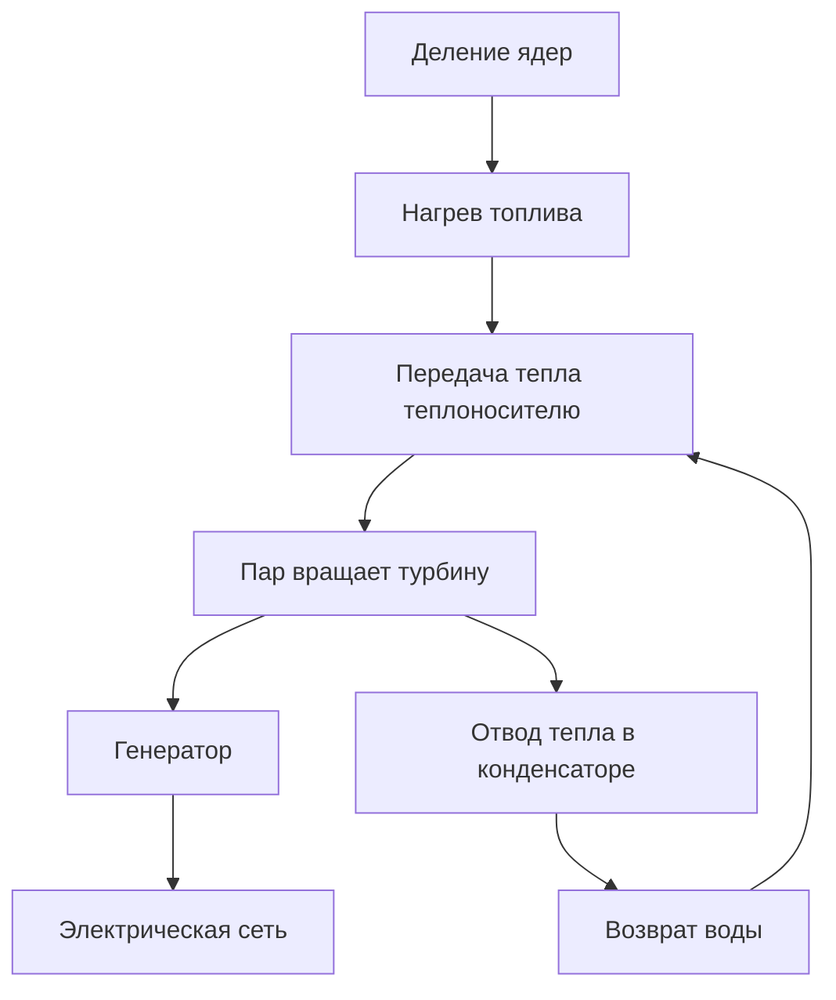
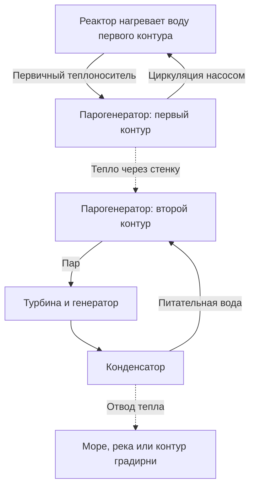

## 1. В конце процесса вращается генератор

Слова «атомная энергетика» могут вызывать образ устройства, извлекающего электричество прямо из атомов. Однако на большинстве распространённых АЭС электричество вырабатывает генератор, соединённый с турбиной. Реактор выделяет тепло, за счёт тепла образуется пар, а пар вращает турбину.

Общая последовательность похожа на работу паровых электростанций, использующих уголь или природный газ. Различается источник тепла: преимущественно химические реакции в одном случае и изменения атомных ядер в другом. Между делением ядра и генератором находятся циркулирующая вода, оборудование для получения пара, трубопроводы, турбина и конденсатор.

Такая цепочка помогает понять и преимущества, и сложности. Небольшое количество топлива даёт много тепла, но при нарушении теплоотвода топливо перегревается. Даже после прекращения цепной реакции уже образовавшиеся радиоактивные вещества продолжают выделять энергию. **Остановить реактор и достаточно охладить установку — разные задачи.**

Основная тема статьи — **легководные реакторы**, широко применяемые в коммерческой энергетике. Схемы показывают функции, а не реальные трубопроводы или инструкции по эксплуатации. Термоядерный синтез объединяет лёгкие ядра и отличается от рассматриваемого здесь деления. [Введение Министерства энергетики США][doe-reactor]

## 2. Горение и изменение атомного ядра — разные процессы

Вещество состоит из атомов. В центре атома находится ядро из протонов и нейтронов, вокруг него — электроны. При сгорании угля меняются связи между атомами, например углерода и кислорода. Эта химическая реакция затрагивает прежде всего электроны; ядро углерода не превращается в ядро другого элемента.

При делении тяжёлое ядро распадается на два сравнительно более лёгких ядра и другие продукты. Энергия выделяется из-за различия энергий исходной и конечной ядерных систем. Энергией связи называют энергию, необходимую для разделения ядра на отдельные протоны и нейтроны.

Почему образование более прочно связанной системы сопровождается выделением энергии? Представьте предмет, падающий с высокой полки: при переходе в состояние с меньшей энергией высвобождается разность. Сам по себе разрыв чего-либо не создаёт энергию. Некоторые реакции, напротив, требуют её подвода.

Энергия связи на нуклон в целом растёт от очень лёгких ядер к ядрам средней массы и достигает больших значений вблизи железа и никеля. Поэтому подходящие реакции могут выделять энергию и при делении тяжёлых ядер, и при объединении лёгких. [ATOMICA: строение ядра][binding]

Связь между разностью масс и энергией выражается формулой:

$$
E=\Delta m c^2
$$

Здесь $\Delta m$ — разность масс покоя, а $c$ — скорость света. Это не означает, что всё топливо исчезает, превращаясь в электричество. Осколки и нейтроны остаются, а разность проявляется как кинетическая энергия и излучение. К тому же станция не может превратить всё полученное тепло в электричество.

## 3. Энергия деления сначала нагревает топливо

Уран-235 — характерный пример делящегося изотопа в легководных реакторах. После поглощения нейтрона ядро может перейти в возбуждённое состояние и разделиться с образованием осколков, нейтронов и гамма-излучения. Сочетания осколков различаются: при каждом событии не обязательно возникают одни и те же два элемента.

Значительную часть энергии несут быстро движущиеся осколки. Сталкиваясь с окружающим веществом, они замедляются и нагревают топливо. Затем тепло проходит через оболочку топливного элемента к теплоносителю. На пути от ядерного события до розетки энергия неоднократно меняет форму.

Для инженерной оценки удобно принимать около 200 МэВ тепла на одно деление. Нейтрино уносят часть энергии, а захват нейтронов даёт дополнительный вклад, поэтому точный баланс зависит от изотопов и границ рассматриваемой системы. [ATOMICA: реакции деления][fission]

Один электронвольт равен примерно $1{,}602\times10^{-19}$ Дж, поэтому 200 МэВ — это около $3{,}20\times10^{-11}$ Дж. Для одного события величина мала, но в обычных количествах вещества содержится огромное число атомов.

$$
\dot N\approx\frac{P_{\mathrm{th}}}{E_f}
$$

$P_{\mathrm{th}}$ обозначает тепловую мощность, $E_f$ — тепло на одно деление, а $\dot N$ — число делений в секунду. Разделив 3 миллиарда ватт на указанную энергию, получим примерно $9{,}4\times10^{19}$ делений в секунду. Это иллюстрация масштаба, а не детальный расчёт реакторного топлива.

Большая мощность при малом количестве топлива означает высокую энергоёмкость на единицу массы, а не макроскопический взрыв при каждом делении. Для устойчивого протекания этих микроскопических событий нужно управлять цепной реакцией.

## 4. Критичность означает баланс цепной реакции

Нейтрон одного деления может вызвать следующее, которое высвободит новые нейтроны. Так возникает цепная реакция. Не все нейтроны продолжают её: часть поглощается без деления, часть покидает активную зону.

Этот баланс описывает **эффективный коэффициент размножения** $k_{\mathrm{eff}}$. На наглядном уровне он показывает, как меняется число нейтронов от поколения к поколению.

| Состояние | Условие | Общая тенденция |
|---|---|---|
| Подкритическое | $k_{\mathrm{eff}}<1$ | Цепь затухает, если не учитывать внешние источники |
| Критическое | $k_{\mathrm{eff}}=1$ | Последовательные поколения находятся в балансе |
| Надкритическое | $k_{\mathrm{eff}}>1$ | Цепь имеет тенденцию к росту |

В отличие от бытового значения слова «критический», критичность реактора сама по себе не означает аварию. При постоянной мощности производство и потери нейтронов уравновешены. Критичность не задаёт и величину мощности: реактор может быть критическим как на малой, так и на большой мощности.

Предельно упрощённая модель поколений:

$$
N_g=N_0\left(k_{\mathrm{eff}}\right)^g
$$

Через 100 поколений отношение конечного числа нейтронов к начальному составит примерно 0,366 при коэффициенте 0,99; 1 при 1,00; и 2,70 при 1,01. Малые различия накапливаются. Но формула не учитывает длительность поколения, запаздывающие нейтроны, изменение температуры и управление. **По ней нельзя определить, сколько секунд займёт реальное изменение мощности.**

## 5. Замедлитель, поглотитель и теплоноситель выполняют разные задачи

Недостаточно знать, что в реакторе есть вода и стержни: важно не перепутать их роли. Замедлять нейтроны, поглощать их и переносить тепло — разные действия.

**Замедлитель** снижает энергию нейтронов. Нейтроны деления рождаются быстрыми, а в легководном реакторе замедляются при столкновениях с ядрами в воде. Конструкция использует повышенную вероятность деления урана-235 в области низких энергий нейтронов.

**Управляющий поглотитель** захватывает нейтроны, уменьшая число доступных для продолжения цепи. Эту функцию выполняют регулирующие стержни. Снизить скорость нейтрона и исключить его из цепи — не одно и то же. Объяснение, будто стержни просто замедляют нейтроны, смешивает эти функции.

**Теплоноситель** отводит тепло от топлива. В легководных реакторах вода одновременно служит замедлителем и теплоносителем, но это не универсальное сочетание. В других типах замедлителем может быть графит, а теплоносителем — газ. [Учебные материалы NRC][nrc-reactors]

| Функция | На что влияет | Пример для легководного реактора |
|---|---|---|
| Замедление | Энергия нейтронов | Вода |
| Поглощение и управление реакцией | Нейтроны, доступные для цепи | Стержни и другие поглотители |
| Охлаждение и перенос тепла | Температура топлива и систем | Циркулирующая вода |
| Удержание веществ | Перемещение радиоактивных веществ | Оболочки, граница давления, защитная оболочка |

Из-за двойной роли воды её температура и плотность влияют и на охлаждение, и на нейтронные процессы. Ядерная физика здесь тесно связана с теплообменом и гидродинамикой.

## 6. Запаздывающие нейтроны и температурная обратная связь

Большинство нейтронов деления испускается практически сразу. Небольшая доля появляется позже, после радиоактивного распада продуктов деления. Эти **запаздывающие нейтроны**, несмотря на малую долю, существенно меняют временной масштаб поведения реактора.

Цепь, способная быстро расти только за счёт мгновенных нейтронов, ведёт себя иначе, чем цепь, которой для баланса нужны запаздывающие нейтроны. Различие принципиально для нормального управления. Люди и механизмы не останавливают каждое отдельное деление: они изменяют общий нейтронный баланс. [МАГАТЭ: ядерная физика и теория реакторов][reactor-theory]

Некоторые физические эффекты уменьшают реактивность при нагреве. Доплеровский эффект меняет поглощение нейтронов ураном-238 и другими изотопами с ростом температуры топлива, обеспечивая важную отрицательную обратную связь. [ATOMICA: проектирование активной зоны PWR][core-design]

Но утверждение «при нагреве реактор всегда безопасно останавливается» неверно. Влияние плотности замедлителя, доли пара и состояния топлива зависит от конструкции и режима. Физические обратные связи дополняются измерениями, системами управления и устройствами остановки.

Продукты деления добавляют зависимость от предыстории. Ксенон-135 сильно поглощает нейтроны, а его количество зависит от предыдущей мощности. Менять мощность — не просто поворачивать ручку горелки: важны не только текущие температура и мощность, но и прошлый режим работы.

## 7. PWR: вода под давлением нагревает отдельный контур

В реакторе с водой под давлением, или PWR, первичный теплоноситель находится под высоким давлением, которое подавляет объёмное кипение при нагреве в активной зоне. Горячая вода поступает в парогенератор и передаёт тепло через металлическую стенку воде второго контура.

Пар второго контура идёт к турбине, а вода первого возвращается в реактор. В нормальных условиях тепло передаётся без смешивания воды. Прямая подача реакторной воды в турбину не соответствует базовой схеме PWR.

Так потенциально радиоактивный первичный теплоноситель отделён от турбинного контура. Однако трубки парогенератора образуют важный барьер и требуют контроля. Разделение контуров не отменяет обслуживание, а создаёт границу, целостность которой необходимо поддерживать.

Компенсатор давления регулирует давление первого контура, насосы обеспечивают циркуляцию. В реальной установке есть и вспомогательные системы, измеряющие и поддерживающие давление, температуру и запас воды. [DOE: работа PWR][pwr]

## 8. BWR: пар образуется внутри реактора

В кипящем реакторе, или BWR, вода намеренно кипит внутри реактора. Перед подачей пара в турбину из него отделяют капли жидкости. После совершения работы пар конденсируется и возвращается как питательная вода.

В отличие от PWR, пар, образовавшийся из воды, прошедшей через активную зону, попадает в турбинный контур, где также необходим радиационный контроль. В базовой схеме нет отдельного парогенератора типа PWR для передачи тепла между первым и вторым контурами. [NRC: кипящие реакторы][bwr]

| Характеристика | PWR | BWR |
|---|---|---|
| Основное место образования пара | Вторичная сторона парогенератора | Внутри реактора |
| Вода в активной зоне | Высокое давление подавляет объёмное кипение | Кипение используется в работе |
| Среда, поступающая в турбину | Пар второго контура | Пар из реактора |
| Основная схема | Контуры разделены парогенератором | Прямая паровая связь реактора и турбины |
| Общие требования | Охлаждение, остановка, удержание веществ, отвод тепла | Охлаждение, остановка, удержание веществ, отвод тепла |

Оба типа используют воду, но устройство систем различается. Видимая простота сама по себе не определяет безопасность или стоимость. Нужно сравнивать аварийные функции, доступность контроля, материалы и условия эксплуатации.

## 9. Почему всё тепло нельзя превратить в электричество?

Паровая турбина превращает расширение горячего пара под давлением во вращение. Генератор преобразует вращение в электричество за счёт электромагнитной индукции. Конденсатор охлаждает пар до воды. Сильное уменьшение объёма помогает поддерживать низкое давление за турбиной и облегчает повторную подачу рабочего тела насосом.

Охлаждение — не дополнение, скрывающее неэффективность. Циклическая тепловая машина получает тепло от горячего источника и должна отдать часть холодному. Даже идеальная машина между конечными температурами не превращает всё тепло в работу.

$$
\eta_{\mathrm{Carnot}}=1-\frac{T_c}{T_h}
$$

Температуры здесь абсолютные, в кельвинах, а не градусах Цельсия. При условных 570 K на горячей стороне и 300 K на холодной идеальный предел составляет около 47%. Реальные теплообменники, трение, параметры пара, турбина и генератор снижают КПД. Пример с двумя температурами упрощает настоящий цикл, где температура меняется.

Для легководных АЭС ориентировочный КПД составляет примерно треть. Это не означает, что происходит только треть делений: речь о доле тепла, превращаемой в электричество. Повышение температуры может улучшить КПД, но ограничивается материалами, коррозией, давлением и допустимыми условиями топлива. [ATOMICA: сбросное тепло АЭС][thermal]

Условная установка с тепловой мощностью 3 000 МВт и КПД 33% выдаёт 990 МВт электрической мощности и отводит около 2 010 МВт тепла.

$$
P_e=\eta P_{\mathrm{th}},\qquad
P_{\mathrm{out}}=P_{\mathrm{th}}-P_e
$$

Простой баланс не выделяет отдельно собственные нужды станции. На практике различают мощность генератора и отпуск в сеть после питания насосов и другого оборудования. Огромное оставшееся тепло требует больших систем охлаждения. Прибрежные станции могут передавать его морской воде, внутренние — реке или градирне. Белый шлейф градирни обычно состоит из видимых капель воды; по его виду нельзя судить о радиоактивных выбросах.

## 10. Остаточное тепловыделение: остановка не прекращает нагрев

Стержни и другие средства остановки резко уменьшают тепло цепной реакции. Но в активной зоне остаются многочисленные радиоактивные изотопы, образованные во время работы. Их распад выделяет энергию: **после остановки сохраняется остаточное тепловыделение**.

Аналогия с выключением электрического обогревателя неполна. В реакторе есть запасённое тепло, и при этом продолжает образовываться новое. Просто ждать недостаточно: должен сохраняться работающий путь теплоотвода. [МАГАТЭ: основные принципы ядерной безопасности][safety-basics]

Для одного радиоактивного изотопа число оставшихся атомов описывается выражением:

$$
N(t)=N(0)\,2^{-t/T_{1/2}}
$$

$T_{1/2}$ — период полураспада. Короткоживущие изотопы убывают быстро, долгоживущие — медленно. Однако отработавшее топливо содержит много изотопов и цепочек распада. Один период полураспада не описывает всё остаточное тепловыделение. Важны также прежняя мощность, длительность работы и состав топлива.

Для понимания масштаба: 1% от 3 000 МВт — всё ещё 30 МВт. Это не оценка тепловыделения в конкретный момент после остановки, а пример того, насколько велика малая доля большой мощности. Малый процент нельзя автоматически считать нулём.

Остановка, охлаждение, электроснабжение и измерения связаны между собой. Охлаждение продолжается; могут понадобиться насосы и клапаны, а приборы показывают их состояние. Меры на случай аварий должны сохранять эту цепочку функций.

## 11. Безопасность: остановить, охладить, удержать

Безопасность нельзя свести к одной толстой стене. Она объединяет подавление реакции, отвод тепла и предотвращение выхода радиоактивных веществ.

Топливные таблетки удерживают часть радиоактивных продуктов, а оболочки отделяют топливо от теплоносителя. Граница давления и защитная оболочка создают дополнительные барьеры. Разные вещества удерживаются неодинаково, а аварийные температура и давление могут изменить состояние барьеров. Сам подсчёт стен не доказывает невозможность утечки.

**Резервирование** помогает при отказе отдельного оборудования. Но несколько устройств в одном помещении на одной высоте могут одновременно затопиться. Поэтому важны **разнообразие** принципов или источников питания и **независимость**, включая физическое разделение. Дополнительные одинаковые резервы не устраняют отказы по общей причине.

| Функция | Последствия потери | Что учитывать при проектировании |
|---|---|---|
| Остановить реакцию | Тепловыделение недостаточно подавлено | Способы остановки, измерения, надёжность срабатывания |
| Охладить топливо | Перегрев и возможное повреждение топлива и конструкций | Пути теплоотвода, вода, питание, запас времени |
| Удержать вещества | Перемещение или выход радиоактивных веществ | Целостность барьеров, давление, контроль утечек |
| Понимать состояние установки | Затруднены решения | Надёжные приборы, питание, связь, подготовка персонала |

Пассивная безопасность использует гравитацию и естественную циркуляцию, уменьшая зависимость от оборудования с внешним приводом. «Пассивная» не значит безусловная или неограниченная по времени. Запас воды, перепад давления, положение клапанов и доступный конечный поглотитель тепла всё равно задают условия.

После аварии на «Фукусиме-1» NRC усилила меры сохранения функций безопасности при недоступности штатного электроснабжения и контроля бассейнов выдержки. Более общий урок: внешнее событие способно одновременно повредить питание, охлаждение и измерительные системы. [NRC: уроки Фукусимы][fukushima]

## 12. От физического открытия до электростанции

Открытие деления, демонстрация устойчивой цепи, получение электричества и подача в сеть — отдельные этапы.

После экспериментальных результатов Гана и Штрассмана в конце 1938 года Мейтнер и Фриш объяснили процесс как разделение ядра. Это показало возможность извлекать значительную ядерную энергию. Но продемонстрировать реакцию и надёжно её использовать — разные достижения. [Американское физическое общество: открытие и интерпретация][discovery]

2 декабря 1942 года коллектив Ферми осуществил управляемую самоподдерживающуюся цепную реакцию в Chicago Pile-1. Это не была коммерческая электростанция. Опыт подтвердил ключевую физическую возможность в исследованиях, тесно связанных с военными программами; последующее гражданское применение не отменяет этого контекста. [Аргоннская лаборатория: CP-1][cp1]

В 1951 году американский EBR-I выработал электричество и зажёг лампы. В 1954 году Обнинский реактор в СССР начал подавать электричество в сеть. Затем развитию коммерческой энергетики способствовали опыт демонстрационных и судовых реакторов, изготовление материалов, паровые машины и развитие регулирования. [Национальная лаборатория Айдахо: EBR-I][ebr], [Исторический обзор МАГАТЭ][iaea-history]

| Этап | Основной вопрос | Необходимые возможности |
|---|---|---|
| Понимание реакции | Почему выделяется энергия? | Ядерная физика и измерения |
| Поддержание цепи | Можно ли продолжать реакцию под контролем? | Нейтронный баланс, управление, защита |
| Демонстрация электричества | Может ли тепло приводить машины и генератор? | Теплоносители, теплообменники, турбины |
| Коммерческая эксплуатация | Можно ли надёжно снабжать потребителей годами? | Материалы, обслуживание, топливо, организация работы |
| Долговременная ответственность | Можно ли управлять всем жизненным циклом? | Регулирование, отходы, расходы, общественное согласие |

Атомная энергетика не возникла автоматически из впечатляющего открытия. Сохранение материалов, ремонт, остановки и долгая служба потребовали большой инженерной работы сверх получения самой реакции.

## 13. В реактор загружают не руду

Топливо проходит добычу, переработку сырья, при необходимости изменение изотопного состава, изготовление, использование и последующее обращение. Это ядерный топливный цикл. Слово «цикл» не означает обязательного возвращения всего материала в начало: возможны прямое захоронение или извлечение части веществ для повторного использования.

Природный уран состоит главным образом из урана-238 и содержит около 0,7% урана-235. В типичном топливе легководных реакторов долю урана-235 повышают до нескольких процентов. Обычно диоксид урана превращают в небольшие спечённые таблетки и помещают в металлические оболочки. Множество топливных элементов объединяют в сборку. [МАГАТЭ: основы ядерной энергетики][fuel-basics]

Во время работы делящиеся изотопы расходуются, продукты деления накапливаются, а поглощение нейтронов создаёт другие изотопы. Это сложнее, чем использование только исходного урана-235 до полного исчезновения.

Перегрузка топлива не требует исчезновения всего урана. Учитываются возможность поддерживать реакцию, накопление поглотителей, целостность материалов и распределение мощности в зоне. Оставшийся материал не обязательно можно безопасно и экономично продолжать использовать в прежней конфигурации.

Качество изготовления важно, потому что тепло проходит через таблетки, зазоры, оболочку и теплоноситель. Если какой-то участок хуже передаёт тепло, внутренняя температура меняется даже при той же мощности. Материаловедение и теплообмен столь же необходимы для проектирования топлива, как ядерная физика. [DOE: топливный цикл][fuel-cycle]

## 14. Отработавшее топливо: хранение и захоронение не одно и то же

Недавно выгруженное топливо испускает излучение и выделяет остаточное тепло. Сначала хранение в воде обеспечивает охлаждение и радиационную защиту; позже топливо, соответствующее требованиям, может быть переведено на сухое хранение. Сроки и условия зависят от топлива и объекта.

Вода отводит тепло и ослабляет излучение. При сухом хранении контейнеры и конструкции удерживают вещества и защищают от излучения, позволяя теплу выходить наружу. Извлечение из воды не означает исчезновения радиоактивности.

**Хранение обычно предполагает дальнейшее управление и возможность извлечения; захоронение направлено на долговременную изоляцию.** Переработка тоже оставляет ненужные материалы и отходы процесса. Повторное использование не отменяет проблему обращения с отходами. [МАГАТЭ: хранение отработавшего топлива][spent-fuel]

Радиоактивные отходы неоднородны. Отходы обслуживания, материалы демонтажа и вещества, связанные с отработавшим топливом, различаются по изотопам, активности, теплу и объёму. Подход зависит от состава и возможных путей попадания к человеку или в окружающую среду, а не только от слова «радиоактивный».

Геологическое захоронение сочетает форму отходов, контейнеры, инженерные материалы и геологию, ограничивая перенос веществ. Большие сроки требуют экспериментов, наблюдений, понимания подземных вод и моделирования. Помимо техники важны выбор площадки, контроль, ответственность и диалог с местными сообществами.

Откладывание будущего обращения скрывает часть затрат и выгод. Оценка должна охватывать не только топливо в период генерации, но и выгруженные материалы, а также время после закрытия станции.

## 15. Различайте мощность, энергию и стоимость

Номинал 1 миллион кВт характеризует мощность в данный момент, а кВт·ч — энергию за некоторый период. Путаница смешивает размер установки с её реальным вкладом.

Условная станция мощностью 1 ГВт при годовом коэффициенте использования установленной мощности 90% выработает около 7,884 ТВт·ч:

$$
E_{\mathrm{year}}=P_{\mathrm{rated}}\times8760\,\mathrm{h}\times CF
$$

$CF$ — коэффициент использования установленной мощности, а не просто надёжность. На него влияют перегрузки, проверки, ограничения по спросу и остановки по требованиям регулятора. 90% здесь — пример, а не гарантия для страны или станции.

Ядерное топливо обладает высокой энергоёмкостью, и в реакторе не сжигается ископаемое топливо. Это низкоуглеродный источник электричества, но добыча, обработка, строительство и вывод из эксплуатации означают ненулевые выбросы жизненного цикла. Сравнения требуют одинаковых границ оценки. [МГЭИК, AR6: энергетические системы][ipcc]

Сроки строительства и первоначальные инвестиции важны для экономики. Задержки влияют и на финансирование, и на стоимость работ. Продление эксплуатации существующей станции и строительство новой — разные экономические случаи.

В энергосистеме также значимы изменения спроса, другие генераторы, пропускная способность сети, накопители и резервы. Утверждения «атомную мощность нельзя менять» и «она всегда свободно следует за спросом» одинаково упрощают картину. Техническая гибкость отличается от практической работы с учётом топлива, обслуживания и экономики.

## 16. Что хотят изменить малые и перспективные реакторы

Малые модульные реакторы, или SMR, предлагают изменить изготовление, строительство или размещение за счёт меньших блоков и модульного подхода. Это не единственная ядерная технология: есть легководные варианты и концепции с другими теплоносителями или активными зонами. [МАГАТЭ: что такое SMR][smr]

Малые блоки могут быть удобнее для заводского производства и требовать меньше капитала на единицу. С другой стороны, возможно снижение эффекта масштаба. Выгоды серийности зависят от реальных заказов, стандартизации проектов, регулирования и цепочек поставок.

Другие проекты стремятся давать высокотемпературное промышленное тепло, использовать быстрые нейтроны или иные теплоносители. Цели касаются применения тепла, ресурсов, характеристик отходов, функций безопасности и строительства. Улучшение одного аспекта не решает автоматически остальные.

Читая о перспективных реакторах, различайте концепцию, экспериментальную установку, демонстрационную станцию и коммерческую эксплуатацию. План не равен системе, подтверждённой многолетней работой. Для оценки перспектив нужно видеть достигнутое и то, что ещё предстоит доказать.

## 17. Пять вопросов к новостям об атомной энергетике

Прежде чем делать вывод, уточните, что именно измерено.

1. **Какая мощность?** Тепловая мощность реактора, мощность генератора и отпуск в сеть различаются.
2. **Какое состояние?** Работа, недавняя остановка, длительная остановка и выгрузка топлива оставляют разные тепловые нагрузки и потребности в оборудовании.
3. **Какие границы?** Активная зона, первый контур, здание, площадка и окружающая среда связаны с разными веществами и процессами.
4. **Какая величина?** Бк измеряет активность; Гр — поглощённую дозу, энергию на единицу массы; Зв применяется при оценке воздействия излучения. Их числа нельзя просто сравнивать. [NRC: измерение излучения][radiation]
5. **Какой срок и какие расходы?** Результат меняется в зависимости от включения топлива, строительства, закрытия и отходов.

Оценка здоровья также зависит от вида излучения, пути воздействия, длительности и условий измерения. Здесь мы различаем величины, а не делаем индивидуальные медицинские выводы по изолированным числам.

Физика деления даёт тепло. Инженерия превращает его в полезный источник энергии, обеспечивая перенос, генерацию и последующий контроль. **Спрашивайте не только о возможности получить тепло, но и о том, куда оно идёт, что произойдёт при нарушении пути и кто будет управлять материалом дальше.** Так устройство атомной энергетики становится понятнее.

## Источники и назначение иллюстраций

Расчёты — учебные оценки с указанными допущениями, а не анализ характеристик или запасов безопасности станции. Обложка создана ИИ как концептуальная иллюстрация; её размеры, трубопроводы и цвета не являются инженерным чертежом.

- [DOE: основы реакторов][doe-reactor], [PWR][pwr], [деление][doe-fission], [топливный цикл][fuel-cycle]
- [ATOMICA: структура ядра][binding], [деление][fission], [активная зона PWR][core-design], [сбросное тепло][thermal] (на японском)
- [NRC: учебные материалы][nrc-reactors], [BWR][bwr], [уроки Фукусимы][fukushima], [радиационные величины][radiation]
- [МАГАТЭ: теория реакторов][reactor-theory], [безопасность][safety-basics], [история][iaea-history], [основы топлива][fuel-basics], [хранение][spent-fuel], [SMR][smr]
- [Аргоннская лаборатория: CP-1][cp1], [Лаборатория Айдахо: EBR-I][ebr], [APS: открытие деления][discovery]
- [МГЭИК: AR6, рабочая группа III, глава 6][ipcc]

[doe-reactor]: https://www.energy.gov/ne/articles/nuclear-101-how-does-nuclear-reactor-work
[binding]: https://atomica.jaea.go.jp/data/detail/dat_detail_03-06-03-01.html
[fission]: https://atomica.jaea.go.jp/data/detail/dat_detail_03-06-03-04.html
[nrc-reactors]: https://www.nrc.gov/education-regulatory-research/the-student-corner/unit-3-nuclear-reactorsenergy-generation
[reactor-theory]: https://gnssn.iaea.org/main/bptc/BPTC%20Module%20Documents/Module01%20Nuclear%20physics%20and%20reactor%20theory.pdf
[core-design]: https://atomica.jaea.go.jp/data/detail/dat_detail_02-04-02-01.html
[pwr]: https://www.energy.gov/ne/articles/infographic-how-does-pressurized-water-reactor-work
[bwr]: https://www.nrc.gov/reactors/power/bwrs
[thermal]: https://atomica.jaea.go.jp/data/detail/dat_detail_01-04-03-02.html
[safety-basics]: https://gnssn.iaea.org/main/bptc/BPTC%20Module%20Documents/Module03%20Basic%20principles%20of%20nuclear%20safety.pdf
[fukushima]: https://www.nrc.gov/regulations-legislation/fact-sheets-brochures/backgrounder-on-nrc-response-to-lessons-learned-from-fukushima
[doe-fission]: https://www.energy.gov/science/doe-explainsnuclear-fission
[cp1]: https://www.ne.anl.gov/About/cp1-pioneers/
[ebr]: https://inl.gov/ebr/
[iaea-history]: https://www-pub.iaea.org/MTCD/Publications/PDF/Pub1032_web.pdf
[fuel-basics]: https://nucleus-qa.iaea.org/sites/graphiteknowledgebase/wiki/Guide_to_Graphite/Fundamentals%20of%20Nuclear%20Power.aspx
[fuel-cycle]: https://www.energy.gov/ne/nuclear-fuel-cycle
[spent-fuel]: https://nucleus-apps.iaea.org/nss-oui/Content/Index?CollectionId=m_f7375b40-3d77-4ea5-a2e3-77090916bc67__8_0&type=PublishedCollection
[ipcc]: https://www.ipcc.ch/report/ar6/wg3/chapter/chapter-6/
[smr]: https://www.iaea.org/newscenter/news/what-are-small-modular-reactors-smrs
[discovery]: https://journals.aps.org/prl/50years/timeline
[radiation]: https://www.nrc.gov/facilities-safety/radiation-protection/radiation-and-its-health-effects/measuring-radiation
