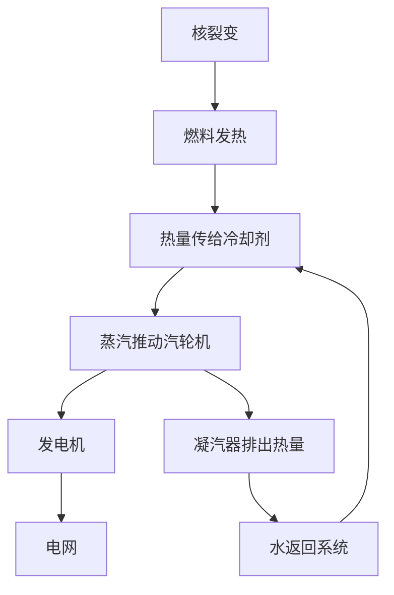
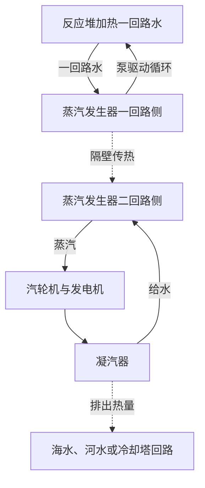

## 1. 核电站的末端，是一台旋转的发电机

提到核电，也许会想到直接从原子中取出电流的机器。实际上，多数广泛使用的核电站最终依靠与汽轮机相连的发电机发电：反应堆产生热量，热量形成蒸汽，蒸汽推动汽轮机。

这条路径与利用煤或天然气热量的蒸汽发电相通。区别在热源：火电主要依靠化学反应，核电利用原子核的变化。从裂变到发电机之间，还有循环水、蒸汽产生设备、管道、汽轮机和凝汽器。

沿着这条路径看，优点与难点都更清楚。少量燃料能产生大量热量，但热量无法带走时，燃料可能过热。链式反应停止后，先前产生的放射性物质仍会发热。**停堆不等于整个电站已经充分冷却。**

本文以商业发电中广泛应用的**轻水堆**为主。图示用于解释功能，并非实际管道布置或运行操作规程。核聚变是轻原子核结合的另一种方式，与这里讨论的裂变堆不同。[美国能源部：反应堆入门][doe-reactor]

## 2. 燃烧与改变原子核有什么不同？

物质由原子组成，原子中心是包含质子和中子的原子核，周围有电子。煤燃烧时，碳等原子与氧的结合方式发生变化。这主要涉及电子，是化学反应，并不是碳原子核变成了另一种元素。

裂变则是重原子核分裂为两个较轻的原子核及其他产物。反应前后的核结构能量不同，差值被释放出来。把原子核拆成独立质子和中子所需的能量，称为结合能。

“结合得更紧，反而释放能量”可能不太直观。可以想象物体从高处落到低处：转向更低能量的状态，会把差额交给外界。并不是只要把原子核打碎就能获得能量；某些反应反而需要输入能量。

每个核子的平均结合能，从很轻的原子核到中等质量区域总体增加，在铁、镍附近达到较大值。因此，选择合适反应时，重核裂变和轻核聚变都能释放能量。[ATOMICA：原子核结构][binding]

质量差与能量的关系为：

$$
E=\Delta m c^2
$$

$\Delta m$ 是反应前后的静止质量差，$c$ 是光速。这不是说全部燃料消失并变成电。反应后仍有碎片、中子等，差额表现为动能和辐射；电站也无法把得到的热量全部变成电。

## 3. 裂变能首先加热燃料

铀235是轻水堆中有代表性的易裂变核素。它吸收中子后可进入激发态并发生裂变，产生裂变碎片、中子、伽马射线等。碎片组合不止一种，并不是每次都产生相同的两种元素。

很大一部分能量由高速运动的裂变碎片携带。碎片在燃料内部碰撞减速，将能量转为热。热量再穿过燃料包壳传给冷却剂。从核反应到家庭插座，能量经过了多次转换。

工程估算常用每次裂变约200 MeV的可利用热能。中微子带走部分能量，中子俘获也贡献能量，因此精确收支取决于核素与计算边界。[ATOMICA：裂变反应][fission]

1 eV约为 $1.602\times10^{-19}$ J，因此200 MeV约为 $3.20\times10^{-11}$ J。单次反应看似微小，但日常数量的物质包含极多原子。

$$
\dot N\approx\frac{P_{\mathrm{th}}}{E_f}
$$

$P_{\mathrm{th}}$ 是热功率，$E_f$ 是每次裂变的热量，$\dot N$ 是每秒裂变次数。把30亿W除以上述能量，约得 $9.4\times10^{19}$ 次／秒。这是理解量级的计算，并不是实际堆芯的详细燃耗分析。

“少量燃料产生大功率”指单位质量能量密度高，不是说每次裂变都是日常尺度的巨大爆炸。要让这些微观反应稳定持续，就必须控制链式反应。

## 4. 临界，是链式反应保持平衡的状态

一次裂变产生的中子引发下一次裂变，后者又释放中子，这就是链式反应。但并非每个中子都参与下一次裂变：有些被其他材料吸收，有些从堆芯泄漏出去。

**有效增殖因子** $k_{\mathrm{eff}}$ 描述这种收支。直观地说，它反映一代中子对下一代中子数量的倍增作用。

| 状态 | 条件 | 大致趋势 |
|---|---|---|
| 次临界 | $k_{\mathrm{eff}}<1$ | 不计外部中子源等因素时，链式反应减弱 |
| 临界 | $k_{\mathrm{eff}}=1$ | 代际收支平衡，维持稳定 |
| 超临界 | $k_{\mathrm{eff}}>1$ | 反应趋于增强 |

反应堆中的“临界”不等于事故。恒功率运行时，需要平衡中子的产生与损失。而且临界本身不能说明功率大小：低功率、高功率都可以处于临界状态。

用一个刻意简化的代际模型表示：

$$
N_g=N_0\left(k_{\mathrm{eff}}\right)^g
$$

100代后，因子为0.99时数量比约0.366，为1.00时是1，为1.01时约2.70。微小差异会累积。不过，这个式子没有代际时间、缓发中子、温度变化和控制设备。**不能拿它预测实际功率在多少秒内增长多少倍。**

## 5. 慢化剂、控制材料与冷却剂分工不同

知道堆内有水、有棒还不够，必须分清减速、吸收与输送热量三个任务。

**慢化剂**降低中子能量。裂变中子速度较高，轻水堆通过水中原子核等的碰撞使其减速。铀235在低中子能量的某些区域具有较大的裂变概率，反应堆利用了这一特点。

**控制材料**吸收中子，减少能继续参与链式反应的数量，控制棒就是例子。让中子慢下来与把中子从链式反应中移除不是同一件事。“控制棒只是减慢中子”的说法混淆了功能。

**冷却剂**把燃料热量带走。轻水堆中，水同时充当慢化剂与冷却剂，但这并非所有堆型的固定组合。其他反应堆可采用石墨慢化、气体冷却等方式。[美国核管理委员会：反应堆教材][nrc-reactors]

| 功能 | 改变什么 | 轻水堆中的代表例子 |
|---|---|---|
| 慢化 | 中子能量 | 水 |
| 吸收与反应控制 | 可参与链式反应的中子数量 | 控制棒等 |
| 冷却与传热 | 燃料及系统温度 | 循环水 |
| 包容 | 放射性物质的迁移 | 包壳、压力边界、安全壳 |

由于水有双重角色，其温度和密度变化会同时影响冷却和中子行为。反应堆是核物理与热工水力紧密耦合的系统。

## 6. 缓发中子与温度反馈如何帮助控制？

大多数裂变中子在裂变后立即产生，称为瞬发中子。少量中子则在裂变产物放射性衰变后才出现，称为**缓发中子**。它们比例虽小，却深刻影响功率变化的时间尺度。

仅靠瞬发中子就迅速增长的链式反应，与依赖缓发中子才能维持平衡的状态，时间行为不同。这对正常控制十分重要。人和机器并非逐个阻止裂变，而是在调节整体中子收支。[IAEA：核物理与反应堆理论][reactor-theory]

温度升高还会产生某些削弱反应的物理反馈。例如燃料温度增加时，多普勒效应改变铀238等核素的中子吸收，是堆芯设计中的重要负反馈。[ATOMICA：压水堆堆芯设计][core-design]

但不能概括成“温度升高就一定安全停堆”。慢化剂密度、蒸汽份额和燃料状态的影响依堆型与工况而异。物理反馈要与测量、控制系统和停堆设备结合。

裂变产物的变化也带来时间效应。氙135强烈吸收中子，其数量受此前功率历史影响。调节核电站功率并不像拧燃气旋钮：除了当前温度和功率，还要考虑之前如何运行。

## 7. 压水堆：用高压水加热另一回路的水

压水堆简称PWR。一回路的水保持高压，在堆芯吸热时抑制整体沸腾。热水进入蒸汽发生器，隔着金属传热壁将热量交给二回路的水。

二回路产生的蒸汽流向汽轮机，一回路水返回反应堆。正常情况下，两回路交换热量而不混水。“把反应堆高压水直接送进汽轮机”不是PWR的基本结构。

这种分隔使可能含放射性物质的一回路与汽轮机侧分开。但蒸汽发生器传热管是重要边界，必须检查完整性。分开回路不是免除维护，而是建立了一道需要保持完好的边界。

稳压器调节一回路压力，泵推动冷却剂循环。实际设备还包含测量并维持压力、温度、水量的辅助系统。[DOE：压水堆工作原理][pwr]

## 8. 沸水堆：在反应堆内产生蒸汽

沸水堆简称BWR，利用反应堆内部的水沸腾来产生蒸汽。先分离液滴，再将蒸汽送入汽轮机。蒸汽做功后在凝汽器变回水，作为给水返回反应堆。

与PWR不同，流经堆芯的水所产生的蒸汽到达汽轮机，因此汽轮机区域也需要辐射管理。基本蒸汽循环不设PWR式的一、二回路蒸汽发生器。[NRC：沸水堆][bwr]

| 比较项 | PWR | BWR |
|---|---|---|
| 主要产汽位置 | 蒸汽发生器二回路侧 | 反应堆内 |
| 堆芯水的状态 | 高压抑制整体沸腾 | 利用沸腾 |
| 送往汽轮机的流体 | 二回路蒸汽 | 反应堆产生的蒸汽 |
| 主要结构特点 | 经蒸汽发生器分隔回路 | 反应堆与汽轮机直接以蒸汽回路连接 |
| 共同要求 | 冷却、停堆、包容、排热 | 冷却、停堆、包容、排热 |

两者都用水，但系统并不相同。也不能仅凭结构看起来简单，就判断安全性或经济性更优。还需比较事故功能、检查便利性、材料与运行条件。

## 9. 为什么不能把热量全部变成电？

汽轮机将高温高压蒸汽膨胀时的能量转为旋转，发电机通过电磁感应产生电。凝汽器把蒸汽变回水，体积明显缩小，有利于保持汽轮机出口低压，也方便重新泵送。

冷却不是掩盖损失的附属设备。循环热机需要从高温端吸热，并向低温端排出一部分热。即使理想热机，在有限温差下也无法把所有热量转为功。

$$
\eta_{\mathrm{Carnot}}=1-\frac{T_c}{T_h}
$$

这里温度必须用开尔文K，不能用摄氏度。假设高温端570 K、低温端300 K，理想上限约47%。实际还有换热温差、摩擦、蒸汽状态、汽轮机与发电机损失，效率会更低。这只是把真实循环的温度分布简化为两个温度的教学模型。

轻水堆发电效率大致为三分之一。不是只有三分之一的裂变发生，而是热量转为电的比例约为三分之一。提高温度有利于热效率，但耐热性、腐蚀、压力和燃料安全限值构成约束。[ATOMICA：核电站排热][thermal]

假设热功率3,000 MW、效率33%，则电功率为990 MW，约2,010 MW需要以热的形式排出。

$$
P_e=\eta P_{\mathrm{th}},\qquad
P_{\mathrm{out}}=P_{\mathrm{th}}-P_e
$$

这是未细分厂用电的估算。实际还要区分发电机输出与扣除泵等耗电后的净上网功率。巨大冷却设施正是用来处理剩余热量。沿海电站可向海水排热，内陆电站可利用河流或冷却塔。冷却塔的白色云团通常是可见水滴，不能单靠外观判断放射性物质排放。

## 10. 衰变热：停堆后仍在产生新的热量

控制棒等措施压低链式反应后，裂变发热大幅减少。但运行中产生的许多放射性核素仍留在堆内，其衰变继续释放能量，因此**停堆后仍有衰变热**。

把它想成关闭电暖器还不够。反应堆既有储存的热，也会继续产生新热。不能只等待自然冷却，还要维持有效的排热通道。[IAEA：核安全基本原则][safety-basics]

单一放射性核素的原子数可用半衰期 $T_{1/2}$ 表示：

$$
N(t)=N(0)\,2^{-t/T_{1/2}}
$$

短寿命核素减少快，长寿命核素减少慢。但乏燃料含许多核素及衰变链，无法用单一半衰期描述整体衰变热。此前功率、运行时间和燃料组成也都相关。

仅作量级比较，3,000 MW的1%仍是30 MW。这不是某个停堆时刻的实际衰变热数据，而是说明巨大基数的小比例仍然可观。不能看到百分比很小就当作“几乎为零”。

停堆、冷却、电源与测量互相联系。停堆后仍需冷却，冷却可能依靠泵和阀门，而了解状态又需要仪表。事故措施必须保证这条功能链不被切断。

## 11. 安全依靠停堆、冷却与包容共同维持

核安全不是一堵厚墙的故事，而是抑制反应、带走热量、限制放射性物质外逸等功能的组合。

燃料芯块能将部分放射性产物保留在内部，包壳隔开燃料与冷却剂，压力边界和安全壳等再提供屏障。不同物质的保留能力不同，事故温压也会改变屏障状态。仅数“有几层墙”不能证明绝不泄漏。

**冗余性**可以应对单台故障，但同一房间、同一高度的多台设备可能一起被淹。采用不同原理或供电方式的**多样性**，以及物理隔离等**独立性**也很重要。增加相同备用设备，不能消除共同原因故障。

| 需要保持的功能 | 丧失后的问题 | 设计考虑 |
|---|---|---|
| 停止反应 | 发热无法充分压低 | 多种停堆手段、测量、可靠动作 |
| 冷却燃料 | 燃料与结构过热受损 | 排热路径、水源、电源、时间裕量 |
| 包容物质 | 放射性物质迁移或释放 | 屏障完整性、压力、泄漏管理 |
| 掌握状态 | 难以正确判断 | 可靠仪表、电源、通信、训练 |

非能动安全利用重力、自然循环等，降低对外部动力的依赖。但“非能动”不等于无条件、无限期有效。水量、压差、阀门状态以及最终热阱都影响其成立条件。

福岛第一核电站事故后，美国NRC也加强了固定电源失效情况下维持安全功能的措施，以及乏燃料水池监测。重要教训是外部灾害可能同时破坏供电、冷却和测量，需要从整个系统看待问题。[NRC：福岛事故教训][fukushima]

## 12. 从实验室发现到发电站

裂变的发现、自持链式反应的实现、首次发电、向电网供电，是不同里程碑，并非一次发明同时完成。

1938年底哈恩和施特拉斯曼的实验之后，迈特纳与弗里施提出原子核分裂的物理解释，揭示了释放巨大核能的可能。但证明反应存在，与稳定利用反应是两回事。[美国物理学会：裂变发现与解释][discovery]

1942年12月2日，费米团队在芝加哥一号堆实现受控、自持链式反应。它并非电力公司的发电站，而是证明人类能维持这种反应的关键步骤。研究深受二战军事计划影响，不能只保留后来和平利用的部分历史。[阿贡国家实验室：CP-1][cp1]

1951年，美国实验堆EBR-I发电点亮灯泡。1954年，苏联奥布宁斯克反应堆向电网供电。此后，舰船反应堆、发电示范、材料制造、蒸汽机械与监管制度共同推动了商业核电。[爱达荷国家实验室：EBR-I][ebr]、[IAEA历史资料][iaea-history]

| 阶段 | 核心问题 | 所需能力 |
|---|---|---|
| 理解核反应 | 为什么释放能量？ | 核物理、测量 |
| 自持反应实证 | 能持续并控制吗？ | 中子平衡、控制、屏蔽 |
| 发电实证 | 热能能否传给机械并发电？ | 冷却剂、换热器、汽轮机 |
| 商业运行 | 能长期稳定供电吗？ | 材料、维护、燃料、运行组织 |
| 长期责任 | 能管理完整寿期吗？ | 监管、废物、费用、社会共识 |

核电并不是发现一种精彩物理现象后自然产生的结果。让材料长期完整，管理检修、停堆和长期运行，需要远超“让反应发生”的工程努力。

## 13. 燃料不是以矿石形式直接入堆

燃料经历开采、加工、必要的同位素组成调整、制造、使用和用后管理，合称燃料循环。但“循环”不表示全部回到原点：可以选择直接处置，也可回收部分物质再利用。

天然铀主要是铀238，铀235约占0.7%。一般轻水堆燃料将铀235提高至几个百分点，再制成小型二氧化铀烧结芯块，装进金属包壳。多根燃料棒组成燃料组件。[IAEA：核电基础][fuel-basics]

运行中燃料不断改变：易裂变核素被消耗，裂变产物积累，中子吸收又形成新核素。它并非只把最初的铀235一直用到消失的简单过程。

换料也不必等到所有铀消失。维持反应、吸收中子的产物积累、材料完整性和堆芯功率分布都要考虑。仍有物质存在，不等于能在原配置中安全、经济地继续使用。

制造质量同样重要。热量依次通过芯块、间隙、包壳和冷却剂；某处传热变差，即使功率不变，内部温度也会改变。材料科学和传热学与核物理一起支撑燃料设计。[DOE：核燃料循环][fuel-cycle]

## 14. 乏燃料：贮存不等于处置

刚卸出的乏燃料仍释放辐射和衰变热。先利用水池等冷却、屏蔽，满足条件后可转入干式贮存。具体时间与条件取决于燃料和设施。

水既带走热量，也衰减辐射。干式贮存依靠容器与结构提供包容、屏蔽，并将热量散出。离开水池不等于失去放射性。

**贮存通常仍包含持续管理和未来取出的可能，处置则以长期隔离为目标。** 即使再处理，也会留下不需要的物质和处理产生的废物。再利用不会使废物问题消失。[IAEA：乏燃料贮存][spent-fuel]

放射性废物也不是一种统一材料。运行维护废物、拆除材料、乏燃料相关废物，在核素、活度、发热与体积上不同。管理要看含有什么、多少，以及可能通过何种途径到达人或环境，不能只看“放射性”标签。

地质处置把废物形态、容器、工程填充材料和地质条件结合起来限制迁移。长时间尺度需要实验、观测、地下水研究和模型评估。选址、监测、责任以及与所在社区的沟通，与工程本身同样重要。

推迟用后管理，会模糊成本与收益。评价范围应包括燃料卸出后以及电站关闭后的时期，不能只看发电中的燃料费用。

## 15. 比较核电时，分清功率、电量与成本

“100万kW”是某一时刻的功率能力，kWh则是经过一段时间供应的电量。混淆两者会影响对规模与实际贡献的判断。

假设1 GW机组全年容量因子为90%，年发电量约7.884 TWh：

$$
E_{\mathrm{year}}=P_{\mathrm{rated}}\times8760\,\mathrm{h}\times CF
$$

$CF$ 是容量因子，不仅反映故障少不少，也包含换料、检修、需求限制和监管停机等影响。90%只是计算假设，并非任何国家或机组的保证值。

核燃料能量密度高，反应堆运行时不燃烧化石燃料，属于低碳电源。但采矿、加工、建设和退役仍有温室气体排放，生命周期排放不为零。比较必须采用一致边界。[IPCC第六次评估报告：能源系统][ipcc]

经济性还取决于建设周期与初始投资。工期延长既改变建设成本，也影响融资负担。现有机组延寿与全新建设不是相同经济场景。

从电网看，还要考虑需求变化、其他电源、输电、储能与停机备用。“核电不能调节功率”和“核电随时都能任意跟踪负荷”都过度简化。技术调节能力应与考虑燃料管理、维护和经济性后的实际运行分开。

## 16. 小型堆与先进堆希望改变什么？

小型模块化反应堆SMR通过较小单元和模块化，寻求改变制造、建设和部署。SMR不是单一核反应方式，既有轻水堆方案，也有不同冷却剂与堆芯概念。[IAEA：SMR是什么][smr]

单元较小可能便于工厂制造，单次投入资金也较少；但同时可能失去大型化的规模经济。量产效益取决于实际订单、设计标准化、监管和供应链。

其他先进设计希望提供工业高温热、利用快中子或采用不同冷却剂。目标包括热能用途、资源利用、废物性质、安全功能和建造方式。改善一项特征，不代表其他问题同时解决。

阅读新型堆报道时，要区分概念、试验装置、示范堆和商业运行。计划与长期运行验证之间有明显距离。判断潜力，需要看清已完成什么、还有什么等待验证。

## 17. 阅读核电新闻的五个检查点

在急于赞成或反对前，先确认报道究竟描述什么。

1. **什么功率？** 反应堆热功率、发电机输出和净上网功率不同。
2. **什么状态？** 运行、刚停堆、长期停堆、卸料后，热负荷和设备需求不同。
3. **什么边界？** 堆芯、一回路、建筑、厂区和环境涉及不同物质与过程。
4. **什么量？** Bq是放射性活度单位，Gy表示单位质量吸收能量，即吸收剂量，Sv用于辐射影响评价，不能直接比较数字。[NRC：辐射测量][radiation]
5. **什么时期与成本？** 是否包括燃料供应、建设、退役和废物管理，会改变评价。

健康影响还取决于辐射种类、暴露途径、时间与测量条件。这里仅区分物理量，不用孤立数字判断个人健康风险。

裂变物理提供热源，而工程负责运走热量、转成电，并在停机后继续管理。**不仅问能否产热，还要问热往哪里去、通道失效怎么办、用后的物质由谁管理。** 这是从原理理解核电的关键。

## 资料与图示的适用范围

计算均为注明假设的学习用估算，不用于评价实际设备性能或安全裕量。封面是AI生成的概念插图，其尺寸、管道和颜色不代表工程设计。

- [DOE：反应堆基础][doe-reactor]、[PWR][pwr]、[裂变][doe-fission]、[燃料循环][fuel-cycle]（英文）
- [ATOMICA：核结构][binding]、[裂变][fission]、[PWR堆芯][core-design]、[排热][thermal]（日文）
- [NRC：反应堆教材][nrc-reactors]、[BWR][bwr]、[福岛教训][fukushima]、[辐射量][radiation]（英文）
- [IAEA：反应堆理论][reactor-theory]、[安全原则][safety-basics]、[历史][iaea-history]、[燃料基础][fuel-basics]、[乏燃料][spent-fuel]、[SMR][smr]（英文）
- [阿贡：CP-1][cp1]、[爱达荷：EBR-I][ebr]、[APS：裂变发现][discovery]（英文）
- [IPCC：第六次评估报告第三工作组第6章][ipcc]（英文）

[doe-reactor]: https://www.energy.gov/ne/articles/nuclear-101-how-does-nuclear-reactor-work
[binding]: https://atomica.jaea.go.jp/data/detail/dat_detail_03-06-03-01.html
[fission]: https://atomica.jaea.go.jp/data/detail/dat_detail_03-06-03-04.html
[nrc-reactors]: https://www.nrc.gov/education-regulatory-research/the-student-corner/unit-3-nuclear-reactorsenergy-generation
[reactor-theory]: https://gnssn.iaea.org/main/bptc/BPTC%20Module%20Documents/Module01%20Nuclear%20physics%20and%20reactor%20theory.pdf
[core-design]: https://atomica.jaea.go.jp/data/detail/dat_detail_02-04-02-01.html
[pwr]: https://www.energy.gov/ne/articles/infographic-how-does-pressurized-water-reactor-work
[bwr]: https://www.nrc.gov/reactors/power/bwrs
[thermal]: https://atomica.jaea.go.jp/data/detail/dat_detail_01-04-03-02.html
[safety-basics]: https://gnssn.iaea.org/main/bptc/BPTC%20Module%20Documents/Module03%20Basic%20principles%20of%20nuclear%20safety.pdf
[fukushima]: https://www.nrc.gov/regulations-legislation/fact-sheets-brochures/backgrounder-on-nrc-response-to-lessons-learned-from-fukushima
[doe-fission]: https://www.energy.gov/science/doe-explainsnuclear-fission
[cp1]: https://www.ne.anl.gov/About/cp1-pioneers/
[ebr]: https://inl.gov/ebr/
[iaea-history]: https://www-pub.iaea.org/MTCD/Publications/PDF/Pub1032_web.pdf
[fuel-basics]: https://nucleus-qa.iaea.org/sites/graphiteknowledgebase/wiki/Guide_to_Graphite/Fundamentals%20of%20Nuclear%20Power.aspx
[fuel-cycle]: https://www.energy.gov/ne/nuclear-fuel-cycle
[spent-fuel]: https://nucleus-apps.iaea.org/nss-oui/Content/Index?CollectionId=m_f7375b40-3d77-4ea5-a2e3-77090916bc67__8_0&type=PublishedCollection
[ipcc]: https://www.ipcc.ch/report/ar6/wg3/chapter/chapter-6/
[smr]: https://www.iaea.org/newscenter/news/what-are-small-modular-reactors-smrs
[discovery]: https://journals.aps.org/prl/50years/timeline
[radiation]: https://www.nrc.gov/facilities-safety/radiation-protection/radiation-and-its-health-effects/measuring-radiation
