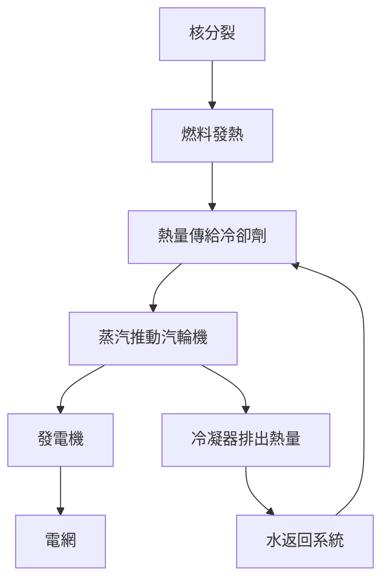
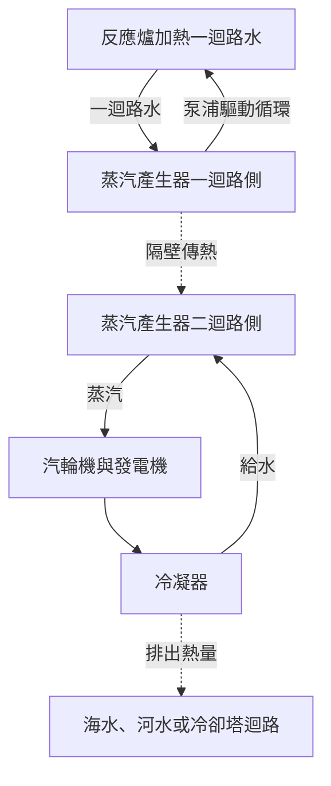

## 1. 核電廠的末端，是一台旋轉的發電機

提到核電，也許會想到直接從原子取出電流的機器。其實，多數廣泛使用的核電廠，最後仍由連接汽輪機的發電機發電：反應爐產熱，熱量形成蒸汽，蒸汽推動汽輪機。

這條路徑與利用煤或天然氣熱量的蒸汽發電相通。差別在熱源：火力發電主要靠化學反應，核電利用原子核的變化。從核分裂到發電機之間，還有循環水、蒸汽產生設備、管線、汽輪機與冷凝器。

沿著這條路徑看，優點與難題都更清楚。少量燃料能提供大量熱能，但熱量帶不走時，燃料可能過熱。連鎖反應停止後，先前生成的放射性物質仍持續發熱。**停止反應爐，不代表整座電廠已經充分冷卻。**

本文以商用發電廣泛採用的**輕水式反應爐**為主。圖示用來解釋功能，並不是實際管線配置或操作程序。核融合是輕原子核結合的另一種方式，與本文的核分裂爐不同。[美國能源部：反應爐入門][doe-reactor]

## 2. 燃燒與改變原子核有什麼不同？

物質由原子組成。原子中心是包含質子與中子的原子核，周圍有電子。煤燃燒時，碳等原子與氧的結合方式改變。這是主要涉及電子的化學反應，碳原子核本身並沒有變成另一種元素。

核分裂則是重原子核分成兩個較輕的原子核及其他產物。反應前後的核結構能量不同，差額被釋放出來。把原子核拆成獨立質子與中子所需的能量，稱為結合能。

「結合得更緊，反而釋放能量」可能不太直覺。可以想像物體從高處落到低處：轉向較低能量的狀態，會把差額交給外界。並非只要打碎原子核就能得到能量；有些反應反而需要輸入能量。

每個核子的平均結合能，從很輕的原子核到中等質量區域大致上升，在鐵、鎳附近有較大值。因此，選擇合適反應時，重核分裂與輕核融合都能釋放能量。[ATOMICA：原子核結構][binding]

質量差與能量的關係為：

$$
E=\Delta m c^2
$$

$\Delta m$ 是反應前後的靜止質量差，$c$ 是光速。這不是說全部燃料消失並變成電。反應後仍有碎片、中子等，差額表現為動能與輻射；電廠也無法把取得的熱量全部轉成電。

## 3. 分裂能首先加熱燃料

鈾235是輕水爐中具代表性的可分裂核種。吸收中子後，它可進入激發態並分裂，產生分裂碎片、中子、伽馬射線等。碎片組合不只一種，不是每次都形成相同的兩種元素。

很大部分能量由高速碎片攜帶。碎片在燃料內碰撞減速，將能量轉為熱。熱再穿過燃料護套傳給冷卻劑。從核反應到家庭插座，能量經過多次轉換。

工程估算常採每次分裂約200 MeV的可利用熱能。微中子帶走部分能量，中子捕獲也提供能量，因此精確收支取決於核種與計算邊界。[ATOMICA：核分裂反應][fission]

1 eV約為 $1.602\times10^{-19}$ J，200 MeV約為 $3.20\times10^{-11}$ J。單次反應看似微小，但日常數量的物質包含極多原子。

$$
\dot N\approx\frac{P_{\mathrm{th}}}{E_f}
$$

$P_{\mathrm{th}}$ 是熱功率，$E_f$ 是每次分裂產生的熱，$\dot N$ 是每秒分裂次數。將30億W除以上述能量，約得 $9.4\times10^{19}$ 次／秒。這用來理解量級，並非實際爐心的詳細燃耗分析。

「少量燃料產生大功率」指單位質量能量密度高，不是每次分裂都產生日常尺度的大爆炸。要讓這些微觀反應穩定持續，必須控制連鎖反應。

## 4. 臨界，是連鎖反應維持平衡的狀態

一次分裂產生的中子引發下一次分裂，後者再釋出中子，形成連鎖反應。但不是每個中子都參與下一次分裂：有些被其他材料吸收，有些逸出爐心。

**有效增殖因數** $k_{\mathrm{eff}}$ 描述這項收支。直觀而言，它反映一代中子對下一代數量的倍增作用。

| 狀態 | 條件 | 大致趨勢 |
|---|---|---|
| 次臨界 | $k_{\mathrm{eff}}<1$ | 不計外部中子源等因素時，反應減弱 |
| 臨界 | $k_{\mathrm{eff}}=1$ | 代際收支平衡，維持穩定 |
| 超臨界 | $k_{\mathrm{eff}}>1$ | 反應趨於增強 |

反應爐的「臨界」本身不等於事故。定功率運轉需要平衡中子產生與損失。臨界也不能單獨說明功率大小：低功率和高功率都能處於臨界。

用刻意簡化的代際模型表示：

$$
N_g=N_0\left(k_{\mathrm{eff}}\right)^g
$$

100代後，因數為0.99時數量比約0.366，1.00時為1，1.01時約2.70。小差異會累積。但式子沒有代際時間、延遲中子、溫度變化及控制設備。**不能拿它預測實際功率會在幾秒內增加幾倍。**

## 5. 緩和劑、控制材料與冷卻劑各有工作

知道爐內有水、有棒還不夠，必須分清減速、吸收與帶走熱量三項任務。

**緩和劑**降低中子能量。分裂中子速度高，輕水爐透過水中原子核等的碰撞使其減速。鈾235在低中子能量的某些範圍內，分裂機率較高，設計便利用這個特性。

**控制材料**吸收中子，減少能繼續參與連鎖反應的數量，控制棒就是例子。讓中子變慢與把它從連鎖反應中移除是不同工作。「控制棒只是減慢中子」混淆了功能。

**冷卻劑**把燃料熱量帶走。輕水爐的水兼任緩和劑與冷卻劑，但不是所有反應爐都如此。其他爐型可採石墨緩和、氣體冷卻等方式。[美國核能管制委員會：反應爐教材][nrc-reactors]

| 功能 | 改變什麼 | 輕水爐的代表例子 |
|---|---|---|
| 緩和 | 中子能量 | 水 |
| 吸收與反應控制 | 能參與連鎖反應的中子數量 | 控制棒等 |
| 冷卻與傳熱 | 燃料和系統溫度 | 循環水 |
| 圍阻 | 放射性物質的移動 | 護套、壓力邊界、圍阻體 |

水有雙重角色，因此溫度與密度變化同時影響冷卻與中子行為。反應爐把核物理、熱傳與流體流動緊密結合。

## 6. 延遲中子與溫度回饋如何協助控制？

大多數分裂中子立即產生，稱為瞬發中子。少量中子要等分裂產物放射性衰變後才出現，稱為**延遲中子**。比例雖小，卻大幅影響功率變化的時間尺度。

只靠瞬發中子就能快速成長的反應，與必須包含延遲中子才能維持平衡的反應，時間行為不同。這對正常控制十分重要。人與機器不是逐個阻止核分裂，而是在調節整體中子收支。[IAEA：核物理與反應爐理論][reactor-theory]

溫度升高也會產生某些抑制反應的物理作用。例如燃料溫度增加時，都卜勒效應改變鈾238等核種的中子吸收，成為爐心設計的重要負回饋。[ATOMICA：壓水爐爐心設計][core-design]

但不能概括成「變熱就一定會安全停機」。緩和劑密度、蒸汽比例及燃料狀態的影響，會隨爐型與運轉條件改變。物理回饋仍須結合量測、控制系統與停機設備。

分裂產物的變化也帶來時間效應。氙135會強烈吸收中子，其數量受先前功率歷程影響。調整核電功率並不像轉動瓦斯旋鈕：不只看目前溫度與功率，也要考慮之前如何運轉。

## 7. 壓水式反應爐：高壓水加熱另一迴路

壓水式反應爐簡稱PWR。一迴路水維持高壓，在爐心吸熱時抑制整體沸騰。熱水進入蒸汽產生器，隔著金屬傳熱壁，把熱交給二迴路的水。

二迴路蒸汽前往汽輪機，一迴路水返回反應爐。正常情況下，兩迴路交換熱量而不混水。「把爐內高壓水直接送進汽輪機」不是PWR的基本結構。

這使可能含放射性物質的一迴路與汽輪機側隔開。但蒸汽產生器傳熱管是重要邊界，必須檢查完整性。分開迴路不是免除維護，而是建立需要保持健全的邊界。

加壓器調整一迴路壓力，泵浦推動冷卻劑循環。實際設備還有量測並維持壓力、溫度與水量的輔助系統。[DOE：PWR原理][pwr]

## 8. 沸水式反應爐：在爐內產生蒸汽

沸水式反應爐簡稱BWR，利用爐內水沸騰產生蒸汽。先分離液滴，再將蒸汽送入汽輪機。做功後，蒸汽在冷凝器變回水，以給水形式返回反應爐。

與PWR不同，流經爐心的水所形成的蒸汽會到達汽輪機，因此汽輪機區域也需要輻射管理。基本蒸汽循環中，沒有PWR式的一、二迴路蒸汽產生器。[NRC：BWR][bwr]

| 比較項目 | PWR | BWR |
|---|---|---|
| 主要產汽位置 | 蒸汽產生器二迴路側 | 反應爐內 |
| 爐心水的狀態 | 高壓抑制整體沸騰 | 利用沸騰 |
| 前往汽輪機的流體 | 二迴路蒸汽 | 反應爐產生的蒸汽 |
| 主要結構 | 經蒸汽產生器分隔迴路 | 反應爐與汽輪機直接以蒸汽迴路連接 |
| 共同要求 | 冷卻、停機、圍阻、排熱 | 冷卻、停機、圍阻、排熱 |

兩者都用水，卻不是相同系統。也不能只因外觀較簡單，就認定安全性或經濟性較佳。還要比較事故功能、檢查便利性、材料與運轉條件。

## 9. 為什麼不能把熱全部變成電？

汽輪機把高溫高壓蒸汽膨脹時的能量轉成旋轉，發電機透過電磁感應發電。冷凝器把蒸汽變回水，體積明顯縮小，有利於維持汽輪機出口低壓，也方便重新泵送。

冷卻不是掩蓋損失的附屬設備。循環熱機必須從高溫端吸熱，並向低溫端排出部分熱。即使理想熱機，在有限溫差下也不能把所有熱轉成作功。

$$
\eta_{\mathrm{Carnot}}=1-\frac{T_c}{T_h}
$$

溫度必須使用絕對溫度K，而不是攝氏。假設高溫端570 K、低溫端300 K，理想上限約47%。實際有換熱溫差、摩擦、蒸汽狀態、汽輪機與發電機損失，效率更低。這只是把真實循環的溫度分布簡化成兩個溫度的教學模型。

輕水爐發電效率約為三分之一。不是只有三分之一的分裂發生，而是熱轉成電的比例。升高溫度有助熱效率，但耐熱性、腐蝕、壓力與燃料安全限值形成約束。[ATOMICA：核電廠排熱][thermal]

假設熱功率3,000 MW、效率33%，電功率是990 MW，約2,010 MW必須以熱排出。

$$
P_e=\eta P_{\mathrm{th}},\qquad
P_{\mathrm{out}}=P_{\mathrm{th}}-P_e
$$

這是未細分廠內用電的估算。實際要區分發電機輸出，以及扣除泵浦等耗電後的淨送電功率。大型冷卻設備正是為了處理剩餘熱量。沿海電廠可向海水排熱，內陸可使用河流或冷卻塔。冷卻塔白色雲團通常是可見水滴，不能只靠外觀判斷放射性物質排放。

## 10. 衰變熱：停機後仍持續產熱

控制棒等壓低連鎖反應後，分裂發熱大幅減少。但運轉中形成的多種放射性核種仍在爐內，衰變繼續釋放能量，因此**停機後仍有衰變熱**。

把它想成關掉電暖器還不完整。反應爐既有儲存的熱，也持續產生新熱。不能只等待，還要維持有效排熱通道。[IAEA：核安全基本原則][safety-basics]

單一放射性核種的數量可用半衰期 $T_{1/2}$ 表示：

$$
N(t)=N(0)\,2^{-t/T_{1/2}}
$$

短壽命核種減少快，長壽命核種減少慢。但用過核子燃料含多種核種與衰變鏈，不能以單一半衰期描述總衰變熱。先前功率、運轉時間、燃料組成都有影響。

只看量級，3,000 MW的1%仍有30 MW。這不是特定停機時刻的實測衰變熱，而是說明巨大基數的小比例仍很可觀。不能看到百分比小，就當成幾乎為零。

停機、冷卻、供電與量測互相關聯。停機後仍需冷卻，冷卻可能依靠泵浦與閥門，掌握狀態又需要儀表。事故措施必須維持這條功能鏈。

## 11. 安全依靠停機、冷卻與圍阻共同維持

核安全不是只有一堵厚牆，而是抑制反應、帶走熱量、限制放射性物質外逸等功能的組合。

燃料丸保留部分放射性產物，護套隔開燃料與冷卻劑，壓力邊界和圍阻體再提供屏障。各物質的保留程度不同，事故溫壓也會改變屏障狀態。只數有幾層牆，不能證明絕不洩漏。

**多重性**可因應單台故障，但同房間、同高度的多台設備可能一起淹水。不同原理或供電方式的**多樣性**，以及物理隔離等**獨立性**也很重要。增加相同備用設備不能排除共因失效。

| 需維持的功能 | 喪失後的問題 | 設計考量 |
|---|---|---|
| 停止反應 | 發熱無法充分壓低 | 多種停機手段、量測、可靠動作 |
| 冷卻燃料 | 燃料與結構過熱受損 | 排熱路徑、水源、電源、時間餘裕 |
| 圍阻物質 | 放射性物質遷移或釋出 | 屏障完整性、壓力、洩漏管理 |
| 掌握狀態 | 難以正確判斷 | 可靠儀表、供電、通訊、訓練 |

被動式安全利用重力、自然循環等，降低對外部動力的依賴。但「被動」不等於無條件、無限期有效。水量、壓差、閥門狀態與最終熱沉仍是條件。

福島第一核電廠事故後，美國NRC加強了既有電源失效時維持安全功能的措施，以及用過燃料池監測。重點是外部災害可能同時破壞供電、冷卻與量測，需要以整個系統思考。[NRC：福島事故教訓][fukushima]

## 12. 從實驗室發現到發電廠

發現核分裂、維持自持連鎖反應、首次發電、向電網供電，是不同里程碑，不是同一次發明的同時成果。

1938年底哈恩與施特拉斯曼的實驗後，梅特納與弗里施提出原子核分裂的物理解釋，揭示大量核能可被釋放的可能。但反應存在與穩定利用是兩件事。[美國物理學會：分裂的發現與解釋][discovery]

1942年12月2日，費米團隊在芝加哥一號堆實現受控、自持連鎖反應。它不是電力公司的電廠，而是證明可人為維持反應的關鍵步驟。研究與二戰軍事計畫密切相關，不能只保留後來和平利用的歷史。[阿岡國家實驗室：CP-1][cp1]

1951年，美國實驗爐EBR-I發電點亮燈泡。1954年，蘇聯奧布寧斯克反應爐向電網供電。之後艦船反應爐、發電示範、材料製造、蒸汽機械與管制制度共同促成商用核電。[愛達荷國家實驗室：EBR-I][ebr]、[IAEA歷史資料][iaea-history]

| 階段 | 核心問題 | 所需能力 |
|---|---|---|
| 理解核反應 | 為何釋放能量？ | 核物理、量測 |
| 自持反應實證 | 能持續並控制嗎？ | 中子平衡、控制、屏蔽 |
| 發電實證 | 熱能能否驅動機械發電？ | 冷卻劑、熱交換器、汽輪機 |
| 商業運轉 | 能長期穩定供電嗎？ | 材料、維護、燃料、運轉組織 |
| 長期責任 | 能管理完整生命週期嗎？ | 管制、廢物、費用、社會共識 |

核電不是發現精彩物理現象後自然產生的結果。材料長期健全、檢修、停機與長期運轉管理，需要遠超「讓反應發生」的工程努力。

## 13. 燃料不是把礦石直接放進爐內

燃料經過開採、加工、必要的同位素組成調整、製造、使用與用後管理，統稱燃料循環。但循環不表示全部回到原點：可直接處置，也可回收部分物質再用。

天然鈾以鈾238為主，鈾235約占0.7%。一般輕水爐燃料將鈾235提高到幾個百分點，再製成小型二氧化鈾燒結燃料丸，裝入金屬護套，多根燃料棒組成燃料束。[IAEA：核電基礎][fuel-basics]

運轉中，燃料持續改變：可分裂核種消耗，分裂產物累積，中子吸收形成其他核種。它不是只把最初的鈾235一直用到消失的過程。

更換燃料也不必等所有鈾消失。反應維持、吸收中子的產物、材料完整性與爐心功率分布都要考慮。仍有物質，不代表能在原配置中安全、經濟地繼續使用。

製造品質很重要。熱量依序通過燃料丸、間隙、護套與冷卻劑；某處傳熱變差，即使功率不變，內部溫度也會改變。材料科學與熱傳學和核物理共同支撐燃料設計。[DOE：核燃料循環][fuel-cycle]

## 14. 用過核子燃料：貯存不等於處置

剛卸出的用過核子燃料仍放出輻射與衰變熱。先利用水池等冷卻與屏蔽，符合條件後可轉入乾式貯存。具體時間與條件取決於燃料和設施。

水同時帶走熱與衰減輻射。乾式貯存由容器和周圍結構提供圍阻、屏蔽，並把熱量散出。離開水池不表示放射性已消失。

**貯存通常包含持續管理與未來取出的可能；處置則以長期隔離為目標。** 即使再處理，仍留下不需要的物質與處理廢物。選擇再利用不會讓廢物問題消失。[IAEA：用過燃料貯存][spent-fuel]

放射性廢物不是單一材料。運轉維護廢物、拆除材料、用過燃料相關廢物，在核種、活度、發熱與體積上不同。管理要看含有什麼、多少、可能如何到達人或環境，不能只看放射性標籤。

地質處置把廢物形態、容器、工程填充材料與地質條件結合以抑制移動。長時間尺度需要實驗、觀測、地下水研究和模型。選址、監測、責任與所在地社區的對話也同樣重要。

推遲用後管理，會模糊成本與效益。評估必須涵蓋燃料卸出後、電廠關閉後，不能只看發電時的燃料費。

## 15. 比較核電，要分清功率、電量與成本

「100萬kW」是某一時刻的功率能力，kWh則是經過時間供應的電量。混淆兩者會影響對規模與實際貢獻的判斷。

假設1 GW機組全年容量因數為90%，年發電量約7.884 TWh：

$$
E_{\mathrm{year}}=P_{\mathrm{rated}}\times8760\,\mathrm{h}\times CF
$$

$CF$ 是容量因數，不只表示故障少，也反映換料、檢修、需求限制與管制停機。90%只是計算假設，不是各國、各機組的保證值。

核燃料能量密度高，爐內運轉不燃燒化石燃料，屬低碳電源。但採礦、加工、建設與除役仍排放溫室氣體，生命週期排放不為零。比較要有一致邊界。[IPCC第六次評估報告：能源系統][ipcc]

經濟性取決於工期與初始投資。延誤既增加工程成本，也改變融資負擔。既有機組延役與新建不是相同經濟情境。

電網還涉及需求變化、其他電源、輸電、儲能與停機備援。「核電不能調整功率」和「核電隨時能任意追隨負載」都過度簡化。技術調整能力必須與考慮燃料管理、維護及經濟性後的實務運轉區分。

## 16. 小型爐與先進爐想改變什麼？

小型模組化反應爐SMR以較小單元與模組化，尋求改變製造、建設與部署。它不是單一核反應方式，既有輕水爐方案，也有不同冷卻劑與爐心概念。[IAEA：SMR是什麼][smr]

小單元可能便於工廠製造，也降低單次投入資金；另一方面，可能失去大型化的規模經濟。量產效益取決於實際訂單、設計標準化、管制與供應鏈。

其他設計希望提供工業高溫熱、使用快中子、採用不同冷卻劑。目標包括熱用途、資源利用、廢物性質、安全功能和施工方式。改善一個特徵，不表示其他問題也解決。

閱讀新型爐消息時，應區分概念、試驗設施、示範爐和商業運轉。計畫與長期運轉驗證有很大距離。評估潛力，必須看清已達成什麼、還有什麼待驗證。

## 17. 閱讀核電新聞的五個檢查點

在急於贊成或反對前，先確定報導描述的對象。

1. **哪種功率？** 爐心熱功率、發電機輸出、淨送電功率不同。
2. **什麼狀態？** 運轉、剛停機、長期停機、卸料後，熱負荷與設備需求不同。
3. **什麼邊界？** 爐心、一迴路、建築、廠區、環境，涉及不同物質與過程。
4. **什麼物理量？** Bq表示放射性活度，Gy表示單位質量吸收能量，即吸收劑量，Sv用於評估輻射影響，數字不能直接比較。[NRC：輻射量測][radiation]
5. **哪些時期與成本？** 是否包含燃料供應、建設、除役與廢物管理，會改變評估。

健康影響還取決於輻射種類、曝露途徑、時間與量測條件。這裡只區分物理量，不用孤立數值判斷個人健康。

核分裂物理提供熱源，工程則負責帶走熱、轉為電，並在停機後繼續管理。**不只問能否產熱，還要問熱往哪裡去、通道失效怎麼辦、用後物質由誰管理。** 這是從原理理解核電的關鍵。

## 資料與圖示的適用範圍

計算皆為註明假設的學習用估算，不用於判定實際設備性能或安全餘裕。封面為AI生成的概念插圖，尺寸、管線與顏色不代表工程設計。

- [DOE：反應爐基礎][doe-reactor]、[PWR][pwr]、[核分裂][doe-fission]、[燃料循環][fuel-cycle]（英文）
- [ATOMICA：核結構][binding]、[核分裂][fission]、[PWR爐心][core-design]、[排熱][thermal]（日文）
- [NRC：教材][nrc-reactors]、[BWR][bwr]、[福島教訓][fukushima]、[輻射量][radiation]（英文）
- [IAEA：理論][reactor-theory]、[安全原則][safety-basics]、[歷史][iaea-history]、[燃料基礎][fuel-basics]、[用過燃料][spent-fuel]、[SMR][smr]（英文）
- [阿岡：CP-1][cp1]、[愛達荷：EBR-I][ebr]、[APS：分裂發現][discovery]（英文）
- [IPCC：第六次評估報告第三工作組第6章][ipcc]（英文）

[doe-reactor]: https://www.energy.gov/ne/articles/nuclear-101-how-does-nuclear-reactor-work
[binding]: https://atomica.jaea.go.jp/data/detail/dat_detail_03-06-03-01.html
[fission]: https://atomica.jaea.go.jp/data/detail/dat_detail_03-06-03-04.html
[nrc-reactors]: https://www.nrc.gov/education-regulatory-research/the-student-corner/unit-3-nuclear-reactorsenergy-generation
[reactor-theory]: https://gnssn.iaea.org/main/bptc/BPTC%20Module%20Documents/Module01%20Nuclear%20physics%20and%20reactor%20theory.pdf
[core-design]: https://atomica.jaea.go.jp/data/detail/dat_detail_02-04-02-01.html
[pwr]: https://www.energy.gov/ne/articles/infographic-how-does-pressurized-water-reactor-work
[bwr]: https://www.nrc.gov/reactors/power/bwrs
[thermal]: https://atomica.jaea.go.jp/data/detail/dat_detail_01-04-03-02.html
[safety-basics]: https://gnssn.iaea.org/main/bptc/BPTC%20Module%20Documents/Module03%20Basic%20principles%20of%20nuclear%20safety.pdf
[fukushima]: https://www.nrc.gov/regulations-legislation/fact-sheets-brochures/backgrounder-on-nrc-response-to-lessons-learned-from-fukushima
[doe-fission]: https://www.energy.gov/science/doe-explainsnuclear-fission
[cp1]: https://www.ne.anl.gov/About/cp1-pioneers/
[ebr]: https://inl.gov/ebr/
[iaea-history]: https://www-pub.iaea.org/MTCD/Publications/PDF/Pub1032_web.pdf
[fuel-basics]: https://nucleus-qa.iaea.org/sites/graphiteknowledgebase/wiki/Guide_to_Graphite/Fundamentals%20of%20Nuclear%20Power.aspx
[fuel-cycle]: https://www.energy.gov/ne/nuclear-fuel-cycle
[spent-fuel]: https://nucleus-apps.iaea.org/nss-oui/Content/Index?CollectionId=m_f7375b40-3d77-4ea5-a2e3-77090916bc67__8_0&type=PublishedCollection
[ipcc]: https://www.ipcc.ch/report/ar6/wg3/chapter/chapter-6/
[smr]: https://www.iaea.org/newscenter/news/what-are-small-modular-reactors-smrs
[discovery]: https://journals.aps.org/prl/50years/timeline
[radiation]: https://www.nrc.gov/facilities-safety/radiation-protection/radiation-and-its-health-effects/measuring-radiation
