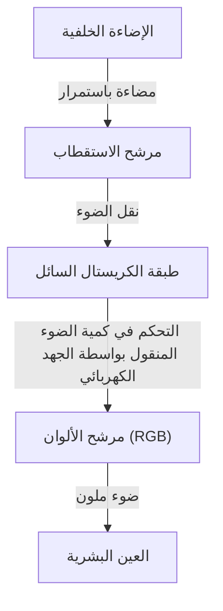
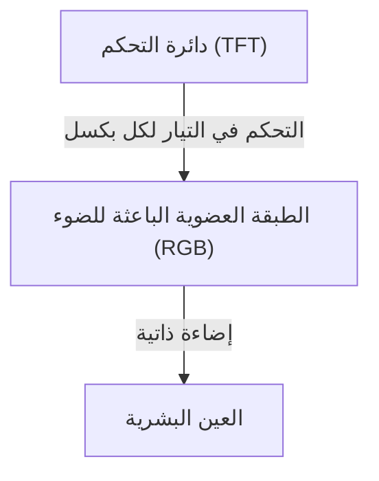

## 1. مقدمة
أصبحت شاشات OLED (الصمام الثنائي العضوي الباعث للضوء) شائعة الاستخدام في الهواتف الذكية وأجهزة التلفاز المتطورة في السنوات الأخيرة. عندما نسمع بـ "OLED"، يتبادر إلى الذهن فوراً جودة الصورة العالية والتصميم النحيف، ولكن ما الذي يجعلها متفوقة من الناحية التقنية؟ في هذا المقال، سنستكشف آلية عمل شاشات OLED من منظور هندسي، ونوضح لماذا يمكنها التعبير عن "اللون الأسود الحقيقي"، ولماذا تحدث الظاهرة المعروفة باسم "احتراق الشاشة" (Burn-in).

## 2. ما هو OLED (الصمام الثنائي العضوي الباعث للضوء)؟
يعد OLED اختصاراً لـ Organic Light Emitting Diode، ويعني باللغة العربية "الصمام الثنائي العضوي الباعث للضوء". يعتمد المبدأ الأساسي على ظاهرة التألق الكهربائي (Electroluminescence)، حيث يتم إصدار الضوء عن طريق تمرير تيار كهربائي عبر مركبات عضوية معينة.

في حين تستخدم مصابيح LED التقليدية مواد غير عضوية (مثل زرنيخيد الغاليوم)، تستخدم شاشات OLED مركبات عضوية تعتمد على الكربون كمواد باعثة للضوء. الميزة الأكثر أهمية لشاشات OLED هي أنها "ذاتية الإضاءة" (Self-emitting). وهذا يعني أن كل نقطة صغيرة (بكسل أو بكسل فرعي) تشكل الشاشة ينبعث منها الضوء بشكل مستقل.

## 3. الاختلاف الجذري عن شاشات الكريستال السائل (LCD)
أسهل طريقة لفهم كيفية عمل OLED هي مقارنتها بشاشات الكريستال السائل (LCD: Liquid Crystal Display)، والتي كانت الدعامة الأساسية للشاشات لفترة طويلة.

### آلية عمل شاشات الكريستال السائل
لا تنبعث الإضاءة من شاشات الكريستال السائل بحد ذاتها. بل تعتمد على مصدر ضوء قوي (عادةً مصابيح LED بيضاء) يسمى "الإضاءة الخلفية" (Backlight) يوضع في الخلف، وتعمل لوحة الكريستال السائل كمصراع (Shutter) لهذا الضوء.

تعمل طبقة الكريستال السائل على تغيير ترتيب جزيئاتها عند تطبيق جهد كهربائي، مما يتحكم في كمية الضوء التي تمر عبرها. ومع ذلك، حتى عندما تحاول الشاشة إغلاق المصراع بالكامل، يتسرب القليل من الضوء من الإضاءة الخلفية القوية الموجودة خلفها. هذا هو السبب في أن اللون الأسود المعروض على شاشات LCD يبدو مائلاً قليلاً إلى اللون الأبيض (أو الرمادي) عند مشاهدته في غرفة مظلمة.

### آلية عمل شاشات OLED
من ناحية أخرى، لا تحتوي شاشات OLED على إضاءة خلفية. فالمواد العضوية الباعثة للضوء باللون الأحمر (R) والأخضر (G) والأزرق (B) الموجودة داخل كل بكسل تضيء بشكل مستقل بناءً على كمية التيار الكهربائي التي تتلقاها.

## 4. لماذا يمكنها التعبير عن "اللون الأسود الحقيقي"؟
يعود السبب في أن شاشات OLED "تجعل اللون الأسود يبدو أسود حقاً" إلى خاصية الإضاءة الذاتية الخاصة بها.
عندما تريد شاشة LCD عرض اللون الأسود، فإنها تحاول القيام بذلك عن طريق "إغلاق المصراع مع ترك الإضاءة الخلفية قيد التشغيل". ومع ذلك، تكتفي شاشات OLED ببساطة بـ "قطع التيار تماماً عن ذلك البكسل، وإيقاف انبعاث الضوء (إطفاءه)".

نظراً لعدم انبعاث أي ضوء على الإطلاق، يصبح هذا الجزء مرادفاً للظلام المادي، مما يحقق "الأسود الحقيقي" (Pitch Black). ونتيجة لذلك، تصل نسبة التباين في شاشات OLED (نسبة السطوع بين أسطع أبيض وأغمق أسود) إلى ملايين إلى واحد، بل توصف بأنها "لانهائية"، مقارنة بآلاف إلى واحد في شاشات LCD. إن هذا اللون الأسود العميق هو ما يبرز الأبعاد الثلاثية وحيوية الصورة.

## 5. مزايا OLED وتطبيقاتها المتزايدة
نظراً لأنها لا تتطلب إضاءة خلفية أو مرشحات بصرية معقدة، تتمتع شاشات OLED بالعديد من المزايا المادية بالإضافة إلى جودة الصورة.

* **نحيفة وخفيفة الوزن**: نظراً لقلة المكونات، يمكن تصنيع شاشات رقيقة كالورق وخفيفة بشكل مذهل.
* **المرونة**: باستخدام مواد بلاستيكية مرنة (مثل البوليميد) بدلاً من الزجاج للركيزة، يصبح من الممكن إنشاء شاشات يمكن ثنيها أو طيها (مثل الهواتف الذكية القابلة للطي).
* **سرعة الاستجابة**: على عكس شاشات LCD التي تتطلب تحريك جزيئات الكريستال السائل فعلياً، تستجيب شاشات OLED على الفور (في غضون نانو ثانية إلى ميكرو ثانية) للتغيرات في التيار الكهربائي. هذا يقلل من ضبابية الحركة (Motion Blur) حتى في مقاطع الفيديو سريعة الحركة والألعاب.

## 6. مزايا استهلاك الطاقة ومكامن الخلل
نظراً لأن شاشات OLED ذاتية الإضاءة، يمكنها قطع الطاقة تماماً عن البكسلات التي تعرض اللون الأسود. لذلك، عند استخدام الوضع الداكن (واجهة مستخدم تعتمد على اللون الأسود)، يتم إيقاف تشغيل جزء كبير من الشاشة، مما يمكن أن يطيل عمر بطارية الهاتف الذكي بشكل كبير.
من ناحية أخرى، عند عرض شاشة بيضاء بالكامل (مثل تصفح الويب أو إنشاء المستندات)، يجب أن تضيء جميع البكسلات بأقصى سطوع، مما قد يؤدي في بعض الحالات إلى استهلاك طاقة أكبر من شاشات LCD بنفس حجم الشاشة. تتميز شاشات الكريستال السائل بوجود إضاءة خلفية تعمل بكثافة ثابتة وتحجب الضوء بغض النظر عن المحتوى المعروض على الشاشة، لذلك يكون هناك تقلب بسيط في استهلاك الطاقة سواء كانت تعرض اللون الأبيض أو الأسود.

## 7. التحدي الأكبر لشاشات OLED: آلية "احتراق الشاشة" (Burn-in)
على الرغم من الخصائص الرائعة لشاشات OLED، إلا أن هناك تحدياً هندسياً كبيراً يتمثل في "احتراق الشاشة". احتراق الشاشة هو ظاهرة تحدث نتيجة عرض نفس الصورة (مثل شعار محطة تلفزيونية، أو شريط حالة الهاتف الذكي، أو واجهة مستخدم للعبة) على الشاشة لفترة طويلة، مما يؤدي إلى بقاء خيال باهت لتلك الصورة بشكل دائم حتى بعد التبديل إلى شاشة أخرى.

### لماذا يحدث احتراق الشاشة؟
السبب الجذري لاحتراق الشاشة هو "تدهور" المواد العضوية الباعثة للضوء. عندما يمر تيار مستمر عبر المركبات العضوية لإصدار الضوء، فإنها تتدهور تدريجياً وتصبح غير قادرة على الحفاظ على نفس السطوع الذي كانت عليه من قبل حتى عند تمرير نفس التيار (انخفاض كفاءة الإضاءة).
بشكل خاص، تمتلك المواد العضوية الباعثة للضوء الأزرق (B) طاقة انبعاث أعلى من الأحمر (R) والأخضر (G)، وتكون بنيتها الجزيئية أكثر عرضة لعدم الاستقرار، مما يجعل عمرها الافتراضي أقصر كخاصية فيزيائية.

على سبيل المثال، إذا تم عرض متصفح ويب بخلفية بيضاء أو واجهة مستخدم ثابتة معينة لفترة طويلة، فسيتم إرهاق البكسلات الموجودة في ذلك الجزء فقط. وتتدهور البكسلات المنهكة بشكل أسرع من البكسلات المحيطة بها، وينخفض مقدار انبعاث الضوء منها. ونتيجة لذلك، عند عرض لون واحد على الشاشة بأكملها، تبدو الأجزاء التي تدهورت بشكل كبير أغمق، ويتم التعرف عليها كـ "صورة شبحية" (Ghost Image). هذا هو ما يعرف باحتراق الشاشة.

## 8. الأساليب التقنية لمنع احتراق الشاشة
أخذ مصنعو الشاشات هذه المشكلة على محمل الجد، ونفذوا تدابير مضادة مختلفة (تقنيات تخفيف الاحتراق) من جانبي الأجهزة والبرامج.

* **تقنية إزاحة البكسل (Pixel Shift)**: تقوم هذه التقنية بتغيير موضع العرض للشاشة بأكملها بانتظام وبشكل طفيف (بمقدار بضع بكسلات) دون أن يلاحظ المستخدم ذلك. هذا يمنع تركيز الحمل على بكسلات معينة.
* **محدد السطوع التلقائي (ABL: Auto Brightness Limiter)**: عندما يتم عرض صورة ساطعة تجعل الشاشة بأكملها بيضاء، تقوم هذه الوظيفة تلقائياً بتقليل السطوع الكلي لتقليل استهلاك الطاقة وتوليد الحرارة، ومنع تدهور العناصر الباعثة للضوء.
* **وظيفة تقليل سطوع الشعار**: معالجة برمجية تستخدم تحليل الصورة لاكتشاف الشعارات الثابتة أو واجهات المستخدم في مناطق معينة من الشاشة، وتقوم بتقليل السطوع محلياً في تلك الأجزاء فقط.
* **مُنشط البكسل (Pixel Refresher)**: وظيفة تقوم تلقائياً بتنفيذ عملية تصحيح لمعادلة الاختلافات في سطوع كل بكسل عن طريق قياس الجهد وحالة التدهور لكل بكسل أثناء وضع الاستعداد، مثل عند إيقاف تشغيل التلفاز.
* **تعديل مساحة البكسل الفرعي**: يتم أيضاً بذل جهود لإطالة عمر عناصر البكسل الأزرق، الذي يتميز بعمر افتراضي قصير، من خلال تصميمه ليكون أكبر من البكسل الأحمر والأخضر مسبقاً (مثل مصفوفة PenTile)، وبالتالي تقليل كثافة التيار المطلوبة لتحقيق نفس السطوع.

## 9. طليعة تصنيع OLED وتطور المواد
تعد عملية تصنيع شاشات OLED بحد ذاتها إحدى المحطات البارزة في التقدم التكنولوجي.
الطريقة السائدة حالياً تسمى "الترسيب الفراغي" (Vacuum Evaporation). يتم تسخين المركبات العضوية وتبخيرها في غرفة تفريغ ضخمة، ويتم تثبيت المواد العضوية على ركيزة زجاجية بدقة نانومترية من خلال قناع معدني يحتوي على ثقوب دقيقة (قناع معدني دقيق: FMM). على الرغم من أنها طريقة تصنيع دقيقة ومكلفة للغاية، إلا أنها تقنية لا غنى عنها للإنتاج الضخم للوحات عالية الجودة.
بالإضافة إلى ذلك، تتقدم الأبحاث في السنوات الأخيرة حول "طريقة الطباعة بنفث الحبر" التي تطبق تقنية الطباعة لطلاء المواد العضوية مباشرة على الركيزة، ومن المتوقع أن يؤدي ذلك إلى تخفيضات كبيرة في تكاليف التصنيع وتقليل أسعار اللوحات الكبيرة.

كما أن الأبحاث على المواد الباعثة للضوء نفسها تتطور يوماً بعد يوم. يتم إحراز تقدم في الانتقال من المواد الفلورية الأولية إلى المواد الفسفورية الأكثر كفاءة (Phosphorescent OLED: PHOLED)، وتجذب تقنية التألق الفلوري المتأخر المنشط حرارياً (TADF)، والتي يطلق عليها الجيل الثالث من المواد الباعثة للضوء، الانتباه حالياً. تمتلك تقنية TADF القدرة على تحقيق انبعاث ضوئي عالي الكفاءة دون استخدام معادن نادرة، ومن المتوقع أن تكون ورقة رابحة لزيادة كفاءة استهلاك الطاقة وتقليل تكلفة شاشات OLED.

## 10. الخلاصة والتوقعات المستقبلية
لقد حسنت شاشات OLED تجربة المشاهدة الحديثة بشكل كبير من خلال توفير "الأسود الحقيقي" عبر الإضاءة الذاتية، ونسبة التباين اللانهائية، بالإضافة إلى النحافة والمرونة الفائقة. بفضل الجهود الدؤوبة للمهندسين، يتم التغلب على التحدي المتمثل في احتراق الشاشة، والذي يعتبر مشكلة خاصة بالمواد العضوية، إلى مستوى لا يشكل مشكلة كبيرة في الاستخدام اليومي.

بالنظر إلى المستقبل، يتم إحراز تقدم في تطوير "شاشات Micro-LED" التي تجمع بين جودة صورة OLED ومتانة شاشات LCD عن طريق ترتيب مصابيح LED صغيرة غير عضوية بدلاً من المواد العضوية، بالإضافة إلى تطوير مواد باعثة للضوء أكثر صداقة للبيئة وعالية الكفاءة. من المؤكد أن تطور تكنولوجيا الشاشات سيستمر في إمتاع أعيننا في المستقبل. وخلف هذه الأجهزة التي نراها يومياً، يكمن جهد لا ينتهي وثمار علم المواد والهندسة الإلكترونية.
