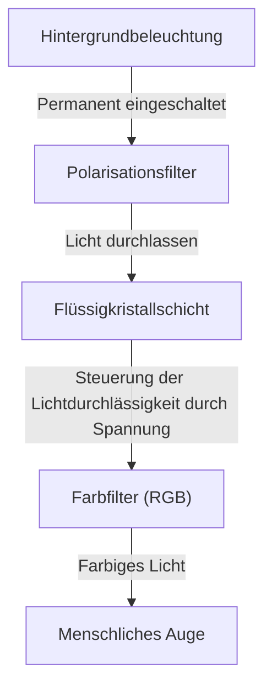
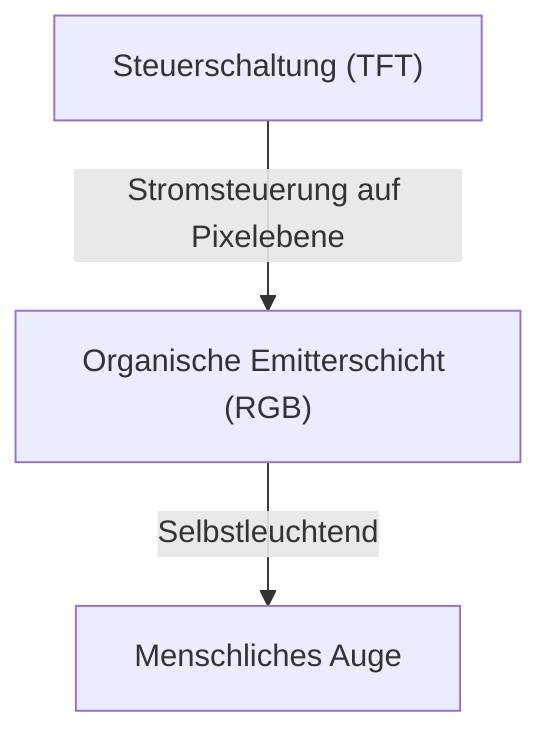

## 1. Einleitung
In den letzten Jahren sind OLED-Displays (Organic Light Emitting Diode) bei Smartphones und High-End-Fernsehern zur Standardausstattung geworden. Wenn man "OLED" hört, denkt man oft zuerst an eine hohe Bildqualität und ein schlankes Design, aber was macht diese Technologie aus ingenieurtechnischer Sicht so überlegen? In diesem Artikel untersuchen wir die Funktionsweise von OLED-Displays aus der Perspektive des Engineerings und erklären, warum sie in der Lage sind, "echtes Schwarz" darzustellen, und warum das als "Burn-in" (Einbrennen) bekannte Phänomen auftritt.

## 2. Was ist eine OLED (organische Leuchtdiode)?
OLED ist die Abkürzung für "Organic Light Emitting Diode", was auf Deutsch als "organische Leuchtdiode" bezeichnet wird. Das Grundprinzip basiert auf dem Phänomen der Elektrolumineszenz, bei dem bestimmte organische Verbindungen Licht emittieren, wenn ein elektrischer Strom durch sie fließt.

Während herkömmliche LEDs anorganische Materialien (wie Galliumarsenid) verwenden, nutzen OLEDs organische Verbindungen auf Kohlenstoffbasis als lichtemittierendes Material. Das wichtigste Merkmal von OLEDs ist, dass sie "selbstleuchtend" (Self-emitting) sind. Das bedeutet, dass jeder winzige Punkt (Pixel oder Subpixel), aus dem das Display besteht, selbst Licht erzeugt.

## 3. Der entscheidende Unterschied zu LCDs (Flüssigkristalldisplays)
Der einfachste Weg, die Funktionsweise von OLEDs zu verstehen, ist der Vergleich mit Flüssigkristalldisplays (LCD: Liquid Crystal Display), die lange Zeit den Markt für Displays dominierten.

### Funktionsweise eines Flüssigkristalldisplays
Ein Flüssigkristalldisplay leuchtet nicht von selbst. Es nutzt eine starke Lichtquelle (normalerweise weiße LEDs), die als "Hintergrundbeleuchtung" auf der Rückseite platziert ist, und das Flüssigkristallpanel fungiert als Verschluss (Shutter) für dieses Licht.

Die Flüssigkristallschicht steuert die Menge des durchgelassenen Lichts, indem sie die Anordnung der Moleküle durch Anlegen einer Spannung ändert. Selbst wenn man versucht, diesen Verschluss vollständig zu schließen, entweicht immer noch ein kleiner Teil des Lichts der starken Hintergrundbeleuchtung. Das ist der Grund, warum das Schwarz, das auf einem LCD angezeigt wird, im Dunkeln leicht weißlich (gräulich) aussieht.

### Funktionsweise eines OLED-Displays
Im Gegensatz dazu gibt es bei OLEDs keine Hintergrundbeleuchtung. Die in jedem Pixel platzierten organischen lichtemittierenden Materialien für Rot (R), Grün (G) und Blau (B) leuchten unabhängig voneinander entsprechend der Menge des zugeführten elektrischen Stroms.

## 4. Warum kann "echtes Schwarz" dargestellt werden?
Der Grund, warum bei OLEDs "Schwarz wirklich schwarz aussieht", liegt einzig in ihrer selbstleuchtenden Eigenschaft.
Um Schwarz darzustellen, versucht ein Flüssigkristalldisplay, den Verschluss bei eingeschalteter Hintergrundbeleuchtung zu schließen. Ein OLED-Display muss jedoch lediglich "den Stromfluss zu diesem speziellen Pixel vollständig unterbrechen und die Lichtemission stoppen (ausschalten)".

Da absolut kein Licht emittiert wird, ist dieser Zustand physikalisch gleichbedeutend mit völliger Dunkelheit, wodurch ein "echtes Schwarz" (Pitch Black) erreicht wird. Aus diesem Grund wird das Kontrastverhältnis (das Leuchtdichteverhältnis zwischen dem hellsten Weiß und dem dunkelsten Schwarz) bei OLEDs mit überwältigenden Werten von mehreren Millionen zu eins oder sogar als "unendlich" angegeben, verglichen mit den Tausenden zu eins bei LCDs. Die Dreidimensionalität und Brillanz des Bildes kommen gerade wegen dieses tiefen Schwarztons so gut zur Geltung.

## 5. Vorteile und wachsende Anwendungsbereiche von OLEDs
Da keine Hintergrundbeleuchtung oder komplexe optische Filter erforderlich sind, bieten OLEDs neben der Bildqualität viele weitere physikalische Vorteile.

* **Dünner und leichter**: Durch die geringere Anzahl von Komponenten können Displays hergestellt werden, die so dünn wie Papier und erstaunlich leicht sind.
* **Flexibilität**: Die Verwendung flexibler Materialien auf Kunststoffbasis (wie Polyimid) anstelle von Glas für das Substrat ermöglicht biegbare und faltbare Displays (z. B. für faltbare Smartphones).
* **Schnelle Reaktionszeit**: Während sich bei LCDs die Flüssigkristallmoleküle physikalisch bewegen müssen, reagieren OLEDs auf Stromänderungen sofort im Nanosekunden- bis Mikrosekundenbereich. Dadurch wird die Entstehung von Bewegungsunschärfen (Motion Blur) bei schnellen Videosequenzen oder Videospielen drastisch reduziert.

## 6. Vorteile beim Stromverbrauch und mögliche Fallstricke
Da OLEDs selbstleuchtend sind, kann die Stromzufuhr zu den Pixeln in den entsprechenden Bereichen beim Anzeigen von Schwarz vollständig abgeschaltet werden. Daher führt die Verwendung des Dark Modes (einer dunkel gestalteten Benutzeroberfläche) dazu, dass der Großteil des Bildschirms abgeschaltet bleibt, was die Akkulaufzeit von Smartphones erheblich verlängern kann.
Wenn andererseits der gesamte Bildschirm hellweiß leuchtet (z. B. beim Surfen im Internet oder bei der Dokumentbearbeitung), müssen alle Pixel mit maximaler Helligkeit leuchten. In diesem Fall kann der Stromverbrauch sogar höher sein als bei einem gleich großen LCD. Bei LCDs ist die Leistungsaufnahme aufgrund der konstanten Hintergrundbeleuchtung nahezu unabhängig vom angezeigten Inhalt, sodass der Stromverbrauch beim Anzeigen von Weiß oder Schwarz kaum schwankt.

## 7. Die größte Herausforderung bei OLEDs: Der Mechanismus des "Burn-in"
Obwohl OLEDs hervorragende Eigenschaften besitzen, stellt das "Burn-in" (Einbrennen) ein bedeutendes ingenieurtechnisches Problem dar. Burn-in ist das Phänomen, bei dem statische Bilder (wie Senderlogos, die Statusleiste eines Smartphones oder die Benutzeroberfläche eines Spiels), die über einen langen Zeitraum angezeigt werden, als schwaches, permanentes Nachbild (Geisterbild) auf dem Display zurückbleiben, selbst nachdem auf einen anderen Bildschirm gewechselt wurde.

### Warum tritt Burn-in auf?
Die Hauptursache für Burn-in ist die "Degradation" (Alterung) der organischen Leuchtmaterialien. Organische Verbindungen bauen sich allmählich ab, wenn sie kontinuierlich durch Stromfluss zur Lichtemission angeregt werden, wodurch sie bei gleicher Stromstärke nicht mehr die ursprüngliche Helligkeit aufrechterhalten können (Verringerung der Lichtausbeute).
Insbesondere organische Materialien, die blaues Licht (B) emittieren, weisen eine höhere Emissionsenergie auf als rote (R) oder grüne (G) Materialien, was ihre Molekularstruktur anfälliger für Instabilitäten macht. Sie besitzen daher physikalisch bedingt eine kürzere Lebensdauer.

Wenn beispielsweise ein Webbrowser mit weißem Hintergrund oder eine bestimmte statische Benutzeroberfläche über einen längeren Zeitraum angezeigt wird, werden nur die Pixel in diesem Bereich stark beansprucht. Diese beanspruchten Pixel altern schneller als die umliegenden Pixel, und ihre Leuchtkraft nimmt ab. Wenn anschließend der gesamte Bildschirm in einer einheitlichen Farbe angezeigt wird, erscheinen die stärker abgenutzten Bereiche dunkler und werden als "Nachbild" wahrgenommen. Genau dies ist das Wesen des Burn-in-Effekts.

## 8. Technische Ansätze zur Verhinderung von Burn-in
Die Displayhersteller nehmen dieses Problem sehr ernst und implementieren verschiedene Gegenmaßnahmen (Burn-in-Mitigationstechnologien) sowohl auf Hardware- als auch auf Softwareebene.

* **Pixel-Shift-Funktion**: Eine Technik, bei der die Anzeigeposition des gesamten Bildschirms in regelmäßigen Abständen unmerklich (um wenige Pixel) verschoben wird. Dies verhindert, dass die Belastung auf bestimmte Pixel konzentriert bleibt.
* **ABL (Auto Brightness Limiter)**: Eine Funktion, die bei der Anzeige heller Bilder, bei denen der gesamte Bildschirm weiß wird, automatisch die Gesamthelligkeit reduziert. Dies senkt den Stromverbrauch, verringert die Wärmeentwicklung und schützt die Bauteile vor Degradation.
* **Logo-Luminanzreduzierung**: Ein softwarebasierter Prozess, der durch Bildanalyse erkennt, wenn sich statische Logos oder Benutzeroberflächen in bestimmten Bereichen des Bildschirms befinden, und die Helligkeit nur in diesen spezifischen Bereichen lokal absenkt.
* **Pixel-Refresher**: Eine automatische Korrekturfunktion, die während des Standby-Betriebs (z. B. wenn der Fernseher ausgeschaltet ist) die Spannung und den Alterungszustand jedes Pixels misst und die Helligkeitsschwankungen zwischen den Pixeln ausgleicht.
* **Anpassung der Subpixelfläche**: Durch die bewusste Konstruktion der blauen Subpixel, deren Lebensdauer kürzer ist, in einer größeren Fläche als die roten und grünen Subpixel, kann die Stromdichte, die zur Erzeugung derselben Helligkeit erforderlich ist, verringert werden. Dies ist eine strukturelle Maßnahme zur Verlängerung der Lebensdauer der blauen Emitter (z. B. PenTile-Matrix).

## 9. Die Speerspitze der OLED-Fertigung und die Evolution der Materialien
Der Herstellungsprozess von OLED-Displays ist ebenfalls ein technologisches Highlight.
Das derzeit vorherrschende Verfahren ist das sogenannte "Vakuumdampfauftragsverfahren" (Vacuum Evaporation). In riesigen Vakuumkammern werden organische Verbindungen erhitzt und verdampft. Durch eine Metallmaske mit winzigen Löchern (Fine Metal Mask: FMM) wird das organische Material mit einer Präzision im Nanometerbereich auf dem Glassubstrat abgeschieden. Obwohl es sich um eine hochpräzise und kostspielige Fertigungsmethode handelt, ist sie für die Massenproduktion hochwertiger Panels unverzichtbar geworden.
In den letzten Jahren hat auch die Forschung im Bereich des "Tintenstrahldruckverfahrens" (Inkjet Printing), bei dem die Drucktechnologie genutzt wird, um organische Materialien direkt auf das Substrat aufzutragen, Fortschritte gemacht. Dies lässt eine erhebliche Reduzierung der Herstellungskosten und günstigere großformatige Panels erwarten.

Auch die Erforschung der Leuchtmaterialien selbst schreitet rasant voran. Der Übergang von anfänglichen fluoreszierenden Materialien zu hocheffizienten phosphoreszierenden Materialien (Phosphorescent OLED: PHOLED) ist in vollem Gange. Derzeit gewinnt die sogenannte thermisch aktivierte verzögerte Fluoreszenz (TADF), ein Leuchtmaterial der dritten Generation, stark an Bedeutung. TADF birgt das Potenzial, hocheffiziente Lichtemissionen ohne den Einsatz seltener Erden (Rare Metals) zu realisieren, und gilt als Schlüssel für weitere Kostensenkungen und noch stromsparendere OLEDs.

## 10. Zusammenfassung und zukünftige Aussichten
OLED-Displays haben das moderne Seherlebnis durch ihr selbstleuchtendes, "echtes Schwarz", unendliche Kontrastverhältnisse sowie ihre bemerkenswerte Dünnheit und Flexibilität dramatisch verbessert. Dank der unermüdlichen Bemühungen der Ingenieure konnte auch das für organische Materialien typische Problem des Burn-in so weit reduziert werden, dass es im alltäglichen Gebrauch kaum noch ein wesentliches Hindernis darstellt.

Noch einen Schritt weiter geht die Entwicklung von "Micro-LED-Displays", bei denen anstelle organischer Materialien mikroskopisch kleine anorganische LEDs aneinandergereiht werden, was die Bildqualität von OLEDs mit der Langlebigkeit von LCDs kombiniert. Parallel dazu wird an der Entwicklung umweltfreundlicherer und hocheffizienterer Leuchtmaterialien geforscht. Die stetige Weiterentwicklung der Displaytechnologie wird unsere Augen zweifellos auch in Zukunft erfreuen. Und hinter diesen Geräten, auf die wir jeden Tag blicken, verbirgt sich die grenzenlose Kristallisation aus Materialwissenschaft und Elektronik.
