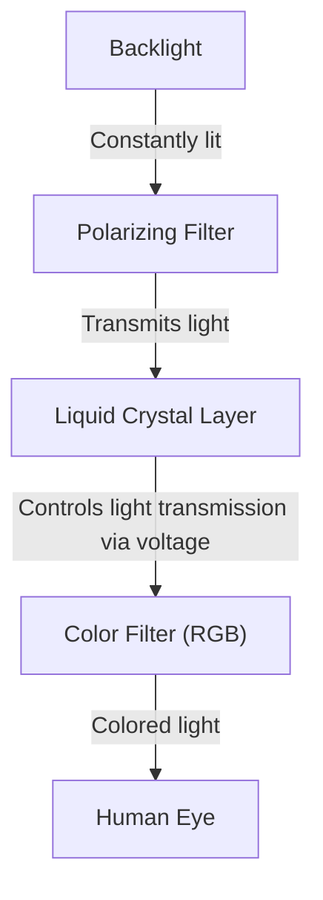
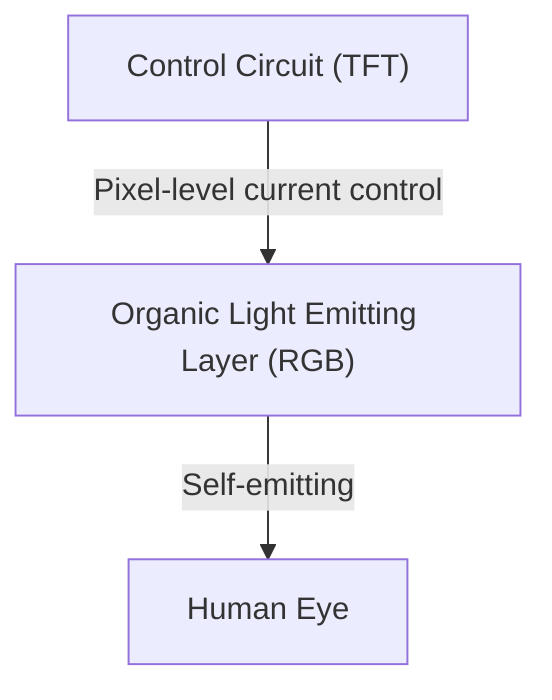

## 1. Introduction
OLED (Organic Light Emitting Diode) displays have become standard in modern smartphones and high-end televisions. The term "OLED" often brings to mind excellent image quality and thinness, but what makes it technologically superior? In this article, we explore the mechanisms of OLED displays from an engineering perspective, explaining why they can represent "true black" and why the phenomenon known as "burn-in" occurs.

## 2. What is an OLED (Organic Light Emitting Diode)?
OLED stands for Organic Light Emitting Diode. Its fundamental principle utilizes electroluminescence, a phenomenon where certain organic compounds emit light when an electric current is applied.

While conventional LEDs use inorganic materials (such as gallium arsenide), OLEDs use carbon-based organic compounds as the light-emitting material. The most prominent characteristic of OLEDs is that they are "self-emitting." This means that each tiny point (pixel or subpixel) that makes up the display emits its own light.

## 3. The Crucial Difference from LCDs (Liquid Crystal Displays)
The easiest way to understand how OLEDs work is to compare them with Liquid Crystal Displays (LCDs), which have long been the dominant display technology.

### How LCDs Work
An LCD does not emit light itself. It features a powerful light source called a "backlight" (typically white LEDs) placed on the back, and the liquid crystal panel functions as a shutter for this light.

The liquid crystal layer changes the alignment of its molecules when a voltage is applied, controlling the amount of light transmitted. However, even when attempting to close the shutter completely, a slight amount of light from the powerful backlight leaks through. This is why the black displayed on an LCD appears slightly whitish (grayish) when viewed in the dark.

### How OLED Displays Work
On the other hand, OLEDs have no backlight. The red (R), green (G), and blue (B) organic light-emitting materials themselves, placed within each pixel, emit light independently according to the amount of electric current they receive.

## 4. Why Can They Represent "True Black"?
The reason OLEDs can make "black look truly black" comes down to their self-emitting characteristic.
To display black, an LCD attempts to represent it by "closing the shutter while leaving the backlight on." However, an OLED simply needs to "completely cut off the current to that pixel and stop emitting light (turn off)."

Because no light is emitted at all, that area becomes synonymous with physical darkness, achieving "true black (pitch black)." As a result, the contrast ratio (the luminance ratio between the brightest white and the darkest black) of OLEDs boasts an overwhelming figure—often described as millions to one, or even "infinite"—compared to the thousands to one ratio of LCDs. The three-dimensionality and vividness of the image stand out precisely because of these deep blacks.

## 5. Advantages of OLED and Expanding Applications
Since they require no backlights or complex optical filters, OLEDs offer many physical advantages beyond image quality.

* **Thin and Lightweight**: With fewer components, it is possible to manufacture displays that are as thin as paper and surprisingly light.
* **Flexibility**: By using flexible plastic-based materials (like polyimide) for the substrate instead of glass, it becomes possible to create displays that can be bent or folded (such as in foldable smartphones).
* **Fast Response Time**: Unlike LCDs, which must physically move liquid crystal molecules, OLEDs react instantly—within nanoseconds to microseconds—to changes in current. This makes motion blur much less likely to occur, even in fast-moving video or gameplay.

## 6. The Advantages and Pitfalls of Power Consumption
Because OLEDs are self-emitting, they can completely cut power to pixels when displaying black. Therefore, using a dark mode (a black-based UI) turns off a large portion of the screen, significantly extending the battery life of smartphones.
On the other hand, for displays that make the entire screen white (like web browsing or document editing), all pixels must emit light at maximum brightness. In such cases, power consumption can actually exceed that of an LCD of the same screen size. LCDs maintain a constant backlight brightness regardless of what is displayed and block the light to create images, meaning power consumption fluctuates very little whether displaying white or black.

## 7. The Biggest Challenge of OLED: The Mechanism of "Burn-in"
Despite its excellent characteristics, OLED faces a major engineering challenge known as "burn-in." Burn-in is a phenomenon where displaying the same image (like a TV station logo, smartphone status bar, or game UI) continuously for a long time causes a faint, permanent ghost image to remain even after switching to another screen.

### Why Does Burn-in Occur?
The fundamental cause of burn-in is the "degradation" of organic light-emitting materials. When organic compounds continue to emit light due to current flow, they gradually degrade and can no longer maintain the same brightness for a given amount of current (a decrease in luminous efficiency).
Particularly, the organic material that emits blue (B) has higher emission energy than red (R) or green (G) and its molecular structure is more prone to instability, resulting in a physical characteristic of a shorter lifespan.

For example, if a web browser with a white background or a screen with a fixed UI is displayed continuously for a long time, only those specific pixels are overworked. Overworked pixels degrade faster than surrounding pixels, resulting in decreased light emission. Consequently, when the entire screen is displayed in a single color, only the severely degraded areas appear darker, which is perceived as a "ghost image." This is the true nature of burn-in.

## 8. Technological Approaches to Prevent Burn-in
Display manufacturers take this problem seriously and implement various countermeasures (burn-in mitigation technologies) from both hardware and software perspectives.

* **Pixel Shifting**: A technology that slightly shifts the display position of the entire screen periodically at a level unnoticed by the user (a few pixels). This prevents the load from being concentrated on specific pixels.
* **ABL (Auto Brightness Limiter)**: A feature that automatically lowers overall brightness to suppress display power consumption and heat generation, and to prevent element degradation when a bright image that makes the entire screen white is displayed.
* **Logo Luminance Reduction**: A software process that uses image analysis to detect the presence of static logos or UIs in specific areas of the screen and locally reduces the brightness of only those parts.
* **Pixel Refresher**: A feature that automatically performs correction processing during standby (when the TV is turned off) by measuring the voltage and degradation state of each pixel and equalizing the variation in brightness among the pixels.
* **Subpixel Area Adjustment**: To extend the life of blue pixel elements, blue subpixels—which have a shorter lifespan—are designed to be larger than red and green ones from the start. This lowers the current density required to produce the same brightness, as seen in Pentile matrix arrangements.

## 9. The Forefront of OLED Manufacturing and Material Evolution
The process of manufacturing OLED displays is also a technological highlight.
The current mainstream method is called "Vacuum Evaporation." Organic compounds are heated and vaporized inside a giant vacuum chamber, and the organic materials are deposited onto a glass substrate with nanometer precision through a metal mask with microscopic holes (Fine Metal Mask: FMM). While this is an extremely precise and costly manufacturing method, it is essential for mass-producing high-quality panels.
Additionally, research is progressing on "Inkjet Printing" methods that apply printing technology to apply organic materials directly to the substrate, which is expected to significantly reduce manufacturing costs and lower the price of large panels.

Research on light-emitting materials themselves is also advancing rapidly. There is a transition from early fluorescent materials to more highly efficient phosphorescent materials (Phosphorescent OLED: PHOLED), and currently, Thermally Activated Delayed Fluorescence (TADF) technology, referred to as third-generation light-emitting material, is attracting attention. TADF has the potential to achieve high-efficiency light emission without using rare metals, and it is expected to be a trump card for further power saving and cost reduction of OLEDs.

## 10. Conclusion and Future Prospects
OLED displays have dramatically improved modern visual experiences with their self-emitting "true blacks," infinite contrast ratios, and overwhelming thinness and flexibility. The challenge of burn-in, unique to organic materials, is being overcome to a level where it is no longer a major problem in daily use, thanks to the continuous efforts of engineers.

Looking further ahead, development is progressing on "Micro LED displays" that combine the image quality of OLED with the durability of LCD by arranging microscopic inorganic LEDs instead of organic materials, as well as the development of more environmentally friendly and highly efficient light-emitting materials. The evolution of display technology will continue to delight our eyes. Behind these devices we see every day lies the culmination of endless materials science and electronic engineering.
