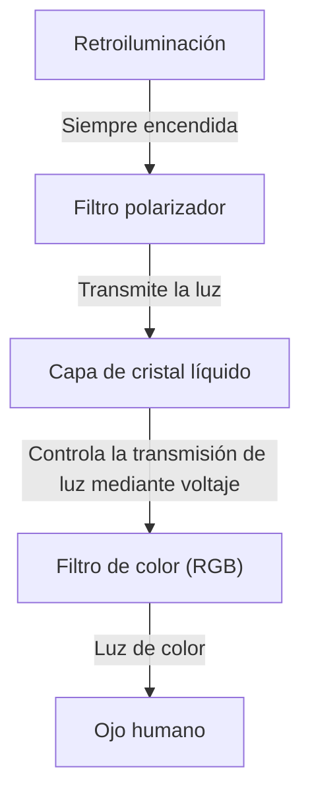
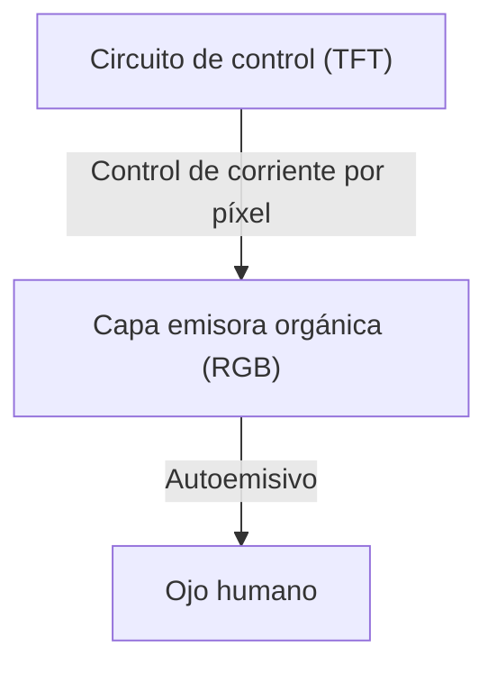

## 1. Introducción
Las pantallas OLED (Diodo Orgánico Emisor de Luz) se han convertido en un estándar en los teléfonos inteligentes modernos y televisores de alta gama. Aunque a menudo se asocia el término "OLED" con una alta calidad de imagen y un diseño delgado, ¿qué ventajas técnicas ofrecen realmente? En este artículo, exploraremos cómo funcionan las pantallas OLED desde una perspectiva de ingeniería, explicando por qué pueden reproducir un "negro verdadero" y por qué ocurre el fenómeno conocido como "quemado" (burn-in).

## 2. ¿Qué es un OLED (Diodo Orgánico Emisor de Luz)?
OLED es el acrónimo de Organic Light Emitting Diode, que se traduce como "Diodo Orgánico Emisor de Luz". Su principio básico utiliza el fenómeno de la electroluminiscencia, donde compuestos orgánicos específicos emiten luz cuando una corriente eléctrica pasa a través de ellos.

Mientras que los LED convencionales utilizan materiales inorgánicos (como el arseniuro de galio), los OLED emplean compuestos orgánicos basados en carbono como materiales emisores. La característica más importante del OLED es que es "autoemisivo" (Self-emitting). Esto significa que cada pequeño punto que compone la pantalla (píxel o subpíxel) genera su propia luz de manera independiente.

## 3. Diferencias clave con las pantallas de cristal líquido (LCD)
La forma más fácil de entender cómo funciona un OLED es comparándolo con las pantallas de cristal líquido (LCD: Liquid Crystal Display), que han dominado el mercado de las pantallas durante mucho tiempo.

### Cómo funciona una pantalla LCD
Una pantalla LCD no emite luz por sí misma. Utiliza una fuente de luz potente situada en la parte trasera, conocida como "retroiluminación" (generalmente LEDs blancos), y el panel de cristal líquido actúa como un obturador de esa luz.

La capa de cristal líquido cambia la alineación de sus moléculas al aplicar voltaje, controlando así la cantidad de luz que pasa. Sin embargo, incluso al intentar cerrar completamente el obturador, una pequeña cantidad de luz de la potente retroiluminación trasera logra filtrarse. Esta es la razón por la que el color negro en las pantallas LCD suele verse ligeramente blanquecino o grisáceo en habitaciones oscuras.

### Cómo funciona una pantalla OLED
Por otro lado, las pantallas OLED no tienen retroiluminación. Los propios materiales orgánicos emisores de luz roja (R), verde (G) y azul (B) colocados dentro de cada píxel emiten luz de forma independiente según la cantidad de corriente que reciben.

## 4. ¿Por qué pueden mostrar un "negro verdadero"?
La razón por la que las pantallas OLED logran que "el negro se vea realmente negro" se reduce a su naturaleza autoemisiva.
Para mostrar el color negro, una pantalla LCD intenta "cerrar el obturador mientras mantiene la retroiluminación encendida". En contraste, una pantalla OLED simplemente "corta completamente la corriente a ese píxel, deteniendo la emisión de luz (apagándolo)".

Al no emitir absolutamente ninguna luz, esa zona se vuelve equivalente a la oscuridad física, logrando así un "negro verdadero" (pitch black). Gracias a esto, la relación de contraste del OLED (la relación de luminancia entre el blanco más brillante y el negro más oscuro) cuenta con cifras abrumadoras que se describen como millones a uno o incluso "infinito", en comparación con la relación de miles a uno de las pantallas LCD. La tridimensionalidad y viveza de las imágenes destacan precisamente por este negro profundo.

## 5. Ventajas de OLED y sus aplicaciones en expansión
Dado que no requiere retroiluminación ni filtros ópticos complejos, el OLED ofrece muchos beneficios físicos más allá de la simple calidad de imagen.

* **Diseño más delgado y ligero**: Al tener menos componentes, es posible fabricar pantallas tan delgadas como el papel y sorprendentemente ligeras.
* **Flexibilidad**: El uso de materiales flexibles a base de plástico (como la poliimida) para el sustrato en lugar de vidrio permite la creación de pantallas que se pueden doblar o plegar (como en los teléfonos inteligentes plegables).
* **Rápida velocidad de respuesta**: A diferencia de las LCD, que requieren mover físicamente las moléculas de cristal líquido, los OLED responden instantáneamente a los cambios de corriente en microsegundos o nanosegundos. Esto minimiza el desenfoque de movimiento (motion blur) en videos de acción rápida o juegos.

## 6. Beneficios en el consumo de energía y sus inconvenientes
Debido a que el OLED es autoemisivo, la energía de los píxeles puede cortarse por completo al mostrar el color negro. Por lo tanto, el uso del "modo oscuro" (interfaces de usuario con fondos negros) apaga la mayor parte de la pantalla, lo que puede prolongar significativamente la duración de la batería de los teléfonos inteligentes.
Por otro lado, cuando se muestra una pantalla completamente blanca (como al navegar por la web o editar documentos), todos los píxeles deben emitir luz a su máximo brillo. En estos casos, el consumo de energía puede ser mayor que el de una pantalla LCD del mismo tamaño. Las pantallas LCD encienden su retroiluminación a una intensidad constante e intentan bloquear la luz independientemente de lo que se muestre en pantalla, por lo que su consumo de energía varía poco entre mostrar blanco o negro.

## 7. El mayor desafío de OLED: El mecanismo del "quemado" (Burn-in)
A pesar de sus maravillosas características, el "quemado" es un desafío de ingeniería significativo para las pantallas OLED. El quemado ocurre cuando una misma imagen (como el logotipo de un canal de televisión, la barra de estado de un teléfono o la interfaz de un juego) se muestra continuamente durante largos períodos de tiempo. Como resultado, una imagen residual tenue queda marcada permanentemente en la pantalla incluso al cambiar a otra imagen.

### ¿Por qué ocurre el quemado?
La causa fundamental del quemado es la "degradación" de los materiales emisores orgánicos. A medida que una corriente eléctrica pasa continuamente a través de un compuesto orgánico para emitir luz, el material se degradada gradualmente y ya no puede mantener el mismo brillo al recibir la misma corriente (disminución de la eficiencia luminosa).
Específicamente, los materiales orgánicos que emiten luz azul (B) tienen una energía de emisión más alta en comparación con el rojo (R) y el verde (G). Esto hace que su estructura molecular sea más propensa a la inestabilidad, dándoles inherentemente una vida útil más corta.

Por ejemplo, si se muestra un navegador web con fondo blanco o una interfaz de usuario estática durante un tiempo prolongado, solo esos píxeles específicos estarán sometidos a un uso intensivo. Estos píxeles se degradarán más rápido que los píxeles circundantes y su emisión de luz disminuirá. En consecuencia, al mostrar un color sólido en toda la pantalla, solo las áreas altamente degradadas parecerán más oscuras, lo que se percibe como una "imagen residual". Esto es precisamente el quemado de pantalla.

## 8. Enfoques técnicos para prevenir el quemado
Los fabricantes de pantallas toman este problema muy en serio y han implementado varias contramedidas (tecnologías de mitigación del quemado) tanto a nivel de hardware como de software.

* **Pixel Shift (Desplazamiento de píxeles)**: Es una tecnología que cambia periódica y ligeramente la posición de la imagen en toda la pantalla a un nivel indetectable para el usuario (unos pocos píxeles). Esto evita que la carga se concentre en píxeles específicos.
* **ABL (Auto Brightness Limiter / Limitador Automático de Brillo)**: Cuando se muestra una imagen brillante con gran parte de la pantalla en blanco, esta función reduce automáticamente el brillo general para limitar el consumo de energía, reducir la generación de calor y prevenir la degradación de los componentes.
* **Reducción de brillo en logotipos**: Es un procesamiento de software que utiliza análisis de imágenes para detectar logotipos estáticos o interfaces de usuario en áreas específicas de la pantalla y reduce localmente el brillo de esa sección en particular.
* **Actualización de píxeles (Pixel Refresher)**: Cuando dispositivos como televisores están apagados en modo de espera, esta función mide automáticamente el voltaje y el estado de degradación de cada píxel, realizando ajustes compensatorios para igualar las variaciones de brillo.
* **Ajuste del área de los subpíxeles**: Para prolongar la vida útil del subpíxel azul (que tiene una vida útil más corta), a menudo se diseña para que sea más grande que el rojo y el verde de antemano (como en la matriz PenTile). Esto reduce la densidad de corriente necesaria para lograr el mismo brillo, extendiendo así la vida del componente azul.

## 9. La vanguardia en la fabricación de OLED y la evolución de los materiales
El proceso de fabricación de pantallas OLED es otro de sus aspectos técnicos más destacados.
El método principal actual es la "Evaporación al vacío" (Vacuum Evaporation). En una enorme cámara de vacío, los compuestos orgánicos se calientan y vaporizan, pasando a través de una máscara de metal con pequeños orificios (Fine Metal Mask, o FMM) para depositar con precisión nanométrica el material orgánico sobre un sustrato de vidrio. Aunque es un método de fabricación muy preciso y costoso, es una tecnología indispensable para la producción en masa de paneles de alta calidad.
Además, en los últimos años, ha avanzado la investigación sobre el "método de impresión por inyección de tinta", que aplica tecnología de impresión para aplicar directamente materiales orgánicos a los sustratos, lo que se espera que reduzca drásticamente los costos de fabricación y disminuya los precios de los paneles de gran tamaño.

La investigación de los materiales emisores en sí también avanza día a día. Se está produciendo una transición de los materiales fluorescentes iniciales a materiales fosforescentes (PHOLED) con una eficiencia luminosa superior. Actualmente, la tecnología de Fluorescencia Retardada Activada Térmicamente (TADF), conocida como la tercera generación de materiales emisores de luz, está atrayendo mucha atención. TADF tiene el potencial de lograr una emisión de luz de alta eficiencia sin utilizar metales raros, y se espera que sea la clave para lograr pantallas OLED de menor costo y consumo de energía.

## 10. Conclusión y perspectivas futuras
Las pantallas OLED han mejorado drásticamente la experiencia visual moderna gracias a su "negro verdadero" autoemisivo, su relación de contraste infinito y su delgadez y flexibilidad incomparables. El desafío del quemado, exclusivo de los materiales orgánicos, también está siendo superado hasta el punto de que ya no supone un problema importante en el uso diario, gracias a los esfuerzos incansables de los ingenieros.

De cara al futuro, se están desarrollando "pantallas MicroLED", que combinan la calidad de imagen del OLED con la durabilidad de las pantallas LCD utilizando micro-LEDs inorgánicos dispuestos de forma densa en lugar de materiales orgánicos, así como materiales emisores de luz más ecológicos y eficientes. La evolución de la tecnología de visualización sin duda seguirá deleitando nuestros ojos. Y detrás de estos dispositivos que vemos todos los días, se esconde la culminación de innumerables avances en ciencia de materiales e ingeniería electrónica.
