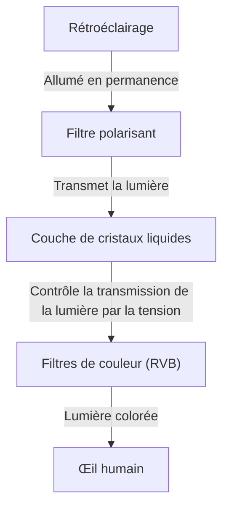
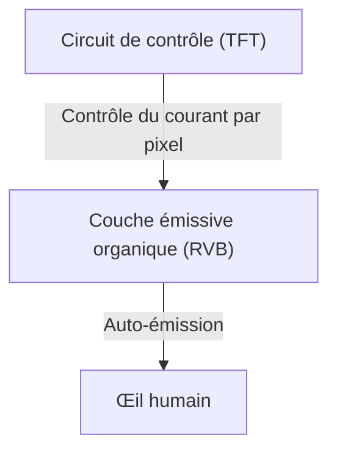

## 1. Introduction
Les écrans OLED (diodes électroluminescentes organiques) sont devenus monnaie courante dans les smartphones modernes et les téléviseurs haut de gamme. Si le terme "OLED" évoque immédiatement une qualité d'image supérieure et une grande finesse, quels sont exactement ses avantages techniques ? Dans cet article, nous explorerons le fonctionnement des écrans OLED d'un point de vue de l'ingénierie, en expliquant pourquoi ils peuvent afficher un "noir véritable" et pourquoi le phénomène connu sous le nom de "brûlure d'écran" se produit.

## 2. Qu'est-ce que l'OLED (Diode Électroluminescente Organique) ?
OLED est l'acronyme de "Organic Light Emitting Diode", traduit en français par "diode électroluminescente organique". Le principe fondamental repose sur l'électroluminescence, un phénomène où des composés organiques spécifiques émettent de la lumière lorsqu'un courant électrique les traverse.

Contrairement aux LED classiques qui utilisent des matériaux inorganiques (comme l'arséniure de gallium), les OLED utilisent des composés organiques à base de carbone comme matériaux émetteurs de lumière. La principale caractéristique de l'OLED est son aspect "auto-émissif" (Self-emitting). En d'autres termes, chaque petit point (pixel ou sous-pixel) constituant l'écran émet sa propre lumière.

## 3. La différence cruciale avec les écrans LCD
Pour comprendre le fonctionnement de l'OLED, le moyen le plus simple est de le comparer à l'écran LCD (Liquid Crystal Display, ou écran à cristaux liquides), qui a longtemps été la norme dominante des écrans.

### Le fonctionnement des écrans LCD
Les écrans LCD ne produisent pas de lumière par eux-mêmes. Ils utilisent une source lumineuse puissante appelée "rétroéclairage" (généralement des LED blanches) placée à l'arrière, et le panneau à cristaux liquides agit comme un obturateur pour cette lumière.

En appliquant une tension, la couche de cristaux liquides modifie l'alignement de ses molécules pour contrôler la quantité de lumière transmise. Cependant, même en essayant de fermer complètement l'obturateur, une petite quantité de lumière provenant du puissant rétroéclairage parvient à s'échapper. C'est pourquoi le noir affiché sur un écran LCD semble légèrement blanchâtre (ou grisâtre) lorsqu'il est observé dans l'obscurité.

### Le fonctionnement des écrans OLED
À l'inverse, l'OLED ne possède pas de rétroéclairage. Les matériaux organiques émetteurs de lumière rouge (R), verte (V) et bleue (B) disposés dans chaque pixel s'allument de manière indépendante en fonction de la quantité de courant reçue.

## 4. Pourquoi peuvent-ils exprimer un "noir véritable" ?
La raison pour laquelle les écrans OLED permettent de voir un "noir vraiment noir" réside entièrement dans cette nature auto-émissive.
Pour afficher du noir, un écran LCD tente de le faire en "fermant l'obturateur tout en gardant le rétroéclairage allumé". En revanche, l'OLED se contente simplement de "couper complètement le courant vers ce pixel, arrêtant ainsi l'émission de lumière (extinction)".

Puisqu'aucune lumière n'est émise, cette zone devient synonyme d'obscurité physique, réalisant ainsi un "noir véritable" (pitch black). Par conséquent, le taux de contraste de l'OLED (le rapport de luminance entre le blanc le plus brillant et le noir le plus sombre) atteint des valeurs impressionnantes de plusieurs millions pour un, voire est qualifié d'"infini", comparé aux quelques milliers pour un des écrans LCD. La tridimensionnalité et la vivacité de l'image sont d'autant plus remarquables grâce à ces noirs profonds.

## 5. Avantages de l'OLED et ses applications croissantes
N'ayant pas besoin de rétroéclairage ni de filtres optiques complexes, l'OLED présente de nombreux avantages physiques au-delà de la qualité de l'image.

* **Finesse et légèreté** : Composé de moins de pièces, il permet de fabriquer des écrans aussi fins que du papier et incroyablement légers.
* **Flexibilité** : L'utilisation de matériaux souples à base de plastique (comme le polyimide) pour le substrat au lieu du verre permet de créer des écrans pliables ou enroulables (comme les smartphones pliables).
* **Temps de réponse rapide** : Alors que le LCD doit déplacer physiquement les molécules de cristaux liquides, l'OLED réagit instantanément aux changements de courant, à l'échelle de la nanoseconde à la microseconde. Cela réduit considérablement le flou de mouvement (motion blur) lors de vidéos rapides ou de jeux vidéo.

## 6. Avantages et pièges de la consommation d'énergie
Grâce à son fonctionnement auto-émissif, l'OLED peut complètement couper l'alimentation des pixels lors de l'affichage du noir. Ainsi, l'utilisation du mode sombre (interface à dominante noire) permet d'éteindre une grande partie de l'écran, prolongeant considérablement l'autonomie de la batterie des smartphones.
D'un autre côté, lors de l'affichage d'un écran entièrement blanc (comme pour la navigation web ou la création de documents), tous les pixels doivent être allumés à la luminosité maximale. Dans ces cas, la consommation d'énergie peut devenir supérieure à celle d'un écran LCD de même taille. Le LCD se caractérise par de faibles variations de consommation d'énergie, qu'il affiche du blanc ou du noir, car son rétroéclairage reste allumé avec une intensité constante pour bloquer ou laisser passer la lumière, quel que soit le contenu affiché.

## 7. Le plus grand défi de l'OLED : le mécanisme de "brûlure d'écran" (Burn-in)
Malgré ses caractéristiques exceptionnelles, l'OLED fait face à un défi d'ingénierie majeur : la "brûlure d'écran". Ce phénomène se produit lorsqu'une même image (comme le logo d'une chaîne de télévision, la barre d'état d'un smartphone ou l'interface d'un jeu) est affichée pendant de longues périodes. Même après un changement d'écran, une image fantôme reste visible de manière permanente.

### Pourquoi la brûlure d'écran se produit-elle ?
La cause fondamentale de la brûlure d'écran est la "dégradation" des matériaux organiques émetteurs de lumière. Lorsqu'un courant électrique traverse de manière continue des composés organiques pour les faire briller, ceux-ci se dégradent progressivement et ne peuvent plus maintenir la même luminosité pour un courant donné (baisse de l'efficacité lumineuse).
En particulier, le matériau organique émettant la lumière bleue (B) possède une énergie lumineuse plus élevée que le rouge (R) ou le vert (V). Par conséquent, sa structure moléculaire a tendance à être plus instable, ce qui entraîne une durée de vie physiquement plus courte.

Par exemple, si vous laissez ouvert un navigateur web avec un fond blanc ou une interface spécifique fixe pendant une longue durée, seuls les pixels de cette zone sont sur-sollicités. Ces pixels sur-sollicités se dégradent plus rapidement que les pixels environnants, et leur émission lumineuse diminue. Par conséquent, lorsque tout l'écran affiche une couleur unie, les zones fortement dégradées apparaissent plus sombres et sont perçues comme une "image fantôme". C'est ce qu'on appelle la brûlure d'écran.

## 8. Approches techniques pour prévenir la brûlure d'écran
Les fabricants d'écrans prennent ce problème très au sérieux et mettent en œuvre diverses mesures (technologies d'atténuation des brûlures d'écran) tant au niveau matériel que logiciel.

* **Décalage de pixels (Pixel Shift)** : Une technologie qui décale périodiquement et subtilement la position de l'image sur l'écran d'un niveau imperceptible pour l'utilisateur (quelques pixels). Cela évite de concentrer la charge sur des pixels spécifiques.
* **ABL (Auto Brightness Limiter)** : Une fonction qui réduit automatiquement la luminosité globale lorsqu'une image très claire (comme un écran entièrement blanc) est affichée, afin de limiter la consommation d'énergie, la génération de chaleur et la dégradation des composants.
* **Réduction de la luminosité des logos** : Un traitement logiciel qui utilise l'analyse d'image pour détecter les logos ou les interfaces statiques dans des zones spécifiques de l'écran, et réduit localement la luminosité de ces seules parties.
* **Rafraîchissement des pixels (Pixel Refresher)** : Une fonction de correction automatique, exécutée lorsque le téléviseur est en veille, qui mesure la tension et l'état de dégradation de chaque pixel, et uniformise les variations de luminosité.
* **Ajustement de la taille des sous-pixels** : Pour pallier la durée de vie plus courte des sous-pixels bleus, des conceptions sont élaborées pour les rendre plus grands que les rouges et les verts (comme la matrice PenTile). Cela permet de diminuer la densité de courant requise pour obtenir la même luminosité, prolongeant ainsi la durée de vie du composant bleu.

## 9. À la pointe de la fabrication des OLED et de l'évolution des matériaux
Le processus de fabrication des écrans OLED constitue également l'un de ses attraits techniques.
La méthode dominante actuelle est "l'évaporation sous vide" (Vacuum Evaporation). Dans une immense chambre à vide, les composés organiques sont chauffés pour être vaporisés, puis ils passent à travers un masque métallique perforé de trous minuscules (Fine Metal Mask : FMM) pour se déposer sur le substrat de verre avec une précision nanométrique. C'est un processus de fabrication extrêmement précis et coûteux, mais indispensable pour la production de masse de panneaux de haute qualité.
Par ailleurs, des recherches progressent sur l'application des technologies d'impression pour appliquer directement les matériaux organiques sur le substrat (méthode d'impression à jet d'encre). Cette avancée promet de réduire drastiquement les coûts de fabrication et de rendre les grands panneaux plus abordables.

La recherche sur les matériaux luminescents eux-mêmes évolue rapidement. On est passé des premiers matériaux fluorescents aux matériaux phosphorescents (Phosphorescent OLED : PHOLED), qui offrent une meilleure efficacité lumineuse. Actuellement, la technologie TADF (Fluorescence retardée activée thermiquement), qualifiée de matériau émetteur de troisième génération, suscite un vif intérêt. La technologie TADF pourrait offrir une émission à haute efficacité sans utiliser de métaux rares, et elle est perçue comme la clé pour réduire davantage la consommation d'énergie et les coûts de l'OLED.

## 10. Conclusion et perspectives futures
Les écrans OLED ont radicalement amélioré l'expérience visuelle moderne grâce à leur "noir véritable" issu de l'auto-émission, leur taux de contraste infini, ainsi que leur finesse et flexibilité inégalées. Le défi de la brûlure d'écran, inhérent aux matériaux organiques, est progressivement surmonté grâce aux efforts constants des ingénieurs, atteignant un niveau où il ne pose plus de problème majeur pour une utilisation quotidienne.

Plus loin encore, des développements sont en cours concernant les "écrans Micro-LED", qui utilisent de minuscules LED inorganiques au lieu de matériaux organiques, alliant la qualité d'image de l'OLED à la durabilité du LCD. Des matériaux émetteurs plus respectueux de l'environnement et plus efficaces sont également en développement. L'évolution de la technologie des écrans continuera sans doute de nous émerveiller. Et derrière ces appareils que nous côtoyons quotidiennement, se cache l'aboutissement d'un travail incommensurable en science des matériaux et en ingénierie électronique.
