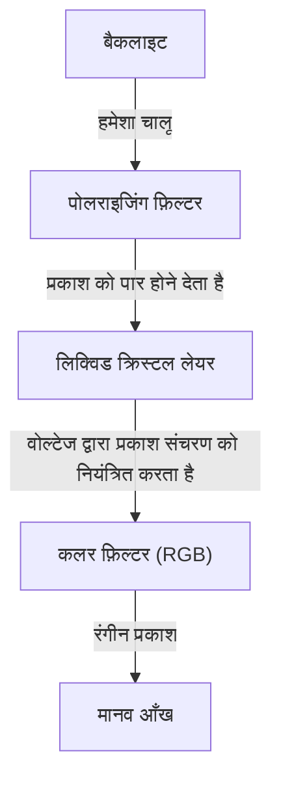
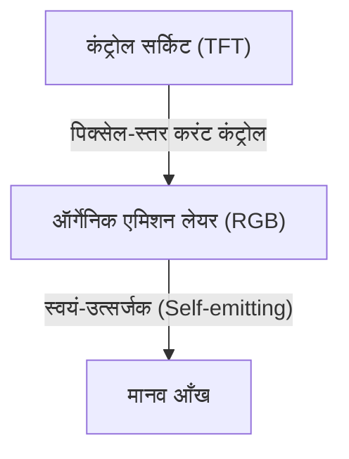

## 1. परिचय
हाल के वर्षों में, OLED (ऑर्गेनिक EL) डिस्प्ले स्मार्टफोन और हाई-एंड टेलीविज़न में आम हो गए हैं। जब आप "ऑर्गेनिक EL" सुनते हैं, तो सबसे पहले आपके दिमाग में उच्च छवि गुणवत्ता और पतलेपन का विचार आता है, लेकिन तकनीकी रूप से इसे क्या बेहतर बनाता है? इस लेख में, हम इंजीनियरिंग के दृष्टिकोण से OLED डिस्प्ले के काम करने के तरीके के बारे में जानेंगे, यह समझाएंगे कि यह "वास्तविक काले" (true black) रंग को क्यों प्रदर्शित कर सकता है और "बर्न-इन" (burn-in) नामक घटना क्यों होती है।

## 2. OLED (ऑर्गेनिक लाइट एमिटिंग डायोड) क्या है?
OLED का मतलब ऑर्गेनिक लाइट एमिटिंग डायोड (Organic Light Emitting Diode) है। एक बुनियादी सिद्धांत के रूप में, यह एक विशिष्ट कार्बनिक यौगिक (ऑर्गेनिक कंपाउंड) के माध्यम से विद्युत धारा प्रवाहित करने पर प्रकाश उत्सर्जित करने की घटना (इलेक्ट्रोल्यूमिनसेंस - electroluminescence) का उपयोग करता है।

जबकि सामान्य LED अकार्बनिक पदार्थों (जैसे गैलियम आर्सेनाइड) का उपयोग करते हैं, OLED प्रकाश उत्सर्जक सामग्री (light-emitting material) के रूप में कार्बन-आधारित कार्बनिक यौगिकों का उपयोग करता है। OLED की सबसे बड़ी विशेषता यह है कि वे "स्वयं-उत्सर्जक" (Self-emitting) होते हैं। दूसरे शब्दों में, डिस्प्ले बनाने वाला हर एक छोटा बिंदु (पिक्सेल, या उप-पिक्सेल) अपने आप प्रकाश उत्सर्जित करता है।

## 3. LCD (लिक्विड क्रिस्टल डिस्प्ले) के साथ महत्वपूर्ण अंतर
OLED के तंत्र को समझने का सबसे आसान तरीका इसकी तुलना लिक्विड क्रिस्टल डिस्प्ले (LCD) से करना है, जो लंबे समय से डिस्प्ले तकनीक में प्रमुख रहा है।

### LCD डिस्प्ले कैसे काम करता है
एक LCD डिस्प्ले अपने आप प्रकाश उत्सर्जित नहीं करता है। इसके पीछे एक शक्तिशाली प्रकाश स्रोत (आमतौर पर एक सफेद LED), जिसे "बैकलाइट" कहा जाता है, रखा जाता है, और लिक्विड क्रिस्टल पैनल उस प्रकाश के लिए एक शटर के रूप में कार्य करता है।

लिक्विड क्रिस्टल परत वोल्टेज लागू करके अणुओं के संरेखण को बदलती है और प्रकाश के संचरण को नियंत्रित करती है। हालाँकि, भले ही आप शटर को पूरी तरह से बंद करने का प्रयास करें, पीछे से शक्तिशाली बैकलाइट का प्रकाश थोड़ा सा लीक हो जाता है। यही कारण है कि अंधेरे में देखने पर LCD डिस्प्ले पर दिखने वाला काला रंग थोड़ा सफेद (या धूसर) दिखाई देता है।

### OLED डिस्प्ले कैसे काम करता है
दूसरी ओर, OLED में कोई बैकलाइट नहीं होती है। प्रत्येक पिक्सेल के अंदर लाल (R), हरे (G) और नीले (B) ऑर्गेनिक प्रकाश उत्सर्जक पदार्थ होते हैं, जो प्राप्त विद्युत धारा की मात्रा के अनुसार स्वतंत्र रूप से प्रकाश उत्सर्जित करते हैं।

## 4. यह "वास्तविक काला" (True Black) रंग क्यों प्रदर्शित कर सकता है?
OLED में "काला वास्तव में काला दिखाई देता है", इसका कारण इसका स्वयं-प्रकाश उत्सर्जित करने का गुण है।
जब काले रंग को प्रदर्शित करना होता है, तो LCD डिस्प्ले "बैकलाइट चालू रखते हुए शटर बंद करके" काले रंग को प्रदर्शित करने का प्रयास करता है। हालाँकि, OLED बस "उस पिक्सेल में करंट को पूरी तरह से काट देता है और प्रकाश उत्सर्जन बंद कर देता है (पिक्सेल को बंद कर देता है)"।

चूँकि बिल्कुल भी प्रकाश उत्सर्जित नहीं होता है, यह क्षेत्र भौतिक अंधकार के समान हो जाता है, जिससे "वास्तविक काला" (pitch black) प्राप्त होता है। इस कारण से, OLED का कंट्रास्ट अनुपात (सबसे चमकीले सफेद और सबसे गहरे काले रंग का चमक अनुपात) LCD के हजारों के मुकाबले, लाखों में या "अनंत" तक पहुंच जाता है। गहरे काले रंग के कारण ही छवि की गहराई और जीवंतता सामने आती है।

## 5. OLED के फायदे और इसके बढ़ते उपयोग
बैकलाइट या जटिल ऑप्टिकल फ़िल्टर की आवश्यकता न होने के कारण, OLED के चित्र गुणवत्ता के अलावा कई भौतिक लाभ हैं।

* **पतला और हल्का**: कम घटकों के कारण, कागज के समान पतले और आश्चर्यजनक रूप से हल्के डिस्प्ले बनाए जा सकते हैं।
* **लचीलापन (Flexibility)**: ग्लास के बजाय प्लास्टिक-आधारित लचीली सामग्री (जैसे पॉलीइमाइड) का उपयोग सब्सट्रेट के रूप में करके, मुड़ने या मोड़ने योग्य डिस्प्ले (जैसे फोल्डेबल स्मार्टफोन) बनाना संभव है।
* **तेज प्रतिक्रिया समय (Fast Response Time)**: LCD के विपरीत, जिसमें लिक्विड क्रिस्टल अणुओं को भौतिक रूप से स्थानांतरित करने की आवश्यकता होती है, OLED करंट में बदलाव के प्रति नैनोसेकंड से माइक्रोसेकंड में तुरंत प्रतिक्रिया करता है। इससे तेज़ गति वाले वीडियो और गेम में मोशन ब्लर (motion blur) या घोस्टिंग होने की संभावना कम हो जाती है।

## 6. बिजली की खपत के फायदे और नुकसान
चूँकि OLED स्वयं-उत्सर्जक है, यह काले रंग को प्रदर्शित करते समय उन विशिष्ट पिक्सेल की शक्ति को पूरी तरह से काट सकता है। इसलिए, डार्क मोड (डार्क UI) का उपयोग करने पर, स्क्रीन का अधिकांश हिस्सा बंद हो जाता है, जिससे स्मार्टफोन की बैटरी लाइफ काफी बढ़ जाती है।
दूसरी ओर, जब पूरी स्क्रीन सफेद होती है (जैसे वेब ब्राउज़िंग या दस्तावेज़ निर्माण के दौरान), तो सभी पिक्सेल को अधिकतम चमक पर प्रकाश उत्सर्जित करने की आवश्यकता होती है, जिससे समान आकार के LCD डिस्प्ले की तुलना में अधिक बिजली की खपत हो सकती है। LCD डिस्प्ले सामग्री की परवाह किए बिना बैकलाइट को एक निरंतर चमक पर रखता है और प्रकाश को अवरुद्ध करता है, इसलिए सफेद या काले रंग को प्रदर्शित करने पर बिजली की खपत में कोई बड़ा बदलाव नहीं होता है।

## 7. OLED की सबसे बड़ी चुनौती: "बर्न-इन" (Burn-in) का तंत्र
अपनी शानदार विशेषताओं के बावजूद, OLED की एक प्रमुख इंजीनियरिंग चुनौती है: "बर्न-इन"। बर्न-इन वह घटना है जहां एक ही छवि (जैसे टीवी स्टेशन का लोगो, स्मार्टफोन का स्टेटस बार, या गेम यूआई) को डिस्प्ले पर लंबे समय तक प्रदर्शित करने के बाद, स्क्रीन बदलने पर भी उस छवि की हल्की सी छाप स्थायी रूप से बनी रहती है।

### बर्न-इन क्यों होता है?
बर्न-इन का मूल कारण ऑर्गेनिक प्रकाश उत्सर्जक सामग्री का "क्षरण" (degradation) है। जब कार्बनिक यौगिकों में लगातार करंट प्रवाहित करके प्रकाश उत्सर्जित किया जाता है, तो वे धीरे-धीरे क्षरित हो जाते हैं और समान करंट प्रवाहित करने पर भी पहले जैसी चमक बनाए नहीं रख पाते (प्रकाश उत्सर्जन दक्षता में कमी)।
विशेष रूप से, नीला (B) प्रकाश उत्सर्जित करने वाली ऑर्गेनिक सामग्री में लाल (R) और हरे (G) रंग की तुलना में अधिक प्रकाश ऊर्जा होती है, जिससे इसकी आणविक संरचना अधिक अस्थिर हो जाती है, और इसलिए इसका जीवनकाल छोटा होता है। यह इसकी भौतिक विशेषता है।

उदाहरण के लिए, यदि सफेद पृष्ठभूमि वाला वेब ब्राउज़र या एक विशिष्ट फिक्स्ड UI लंबे समय तक प्रदर्शित होता है, तो केवल वे पिक्सेल भारी उपयोग के अधीन होते हैं। अत्यधिक उपयोग किए गए पिक्सेल आस-पास के पिक्सेल की तुलना में तेज़ी से खराब होते हैं, और उनका प्रकाश उत्सर्जन कम हो जाता है। नतीजतन, যখন पूरी स्क्रीन एक ही रंग में प्रदर्शित होती है, तो केवल भारी रूप से क्षरित क्षेत्र गहरे दिखाई देते हैं, जिसे "आफ्टरइमेज" (afterimage) या शेष छवि के रूप में पहचाना जाता है। यही बर्न-इन की वास्तविकता है।

## 8. बर्न-इन को रोकने के लिए तकनीकी दृष्टिकोण
डिस्प्ले निर्माता इस समस्या को गंभीरता से लेते हैं और हार्डवेयर और सॉफ्टवेयर दोनों के दृष्टिकोण से विभिन्न उपाय (बर्न-इन शमन तकनीक) लागू किए हैं।

* **पिक्सेल शिफ्ट फीचर**: यह एक ऐसी तकनीक है जो नियमित रूप से पूरी स्क्रीन की स्थिति को उस स्तर (कुछ पिक्सेल) तक थोड़ा स्थानांतरित करती है जिसे उपयोगकर्ता नोटिस नहीं कर सकता है। यह विशिष्ट पिक्सेल पर भार केंद्रित होने से रोकता है।
* **ABL (ऑटो ब्राइटनेस लिमिटर - Auto Brightness Limiter)**: जब एक बहुत चमकदार छवि जो पूरी स्क्रीन को सफेद कर देती है प्रदर्शित की जाती है, तो यह फ़ंक्शन डिस्प्ले की बिजली खपत और गर्मी उत्पादन को कम करने, और पिक्सेल क्षरण को रोकने के लिए स्वचालित रूप से समग्र चमक को कम करता है।
* **लोगो लुमिनेंस रिडक्शन**: यह एक सॉफ्टवेयर प्रक्रिया है जो छवि विश्लेषण के माध्यम से स्क्रीन के एक विशिष्ट क्षेत्र में स्थिर लोगो या यूआई का पता लगाती है, और केवल उस क्षेत्र की चमक को स्थानीय रूप से कम करती है।
* **पिक्सेल रिफ्रेशर**: एक ऐसा फ़ंक्शन जो टीवी के स्टैंडबाय मोड में होने पर स्वचालित रूप से प्रत्येक पिक्सेल के वोल्टेज और क्षरण की स्थिति को मापता है और प्रत्येक पिक्सेल की चमक की भिन्नता को बराबर करने के लिए सुधार करता है।
* **उप-पिक्सेल (Sub-pixel) क्षेत्र समायोजन**: नीले उप-पिक्सेल, जिनका जीवनकाल छोटा होता है, को पहले से ही लाल और हरे रंग की तुलना में बड़ा डिज़ाइन किया जाता है (जैसे पेनटाइल - PenTile मैट्रिक्स)। इससे समान चमक उत्पन्न करने के लिए आवश्यक करंट घनत्व कम हो जाता है, जिससे नीले पिक्सेल का जीवनकाल बढ़ जाता है।

## 9. OLED विनिर्माण में नवीनतम तकनीकें और सामग्री का विकास
OLED डिस्प्ले बनाने की प्रक्रिया भी तकनीकी रूप से दिलचस्प है।
वर्तमान मुख्यधारा "वैक्यूम इवेपोरेशन" (Vacuum Evaporation) नामक विधि है। एक विशाल वैक्यूम कक्ष में, कार्बनिक यौगिकों को वाष्पीकृत करने के लिए गर्म किया जाता है, और उन्हें नैनोमीटर-स्तरीय सटीकता के साथ एक ग्लास सब्सट्रेट पर स्थापित किया जाता है। इसके लिए बारीक छिद्रों वाले धातु के मास्क (फाइन मेटल मास्क: FMM) का उपयोग किया जाता है। यह एक बहुत ही सटीक और महंगी विनिर्माण पद्धति है, लेकिन उच्च गुणवत्ता वाले पैनलों के बड़े पैमाने पर उत्पादन के लिए यह अपरिहार्य है।
इसके अलावा, हाल के वर्षों में "इंकजेट प्रिंटिंग" (Inkjet Printing) विधि पर भी शोध आगे बढ़ा है, जो सीधे सब्सट्रेट पर कार्बनिक सामग्री को लागू करने के लिए प्रिंटिंग तकनीक का उपयोग करती है। इससे विनिर्माण लागत में उल्लेखनीय कमी और बड़े पैनलों की कीमत कम होने की उम्मीद है।

प्रकाश उत्सर्जक सामग्री पर अनुसंधान भी तेजी से प्रगति कर रहा है। प्रारंभिक फ्लोरोसेंट सामग्री से, अधिक कुशल फॉस्फोरसेंट सामग्री (Phosphorescent OLED: PHOLED) में संक्रमण हुआ है, और अब तीसरी पीढ़ी की प्रकाश उत्सर्जक सामग्री जिसे थर्मली एक्टिवेटेड डिलेड फ्लोरेसेंस (TADF) तकनीक कहा जाता है, ध्यान आकर्षित कर रही है। TADF दुर्लभ धातुओं (rare metals) का उपयोग किए बिना उच्च दक्षता वाले प्रकाश उत्सर्जन को प्राप्त करने की क्षमता रखता है, और इसे OLED के लिए और अधिक बिजली की बचत और लागत में कमी के लिए एक तुरुप का पत्ता माना जा रहा है।

## 10. निष्कर्ष और भविष्य की संभावनाएं
OLED डिस्प्ले ने अपनी स्वयं-उत्सर्जक प्रकृति के कारण "वास्तविक काले" (true black) और अनंत कंट्रास्ट अनुपात के साथ, और इसके अत्यधिक पतलेपन और लचीलेपन से आधुनिक दृश्य अनुभव में नाटकीय रूप से सुधार किया है। कार्बनिक सामग्री के कारण होने वाली बर्न-इन चुनौती को भी इंजीनियरों के अथक प्रयासों से उस स्तर तक दूर किया जा रहा है जहां यह रोजमर्रा के उपयोग में कोई बड़ी समस्या नहीं है।

इसके अलावा, कार्बनिक सामग्रियों के बजाय अकार्बनिक सूक्ष्म LED का उपयोग करने वाले "माइक्रो LED डिस्प्ले" विकसित किए जा रहे हैं, जो OLED की छवि गुणवत्ता को LCD के स्थायित्व के साथ जोड़ते हैं, साथ ही अधिक पर्यावरण के अनुकूल और उच्च दक्षता वाली प्रकाश उत्सर्जक सामग्री भी विकसित की जा रही है। डिस्प्ले तकनीक का विकास भविष्य में भी हमारी आँखों को प्रसन्न करता रहेगा। और जिन उपकरणों को हम दैनिक रूप से देखते हैं, उनके पीछे सामग्री विज्ञान और इलेक्ट्रॉनिक्स इंजीनियरिंग के अनगिनत प्रयास छिपे हुए हैं।
