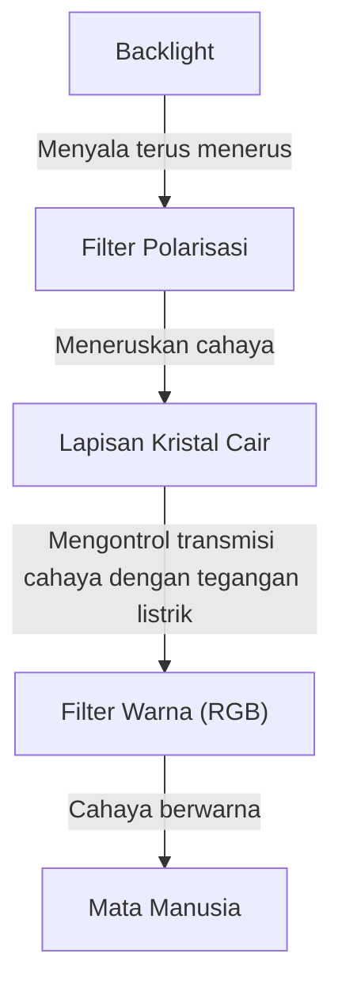
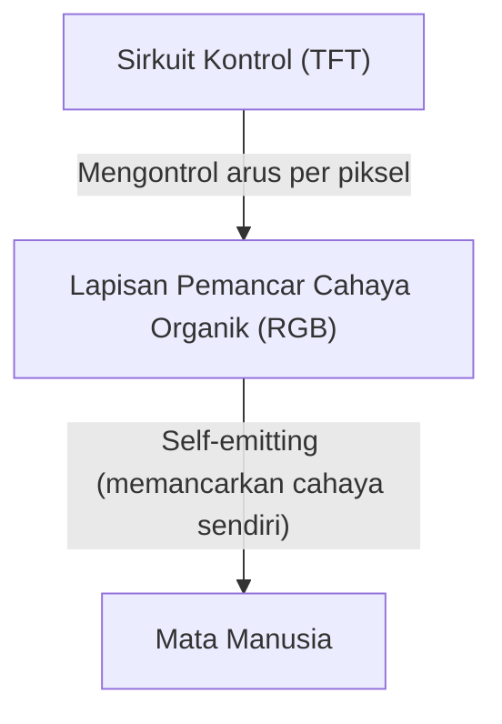

## 1. Pendahuluan
Layar OLED (Organic Light Emitting Diode) kini umum digunakan pada ponsel cerdas modern dan televisi kelas atas. Saat mendengar istilah "OLED", kita sering kali membayangkan kualitas gambar yang superior dan desain yang tipis. Namun, apa sebenarnya keunggulan teknologi ini? Artikel ini akan mengupas mekanisme layar OLED dari perspektif rekayasa teknik (engineering), menjelaskan mengapa layar ini mampu menampilkan "warna hitam sejati" (true black), dan menguraikan fenomena yang dikenal sebagai "burn-in".

## 2. Apa itu OLED (Organic Light Emitting Diode)?
OLED adalah singkatan dari Organic Light Emitting Diode. Pada dasarnya, teknologi ini memanfaatkan fenomena electroluminescence, di mana senyawa organik tertentu akan memancarkan cahaya saat dialiri arus listrik.

Berbeda dengan LED konvensional yang menggunakan bahan anorganik (seperti galium arsenida), OLED menggunakan senyawa organik berbasis karbon sebagai material pemancar cahaya. Karakteristik utama OLED adalah kemampuannya memancarkan cahaya sendiri (self-emitting). Artinya, setiap titik kecil (piksel atau subpiksel) yang membentuk layar dapat memancarkan cahayanya sendiri.

## 3. Perbedaan Fundamental dengan Layar LCD
Cara termudah untuk memahami cara kerja OLED adalah dengan membandingkannya dengan layar LCD (Liquid Crystal Display), yang telah lama mendominasi teknologi layar.

### Cara Kerja Layar LCD
Layar LCD tidak dapat memancarkan cahaya sendiri. Layar ini menggunakan sumber cahaya kuat yang disebut "backlight" (biasanya LED putih) yang ditempatkan di bagian belakang, dan menggunakan panel kristal cair sebagai penutup (shutter) untuk menghalangi atau membiarkan cahaya lewat.

Lapisan kristal cair mengontrol jumlah cahaya yang ditransmisikan dengan mengubah susunan molekulnya saat tegangan listrik dialirkan. Namun, meskipun penutup cahaya tersebut tertutup sepenuhnya, sedikit cahaya dari backlight yang kuat di bagian belakang akan tetap bocor. Inilah sebabnya mengapa warna hitam pada layar LCD sering terlihat sedikit keputihan atau keabu-abuan saat dilihat di ruangan gelap.

### Cara Kerja Layar OLED
Sebaliknya, OLED tidak memiliki backlight. Material organik pemancar cahaya berwarna merah (R), hijau (G), dan biru (B) yang berada di dalam setiap piksel secara independen memancarkan cahaya berdasarkan jumlah arus listrik yang diterimanya.

## 4. Mengapa "Warna Hitam Sejati" Dapat Dihasilkan?
Alasan mengapa OLED membuat warna "hitam terlihat benar-benar hitam" bermuara pada karakteristik self-emitting-nya.
Saat menampilkan warna hitam, layar LCD mencoba menutup penutup (shutter) cahaya sambil tetap menyalakan backlight. Namun, OLED cukup memutus total arus listrik ke piksel tersebut dan menghentikan emisi cahaya (mematikannya).

Karena tidak ada cahaya yang dipancarkan sama sekali, area tersebut secara fisik identik dengan kegelapan absolut, yang menghasilkan "hitam sejati" (pitch black). Oleh karena itu, rasio kontras layar OLED (rasio kecerahan antara warna putih paling terang dan warna hitam paling gelap) dapat mencapai jutaan banding satu, atau bahkan sering disebut sebagai "tak terhingga", jauh melebihi layar LCD yang hanya memiliki rasio ribuan banding satu. Warna hitam yang pekat inilah yang membuat kedalaman dan kecerahan gambar menjadi sangat menonjol.

## 5. Kelebihan OLED dan Perluasan Aplikasinya
Karena tidak memerlukan backlight atau filter optik yang rumit, OLED memiliki banyak keunggulan fisik di luar kualitas gambar yang superior.

* **Desain Tipis dan Ringan**: Karena komponen yang digunakan lebih sedikit, produsen dapat membuat layar yang setipis kertas dan sangat ringan.
* **Fleksibilitas**: Dengan menggunakan material plastik fleksibel (seperti polimida) sebagai substrat alih-alih kaca, produsen dapat menciptakan layar yang dapat ditekuk atau dilipat (misalnya, pada ponsel lipat).
* **Waktu Respons yang Cepat**: Tidak seperti LCD yang memerlukan pergerakan fisik molekul kristal cair, OLED langsung bereaksi terhadap perubahan arus listrik dalam hitungan nanodetik hingga mikrodetik. Hal ini mengurangi efek buram gerakan (motion blur) pada gambar dengan pergerakan cepat atau saat bermain game.

## 6. Kelebihan dan Kelemahan dalam Konsumsi Daya
Karena OLED adalah tipe yang memancarkan cahayanya sendiri, layar ini dapat sepenuhnya mematikan daya pada piksel-piksel tersebut saat menampilkan warna hitam. Oleh karena itu, penggunaan "Dark Mode" (antarmuka dengan latar belakang gelap) dapat menghemat masa pakai baterai ponsel secara signifikan, karena sebagian besar layar dimatikan.

Di sisi lain, saat menampilkan layar serba putih (seperti saat menjelajahi web atau mengedit dokumen), semua piksel harus memancarkan cahaya pada kecerahan maksimum. Akibatnya, konsumsi dayanya dapat lebih tinggi daripada layar LCD dengan ukuran yang sama. Layar LCD mempertahankan kecerahan backlight yang konstan tanpa memedulikan konten yang ditampilkan (sehingga hanya menghalangi cahaya), yang berarti konsumsi dayanya relatif stabil baik saat menampilkan warna hitam maupun putih.

## 7. Tantangan Terbesar OLED: Mekanisme "Burn-in"
Meskipun OLED memiliki karakteristik yang luar biasa, layar ini menghadapi tantangan rekayasa yang signifikan yang dikenal sebagai "burn-in". Burn-in terjadi ketika layar secara terus-menerus menampilkan gambar statis yang sama (seperti logo saluran TV, bilah status ponsel, atau UI game) untuk waktu yang lama, meninggalkan bayangan gambar yang permanen bahkan saat tampilan beralih ke gambar lain.

### Mengapa Burn-in Terjadi?
Akar penyebab burn-in adalah "degradasi" (penurunan kualitas) material pemancar cahaya organik. Senyawa organik perlahan-lahan menurun kualitasnya saat terus memancarkan cahaya, kehilangan kemampuannya untuk mempertahankan kecerahan asli dengan jumlah arus listrik yang sama (penurunan efisiensi pendaran).
Secara khusus, material organik pemancar warna biru (B) memiliki masa pakai yang lebih pendek secara fisik. Hal ini karena warna biru memiliki energi pendaran yang lebih tinggi daripada warna merah (R) dan hijau (G), sehingga struktur molekulnya lebih rentan terhadap ketidakstabilan.

Misalnya, jika layar terus-menerus menampilkan peramban web dengan latar belakang putih atau UI statis untuk waktu yang lama, piksel-piksel pada area tersebut akan bekerja lebih keras daripada piksel lainnya. Piksel yang terlalu dipaksakan ini akan terdegradasi lebih cepat, dan pancaran cahayanya akan meredup. Akibatnya, saat menampilkan satu warna solid di seluruh layar, area yang sangat terdegradasi tersebut akan tampak lebih gelap, yang dirasakan sebagai "bayangan permanen". Inilah mekanisme terjadinya burn-in.

## 8. Pendekatan Teknis untuk Mencegah Burn-in
Produsen layar sangat menyadari masalah ini dan telah menerapkan berbagai tindakan pencegahan (teknik mitigasi burn-in) di tingkat perangkat keras dan perangkat lunak.

* **Pixel Shift (Pergeseran Piksel)**: Teknologi yang menggeser sedikit seluruh gambar tampilan (dalam hitungan beberapa piksel) secara berkala dan halus sehingga pengguna tidak menyadarinya. Hal ini mencegah beban terpusat pada piksel tertentu.
* **ABL (Auto Brightness Limiter)**: Fungsi yang secara otomatis mengurangi kecerahan layar secara keseluruhan saat gambar yang sangat terang (seperti layar putih penuh) ditampilkan. Fungsi ini membantu mengurangi konsumsi daya dan panas, serta mencegah degradasi elemen pemancar cahaya.
* **Pengurangan Kecerahan Logo**: Pemrosesan perangkat lunak yang menggunakan analisis gambar untuk mendeteksi logo atau UI statis di area tertentu pada layar dan secara lokal mengurangi kecerahan area tersebut saja.
* **Pixel Refresher**: Fungsi koreksi otomatis yang berjalan saat TV (atau perangkat) dalam mode siaga. Fungsi ini mengukur tegangan listrik dan tingkat degradasi setiap piksel, serta menyeragamkan variasi kecerahan antar piksel.
* **Penyesuaian Area Subpiksel**: Desain yang membuat subpiksel biru (yang memiliki masa pakai lebih pendek) lebih besar daripada subpiksel merah dan hijau (misalnya, susunan PenTile). Hal ini memungkinkan penurunan kepadatan arus yang dibutuhkan untuk mencapai tingkat kecerahan yang sama, sehingga memperpanjang usia elemen warna biru.

## 9. Garis Depan Manufaktur OLED dan Evolusi Material
Proses pembuatan layar OLED juga merupakan salah satu pencapaian teknis yang luar biasa.
Metode arus utama saat ini disebut "Vacuum Evaporation" (Evaporasi Vakum). Dalam metode ini, senyawa organik dipanaskan hingga menguap di dalam ruang hulu vakum raksasa. Senyawa tersebut kemudian melewati masker logam dengan lubang-lubang yang sangat kecil (Fine Metal Mask / FMM) untuk disimpan di atas substrat kaca dengan presisi berskala nanometer. Proses ini sangat presisi dan mahal, tetapi penting untuk memproduksi panel berkualitas tinggi secara massal.
Selain itu, penelitian mengenai "Metode Pencetakan Inkjet," yang menerapkan teknik pencetakan untuk mengaplikasikan material organik secara langsung ke substrat, juga sedang mengalami kemajuan pesat. Teknologi ini diharapkan dapat memangkas biaya produksi dan memangkas harga panel berukuran besar.

Penelitian tentang material pemancar cahaya itu sendiri juga mengalami kemajuan setiap harinya. Transisi dari material fluoresen awal ke material fosforesen (Phosphorescent OLED: PHOLED) dengan efisiensi pendaran yang lebih tinggi sedang berlangsung. Selain itu, teknologi pendaran tertunda yang diaktifkan secara termal (Thermally Activated Delayed Fluorescence / TADF), yang dikenal sebagai material pemancar cahaya generasi ketiga, kini mulai mendapat banyak perhatian. TADF berpotensi menghasilkan efisiensi pendaran cahaya yang tinggi tanpa menggunakan logam langka (rare metals), dan diharapkan menjadi kunci untuk membuat layar OLED menjadi lebih hemat daya dan lebih terjangkau.

## 10. Kesimpulan dan Prospek Masa Depan
Layar OLED telah secara dramatis meningkatkan kualitas pengalaman visual modern berkat kemampuannya menampilkan "hitam sejati" (true black) secara independen, rasio kontras yang tidak terbatas, serta tingkat ketipisan dan fleksibilitasnya yang luar biasa. Melalui upaya tanpa henti dari para insinyur (engineer), tantangan burn-in yang melekat pada material organik secara bertahap berhasil diatasi hingga tingkat di mana hal itu tidak lagi menjadi masalah yang berarti dalam penggunaan sehari-hari.

Ke depannya, pengembangan "layar Micro-LED" yang menggabungkan kualitas gambar OLED dengan daya tahan LCD melalui penempatan LED anorganik berukuran mikro alih-alih material organik, serta pengembangan material pemancar cahaya yang lebih ramah lingkungan dan sangat efisien, sedang terus digenjot. Evolusi teknologi layar pastinya akan terus memanjakan mata kita. Dan di balik perangkat yang kita lihat setiap hari ini, tersimpan hasil dedikasi luar biasa dari bidang ilmu material dan rekayasa elektronika.
