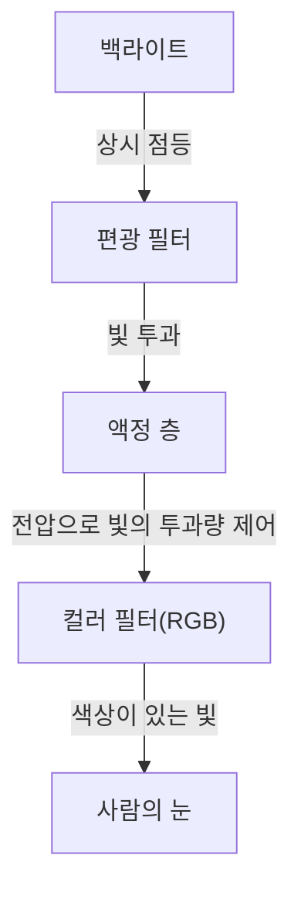
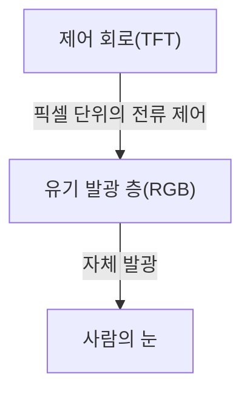

## 1. 서론
최근 스마트폰과 하이엔드 TV에서 보편적으로 사용되고 있는 OLED(유기발광다이오드) 디스플레이. 'OLED'라고 하면 화질이 좋고 얇다는 이미지가 먼저 떠오르지만, 기술적으로 어떤 점이 우수한 것일까요? 본 문서에서는 엔지니어링 관점에서 OLED 디스플레이의 작동 원리를 분석하고, 왜 '완벽한 블랙'을 표현할 수 있는지, 그리고 왜 '번인(Burn-in)'이라고 불리는 현상이 발생하는지 해설합니다.

## 2. OLED(유기발광다이오드)란 무엇인가?
OLED는 Organic Light Emitting Diode의 약자로, 한국어로는 '유기발광다이오드'라고 불립니다. 기본 원리로는 특정 유기 화합물에 전류를 인가했을 때 빛을 발산하는 현상(전계발광, Electroluminescence)을 이용합니다.

일반적인 LED가 무기 재료(갈륨비소 등)를 사용하는 반면, OLED는 탄소를 주성분으로 하는 유기 화합물을 발광 재료로 사용합니다. OLED의 가장 큰 특징은 '자체 발광(Self-emitting)'이라는 점입니다. 즉, 디스플레이를 구성하는 각각의 작은 점(픽셀 또는 서브픽셀)이 스스로 빛을 내는 구조로 되어 있습니다.

## 3. LCD(액정 디스플레이)와의 결정적인 차이
OLED의 원리를 이해하는 데 있어 가장 알기 쉬운 방법은 오랫동안 디스플레이의 주역이었던 LCD(Liquid Crystal Display)와 비교하는 것입니다.

### LCD 디스플레이의 원리
LCD 디스플레이는 그 자체로 빛을 내지 않습니다. 후면에 '백라이트(Backlight)'라고 불리는 강력한 광원(일반적으로 백색 LED)을 배치하고, 그 빛을 제어하는 셔터로서 액정 패널을 기능시킵니다.

액정 층은 전압을 인가하여 분자의 배열을 변화시키고 빛의 투과량을 제어합니다. 그러나 셔터를 완전히 닫으려고 해도 후면의 강력한 백라이트 빛이 미세하게 새어 나옵니다. 이것이 LCD 디스플레이에서 표현되는 블랙이 어두운 곳에서 보았을 때 다소 희뿌옇게(회색빛을 띠게) 보이는 이유입니다.

### OLED 디스플레이의 원리
반면, OLED에는 백라이트가 존재하지 않습니다. 각 픽셀 내에 배치된 적색(R), 녹색(G), 청색(B)의 유기 발광 재료 자체가 인가받은 전류량에 따라 독립적으로 빛을 방출합니다.

## 4. 왜 '완벽한 블랙'을 표현할 수 있는가?
OLED가 '완벽한 블랙'을 구현하는 이유는 자체 발광이라는 특성 덕분입니다.
블랙을 표시하고자 할 때, LCD는 '백라이트를 켠 상태에서 셔터를 닫는' 방식으로 블랙을 표현하려 합니다. 그러나 OLED는 단순히 '해당 픽셀에 대한 전류 공급을 완전히 차단하여 발광을 중지(소등)하는' 것만으로 충분합니다.

빛이 전혀 방출되지 않는 상태가 되기 때문에, 그 부분은 물리적인 암흑과 동일해져 '완벽한 블랙(Pitch Black)'을 실현할 수 있습니다. 이로 인해 OLED의 명암비(가장 밝은 화이트와 가장 어두운 블랙의 휘도 비율)는 수천 대 1 수준인 LCD에 비해, 수백만 대 1 또는 '무한대'로 표현될 만큼 압도적인 수치를 자랑합니다. 영상의 입체감과 선명함은 이러한 깊은 블랙이 존재하기 때문에 더욱 돋보이는 것입니다.

## 5. OLED의 장점과 확대되는 용도
백라이트나 복잡한 광학 필터가 필요하지 않기 때문에, OLED는 화질 외에도 여러 물리적 장점을 가지고 있습니다.

* **박형화 및 경량화**: 구성 부품이 적어 종이처럼 얇고 놀라울 정도로 가벼운 디스플레이 제조가 가능합니다.
* **유연성(Flexibility)**: 기판에 유리가 아닌 플라스틱 계열의 유연한 소재(폴리이미드 등)를 사용함으로써 구부리거나 접을 수 있는 디스플레이(폴더블 스마트폰 등) 구현이 가능해집니다.
* **빠른 응답 속도**: 액정 분자를 물리적으로 움직여야 하는 LCD와 달리, OLED는 전류 변화에 대해 나노초(ns)에서 마이크로초(μs) 단위로 즉각 반응합니다. 이에 따라 움직임이 격렬한 영상이나 게임 플레이에서도 잔상(모션 블러)이 거의 발생하지 않습니다.

## 6. 소비 전력의 장점과 함정
OLED는 자체 발광형이기 때문에 블랙을 표시할 때 해당 영역 픽셀의 전력을 완전히 차단할 수 있습니다. 따라서 다크 모드(블랙 기반 UI)를 사용하면 화면의 대부분이 소등 상태가 되어 스마트폰의 배터리 구동 시간을 대폭 연장할 수 있습니다.
반면, 화면 전체를 완전한 화이트로 표시하는 경우(웹 브라우징이나 문서 작성 등)에는 모든 픽셀을 최대 휘도로 발광시켜야 하므로, 동일한 화면 크기의 LCD 디스플레이보다 오히려 소비 전력이 커지는 경우가 있습니다. LCD는 화면의 표시 내용과 관계없이 백라이트를 일정한 강도로 켜두고 빛을 차단하는 방식이기 때문에, 화이트를 표시하든 블랙을 표시하든 소비 전력의 변동이 적은 것이 특징입니다.

## 7. OLED의 최대 과제: '번인(Burn-in)'의 메커니즘
뛰어난 특성을 지닌 OLED이지만, 엔지니어링 측면에서 '번인(Burn-in)'이라는 큰 과제가 존재합니다. 번인이란 디스플레이에 동일한 이미지(방송국 로고, 스마트폰 상태 표시줄, 게임 UI 등)를 장시간 계속 표시한 결과, 다른 화면으로 전환해도 해당 이미지의 잔상이 희미하게 영구적으로 남는 현상입니다.

### 왜 번인이 발생하는가?
번인의 근본적인 원인은 유기 발광 재료의 '열화'입니다. 유기 화합물은 전류를 흘려 계속 발광시키면 점진적으로 열화되어, 동일한 전류를 인가해도 이전과 같은 밝기를 유지할 수 없게 됩니다(발광 효율 저하).
특히 청색(B)을 발광하는 유기 재료는 적색(R)이나 녹색(G)에 비해 발광 에너지가 높고 분자 구조가 불안정해지기 쉬워 수명이 짧다는 물리적인 특성을 갖습니다.

예를 들어, 흰색 배경의 웹 브라우저나 특정 UI가 고정된 화면을 장시간 계속 표시하면 해당 부분의 픽셀만이 혹사당합니다. 혹사당한 픽셀은 주변 픽셀보다 빠르게 열화되어 발광량이 감소합니다. 그 결과 화면 전체를 단색으로 표시했을 때 열화가 심한 부분만 어둡게 보이며, 이것이 '잔상'으로 인식되는 것입니다. 이것이 번인의 실체입니다.

## 8. 번인을 방지하기 위한 기술적 접근
디스플레이 제조업체들은 이 문제를 심각하게 받아들여, 하드웨어 및 소프트웨어 양면에서 다양한 대책(번인 완화 기술)을 구현하고 있습니다.

* **픽셀 시프트(Pixel Shift) 기능**: 사용자가 인지하지 못하는 수준(수 픽셀 단위)으로 정기적으로 화면 전체의 표시 위치를 조금씩 이동시키는 기술입니다. 이를 통해 특정 픽셀에만 부하가 집중되는 것을 방지합니다.
* **ABL(Auto Brightness Limiter)**: 화면 전체가 하얗게 변하는 밝은 영상이 표시될 때, 디스플레이의 소비 전력과 발열을 억제하고 소자의 열화를 방지하기 위해 자동으로 전체 휘도를 낮추는 기능입니다.
* **로고 휘도 저감 기능**: 화면 내 특정 영역에 정지된 로고나 UI가 있음을 이미지 분석을 통해 감지하고, 해당 부분의 밝기만을 국소적으로 낮추는 소프트웨어 처리입니다.
* **픽셀 리프레셔(Pixel Refresher)**: TV 등의 전원을 끈 대기 상태일 때, 픽셀 단위의 전압 및 열화 상태를 측정하고 각 픽셀 간 휘도 편차를 균일화하는 보정 처리를 자동으로 수행하는 기능입니다.
* **서브픽셀 면적 조정**: 수명이 짧은 청색 서브픽셀을 사전에 적색이나 녹색보다 크게 설계함으로써, 동일한 밝기를 내기 위한 전류 밀도를 낮춰 청색 소자의 수명을 연장하는 기법(펜타일 배열 등)도 적용되고 있습니다.

## 9. OLED 제조의 최전선과 소재의 진화
OLED 디스플레이를 제조하기 위한 공정도 기술적인 볼거리 중 하나입니다.
현재 주류는 '진공 증착법(Vacuum Evaporation)'이라 불리는 방식입니다. 거대한 진공 챔버 내부에서 유기 화합물을 가열하여 기화시키고, 미세한 구멍이 뚫린 금속 마스크(파인 메탈 마스크: FMM)를 통해 유리 기판 위에 나노미터 단위의 정밀도로 유기 재료를 증착합니다. 매우 정밀하고 비용이 많이 드는 제조 방식이지만, 고품질 패널을 대량 생산하기 위해 필수적인 기술로 자리 잡고 있습니다.
또한 최근에는 인쇄 기술을 응용하여 유기 재료를 기판에 직접 도포하는 '잉크젯 프린팅(Inkjet Printing)' 공법에 대한 연구도 진행되고 있어, 제조 비용의 대폭적인 절감과 대형 패널의 가격 인하가 기대되고 있습니다.

발광 재료 자체에 대한 연구도 일취월장하고 있습니다. 초기 형광 재료에서 발광 효율이 더 높은 인광 재료(Phosphorescent OLED: PHOLED)로의 전환이 진행되었으며, 나아가 현재는 제3세대 발광 재료라 불리는 열활성지연형광(TADF) 기술이 주목받고 있습니다. TADF는 희귀 금속(레어 메탈)을 사용하지 않고도 고효율 발광을 실현할 가능성이 있어, OLED의 추가적인 저전력화 및 저비용화를 이끌 핵심 기술로 기대됩니다.

## 10. 요약 및 향후 전망
OLED 디스플레이는 자체 발광을 통한 '완벽한 블랙'과 무한대의 명암비, 그리고 압도적인 얇기와 유연성으로 현대의 영상 경험을 획기적으로 향상시켰습니다. 번인이라는 유기 재료 특유의 과제 역시 엔지니어들의 끊임없는 노력을 통해 일상적인 사용에 있어 큰 문제가 되지 않는 수준까지 극복되어 가고 있습니다.

더 나아가 향후에는 유기 재료 대신 무기물의 미세한 LED를 촘촘히 배열하여 OLED의 화질과 LCD의 내구성을 양립시킨 '마이크로 LED 디스플레이', 그리고 더욱 친환경적이고 고효율인 발광 재료의 개발도 진행되고 있습니다. 디스플레이 기술의 진화는 앞으로도 우리의 눈을 즐겁게 해줄 것입니다. 그리고 우리가 일상적으로 마주하는 이러한 기기들의 이면에는 끝없는 재료 과학과 전자 공학의 결실이 담겨 있습니다.
