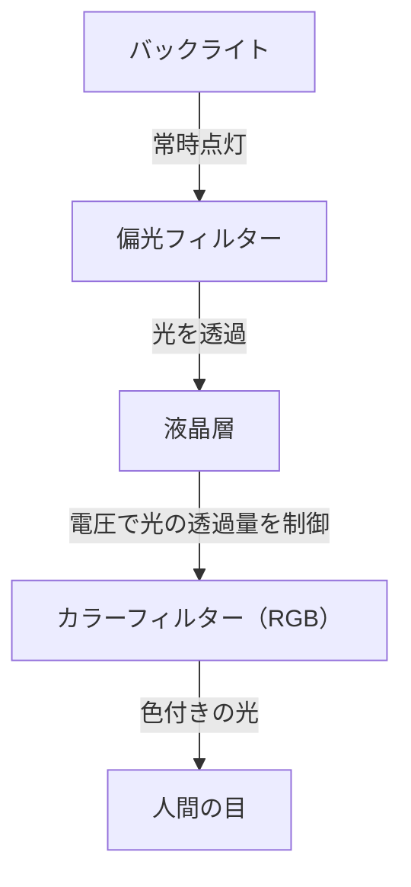
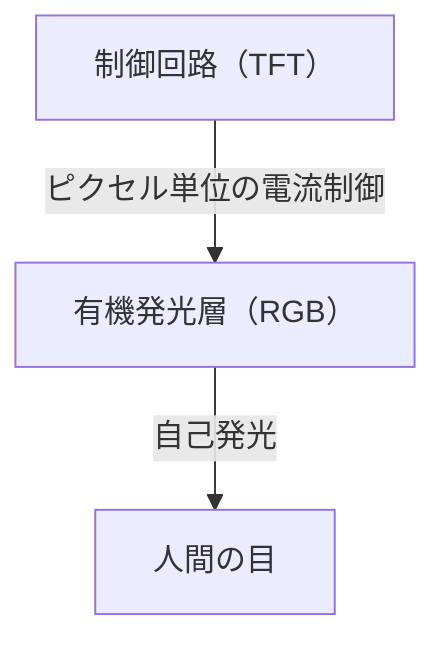

## 1. はじめに
近年のスマートフォンやハイエンドなテレビで当たり前のように使われるようになったOLED（有機EL）ディスプレイ。「有機EL」と聞くと、画質が良い、薄い、というイメージが先行しますが、技術的に何が優れているのでしょうか。本記事では、エンジニアリングの視点からOLEDディスプレイの仕組みに迫り、なぜ「真の黒」を表現できるのか、そしてなぜ「焼き付き」と呼ばれる現象が起きてしまうのかを解説します。

## 2. OLED（有機発光ダイオード）とは何か？
OLEDとは、Organic Light Emitting Diodeの略称であり、日本語では「有機発光ダイオード」と呼ばれます。基本的な原理としては、特定の有機化合物に電流を流すことで発光する現象（エレクトロルミネッセンス）を利用しています。

一般的なLEDが無機材料（ガリウムヒ素など）を使用しているのに対し、OLEDは炭素を主体とした有機化合物を発光材料として使用しています。OLEDの最大の特徴は「自己発光（Self-emitting）」である点です。つまり、ディスプレイを構成する一つ一つの小さな点（ピクセル、あるいはサブピクセル）が、自ら光を放つ仕組みになっています。

## 3. 液晶（LCD）ディスプレイとの決定的な違い
OLEDの仕組みを理解する上で最も分かりやすいのは、長らくディスプレイの主役であった液晶ディスプレイ（LCD: Liquid Crystal Display）と比較することです。

### 液晶ディスプレイの仕組み
液晶ディスプレイは、それ自体が光るわけではありません。背面に「バックライト」と呼ばれる強力な光源（通常は白色LED）を配置し、その光のシャッターとして液晶パネルを機能させています。

液晶層は、電圧をかけることで分子の並びを変え、光の透過量をコントロールします。しかし、シャッターを完全に閉じようとしても、背後にある強力なバックライトの光がわずかに漏れ出てしまいます。これが、液晶ディスプレイで表示される黒が、暗闇で見ると少し白っぽく（グレーがかって）見える理由です。

### OLEDディスプレイの仕組み
一方、OLEDにはバックライトが存在しません。各ピクセル内に配置された赤（R）、緑（G）、青（B）の有機発光材料そのものが、受け取った電流量に応じて独立して光を放ちます。

## 4. なぜ「真の黒」が表現できるのか？
OLEDが「黒が本当に黒く見える」理由は、その自己発光という特性に尽きます。
黒を表示したい場合、液晶ディスプレイは「バックライトを点けたままシャッターを閉じる」ことで黒を表現しようとします。しかし、OLEDは単に「そのピクセルへの電流を完全に遮断し、発光を止める（消灯する）」だけで済みます。

光が全く発せられない状態になるため、その部分は物理的な暗闇と同義になり、「真の黒（ピッチブラック）」が実現できるのです。このため、OLEDのコントラスト比（最も明るい白と最も暗い黒の輝度比）は、液晶の数千対1に対して、数百万対1、あるいは「無限大」と表現されるほどの圧倒的な数値を誇ります。映像の立体感や鮮やかさは、この深い黒があるからこそ際立つのです。

## 5. OLEDのメリットと広がる用途
バックライトや複雑な光学フィルターが不要なため、OLEDには画質以外にも多くの物理的メリットがあります。

* **薄型化・軽量化**: 構成パーツが少ないため、紙のように薄く、驚くほど軽いディスプレイを製造できます。
* **フレキシブル性（柔軟性）**: 基板にガラスではなくプラスチック系の柔軟な素材（ポリイミドなど）を使用することで、曲げたり、折りたたんだりできるディスプレイ（フォルダブルスマホなど）が実現可能になります。
* **応答速度の速さ**: 液晶分子を物理的に動かす必要があるLCDに対し、OLEDは電流の変化に対してナノ秒からマイクロ秒単位で即座に反応します。これにより、動きの激しい映像やゲームプレイでも残像感（モーションブラー）が発生しにくくなります。

## 6. 消費電力のメリットと落とし穴
OLEDは自己発光型であるため、黒を表示する際にはその部分のピクセルの電力を完全にカットできます。そのため、ダークモード（黒基調のUI）を使用すると、画面の大部分が消灯状態となり、スマートフォンのバッテリー駆動時間を大幅に延ばすことができます。
一方で、画面全体を真っ白にするような表示（ウェブブラウジングや書類作成など）では、全ピクセルを最大輝度で発光させる必要があるため、同じ画面サイズの液晶ディスプレイよりも逆に消費電力が大きくなるケースがあります。液晶は画面の表示内容に関わらず、バックライトを一定の強さで点灯させて光を遮断する方式のため、白を表示しても黒を表示しても消費電力の変動が少ないのが特徴です。

## 7. OLEDの最大の課題：「焼き付き（Burn-in）」のメカニズム
素晴らしい特性を持つOLEDですが、エンジニアリング上の大きな課題として「焼き付き」が存在します。焼き付きとは、ディスプレイに同じ画像（テレビ局のロゴや、スマートフォンのステータスバー、ゲームのUIなど）を長時間表示し続けた結果、別の画面に切り替えてもその画像の残像がうっすらと永久に残ってしまう現象です。

### なぜ焼き付きが起きるのか？
焼き付きの根本的な原因は、有機発光材料の「劣化」です。有機化合物は、電流を流して発光させ続けると徐々に劣化し、同じ電流を流しても以前と同じ明るさを維持できなくなります（発光効率の低下）。
特に、青色（B）を発光する有機材料は、赤（R）や緑（G）に比べて発光エネルギーが高く、分子構造が不安定になりやすいため、寿命が短いという物理的な特性を持っています。

例えば、白い背景のウェブブラウザや、特定のUIが固定された画面を長時間表示し続けると、その部分のピクセルだけが酷使されます。酷使されたピクセルは周囲のピクセルよりも早く劣化し、発光量が落ちます。その結果、画面全体を単色で表示したときに、劣化の激しい部分だけが暗く見え、それが「残像」として認識されてしまうのです。これが焼き付きの正体です。

## 8. 焼き付きを防ぐための技術的アプローチ
ディスプレイメーカーはこの問題を重く受け止め、ハードウェア・ソフトウェアの両面から様々な対策（焼き付き緩和技術）を実装しています。

* **ピクセルシフト機能**: ユーザーが気づかないレベル（数ピクセル単位）で、定期的に画面全体の表示位置を少しずつズラす技術です。これにより、特定のピクセルだけに負荷が集中するのを防ぎます。
* **ABL（Auto Brightness Limiter）**: 画面全体が白くなるような明るい映像が表示された際、ディスプレイの消費電力と発熱を抑え、素子の劣化を防ぐために自動で全体の輝度を下げる機能です。
* **ロゴの輝度低減機能**: 画面内の特定の領域に静止したロゴやUIがあることを画像解析で検知し、その部分だけの明るさを局所的に下げるソフトウェア処理です。
* **ピクセルリフレッシャー**: テレビなどをオフにしている待機時に、ピクセルごとの電圧や劣化状態を測定し、各ピクセルの輝度のばらつきを均一化する補正処理を自動的に行う機能です。
* **サブピクセルの面積調整**: 寿命の短い青色のサブピクセルを、あらかじめ赤や緑よりも大きく設計することで、同じ明るさを出すための電流密度を下げ、青色素子の寿命を延ばす工夫（ペンタイル配列など）も行われています。

## 9. OLED製造の最前線と素材の進化
OLEDディスプレイを製造するためのプロセスも、技術的な見どころの一つです。
現在の主流は「真空蒸着法（Vacuum Evaporation）」と呼ばれる手法です。巨大な真空チャンバーの中で有機化合物を加熱して気化させ、微細な穴が開いた金属製のマスク（ファインメタルマスク：FMM）を通して、ガラス基板上にナノメートル単位の精度で有機材料を定着させます。非常に精密でコストのかかる製造方法ですが、高品質なパネルを大量生産するために不可欠な技術となっています。
また、近年では印刷技術を応用して有機材料を基板に直接塗布する「インクジェット印刷法」の研究も進んでおり、製造コストの大幅な削減と大型パネルの低価格化が期待されています。

発光材料そのものの研究も日進月歩です。初期の蛍光材料から、より発光効率の高いリン光材料（Phosphorescent OLED: PHOLED）への移行が進み、さらに現在では第3世代の発光材料と呼ばれる熱活性化遅延蛍光（TADF）技術が注目を集めています。TADFはレアメタル（希少金属）を使用せずに高効率な発光を実現できる可能性があり、OLEDのさらなる省電力化と低コスト化の切り札として期待されています。

## 10. まとめと今後の展望
OLEDディスプレイは、自己発光による「真の黒」と無限のコントラスト比、そして圧倒的な薄さと柔軟性により、現代の映像体験を劇的に向上させました。焼き付きという有機材料ならではの課題も、エンジニアたちのたゆまぬ努力により、日常的な使用において大きな問題にならないレベルまで克服されつつあります。

さらにその先には、有機材料ではなく無機の微小なLEDを敷き詰めることで、OLEDの画質と液晶の耐久性を両立させた「マイクロLEDディスプレイ」や、より環境に優しく高効率な発光材料の開発も進んでいます。ディスプレイ技術の進化は、今後も私たちの目を楽しませてくれることでしょう。そして、日常的に私たちが目にするこれらのデバイスの背後には、果てしない材料科学と電子工学の結晶が詰まっているのです。
