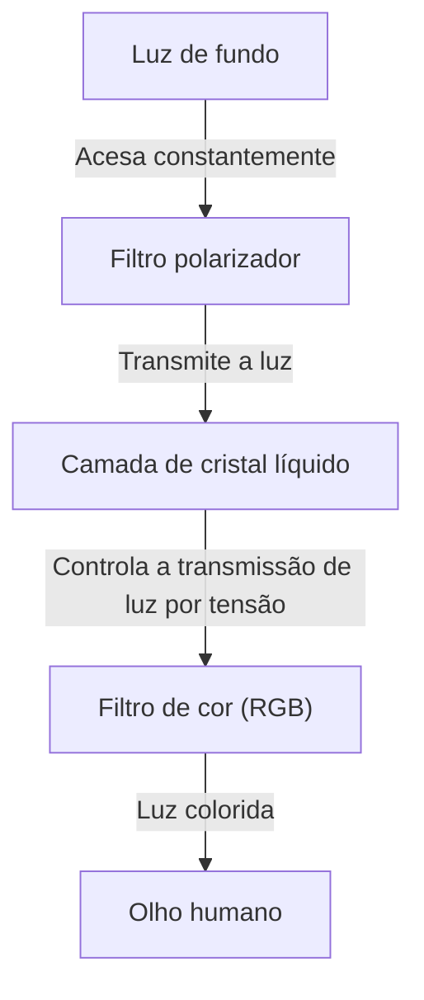
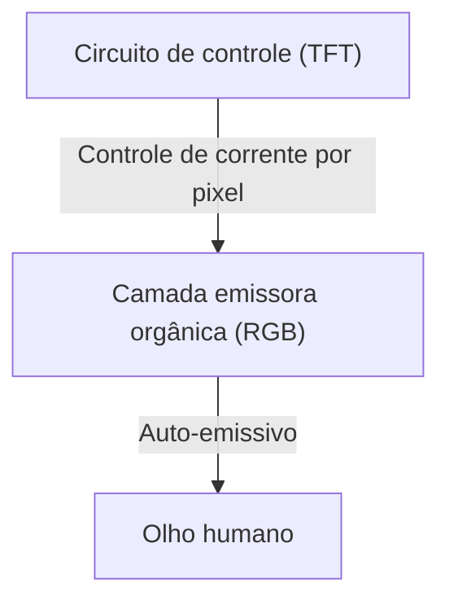

## 1. Introdução
Os displays OLED (Diodo Emissor de Luz Orgânico) tornaram-se comuns em smartphones recentes e televisores de última geração. Ao ouvir "OLED" (ou "EL orgânico"), a primeira impressão costuma ser de alta qualidade de imagem e perfil fino, mas o que os torna tecnologicamente superiores? Neste artigo, exploraremos o mecanismo dos displays OLED do ponto de vista da engenharia e explicaremos por que eles podem exibir o "preto verdadeiro" e por que ocorre o fenômeno conhecido como "burn-in" (retenção de imagem).

## 2. O que é OLED (Diodo Emissor de Luz Orgânico)?
OLED é a abreviação de Organic Light Emitting Diode, traduzido como "Diodo Emissor de Luz Orgânico". O princípio básico utiliza um fenômeno (eletroluminescência) no qual compostos orgânicos específicos emitem luz quando uma corrente elétrica passa por eles.

Enquanto os LEDs comuns usam materiais inorgânicos (como arseneto de gálio), o OLED usa compostos orgânicos baseados em carbono como material emissor de luz. A maior característica do OLED é ser "auto-emissivo" (Self-emitting). Ou seja, cada pequeno ponto (pixel ou subpixel) que compõe o display emite luz por conta própria.

## 3. A diferença crucial em relação aos displays de cristal líquido (LCD)
A maneira mais fácil de entender o funcionamento do OLED é compará-lo com os displays de cristal líquido (LCD: Liquid Crystal Display), que foram os protagonistas dos displays por muito tempo.

### Como funcionam os displays de cristal líquido
Um display de cristal líquido não brilha por si só. Ele possui uma fonte de luz forte (geralmente LEDs brancos) chamada "luz de fundo" na parte traseira, e o painel de cristal líquido funciona como um obturador para essa luz.

A camada de cristal líquido altera o alinhamento das moléculas aplicando tensão, controlando a quantidade de transmissão de luz. No entanto, mesmo ao tentar fechar completamente o obturador, um pouco da forte luz de fundo traseira vaza. É por isso que o preto exibido em um display de cristal líquido parece levemente esbranquiçado (acinzentado) quando visto no escuro.

### Como funcionam os displays OLED
Por outro lado, o OLED não possui luz de fundo. Os próprios materiais orgânicos emissores de luz vermelha (R), verde (G) e azul (B) dispostos dentro de cada pixel emitem luz independentemente, de acordo com a quantidade de corrente recebida.

## 4. Por que é possível expressar o "preto verdadeiro"?
A razão pela qual o OLED faz "o preto parecer realmente preto" resume-se à sua característica auto-emissiva.
Quando se deseja exibir a cor preta, um display de cristal líquido tenta representá-la "fechando o obturador enquanto mantém a luz de fundo acesa". No entanto, no OLED, basta "cortar completamente a corrente para aquele pixel, interrompendo a emissão de luz (apagando)".

Como nenhum fóton é emitido, essa parte torna-se fisicamente idêntica à escuridão, alcançando o "preto verdadeiro" (pitch black). Devido a isso, a taxa de contraste do OLED (a proporção de luminância entre o branco mais brilhante e o preto mais escuro) possui um valor avassalador que muitas vezes é descrito como "infinito" ou de milhões para um, em comparação com os milhares para um do LCD. A tridimensionalidade e a vivacidade da imagem destacam-se justamente por causa desse preto profundo.

## 5. Vantagens e aplicações crescentes do OLED
Como não necessita de luz de fundo ou filtros ópticos complexos, o OLED possui muitas vantagens físicas além da qualidade de imagem.

* **Fino e leve**: Como possui poucos componentes, é possível fabricar displays finos como papel e incrivelmente leves.
* **Flexibilidade**: Ao usar materiais plásticos flexíveis (como poliimida) em vez de vidro para o substrato, é possível criar displays que podem ser dobrados ou curvados (como em smartphones dobráveis).
* **Rápido tempo de resposta**: Ao contrário do LCD, onde as moléculas de cristal líquido precisam ser movidas fisicamente, o OLED responde instantaneamente a mudanças na corrente em nanossegundos a microssegundos. Isso reduz o desfoque de movimento (motion blur) mesmo em vídeos de ação rápida e jogos.

## 6. Vantagens e armadilhas do consumo de energia
Como o OLED é do tipo auto-emissivo, a energia dos pixels correspondentes pode ser completamente cortada ao exibir a cor preta. Portanto, o uso do modo escuro (UI com tema escuro) mantém a maior parte da tela desligada, prolongando significativamente a duração da bateria do smartphone.
Por outro lado, em exibições que tornam toda a tela branca (como navegação na web ou criação de documentos), todos os pixels devem emitir luz na luminância máxima, o que pode resultar em um consumo de energia maior do que em um display de cristal líquido do mesmo tamanho. Como os displays de cristal líquido bloqueiam a luz mantendo a luz de fundo acesa com uma intensidade constante, independentemente do que é exibido na tela, a flutuação no consumo de energia é pequena, quer exiba branco ou quer exiba preto.

## 7. O maior desafio do OLED: o mecanismo de "Burn-in" (retenção de imagem)
Apesar de suas excelentes características, o OLED apresenta um grande desafio de engenharia conhecido como "burn-in" (retenção de imagem). O burn-in é um fenômeno onde, após exibir a mesma imagem continuamente por muito tempo (como logotipos de emissoras de TV, barras de status de smartphones, interfaces de jogos, etc.), uma imagem fantasma fraca e permanente permanece mesmo após a mudança de tela.

### Por que o burn-in ocorre?
A causa raiz do burn-in é a "degradação" do material orgânico emissor de luz. Compostos orgânicos degradam-se gradualmente quando submetidos continuamente à corrente para emitir luz e não conseguem manter o mesmo brilho anterior com a mesma corrente (redução na eficiência luminosa).
Em particular, o material orgânico que emite luz azul (B) possui energia de emissão maior do que o vermelho (R) e o verde (G), o que torna sua estrutura molecular mais instável e, consequentemente, sua vida útil é fisicamente mais curta.

Por exemplo, ao exibir continuamente um navegador da web com fundo branco ou uma interface estática por longos períodos, os pixels nessas áreas específicas sofrem um desgaste severo. Esses pixels degradam-se mais rapidamente do que os pixels ao redor, diminuindo sua capacidade de emitir luz. Como resultado, quando a tela inteira exibe uma única cor, apenas as áreas altamente degradadas parecem mais escuras, sendo percebidas como uma "imagem retida" ou "fantasma". Essa é a verdadeira natureza do burn-in.

## 8. Abordagens técnicas para prevenir o burn-in
Os fabricantes de displays levam esse problema a sério e implementam várias contramedidas (tecnologias de mitigação de burn-in) tanto no hardware quanto no software.

* **Pixel Shift**: Uma tecnologia que desloca periodicamente a posição de exibição de toda a tela de forma quase imperceptível (em poucos pixels) ao usuário. Isso evita que a carga se concentre em pixels específicos.
* **ABL (Auto Brightness Limiter)**: Um recurso que reduz automaticamente o brilho geral para suprimir o consumo de energia e a geração de calor ao exibir imagens claras que tornam a tela inteira branca, prevenindo a degradação dos componentes.
* **Redução do brilho do logotipo**: Um processamento de software que detecta a presença de logotipos estáticos ou elementos de interface em áreas específicas da tela por meio de análise de imagem e reduz localmente o brilho apenas dessas partes.
* **Pixel Refresher**: Um recurso que mede automaticamente as tensões e os estados de degradação de cada pixel enquanto a TV está no modo de espera (desligada) e aplica processos de compensação para uniformizar o brilho dos pixels.
* **Ajuste da área dos subpixels**: Ao projetar subpixels azuis, que têm vida útil mais curta, para serem maiores que os vermelhos e verdes antecipadamente, a densidade de corrente necessária para atingir o mesmo brilho é reduzida, prolongando a vida útil do elemento azul (como no arranjo PenTile).

## 9. A vanguarda da fabricação de OLED e a evolução dos materiais
O processo de fabricação de displays OLED também é um destaque técnico.
A principal técnica atual é o "Vacuum Evaporation" (Evaporação a Vácuo). Compostos orgânicos são aquecidos e vaporizados em uma câmara de vácuo massiva, e então depositados no substrato de vidro com precisão nanométrica por meio de uma máscara de metal com orifícios microscópicos (Fine Metal Mask: FMM). É um método de fabricação extremamente preciso e dispendioso, mas indispensável para a produção em massa de painéis de alta qualidade.
Além disso, nos últimos anos, pesquisas têm avançado no método de "impressão a jato de tinta" (Inkjet Printing), aplicando tecnologia de impressão para depositar materiais orgânicos diretamente no substrato, com a expectativa de reduzir drasticamente os custos de fabricação e baixar o preço dos painéis de grande porte.

A pesquisa sobre os próprios materiais emissores de luz avança diariamente. A transição de materiais fluorescentes iniciais para materiais fosforescentes mais eficientes (Phosphorescent OLED: PHOLED) está progredindo, e agora a tecnologia de Fluorescência Atrasada Termicamente Ativada (TADF), conhecida como material emissor de luz de terceira geração, está chamando a atenção. O TADF tem o potencial de obter emissão de luz de alta eficiência sem o uso de metais raros, sendo esperado como o trunfo para maior redução no consumo de energia e nos custos do OLED.

## 10. Conclusão e perspectivas futuras
Os displays OLED melhoraram drasticamente a experiência visual moderna com seu "preto verdadeiro" resultante da auto-emissão, taxa de contraste infinita e sua impressionante espessura e flexibilidade. O desafio do burn-in, inerente aos materiais orgânicos, está sendo superado a um nível em que não é mais um grande problema no uso diário, graças aos esforços contínuos dos engenheiros.

Indo além, também há avanços no desenvolvimento de "MicroLED displays", que buscam combinar a qualidade de imagem do OLED e a durabilidade do LCD, organizando minúsculos LEDs inorgânicos em vez de materiais orgânicos, bem como no desenvolvimento de materiais emissores de luz mais sustentáveis e altamente eficientes. A evolução da tecnologia de displays continuará a encantar nossos olhos no futuro. E por trás desses dispositivos que vemos em nosso cotidiano, encontra-se a vasta cristalização da ciência dos materiais e da engenharia eletrônica.
