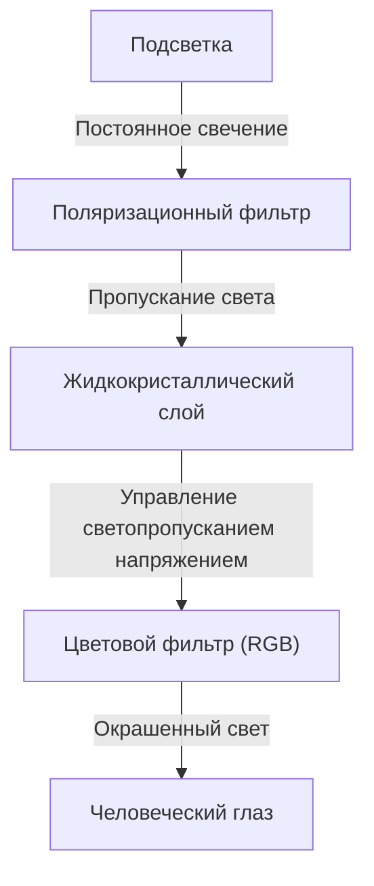
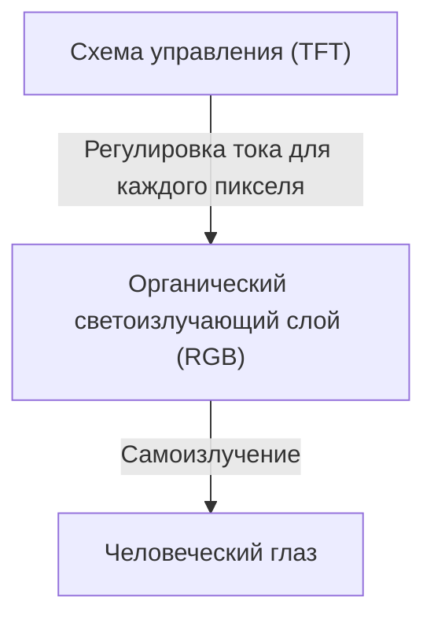

## 1. Введение
OLED-дисплеи (дисплеи на органических светодиодах) стали стандартом для современных смартфонов и телевизоров премиум-класса. При упоминании "OLED" в первую очередь на ум приходят ассоциации с высоким качеством изображения и малой толщиной, но в чем заключаются их технологические преимущества? В этой статье мы рассмотрим принципы работы OLED-дисплеев с инженерной точки зрения, объясним, почему они могут отображать "истинный черный" цвет, и разберемся в причинах явления, известного как "выгорание".

## 2. Что такое OLED (органический светодиод)?
OLED — это аббревиатура от Organic Light Emitting Diode, что переводится как "органический светодиод". Базовый принцип его работы основан на явлении электролюминесценции — излучении света определенными органическими соединениями при пропускании через них электрического тока.

В то время как обычные светодиоды используют неорганические материалы (например, арсенид галлия), в OLED в качестве светоизлучающего материала применяются органические соединения на основе углерода. Ключевой особенностью OLED является "самоизлучение" (Self-emitting). Это означает, что каждая крошечная точка (пиксель или субпиксель), из которых состоит дисплей, самостоятельно излучает свет.

## 3. Кардинальные отличия от жидкокристаллических (ЖК) дисплеев
Самый простой способ понять устройство OLED — сравнить его с ЖК-дисплеем (LCD: Liquid Crystal Display), который долгое время доминировал на рынке дисплеев.

### Устройство ЖК-дисплея
ЖК-дисплеи не излучают свет самостоятельно. За панелью размещается мощный источник света, называемый "подсветкой" (обычно это белые светодиоды), а жидкокристаллическая панель выполняет роль оптического затвора, пропускающего этот свет.

Жидкокристаллический слой контролирует количество пропускаемого света за счет изменения ориентации молекул при приложении напряжения. Однако, даже при попытке полностью закрыть "затвор", свет от мощной фоновой подсветки неизбежно немного просачивается. Именно по этой причине черный цвет на ЖК-дисплеях в темноте выглядит слегка белесым (сероватым).

### Устройство OLED-дисплея
В отличие от ЖК-дисплеев, в OLED отсутствует задняя подсветка. Сами органические светоизлучающие материалы красного (R), зеленого (G) и синего (B) цветов, расположенные в каждом пикселе, излучают свет независимо друг от друга пропорционально силе поступающего на них тока.

## 4. Почему достигается "истинный черный" цвет?
Причина, по которой на OLED "черный выглядит по-настоящему черным", кроется исключительно в свойстве самоизлучения.
Для отображения черного цвета ЖК-дисплей пытается "закрыть затвор при включенной подсветке". OLED же просто "полностью прекращает подачу тока на нужный пиксель, отключая его свечение".

Поскольку свет не излучается вообще, такое состояние физически эквивалентно темноте, что позволяет получить "истинный черный" (Pitch Black). Благодаря этому контрастность OLED (отношение яркости самого яркого белого к самому темному черному) составляет миллионы к одному или даже описывается как "бесконечная" по сравнению с тысячами к одному у ЖК-дисплеев. Именно глубина черного цвета придает изображению трехмерность и невероятную насыщенность.

## 5. Преимущества OLED и расширение сфер применения
Помимо качества изображения, отказ от подсветки и сложных оптических фильтров дает OLED ряд других физических преимуществ.

* **Тонкость и легкость**: Благодаря меньшему количеству компонентов можно создавать дисплеи толщиной с лист бумаги и поразительно малым весом.
* **Гибкость**: Использование гибких пластиковых материалов (например, полиимида) вместо стекла в качестве подложки позволяет создавать сгибаемые и складные дисплеи (например, для складных смартфонов).
* **Высокая скорость отклика**: В отличие от ЖК-дисплеев, где требуется физическое перемещение молекул жидких кристаллов, OLED мгновенно реагирует на изменение тока за нано- или микросекунды. Это предотвращает появление эффекта размытия (Motion Blur) даже в динамичных видео или играх.

## 6. Преимущества энергопотребления и подводные камни
Поскольку OLED является самоизлучающим дисплеем, при отображении черного цвета можно полностью отключить питание соответствующих пикселей. Поэтому использование темной темы (Dark Mode) позволяет значительно продлить время автономной работы смартфона, так как большая часть экрана остается выключенной.

С другой стороны, при отображении преимущественно белого фона (например, при веб-серфинге или работе с документами) все пиксели должны светиться на максимальной яркости. В таких сценариях энергопотребление OLED может оказаться выше, чем у ЖК-дисплея аналогичного размера. Особенностью ЖК-технологии является то, что подсветка работает с постоянной мощностью независимо от отображаемого контента, поэтому энергопотребление практически не меняется при отображении белого или черного цвета.

## 7. Главная проблема OLED: механизм "выгорания" (Burn-in)
Несмотря на выдающиеся характеристики, OLED имеет серьезную инженерную проблему — "выгорание". Выгорание — это явление, при котором после длительного отображения статического изображения (например, логотипа телеканала, строки состояния смартфона или интерфейса игры) на экране навсегда остается его тусклый остаточный след, даже после смены картинки.

### Почему происходит выгорание?
Фундаментальная причина выгорания заключается в "деградации" органических светоизлучающих материалов. При длительном пропускании тока и излучении света органические соединения постепенно деградируют и уже не могут поддерживать прежнюю яркость при той же силе тока (снижение эффективности свечения).
В частности, органические материалы, излучающие синий свет (B), обладают более высокой энергией свечения по сравнению с красными (R) и зелеными (G), что делает их молекулярную структуру менее стабильной. Из-за этого их срок службы физически короче.

Например, при длительном отображении веб-браузера с белым фоном или статического интерфейса интенсивно используются только определенные пиксели. Такие пиксели деградируют быстрее соседних, и их яркость падает. В результате, если залить весь экран одним цветом, сильно деградировавшие участки будут выглядеть более темными, что человеческий глаз воспринимает как "остаточное изображение". В этом и заключается суть выгорания.

## 8. Технологические подходы к предотвращению выгорания
Производители дисплеев серьезно относятся к этой проблеме и внедряют различные контрмеры (технологии снижения риска выгорания) как на аппаратном, так и на программном уровнях.

* **Pixel Shift (Сдвиг пикселей)**: Технология, которая периодически сдвигает все изображение на экране на незаметное для пользователя расстояние (в несколько пикселей). Это предотвращает концентрацию нагрузки на одни и те же пиксели.
* **ABL (Auto Brightness Limiter)**: Функция автоматического снижения общей яркости при выводе на экран ярких изображений (например, с большой площадью белого цвета). Она помогает снизить энергопотребление, нагрев дисплея и предотвратить деградацию пикселей.
* **Снижение яркости логотипов**: Программная обработка, которая с помощью анализа изображения обнаруживает статические логотипы или элементы интерфейса и локально снижает их яркость.
* **Pixel Refresher (Обновление пикселей)**: Функция, которая в режиме ожидания (например, когда телевизор выключен) измеряет напряжение и степень износа каждого пикселя, автоматически выполняя коррекцию для выравнивания яркости по всей площади панели.
* **Регулировка площади субпикселей**: Заранее проектируя синие субпиксели большего размера, чем красные и зеленые, производители снижают плотность тока, необходимую для достижения той же яркости. Это продлевает срок службы синих элементов (например, компоновка PenTile).

## 9. Передовые методы производства OLED и эволюция материалов
Процесс производства OLED-дисплеев сам по себе является техническим достижением.
В настоящее время основным методом является "вакуумное напыление" (Vacuum Evaporation). В огромной вакуумной камере органические соединения нагреваются до испарения и оседают на стеклянную подложку через металлическую маску с микроскопическими отверстиями (Fine Metal Mask: FMM) с нанометровой точностью. Это очень сложный и дорогостоящий процесс, но он необходим для массового производства высококачественных панелей.
Также ведутся исследования метода "струйной печати" (Inkjet Printing), при котором органические материалы наносятся непосредственно на подложку. Ожидается, что эта технология позволит значительно снизить производственные затраты и удешевить панели больших размеров.

Исследования самих светоизлучающих материалов также не стоят на месте. Происходит переход от ранних флуоресцентных материалов к более эффективным фосфоресцентным (Phosphorescent OLED: PHOLED). Сегодня большое внимание привлекает технология термоактивированной задержанной флуоресценции (TADF), считающаяся третьим поколением излучающих материалов. TADF обладает потенциалом для достижения высокой эффективности свечения без использования редких металлов, что делает ее ключевой технологией для дальнейшего снижения энергопотребления и стоимости OLED.

## 10. Заключение и перспективы
OLED-дисплеи кардинально улучшили качество визуального восприятия благодаря самоизлучению, обеспечивающему "истинный черный" цвет, бесконечной контрастности, а также непревзойденной тонкости и гибкости. Проблема выгорания, специфичная для органических материалов, благодаря неустанным усилиям инженеров была сведена к уровню, который больше не вызывает серьезных проблем при повседневном использовании.

В будущем ожидается появление дисплеев "MicroLED", которые используют крошечные неорганические светодиоды вместо органических материалов, сочетая в себе качество изображения OLED и долговечность ЖК-дисплеев. Также продолжается разработка более экологичных и высокоэффективных светоизлучающих материалов. Технологии дисплеев будут и дальше радовать наш глаз, ведь за привычными устройствами, которыми мы пользуемся каждый день, стоят бесконечные достижения материаловедения и электроники.
