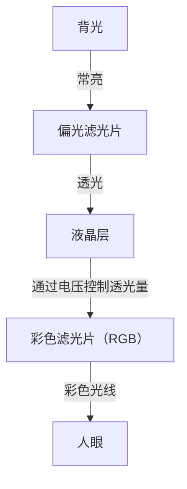
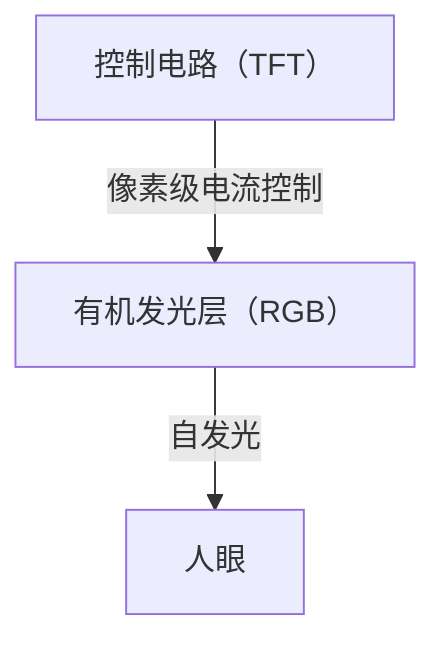

## 1. 引言
近年来，OLED（有机发光二极管）显示器在智能手机和高端电视中的应用已成为常态。提到“OLED”，人们往往首先想到的是高画质和轻薄，但从技术层面来看，它究竟有哪些优势？本文将从工程学的角度深入探讨OLED显示器的工作原理，解析其为何能够呈现“纯粹的黑色”，以及为何会发生所谓的“烧屏”现象。

## 2. 什么是OLED（有机发光二极管）？
OLED是Organic Light Emitting Diode的缩写，中文全称为“有机发光二极管”。其基本原理是利用特定有机化合物在通电时发光的现象（即电致发光，Electroluminescence）。

与使用无机材料（如砷化镓等）的普通LED不同，OLED使用以碳为主体的有机化合物作为发光材料。OLED最大的特点在于其“自发光（Self-emitting）”特性。这意味着，构成显示器的每一个微小的点（像素或子像素）都具备自行发光的机制。

## 3. 与液晶（LCD）显示器的决定性差异
要理解OLED的机制，最直观的方式是将其与长期占据显示器主流地位的液晶显示器（LCD: Liquid Crystal Display）进行对比。

### 液晶显示器的工作原理
液晶显示器本身并不发光。它在背面配置了被称为“背光”的强光源（通常为白色LED），并将液晶面板作为该光线的快门（光阀）来发挥作用。

液晶层通过施加电压来改变分子的排列，从而控制光线的透过量。然而，即使试图完全关闭快门，背后强烈的背光仍会有微弱的漏光。这就是为什么在暗室中观看液晶显示器呈现的黑色时，会显得有些发白（偏灰）的原因。

### OLED显示器的工作原理
相比之下，OLED不存在背光。配置在每个像素内的红（R）、绿（G）、蓝（B）有机发光材料本身，会根据接收到的电流大小独立发光。

## 4. 为什么能够呈现“纯粹的黑色”？
OLED能够让“黑色看起来真正是黑色”的原因，完全归功于其自发光的特性。
在需要显示黑色时，液晶显示器试图通过“保持背光开启的同时关闭快门”来表现黑色。但是，OLED只需“完全切断该像素的电流，停止发光（熄灭）”即可。

由于处于完全不发出光线的状态，该部分在物理意义上等同于纯粹的黑暗，从而实现了“纯粹的黑色（Pitch Black）”。因此，OLED的对比度（最亮的白色与最暗的黑色之间的亮度比）能够达到数百万比一，甚至被称为“无穷大”，这与液晶显示器数千比一的对比度形成了压倒性的优势。正是这种深邃的黑色，使得图像的立体感和鲜艳度得以凸显。

## 5. OLED的优势及应用领域的拓展
由于不需要背光和复杂的光学滤光片，OLED除了在画质方面，还在物理特性上具有诸多优势。

* **轻薄化**: 由于构成部件较少，可以制造出如纸般纤薄且轻得令人惊叹的显示器。
* **柔性（灵活性）**: 通过在基板上使用塑料等柔性材料（如聚酰亚胺）代替玻璃，能够实现可弯曲或折叠的显示器（如折叠屏智能手机）。
* **响应速度快**: 与需要物理移动液晶分子的LCD相比，OLED对电流变化的响应时间在纳秒到微秒级别。这使得在播放高速运动的视频或进行游戏时，不易产生残影（动态模糊）。

## 6. 功耗的优势与隐患
由于OLED是自发光型显示器，在显示黑色时可以完全切断该部分像素的电源。因此，使用深色模式（以黑色为主的UI）时，屏幕的大部分区域处于熄灭状态，能够大幅延长智能手机的电池续航时间。
然而，在显示全白画面（如网页浏览或文档编辑）时，需要让所有像素以最大亮度发光，此时其功耗反而可能会高于同等屏幕尺寸的液晶显示器。液晶显示器的特点是，无论画面显示什么内容，背光都以恒定强度常亮并通过液晶遮挡光线，因此显示白色或黑色时的功耗波动很小。

## 7. OLED面临的最大课题：“烧屏（Burn-in）”机制
尽管OLED具备出色的特性，但在工程上存在一个重大挑战，即“烧屏”。所谓烧屏，是指在显示器上长时间持续显示同一图像（如电视台台标、智能手机状态栏、游戏UI等）后，即使切换到其他画面，该图像的残影仍会隐约且永久地残留在屏幕上的现象。

### 为什么会发生烧屏？
烧屏的根本原因是有机发光材料的“老化”。有机化合物在持续通电发光的过程中会逐渐老化，即使施加相同的电流，也无法维持以前的亮度（发光效率下降）。
特别是发出蓝光（B）的有机材料，相比红光（R）和绿光（G），其发光能量更高，分子结构更容易变得不稳定，因此在物理特性上寿命较短。

例如，如果长时间持续显示白色背景的网页或固定的UI界面，该区域的像素就会被过度消耗。被过度消耗的像素会比周围的像素更快老化，发光量随之下降。结果，当全屏显示单色时，老化严重的区域会显得较暗，从而被视觉感知为“残影”。这就是烧屏的本质。

## 8. 防止烧屏的技术对策
显示器制造商高度重视这一问题，并从硬件和软件两方面实施了各种对策（烧屏缓解技术）。

* **像素偏移（Pixel Shift）**: 这是一种在用户无法察觉的范围内（几个像素级别），定期微调整个画面显示位置的技术。从而防止负荷集中在特定的像素上。
* **ABL（自动亮度限制，Auto Brightness Limiter）**: 当屏幕显示大面积高亮或全白画面时，为了降低显示器的功耗和发热，并防止元件老化，系统会自动降低整体亮度的功能。
* **局部亮度降低功能**: 通过图像分析检测屏幕特定区域内静止的台标或UI，并利用软件处理局部降低该区域的亮度。
* **像素刷新（Pixel Refresher）**: 在电视等设备关闭后的待机状态下，测量每个像素的电压和老化状态，并自动执行补偿处理，以均匀化各像素的亮度差异。
* **子像素面积调整**: 预先将寿命较短的蓝色子像素设计得比红色和绿色更大，从而降低在达到相同亮度时的电流密度，以此来延长蓝色元件的寿命（如Pentile排列等设计）。

## 9. OLED制造前沿与材料的演进
OLED显示器的制造工艺本身也是一大技术看点。
目前的主流方法被称为“真空蒸镀法（Vacuum Evaporation）”。在巨大的真空腔室中加热有机化合物使其气化，然后通过带有微孔的金属掩膜板（精细金属掩模，FMM），将有机材料以纳米级的精度沉积在玻璃基板上。这是一种极其精密且成本高昂的制造方法，但它是大规模生产高质量面板不可或缺的技术。
此外，近年来，应用印刷技术直接将有机材料涂布在基板上的“喷墨印刷法”的研究也在不断推进，有望大幅降低制造成本并实现大尺寸面板的低价化。

发光材料本身的研究也在日新月异。从早期的荧光材料，正在向发光效率更高的磷光材料（Phosphorescent OLED: PHOLED）过渡，目前被称为第三代发光材料的热活化延迟荧光（TADF）技术更是备受瞩目。TADF有望在不使用稀有金属（罕见金属）的情况下实现高效发光，被视为进一步降低OLED功耗和成本的杀手锏。

## 10. 总结与未来展望
OLED显示器凭借自发光带来的“纯粹黑色”和无限对比度，以及压倒性的轻薄和柔韧性，极大地提升了现代视觉体验。而烧屏这一有机材料特有的课题，也在工程师们的不懈努力下，被逐步克服到了在日常使用中不会造成严重问题的水平。

展望未来，通过铺设无机的微小LED来兼顾OLED画质和液晶耐久性的“Micro LED显示器”，以及更加环保、高效的发光材料的开发也正在不断推进。显示技术的进化，必将继续为我们的眼睛带来惊喜。而在这些我们日常所见的设备背后，凝聚着材料科学与电子工程的无尽结晶。
