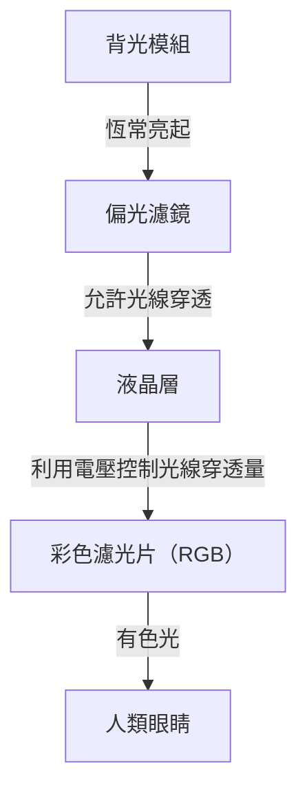
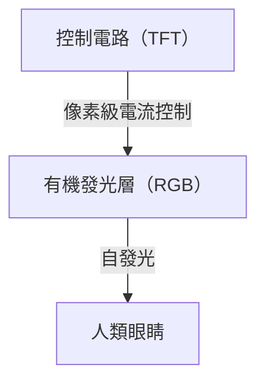

## 1. 簡介
近年來，OLED（有機發光二極體）顯示器已成為智慧型手機與高階電視的標準配備。提到「OLED」，人們首先想到的往往是高畫質與輕薄等特點，但從技術層面來看，它究竟有哪些優勢？本文將從工程的角度深入探討 OLED 顯示器的運作原理，解釋為何它能夠呈現「真實的黑色」，以及探究所謂的「螢幕烙印」現象為何會發生。

## 2. 什麼是 OLED（有機發光二極體）？
OLED 是 Organic Light Emitting Diode 的縮寫，中文稱為「有機發光二極體」。其基本原理是利用讓特定有機化合物通過電流而發光的現象（電致發光，Electroluminescence）。

相較於一般 LED 使用無機材料（如砷化鎵等），OLED 則使用以碳為主的有機化合物作為發光材料。OLED 最大的特徵在於「自發光（Self-emitting）」。這意味著構成顯示器的每一個微小光點（像素或子像素），都具備自行發光的機制。

## 3. 與液晶（LCD）顯示器的決定性差異
要理解 OLED 的原理，最簡單的方式便是將其與長期作為顯示器主流的液晶顯示器（LCD: Liquid Crystal Display）進行比較。

### 液晶顯示器的原理
液晶顯示器本身並不會發光。它在背面配置了稱為「背光模組」的強力光源（通常為白光 LED），並將液晶面板作為光線的快門來運作。

液晶層藉由施加電壓來改變分子的排列，進而控制光線的穿透量。然而，即使試圖完全關閉快門，背後強大的背光光源仍會有些微的光線外漏。這就是為什麼液晶顯示器所呈現的黑色，在暗處觀看時會稍微偏白（帶點灰色）的原因。

### OLED 顯示器的原理
另一方面，OLED 並不存在背光模組。配置在每個像素內的紅（R）、綠（G）、藍（B）有機發光材料本身，會根據接收到的電流量，獨立地發出光線。

## 4. 為何能夠呈現「真實的黑色」？
OLED 能夠讓「黑色看起來是真正的黑色」，其原因完全歸功於其自發光的特性。
當需要顯示黑色時，液晶顯示器試圖透過「保持背光開啟並關閉快門」來呈現黑色。然而，OLED 只需要「完全切斷流向該像素的電流，使其停止發光（熄滅）」即可。

因為完全不發出任何光線，該部分在物理上等同於黑暗，進而實現了「真實的黑色（Pitch Black）」。正因如此，OLED 的對比度（最亮白色與最暗黑色的亮度比），相較於液晶顯示器的數千比一，擁有數百萬比一甚至被形容為「無限大」的壓倒性數值。影像的立體感與鮮豔度，正是因為這深邃的黑色而更加突顯。

## 5. OLED 的優勢與擴展的應用
由於不需要背光模組與複雜的光學濾鏡，OLED 除了畫質之外，還具備許多物理上的優勢。

* **輕薄化**: 由於構成零件較少，可以製造出如紙張般薄且極度輕巧的顯示器。
* **柔性（可撓性）**: 透過使用塑膠等柔性材料（如聚醯亞胺）取代玻璃作為基板，便能實現可彎曲或折疊的顯示器（例如折疊式智慧型手機）。
* **反應速度快**: 相較於需要物理性移動液晶分子的 LCD，OLED 對電流變化的反應時間可達奈秒至微秒等級。因此，即使在高速移動的影像或遊戲遊玩中，也較不易產生殘影（動態模糊）。

## 6. 耗電量的優勢與陷阱
因為 OLED 為自發光型，在顯示黑色時可以完全切斷該部分像素的電力。因此，使用深色模式（以黑色為主的 UI）時，螢幕大部分處於熄滅狀態，能夠大幅延長智慧型手機的電池續航力。
另一方面，在顯示全白畫面（如網頁瀏覽或文件編輯）時，需要讓所有像素以最大亮度發光，在相同螢幕尺寸下，其耗電量有時反而會高於液晶顯示器。液晶顯示器的運作方式是不論畫面顯示內容為何，背光模組都以固定的強度亮著並透過快門阻擋光線，因此無論顯示白色或黑色，耗電量的波動都相對較小。

## 7. OLED 最大的挑戰：「螢幕烙印（Burn-in）」機制
雖然 OLED 具備出色的特性，但在工程上卻存在一個名為「螢幕烙印」的重大挑戰。烙印是指在顯示器上長時間顯示相同影像（如電視台的標誌、智慧型手機的狀態列或遊戲 UI 等）後，即使切換到其他畫面，該影像的殘影仍會永久隱約殘留的現象。

### 為何會發生烙印？
發生烙印的根本原因在於有機發光材料的「劣化」。有機化合物在持續通電發光的過程中會逐漸劣化，即使通過相同的電流，也無法維持與過去相同的亮度（發光效率下降）。
特別是發出藍光（B）的有機材料，相較於紅光（R）與綠光（G），其發光能量較高，分子結構容易變得不穩定，因此在物理特性上壽命較短。

例如，長時間顯示白色背景的網頁瀏覽器或特定固定的 UI 畫面時，該部分的像素會被過度使用。被過度使用的像素會比周圍的像素更快劣化，發光量隨之降低。結果就是，當螢幕顯示全螢幕單一顏色時，劣化嚴重的部分看起來會較暗，進而被認知為「殘影」。這就是螢幕烙印的真面目。

## 8. 防範螢幕烙印的技術對策
顯示器製造商非常重視這個問題，並從硬體與軟體雙管齊下，實作了各種對策（烙印緩解技術）。

* **像素位移（Pixel Shift）功能**: 透過在使用者察覺不到的程度（數個像素的單位），定期微調整個螢幕顯示位置的技術。藉此避免負荷集中在特定像素上。
* **ABL（自動亮度限制，Auto Brightness Limiter）**: 當顯示如全螢幕白色等高亮度影像時，為了降低顯示器的耗電量與發熱，並防止元件劣化，系統會自動降低整體亮度的功能。
* **標誌亮度降低功能**: 透過影像分析偵測畫面特定區域內是否有靜止的標誌或 UI，並局部降低該部分亮度的軟體處理機制。
* **像素更新（Pixel Refresher）**: 在電視等設備關閉時的待機狀態下，測量每個像素的電壓與劣化狀態，並自動執行補償處理，使各像素的亮度差異均勻化的功能。
* **子像素面積調整**: 為了延長壽命較短的藍色子像素的壽命，在設計上預先將其尺寸做得比紅色和綠色更大，以降低在相同亮度下的電流密度（例如 PenTile 排列等）。

## 9. OLED 製造的最前線與材料的演進
OLED 顯示器的製造過程也是一項技術亮點。
目前的技術主流是稱為「真空蒸鍍法（Vacuum Evaporation）」的方法。在巨大的真空腔體中加熱有機化合物使其氣化，並透過開有微小孔洞的金屬遮罩（精密金屬遮罩，FMM），將有機材料以奈米級的精度沉積在玻璃基板上。這是一項非常精密且成本高昂的製造方法，但對於大量生產高品質面板而言是不可或缺的技術。
此外，近年來也正在研究應用印刷技術直接將有機材料塗布在基板上的「噴墨印刷法」，有望大幅降低製造成本並實現大型面板的平價化。

發光材料本身的研發也日新月異。從早期的螢光材料，逐漸過渡到發光效率更高的磷光材料（Phosphorescent OLED: PHOLED），如今被稱為第三代發光材料的熱活化延遲螢光（TADF）技術也備受矚目。TADF 有可能在不使用稀有金屬的情況下實現高效率發光，被期待成為 OLED 進一步省電與降低成本的關鍵。

## 10. 總結與未來展望
OLED 顯示器憑藉自發光帶來的「真實黑色」與無限的對比度，加上壓倒性的輕薄與柔性，極大地提升了現代的影像體驗。而烙印這個有機材料特有的課題，也因為工程師們的不懈努力，正在逐漸被克服到在日常使用中不構成重大問題的程度。

展望未來，將不使用有機材料，而是排列無機微小 LED 的「Micro LED 顯示器」，結合了 OLED 的畫質與液晶的耐用性，以及更環保、更高效率的發光材料的開發也正在進行中。顯示技術的演進，未來也將持續帶來視覺上的饗宴。而這些我們日常所見的設備背後，蘊含著材料科學與電子工程無盡的心血結晶。
