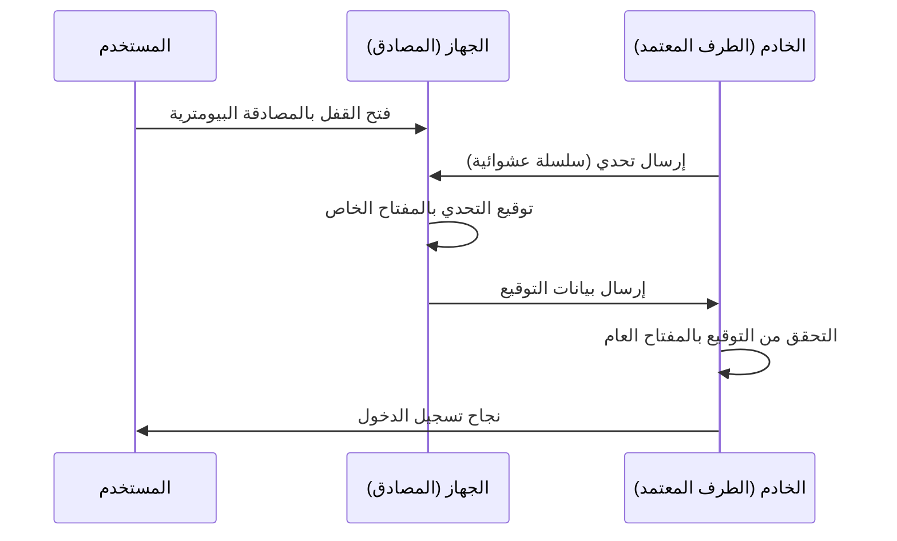

منذ فجر الإنترنت، اعتمدنا على "كلمات المرور" كمفاتيح لعالمنا الرقمي. ومع ذلك، فإن إعادة استخدام كلمات المرور، واختيار سلاسل يسهل تخمينها، والأهم من ذلك تسريب بيانات الاعتماد من خلال عمليات التصيد الاحتيالي، أصبحت أكبر نقطة ضعف في الأمن السيبراني الحديث.

لحل هذه المشكلة من جذورها، ظهرت "مفاتيح المرور (Passkeys)". مفاتيح المرور هي طريقة مصادقة جديدة تحل محل كلمات المرور، وتستند إلى معيار WebAuthn (المصادقة عبر الويب) الذي وضعه تحالف FIDO (الهوية السريعة عبر الإنترنت) واتحاد شبكة الويب العالمية (W3C).

في هذه المقالة، سنتعمق في الآليات التقنية وراء مفاتيح المرور، وأساسيات التشفير بالمفتاح العام، والفرق بين مفاتيح المرور المرتبطة بالجهاز (Device-Bound Passkeys) ومفاتيح المرور القابلة للمزامنة (Synced Passkeys)، وكيفية تحقيق مقاومة التصيد الاحتيالي، بالإضافة إلى أمثلة عملية لتنفيذ الأكواد.

## 1. التقنية الأساسية لمفاتيح المرور: التشفير بالمفتاح العام و WebAuthn

ما يدعم أمان مفاتيح المرور هو "التشفير بالمفتاح العام (Public Key Cryptography)". في المصادقة التقليدية بكلمة المرور، يتشارك العميل والخادم "نفس السر (كلمة المرور)"، وعند تسجيل الدخول، يتم إرسال هذا السر للتحقق من التطابق (المصادقة المتماثلة أو Symmetric authentication). أكبر نقطة ضعف في هذه الآلية هي أن السر ينتقل عبر الشبكة، وبما أن السر (أو قيمة التجزئة الخاصة به) يتم تخزينه على جانب الخادم، فإنه في حالة اختراق الخادم، ستتسرب المعلومات.

### 1.1 المصادقة غير المتماثلة باستخدام التشفير بالمفتاح العام

تستخدم مفاتيح المرور المصادقة غير المتماثلة (Asymmetric authentication) القائمة على التشفير بالمفتاح العام. عند إنشاء مفتاح مرور، يتم إنشاء المفتاحين التاليين على الجهاز:

1. **المفتاح الخاص (Private Key)**: يتم تخزينه بشكل آمن في منطقة آمنة على جهاز المستخدم (مثل Secure Enclave أو TPM)، ولا يخرج أبدًا من الجهاز.
2. **المفتاح العام (Public Key)**: يتم إرساله إلى الخادم (الطرف المعتمد - Relying Party) وتخزينه بحيث يكون مرتبطًا بالحساب. لا قيمة للمفتاح العام بدون المفتاح الخاص، لذا حتى لو تم تسريبه، فلا يوجد خطر أمني.

عند تسجيل الدخول، يتم إرسال بيانات عشوائية (تحدي أو Challenge) من الخادم. بعد التحقق من المستخدم بواسطة الجهاز من خلال المصادقة البيومترية (بصمة الإصبع أو التعرف على الوجه) وغيرها، يتم استخدام المفتاح الخاص لتوقيع هذا التحدي (توقيع رقمي). يقوم الخادم بالتحقق من هذا التوقيع باستخدام المفتاح العام المخزن لديه، وإذا كان صحيحًا، فإنه يسمح بتسجيل الدخول.



### 1.2 واجهة برمجة تطبيقات WebAuthn

"WebAuthn" هي واجهة برمجة التطبيقات (API) التي تتيح استخدام هذه العملية بسلاسة من متصفحات الويب والتطبيقات. WebAuthn هي واجهة يمكن استدعاؤها من JavaScript وتوفر الدالتين الرئيسيتين التاليتين:

- `navigator.credentials.create()`: تسجيل مفتاح مرور جديد (إنشاء مفتاح عام وإرساله إلى الخادم)
- `navigator.credentials.get()`: المصادقة باستخدام مفتاح مرور حالي (توقيع التحدي وإرساله إلى الخادم)

عند استدعاء واجهات برمجة التطبيقات هذه، يظهر مربع حوار مصادقة على مستوى نظام التشغيل (OS)، وتكتمل المصادقة بمجرد لمس المستخدم لمستشعر بصمة الإصبع أو إجراء التعرف على الوجه.

## 2. آلية مقاومة التصيد الاحتيالي

إحدى أكبر ميزات مفاتيح المرور هي امتلاكها "مقاومة قوية للتصيد الاحتيالي (Phishing Resistance)". في كلمات المرور لمرة واحدة (OTP) التقليدية أو المصادقة الثنائية (2FA) عبر الرسائل القصيرة (SMS)، إذا تم خداع المستخدم من قبل موقع مزيف وقام بإدخال كلمة المرور والـ OTP، فسيتم اختراق الحساب من قبل المهاجمين (مثل هجمات AiTM).

ومع ذلك، تقوم مفاتيح المرور بإبطال التصيد الاحتيالي هيكليًا.

### 2.1 الارتباط بالأصل (Origin Binding)

في WebAuthn، يتم ربط مفتاح المرور تشفيريًا بنطاق موقع ويب معين (الأصل - Origin).

لنفترض أن المستخدم قام بإنشاء مفتاح مرور على `https://example.com`. في هذه الحالة، يربط المتصفح معلومة أن "مفتاح المرور هذا مخصص لـ `example.com`" ويحفظها في الجهاز، كما يرسل دليلاً إلى الخادم عند تسجيل المفتاح العام يفيد بأن "هذا المفتاح العام تم إنشاؤه لـ `example.com`".

ماذا يحدث إذا تم توجيه المستخدم إلى موقع تصيد احتيالي ذكي `https://examp1e.com` وحاول تسجيل الدخول هناك؟

1. يستدعي الموقع `navigator.credentials.get()`.
2. يتأكد المتصفح من أن الأصل الحالي هو `examp1e.com` ويبحث داخل الجهاز.
3. نظرًا لعدم وجود مفتاح مرور مرتبط بـ `examp1e.com`، يرفض المتصفح عملية المصادقة.

حتى لو تم خداع المستخدم، يكتشف المتصفح ونظام التشغيل عدم تطابق النطاق ولن يقوما أبدًا بالتوقيع باستخدام المفتاح الخاص. وهذا يمنع هجمات التصيد الاحتيالي إلى مستوى يجعلها مستحيلة تقنيًا.

### 2.2 مصادقة التحدي والاستجابة (Challenge-Response Authentication)

علاوة على ذلك، عند توقيع التحدي المرسل من الخادم، تتضمن البيانات التي يتم توقيعها (`ClientDataJSON`) التحدي نفسه بالإضافة إلى الأصل (Origin) المستدعي وحالة الأصول المتعددة (Cross-origin state) وغيرها.

عند التحقق من التوقيع على جانب الخادم، يتم التأكد مما يلي:
- ما إذا كان التوقيع صحيحًا (يتطابق مع المفتاح العام)
- ما إذا كان الأصل الموقّع هو النطاق الصحيح للشركة (مثل: `https://example.com`)
- ما إذا كان التحدي يتطابق مع التحدي الذي تم إصداره للتو

حتى لو استخدم المهاجم موقع ترحيل (وكيل عكسي - Reverse Proxy) لترحيل التحدي، فإن الأصل الذي سيوقعه المتصفح سيكون "نطاق الموقع المزيف الذي يشاهده المستخدم"، لذلك سيكتشف الخادم الحقيقي عدم تطابق الأصل ويرفض المصادقة.

## 3. مفاتيح المرور المرتبطة بالجهاز (Device-Bound Passkeys) مقابل مفاتيح المرور القابلة للمزامنة (Synced Passkeys)

تنقسم مفاتيح المرور بشكل رئيسي إلى نوعين. من المهم فهم خصائص كل منهما لتنفيذها وفقًا لمتطلبات الأمان.

### 3.1 مفاتيح المرور المرتبطة بالجهاز (Device-Bound Passkeys)

في مصادقة FIDO المبكرة (المراحل الأولى من FIDO UAF و FIDO2/WebAuthn)، كان المفتاح الخاص مرتبطًا (Bound) بالكامل بالعنصر الآمن للجهاز الذي تم إنشاؤه عليه. تعتبر مفاتيح الأمان العتادية مثل YubiKey مثالاً نموذجيًا على ذلك.

**المميزات:**
- أمان عالٍ للغاية: ما لم تتم سرقة الجهاز ماديًا، فلن يتم تسريب المفتاح الخاص أبدًا.
- الامتثال لمتطلبات المؤسسات: يلبي معايير الأمان الصارمة مثل AAL3 (مستوى ضمان المصادق 3) الخاص بـ NIST SP 800-63B.

**العيوب:**
- مخاطر الفقدان: إذا فقدت الجهاز أو كسرته، فسيضيع المفتاح الخاص إلى الأبد. يلزم وجود استراتيجيات للنسخ الاحتياطي مثل تسجيل أجهزة متعددة.
- قلة الملاءمة: عند شراء هاتف ذكي جديد، ستحتاج إلى إعادة التسجيل في جميع المواقع.

### 3.2 مفاتيح المرور القابلة للمزامنة (Synced Passkeys / بيانات اعتماد FIDO متعددة الأجهزة)

تم تقديم "مفاتيح المرور القابلة للمزامنة" بهدف نشرها بين المستهلكين. توفر هذه الميزة كل من Apple (سلسلة مفاتيح iCloud)، و Google (مدير كلمات مرور Google)، و Microsoft (Windows Hello)، بالإضافة إلى مديري كلمات المرور مثل 1Password.

في مفاتيح المرور القابلة للمزامنة، يتم تشفير المفتاح الخاص من طرف إلى طرف (E2EE) وتتم مزامنته مع الأجهزة الأخرى للمستخدم عبر السحابة.

**المميزات:**
- راحة هائلة: يمكن استخدام مفتاح المرور الذي تم إنشاؤه على iPhone تلقائيًا على iPad و Mac. حتى إذا فقدت جهازك، يمكنك استعادته إلى جهاز جديد من السحابة.
- حل مشكلة استرداد الحساب: يقلل بشكل كبير من "الاستبعاد من الحساب (Lockout) عند فقدان الجهاز" والذي كان التحدي الأكبر لمفاتيح المرور المرتبطة بالجهاز.

**العيوب:**
- الاعتماد على مزودي الخدمات السحابية: يعتمد على نموذج الأمان للنظام البيئي للمزامنة (مثل Apple و Google). إذا تم اختراق الحساب الخاص بالنظام البيئي نفسه (Apple ID أو حساب Google)، فستصبح مفاتيح المرور أيضًا في خطر.

لتحقيق التوازن بين الراحة والأمان، يتبنى تحالف FIDO نهجًا مرنًا يروج لمفاتيح المرور القابلة للمزامنة للمستهلكين، بينما يدعم مفاتيح المرور المرتبطة بالجهاز (مفاتيح الأجهزة) للشركات والمؤسسات المالية التي تتطلب أمانًا عاليًا.

## 4. مثال على تنفيذ WebAuthn: الواجهة الأمامية والواجهة الخلفية

عند تنفيذ مفاتيح المرور فعليًا على موقع ويب، يتطلب الأمر معالجة على كل من الواجهة الأمامية (JavaScript) والواجهة الخلفية (جانب الخادم). هنا، سنقدم التدفق الأساسي وأمثلة الأكواد لتسجيل (Registration) مفتاح مرور جديد.

### 4.1 مرحلة التسجيل (Registration)

#### 1. الحصول على التحدي من الخادم
يتم إرسال طلب من الواجهة الأمامية إلى الخادم للحصول على خيارات التسجيل (التحدي، معلومات المستخدم، إلخ).

#### 2. استدعاء `create()` في الواجهة الأمامية
باستخدام الخيارات المستلمة من الخادم (`PublicKeyCredentialCreationOptions`)، يتم استدعاء واجهة برمجة تطبيقات WebAuthn الخاصة بالمتصفح.

```javascript
// مثال على الخيارات المستردة من الخادم (بعض البيانات تحتاج إلى التحويل إلى ArrayBuffer)
const publicKeyCredentialCreationOptions = {
    challenge: Uint8Array.from("random_challenge_string_from_server", c => c.charCodeAt(0)),
    rp: {
        name: "My Awesome App",
        id: "example.com"
    },
    user: {
        id: Uint8Array.from("user_unique_id_12345", c => c.charCodeAt(0)),
        name: "user@example.com",
        displayName: "John Doe"
    },
    pubKeyCredParams: [
        { alg: -7, type: "public-key" }, // ES256
        { alg: -257, type: "public-key" } // RS256
    ],
    authenticatorSelection: {
        authenticatorAttachment: "platform", // "cross-platform" لمفاتيح الأمان
        userVerification: "required" // يتطلب المصادقة البيومترية وغيرها
    },
    timeout: 60000,
    attestation: "none" // "none" في الأساس لحماية الخصوصية
};

try {
    // يعرض المتصفح واجهة مستخدم المصادقة الأصلية
    const credential = await navigator.credentials.create({
        publicKey: publicKeyCredentialCreationOptions
    });

    // إرسال المفتاح العام المولد وبيانات التوقيع إلى الخادم
    const attestationResponse = {
        id: credential.id,
        rawId: Array.from(new Uint8Array(credential.rawId)),
        type: credential.type,
        response: {
            clientDataJSON: Array.from(new Uint8Array(credential.response.clientDataJSON)),
            attestationObject: Array.from(new Uint8Array(credential.response.attestationObject))
        }
    };

    // الإرسال إلى الخادم للتحقق والحفظ باستخدام fetch API وغيرها
    await fetch('/api/webauthn/register', {
        method: 'POST',
        headers: { 'Content-Type': 'application/json' },
        body: JSON.stringify(attestationResponse)
    });

} catch (err) {
    console.error("فشل إنشاء مفتاح المرور", err);
}
```

#### 3. التحقق والحفظ في الخادم
يتم التحقق من البيانات المرسلة من الواجهة الأمامية على الخادم. نظرًا لأن عملية التحقق هذه معقدة، فعادةً ما يتم استخدام مكتبات WebAuthn لكل لغة (مثل `@simplewebauthn/server` لـ Node.js، و `webauthn` لـ Python، و `go-webauthn` لـ Go، وما إلى ذلك).

عناصر التحقق:
- هل التحدي متطابق؟
- هل الأصل (Origin) ومعرف الطرف المعتمد (RP ID) متطابقان؟
- هل نجحت مصادقة المستخدم (User Verification)؟
- هل التوقيع صحيح؟

إذا نجح التحقق، يتم حفظ `credential.id` (معرف بيانات الاعتماد) والمفتاح العام (Public Key) من خلال ربطهما بسجل المستخدم في قاعدة البيانات.

## 5. تحالف FIDO وحالة الانتشار

تم وضع أساس تقنية مفاتيح المرور، وهو WebAuthn و FIDO2، بواسطة تحالف FIDO واتحاد شبكة الويب العالمية (W3C). يشارك في تحالف FIDO مئات الشركات، بدءًا من شركات التكنولوجيا العملاقة مثل Apple و Google و Microsoft و Amazon و Meta، ووصولاً إلى المؤسسات المالية وموردي أنظمة الأمان.

في السنوات الأخيرة، تقدم انتشار مفاتيح المرور بسرعة.

1. **دعم المنصات**: تدعم أنظمة التشغيل الرئيسية iOS/macOS و Android و Windows مفاتيح المرور على مستوى نظام التشغيل.
2. **الاعتماد في الخدمات الكبرى**: تقوم العديد من الخدمات العالمية مثل حساب Google و Amazon و GitHub و Nintendo و X (Twitter سابقًا) و PayPal بتوحيد تسجيل الدخول باستخدام مفاتيح المرور.
3. **المصادقة عبر الأجهزة (CDA)**: تم أيضًا تجهيز آلية تسجيل الدخول إلى متصفح الكمبيوتر باستخدام هاتف ذكي (تكامل البلوتوث/رمز الاستجابة السريعة عبر CTAP2)، مما يوفر تجربة مصادقة سلسة عبر أجهزة مختلفة.

## 6. الخلاصة والتطلعات المستقبلية

مفاتيح المرور ليست مجرد "بديل لكلمات المرور"، بل هي تقنية ثورية تؤمن البنية التحتية للمصادقة على الإنترنت من جذورها. الإثبات الرياضي من خلال التشفير بالمفتاح العام، وإبطال التصيد الاحتيالي تمامًا من خلال الارتباط التشفيري بالنطاقات، وتجربة المستخدم الخالية من الاحتكاك من خلال المصادقة البيومترية. ومن خلال الجمع بين هذه العناصر، أصبحنا أخيرًا نتغلب على المفاضلة بين الأمان والراحة.

بالطبع، لا تزال هناك تحديات يجب حلها، مثل مشكلة تقييد مزود المزامنة (Lock-in) وإنشاء أساليب الإدارة في المؤسسات. ومع ذلك، تسير الصناعة بأكملها بثبات نحو "مستقبل بلا كلمات مرور"، ولا شك في أن مفاتيح المرور ستصبح وسيلة المصادقة القياسية في المستقبل.

بصفتنا مطورين، فقد حان الوقت للبدء في التفكير في تنفيذ مفاتيح المرور (WebAuthn) الآن، بالإضافة إلى مصادقة كلمة المرور الحالية. لحماية البيانات المهمة للمستخدمين وتوفير تجربة تسجيل دخول أكثر راحة، سيكون اعتماد مفاتيح المرور أحد أكثر الاستثمارات فعالية.
