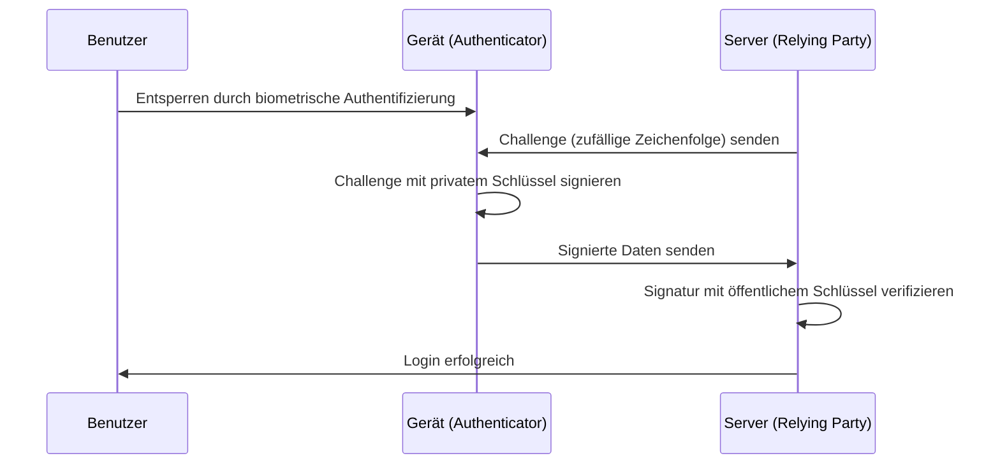

Seit den Anfängen des Internets haben wir uns auf "Passwörter" als Schlüssel zur digitalen Welt verlassen. Doch die Wiederverwendung von Passwörtern, die Wahl leicht zu erratender Zeichenfolgen und vor allem der Verlust von Anmeldedaten durch Phishing-Betrug sind zu den größten Schwachstellen der modernen Cybersicherheit geworden.

Um dieses Problem an der Wurzel zu packen, wurden "Passkeys" eingeführt. Passkeys sind eine neue Authentifizierungsmethode, die Passwörter ersetzt und auf dem WebAuthn (Web Authentication) Standard basiert, der von der FIDO (Fast IDentity Online) Alliance und dem W3C entwickelt wurde.

In diesem Artikel werden wir tief in die technischen Mechanismen hinter Passkeys eintauchen, die Grundlagen der Public-Key-Kryptographie erläutern, die Unterschiede zwischen gerätegebundenen und synchronisierbaren Passkeys aufzeigen, erklären, wie Phishing-Resistenz erreicht wird, und sogar ein praktisches Code-Implementierungsbeispiel geben.

## 1. Die Basistechnologie der Passkeys: Public-Key-Kryptographie und WebAuthn

Die Sicherheit von Passkeys beruht auf der "Public-Key-Kryptographie" (Public Key Cryptography). Bei der herkömmlichen Passwortauthentifizierung teilen Client und Server dasselbe "Geheimnis" (das Passwort), das beim Login gesendet und auf Übereinstimmung überprüft wird (symmetrische Authentifizierung). Die größte Schwäche dieses Systems ist, dass das Geheimnis über das Netzwerk übertragen wird und dass das Geheimnis (oder sein Hash-Wert) auf der Serverseite gespeichert wird. Wenn der Server kompromittiert wird, können die Informationen durchsickern.

### 1.1 Asymmetrische Authentifizierung durch Public-Key-Kryptographie

Passkeys verwenden eine asymmetrische Authentifizierung (Asymmetric authentication), die auf der Public-Key-Kryptographie basiert. Wenn ein Passkey generiert wird, werden die folgenden zwei Schlüssel auf dem Gerät erstellt:

1. **Privater Schlüssel (Private Key)**: Er wird sicher in einem geschützten Bereich des Geräts des Benutzers (wie Secure Enclave oder TPM) gespeichert und verlässt das Gerät niemals.
2. **Öffentlicher Schlüssel (Public Key)**: Er wird an den Server (Relying Party) gesendet und mit dem Konto verknüpft gespeichert. Da der öffentliche Schlüssel ohne den privaten Schlüssel nutzlos ist, besteht kein Sicherheitsrisiko, selbst wenn er durchsickert.

Beim Einloggen sendet der Server zufällige Daten (eine Challenge). Das Gerät des Benutzers überprüft den Benutzer zunächst durch biometrische Authentifizierung (z. B. Fingerabdruck- oder Gesichtserkennung) und signiert diese Challenge dann mit dem privaten Schlüssel (digitale Signatur). Der Server verifiziert diese Signatur mit dem gespeicherten öffentlichen Schlüssel und gewährt den Login, wenn sie gültig ist.



### 1.2 WebAuthn API

Die API, um diesen Prozess nahtlos von Webbrowsern und Apps aus zu nutzen, ist "WebAuthn". WebAuthn ist eine API, die über JavaScript aufgerufen werden kann und die folgenden zwei Hauptfunktionen bietet:

- `navigator.credentials.create()`: Registrierung eines neuen Passkeys (Generierung des öffentlichen Schlüssels und Senden an den Server)
- `navigator.credentials.get()`: Authentifizierung mit einem bestehenden Passkey (Signieren der Challenge und Senden an den Server)

Wenn diese APIs aufgerufen werden, wird ein Authentifizierungsdialog auf Betriebssystemebene angezeigt. Der Benutzer muss lediglich den Fingerabdrucksensor berühren oder eine Gesichtserkennung durchführen, um die Authentifizierung abzuschließen.

## 2. Der Mechanismus der Phishing-Resistenz

Eines der wichtigsten Merkmale von Passkeys ist ihre starke "Phishing-Resistenz" (Phishing Resistance). Bei herkömmlichen Einmalpasswörtern (OTP) und der Zwei-Faktor-Authentifizierung (2FA) per SMS können Angreifer ein Konto übernehmen, wenn der Benutzer auf eine gefälschte Website hereinfällt und sein Passwort und OTP eingibt (z. B. AiTM-Angriffe).

Passkeys machen Phishing jedoch strukturell wirkungslos.

### 2.1 Origin Binding (Origin-Bindung)

Mit WebAuthn ist ein Passkey kryptographisch an die Domain (Origin) einer bestimmten Website gebunden.

Angenommen, ein Benutzer erstellt einen Passkey auf `https://example.com`. In diesem Fall speichert der Browser die Information "Dieser Passkey ist für `example.com`" auf dem Gerät und sendet bei der Registrierung des öffentlichen Schlüssels einen Beweis an den Server, dass "dieser öffentliche Schlüssel für `example.com` erstellt wurde".

Was passiert nun, wenn der Benutzer auf eine raffinierte Phishing-Seite wie `https://examp1e.com` gelockt wird und versucht, sich dort anzumelden?

1. Die Website ruft `navigator.credentials.get()` auf.
2. Der Browser stellt fest, dass die aktuelle Origin `examp1e.com` ist, und durchsucht das Gerät.
3. Da kein Passkey mit `examp1e.com` verknüpft ist, lehnt der Browser den Authentifizierungsprozess ab.

Selbst wenn der Benutzer getäuscht wird, erkennen Browser und Betriebssystem die Nichtübereinstimmung der Domain und werden die Signatur mit dem privaten Schlüssel unter keinen Umständen durchführen. Dies verhindert Phishing-Angriffe auf einem technisch unmöglichen Niveau.

### 2.2 Challenge-Response-Authentifizierung

Darüber hinaus enthalten die zu signierenden Daten (ClientDataJSON), wenn die vom Server gesendete Challenge signiert wird, nicht nur die Challenge selbst, sondern auch die aufrufende Origin (Ursprung) und den Cross-Origin-Status.

Wenn der Server die Signatur verifiziert, überprüft er Folgendes:
- Ist die Signatur gültig? (Stimmt sie mit dem öffentlichen Schlüssel überein?)
- Entspricht die signierte Origin der korrekten Domain des Unternehmens (z. B. `https://example.com`)?
- Stimmt die Challenge mit der kurz zuvor ausgegebenen überein?

Selbst wenn ein Angreifer einen Relay-Server (Reverse Proxy) verwendet, um die Challenge weiterzuleiten, ist die Origin, die der Browser signiert, die Domain der gefälschten Website, die der Benutzer sieht. Der echte Server wird die Diskrepanz der Origin erkennen und die Authentifizierung ablehnen.

## 3. Gerätegebundene Passkeys vs. Synchronisierbare Passkeys

Passkeys lassen sich grob in zwei Typen einteilen. Das Verständnis ihrer jeweiligen Eigenschaften ist wichtig für die Umsetzung, die den Sicherheitsanforderungen entspricht.

### 3.1 Gerätegebundene Passkeys (Device-Bound Passkeys)

Bei der frühen FIDO-Authentifizierung (FIDO UAF und in den Anfangsphasen von FIDO2/WebAuthn) war der private Schlüssel vollständig an das Secure Element des Geräts gebunden (Bound), auf dem er generiert wurde. Hardware-Sicherheitsschlüssel wie der YubiKey sind ein typisches Beispiel dafür.

**Vorteile:**
- Extrem hohe Sicherheit: Solange das Gerät nicht physisch gestohlen wird, kann der private Schlüssel nicht nach außen dringen.
- Erfüllt Unternehmensanforderungen: Erfüllt strenge Sicherheitsstandards wie AAL3 (Authenticator Assurance Level 3) nach NIST SP 800-63B.

**Nachteile:**
- Risiko bei Verlust: Wenn das Gerät verloren geht oder beschädigt wird, ist der private Schlüssel für immer verloren. Eine Backup-Strategie, wie die Registrierung mehrerer Geräte, ist erforderlich.
- Geringere Bequemlichkeit: Wenn Sie ein neues Smartphone kaufen, müssen Sie sich auf allen Websites erneut registrieren.

### 3.2 Synchronisierbare Passkeys (Synced Passkeys / Multi-Device FIDO Credentials)

"Synchronisierbare Passkeys" wurden eingeführt, um eine weite Verbreitung bei Verbrauchern zu erreichen. Apple (iCloud-Schlüsselbund), Google (Google Passwortmanager), Microsoft (Windows Hello) und Passwortmanager wie 1Password bieten diese Funktion an.

Bei synchronisierbaren Passkeys wird der private Schlüssel Ende-zu-Ende verschlüsselt (E2EE) und über die Cloud mit den anderen Geräten des Benutzers synchronisiert.

**Vorteile:**
- Überwältigender Komfort: Ein auf einem iPhone erstellter Passkey kann automatisch auch auf einem iPad oder Mac verwendet werden. Auch bei Verlust eines Geräts kann es aus der Cloud auf einem neuen Gerät wiederhergestellt werden.
- Lösung für Probleme bei der Kontowiederherstellung: Das größte Problem bei gerätegebundenen Passkeys, das "Aussperren" aus dem Konto (Lockout) bei Geräteverlust, wird deutlich reduziert.

**Nachteile:**
- Abhängigkeit vom Cloud-Anbieter: Man ist auf das Sicherheitsmodell des Synchronisations-Ökosystems (wie Apple oder Google) angewiesen. Wenn das Konto des Ökosystems selbst (Apple-ID oder Google-Konto) kompromittiert wird, sind auch die Passkeys gefährdet.

Um ein Gleichgewicht zwischen Komfort und Sicherheit zu finden, verfolgt die FIDO Alliance einen flexiblen Ansatz: Sie fördert synchronisierbare Passkeys für Verbraucher, während sie gerätegebundene Passkeys (Hardwareschlüssel) für Unternehmen und Finanzinstitute unterstützt, die ein hohes Maß an Sicherheit benötigen.

## 4. WebAuthn-Implementierungsbeispiel: Frontend und Backend

Wenn Sie Passkeys tatsächlich auf einer Website implementieren, ist eine Verarbeitung sowohl im Frontend (JavaScript) als auch im Backend (Serverseite) erforderlich. Hier stellen wir den grundlegenden Ablauf und Codebeispiele für die Registrierung (Registration) eines neuen Passkeys vor.

### 4.1 Registrierungsphase (Registration)

#### 1. Challenge vom Server abrufen
Senden Sie eine Anfrage vom Frontend an den Server, um Registrierungsoptionen (Challenge, Benutzerinformationen usw.) abzurufen.

#### 2. Aufruf von `create()` im Frontend
Verwenden Sie die vom Server empfangenen Optionen (`PublicKeyCredentialCreationOptions`), um die WebAuthn API des Browsers aufzurufen.

```javascript
// Beispiel für vom Server empfangene Optionen (Einige Daten müssen in ArrayBuffer umgewandelt werden)
const publicKeyCredentialCreationOptions = {
    challenge: Uint8Array.from("random_challenge_string_from_server", c => c.charCodeAt(0)),
    rp: {
        name: "My Awesome App",
        id: "example.com"
    },
    user: {
        id: Uint8Array.from("user_unique_id_12345", c => c.charCodeAt(0)),
        name: "user@example.com",
        displayName: "John Doe"
    },
    pubKeyCredParams: [
        { alg: -7, type: "public-key" }, // ES256
        { alg: -257, type: "public-key" } // RS256
    ],
    authenticatorSelection: {
        authenticatorAttachment: "platform", // "cross-platform" für Sicherheitsschlüssel
        userVerification: "required" // Erfordert biometrische Authentifizierung etc.
    },
    timeout: 60000,
    attestation: "none" // Aus Datenschutzgründen grundsätzlich "none"
};

try {
    // Der Browser zeigt die native Authentifizierungs-UI an
    const credential = await navigator.credentials.create({
        publicKey: publicKeyCredentialCreationOptions
    });

    // Senden Sie den generierten öffentlichen Schlüssel und die Signaturdaten an den Server
    const attestationResponse = {
        id: credential.id,
        rawId: Array.from(new Uint8Array(credential.rawId)),
        type: credential.type,
        response: {
            clientDataJSON: Array.from(new Uint8Array(credential.response.clientDataJSON)),
            attestationObject: Array.from(new Uint8Array(credential.response.attestationObject))
        }
    };

    // Senden Sie sie zur Überprüfung und Speicherung an den Server, z. B. mit der Fetch API
    await fetch('/api/webauthn/register', {
        method: 'POST',
        headers: { 'Content-Type': 'application/json' },
        body: JSON.stringify(attestationResponse)
    });

} catch (err) {
    console.error("Erstellung des Passkeys fehlgeschlagen", err);
}
```

#### 3. Verifizierung und Speicherung auf dem Server
Die vom Frontend gesendeten Daten werden auf dem Server verifiziert. Da dieser Verifizierungsprozess komplex ist, verwenden Sie normalerweise eine WebAuthn-Bibliothek für jede Sprache (wie `@simplewebauthn/server` in Node.js, `webauthn` in Python, `go-webauthn` in Go usw.).

Zu verifizierende Elemente:
- Stimmt die Challenge überein?
- Stimmen Origin und RP-ID überein?
- War die Benutzerverifizierung (User Verification) erfolgreich?
- Ist die Signatur korrekt?

Wenn die Verifizierung erfolgreich ist, speichern Sie die `credential.id` (Credential ID) und den öffentlichen Schlüssel (Public Key) verknüpft mit dem Benutzerdatensatz in der Datenbank.

## 5. FIDO Alliance und der Stand der Verbreitung

WebAuthn und FIDO2, die technologischen Grundlagen für Passkeys, wurden von der FIDO Alliance und dem W3C formuliert. An der FIDO Alliance sind Hunderte von Unternehmen beteiligt, von Tech-Giganten wie Apple, Google, Microsoft, Amazon und Meta bis hin zu Finanzinstituten und Sicherheitsanbietern.

In den letzten Jahren hat die Verbreitung von Passkeys rasant zugenommen.

1. **Plattformunterstützung**: Wichtige Betriebssysteme wie iOS/macOS, Android und Windows unterstützen Passkeys nun auf Betriebssystemebene.
2. **Einführung in großen Diensten**: Viele globale Dienste wie Google-Konten, Amazon, GitHub, Nintendo, X (ehemals Twitter) und PayPal standardisieren das Login mit Passkeys.
3. **Cross-Device Authentication (CDA)**: Auch ein Mechanismus, mit dem man sich über ein Smartphone in den Browser eines Computers einloggen kann (Bluetooth/QR-Code-Verbindung via CTAP2), wurde eingerichtet und ermöglicht ein nahtloses Authentifizierungserlebnis über verschiedene Geräte hinweg.

## 6. Zusammenfassung und zukünftige Aussichten

Passkeys sind nicht einfach nur ein "Passwort-Ersatz", sondern eine revolutionäre Technologie, die die Authentifizierungsinfrastruktur des Internets grundlegend absichert. Mathematische Beweise durch Public-Key-Kryptographie, die vollständige Neutralisierung von Phishing durch kryptographische Bindung an Domains und eine reibungslose Benutzererfahrung durch biometrische Authentifizierung. Durch die Kombination dieser Faktoren überwinden wir endlich den Kompromiss zwischen Sicherheit und Komfort.

Natürlich gibt es noch Herausforderungen zu lösen, wie z. B. das Lock-in-Problem bei Synchronisationsanbietern und die Etablierung von Verwaltungsmethoden in Unternehmen. Dennoch bewegt sich die gesamte Branche stetig auf eine "passwortlose Zukunft" zu, und es besteht kein Zweifel, dass Passkeys die Standard-Authentifizierungsmethode der Zukunft sein werden.

Für Entwickler ist es an der Zeit, neben der bestehenden Passwortauthentifizierung sofort die Implementierung von Passkeys (WebAuthn) in Betracht zu ziehen. Um die wertvollen Daten der Benutzer zu schützen und ein angenehmeres Login-Erlebnis zu bieten, wird die Einführung von Passkeys eine der effektivsten Investitionen sein.
