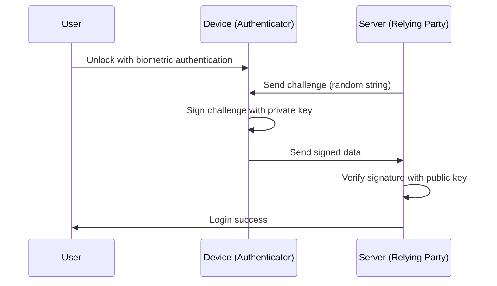

Since the dawn of the internet, we have relied on "passwords" as the keys to the digital world. However, password reuse, choosing easy-to-guess strings, and above all, credential leaks through phishing scams have become the biggest vulnerabilities in modern cybersecurity.

"Passkeys" emerged to solve this problem from its roots. Passkeys are a new authentication method that replaces passwords, based on the WebAuthn (Web Authentication) standard formulated by the FIDO (Fast IDentity Online) Alliance and the W3C.

This article will deeply explore and explain the technical mechanisms behind passkeys, the basics of public key cryptography, the differences between device-bound passkeys and synced passkeys, how phishing resistance is achieved, and actual code implementation examples.

## 1. Basic Passkey Technologies: Public Key Cryptography and WebAuthn

The security of passkeys is supported by "Public Key Cryptography". In traditional password authentication, the client and server share the "same secret (password)", and send this secret during login to verify the match (Symmetric authentication). The biggest weakness of this mechanism is that the secret flows over the network, and because the secret (or its hash value) is stored on the server side, information is leaked if the server is compromised.

### 1.1 Asymmetric Authentication using Public Key Cryptography

Passkeys use asymmetric authentication based on public key cryptography. When a passkey is generated, the following two keys are created on the device.

1. **Private Key**: Strictly stored in a secure area of the user's device (such as Secure Enclave or TPM) and never leaves the device.
2. **Public Key**: Sent to the server (Relying Party) and stored tied to the account. Because the public key is meaningless without the private key, there is no security risk even if it is leaked.

During login, the server sends random data (challenge). The user's device verifies the user using biometric authentication (fingerprint or facial recognition), and then signs this challenge (digital signature) using the private key. The server verifies this signature using the stored public key, and if it is correct, allows the login.



### 1.2 WebAuthn API

The API that allows this process to be used seamlessly from web browsers and apps is "WebAuthn". WebAuthn is an API that can be called from JavaScript and provides the following two main functions.

- `navigator.credentials.create()`: Registration of a new passkey (generation of a public key and sending it to the server)
- `navigator.credentials.get()`: Authentication using an existing passkey (signing the challenge and sending it to the server)

When these APIs are called, an OS-level authentication dialog is displayed, and users complete authentication simply by touching a fingerprint sensor or performing facial recognition.

## 2. The Mechanism of Phishing Resistance

One of the greatest features of passkeys is that they have strong "Phishing Resistance". With traditional one-time passwords (OTP) and SMS-based two-factor authentication (2FA), if a user is tricked by a fake site and enters their password and OTP, the attacker can take over the account (such as through AiTM attacks).

However, passkeys structurally neutralize phishing.

### 2.1 Origin Binding

In WebAuthn, a passkey is cryptographically bound to a specific website's domain (Origin).

Suppose a user creates a passkey on `https://example.com`. At this time, the browser saves the information that "this passkey is for `example.com`" tied to the device, and when registering the public key, it also sends a proof to the server stating "this public key was created for `example.com`".

What happens if a user is redirected to a clever phishing site `https://examp1e.com` and tries to log in there?

1. The site calls `navigator.credentials.get()`.
2. The browser confirms that the current origin is `examp1e.com` and searches the device.
3. Since no passkey bound to `examp1e.com` exists, the browser rejects the authentication process.

Even if the user is tricked, the browser and OS detect the domain mismatch and absolutely will not sign with the private key. This prevents phishing attacks to a level where they are technically impossible.

### 2.2 Challenge-Response Authentication

Furthermore, when signing the challenge sent from the server, the data to be signed (ClientDataJSON) includes the calling origin (Origin) and cross-origin state in addition to the challenge itself.

When verifying the signature on the server side, the following are checked:
- Is the signature correct (does it match the public key)?
- Is the signed origin the correct domain of the company (e.g., `https://example.com`)?
- Does the challenge match the one issued just before?

Even if an attacker relays the challenge using a relay site (reverse proxy), the origin signed by the browser will be the "domain of the fake site the user is looking at", so the real server detects the origin mismatch and rejects the authentication.

## 3. Device-Bound Passkeys vs Synced Passkeys

Passkeys can be broadly divided into two types. Understanding their respective characteristics is important for implementing them according to security requirements.

### 3.1 Device-Bound Passkeys

In early FIDO authentication (early stages of FIDO UAF and FIDO2/WebAuthn), the private key was entirely bound to the secure element of the device on which it was generated. Hardware security keys like YubiKey are prime examples.

**Pros:**
- Extremely high security: Unless the device is physically stolen, the private key will not be leaked.
- Compliance with enterprise requirements: Satisfies strict security standards such as NIST SP 800-63B AAL3 (Authenticator Assurance Level 3).

**Cons:**
- Risk of loss: If the device is lost or broken, the private key is lost forever. A backup strategy, such as registering multiple devices, is required.
- Low convenience: When buying a new smartphone, re-registration is required on all sites.

### 3.2 Synced Passkeys (Multi-Device FIDO Credentials)

"Synced passkeys" were introduced to aim for popularization among consumers. Password managers such as Apple (iCloud Keychain), Google (Google Password Manager), Microsoft (Windows Hello), and 1Password provide this feature.

With synced passkeys, the private key is end-to-end encrypted (E2EE) and then synchronized with the user's other devices via the cloud.

**Pros:**
- Overwhelming convenience: A passkey created on an iPhone can automatically be used on an iPad or Mac. Even if a device is lost, it can be restored to a new device from the cloud.
- Solving the account recovery problem: It significantly reduces the "account lockout when a device is lost", which was the biggest issue with device-bound passkeys.

**Cons:**
- Dependency on cloud providers: It depends on the security model of the syncing ecosystem (such as Apple or Google). If the ecosystem account itself (Apple ID or Google Account) is taken over, the passkeys are also exposed to danger.

To balance convenience and security, the FIDO Alliance has adopted a flexible approach of promoting synced passkeys for consumers while supporting device-bound passkeys (hardware keys) for enterprises and financial institutions requiring high security.

## 4. WebAuthn Implementation Example: Frontend and Backend

When actually implementing passkeys on a website, processing is required on both the frontend (JavaScript) and backend (server-side). Here, we introduce the basic flow and code examples for registering a new passkey (Registration).

### 4.1 Registration Phase

#### 1. Retrieve the challenge from the server
Send a request from the frontend to the server to retrieve registration options (challenge, user information, etc.).

#### 2. Call `create()` on the frontend
Call the browser's WebAuthn API using the options (`PublicKeyCredentialCreationOptions`) received from the server.

```javascript
// Example of options retrieved from the server (some data requires conversion to ArrayBuffer)
const publicKeyCredentialCreationOptions = {
    challenge: Uint8Array.from("random_challenge_string_from_server", c => c.charCodeAt(0)),
    rp: {
        name: "My Awesome App",
        id: "example.com"
    },
    user: {
        id: Uint8Array.from("user_unique_id_12345", c => c.charCodeAt(0)),
        name: "user@example.com",
        displayName: "John Doe"
    },
    pubKeyCredParams: [
        { alg: -7, type: "public-key" }, // ES256
        { alg: -257, type: "public-key" } // RS256
    ],
    authenticatorSelection: {
        authenticatorAttachment: "platform", // "cross-platform" for security keys
        userVerification: "required" // Request biometric authentication, etc.
    },
    timeout: 60000,
    attestation: "none" // Basically 'none' for privacy protection
};

try {
    // The browser displays a native authentication UI
    const credential = await navigator.credentials.create({
        publicKey: publicKeyCredentialCreationOptions
    });

    // Send the generated public key and signature data to the server
    const attestationResponse = {
        id: credential.id,
        rawId: Array.from(new Uint8Array(credential.rawId)),
        type: credential.type,
        response: {
            clientDataJSON: Array.from(new Uint8Array(credential.response.clientDataJSON)),
            attestationObject: Array.from(new Uint8Array(credential.response.attestationObject))
        }
    };

    // Send to the server for verification and storage using the fetch API, etc.
    await fetch('/api/webauthn/register', {
        method: 'POST',
        headers: { 'Content-Type': 'application/json' },
        body: JSON.stringify(attestationResponse)
    });

} catch (err) {
    console.error("Failed to create passkey", err);
}
```

#### 3. Verification and Storage on the Server
The data sent from the frontend is verified on the server. Because this verification process is complex, WebAuthn libraries for each language (such as `@simplewebauthn/server` for Node.js, `webauthn` for Python, `go-webauthn` for Go, etc.) are usually used.

Verification items:
- Does the challenge match?
- Do the Origin and RP ID match?
- Has User Verification succeeded?
- Is the signature correct?

If verification succeeds, the `credential.id` (Credential ID) and public key (Public Key) are stored tied to the user record in the database.

## 5. FIDO Alliance and Adoption Status

WebAuthn and FIDO2, the technological foundations of passkeys, were formulated by the FIDO Alliance and the W3C. The FIDO Alliance includes hundreds of companies, from giant tech companies like Apple, Google, Microsoft, Amazon, and Meta, to financial institutions and security vendors.

In recent years, the adoption of passkeys has been progressing rapidly.

1. **Platform Support**: Major OSes like iOS/macOS, Android, and Windows now support passkeys at the OS level.
2. **Adoption by Major Services**: Numerous global services, such as Google Accounts, Amazon, GitHub, Nintendo, X (formerly Twitter), and PayPal, are standardizing login with passkeys.
3. **Cross-Device Authentication (CDA)**: Mechanisms for logging into a computer browser using a smartphone (Bluetooth/QR code linkage via CTAP2) have also been developed, realizing a seamless authentication experience across different devices.

## 6. Conclusion and Future Prospects

Passkeys are not just a "password substitute" but a revolutionary technology that fundamentally secures the internet's authentication infrastructure. Mathematical proofs via public key cryptography, complete neutralization of phishing through cryptographic binding with domains, and a frictionless user experience through biometric authentication. By combining these, the trade-off between security and convenience is finally being overcome.

Of course, there are still issues to be solved, such as the lock-in problem with sync providers and the establishment of management methods in the enterprise. However, the entire industry is steadily making progress toward a "passwordless future", and there is no doubt that passkeys will become the standard authentication method moving forward.

As a developer, the time has come to start considering implementing passkeys (WebAuthn) right now, in addition to existing password authentication. To protect users' precious data and provide a more comfortable login experience, adopting passkeys will be one of the most effective investments.
