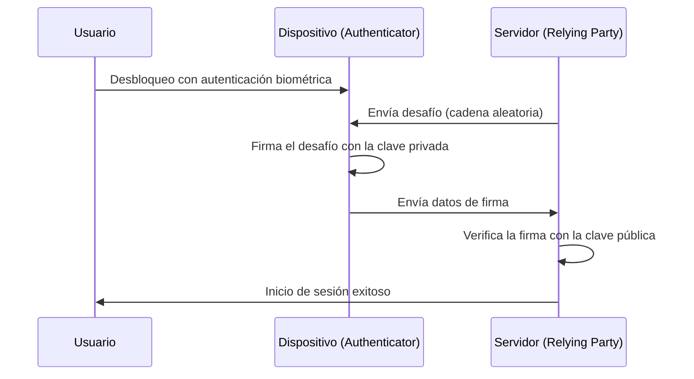

Desde los albores de Internet, hemos dependido de las "contraseñas" como llaves para nuestro mundo digital. Sin embargo, la reutilización de contraseñas, la elección de cadenas fáciles de adivinar y, sobre todo, la filtración de credenciales a través del phishing se han convertido en las mayores vulnerabilidades de la ciberseguridad moderna.

Las "Passkeys" (claves de acceso) surgieron para resolver este problema de raíz. Una passkey es un nuevo método de autenticación basado en el estándar WebAuthn (Web Authentication) establecido por la Alianza FIDO (Fast IDentity Online) y el W3C para reemplazar las contraseñas.

En este artículo, profundizaremos en el mecanismo técnico detrás de las passkeys, los fundamentos de la criptografía de clave pública, la diferencia entre las passkeys vinculadas a dispositivos (device-bound) y las passkeys sincronizables, cómo se logra la resistencia al phishing, y ejemplos prácticos de implementación de código.

## 1. Tecnología fundamental de las passkeys: Criptografía de clave pública y WebAuthn

La seguridad de las passkeys se basa en la "Criptografía de clave pública" (Public Key Cryptography). En la autenticación de contraseña tradicional, el cliente y el servidor comparten el "mismo secreto" (contraseña), y al iniciar sesión, ese secreto se envía para confirmar la coincidencia (Symmetric authentication - Autenticación simétrica). La mayor debilidad de este mecanismo es que el secreto viaja a través de la red, y como el secreto (o su valor hash) se almacena en el lado del servidor, la información puede filtrarse si el servidor es vulnerado.

### 1.1 Autenticación asimétrica con criptografía de clave pública

Las passkeys utilizan autenticación asimétrica basada en criptografía de clave pública. Cuando se genera una passkey, se crean las siguientes dos claves en el dispositivo:

1. **Clave privada (Private Key)**: Se guarda de forma estrictamente segura en un área segura del dispositivo del usuario (como Secure Enclave o TPM) y nunca sale del dispositivo.
2. **Clave pública (Public Key)**: Se envía al servidor (Relying Party) y se guarda vinculada a la cuenta. Dado que la clave pública no tiene sentido sin la clave privada, no hay riesgo de seguridad incluso si se filtra.

Durante el inicio de sesión, el servidor envía datos aleatorios (un desafío). El dispositivo del usuario verifica al usuario mediante autenticación biométrica (como huella dactilar o reconocimiento facial), y luego utiliza la clave privada para firmar este desafío (firma digital). El servidor utiliza la clave pública almacenada para verificar esta firma, y si es correcta, permite el inicio de sesión.



### 1.2 API de WebAuthn

"WebAuthn" es la API para usar este proceso de manera fluida desde navegadores web y aplicaciones. WebAuthn es una API que se puede llamar desde JavaScript y proporciona las siguientes dos funciones principales:

- `navigator.credentials.create()`: Registro de una nueva passkey (generación de la clave pública y envío al servidor).
- `navigator.credentials.get()`: Autenticación con una passkey existente (firma del desafío y envío al servidor).

Al llamar a estas API, se muestra un cuadro de diálogo de autenticación a nivel del sistema operativo (OS), y el usuario completa la autenticación simplemente tocando el sensor de huellas dactilares o realizando el reconocimiento facial.

## 2. Mecanismo de resistencia al phishing

Una de las características más destacadas de las passkeys es que tienen una fuerte "Resistencia al phishing" (Phishing Resistance). Con las contraseñas de un solo uso (OTP) tradicionales y la autenticación de dos factores (2FA) por SMS, si los usuarios son engañados por sitios falsos e ingresan sus contraseñas y OTP, los atacantes pueden apoderarse de sus cuentas (como en los ataques AiTM).

Sin embargo, las passkeys neutralizan estructuralmente el phishing.

### 2.1 Vinculación de origen (Origin Binding)

En WebAuthn, una passkey está vinculada criptográficamente al dominio del sitio web específico (Origin).

Supongamos que un usuario crea una passkey en `https://example.com`. En este momento, el navegador vincula y guarda información en el dispositivo que indica "esta passkey es para `example.com`", y al registrar la clave pública, envía un comprobante al servidor que dice "esta clave pública se creó para `example.com`".

Si el usuario es redirigido a un sitio de phishing sofisticado `https://examp1e.com` e intenta iniciar sesión allí, ¿qué sucedería?

1. El sitio llama a `navigator.credentials.get()`.
2. El navegador comprueba que el origen actual es `examp1e.com` y busca en el dispositivo.
3. Como no existe una passkey vinculada a `examp1e.com`, el navegador rechaza el proceso de autenticación.

Incluso si el usuario es engañado, el navegador y el sistema operativo detectan la discrepancia del dominio y nunca realizarán una firma con la clave privada. Como resultado, los ataques de phishing se pueden prevenir hasta un nivel en el que son técnicamente imposibles.

### 2.2 Autenticación de desafío-respuesta

Además, al firmar el desafío enviado por el servidor, los datos a firmar (ClientDataJSON) incluyen no solo el desafío en sí, sino también el origen (Origin) de la persona que llama y el estado de origen cruzado (cross-origin).

Cuando el servidor verifica la firma, comprueba lo siguiente:
- Si la firma es correcta (coincide con la clave pública).
- Si el origen firmado es su propio dominio correcto (por ejemplo, `https://example.com`).
- Si el desafío coincide con el emitido justo antes.

Incluso si un atacante usa un sitio intermediario (proxy inverso) para retransmitir el desafío, el origen que firma el navegador será "el dominio del sitio falso que está viendo el usuario", por lo que el servidor real detectará la discrepancia del origen y rechazará la autenticación.

## 3. Passkeys vinculadas a dispositivos vs Passkeys sincronizables

Existen principalmente dos tipos de passkeys. Comprender las características de cada uno es importante para implementarlos de acuerdo con los requisitos de seguridad.

### 3.1 Passkeys vinculadas a dispositivos (Device-Bound Passkeys)

En la autenticación FIDO inicial (FIDO UAF y las primeras etapas de FIDO2/WebAuthn), la clave privada estaba completamente fijada (Bound) al elemento seguro del dispositivo en el que se generaba. Las llaves de seguridad de hardware como YubiKey son un ejemplo típico.

**Ventajas:**
- Seguridad extremadamente alta: A menos que se robe físicamente el dispositivo, la clave privada no se filtrará.
- Cumplimiento de requisitos empresariales: Cumple con estrictos estándares de seguridad como AAL3 (Authenticator Assurance Level 3) de NIST SP 800-63B.

**Desventajas:**
- Riesgo de pérdida: Si pierde o rompe el dispositivo, la clave privada se perderá para siempre. Requiere una estrategia de respaldo, como registrar múltiples dispositivos.
- Baja conveniencia: Si compra un nuevo teléfono inteligente, deberá volver a registrarse en todos los sitios.

### 3.2 Passkeys sincronizables (Synced Passkeys / Multi-Device FIDO Credentials)

Para lograr una adopción generalizada por parte de los consumidores, se introdujeron las "Passkeys sincronizables". Apple (iCloud Keychain), Google (Google Password Manager), Microsoft (Windows Hello) y administradores de contraseñas como 1Password ofrecen esta función.

Con las passkeys sincronizables, la clave privada se encripta de extremo a extremo (E2EE) y luego se sincroniza con los otros dispositivos del usuario a través de la nube.

**Ventajas:**
- Conveniencia abrumadora: Las passkeys creadas en un iPhone se pueden usar automáticamente en un iPad o Mac. Incluso si pierde su dispositivo, se puede restaurar en un nuevo dispositivo desde la nube.
- Resolución de problemas de recuperación de cuentas: Mitiga significativamente el "bloqueo de cuenta por pérdida del dispositivo" (Lockout), que era el mayor problema con las passkeys vinculadas a dispositivos.

**Desventajas:**
- Dependencia del proveedor de la nube: Depende del modelo de seguridad del ecosistema de sincronización (como Apple o Google). Si la propia cuenta del ecosistema (Apple ID o cuenta de Google) se ve comprometida, las passkeys también estarán en peligro.

Para equilibrar la conveniencia y la seguridad, la Alianza FIDO ha adoptado un enfoque flexible, promoviendo passkeys sincronizables para consumidores y respaldando passkeys vinculadas a dispositivos (llaves de hardware) para empresas e instituciones financieras que requieran alta seguridad.

## 4. Ejemplo de implementación de WebAuthn: Frontend y Backend

Al implementar passkeys de forma práctica en un sitio web, se requiere procesamiento tanto en el frontend (JavaScript) como en el backend (del lado del servidor). Aquí, presentaremos el flujo básico y ejemplos de código para registrar (Registration) una nueva passkey.

### 4.1 Fase de registro (Registration)

#### 1. Obtener un desafío del servidor
Envíe una solicitud desde el frontend al servidor y obtenga las opciones de registro (desafío, información del usuario, etc.).

#### 2. Llamar a `create()` en el frontend
Utilice las opciones recibidas del servidor (`PublicKeyCredentialCreationOptions`) para llamar a la API WebAuthn del navegador.

```javascript
// Ejemplo de opciones obtenidas del servidor (algunos datos deben convertirse a ArrayBuffer)
const publicKeyCredentialCreationOptions = {
    challenge: Uint8Array.from("random_challenge_string_from_server", c => c.charCodeAt(0)),
    rp: {
        name: "My Awesome App",
        id: "example.com"
    },
    user: {
        id: Uint8Array.from("user_unique_id_12345", c => c.charCodeAt(0)),
        name: "user@example.com",
        displayName: "John Doe"
    },
    pubKeyCredParams: [
        { alg: -7, type: "public-key" }, // ES256
        { alg: -257, type: "public-key" } // RS256
    ],
    authenticatorSelection: {
        authenticatorAttachment: "platform", // "cross-platform" para llaves de seguridad
        userVerification: "required" // Requiere autenticación biométrica, etc.
    },
    timeout: 60000,
    attestation: "none" // "none" básicamente para protección de la privacidad
};

try {
    // El navegador muestra la interfaz de usuario de autenticación nativa
    const credential = await navigator.credentials.create({
        publicKey: publicKeyCredentialCreationOptions
    });

    // Envía la clave pública generada y los datos de la firma al servidor
    const attestationResponse = {
        id: credential.id,
        rawId: Array.from(new Uint8Array(credential.rawId)),
        type: credential.type,
        response: {
            clientDataJSON: Array.from(new Uint8Array(credential.response.clientDataJSON)),
            attestationObject: Array.from(new Uint8Array(credential.response.attestationObject))
        }
    };

    // Envía al servidor con la API fetch, etc., para verificación y guardado
    await fetch('/api/webauthn/register', {
        method: 'POST',
        headers: { 'Content-Type': 'application/json' },
        body: JSON.stringify(attestationResponse)
    });

} catch (err) {
    console.error("No se pudo crear la passkey", err);
}
```

#### 3. Verificación y guardado en el servidor
Verifique los datos enviados desde el frontend en el servidor. Debido a que este proceso de verificación es complejo, a menudo se utilizan las bibliotecas de WebAuthn de cada lenguaje (como `@simplewebauthn/server` de Node.js, `webauthn` de Python, `go-webauthn` de Go, etc.).

Elementos de verificación:
- Si el desafío coincide
- Si el origen (Origin) y el ID de RP coinciden
- Si la autenticación del usuario (User Verification) es exitosa
- Si la firma es correcta

Tras una verificación exitosa, `credential.id` (ID de credencial) y la clave pública (Public Key) se guardan vinculados al registro del usuario en la base de datos.

## 5. Alianza FIDO y estado de adopción

WebAuthn y FIDO2, la base tecnológica de las passkeys, fueron establecidas por la Alianza FIDO y el W3C. La Alianza FIDO incluye a cientos de empresas, desde gigantes tecnológicos como Apple, Google, Microsoft, Amazon y Meta, hasta instituciones financieras y proveedores de seguridad.

En los últimos años, la adopción de las passkeys ha avanzado rápidamente.

1. **Soporte de plataforma**: Los principales sistemas operativos como iOS/macOS, Android y Windows ahora admiten passkeys a nivel del sistema operativo.
2. **Implementación en los principales servicios**: Numerosos servicios globales como Cuentas de Google, Amazon, GitHub, Nintendo, X (anteriormente Twitter) y PayPal están estandarizando el inicio de sesión con passkeys.
3. **Autenticación entre dispositivos (Cross-Device Authentication - CDA)**: También se han implementado mecanismos para iniciar sesión en navegadores de PC utilizando teléfonos inteligentes (conexión Bluetooth/código QR a través de CTAP2), lo que permite una experiencia de autenticación fluida en diferentes dispositivos.

## 6. Resumen y perspectivas de futuro

Las passkeys no son solo una "alternativa a las contraseñas", sino una tecnología revolucionaria que asegura fundamentalmente la infraestructura de autenticación de Internet. Demostración matemática a través de criptografía de clave pública, anulación completa del phishing a través de vinculación criptográfica al dominio, y una experiencia de usuario sin fricciones mediante autenticación biométrica. Al combinar estos, finalmente estamos superando la disyuntiva entre seguridad y conveniencia.

Por supuesto, aún existen desafíos por resolver, como el problema de la dependencia de los proveedores de sincronización y el establecimiento de métodos de gestión en las empresas. Sin embargo, toda la industria avanza constantemente hacia un "futuro sin contraseñas", y es seguro que las passkeys se convertirán en el método de autenticación estándar en el futuro.

Como desarrolladores, es hora de comenzar a considerar la implementación de passkeys (WebAuthn) ahora mismo, además de la autenticación con contraseña existente. Para proteger los datos valiosos de los usuarios y brindar una experiencia de inicio de sesión más cómoda, la introducción de passkeys será una de las inversiones más eficaces.
