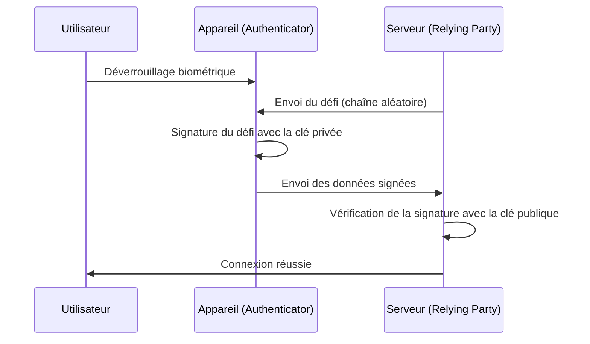

Depuis l'aube d'Internet, nous comptons sur les mots de passe comme clés de notre monde numérique. Cependant, la réutilisation des mots de passe, le choix de chaînes faciles à deviner et, surtout, la fuite d'informations d'identification due aux escroqueries par hameçonnage (phishing) sont devenus les plus grandes vulnérabilités de la cybersécurité moderne.

Pour résoudre ce problème à la racine, les clés d'accès (Passkeys) ont fait leur apparition. Les clés d'accès sont une nouvelle méthode d'authentification remplaçant les mots de passe, basée sur la norme WebAuthn (Web Authentication) établie par l'alliance FIDO (Fast IDentity Online) et le W3C.

Dans cet article, nous explorerons en profondeur les mécanismes techniques derrière les clés d'accès, les bases de la cryptographie à clé publique, les différences entre les clés d'accès liées à l'appareil et celles synchronisables, comment la résistance au hameçonnage est obtenue, jusqu'à des exemples d'implémentation de code réels.

## 1. La technologie de base des clés d'accès : la cryptographie à clé publique et WebAuthn

La sécurité des clés d'accès repose sur la cryptographie à clé publique (Public Key Cryptography). Dans l'authentification traditionnelle par mot de passe, le client et le serveur partagent un même secret (le mot de passe), et ce secret est transmis lors de la connexion pour vérifier la correspondance (authentification symétrique). La plus grande faiblesse de ce système est que le secret circule sur le réseau, et comme il (ou son hachage) est stocké côté serveur, les informations peuvent fuiter en cas de compromission de ce dernier.

### 1.1 Authentification asymétrique par cryptographie à clé publique

Les clés d'accès utilisent l'authentification asymétrique (Asymmetric authentication) basée sur la cryptographie à clé publique. Lorsqu'une clé d'accès est générée, les deux clés suivantes sont créées sur l'appareil :

1. **Clé privée (Private Key)** : Elle est strictement conservée dans une zone sécurisée de l'appareil de l'utilisateur (telle que Secure Enclave ou TPM) et ne quitte jamais l'appareil.
2. **Clé publique (Public Key)** : Elle est envoyée au serveur (Relying Party) et stockée en l'associant au compte. Étant donné que la clé publique n'a aucun sens sans la clé privée, il n'y a aucun risque de sécurité même si elle est divulguée.

Lors de la connexion, le serveur envoie des données aléatoires (un défi ou "challenge"). Après avoir vérifié l'utilisateur par biométrie (empreinte digitale ou reconnaissance faciale), l'appareil signe ce défi (signature numérique) en utilisant la clé privée. Le serveur vérifie ensuite cette signature à l'aide de la clé publique stockée, et si elle est correcte, il autorise la connexion.



### 1.2 L'API WebAuthn

L'API qui permet d'utiliser ce processus de manière transparente depuis un navigateur web ou une application est "WebAuthn". WebAuthn est une API qui peut être appelée depuis JavaScript et offre les deux fonctions principales suivantes :

- `navigator.credentials.create()` : Enregistrement d'une nouvelle clé d'accès (génération de la clé publique et envoi au serveur)
- `navigator.credentials.get()` : Authentification avec une clé d'accès existante (signature du défi et envoi au serveur)

L'appel de ces API affiche une boîte de dialogue d'authentification au niveau du système d'exploitation, et l'utilisateur n'a qu'à toucher le capteur d'empreintes digitales ou effectuer une reconnaissance faciale pour terminer l'authentification.

## 2. Mécanisme de résistance au hameçonnage

L'une des plus grandes caractéristiques des clés d'accès est leur puissante résistance au hameçonnage (Phishing Resistance). Avec les mots de passe à usage unique (OTP) traditionnels ou l'authentification à deux facteurs (2FA) par SMS, si l'utilisateur est trompé par un faux site et y saisit son mot de passe et son OTP, le pirate peut prendre le contrôle du compte (attaques AiTM, etc.).

Cependant, les clés d'accès neutralisent structurellement le hameçonnage.

### 2.1 Liaison d'origine (Origin Binding)

Dans WebAuthn, la clé d'accès est cryptographiquement liée au domaine (Origin) du site web spécifique.

Supposons qu'un utilisateur crée une clé d'accès sur `https://example.com`. À ce moment, le navigateur enregistre sur l'appareil l'information que "cette clé d'accès est pour `example.com`", et lors de l'enregistrement de la clé publique, il envoie au serveur la preuve que "cette clé publique a été créée pour `example.com`".

Que se passe-t-il si l'utilisateur est dirigé vers un site de hameçonnage sophistiqué comme `https://examp1e.com` et tente de s'y connecter ?

1. Le site appelle `navigator.credentials.get()`.
2. Le navigateur vérifie que l'origine actuelle est `examp1e.com` et effectue une recherche dans l'appareil.
3. Comme aucune clé d'accès liée à `examp1e.com` n'existe, le navigateur refuse le processus d'authentification.

Même si l'utilisateur a été trompé, le navigateur et le système d'exploitation détectent la non-correspondance des domaines et n'effectueront jamais de signature avec la clé privée. Cela permet de prévenir les attaques par hameçonnage à un niveau où elles deviennent techniquement impossibles.

### 2.2 Authentification par défi et réponse

De plus, lors de la signature du défi envoyé par le serveur, les données à signer (ClientDataJSON) incluent, outre le défi lui-même, l'origine de l'appelant (Origin) et l'état d'origine croisée (cross-origin).

Lors de la vérification de la signature côté serveur, les points suivants sont contrôlés :
- La signature est-elle correcte (correspond-elle à la clé publique) ?
- L'origine signée est-elle le bon domaine de l'entreprise (ex : `https://example.com`) ?
- Le défi correspond-il à celui émis juste avant ?

Même si l'attaquant utilise un site relais (proxy inverse) pour relayer le défi, l'origine signée par le navigateur sera "le domaine du faux site consulté par l'utilisateur". Par conséquent, le véritable serveur détectera la non-correspondance de l'origine et rejettera l'authentification.

## 3. Clés d'accès liées à l'appareil vs Clés d'accès synchronisables

Les clés d'accès peuvent être divisées en deux catégories principales. Comprendre les caractéristiques de chacune est important pour mettre en œuvre une implémentation adaptée aux exigences de sécurité.

### 3.1 Clés d'accès liées à l'appareil (Device-Bound Passkeys)

Dans l'authentification FIDO initiale (FIDO UAF et les premières étapes de FIDO2/WebAuthn), la clé privée était entièrement liée (Bound) à l'élément sécurisé de l'appareil sur lequel elle était générée. Les clés de sécurité matérielles telles que YubiKey en sont le parfait exemple.

**Avantages :**
- Sécurité extrêmement élevée : Tant que l'appareil n'est pas physiquement volé, la clé privée ne peut pas fuiter.
- Conformité aux exigences de l'entreprise : Répond à des normes de sécurité strictes telles que l'AAL3 (Authenticator Assurance Level 3) de NIST SP 800-63B.

**Inconvénients :**
- Risque en cas de perte : Si l'appareil est perdu ou cassé, la clé privée est perdue à jamais. Une stratégie de sauvegarde, comme l'enregistrement de plusieurs appareils, est nécessaire.
- Manque de praticité : Lors de l'achat d'un nouveau smartphone, un réenregistrement sur tous les sites est requis.

### 3.2 Clés d'accès synchronisables (Synced Passkeys / Multi-Device FIDO Credentials)

Les "clés d'accès synchronisables" ont été introduites dans le but de se généraliser auprès des consommateurs. Apple (Trousseau iCloud), Google (Gestionnaire de mots de passe Google), Microsoft (Windows Hello), ainsi que les gestionnaires de mots de passe comme 1Password offrent cette fonctionnalité.

Dans les clés d'accès synchronisables, la clé privée est chiffrée de bout en bout (E2EE) et synchronisée avec les autres appareils de l'utilisateur via le cloud.

**Avantages :**
- Praticité exceptionnelle : Une clé d'accès créée sur un iPhone devient automatiquement utilisable sur un iPad ou un Mac. Même en cas de perte de l'appareil, il est possible de restaurer les données sur un nouvel appareil à partir du cloud.
- Résolution du problème de récupération de compte : Cela réduit considérablement le risque d'"exclusion de compte (Lockout) en cas de perte de l'appareil", qui était le plus grand défi des clés d'accès liées à l'appareil.

**Inconvénients :**
- Dépendance vis-à-vis des fournisseurs cloud : Le système dépend du modèle de sécurité de l'écosystème de synchronisation (Apple, Google, etc.). Si le compte de l'écosystème lui-même (Identifiant Apple ou compte Google) est piraté, les clés d'accès sont également menacées.

Pour trouver un équilibre entre praticité et sécurité, l'alliance FIDO adopte une approche flexible : elle promeut les clés d'accès synchronisables pour les consommateurs tout en soutenant les clés d'accès liées à l'appareil (clés matérielles) pour les entreprises et les institutions financières nécessitant une sécurité élevée.

## 4. Exemple d'implémentation de WebAuthn : Front-end et Back-end

Lors de l'implémentation concrète de clés d'accès sur un site web, des traitements sont nécessaires à la fois sur le front-end (JavaScript) et le back-end (côté serveur). Voici le flux de base et des exemples de code pour enregistrer (Registration) une nouvelle clé d'accès.

### 4.1 Phase d'enregistrement (Registration)

#### 1. Obtenir le défi du serveur
Envoyez une requête du front-end au serveur pour obtenir les options d'enregistrement (défi, informations utilisateur, etc.).

#### 2. Appeler `create()` sur le front-end
Utilisez les options reçues du serveur (`PublicKeyCredentialCreationOptions`) pour appeler l'API WebAuthn du navigateur.

```javascript
// Exemple d'options obtenues du serveur (certaines données doivent être converties en ArrayBuffer)
const publicKeyCredentialCreationOptions = {
    challenge: Uint8Array.from("random_challenge_string_from_server", c => c.charCodeAt(0)),
    rp: {
        name: "My Awesome App",
        id: "example.com"
    },
    user: {
        id: Uint8Array.from("user_unique_id_12345", c => c.charCodeAt(0)),
        name: "user@example.com",
        displayName: "John Doe"
    },
    pubKeyCredParams: [
        { alg: -7, type: "public-key" }, // ES256
        { alg: -257, type: "public-key" } // RS256
    ],
    authenticatorSelection: {
        authenticatorAttachment: "platform", // "cross-platform" pour les clés de sécurité
        userVerification: "required" // Exiger l'authentification biométrique, etc.
    },
    timeout: 60000,
    attestation: "none" // "none" par défaut pour la protection de la vie privée
};

try {
    // Le navigateur affiche l'interface utilisateur d'authentification native
    const credential = await navigator.credentials.create({
        publicKey: publicKeyCredentialCreationOptions
    });

    // Envoyer la clé publique générée et les données de signature au serveur
    const attestationResponse = {
        id: credential.id,
        rawId: Array.from(new Uint8Array(credential.rawId)),
        type: credential.type,
        response: {
            clientDataJSON: Array.from(new Uint8Array(credential.response.clientDataJSON)),
            attestationObject: Array.from(new Uint8Array(credential.response.attestationObject))
        }
    };

    // Envoyer au serveur via l'API fetch, etc. pour vérification et enregistrement
    await fetch('/api/webauthn/register', {
        method: 'POST',
        headers: { 'Content-Type': 'application/json' },
        body: JSON.stringify(attestationResponse)
    });

} catch (err) {
    console.error("Échec de la création de la clé d'accès", err);
}
```

#### 3. Vérification et enregistrement sur le serveur
Vérifiez sur le serveur les données envoyées par le front-end. Étant donné que ce processus de vérification est complexe, des bibliothèques WebAuthn pour chaque langage (comme `@simplewebauthn/server` pour Node.js, `webauthn` pour Python, `go-webauthn` pour Go, etc.) sont généralement utilisées.

Éléments à vérifier :
- Le défi correspond-il ?
- L'origine (Origin) et le RP ID correspondent-ils ?
- L'authentification de l'utilisateur (User Verification) a-t-elle réussi ?
- La signature est-elle correcte ?

Si la vérification réussit, `credential.id` (ID d'identifiant) et la clé publique (Public Key) sont liés au registre de l'utilisateur dans la base de données et enregistrés.

## 5. Alliance FIDO et adoption

WebAuthn et FIDO2, qui constituent la base technologique des clés d'accès, ont été définis par l'alliance FIDO et le W3C. Des centaines d'entreprises, allant des géants de la technologie tels qu'Apple, Google, Microsoft, Amazon et Meta, aux institutions financières et aux fournisseurs de sécurité, participent à l'alliance FIDO.

Ces dernières années, l'adoption des clés d'accès a progressé rapidement.

1. **Support des plateformes** : Les principaux systèmes d'exploitation tels qu'iOS/macOS, Android et Windows prennent désormais en charge les clés d'accès au niveau du système d'exploitation.
2. **Introduction par les grands services** : De nombreux services mondiaux, dont les comptes Google, Amazon, GitHub, Nintendo, X (anciennement Twitter) et PayPal, sont en train de normaliser la connexion via des clés d'accès.
3. **Authentification inter-appareils (CDA - Cross-Device Authentication)** : Un mécanisme pour se connecter à un navigateur sur ordinateur à l'aide d'un smartphone (via Bluetooth/Code QR avec CTAP2) a également été mis en place, offrant une expérience d'authentification transparente entre différents appareils.

## 6. Conclusion et perspectives futures

Les clés d'accès ne sont pas une simple "alternative aux mots de passe", mais une technologie révolutionnaire qui sécurise de bout en bout l'infrastructure d'authentification d'Internet. Une preuve mathématique par cryptographie à clé publique, une neutralisation complète du hameçonnage par liaison cryptographique au domaine, et une expérience utilisateur sans friction grâce à la biométrie. En combinant ces éléments, le compromis entre sécurité et commodité est enfin sur le point d'être surmonté.

Bien sûr, il reste encore des défis à résoudre, comme le problème du verrouillage des fournisseurs de synchronisation ou l'établissement de méthodes de gestion en entreprise. Cependant, l'ensemble de l'industrie avance sûrement vers un "avenir sans mot de passe", et il ne fait aucun doute que les clés d'accès deviendront la méthode d'authentification standard à l'avenir.

En tant que développeur, le moment est venu d'envisager sérieusement l'implémentation des clés d'accès (WebAuthn) en plus de l'authentification par mot de passe existante. Pour protéger les données précieuses des utilisateurs et offrir une expérience de connexion plus agréable, l'adoption des clés d'accès sera l'un des investissements les plus efficaces.
