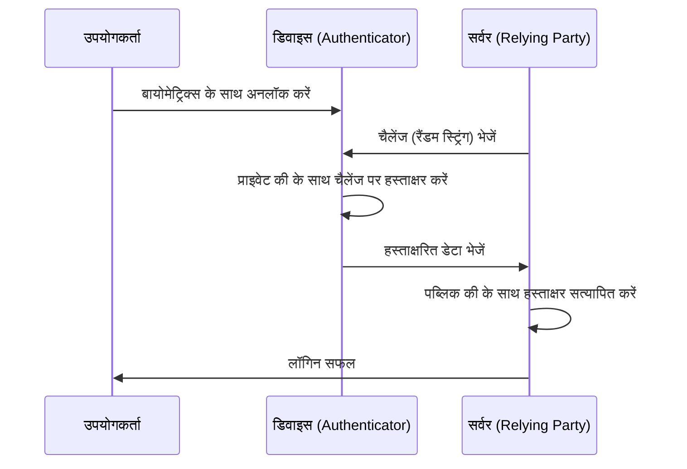

इंटरनेट के शुरुआती दिनों से, हमने डिजिटल दुनिया की कुंजी के रूप में "पासवर्ड" पर भरोसा किया है। हालांकि, पासवर्ड का बार-बार उपयोग, अनुमान लगाने में आसान स्ट्रिंग्स का चयन, और सबसे बढ़कर फिशिंग घोटालों के माध्यम से क्रेडेंशियल का लीक होना, आधुनिक साइबर सुरक्षा में सबसे बड़ी भेद्यता बन गया है।

इस समस्या को मूल रूप से हल करने के लिए "पासकी" (Passkeys) पेश की गई है। पासकी FIDO (Fast IDentity Online) एलायंस और W3C द्वारा स्थापित WebAuthn (Web Authentication) मानक पर आधारित पासवर्ड का एक नया प्रमाणीकरण विकल्प है।

इस लेख में, हम पासकी के पीछे की तकनीकी कार्यप्रणाली, पब्लिक की क्रिप्टोग्राफी (Public Key Cryptography) के मूल तत्व, डिवाइस-बाउंड पासकी और सिंक करने योग्य पासकी के बीच का अंतर, फिशिंग प्रतिरोध कैसे प्राप्त किया जाता है, और वास्तविक कोड कार्यान्वयन उदाहरणों पर गहराई से चर्चा करेंगे।

## 1. पासकी की मूल तकनीक: पब्लिक की क्रिप्टोग्राफी और WebAuthn

पासकी की सुरक्षा "पब्लिक की क्रिप्टोग्राफी" (Public Key Cryptography) द्वारा समर्थित है। पारंपरिक पासवर्ड प्रमाणीकरण में, क्लाइंट और सर्वर "समान रहस्य (पासवर्ड)" साझा करते हैं, और लॉगिन के समय मेल की पुष्टि करने के लिए उस रहस्य को भेजते हैं (सममित प्रमाणीकरण / Symmetric authentication)। इस प्रणाली की सबसे बड़ी कमजोरी यह है कि रहस्य नेटवर्क पर प्रवाहित होता है, और चूंकि रहस्य (या उसका हैश मान) सर्वर पक्ष पर सहेजा जाता है, यदि सर्वर से समझौता किया जाता है तो जानकारी लीक हो जाती है।

### 1.1 पब्लिक की क्रिप्टोग्राफी के साथ असममित प्रमाणीकरण (Asymmetric authentication)

पासकी पब्लिक की क्रिप्टोग्राफी पर आधारित असममित प्रमाणीकरण का उपयोग करती है। जब पासकी बनाई जाती है, तो डिवाइस पर निम्नलिखित दो कुंजियाँ उत्पन्न होती हैं:

1. **प्राइवेट की (Private Key)**: यह उपयोगकर्ता के डिवाइस के सुरक्षित क्षेत्र (जैसे Secure Enclave या TPM) में कड़ाई से सुरक्षित रखी जाती है, और कभी भी डिवाइस से बाहर नहीं जाती है।
2. **पब्लिक की (Public Key)**: इसे सर्वर (Relying Party) को भेजा जाता है और खाते से जोड़कर सहेजा जाता है। चूँकि पब्लिक की का प्राइवेट की के बिना कोई मतलब नहीं है, भले ही यह लीक हो जाए, कोई सुरक्षा जोखिम नहीं है।

लॉगिन के समय, सर्वर से यादृच्छिक डेटा (चैलेंज) भेजा जाता है। उपयोगकर्ता का डिवाइस बायोमेट्रिक्स (फिंगरप्रिंट या चेहरे की पहचान) का उपयोग करके उपयोगकर्ता को सत्यापित करने के बाद इस चैलेंज पर हस्ताक्षर (डिजिटल हस्ताक्षर) करने के लिए प्राइवेट की का उपयोग करता है। सर्वर संग्रहीत पब्लिक की का उपयोग करके इस हस्ताक्षर की पुष्टि करता है, और यदि यह सही है तो लॉगिन की अनुमति देता है।



### 1.2 WebAuthn API

वेब ब्राउज़र या ऐप से इस प्रक्रिया का निर्बाध रूप से उपयोग करने के लिए API "WebAuthn" है। WebAuthn एक API है जिसे JavaScript से कॉल किया जा सकता है, और यह निम्नलिखित दो मुख्य कार्य प्रदान करता है:

- `navigator.credentials.create()`: नई पासकी का पंजीकरण (पब्लिक की उत्पन्न करना और इसे सर्वर पर भेजना)
- `navigator.credentials.get()`: मौजूदा पासकी के साथ प्रमाणीकरण (चैलेंज पर हस्ताक्षर करना और सर्वर को भेजना)

जब इन API को कॉल किया जाता है, तो OS-स्तरीय प्रमाणीकरण संवाद प्रदर्शित होता है, और प्रमाणीकरण केवल फिंगरप्रिंट सेंसर को छूकर या चेहरे की पहचान करके पूरा हो जाता है।

## 2. फिशिंग प्रतिरोध का तंत्र

पासकी की सबसे बड़ी विशेषताओं में से एक इसका मजबूत "फिशिंग प्रतिरोध" (Phishing Resistance) है। पारंपरिक वन-टाइम पासवर्ड (OTP) या SMS के माध्यम से टू-फैक्टर ऑथेंटिकेशन (2FA) के साथ, यदि कोई उपयोगकर्ता नकली साइट के झांसे में आ जाता है और अपना पासवर्ड और OTP दर्ज करता है, तो हमलावर खाते पर कब्ज़ा कर सकता है (जैसे AiTM हमले)।

हालाँकि, पासकी संरचनात्मक रूप से फिशिंग को अमान्य कर देती है।

### 2.1 ओरिजिन बाइंडिंग (Origin Binding)

WebAuthn के साथ, पासकी क्रिप्टोग्राफिक रूप से किसी विशिष्ट वेबसाइट के डोमेन (Origin) से बंधी होती है।

मान लें कि कोई उपयोगकर्ता `https://example.com` पर पासकी बनाता है। इस समय, ब्राउज़र डिवाइस पर यह जानकारी सहेजता है कि "यह पासकी `example.com` के लिए है", और जब पब्लिक की पंजीकृत होती है, तो यह सर्वर को एक प्रमाण भेजता है कि "यह पब्लिक की `example.com` के लिए बनाई गई थी"।

क्या होगा यदि उपयोगकर्ता को किसी चतुर फिशिंग साइट `https://examp1e.com` पर निर्देशित किया जाता है और वहां लॉग इन करने का प्रयास करता है?

1. साइट `navigator.credentials.get()` को कॉल करती है।
2. ब्राउज़र पुष्टि करता है कि वर्तमान ओरिजिन `examp1e.com` है और डिवाइस के भीतर खोज करता है।
3. चूँकि `examp1e.com` से जुड़ी कोई पासकी मौजूद नहीं है, इसलिए ब्राउज़र प्रमाणीकरण प्रक्रिया को अस्वीकार कर देता है।

भले ही उपयोगकर्ता को धोखा दिया गया हो, ब्राउज़र और OS डोमेन बेमेल का पता लगाते हैं और कभी भी प्राइवेट की के साथ हस्ताक्षर नहीं consensual रूप से नहीं करते हैं। इसके कारण, फिशिंग हमलों को उस स्तर तक रोका जा सकता है जहां वे तकनीकी रूप से असंभव हैं।

### 2.2 चैलेंज-रिस्पॉन्स प्रमाणीकरण

इसके अलावा, जब सर्वर से भेजे गए चैलेंज पर हस्ताक्षर किए जाते हैं, तो जिस डेटा पर हस्ताक्षर किए जाने हैं (ClientDataJSON) उसमें स्वयं चैलेंज के साथ-साथ कॉल करने वाले का ओरिजिन (Origin) और क्रॉस-ओरिजिन स्थिति शामिल होती है।

जब सर्वर पक्ष पर हस्ताक्षर को सत्यापित किया जाता है, तो निम्नलिखित की जाँच की जाती है:
- क्या हस्ताक्षर सही है (क्या यह पब्लिक की से मेल खाता है)
- क्या हस्ताक्षरित ओरिजिन कंपनी का सही डोमेन है (उदाहरण: `https://example.com`)
- क्या चैलेंज उसी से मेल खाता है जो अभी जारी किया गया था

भले ही कोई हमलावर चैलेंज को रिले करने के लिए एक रिले साइट (रिवर्स प्रॉक्सी) का उपयोग करता है, ब्राउज़र जिस ओरिजिन पर हस्ताक्षर करेगा वह "उस नकली साइट का डोमेन जिसे उपयोगकर्ता देख रहा है" होगा, इसलिए असली सर्वर ओरिजिन बेमेल का पता लगाएगा और प्रमाणीकरण अस्वीकार करेगा।

## 3. डिवाइस-बाउंड पासकी बनाम सिंक करने योग्य पासकी

पासकी मुख्य रूप से दो प्रकार की होती हैं। सुरक्षा आवश्यकताओं के आधार पर उन्हें लागू करने के लिए प्रत्येक की विशेषताओं को समझना महत्वपूर्ण है।

### 3.1 डिवाइस-बाउंड पासकी (Device-Bound Passkeys)

शुरुआती FIDO प्रमाणीकरण (FIDO UAF और FIDO2/WebAuthn के शुरुआती चरणों) में, प्राइवेट की पूरी तरह से उस डिवाइस के सुरक्षित तत्व (Secure Element) में बंधी (Bound) थी जहां इसे उत्पन्न किया गया था। YubiKey जैसी हार्डवेयर सुरक्षा कुंजियाँ इसके विशिष्ट उदाहरण हैं।

**फायदे:**
- अत्यधिक उच्च सुरक्षा: जब तक डिवाइस को भौतिक रूप से चुराया नहीं जाता है, तब तक प्राइवेट की लीक नहीं होगी।
- कॉर्पोरेट आवश्यकताओं के लिए उपयुक्त: यह NIST SP 800-63B के AAL3 (Authenticator Assurance Level 3) जैसे सख्त सुरक्षा मानकों को पूरा करती है।

**नुकसान:**
- नुकसान का जोखिम: यदि आप डिवाइस खो देते हैं या यह टूट जाता है, तो प्राइवेट की हमेशा के लिए खो जाती है। एकाधिक डिवाइस पंजीकृत करने जैसी बैकअप रणनीति आवश्यक है।
- कम सुविधा: यदि आप एक नया स्मार्टफोन खरीदते हैं, तो आपको सभी साइटों पर फिर से पंजीकरण करना होगा।

### 3.2 सिंक करने योग्य पासकी (Synced Passkeys / Multi-Device FIDO Credentials)

उपभोक्ताओं के लिए इसे लोकप्रिय बनाने के उद्देश्य से "सिंक करने योग्य पासकी" पेश की गई। Apple (iCloud Keychain), Google (Google Password Manager), Microsoft (Windows Hello), और 1Password जैसे पासवर्ड मैनेजर यह सुविधा प्रदान करते हैं।

सिंक करने योग्य पासकी में, प्राइवेट की को एंड-टू-एंड एन्क्रिप्ट (E2EE) किया जाता है और फिर क्लाउड के माध्यम से उपयोगकर्ता के अन्य उपकरणों के साथ समन्वयित (सिंक) किया जाता है।

**फायदे:**
- अत्यधिक सुविधाजनक: iPhone पर बनाई गई पासकी का उपयोग स्वचालित रूप से iPad या Mac पर किया जा सकता है। यदि डिवाइस खो जाता है, तो इसे क्लाउड से नए डिवाइस में पुनर्स्थापित किया जा सकता है।
- खाता पुनर्प्राप्ति समस्या का समाधान: डिवाइस-बाउंड पासकी के साथ सबसे बड़ी समस्या "डिवाइस के खो जाने पर खाते से लॉकआउट (Lockout)" को काफी कम कर देती है।

**नुकसान:**
- क्लाउड प्रदाताओं पर निर्भरता: सिंक इकोसिस्टम (जैसे Apple और Google) के सुरक्षा मॉडल पर निर्भर करता है। यदि इकोसिस्टम खाता (Apple ID या Google खाता) स्वयं हैक कर लिया जाता है, तो पासकी भी खतरे में पड़ जाती है।

सुविधा और सुरक्षा को संतुलित करने के लिए, FIDO Alliance एक लचीला दृष्टिकोण अपनाता है, जो उपभोक्ताओं के लिए सिंक करने योग्य पासकी को बढ़ावा देता है, जबकि उन उद्यमों और वित्तीय संस्थानों के लिए डिवाइस-बाउंड पासकी (हार्डवेयर की) का समर्थन करता है जिन्हें उच्च सुरक्षा की आवश्यकता होती है।

## 4. WebAuthn कार्यान्वयन उदाहरण: फ्रंटएंड और बैकएंड

जब किसी वेबसाइट पर पासकी को वास्तव में लागू किया जाता है, तो फ्रंटएंड (JavaScript) और बैकएंड (सर्वर साइड) दोनों पर प्रसंस्करण की आवश्यकता होती है। यहाँ, हम नई पासकी पंजीकृत (Registration) करने के लिए मूल प्रवाह और कोड उदाहरण प्रस्तुत करते हैं।

### 4.1 पंजीकरण चरण (Registration)

#### 1. सर्वर से चैलेंज प्राप्त करें
पंजीकरण विकल्प (चैलेंज, उपयोगकर्ता जानकारी, आदि) प्राप्त करने के लिए फ्रंटएंड से सर्वर पर एक अनुरोध भेजें।

#### 2. फ्रंटएंड में `create()` को कॉल करें
सर्वर से प्राप्त विकल्पों (`PublicKeyCredentialCreationOptions`) का उपयोग करके ब्राउज़र के WebAuthn API को कॉल करें।

```javascript
// सर्वर से प्राप्त विकल्पों का उदाहरण (कुछ डेटा को ArrayBuffer में परिवर्तित करने की आवश्यकता है)
const publicKeyCredentialCreationOptions = {
    challenge: Uint8Array.from("random_challenge_string_from_server", c => c.charCodeAt(0)),
    rp: {
        name: "My Awesome App",
        id: "example.com"
    },
    user: {
        id: Uint8Array.from("user_unique_id_12345", c => c.charCodeAt(0)),
        name: "user@example.com",
        displayName: "John Doe"
    },
    pubKeyCredParams: [
        { alg: -7, type: "public-key" }, // ES256
        { alg: -257, type: "public-key" } // RS256
    ],
    authenticatorSelection: {
        authenticatorAttachment: "platform", // सुरक्षा कुंजियों के लिए "cross-platform"
        userVerification: "required" // बायोमेट्रिक्स आदि की आवश्यकता
    },
    timeout: 60000,
    attestation: "none" // गोपनीयता सुरक्षा के लिए मूल रूप से none
};

try {
    // ब्राउज़र नेटिव प्रमाणीकरण UI प्रदर्शित करता है
    const credential = await navigator.credentials.create({
        publicKey: publicKeyCredentialCreationOptions
    });

    // जनरेट की गई पब्लिक की और हस्ताक्षर डेटा को सर्वर पर भेजें
    const attestationResponse = {
        id: credential.id,
        rawId: Array.from(new Uint8Array(credential.rawId)),
        type: credential.type,
        response: {
            clientDataJSON: Array.from(new Uint8Array(credential.response.clientDataJSON)),
            attestationObject: Array.from(new Uint8Array(credential.response.attestationObject))
        }
    };

    // सत्यापन और सहेजने के लिए fetch API आदि के साथ सर्वर पर भेजें
    await fetch('/api/webauthn/register', {
        method: 'POST',
        headers: { 'Content-Type': 'application/json' },
        body: JSON.stringify(attestationResponse)
    });

} catch (err) {
    console.error("पासकी बनाने में विफल", err);
}
```

#### 3. सर्वर पर सत्यापन और सहेजना
सर्वर पर फ्रंटएंड से भेजे गए डेटा को सत्यापित करें। चूंकि यह सत्यापन प्रक्रिया जटिल है, इसलिए आमतौर पर प्रत्येक भाषा की WebAuthn लाइब्रेरी का उपयोग किया जाता है (जैसे Node.js के लिए `@simplewebauthn/server`, Python के लिए `webauthn`, Go के लिए `go-webauthn`, आदि)।

सत्यापन आइटम:
- क्या चैलेंज मेल खाता है
- क्या ओरिजिन (Origin) और RP ID मेल खाते हैं
- क्या उपयोगकर्ता प्रमाणीकरण (User Verification) सफल रहा है
- क्या हस्ताक्षर सही है

यदि सत्यापन सफल होता है, तो `credential.id` (क्रेडेंशियल आईडी) और पब्लिक की (Public Key) को डेटाबेस में उपयोगकर्ता रिकॉर्ड से जोड़कर सहेजें।

## 5. FIDO Alliance और अपनाने की स्थिति

पासकी की तकनीकी नींव, WebAuthn और FIDO2, FIDO Alliance और W3C द्वारा स्थापित की गई थी। Apple, Google, Microsoft, Amazon और Meta जैसी दिग्गज तकनीकी कंपनियों से लेकर वित्तीय संस्थानों और सुरक्षा वेंडरों तक, सैकड़ों कंपनियां FIDO Alliance में भाग लेती हैं।

हाल के वर्षों में, पासकी को अपनाना तेजी से बढ़ा है।

1. **प्लेटफॉर्म सपोर्ट**: iOS/macOS, Android, और Windows जैसे प्रमुख OS ने OS स्तर पर पासकी का समर्थन किया है।
2. **प्रमुख सेवाओं द्वारा अपनाया जाना**: Google Account, Amazon, GitHub, Nintendo, X (पूर्व में Twitter), PayPal, आदि जैसी कई वैश्विक सेवाएँ पासकी के साथ लॉगिन को मानकीकृत कर रही हैं।
3. **Cross-Device Authentication (CDA)**: स्मार्टफोन का उपयोग करके कंप्यूटर ब्राउज़र में लॉग इन करने का एक तंत्र (CTAP2 के माध्यम से Bluetooth/QR कोड लिंकिंग) भी विकसित किया गया है, जिससे विभिन्न उपकरणों के बीच एक सहज प्रमाणीकरण अनुभव प्राप्त होता है।

## 6. निष्कर्ष और भविष्य की संभावनाएं

पासकी केवल "पासवर्ड का विकल्प" नहीं है, बल्कि एक क्रांतिकारी तकनीक है जो मूल रूप से इंटरनेट के प्रमाणीकरण बुनियादी ढांचे को सुरक्षित करती है। पब्लिक की क्रिप्टोग्राफी के माध्यम से गणितीय प्रमाण, डोमेन के लिए क्रिप्टोग्राफ़िक बाइंडिंग के माध्यम से फिशिंग को पूरी तरह से अमान्य करना, और बायोमेट्रिक्स के माध्यम से एक घर्षण रहित उपयोगकर्ता अनुभव। इन सब को मिलाकर, सुरक्षा और सुविधा के बीच का ट्रेड-ऑफ़ अंततः दूर हो रहा है।

बेशक, अभी भी हल की जाने वाली चुनौतियाँ हैं, जैसे सिंक प्रदाताओं की लॉक-इन समस्या और उद्यमों में प्रबंधन विधियों की स्थापना। हालाँकि, पूरा उद्योग निश्चित रूप से "पासवर्ड रहित भविष्य" की ओर बढ़ रहा है, और इसमें कोई संदेह fix नहीं है कि पासकी भविष्य में मानक प्रमाणीकरण पद्धति बन जाएगी।

डेवलपर्स के रूप में, यह आपके लिए मौजूदा पासवर्ड प्रमाणीकरण के अलावा अभी पासकी (WebAuthn) लागू करने पर विचार शुरू करने का समय है। उपयोगकर्ताओं के मूल्यवान डेटा की सुरक्षा और अधिक आरामदायक लॉगिन अनुभव प्रदान करने के लिए पासकी की शुरुआत सबसे प्रभावी निवेशों में से एक होगी।
