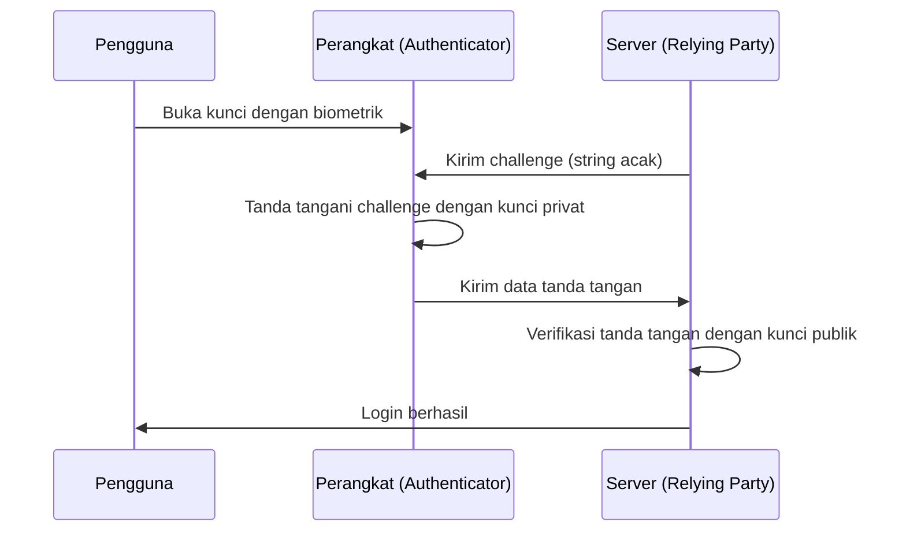

Sejak awal mula internet, kita telah bergantung pada "kata sandi" sebagai kunci ke dunia digital. Namun, penggunaan kembali kata sandi, pemilihan string yang mudah ditebak, dan yang terpenting, kebocoran kredensial akibat penipuan phishing, telah menjadi kerentanan terbesar dalam keamanan siber modern.

Untuk mengatasi masalah ini dari akarnya, hadirlah "Passkeys". Passkey adalah metode autentikasi baru sebagai pengganti kata sandi, yang didasarkan pada standar WebAuthn (Web Authentication) yang dirumuskan oleh aliansi FIDO (Fast IDentity Online) dan W3C.

Dalam artikel ini, kami akan membahas secara mendalam mekanisme teknis di balik passkey, dasar-dasar kriptografi kunci publik, perbedaan antara passkey yang terikat pada perangkat (device-bound) dan passkey yang dapat disinkronkan, bagaimana ketahanan terhadap phishing diwujudkan, hingga contoh implementasi kode yang sebenarnya.

## 1. Teknologi Dasar Passkey: Kriptografi Kunci Publik dan WebAuthn

Keamanan passkey didukung oleh "Kriptografi Kunci Publik (Public Key Cryptography)". Dalam autentikasi kata sandi tradisional, klien dan server membagikan "rahasia yang sama (kata sandi)", dan mengirimkan rahasia tersebut saat login untuk mengonfirmasi kecocokan (Symmetric authentication). Kelemahan terbesar dari mekanisme ini adalah bahwa rahasia tersebut mengalir di jaringan, dan karena rahasia (atau nilai hash-nya) disimpan di sisi server, informasi akan bocor jika server diretas.

### 1.1 Autentikasi Asimetris dengan Kriptografi Kunci Publik

Passkey menggunakan autentikasi asimetris (Asymmetric authentication) berbasis kriptografi kunci publik. Saat passkey dibuat, dua kunci berikut dibuat di perangkat:

1. **Kunci Privat (Private Key)**: Disimpan secara ketat di area aman pada perangkat pengguna (seperti Secure Enclave atau TPM) dan tidak akan pernah keluar dari perangkat.
2. **Kunci Publik (Public Key)**: Dikirim ke server (Relying Party) dan disimpan dengan dikaitkan pada akun. Karena kunci publik tidak berarti tanpa kunci privat, tidak ada risiko keamanan jika bocor.

Saat login, data acak (challenge) dikirim dari server. Setelah memverifikasi pengguna dengan autentikasi biometrik (seperti sidik jari atau pengenalan wajah), perangkat pengguna menandatangani challenge ini (tanda tangan digital) menggunakan kunci privat. Server menggunakan kunci publik yang disimpannya untuk memverifikasi tanda tangan tersebut, dan jika benar, akan mengizinkan login.



### 1.2 API WebAuthn

API untuk menggunakan proses ini secara mulus dari peramban web atau aplikasi adalah "WebAuthn". WebAuthn adalah API yang dapat dipanggil dari JavaScript dan menyediakan dua fungsi utama berikut:

- `navigator.credentials.create()`: Pendaftaran passkey baru (pembuatan kunci publik dan pengiriman ke server)
- `navigator.credentials.get()`: Autentikasi dengan passkey yang ada (menandatangani challenge dan mengirim ke server)

Saat memanggil API ini, dialog autentikasi tingkat OS akan muncul, dan pengguna hanya perlu menyentuh sensor sidik jari atau melakukan pengenalan wajah untuk menyelesaikan autentikasi.

## 2. Mekanisme Ketahanan terhadap Phishing

Salah satu fitur terbesar dari passkey adalah memiliki "Ketahanan Phishing (Phishing Resistance)" yang kuat. Pada autentikasi dua faktor (2FA) tradisional dengan One-Time Password (OTP) atau SMS, jika pengguna tertipu oleh situs palsu dan memasukkan kata sandi serta OTP, penyerang dapat mengambil alih akun mereka (misalnya serangan AiTM).

Namun, passkey secara struktural menonaktifkan phishing.

### 2.1 Pengikatan Asal (Origin Binding)

Di WebAuthn, passkey terikat secara kriptografis ke domain situs web tertentu (Origin).

Misalkan pengguna membuat passkey di `https://example.com`. Pada saat ini, peramban menyimpan informasi di perangkat bahwa "passkey ini adalah untuk `example.com`", dan saat mendaftarkan kunci publik, peramban mengirimkan bukti ke server bahwa "kunci publik ini dibuat untuk `example.com`".

Apa yang terjadi jika pengguna diarahkan ke situs phishing canggih `https://examp1e.com` dan mencoba login di sana?

1. Situs memanggil `navigator.credentials.get()`.
2. Peramban memeriksa bahwa origin saat ini adalah `examp1e.com` dan mencari di dalam perangkat.
3. Karena tidak ada passkey yang terkait dengan `examp1e.com`, peramban menolak proses autentikasi.

Meskipun pengguna tertipu, peramban dan OS mendeteksi ketidakcocokan domain dan tidak akan pernah melakukan tanda tangan dengan kunci privat. Hal ini dapat mencegah serangan phishing hingga tingkat yang secara teknis tidak mungkin.

### 2.2 Autentikasi Challenge-Response

Selain itu, saat menandatangani challenge yang dikirim dari server, data target tanda tangan (ClientDataJSON) mencakup tidak hanya challenge itu sendiri, tetapi juga origin pemanggil (Origin) dan status lintas-asal (cross-origin).

Saat server memverifikasi tanda tangan, ia memeriksa hal-hal berikut:
- Apakah tanda tangan benar (cocok dengan kunci publik)
- Apakah origin yang ditandatangani adalah domain yang benar dari perusahaan (misalnya: `https://example.com`)
- Apakah challenge cocok dengan yang dikeluarkan sebelumnya

Bahkan jika penyerang menggunakan situs perantara (reverse proxy) untuk meneruskan challenge, origin yang ditandatangani oleh peramban akan menjadi "domain situs palsu yang dilihat pengguna", sehingga server asli akan mendeteksi ketidakcocokan origin dan menolak autentikasi.

## 3. Passkey Terikat Perangkat vs Passkey yang Dapat Disinkronkan

Secara garis besar, ada dua jenis passkey. Memahami karakteristik masing-masing penting saat menerapkan sesuai dengan persyaratan keamanan.

### 3.1 Passkey Terikat Perangkat (Device-Bound Passkeys)

Pada awal autentikasi FIDO (tahap awal FIDO UAF dan FIDO2/WebAuthn), kunci privat sepenuhnya terikat (Bound) ke elemen aman dari perangkat tempat ia dibuat. Kunci keamanan perangkat keras seperti YubiKey adalah contoh utamanya.

**Kelebihan:**
- Keamanan sangat tinggi: Kecuali perangkat dicuri secara fisik, kunci privat tidak akan bocor.
- Kepatuhan dengan persyaratan perusahaan: Memenuhi standar keamanan yang ketat seperti AAL3 (Authenticator Assurance Level 3) dari NIST SP 800-63B.

**Kekurangan:**
- Risiko kehilangan: Jika Anda kehilangan atau merusak perangkat, kunci privat hilang selamanya. Strategi cadangan seperti mendaftarkan beberapa perangkat diperlukan.
- Kurangnya kenyamanan: Jika Anda membeli ponsel cerdas baru, Anda perlu mendaftar ulang di semua situs.

### 3.2 Passkey yang Dapat Disinkronkan (Synced Passkeys / Multi-Device FIDO Credentials)

"Passkey yang dapat disinkronkan" diperkenalkan untuk tujuan penetrasi bagi konsumen. Apple (iCloud Keychain), Google (Google Password Manager), Microsoft (Windows Hello), dan pengelola kata sandi seperti 1Password menyediakan fitur ini.

Pada passkey yang dapat disinkronkan, kunci privat dienkripsi secara end-to-end (E2EE) dan disinkronkan dengan perangkat pengguna lain melalui cloud.

**Kelebihan:**
- Kenyamanan luar biasa: Passkey yang dibuat di iPhone akan secara otomatis tersedia di iPad dan Mac. Meskipun Anda kehilangan perangkat, Anda dapat memulihkannya ke perangkat baru dari cloud.
- Solusi untuk masalah pemulihan akun: Mengurangi secara signifikan "penguncian (lockout) akun akibat hilangnya perangkat", yang merupakan masalah terbesar dari passkey yang terikat perangkat.

**Kekurangan:**
- Ketergantungan pada penyedia cloud: Bergantung pada model keamanan ekosistem sinkronisasi (seperti Apple atau Google). Jika akun ekosistem itu sendiri (Apple ID atau Akun Google) diambil alih, passkey juga dalam bahaya.

Aliansi FIDO, untuk menyeimbangkan kenyamanan dan keamanan, mempromosikan passkey yang dapat disinkronkan untuk konsumen, sambil mengadopsi pendekatan fleksibel yang mendukung passkey yang terikat perangkat (kunci perangkat keras) untuk perusahaan dan lembaga keuangan yang membutuhkan keamanan tinggi.

## 4. Contoh Implementasi WebAuthn: Frontend dan Backend

Saat sebenarnya menerapkan passkey di situs web, pemrosesan diperlukan di frontend (JavaScript) dan backend (sisi server). Di sini, kami memperkenalkan alur dasar dan contoh kode untuk mendaftarkan passkey baru (Registration).

### 4.1 Fase Pendaftaran (Registration)

#### 1. Dapatkan challenge dari server
Kirim permintaan dari frontend ke server untuk mendapatkan opsi pendaftaran (challenge, informasi pengguna, dll.).

#### 2. Panggil `create()` di frontend
Gunakan opsi yang diterima dari server (`PublicKeyCredentialCreationOptions`) untuk memanggil API WebAuthn di peramban.

```javascript
// Contoh opsi yang diperoleh dari server (beberapa data perlu diubah ke ArrayBuffer)
const publicKeyCredentialCreationOptions = {
    challenge: Uint8Array.from("random_challenge_string_from_server", c => c.charCodeAt(0)),
    rp: {
        name: "My Awesome App",
        id: "example.com"
    },
    user: {
        id: Uint8Array.from("user_unique_id_12345", c => c.charCodeAt(0)),
        name: "user@example.com",
        displayName: "John Doe"
    },
    pubKeyCredParams: [
        { alg: -7, type: "public-key" }, // ES256
        { alg: -257, type: "public-key" } // RS256
    ],
    authenticatorSelection: {
        authenticatorAttachment: "platform", // "cross-platform" untuk kunci keamanan
        userVerification: "required" // Meminta autentikasi biometrik dll
    },
    timeout: 60000,
    attestation: "none" // Dasarnya none untuk perlindungan privasi
};

try {
    // Peramban menampilkan UI autentikasi asli
    const credential = await navigator.credentials.create({
        publicKey: publicKeyCredentialCreationOptions
    });

    // Kirim kunci publik dan data tanda tangan yang dibuat ke server
    const attestationResponse = {
        id: credential.id,
        rawId: Array.from(new Uint8Array(credential.rawId)),
        type: credential.type,
        response: {
            clientDataJSON: Array.from(new Uint8Array(credential.response.clientDataJSON)),
            attestationObject: Array.from(new Uint8Array(credential.response.attestationObject))
        }
    };

    // Kirim ke server menggunakan fetch API dll. untuk verifikasi dan penyimpanan
    await fetch('/api/webauthn/register', {
        method: 'POST',
        headers: { 'Content-Type': 'application/json' },
        body: JSON.stringify(attestationResponse)
    });

} catch (err) {
    console.error("Gagal membuat passkey", err);
}
```

#### 3. Verifikasi dan penyimpanan di server
Verifikasi data yang dikirim dari frontend di server. Karena proses verifikasi ini kompleks, biasanya menggunakan perpustakaan WebAuthn untuk setiap bahasa (`@simplewebauthn/server` untuk Node.js, `webauthn` untuk Python, `go-webauthn` untuk Go, dll.).

Item verifikasi:
- Apakah challenge cocok
- Apakah origin (Origin) dan RP ID cocok
- Apakah autentikasi pengguna (User Verification) berhasil
- Apakah tanda tangan benar

Jika verifikasi berhasil, tautkan `credential.id` (ID kredensial) dan kunci publik (Public Key) ke rekaman pengguna di database dan simpan.

## 5. Aliansi FIDO dan Status Adopsi

WebAuthn dan FIDO2, yang merupakan fondasi teknologi passkey, dirumuskan oleh Aliansi FIDO dan W3C. Ratusan perusahaan, dari raksasa teknologi seperti Apple, Google, Microsoft, Amazon, dan Meta, hingga lembaga keuangan dan vendor keamanan, berpartisipasi dalam Aliansi FIDO.

Dalam beberapa tahun terakhir, adopsi passkey telah berkembang pesat.

1. **Dukungan Platform**: OS utama seperti iOS/macOS, Android, dan Windows sekarang mendukung passkey di tingkat OS.
2. **Pengenalan oleh Layanan Besar**: Banyak layanan global, termasuk Akun Google, Amazon, GitHub, Nintendo, X (sebelumnya Twitter), dan PayPal, mulai menstandarkan login dengan passkey.
3. **Autentikasi Lintas-Perangkat (CDA)**: Mekanisme untuk login ke peramban PC menggunakan ponsel cerdas (koneksi Bluetooth/kode QR melalui CTAP2) juga telah dibuat, mewujudkan pengalaman autentikasi yang mulus di berbagai perangkat.

## 6. Kesimpulan dan Prospek Masa Depan

Passkey bukan sekadar "pengganti kata sandi", melainkan teknologi revolusioner yang pada dasarnya mengamankan infrastruktur autentikasi internet. Bukti matematis melalui kriptografi kunci publik, penonaktifan total phishing melalui pengikatan kriptografis ke domain, dan pengalaman pengguna tanpa hambatan melalui autentikasi biometrik. Kombinasi ini akhirnya mengatasi trade-off antara keamanan dan kenyamanan.

Tentu saja, masih ada tantangan yang harus diselesaikan, seperti masalah penguncian (lock-in) penyedia sinkronisasi dan pembentukan metode manajemen di perusahaan. Namun, industri secara keseluruhan pasti bergerak menuju "masa depan tanpa kata sandi", dan tidak diragukan lagi bahwa passkey akan menjadi standar autentikasi di masa depan.

Sebagai pengembang, sekaranglah waktunya untuk mulai mempertimbangkan implementasi passkey (WebAuthn) selain autentikasi kata sandi yang ada. Untuk melindungi data penting pengguna dan memberikan pengalaman login yang lebih nyaman, pengenalan passkey akan menjadi salah satu investasi yang paling efektif.
