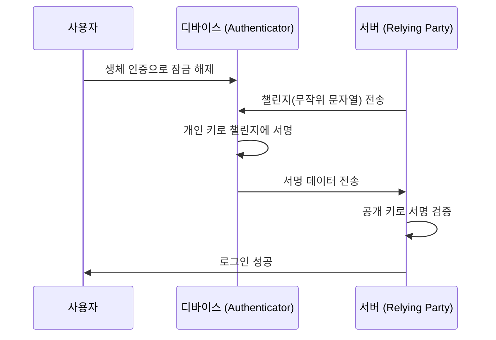

인터넷의 여명기부터 우리는 디지털 세계의 열쇠로서 '비밀번호'에 의존해 왔습니다. 하지만 비밀번호의 재사용, 추측하기 쉬운 문자열 선택, 그리고 무엇보다 피싱 사기로 인한 인증 정보의 유출은 현대 사이버 보안에서 가장 큰 취약점이 되었습니다.

이 문제를 근본적으로 해결하기 위해 등장한 것이 바로 '패스키(Passkeys)'입니다. 패스키는 FIDO(Fast IDentity Online) 얼라이언스와 W3C가 제정한 WebAuthn(Web Authentication) 표준을 기반으로 한, 비밀번호를 대체하는 새로운 인증 수단입니다.

본 문서에서는 패스키의 이면에 있는 기술적인 원리, 공개 키 암호화의 기초, 디바이스 바운드 패스키와 동기화 가능한 패스키의 차이점, 피싱 내성이 어떻게 구현되는지, 그리고 실제 코드 구현 예시까지 깊이 있게 파헤쳐 봅니다.

## 1. 패스키의 기초 기술: 공개 키 암호화와 WebAuthn

패스키의 안전성을 뒷받침하는 것은 '공개 키 암호화(Public Key Cryptography)'입니다. 기존의 비밀번호 인증에서는 클라이언트와 서버가 '동일한 비밀(비밀번호)'을 공유하고, 로그인 시 그 비밀을 전송하여 일치 여부를 확인합니다(대칭 인증, Symmetric authentication). 이 방식의 가장 큰 약점은 비밀이 네트워크를 통해 흐른다는 점, 그리고 서버 측에 비밀(또는 그 해시값)이 저장되기 때문에 서버가 해킹당할 경우 정보가 유출된다는 것입니다.

### 1.1 공개 키 암호화를 통한 비대칭 인증

패스키는 공개 키 암호화에 기반한 비대칭 인증(Asymmetric authentication)을 사용합니다. 패스키가 생성될 때 디바이스에서 다음 두 개의 키가 만들어집니다.

1. **개인 키(Private Key)**: 사용자의 디바이스의 안전한 영역(Secure Enclave나 TPM 등)에 엄격하게 보관되며, 결코 디바이스 외부로 나가지 않습니다.
2. **공개 키(Public Key)**: 서버(Relying Party)로 전송되어 계정과 연결되어 저장됩니다. 공개 키는 개인 키가 없으면 의미가 없으므로 유출되더라도 보안상의 위험은 없습니다.

로그인 시에는 서버에서 무작위 데이터(챌린지)가 전송됩니다. 사용자의 디바이스는 생체 인증(지문이나 얼굴 인식) 등을 통해 사용자를 검증한 후, 개인 키를 사용하여 이 챌린지에 서명(디지털 서명)을 수행합니다. 서버는 저장하고 있는 공개 키를 사용하여 이 서명을 검증하고, 올바르다면 로그인을 허용합니다.



### 1.2 WebAuthn API

이 프로세스를 웹 브라우저나 앱에서 원활하게 사용하기 위한 API가 'WebAuthn'입니다. WebAuthn은 JavaScript에서 호출할 수 있는 API로, 다음 두 가지 주요 함수를 제공합니다.

- `navigator.credentials.create()`: 새로운 패스키 등록 (공개 키 생성 및 서버로 전송)
- `navigator.credentials.get()`: 기존 패스키를 통한 인증 (챌린지 서명 및 서버로 전송)

이러한 API를 호출하면 OS 수준의 인증 대화 상자가 표시되며, 사용자는 지문 센서를 만지거나 얼굴 인식을 하는 것만으로 인증을 완료할 수 있습니다.

## 2. 피싱 내성 메커니즘

패스키의 가장 큰 특징 중 하나는 강력한 '피싱 내성(Phishing Resistance)'을 가지고 있다는 것입니다. 기존의 일회용 비밀번호(OTP)나 SMS를 통한 2단계 인증(2FA)은 사용자가 가짜 사이트에 속아 비밀번호와 OTP를 입력해 버리면 공격자에게 계정을 탈취당하게 됩니다(AiTM 공격 등).

하지만 패스키는 구조적으로 피싱을 무효화합니다.

### 2.1 오리진 바인딩(Origin Binding)

WebAuthn에서는 패스키가 특정 웹사이트의 도메인(Origin)에 암호학적으로 연결됩니다.

사용자가 `https://example.com` 에서 패스키를 생성했다고 가정해 봅시다. 이때 브라우저는 '이 패스키는 `example.com` 용이다'라는 정보를 연결하여 디바이스에 저장하고, 추가로 공개 키를 등록할 때 서버에 '이 공개 키는 `example.com` 용으로 만들어졌다'라는 증명을 보냅니다.

만약 사용자가 교묘한 피싱 사이트 `https://examp1e.com` 으로 유도되어 그곳에서 로그인하려고 시도한다면 어떻게 될까요?

1. 사이트가 `navigator.credentials.get()` 을 호출합니다.
2. 브라우저는 현재 오리진이 `examp1e.com` 임을 확인하고 디바이스 내부를 검색합니다.
3. `examp1e.com` 과 연결된 패스키는 존재하지 않으므로 브라우저는 인증 프로세스를 거부합니다.

사용자가 속았다고 하더라도, 브라우저와 OS가 도메인의 불일치를 감지하고 개인 키를 통한 서명을 절대 수행하지 않습니다. 이로 인해 피싱 공격은 기술적으로 불가능한 수준까지 방지할 수 있습니다.

### 2.2 챌린지 응답 인증

또한 서버에서 전송된 챌린지에 서명할 때, 그 서명 대상 데이터(ClientDataJSON)에는 챌린지 자체뿐만 아니라 호출한 측의 오리진(Origin)이나 크로스 오리진 상태 등이 포함됩니다.

서버 측에서 서명을 검증할 때 다음 사항을 확인합니다:
- 서명이 올바른지 (공개 키와 일치하는지)
- 서명된 오리진이 자사의 올바른 도메인(예: `https://example.com`)인지
- 챌린지가 직전에 발급한 것과 일치하는지

공격자가 중계 사이트(리버스 프록시)를 사용하여 챌린지를 중계하더라도 브라우저가 서명하는 오리진은 '사용자가 보고 있는 가짜 사이트의 도메인'이 되므로, 진짜 서버는 오리진의 불일치를 감지하여 인증을 거부합니다.

## 3. 디바이스 바운드 패스키 vs 동기화 가능 패스키

패스키는 크게 두 가지 종류로 나눌 수 있습니다. 각각의 특성을 이해하는 것은 보안 요구 사항에 맞는 구현을 진행하는 데 있어 중요합니다.

### 3.1 디바이스 바운드 패스키(Device-Bound Passkeys)

초기 FIDO 인증(FIDO UAF나 FIDO2/WebAuthn의 초기 단계)에서는 개인 키가 생성된 디바이스의 보안 엘리먼트에 완전히 고정(Bound)되어 있었습니다. YubiKey와 같은 하드웨어 보안 키가 그 대표적인 예입니다.

**장점:**
- 매우 높은 보안성: 물리적으로 디바이스를 도난당하지 않는 한 개인 키가 유출될 일은 없습니다.
- 기업용 요구 사항 부합: NIST SP 800-63B의 AAL3(Authenticator Assurance Level 3) 등 엄격한 보안 기준을 충족합니다.

**단점:**
- 분실 시의 위험: 디바이스를 분실하거나 고장 나면 개인 키는 영원히 손실됩니다. 여러 기기를 등록해 두는 등 백업 전략이 필요합니다.
- 낮은 편의성: 새로운 스마트폰으로 교체할 경우 모든 사이트에서 재등록이 필요합니다.

### 3.2 동기화 가능 패스키(Synced Passkeys / Multi-Device FIDO Credentials)

소비자 대상 보급을 목표로 도입된 것이 '동기화 가능 패스키'입니다. Apple(iCloud 키체인), Google(Google 비밀번호 관리자), Microsoft(Windows Hello), 그리고 1Password와 같은 비밀번호 관리자가 이 기능을 제공하고 있습니다.

동기화 가능 패스키에서는 개인 키가 종단 간 암호화(E2EE)된 후 클라우드를 통해 사용자의 다른 기기와 동기화됩니다.

**장점:**
- 압도적인 편의성: iPhone에서 생성한 패스키를 자동으로 iPad나 Mac에서도 사용할 수 있게 됩니다. 기기를 분실하더라도 클라우드에서 새로운 기기로 복원할 수 있습니다.
- 계정 복구 문제 해결: 디바이스 바운드 패스키의 가장 큰 과제였던 '기기 분실 시 계정 잠금(Lockout)' 문제를 대폭 줄여줍니다.

**단점:**
- 클라우드 제공자에 대한 의존성: 동기화 생태계(Apple이나 Google 등)의 보안 모델에 의존합니다. 생태계의 계정 자체(Apple ID나 Google 계정)가 탈취당할 경우 패스키도 위험에 노출됩니다.

FIDO Alliance는 편의성과 보안의 균형을 맞추기 위해 소비자용으로는 동기화 가능 패스키를 추진하면서도 높은 보안이 요구되는 기업이나 금융 기관용으로는 디바이스 바운드 패스키(하드웨어 키)를 지원하는 유연한 접근 방식을 채택하고 있습니다.

## 4. WebAuthn 구현 예시: 프론트엔드와 백엔드

실제로 웹사이트에 패스키를 구현할 경우 프론트엔드(JavaScript)와 백엔드(서버 측) 양쪽 모두에서 처리가 필요합니다. 여기서는 새로운 패스키를 등록(Registration)하는 기본적인 흐름과 코드 예시를 소개합니다.

### 4.1 등록 단계(Registration)

#### 1. 서버에서 챌린지 가져오기
프론트엔드에서 서버로 요청을 보내 등록용 옵션(챌린지, 사용자 정보 등)을 가져옵니다.

#### 2. 프론트엔드에서 `create()` 호출하기
서버에서 받은 옵션(`PublicKeyCredentialCreationOptions`)을 사용하여 브라우저의 WebAuthn API를 호출합니다.

```javascript
// 서버에서 가져온 옵션의 예 (일부 데이터는 ArrayBuffer로 변환이 필요)
const publicKeyCredentialCreationOptions = {
    challenge: Uint8Array.from("random_challenge_string_from_server", c => c.charCodeAt(0)),
    rp: {
        name: "My Awesome App",
        id: "example.com"
    },
    user: {
        id: Uint8Array.from("user_unique_id_12345", c => c.charCodeAt(0)),
        name: "user@example.com",
        displayName: "John Doe"
    },
    pubKeyCredParams: [
        { alg: -7, type: "public-key" }, // ES256
        { alg: -257, type: "public-key" } // RS256
    ],
    authenticatorSelection: {
        authenticatorAttachment: "platform", // "cross-platform" for security keys
        userVerification: "required" // 생체 인증 등 요구
    },
    timeout: 60000,
    attestation: "none" // 개인정보 보호를 위해 기본은 none
};

try {
    // 브라우저가 네이티브 인증 UI를 표시
    const credential = await navigator.credentials.create({
        publicKey: publicKeyCredentialCreationOptions
    });

    // 생성된 공개 키나 서명 데이터를 서버로 전송
    const attestationResponse = {
        id: credential.id,
        rawId: Array.from(new Uint8Array(credential.rawId)),
        type: credential.type,
        response: {
            clientDataJSON: Array.from(new Uint8Array(credential.response.clientDataJSON)),
            attestationObject: Array.from(new Uint8Array(credential.response.attestationObject))
        }
    };

    // fetch API 등으로 서버에 전송하여 검증 및 저장
    await fetch('/api/webauthn/register', {
        method: 'POST',
        headers: { 'Content-Type': 'application/json' },
        body: JSON.stringify(attestationResponse)
    });

} catch (err) {
    console.error("패스키 생성에 실패했습니다", err);
}
```

#### 3. 서버에서의 검증 및 저장
프론트엔드에서 전송된 데이터를 서버에서 검증합니다. 이 검증 프로세스는 복잡하기 때문에 일반적으로 각 언어의 WebAuthn 라이브러리(Node.js의 `@simplewebauthn/server`, Python의 `webauthn`, Go의 `go-webauthn` 등)를 사용합니다.

검증 항목:
- 챌린지가 일치하는지
- 오리진(Origin)과 RP ID가 일치하는지
- 사용자 인증(User Verification)이 성공했는지
- 서명이 올바른지

검증에 성공하면 `credential.id`(자격 증명 ID)와 공개 키(Public Key)를 데이터베이스의 사용자 레코드에 연결하여 저장합니다.

## 5. FIDO Alliance와 보급 현황

패스키의 기술 기반인 WebAuthn과 FIDO2는 FIDO Alliance와 W3C에 의해 제정되었습니다. FIDO Alliance에는 Apple, Google, Microsoft, Amazon, Meta 등 거대 테크 기업부터 금융 기관, 보안 업체까지 수백 개의 기업이 참여하고 있습니다.

최근 패스키의 보급은 빠르게 진행되고 있습니다.

1. **플랫폼 지원**: iOS/macOS, Android, Windows의 주요 OS가 OS 수준에서 패스키를 지원하게 되었습니다.
2. **대형 서비스의 도입**: Google 계정, Amazon, GitHub, Nintendo, X(구 Twitter), PayPal 등 수많은 글로벌 서비스가 패스키를 통한 로그인을 표준화하고 있습니다.
3. **교차 기기 인증 (Cross-Device Authentication, CDA)**: 스마트폰을 사용하여 컴퓨터 브라우저에 로그인하는 구조(CTAP2를 통한 Bluetooth/QR 코드 연동)도 마련되어, 서로 다른 기기 간의 원활한 인증 경험이 실현되고 있습니다.

## 6. 요약 및 향후 전망

패스키는 단순한 '비밀번호의 대체재'가 아니라 인터넷 인증 기반을 근본적으로 안전하게 만드는 혁명적인 기술입니다. 공개 키 암호화에 의한 수학적 증명, 도메인과의 암호학적 연결을 통한 피싱의 완벽한 무효화, 그리고 생체 인증을 통한 마찰 없는 사용자 경험. 이들이 결합됨으로써 보안과 편의성 간의 트레이드오프를 마침내 극복해 나가고 있습니다.

물론 동기화 제공업체의 종속(Lock-in) 문제나 기업에서의 관리 기법 확립 등 아직 해결해야 할 과제는 존재합니다. 하지만 업계 전체가 '비밀번호 없는 미래'를 향해 확실하게 발걸음을 내디디고 있으며, 패스키가 향후 표준적인 인증 수단이 될 것임은 틀림없습니다.

개발자로서는 기존의 비밀번호 인증에 더해 지금 바로 패스키(WebAuthn) 구현을 검토하기 시작해야 할 시기가 왔습니다. 사용자의 소중한 데이터를 보호하고 더 쾌적한 로그인 경험을 제공하기 위해 패스키 도입은 가장 효과적인 투자 중 하나가 될 것입니다.
