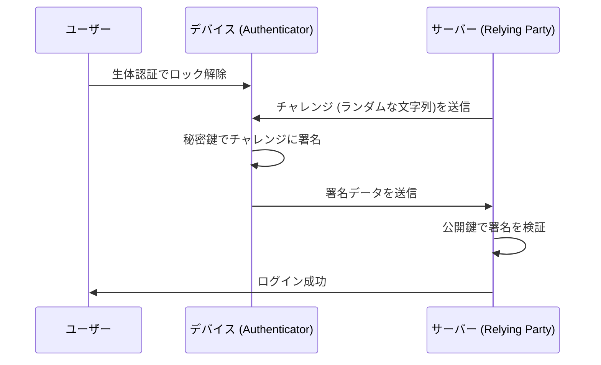

インターネットの黎明期から、私たちはデジタル世界の鍵として「パスワード」に依存してきました。しかし、パスワードの使い回し、推測しやすい文字列の選択、そして何よりフィッシング詐欺による認証情報の流出は、現代のサイバーセキュリティにおける最大の脆弱性となっています。

この問題を根本から解決するために登場したのが「パスキー（Passkeys）」です。パスキーは、FIDO（Fast IDentity Online）アライアンスとW3Cによって策定されたWebAuthn（Web Authentication）標準に基づいた、パスワードに代わる新しい認証手段です。

本記事では、パスキーの背後にある技術的な仕組み、公開鍵暗号の基礎、デバイスバウンドパスキーと同期可能パスキーの違い、フィッシング耐性がどのように実現されているのか、そして実際のコード実装例までを深く掘り下げて解説します。

## 1. パスキーの基礎技術：公開鍵暗号とWebAuthn

パスキーの安全性を支えているのは、「公開鍵暗号（Public Key Cryptography）」です。従来のパスワード認証では、クライアントとサーバーが「同じ秘密（パスワード）」を共有し、ログイン時にその秘密を送信して一致を確認します（Symmetric authentication）。この仕組みの最大の弱点は、秘密がネットワーク上を流れること、そしてサーバー側に秘密（またはそのハッシュ値）が保存されるため、サーバーが侵害された場合に情報が漏洩することです。

### 1.1 公開鍵暗号による非対称認証

パスキーは、公開鍵暗号に基づく非対称認証（Asymmetric authentication）を使用します。パスキーが生成されるとき、デバイス上で以下の2つの鍵が作成されます。

1. **秘密鍵（Private Key）**: ユーザーのデバイスのセキュアな領域（Secure EnclaveやTPMなど）に厳重に保管され、決してデバイスの外部に出ることはありません。
2. **公開鍵（Public Key）**: サーバー（Relying Party）に送信され、アカウントに紐付けて保存されます。公開鍵は秘密鍵がないと意味をなさないため、漏洩してもセキュリティ上のリスクはありません。

ログイン時には、サーバーからランダムなデータ（チャレンジ）が送信されます。ユーザーのデバイスは生体認証（指紋や顔認証）などでユーザーを検証した後、秘密鍵を使ってこのチャレンジに署名（デジタル署名）を行います。サーバーは保存している公開鍵を使ってこの署名を検証し、正しければログインを許可します。



### 1.2 WebAuthn API

このプロセスをWebブラウザやアプリからシームレスに利用するためのAPIが「WebAuthn」です。WebAuthnは、JavaScriptから呼び出すことができるAPIで、以下の2つの主要な関数を提供します。

- `navigator.credentials.create()`: 新しいパスキーの登録（公開鍵の生成とサーバーへの送信）
- `navigator.credentials.get()`: 既存のパスキーによる認証（チャレンジへの署名とサーバーへの送信）

これらのAPIを呼び出すと、OSレベルの認証ダイアログが表示され、ユーザーは指紋センサーに触れたり、顔認証を行ったりするだけで認証が完了します。

## 2. フィッシング耐性のメカニズム

パスキーの最大の特徴の1つは、強力な「フィッシング耐性（Phishing Resistance）」を持っていることです。従来のワンタイムパスワード（OTP）やSMSによる二段階認証（2FA）は、ユーザーが偽のサイトに騙されてパスワードとOTPを入力してしまえば、攻撃者にアカウントを乗っ取られてしまいます（AiTM攻撃など）。

しかし、パスキーは構造的にフィッシングを無効化します。

### 2.1 オリジン・バインディング（Origin Binding）

WebAuthnでは、パスキーが特定のウェブサイトのドメイン（Origin）に暗号学的に結び付けられます。

ユーザーが `https://example.com` でパスキーを作成したとします。このとき、ブラウザは「このパスキーは `example.com` 用である」という情報を紐付けてデバイスに保存し、さらに公開鍵の登録時にサーバーへ「この公開鍵は `example.com` 用に作られた」という証明を送ります。

もしユーザーが巧妙なフィッシングサイト `https://examp1e.com` に誘導され、そこでログインしようとした場合、どうなるでしょうか。

1. サイトが `navigator.credentials.get()` を呼び出します。
2. ブラウザは現在のオリジンが `examp1e.com` であることを確認し、デバイス内を検索します。
3. `examp1e.com` に紐づくパスキーは存在しないため、ブラウザは認証プロセスを拒否します。

ユーザーが騙されていたとしても、ブラウザとOSがドメインの不一致を検知し、秘密鍵による署名を絶対に行いません。これにより、フィッシング攻撃は技術的に不可能なレベルまで防ぐことができます。

### 2.2 チャレンジ・レスポンス認証

さらに、サーバーから送られてくるチャレンジに署名する際、その署名対象のデータ（ClientDataJSON）には、チャレンジ自体に加えて、呼び出し元のオリジン（Origin）やクロスオリジン状態などが含まれます。

サーバー側で署名を検証する際、以下を確認します：
- 署名が正しいか（公開鍵と一致するか）
- 署名されたオリジンが自社の正しいドメイン（例：`https://example.com`）か
- チャレンジが直前に発行したものと一致するか

攻撃者が中継サイト（リバースプロキシ）を用いてチャレンジを中継したとしても、ブラウザが署名するオリジンは「ユーザーが見ている偽サイトのドメイン」になるため、本物のサーバーはオリジンの不一致を検知して認証を拒否します。

## 3. デバイスバウンドパスキー vs 同期可能パスキー

パスキーには大きく分けて2つの種類が存在します。それぞれの特性を理解することは、セキュリティ要件に応じた実装を行う上で重要です。

### 3.1 デバイスバウンドパスキー（Device-Bound Passkeys）

初期のFIDO認証（FIDO UAFやFIDO2/WebAuthnの初期段階）では、秘密鍵は生成されたデバイスのセキュアエレメントに完全に固定（Bound）されていました。YubiKeyなどのハードウェアセキュリティキーがその代表例です。

**メリット:**
- 極めて高いセキュリティ: 物理的にデバイスを盗まれない限り、秘密鍵が流出することはありません。
- 企業向け要件への適合: NIST SP 800-63BのAAL3（Authenticator Assurance Level 3）などの厳格なセキュリティ基準を満たします。

**デメリット:**
- 紛失時のリスク: デバイスを紛失したり壊したりすると、秘密鍵は永遠に失われます。複数のデバイスを登録しておくなどのバックアップ戦略が必要です。
- 利便性の低さ: 新しいスマートフォンに買い替えた場合、すべてのサイトで再登録が必要になります。

### 3.2 同期可能パスキー（Synced Passkeys / Multi-Device FIDO Credentials）

コンシューマー向けの普及を目指して導入されたのが「同期可能パスキー」です。Apple（iCloudキーチェーン）、Google（Googleパスワードマネージャー）、Microsoft（Windows Hello）、そして1Passwordなどのパスワードマネージャーがこの機能を提供しています。

同期可能パスキーでは、秘密鍵はエンドツーエンド暗号化（E2EE）された上で、クラウドを介してユーザーの他のデバイスと同期されます。

**メリット:**
- 圧倒的な利便性: iPhoneで作成したパスキーが、自動的にiPadやMacでも使えるようになります。デバイスを紛失しても、クラウドから新しいデバイスに復元可能です。
- アカウント復旧問題の解決: デバイスバウンドパスキーの最大の課題であった「デバイス紛失時のアカウント締め出し（Lockout）」を大幅に軽減します。

**デメリット:**
- クラウドプロバイダーへの依存: 同期エコシステム（AppleやGoogleなど）のセキュリティモデルに依存します。エコシステムのアカウント自体（Apple IDやGoogleアカウント）が乗っ取られた場合、パスキーも危険に晒されます。

FIDO Allianceは、利便性とセキュリティのバランスを取るため、コンシューマー向けには同期可能パスキーを推進しつつ、高いセキュリティが求められるエンタープライズや金融機関向けにはデバイスバウンドパスキー（ハードウェアキー）をサポートする柔軟なアプローチを採用しています。

## 4. WebAuthnの実装例：フロントエンドとバックエンド

実際にウェブサイトにパスキーを実装する場合、フロントエンド（JavaScript）とバックエンド（サーバー側）の両方で処理が必要です。ここでは、新しいパスキーを登録（Registration）する基本的なフローとコード例を紹介します。

### 4.1 登録フェーズ（Registration）

#### 1. サーバーからチャレンジを取得
フロントエンドからサーバーにリクエストを送り、登録用のオプション（チャレンジ、ユーザー情報など）を取得します。

#### 2. フロントエンドで `create()` を呼び出す
サーバーから受け取ったオプション（`PublicKeyCredentialCreationOptions`）を使用して、ブラウザのWebAuthn APIを呼び出します。

```javascript
// サーバーから取得したオプションの例（一部のデータはArrayBufferに変換が必要）
const publicKeyCredentialCreationOptions = {
    challenge: Uint8Array.from("random_challenge_string_from_server", c => c.charCodeAt(0)),
    rp: {
        name: "My Awesome App",
        id: "example.com"
    },
    user: {
        id: Uint8Array.from("user_unique_id_12345", c => c.charCodeAt(0)),
        name: "user@example.com",
        displayName: "John Doe"
    },
    pubKeyCredParams: [
        { alg: -7, type: "public-key" }, // ES256
        { alg: -257, type: "public-key" } // RS256
    ],
    authenticatorSelection: {
        authenticatorAttachment: "platform", // "cross-platform" for security keys
        userVerification: "required" // 生体認証などを要求
    },
    timeout: 60000,
    attestation: "none" // プライバシー保護のため基本はnone
};

try {
    // ブラウザがネイティブの認証UIを表示
    const credential = await navigator.credentials.create({
        publicKey: publicKeyCredentialCreationOptions
    });

    // 生成された公開鍵や署名データをサーバーに送信
    const attestationResponse = {
        id: credential.id,
        rawId: Array.from(new Uint8Array(credential.rawId)),
        type: credential.type,
        response: {
            clientDataJSON: Array.from(new Uint8Array(credential.response.clientDataJSON)),
            attestationObject: Array.from(new Uint8Array(credential.response.attestationObject))
        }
    };

    // fetch APIなどでサーバーに送信して検証・保存
    await fetch('/api/webauthn/register', {
        method: 'POST',
        headers: { 'Content-Type': 'application/json' },
        body: JSON.stringify(attestationResponse)
    });

} catch (err) {
    console.error("パスキーの作成に失敗しました", err);
}
```

#### 3. サーバーでの検証と保存
フロントエンドから送信されたデータをサーバーで検証します。この検証プロセスは複雑なため、通常は各言語のWebAuthnライブラリ（Node.jsの `@simplewebauthn/server`、Pythonの `webauthn`、Goの `go-webauthn` など）を使用します。

検証項目：
- チャレンジが一致しているか
- オリジン（Origin）とRP IDが一致しているか
- ユーザー認証（User Verification）が成功しているか
- 署名が正しいか

検証に成功したら、`credential.id`（クレデンシャルID）と公開鍵（Public Key）をデータベースのユーザーレコードに紐付けて保存します。

## 5. FIDO Allianceと普及状況

パスキーの技術基盤であるWebAuthnとFIDO2は、FIDO AllianceとW3Cによって策定されました。FIDO Allianceには、Apple、Google、Microsoft、Amazon、Metaなどの巨大テック企業から、金融機関、セキュリティベンダーまで、数百の企業が参加しています。

近年、パスキーの普及は急速に進んでいます。

1. **プラットフォームの対応**: iOS/macOS、Android、Windowsの主要OSがOSレベルでパスキーをサポートしました。
2. **大手サービスでの導入**: Googleアカウント、Amazon、GitHub、Nintendo、X（旧Twitter）、PayPalなど、数多くのグローバルサービスがパスキーによるログインを標準化しつつあります。
3. **Cross-Device Authentication (CDA)**: スマートフォンを使ってパソコンのブラウザにログインする仕組み（CTAP2によるBluetooth/QRコード連携）も整備され、異なるデバイス間でのシームレスな認証体験が実現しています。

## 6. まとめと今後の展望

パスキーは、単なる「パスワードの代替」ではなく、インターネットの認証基盤を根底からセキュアにする革命的な技術です。公開鍵暗号による数学的な証明、ドメインとの暗号学的な紐付けによるフィッシングの完全な無効化、そして生体認証による摩擦のないユーザー体験。これらが組み合わさることで、セキュリティと利便性のトレードオフをついに克服しつつあります。

もちろん、同期プロバイダーのロックイン問題や、エンタープライズにおける管理手法の確立など、まだ解決すべき課題は存在します。しかし、業界全体が「パスワードのない未来」に向けて確実に歩みを進めており、パスキーが今後の標準的な認証手段になることは間違いありません。

開発者としては、既存のパスワード認証に加えて、今すぐパスキー（WebAuthn）の実装を検討し始めるべき時期に来ています。ユーザーの大切なデータを守り、より快適なログイン体験を提供するために、パスキーの導入は最も効果的な投資の1つとなるでしょう。
