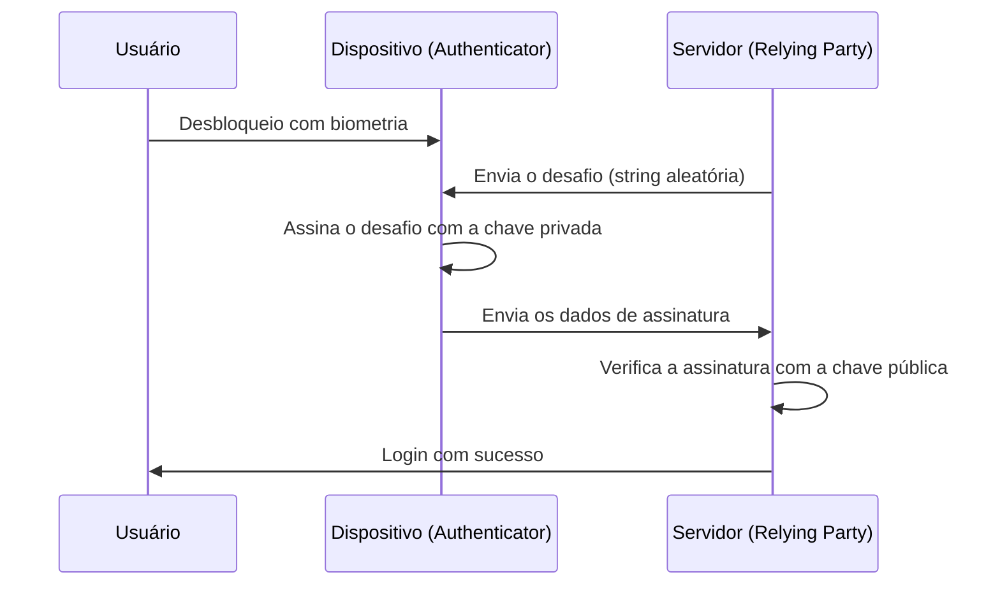

Desde os primórdios da internet, dependemos de "senhas" como chaves para o mundo digital. No entanto, a reutilização de senhas, a escolha de sequências fáceis de adivinhar e, acima de tudo, o vazamento de credenciais por meio de golpes de phishing tornaram-se a maior vulnerabilidade da segurança cibernética moderna.

As "passkeys" (chaves de acesso) surgiram para resolver esse problema pela raiz. As passkeys são um novo método de autenticação que substitui as senhas, com base no padrão WebAuthn (Web Authentication) estabelecido pela FIDO (Fast IDentity Online) Alliance e pelo W3C.

Neste artigo, exploraremos a fundo os mecanismos técnicos por trás das passkeys, os fundamentos da criptografia de chave pública, a diferença entre passkeys vinculadas a dispositivos e passkeys sincronizáveis, como a resistência a phishing é alcançada e exemplos reais de implementação de código.

## 1. A tecnologia fundamental das passkeys: Criptografia de Chave Pública e WebAuthn

A segurança das passkeys é sustentada pela "Criptografia de Chave Pública" (Public Key Cryptography). Na autenticação tradicional por senha, o cliente e o servidor compartilham o "mesmo segredo" (a senha), e esse segredo é enviado durante o login para confirmar a correspondência (Autenticação simétrica). A maior fraqueza desse mecanismo é que o segredo viaja pela rede e, como o segredo (ou seu valor de hash) é armazenado no servidor, a informação pode vazar se o servidor for comprometido.

### 1.1 Autenticação assimétrica usando Criptografia de Chave Pública

As passkeys usam autenticação assimétrica (Asymmetric authentication) baseada em criptografia de chave pública. Quando uma passkey é gerada, as duas chaves a seguir são criadas no dispositivo:

1. **Chave Privada (Private Key)**: Armazenada estritamente em uma área segura do dispositivo do usuário (como Secure Enclave ou TPM) e nunca sai do dispositivo.
2. **Chave Pública (Public Key)**: Enviada para o servidor (Relying Party) e salva vinculada à conta. Como a chave pública não faz sentido sem a chave privada, não há risco de segurança mesmo se ela vazar.

Durante o login, o servidor envia dados aleatórios (um desafio). O dispositivo do usuário, após verificar o usuário com biometria (impressão digital ou reconhecimento facial), usa a chave privada para assinar esse desafio (assinatura digital). O servidor usa a chave pública armazenada para verificar essa assinatura e, se estiver correta, permite o login.



### 1.2 API WebAuthn

A "WebAuthn" é uma API para usar perfeitamente esse processo de navegadores ou aplicativos da web. A WebAuthn é uma API que pode ser chamada a partir do JavaScript e fornece as duas principais funções a seguir:

- `navigator.credentials.create()`: Registro de uma nova passkey (geração de chave pública e envio para o servidor)
- `navigator.credentials.get()`: Autenticação com uma passkey existente (assinatura do desafio e envio para o servidor)

Ao chamar essas APIs, uma caixa de diálogo de autenticação em nível de sistema operacional (OS) é exibida, e a autenticação é concluída simplesmente tocando no sensor de impressão digital ou realizando o reconhecimento facial pelo usuário.

## 2. O mecanismo de resistência a phishing

Uma das maiores características das passkeys é que elas possuem forte "Resistência a Phishing" (Phishing Resistance). Com senhas de uso único (OTP) e autenticação de dois fatores (2FA) por SMS tradicionais, se os usuários forem enganados por sites falsos e inserirem suas senhas e OTPs, os invasores poderão sequestrar suas contas (como em ataques AiTM).

No entanto, as passkeys invalidam o phishing estruturalmente.

### 2.1 Vinculação de Origem (Origin Binding)

Na WebAuthn, uma passkey é criptograficamente vinculada ao domínio de um site específico (Origin).

Suponha que um usuário crie uma passkey em `https://example.com`. Nesse momento, o navegador associa a informação "esta passkey é para `example.com`" e a salva no dispositivo e, ao registrar a chave pública, envia ao servidor uma prova de que "esta chave pública foi criada para `example.com`".

O que acontece se o usuário for direcionado para um site de phishing inteligente, `https://examp1e.com`, e tentar fazer login lá?

1. O site chama `navigator.credentials.get()`.
2. O navegador confirma que a origem atual é `examp1e.com` e pesquisa no dispositivo.
3. Como não há passkey associada a `examp1e.com`, o navegador rejeita o processo de autenticação.

Mesmo que o usuário tenha sido enganado, o navegador e o sistema operacional detectam a incompatibilidade de domínio e absolutamente nunca farão uma assinatura com a chave privada. Como resultado, os ataques de phishing podem ser evitados em um nível tecnicamente impossível de contornar.

### 2.2 Autenticação Desafio-Resposta (Challenge-Response)

Além disso, ao assinar o desafio enviado pelo servidor, os dados a serem assinados (ClientDataJSON) incluem o próprio desafio, juntamente com a origem chamadora (Origin) e o estado de origem cruzada.

Ao verificar a assinatura no lado do servidor, o seguinte é verificado:
- A assinatura está correta (corresponde à chave pública)?
- A origem assinada é o domínio correto da empresa (por exemplo, `https://example.com`)?
- O desafio corresponde ao emitido imediatamente antes?

Mesmo que um invasor retransmita o desafio usando um site intermediário (proxy reverso), a origem assinada pelo navegador será "o domínio do site falso que o usuário está visualizando", de modo que o servidor real detectará a incompatibilidade de origem e rejeitará a autenticação.

## 3. Passkeys Vinculadas a Dispositivos vs Passkeys Sincronizáveis

As passkeys podem ser divididas em dois tipos principais. Compreender as características de cada um é importante ao implementar de acordo com os requisitos de segurança.

### 3.1 Passkeys Vinculadas a Dispositivos (Device-Bound Passkeys)

Nas primeiras autenticações FIDO (estágios iniciais de FIDO UAF e FIDO2/WebAuthn), a chave privada estava completamente vinculada (Bound) ao elemento seguro do dispositivo onde foi gerada. Chaves de segurança de hardware como a YubiKey são exemplos típicos.

**Vantagens:**
- Segurança extremamente alta: A menos que o dispositivo seja fisicamente roubado, a chave privada nunca vazará.
- Conformidade com os requisitos corporativos: Atende a rigorosos padrões de segurança, como AAL3 (Authenticator Assurance Level 3) do NIST SP 800-63B.

**Desvantagens:**
- Risco de perda: Se o dispositivo for perdido ou quebrado, a chave privada será perdida para sempre. É necessária uma estratégia de backup, como registrar vários dispositivos.
- Baixa conveniência: Se você comprar um novo smartphone, precisará se registrar novamente em todos os sites.

### 3.2 Passkeys Sincronizáveis (Synced Passkeys / Multi-Device FIDO Credentials)

As "passkeys sincronizáveis" foram introduzidas visando a disseminação para os consumidores. Gerenciadores de senhas como Apple (Chaves do iCloud), Google (Gerenciador de senhas do Google), Microsoft (Windows Hello) e 1Password oferecem esse recurso.

Nas passkeys sincronizáveis, a chave privada é criptografada de ponta a ponta (E2EE) e sincronizada com os outros dispositivos do usuário através da nuvem.

**Vantagens:**
- Conveniência esmagadora: Uma passkey criada em um iPhone poderá ser usada automaticamente em um iPad ou Mac. Mesmo que o dispositivo seja perdido, ele pode ser restaurado para um novo dispositivo a partir da nuvem.
- Resolução de problemas de recuperação de conta: Reduz significativamente o maior desafio das passkeys vinculadas a dispositivos, que é "o bloqueio da conta (Lockout) quando o dispositivo é perdido".

**Desvantagens:**
- Dependência de provedores de nuvem: Depende do modelo de segurança do ecossistema de sincronização (Apple, Google, etc.). Se a própria conta do ecossistema (Apple ID ou conta do Google) for invadida, as passkeys também estarão em risco.

A FIDO Alliance adota uma abordagem flexível para equilibrar conveniência e segurança, promovendo passkeys sincronizáveis para os consumidores e suportando passkeys vinculadas a dispositivos (chaves de hardware) para empresas e instituições financeiras que exigem alta segurança.

## 4. Exemplo de implementação do WebAuthn: Frontend e Backend

Quando você realmente implementa passkeys em um site, é necessário processamento tanto no frontend (JavaScript) quanto no backend (lado do servidor). Aqui, apresentamos o fluxo básico e exemplos de código para registrar uma nova passkey (Registration).

### 4.1 Fase de Registro (Registration)

#### 1. Obter um desafio do servidor
Envie uma solicitação do frontend para o servidor para obter as opções de registro (desafio, informações do usuário, etc.).

#### 2. Chamar `create()` no frontend
Use as opções recebidas do servidor (`PublicKeyCredentialCreationOptions`) para chamar a API WebAuthn do navegador.

```javascript
// Exemplo de opções obtidas do servidor (alguns dados precisam ser convertidos para ArrayBuffer)
const publicKeyCredentialCreationOptions = {
    challenge: Uint8Array.from("random_challenge_string_from_server", c => c.charCodeAt(0)),
    rp: {
        name: "My Awesome App",
        id: "example.com"
    },
    user: {
        id: Uint8Array.from("user_unique_id_12345", c => c.charCodeAt(0)),
        name: "user@example.com",
        displayName: "John Doe"
    },
    pubKeyCredParams: [
        { alg: -7, type: "public-key" }, // ES256
        { alg: -257, type: "public-key" } // RS256
    ],
    authenticatorSelection: {
        authenticatorAttachment: "platform", // "cross-platform" para chaves de segurança
        userVerification: "required" // Requer autenticação biométrica, etc.
    },
    timeout: 60000,
    attestation: "none" // Basicamente none para proteção de privacidade
};

try {
    // O navegador exibe a IU de autenticação nativa
    const credential = await navigator.credentials.create({
        publicKey: publicKeyCredentialCreationOptions
    });

    // Envia a chave pública gerada e os dados de assinatura para o servidor
    const attestationResponse = {
        id: credential.id,
        rawId: Array.from(new Uint8Array(credential.rawId)),
        type: credential.type,
        response: {
            clientDataJSON: Array.from(new Uint8Array(credential.response.clientDataJSON)),
            attestationObject: Array.from(new Uint8Array(credential.response.attestationObject))
        }
    };

    // Envia para o servidor para verificação e salvamento via API fetch, etc.
    await fetch('/api/webauthn/register', {
        method: 'POST',
        headers: { 'Content-Type': 'application/json' },
        body: JSON.stringify(attestationResponse)
    });

} catch (err) {
    console.error("Falha ao criar a passkey", err);
}
```

#### 3. Verificação e salvamento no servidor
Os dados enviados do frontend são verificados no servidor. Como esse processo de verificação é complexo, normalmente são usadas bibliotecas WebAuthn para cada idioma (`@simplewebauthn/server` para Node.js, `webauthn` para Python, `go-webauthn` para Go, etc.).

Itens de verificação:
- O desafio corresponde?
- A origem (Origin) e o ID RP correspondem?
- A autenticação do usuário (User Verification) foi bem-sucedida?
- A assinatura está correta?

Se a verificação for bem-sucedida, vincule e salve `credential.id` (ID da credencial) e a chave pública (Public Key) no registro do usuário no banco de dados.

## 5. FIDO Alliance e situação de adoção

WebAuthn e FIDO2, a base tecnológica das passkeys, foram estabelecidos pela FIDO Alliance e pelo W3C. A FIDO Alliance conta com a participação de centenas de empresas, desde gigantes da tecnologia como Apple, Google, Microsoft, Amazon e Meta até instituições financeiras e fornecedores de segurança.

Nos últimos anos, a adoção de passkeys tem avançado rapidamente.

1. **Suporte de plataforma**: Os principais sistemas operacionais como iOS/macOS, Android e Windows ofereceram suporte a passkeys no nível do sistema operacional.
2. **Adoção em grandes serviços**: Inúmeros serviços globais, como contas do Google, Amazon, GitHub, Nintendo, X (anteriormente Twitter) e PayPal, estão padronizando o login por passkey.
3. **Autenticação entre dispositivos (Cross-Device Authentication - CDA)**: O mecanismo para fazer login em um navegador de PC usando um smartphone (vinculação Bluetooth/QR code via CTAP2) também foi desenvolvido, alcançando uma experiência de autenticação perfeita entre diferentes dispositivos.

## 6. Conclusão e perspectivas futuras

As passkeys não são apenas um "substituto para senhas", mas uma tecnologia revolucionária que protege fundamentalmente a infraestrutura de autenticação da Internet. Prova matemática por criptografia de chave pública, invalidação completa do phishing por vinculação criptográfica ao domínio e uma experiência de usuário sem atrito através da biometria. Ao combinar esses elementos, o compromisso entre segurança e conveniência está finalmente sendo superado.

Obviamente, ainda existem desafios a serem resolvidos, como o problema de lock-in com os provedores de sincronização e o estabelecimento de métodos de gerenciamento corporativo. No entanto, o setor como um todo está definitivamente avançando em direção a um "futuro sem senhas", e não há dúvida de que as passkeys se tornarão o método de autenticação padrão no futuro.

Como desenvolvedor, agora é a hora de começar a considerar a implementação de passkeys (WebAuthn), além da autenticação de senha existente. Para proteger os dados valiosos dos usuários e fornecer uma experiência de login mais confortável, a introdução de passkeys será um dos investimentos mais eficazes.
