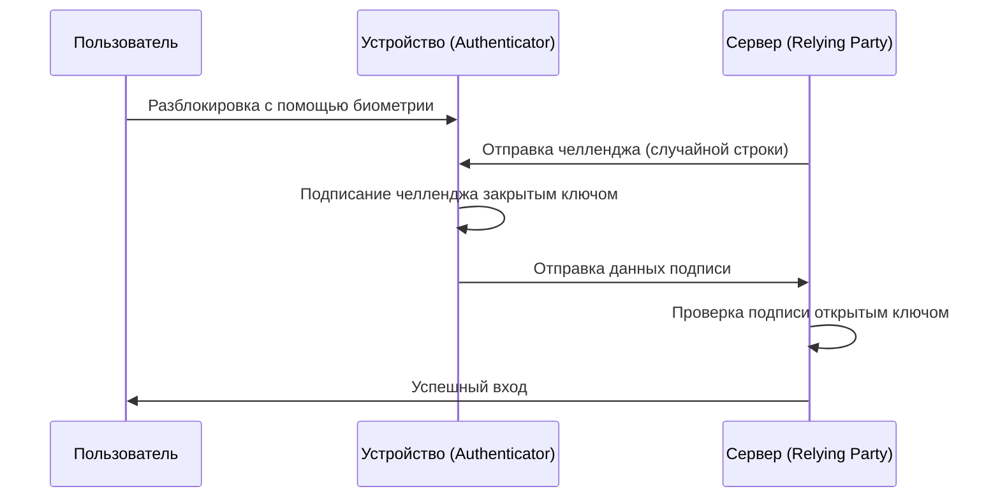

С самого зарождения интернета мы полагались на «пароли» как на ключи от нашего цифрового мира. Однако повторное использование паролей, выбор легко угадываемых строк и, прежде всего, утечка учетных данных из-за фишинга стали самыми большими уязвимостями в современной кибербезопасности.

Для решения этой проблемы в корне и появились «ключи доступа» (Passkeys). Passkeys — это новый метод аутентификации, который заменяет пароли. Он основан на стандарте WebAuthn (Web Authentication), разработанном альянсом FIDO (Fast IDentity Online) и W3C.

В этой статье мы подробно рассмотрим технические механизмы, лежащие в основе ключей доступа (Passkeys), основы криптографии с открытым ключом, разницу между ключами, привязанными к устройству, и синхронизируемыми ключами, способы обеспечения устойчивости к фишингу, а также приведем примеры реализации в коде.

## 1. Базовая технология Passkeys: криптография с открытым ключом и WebAuthn

Безопасность ключей доступа обеспечивается «криптографией с открытым ключом» (Public Key Cryptography). При традиционной аутентификации по паролю клиент и сервер используют «один и тот же секрет (пароль)», который передается во время входа в систему для проверки совпадения (симметричная аутентификация). Самая большая слабость этой системы заключается в том, что секрет передается по сети, а также сохраняется на стороне сервера (или в виде его хэша), поэтому при взломе сервера происходит утечка информации.

### 1.1 Асимметричная аутентификация с помощью криптографии с открытым ключом

Ключи доступа (Passkeys) используют асимметричную аутентификацию (Asymmetric authentication), основанную на криптографии с открытым ключом. При генерации ключа доступа на устройстве создаются два следующих ключа:

1. **Закрытый ключ (Private Key)**: Надежно хранится в защищенной области устройства пользователя (например, Secure Enclave или TPM) и никогда не покидает его.
2. **Открытый ключ (Public Key)**: Отправляется на сервер (Relying Party) и сохраняется с привязкой к учетной записи. Поскольку открытый ключ бесполезен без закрытого, его утечка не представляет угрозы для безопасности.

При входе в систему сервер отправляет случайные данные (челлендж). Устройство пользователя после проверки пользователя с помощью биометрии (отпечатка пальца или распознавания лица) подписывает этот челлендж с помощью закрытого ключа (цифровая подпись). Сервер проверяет эту подпись с помощью сохраненного открытого ключа, и если она верна, разрешает вход.



### 1.2 WebAuthn API

API, позволяющий беспрепятственно использовать этот процесс из веб-браузеров и приложений, называется «WebAuthn». WebAuthn — это API, который можно вызывать из JavaScript, и он предоставляет две основные функции:

- `navigator.credentials.create()`: Регистрация нового ключа доступа (генерация открытого ключа и отправка его на сервер)
- `navigator.credentials.get()`: Аутентификация с помощью существующего ключа доступа (подписание челленджа и отправка его на сервер)

При вызове этих API отображается диалоговое окно аутентификации на уровне ОС, и пользователю достаточно прикоснуться к датчику отпечатков пальцев или выполнить распознавание лица для завершения аутентификации.

## 2. Механизм устойчивости к фишингу

Одной из главных особенностей ключей доступа является их мощная «устойчивость к фишингу» (Phishing Resistance). При использовании традиционных одноразовых паролей (OTP) и двухфакторной аутентификации (2FA) по SMS, если пользователь обманут поддельным сайтом и введет свой пароль и OTP, злоумышленники могут перехватить его учетную запись (например, с помощью атаки AiTM).

Однако ключи доступа структурно делают фишинг невозможным.

### 2.1 Привязка к источнику (Origin Binding)

В WebAuthn ключ доступа криптографически привязывается к домену определенного веб-сайта (Origin).

Предположим, пользователь создает ключ доступа на сайте `https://example.com`. При этом браузер сохраняет на устройстве информацию о том, что «этот ключ доступа предназначен для `example.com`», а при регистрации открытого ключа отправляет на сервер доказательство, что «этот открытый ключ был создан для `example.com`».

Что произойдет, если пользователь будет перенаправлен на хитрый фишинговый сайт `https://examp1e.com` и попытается войти туда?

1. Сайт вызывает `navigator.credentials.get()`.
2. Браузер проверяет, что текущий источник — `examp1e.com`, и ищет в устройстве.
3. Поскольку ключа доступа, привязанного к `examp1e.com`, не существует, браузер отклоняет процесс аутентификации.

Даже если пользователь обманут, браузер и ОС обнаружат несоответствие доменов и никогда не выполнят подписание закрытым ключом. Это позволяет предотвратить фишинговые атаки на технически невозможном уровне.

### 2.2 Аутентификация «вызов-ответ» (Challenge-Response)

Кроме того, при подписании челленджа, отправленного сервером, данные для подписи (ClientDataJSON) включают в себя не только сам челлендж, но и вызывающий источник (Origin), статус cross-origin и т. д.

При проверке подписи на стороне сервера проверяется следующее:
- Верна ли подпись (соответствует ли она открытому ключу)
- Является ли подписанный источник правильным доменом компании (например, `https://example.com`)
- Совпадает ли челлендж с тем, который был выпущен непосредственно перед этим

Даже если злоумышленник ретранслирует челлендж с помощью промежуточного сайта (обратного прокси), источником, который подписывает браузер, будет «домен поддельного сайта, который видит пользователь», поэтому настоящий сервер обнаружит несоответствие источника и отклонит аутентификацию.

## 3. Ключи доступа, привязанные к устройству, и синхронизируемые ключи доступа

Ключи доступа (Passkeys) можно разделить на два основных типа. Понимание характеристик каждого из них важно для реализации, соответствующей требованиям безопасности.

### 3.1 Ключи доступа, привязанные к устройству (Device-Bound Passkeys)

На ранних этапах аутентификации FIDO (FIDO UAF и ранние стадии FIDO2/WebAuthn) закрытый ключ был полностью привязан (Bound) к Secure Element устройства, на котором он был сгенерирован. Аппаратные ключи безопасности, такие как YubiKey, являются типичным примером.

**Преимущества:**
- Чрезвычайно высокая безопасность: если устройство не будет физически украдено, утечка закрытого ключа невозможна.
- Соответствие корпоративным требованиям: соответствует строгим стандартам безопасности, таким как AAL3 (Authenticator Assurance Level 3) в NIST SP 800-63B.

**Недостатки:**
- Риск потери: в случае потери или поломки устройства закрытый ключ теряется навсегда. Необходима стратегия резервного копирования, например регистрация нескольких устройств.
- Низкое удобство: при покупке нового смартфона потребуется повторная регистрация на всех сайтах.

### 3.2 Синхронизируемые ключи доступа (Synced Passkeys / Multi-Device FIDO Credentials)

Для массового потребителя были внедрены «синхронизируемые ключи доступа». Эту функцию предоставляют такие сервисы, как Apple (Связка ключей iCloud), Google (Менеджер паролей Google), Microsoft (Windows Hello) и менеджеры паролей, такие как 1Password.

В синхронизируемых ключах закрытый ключ подвергается сквозному шифрованию (E2EE) и синхронизируется с другими устройствами пользователя через облако.

**Преимущества:**
- Огромное удобство: ключ доступа, созданный на iPhone, автоматически становится доступным на iPad и Mac. Если устройство потеряно, его можно восстановить на новом устройстве из облака.
- Решение проблемы восстановления учетной записи: значительно снижается вероятность «блокировки учетной записи при потере устройства (Lockout)», что было главной проблемой привязанных к устройству ключей.

**Недостатки:**
- Зависимость от облачного провайдера: зависит от модели безопасности экосистемы синхронизации (Apple, Google и т. д.). Если сама учетная запись экосистемы (Apple ID или учетная запись Google) будет взломана, ключи доступа также окажутся под угрозой.

Чтобы сбалансировать удобство и безопасность, альянс FIDO продвигает синхронизируемые ключи доступа для потребителей, одновременно поддерживая гибкий подход, позволяющий использовать привязанные к устройству ключи (аппаратные ключи) для корпоративных и финансовых учреждений, где требуется высокая безопасность.

## 4. Пример реализации WebAuthn: фронтенд и бэкенд

При фактической реализации ключей доступа на веб-сайте требуется обработка как на стороне фронтенда (JavaScript), так и на стороне бэкенда (сервера). Здесь мы представим базовый процесс и примеры кода для регистрации нового ключа доступа (Registration).

### 4.1 Фаза регистрации (Registration)

#### 1. Получение челленджа от сервера
Отправка запроса от фронтенда к серверу для получения параметров регистрации (челлендж, информация о пользователе и т. д.).

#### 2. Вызов `create()` во фронтенде
Вызов WebAuthn API браузера с использованием параметров (`PublicKeyCredentialCreationOptions`), полученных от сервера.

```javascript
// Пример параметров, полученных от сервера (некоторые данные необходимо преобразовать в ArrayBuffer)
const publicKeyCredentialCreationOptions = {
    challenge: Uint8Array.from("random_challenge_string_from_server", c => c.charCodeAt(0)),
    rp: {
        name: "My Awesome App",
        id: "example.com"
    },
    user: {
        id: Uint8Array.from("user_unique_id_12345", c => c.charCodeAt(0)),
        name: "user@example.com",
        displayName: "John Doe"
    },
    pubKeyCredParams: [
        { alg: -7, type: "public-key" }, // ES256
        { alg: -257, type: "public-key" } // RS256
    ],
    authenticatorSelection: {
        authenticatorAttachment: "platform", // "cross-platform" для аппаратных ключей безопасности
        userVerification: "required" // Требуется биометрия и т.д.
    },
    timeout: 60000,
    attestation: "none" // В целях защиты конфиденциальности по умолчанию 'none'
};

try {
    // Браузер отображает нативный интерфейс аутентификации
    const credential = await navigator.credentials.create({
        publicKey: publicKeyCredentialCreationOptions
    });

    // Отправка сгенерированного открытого ключа и данных подписи на сервер
    const attestationResponse = {
        id: credential.id,
        rawId: Array.from(new Uint8Array(credential.rawId)),
        type: credential.type,
        response: {
            clientDataJSON: Array.from(new Uint8Array(credential.response.clientDataJSON)),
            attestationObject: Array.from(new Uint8Array(credential.response.attestationObject))
        }
    };

    // Отправка на сервер для проверки и сохранения с помощью fetch API и т.д.
    await fetch('/api/webauthn/register', {
        method: 'POST',
        headers: { 'Content-Type': 'application/json' },
        body: JSON.stringify(attestationResponse)
    });

} catch (err) {
    console.error("Не удалось создать ключ доступа", err);
}
```

#### 3. Проверка и сохранение на сервере
Данные, отправленные из фронтенда, проверяются на сервере. Поскольку этот процесс проверки сложен, обычно используются библиотеки WebAuthn для соответствующих языков программирования (например, `@simplewebauthn/server` для Node.js, `webauthn` для Python, `go-webauthn` для Go и т. д.).

Элементы проверки:
- Совпадает ли челлендж
- Совпадают ли источник (Origin) и RP ID
- Успешна ли аутентификация пользователя (User Verification)
- Верна ли подпись

В случае успешной проверки `credential.id` (ID учетных данных) и открытый ключ (Public Key) сохраняются в базе данных с привязкой к записи пользователя.

## 5. Альянс FIDO и статус распространения

Технологическая основа ключей доступа, WebAuthn и FIDO2, была разработана альянсом FIDO и W3C. В альянсе FIDO состоят сотни компаний: от гигантов IT-индустрии, таких как Apple, Google, Microsoft, Amazon и Meta, до финансовых учреждений и поставщиков систем безопасности.

В последние годы внедрение ключей доступа происходит быстрыми темпами.

1. **Поддержка платформами**: Основные ОС, такие как iOS/macOS, Android и Windows, поддерживают ключи доступа на уровне ОС.
2. **Внедрение в крупных сервисах**: Множество глобальных сервисов, таких как аккаунты Google, Amazon, GitHub, Nintendo, X (ранее Twitter) и PayPal, стандартизируют вход с помощью ключей доступа.
3. **Кросс-девайсная аутентификация (CDA)**: Также был разработан механизм входа в браузер на ПК с помощью смартфона (через Bluetooth/QR-код в CTAP2), обеспечивающий бесперебойную аутентификацию между различными устройствами.

## 6. Заключение и перспективы

Ключи доступа (Passkeys) — это не просто «замена паролям», а революционная технология, которая в корне делает инфраструктуру аутентификации в интернете безопасной. Математическое доказательство с помощью криптографии с открытым ключом, полное устранение фишинга за счет криптографической привязки к домену и удобство использования благодаря биометрии. Сочетание этих факторов наконец позволяет преодолеть компромисс между безопасностью и удобством.

Конечно, все еще существуют проблемы, требующие решения, такие как зависимость (lock-in) от провайдеров синхронизации и создание методов управления в корпоративной среде. Однако индустрия в целом уверенно движется к «будущему без паролей», и нет сомнений, что ключи доступа станут стандартным методом аутентификации.

Разработчикам уже сейчас следует начать рассматривать возможность внедрения ключей доступа (WebAuthn) в дополнение к существующей аутентификации по паролю. Внедрение ключей доступа станет одной из самых эффективных инвестиций в защиту важных данных пользователей и предоставление более удобного процесса входа в систему.
