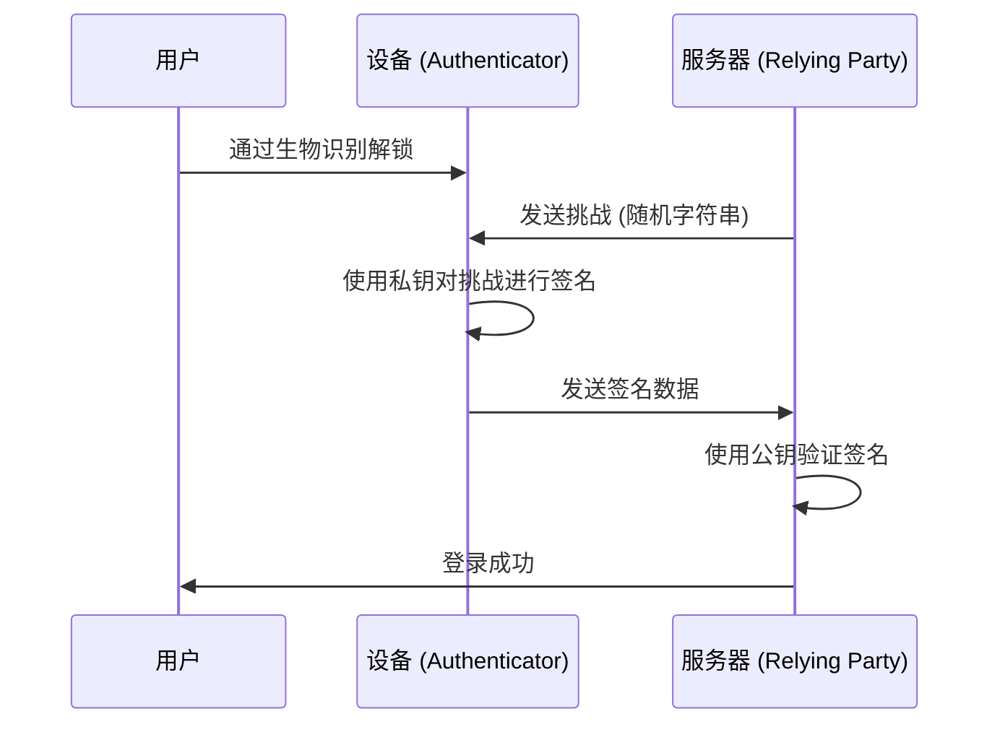

从互联网黎明期开始，我们一直依赖“密码”作为数字世界的钥匙。然而，密码的重复使用、选择容易被猜到的字符串，以及更重要的是通过网络钓鱼诈骗导致的凭据泄露，已经成为现代网络安全中最大的漏洞。

为了从根本上解决这个问题，“通行密钥（Passkeys）”应运而生。通行密钥是基于 FIDO（Fast IDentity Online）联盟和 W3C 制定的 WebAuthn（Web Authentication）标准，取代密码的新型认证手段。

本文将深入探讨通行密钥背后的技术机制、公钥密码学基础、设备绑定通行密钥与可同步通行密钥的区别、抗钓鱼攻击是如何实现的，以及实际的代码实现示例。

## 1. 通行密钥的基础技术：公钥密码学与 WebAuthn

支撑通行密钥安全性的是“公钥密码学（Public Key Cryptography）”。在传统的密码认证中，客户端和服务器共享“相同的秘密（密码）”，在登录时发送该秘密以确认是否一致（对称认证）。这种机制最大的弱点在于秘密会在网络上流动，并且因为服务器端保存了秘密（或其哈希值），如果服务器被入侵，信息就会泄露。

### 1.1 基于公钥密码学的非对称认证

通行密钥使用基于公钥密码学的非对称认证（Asymmetric authentication）。当生成通行密钥时，会在设备上创建以下两个密钥。

1. **私钥（Private Key）**: 被严密保管在用户设备的安全区域（如 Secure Enclave 或 TPM 等）中，绝不会离开设备。
2. **公钥（Public Key）**: 被发送到服务器（依赖方，Relying Party），并与账号绑定保存。由于公钥没有私钥就毫无意义，因此即使泄露也没有安全风险。

登录时，服务器会发送随机数据（挑战，Challenge）。用户的设备在通过生物识别（指纹或面部识别）等验证用户后，使用私钥对这个挑战进行签名（数字签名）。服务器使用保存的公钥来验证这个签名，如果正确则允许登录。



### 1.2 WebAuthn API

为了能够从 Web 浏览器或应用中无缝使用这一流程，提供了一个 API，这就是“WebAuthn”。WebAuthn 是可以从 JavaScript 调用的 API，提供以下两个主要函数。

- `navigator.credentials.create()`: 注册新的通行密钥（生成公钥并发送到服务器）
- `navigator.credentials.get()`: 使用已有的通行密钥进行认证（对挑战进行签名并发送到服务器）

调用这些 API 时，会显示操作系统级别的认证对话框，用户只需触摸指纹传感器或进行面部识别，认证即可完成。

## 2. 抗钓鱼攻击机制

通行密钥最大的特点之一，是具有强大的“抗钓鱼攻击能力（Phishing Resistance）”。对于传统的一次性密码（OTP）或基于短信的两步验证（2FA），如果用户被假网站欺骗并输入了密码和 OTP，攻击者就能接管账号（如 AiTM 攻击等）。

然而，通行密钥从结构上使钓鱼攻击无效化。

### 2.1 源绑定（Origin Binding）

在 WebAuthn 中，通行密钥在密码学上被绑定到特定网站的域名（Origin）。

假设用户在 `https://example.com` 上创建了通行密钥。此时，浏览器会将“这个通行密钥是为 `example.com` 使用的”这一信息绑定并保存在设备中，而且在注册公钥时向服务器发送“这个公钥是为 `example.com` 创建的”证明。

如果用户被诱导到一个巧妙伪装的钓鱼网站 `https://examp1e.com`，并试图在那里登录，会发生什么呢？

1. 网站调用 `navigator.credentials.get()`。
2. 浏览器确认当前的源是 `examp1e.com`，并在设备内进行搜索。
3. 由于不存在与 `examp1e.com` 绑定的通行密钥，浏览器将拒绝认证流程。

即使被骗的用户想要登录，浏览器和操作系统也会检测到域名不匹配，绝不会使用私钥进行签名。由此可以将钓鱼攻击防范在技术上不可能实现的级别。

### 2.2 挑战-响应认证

此外，在对从服务器发送来的挑战进行签名时，该签名的目标数据（ClientDataJSON）不仅包含挑战本身，还包含了调用方的源（Origin）以及跨源状态等。

服务器端验证签名时，将确认以下内容：
- 签名是否正确（是否与公钥一致）
- 被签名的源是否是自己正确的域名（例如：`https://example.com`）
- 挑战是否与刚刚发出的挑战一致

即使攻击者使用中继网站（反向代理）来中继挑战，浏览器签名的源也会变成“用户看到的假网站的域名”，因此真实的服务器会检测到源不匹配并拒绝认证。

## 3. 设备绑定通行密钥 vs 可同步通行密钥

通行密钥大致可以分为两种类型。了解各自的特性对于根据安全需求进行实施非常重要。

### 3.1 设备绑定通行密钥（Device-Bound Passkeys）

在早期的 FIDO 认证（如 FIDO UAF 或 FIDO2/WebAuthn 的初期阶段）中，私钥完全固定（Bound）在生成它的设备的安全元件中。以 YubiKey 为代表的硬件安全密钥就是典型的例子。

**优点:**
- 极高的安全性: 除非物理设备被盗，否则私钥绝不会泄露。
- 符合企业级需求: 满足 NIST SP 800-63B 的 AAL3（Authenticator Assurance Level 3）等严格的安全标准。

**缺点:**
- 丢失时的风险: 一旦设备丢失或损坏，私钥将永远丢失。必须有如注册多个设备等的备份策略。
- 便利性低: 如果换了新的智能手机，需要在所有网站上重新注册。

### 3.2 可同步通行密钥（Synced Passkeys / Multi-Device FIDO Credentials）

为了向消费者普及而引入的是“可同步通行密钥”。Apple（iCloud 钥匙串）、Google（Google 密码管理器）、Microsoft（Windows Hello）以及 1Password 等密码管理器提供了此功能。

在可同步通行密钥中，私钥在经过端到端加密（E2EE）后，通过云端与用户的其他设备进行同步。

**优点:**
- 压倒性的便利性: 在 iPhone 上创建的通行密钥，自动也能在 iPad 或 Mac 上使用。即使丢失了设备，也可以从云端恢复到新设备上。
- 解决账号恢复问题: 大幅减轻了设备绑定通行密钥最大的痛点，即“设备丢失时导致账号被锁定（Lockout）”。

**缺点:**
- 依赖云服务提供商: 依赖于同步生态系统（如 Apple 或 Google 等）的安全模型。如果生态系统账号本身（Apple ID 或 Google 账号）被接管，通行密钥也会处于危险之中。

FIDO 联盟为了在便利性和安全性之间取得平衡，在向消费者推广可同步通行密钥的同时，也采取了灵活的策略，为要求高安全性的企业或金融机构提供对设备绑定通行密钥（硬件密钥）的支持。

## 4. WebAuthn 的实现示例：前端与后端

在实际的网站中实施通行密钥时，需要在前端（JavaScript）和后端（服务器端）都进行处理。在此介绍注册（Registration）新通行密钥的基本流程和代码示例。

### 4.1 注册阶段（Registration）

#### 1. 从服务器获取挑战
从前端向服务器发送请求，获取用于注册的选项（挑战、用户信息等）。

#### 2. 在前端调用 `create()`
使用从服务器接收到的选项（`PublicKeyCredentialCreationOptions`），调用浏览器的 WebAuthn API。

```javascript
// 从服务器获取选项的示例（部分数据需要转换为 ArrayBuffer）
const publicKeyCredentialCreationOptions = {
    challenge: Uint8Array.from("random_challenge_string_from_server", c => c.charCodeAt(0)),
    rp: {
        name: "My Awesome App",
        id: "example.com"
    },
    user: {
        id: Uint8Array.from("user_unique_id_12345", c => c.charCodeAt(0)),
        name: "user@example.com",
        displayName: "John Doe"
    },
    pubKeyCredParams: [
        { alg: -7, type: "public-key" }, // ES256
        { alg: -257, type: "public-key" } // RS256
    ],
    authenticatorSelection: {
        authenticatorAttachment: "platform", // 安全密钥使用 "cross-platform"
        userVerification: "required" // 要求生物识别等
    },
    timeout: 60000,
    attestation: "none" // 出于隐私保护，基本设置为 none
};

try {
    // 浏览器显示原生的认证 UI
    const credential = await navigator.credentials.create({
        publicKey: publicKeyCredentialCreationOptions
    });

    // 将生成的公钥和签名数据发送到服务器
    const attestationResponse = {
        id: credential.id,
        rawId: Array.from(new Uint8Array(credential.rawId)),
        type: credential.type,
        response: {
            clientDataJSON: Array.from(new Uint8Array(credential.response.clientDataJSON)),
            attestationObject: Array.from(new Uint8Array(credential.response.attestationObject))
        }
    };

    // 使用 fetch API 等发送到服务器进行验证和保存
    await fetch('/api/webauthn/register', {
        method: 'POST',
        headers: { 'Content-Type': 'application/json' },
        body: JSON.stringify(attestationResponse)
    });

} catch (err) {
    console.error("通行密钥创建失败", err);
}
```

#### 3. 在服务器端的验证与保存
在服务器端对前端发送的数据进行验证。因为这个验证过程很复杂，通常使用各语言的 WebAuthn 库（如 Node.js 的 `@simplewebauthn/server`、Python 的 `webauthn`、Go 的 `go-webauthn` 等）。

验证项目：
- 挑战是否一致
- 源（Origin）和 RP ID 是否一致
- 用户认证（User Verification）是否成功
- 签名是否正确

验证成功后，将 `credential.id`（凭据 ID）和公钥（Public Key）与数据库的用户记录绑定保存。

## 5. FIDO 联盟与普及现状

通行密钥的技术基础 WebAuthn 和 FIDO2，是由 FIDO 联盟和 W3C 制定的。FIDO 联盟有数百家企业参与，包括 Apple、Google、Microsoft、Amazon、Meta 等大型科技企业，以及金融机构、安全厂商等。

近年来，通行密钥的普及正在迅速发展。

1. **平台的支持**: iOS/macOS、Android、Windows 等主要操作系统在系统层面支持了通行密钥。
2. **大型服务的引入**: Google 账号、Amazon、GitHub、Nintendo、X（原 Twitter）、PayPal 等众多全球服务正在将通行密钥登录作为标准配置。
3. **跨设备认证 (CDA)**: 使用智能手机登录电脑浏览器的机制（基于 CTAP2 的蓝牙/二维码联动）也已建立，实现了不同设备间无缝的认证体验。

## 6. 总结与未来展望

通行密钥不仅仅是“密码的替代品”，更是从根本上保护互联网认证基础设施的革命性技术。公钥密码学提供的数学证明、通过与域名的密码学绑定完全阻断网络钓鱼、以及生物识别带来的无摩擦用户体验。通过这些技术的结合，终于逐步克服了安全性和便利性之间的权衡。

当然，诸如同步提供商的锁定问题、以及企业中管理方法的建立等，仍有一些尚待解决的课题。但是，整个行业正在向“无密码的未来”迈出坚实的步伐，通行密钥毫无疑问将成为未来的标准认证方式。

作为开发者，现在是时候在现有的密码认证基础上，开始考虑实施通行密钥（WebAuthn）了。为了保护用户的宝贵数据，提供更舒适的登录体验，引入通行密钥将是最有效的投资之一。
