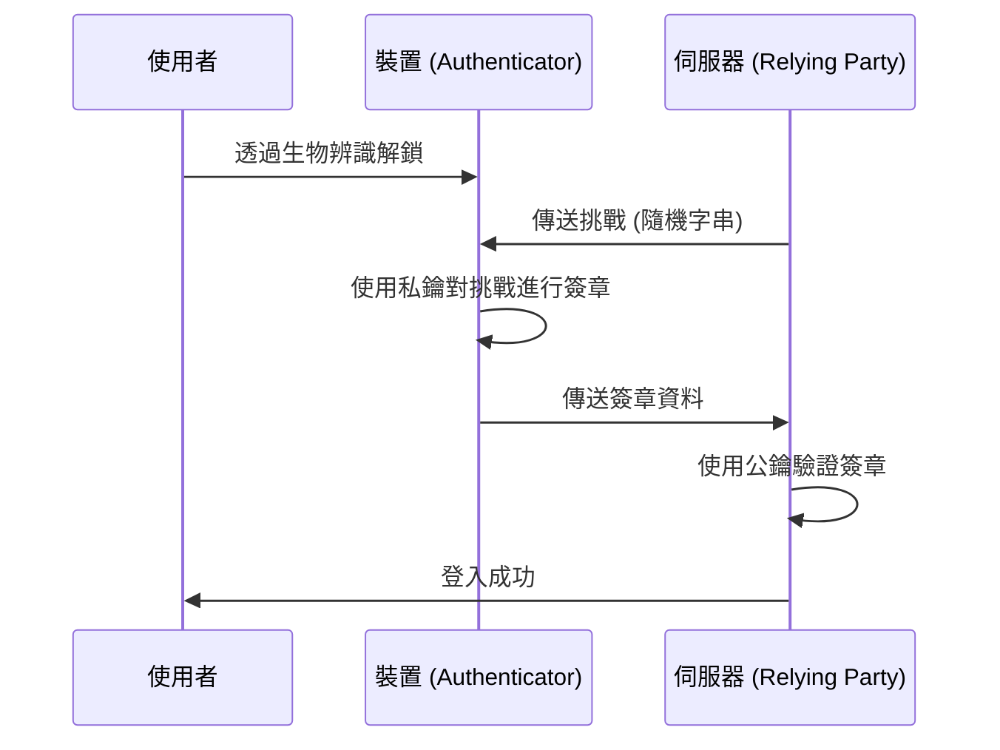

從網際網路發展初期開始，我們就一直依賴「密碼」作為數位世界的鑰匙。然而，重複使用密碼、選擇容易被猜到的字串，最重要的是透過釣魚詐騙導致的憑證外洩，已經成為現代網路安全中最大的漏洞。

為了解決這個根本問題，誕生了「通行密鑰（Passkeys）」。通行密鑰是基於由 FIDO（Fast IDentity Online）聯盟和 W3C 所制定的 WebAuthn（Web Authentication）標準，取代密碼的一種全新認證方式。

本文將深入探討通行密鑰背後的技術原理、公開金鑰加密基礎、綁定裝置的通行密鑰（Device-Bound Passkeys）與可同步通行密鑰（Synced Passkeys）的差異、如何實現防釣魚能力，以及實際的程式碼實作範例。

## 1. 通行密鑰的基礎技術：公開金鑰加密與 WebAuthn

支撐通行密鑰安全性的核心是「公開金鑰加密（Public Key Cryptography）」。傳統的密碼認證中，客戶端和伺服器共享「同一個秘密（密碼）」，在登入時發送該秘密以確認是否一致（對稱式認證，Symmetric authentication）。這種機制的最大的弱點在於，秘密會在網路上傳輸，而且伺服器端會儲存秘密（或其雜湊值），因此當伺服器遭到入侵時，資訊就會外洩。

### 1.1 基於公開金鑰加密的非對稱認證

通行密鑰使用基於公開金鑰加密的非對稱認證（Asymmetric authentication）。在生成通行密鑰時，裝置上會建立以下兩把金鑰：

1. **私鑰（Private Key）**: 被嚴密保存在使用者裝置的安全區域（如 Secure Enclave 或 TPM）中，絕對不會離開裝置。
2. **公鑰（Public Key）**: 傳送至伺服器（Relying Party）並與帳戶綁定儲存。公鑰若沒有對應的私鑰則毫無意義，因此即使外洩也不會造成安全風險。

登入時，伺服器會傳送一串隨機資料（挑戰，Challenge）。使用者的裝置在透過生物辨識（指紋或臉部辨識）等方式驗證使用者後，會使用私鑰對這個挑戰進行簽章（數位簽章）。伺服器使用儲存的公鑰來驗證這個簽章，如果正確則允許登入。



### 1.2 WebAuthn API

為了能讓網頁瀏覽器或應用程式無縫使用這個流程，API 被稱為「WebAuthn」。WebAuthn 是可以透過 JavaScript 呼叫的 API，提供以下兩個主要函數：

- `navigator.credentials.create()`: 註冊新的通行密鑰（生成公鑰並傳送至伺服器）
- `navigator.credentials.get()`: 使用現有通行密鑰進行認證（對挑戰進行簽章並傳送至伺服器）

呼叫這些 API 時，會顯示作業系統層級的認證對話框，使用者只需觸碰指紋感測器或進行臉部辨識，即可完成認證。

## 2. 防釣魚機制的原理

通行密鑰最大的特色之一，就是具備強大的「防釣魚能力（Phishing Resistance）」。傳統的一次性密碼（OTP）或透過簡訊的雙重認證（2FA），一旦使用者被釣魚網站欺騙並輸入了密碼和 OTP，帳戶就會被攻擊者劫持（如 AiTM 攻擊）。

然而，通行密鑰從結構上就讓釣魚攻擊無效化。

### 2.1 來源綁定（Origin Binding）

在 WebAuthn 中，通行密鑰在密碼學上會與特定網站的網域（Origin）綁定。

假設使用者在 `https://example.com` 建立了通行密鑰。此時，瀏覽器會將「這個通行密鑰是給 `example.com` 使用的」的資訊綁定並儲存在裝置上，而且在註冊公鑰時，也會向伺服器傳送「這個公鑰是為了 `example.com` 建立的」證明。

如果使用者被引導至巧妙偽裝的釣魚網站 `https://examp1e.com`，並試圖在該處登入，會發生什麼事呢？

1. 網站呼叫 `navigator.credentials.get()`。
2. 瀏覽器確認目前的來源是 `examp1e.com`，並在裝置內進行搜尋。
3. 因為不存在與 `examp1e.com` 綁定的通行密鑰，瀏覽器會拒絕認證流程。

即使使用者被騙，瀏覽器和作業系統也會偵測到網域不一致，絕對不會使用私鑰進行簽章。這使得釣魚攻擊在技術上被防範到了不可能發生的程度。

### 2.2 挑戰回應認證 (Challenge-Response Authentication)

此外，在對伺服器傳來的挑戰進行簽章時，簽章對象的資料（ClientDataJSON）中，除了挑戰本身之外，還包含了呼叫來源（Origin）和跨來源（Cross-Origin）狀態等資訊。

伺服器端在驗證簽章時，會確認以下事項：
- 簽章是否正確（是否與公鑰一致）
- 簽署的來源是否為自家正確的網域（例如：`https://example.com`）
- 挑戰是否與剛才發出的一致

即使攻擊者使用中繼網站（反向代理）來中繼挑戰，瀏覽器簽署的來源也會是「使用者正在觀看的偽造網站網域」，因此真正的伺服器會偵測到來源不一致並拒絕認證。

## 3. 綁定裝置的通行密鑰 vs 可同步通行密鑰

通行密鑰大致分為兩種類型。了解各自的特性對於根據安全需求進行實作非常重要。

### 3.1 綁定裝置的通行密鑰（Device-Bound Passkeys）

在早期的 FIDO 認證（FIDO UAF 和 FIDO2/WebAuthn 的初期階段）中，私鑰完全固定（Bound）在生成它的裝置的安全晶片中。YubiKey 等硬體安全金鑰就是代表性的例子。

**優點:**
- 極高的安全性：除非裝置在實體上被盜，否則私鑰絕對不會外洩。
- 符合企業級需求：滿足 NIST SP 800-63B 的 AAL3（Authenticator Assurance Level 3）等嚴格的安全標準。

**缺點:**
- 遺失時的風險：如果遺失或損壞裝置，私鑰將永遠消失。需要有多個裝置註冊等備份策略。
- 便利性較低：如果更換新的智慧型手機，所有網站都需要重新註冊。

### 3.2 可同步通行密鑰（Synced Passkeys / Multi-Device FIDO Credentials）

為了解決面向消費者的普及問題而引入了「可同步通行密鑰」。Apple（iCloud 鑰匙圈）、Google（Google 密碼管理工具）、Microsoft（Windows Hello）以及 1Password 等密碼管理工具都提供了這項功能。

在可同步通行密鑰中，私鑰經過端到端加密（E2EE）後，會透過雲端與使用者的其他裝置同步。

**優點:**
- 極致的便利性：在 iPhone 上建立的通行密鑰，會自動可在 iPad 或 Mac 上使用。即使遺失裝置，也可以從雲端還原到新裝置。
- 解決帳戶復原問題：大幅減輕了綁定裝置的通行密鑰最大的挑戰，即「遺失裝置時會被鎖在帳戶外（Lockout）」的問題。

**缺點:**
- 依賴雲端供應商：依賴同步生態系統（如 Apple 或 Google）的安全模型。如果生態系統帳戶本身（Apple ID 或 Google 帳戶）被劫持，通行密鑰也會面臨危險。

為了在便利性和安全性之間取得平衡，FIDO 聯盟針對消費者推廣可同步通行密鑰，同時針對需要高度安全的企業和金融機構支援綁定裝置的通行密鑰（硬體金鑰），採取了靈活的方法。

## 4. WebAuthn 的實作範例：前端與後端

在網站上實際實作通行密鑰時，前端（JavaScript）和後端（伺服器端）都需要進行處理。這裡介紹註冊（Registration）新通行密鑰的基本流程和程式碼範例。

### 4.1 註冊階段（Registration）

#### 1. 從伺服器取得挑戰
從前端發送請求至伺服器，取得註冊用的選項（挑戰、使用者資訊等）。

#### 2. 在前端呼叫 `create()`
使用從伺服器收到的選項（`PublicKeyCredentialCreationOptions`），呼叫瀏覽器的 WebAuthn API。

```javascript
// 從伺服器取得的選項範例（部分資料需轉換為 ArrayBuffer）
const publicKeyCredentialCreationOptions = {
    challenge: Uint8Array.from("random_challenge_string_from_server", c => c.charCodeAt(0)),
    rp: {
        name: "My Awesome App",
        id: "example.com"
    },
    user: {
        id: Uint8Array.from("user_unique_id_12345", c => c.charCodeAt(0)),
        name: "user@example.com",
        displayName: "John Doe"
    },
    pubKeyCredParams: [
        { alg: -7, type: "public-key" }, // ES256
        { alg: -257, type: "public-key" } // RS256
    ],
    authenticatorSelection: {
        authenticatorAttachment: "platform", // "cross-platform" for security keys
        userVerification: "required" // 要求生物辨識等
    },
    timeout: 60000,
    attestation: "none" // 為了保護隱私，預設為 none
};

try {
    // 瀏覽器顯示原生的認證 UI
    const credential = await navigator.credentials.create({
        publicKey: publicKeyCredentialCreationOptions
    });

    // 將生成的公鑰和簽章資料傳送至伺服器
    const attestationResponse = {
        id: credential.id,
        rawId: Array.from(new Uint8Array(credential.rawId)),
        type: credential.type,
        response: {
            clientDataJSON: Array.from(new Uint8Array(credential.response.clientDataJSON)),
            attestationObject: Array.from(new Uint8Array(credential.response.attestationObject))
        }
    };

    // 使用 fetch API 等傳送至伺服器進行驗證與儲存
    await fetch('/api/webauthn/register', {
        method: 'POST',
        headers: { 'Content-Type': 'application/json' },
        body: JSON.stringify(attestationResponse)
    });

} catch (err) {
    console.error("通行密鑰建立失敗", err);
}
```

#### 3. 在伺服器端進行驗證與儲存
在伺服器端驗證從前端傳送來的資料。這個驗證流程很複雜，因此通常會使用各語言的 WebAuthn 函式庫（例如 Node.js 的 `@simplewebauthn/server`、Python 的 `webauthn`、Go 的 `go-webauthn` 等）。

驗證項目：
- 挑戰是否一致
- 來源（Origin）和 RP ID 是否一致
- 使用者驗證（User Verification）是否成功
- 簽章是否正確

驗證成功後，將 `credential.id`（憑證 ID）與公鑰（Public Key）綁定到資料庫中的使用者紀錄並儲存。

## 5. FIDO 聯盟與普及狀況

作為通行密鑰技術基礎的 WebAuthn 和 FIDO2 是由 FIDO 聯盟和 W3C 所制定。FIDO 聯盟包含從 Apple、Google、Microsoft、Amazon、Meta 等大型科技企業，到金融機構和安全廠商等數百家企業。

近年來，通行密鑰的普及正在迅速發展。

1. **平台支援**: iOS/macOS、Android、Windows 等主要作業系統都已經在系統層級支援了通行密鑰。
2. **大型服務導入**: Google 帳戶、Amazon、GitHub、Nintendo、X（舊稱 Twitter）、PayPal 等許多全球服務，正在將使用通行密鑰登入標準化。
3. **跨裝置認證 (Cross-Device Authentication, CDA)**: 使用智慧型手機登入電腦瀏覽器的機制（透過 CTAP2 進行的藍牙/QR Code 連動）也已整備完畢，實現了跨不同裝置的無縫認證體驗。

## 6. 總結與未來展望

通行密鑰不僅僅是「密碼的替代品」，而是一項從根本上保護網際網路認證基礎的革命性技術。透過公開金鑰加密的數學證明、與網域密碼學綁定所帶來的釣魚攻擊完全無效化，以及生物辨識帶來的無摩擦使用者體驗。結合這些特點，我們終於逐漸克服了安全性和便利性之間的權衡。

當然，諸如同步服務供應商的鎖定（Lock-in）問題，以及企業級管理方法的建立等，仍有一些需要解決的課題。然而，整個業界正確實地朝向「無密碼的未來」邁進，通行密鑰無疑將成為未來的標準認證方式。

身為開發者，現在正是除了現有的密碼認證之外，開始考慮實作通行密鑰（WebAuthn）的時候了。為了保護使用者寶貴的資料，並提供更舒適的登入體驗，導入通行密鑰將會是最有效的投資之一。
