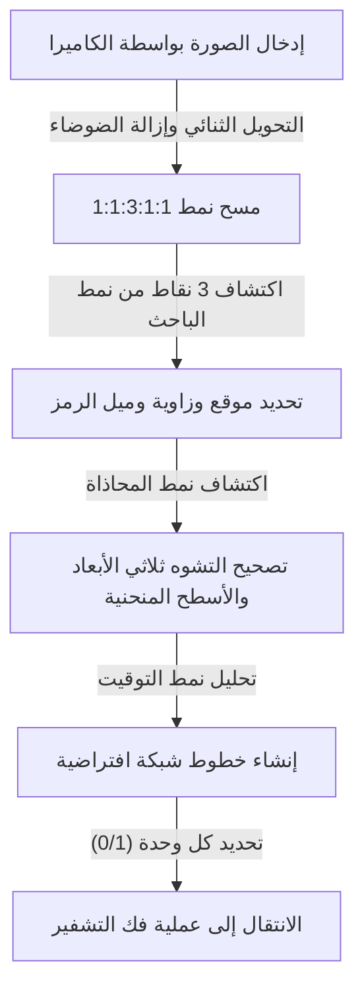
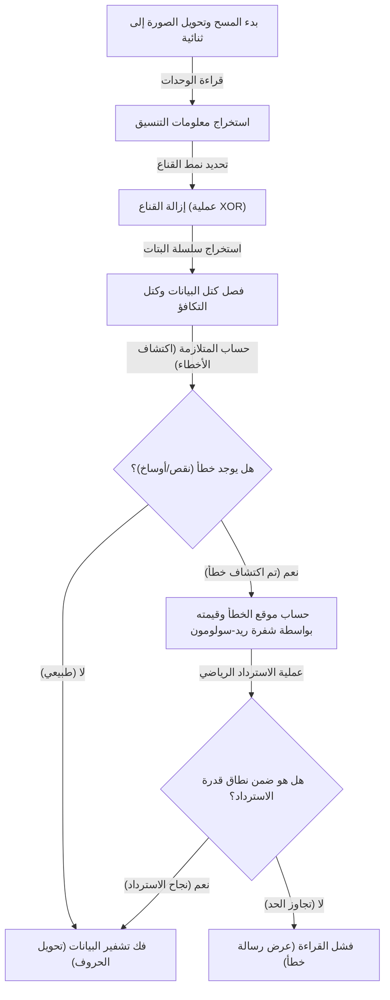

## مقدمة: تحفة الرموز ثنائية الأبعاد التي تدعم حياتنا

المدفوعات غير النقدية، والوصول إلى مواقع الويب، وتذاكر صعود الطائرات، وحتى إدارة القطع في المصانع؛ لا يمر يوم في المجتمع الحديث دون رؤية 'رمز الاستجابة السريعة' (QR Code). يمكن القول إن هذه التقنية، التي تربطك بالبيانات الرقمية في لحظة بمجرد توجيه هاتفك الذكي نحو قارئ مخصص أو كاميرا، هي واحدة من تقنيات البنية التحتية الأكثر انتشارًا في العالم اليوم.

ولكن، فكر في الأمر بعناية. حتى لو كان رمز الاستجابة السريعة المطبوع على ملصق مبللًا بالمطر ومطليًا قليلاً، أو إذا كانت الورقة مطوية وممزقة جزئيًا، فلماذا تستطيع هواتفنا الذكية الوصول إلى موقع الويب دون أي مشاكل؟ مع الرموز الشريطية (الباركود) التقليدية أحادية الأبعاد، إذا كان هناك خط واحد مفقود أو متسخ، سيؤدي ذلك فورًا إلى 'خطأ في القراءة'.

وراء أداء القراءة المذهل هذا تكمن هندسة متطورة للغاية وخوارزميات رياضية طورتها شركة دينسو ويف (دينسو في ذلك الوقت) اليابانية في عام 1994. في هذه المقالة، سنشرح بصريًا وبالتفصيل لماذا تكون رموز الاستجابة السريعة سريعة ومقاومة بشكل كبير للأوساخ والتلف، من خلال ثلاث آليات أساسية: 'التصميم الدقيق لأنماط الترتيب'، و'معالجة القناع لتحسين التعرف على البيانات'، و'تقنية تصحيح الأخطاء التي تعيد إحياء البيانات كطائر الفينيق'.

## السر الأول: 'الأنماط الهندسية للترتيب' التي لا تُربك الكاميرا

المربعات الصغيرة باللونين الأبيض والأسود التي تشكل رمز الاستجابة السريعة تُسمى 'الوحدات'. على الرغم من أنها قد تبدو للوهلة الأولى كضوضاء المودم المتناثرة بشكل عشوائي، إلا أن رمز الاستجابة السريعة يحتوي على العديد من 'العلامات الإرشادية الثابتة' المضمنة بداخله لكي يتعرف الماسح الضوئي (الكاميرا) على الرمز ويحدد اتجاهه ومنظوره بدقة.

قدرة كاميرات الهواتف الذكية وما شابهها على اكتشاف رمز الاستجابة السريعة على الفور داخل إطار الصورة وقراءة البيانات الدقيقة ترجع إلى أنماط الترتيب المحسوبة بعناية الموضحة أدناه.

### 1. نمط الباحث (نمط اكتشاف الموقع): يمكن التعرف عليه من أي زاوية بـ 360 درجة
وهي عبارة عن مربعات مزدوجة كبيرة (تشبه شكل علامة الهدف) يتم وضعها في ثلاث زوايا من رمز الاستجابة السريعة (عادةً أعلى اليسار، أعلى اليمين، وأسفل اليسار). ليس من المبالغة القول إن هذه هي الميزة الأبرز لرموز الاستجابة السريعة.

يخفي هذا النمط نسبة سحرية: بغض النظر عن الزاوية التي يُرسم بها خط مستقيم يمر عبر المركز، فإن نسبة طول الأجزاء السوداء والبيضاء تكون دائمًا 'أسود:أبيض:أسود:أبيض:أسود = 1:1:3:1:1'. عندما يقوم برنامج معالجة الصور بمسح فيديو الكاميرا، فإنه يبحث عن هذا النمط '1:1:3:1:1'. نظرًا لأنه من النادر جدًا أن تحدث هذه النسبة عن طريق الصدفة في الطبيعة أو في المواد المطبوعة العادية، يمكن للبرنامج أن يدرك بسرعة وبدقة عالية أن 'هناك رمز QR هنا'. علاوة على ذلك، نظرًا لوجودها في ثلاثة أماكن، يمكن للنظام إعادة حساب الاتجاه الصحيح على الفور حتى لو كان رمز الاستجابة السريعة مقلوبًا رأسًا على عقب أو مائلًا.

### 2. نمط المحاذاة: نقطة الترحيل لتصحيح التشوه
تأتي رموز الاستجابة السريعة بأحجام من 'الإصدار 1' إلى 'الإصدار 40' اعتمادًا على كمية البيانات التي سيتم تخزينها. كلما زاد الإصدار (زيادة عدد الوحدات)، زاد عدد الأنماط المربعة الصغيرة الموضوعة داخل الرمز، والتي تُعرف باسم 'أنماط المحاذاة'.

إذا كانت الورقة مثنية أو إذا تم توجيه الكاميرا من زاوية مائلة للغاية، ستبدو شبكة الوحدات مشوهة بسبب منظور العدسة. يعمل نمط المحاذاة بمثابة 'نقطة مرجعية إحداثية' لتصحيح هذا التشوه. يكتشف الماسح الضوئي هذه الأنماط ويقوم بإعادة تعيين الشبكة المنحنية افتراضيًا إلى مستوى ثنائي الأبعاد مسطح، مما يتيح قراءة الوحدات بدقة.

### 3. نمط التوقيت: المسطرة لاستخلاص إحداثيات الوحدات
هو خط مستقيم يتكون من ألوان سوداء وبيضاء متبادلة مرتبة على شكل حرف L لربط أنماط الباحث ببعضها البعض. يُطلق على هذا اسم 'نمط التوقيت'، ويعمل بمثابة 'مسطرة' لفهم إحداثيات الوحدات في منطقة البيانات بدقة. حتى إذا كان إصدار رمز الاستجابة السريعة غير معروف، يمكن للماسح الضوئي حساب العدد الإجمالي للوحدات (الدقة) للرمز بأكمله بدقة من خلال عد التناوب بين الأسود والأبيض، وبالتالي إنشاء الشبكة بدقة.

### 4. المنطقة الهادئة: الخط الحدودي الذي يفصل بين الضوضاء والإشارة
وهو هامش فارغ لا يُطبع عليه أي شيء، ويجب توفيره دائمًا حول رمز الاستجابة السريعة. يتطلب المعيار القياسي عرضًا يعادل 4 وحدات على الأقل حول الرمز. بفضل هذا الهامش، يمكن لخوارزميات التعرف على الصور فصل مساحة رمز الاستجابة السريعة نفسها بوضوح عن ضوضاء الخلفية المحيطة (مثل النصوص أو الصور) وتحديد الحدود.

## السر الثاني: 'معالجة القناع' التي تمنع ارتباك البرنامج

إذا تم تحويل بيانات رمز الاستجابة السريعة كما هي إلى نقاط سوداء وبيضاء وترتيبها، فقد تنشأ مشكلة خطيرة. وهي أنه قد تتشكل عن طريق الصدفة 'كتل كبيرة من الوحدات السوداء الكثيفة' أو 'مناطق تحتوي فقط على وحدات بيضاء'.
علاوة على ذلك، في أسوأ الحالات، قد يحدث مصادفةً أن يظهر تسلسل '1:1:3:1:1' مماثل لنمط الباحث داخل منطقة البيانات. إذا حدث ذلك، سيفقد الماسح الضوئي خطوط حدود الوحدات أو يخطئ في تحديدها كنمط باحث مما يتسبب في حدوث خطأ.

التقنية المبتكرة التي تمنع ذلك تمامًا هي 'معالجة القناع' (Masking).

### الخوارزمية المتقدمة لمعالجة القناع
عند إنشاء رمز الاستجابة السريعة، لا يقوم المشفر (برنامج الإنشاء) بترتيب البيانات كما هي، بل يقوم بتركيب 8 أنواع محددة مسبقًا من 'أنماط القناع' (أنماط منتظمة مثل رقعة الشطرنج، والخطوط، والشبكات القطرية) رياضيًا (باستخدام عملية XOR: OR الحصرية) على منطقة البيانات.

لا يكتفي المشفر بتطبيق قناع واحد، بل يقوم داخليًا بإنشاء '8 رموز اختبار بتطبيق جميع الأقنعة الثمانية بشكل فردي'. ثم يُجري 'تقييم عقوبة' صارم لكل رمز اختبار. معايير التقييم هي كما يلي:

1. **اللون المتتالي**: هل هناك 5 وحدات أو أكثر من نفس اللون (أسود أو أبيض) متتالية رأسيًا أو أفقيًا.
2. **الكتل الكبيرة**: كم عدد الكتل من نفس اللون بحجم 2×2 وحدة أو أكبر.
3. **حدوث أنماط مشابهة**: هل يحتوي على تسلسل '1:1:3:1:1' مشابه لنمط الباحث.
4. **نسبة الأبيض والأسود الإجمالية**: ما مدى انحراف نسبة الوحدات السوداء والبيضاء الإجمالية عن 50:50.

يحسب النظام درجة العقوبة بناءً على هذه الشروط ويتبنى نمط القناع الذي يسجل أقل درجة (أي النمط الذي يتوزع فيه اللونان الأبيض والأسود بشكل أكثر توازناً ويكون أسهل في القراءة) كمخرج نهائي.

يتم تسجيل نوع القناع المعتمد (معلومات بحجم 3 بت من 000 إلى 111) في منطقة 'معلومات التنسيق' داخل رمز الاستجابة السريعة. عندما يقرأ الماسح الضوئي الرمز، فإنه يحصل أولاً على معلومات التنسيق هذه، ويزيل القناع عن طريق تطبيق نفس نمط القناع مرة أخرى باستخدام عملية XOR، ويستعيد البيانات الأصلية. بفضل هذا الابتكار غير المرئي، يمكن للكاميرا دائمًا التعرف على أنماط موحدة وذات تباين عالٍ.

## السر الثالث: السبب الأكبر في إمكانية قراءتها حتى لو كانت متسخة 'تقنية تصحيح الأخطاء'

السبب الأكبر الذي يمنح رمز الاستجابة السريعة متانة هائلة مقارنة بالرموز ثنائية الأبعاد الأخرى، والآلية السحرية التي يمكنها استعادة البيانات بشكل مثالي حتى لو كان جزء منها متسخًا أو ممزقًا أو مخفيًا، هي تقنية تصحيح الأخطاء باستخدام 'شفرة ريد-سولومون' (Reed-Solomon error correction).

### ما هي 'شفرة ريد-سولومون' القادمة من الاتصالات الفضائية؟
شفرة ريد-سولومون هي في الأصل خوارزمية رياضية تم تطويرها في الستينيات. كانت استخداماتها المبكرة تتمثل في تصحيح الضوضاء في الاتصالات الضعيفة من المسابير الفضائية مثل فوياجر، وإصلاح أخطاء قراءة البيانات الناتجة عن خدوش السطح في الوسائط البصرية مثل الأقراص المدمجة (CD) وأقراص الفيديو الرقمية (DVD).

تُجري هذه الخوارزمية عمليات متعددة الحدود متقدمة على البيانات الأصلية (الرسالة)، وتولد وتضيف بيانات زائدة للاسترداد تُعرف باسم 'بيانات التكافؤ'. حتى لو فُقد جزء من البيانات، فمن خلال حل البيانات العادية المتبقية وبيانات التكافؤ مثل المعادلات الآنية، يمكن حساب واستعادة البيانات المفقودة بالكامل رياضيًا بشكل عكسي.

### 4 مستويات لتصحيح الأخطاء يمكن اختيارها حسب الغرض
يأتي رمز الاستجابة السريعة مزودًا بشفرة ريد-سولومون القوية كمعيار أساسي، وعند إنشائه، يمكنك اختيار مستوى تصحيح الأخطاء (مستوى ECC) من بين 4 مستويات وفقًا لغرضك. كلما تم ضبط المستوى أعلى، زادت قدرة الاسترداد، ولكن بما أن نسبة بيانات التكافؤ في الرمز تزداد، فإن كمية البيانات الفعلية التي يمكن تخزينها ستقل، أو ستحتاج إلى زيادة حجم (إصدار) رمز الاستجابة السريعة نفسه.

- **المستوى L (Low - قدرة استرداد حوالي 7%)**: يُستخدم عندما تكون بيئة القراءة جيدة، مثل البيئات التي لا يوجد بها الكثير من الأوساخ أو رموز الاستجابة السريعة المعروضة على الشاشات. وهو مثالي عندما تريد زيادة سعة البيانات إلى أقصى حد.
- **المستوى M (Medium - قدرة استرداد حوالي 15%)**: هو المستوى الأكثر استخدامًا بشكل قياسي في المواد المطبوعة العامة ومواقع الويب.
- **المستوى Q (Quartile - قدرة استرداد حوالي 25%)**: يُنصَح به في البيئات التي يُتوقع فيها الأوساخ والتلف، مثل الملصقات الخارجية وإيصالات التوصيل.
- **المستوى H (High - قدرة استرداد حوالي 30%)**: يُستخدم في إدارة القطع في البيئات القاسية كالمصانع، أو في التطبيقات التي تتطلب أعلى مستوى من الموثوقية.

### آلية رموز QR المصممة: استغلال الأخطاء لصالحك
في الآونة الأخيرة، نرى غالبًا رموز QR ذات تصميم عالٍ مع شعارات الشركات أو الرسوم التوضيحية للشخصيات الموضوعة في المنتصف. قد تتساءل، 'هل من المقبول طمس جزء من رمز الاستجابة السريعة برسم توضيحي؟'، ولكن هذا في الواقع استخدام ذكي (اختراق) لـ 'تقنية تصحيح الأخطاء'.

عند إنشاء رمز الاستجابة السريعة المصمم، يقوم المشفر مسبقًا بضبط مستوى تصحيح الأخطاء إلى أعلى مستوى 'المستوى H (30%)'. ثم يتم وضع الشعار في المنتصف والكتابة فوق البيانات بشكل متعمد (تدميرها). من وجهة نظر الماسح الضوئي، يُعتبر الجزء الخاص بالشعار مجرد 'بقعة أوساخ عملاقة (نقص)'. ومع ذلك، بفضل قدرة الاسترداد البالغة 30% التي يوفرها المستوى H، يتم استعادة البيانات المخفية بواسطة الشعار تمامًا من البيانات المحيطة المتبقية وبيانات التكافؤ.

## التدفق الكامل لفك تشفير (قراءة) رمز QR

إليك ملخص للتدفق الكامل لكيفية عمل التقنيات الموضحة حتى الآن معًا في أقل من 0.1 ثانية عند توجيه هاتفك الذكي:

1. **التعرف على الصور والتصحيح الهندسي**: العثور على أنماط الباحث الثلاثة من الفيديو الذي التقطته الكاميرا وتحديد الزاوية والميل. باستخدام أنماط المحاذاة والتوقيت، يتم إنشاء شبكة افتراضية مع تصحيح تشوه الصورة.
2. **الحصول على معلومات التنسيق**: قراءة معلومات 'مستوى تصحيح الأخطاء' و'نمط القناع' المستخدمين من مناطق خاصة حول أنماط الباحث.
3. **إزالة القناع**: استنادًا إلى معلومات نمط القناع التي تم الحصول عليها، يتم إجراء عملية XOR على منطقة البيانات بأكملها للكشف عن مصفوفة البيانات الحقيقية المخفية.
4. **ترتيب البيانات والتحقق من الأخطاء**: يتم تحويل الوحدات السوداء والبيضاء إلى بيانات ثنائية (سلسلة بتات) من 0 و 1 وفقًا لقاعدة التقدم بشكل متعرج (زيجزاج) من أسفل اليمين.
5. **تنفيذ تصحيح الأخطاء**: يتم تقسيم سلسلة البتات إلى جزء بيانات وجزء تكافؤ، ويتم التحقق منها باستخدام شفرة ريد-سولومون. إذا كان هناك نقص أو ضوضاء، فسيتم استعادة البيانات الأصلية رياضيًا هنا.
6. **تفسير البيانات**: أخيرًا، يتم تحويل سلسلة البتات إلى أحرف أو عناوين URL وفقًا لوضع التشفير (أرقام، حروف وأرقام، بيانات ثنائية، حروف كانجي، وما إلى ذلك) وعرضها على شاشة المستخدم.

## الخلاصة: بلورة الهندسة المعبأة في مربع صغير

رموز QR التي نوجه نحوها هواتفنا الذكية بلا مبالاة. قد تبدو للوهلة الأولى كمجرد نمط فسيفساء أبيض وأسود، ولكن وراء الكواليس توجد طبقات متعددة من التقنيات: 'أنماط الترتيب الهندسية' التي تساعد التعرف البصري على الصور إلى أقصى حد، و'معالجة القناع' التي تحسن الرؤية بناءً على نظرية الاحتمالات وعلوم الكمبيوتر، و'تقنية تصحيح الأخطاء' القائمة على الرياضيات المتقدمة المستعارة من الاتصالات الفضائية.

لأن هذه الخوارزميات المعقدة مدمجة بسلاسة في مربع يبلغ طوله بضعة سنتيمترات فقط، يمكننا استخدام رموز الاستجابة السريعة دون أي ضغوط، حتى تحت أسوأ ظروف الإضاءة أو مع وجود بعض الأوساخ أو التشوهات. في المرة القادمة التي ترى فيها رمز QR في مقهى أو على ملصق، يرجى التفكير في التنسيق الهندسي الدقيق الذي يتم تنفيذه عشرات المرات في الثانية في الخلفية.
