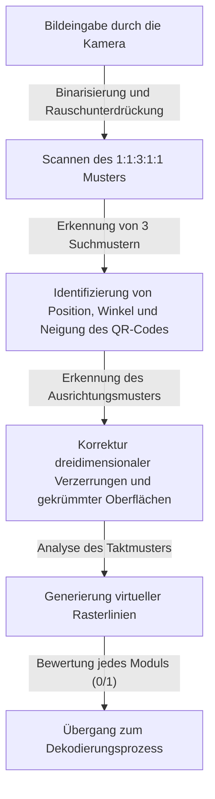
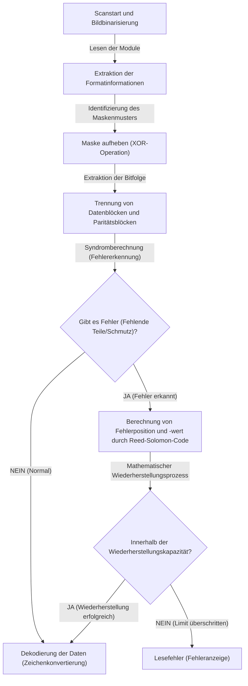

## Einführung: Das Meisterwerk des zweidimensionalen Codes, das unser Leben unterstützt

In der modernen Gesellschaft vergeht kein Tag, an dem wir keinen "QR-Code" (Quick Response Code) sehen, sei es für bargeldloses Bezahlen, den Zugriff auf Websites, Flugtickets oder sogar die Teileverwaltung in Fabriken. Diese Technologie, die uns sofort mit digitalen Daten verbindet, indem wir einfach ein Smartphone schnell über ein spezielles Lesegerät oder eine Kamera halten, kann heute als eine der am weitesten verbreiteten Infrastrukturtechnologien der Welt angesehen werden.

Aber denken Sie einmal darüber nach. Warum kann unser Smartphone problemlos auf eine Website zugreifen, selbst wenn ein auf einem Poster gedruckter QR-Code durch Regen etwas nass und verschwommen ist oder wenn das Papier zerknittert und teilweise zerrissen ist? Bei einem herkömmlichen eindimensionalen Barcode würde das Fehlen oder Verschmutzen einer einzigen Linie sofort zu einem "Lesefehler" führen.

Hinter dieser erstaunlichen Leseleistung verbergen sich extrem fortschrittliche und raffinierte Ingenieurskunst und mathematische Algorithmen, die 1994 vom japanischen Unternehmen Denso Wave Incorporated (damals Denso) entwickelt wurden. In diesem Artikel werden wir die Frage, warum QR-Codes so schnell und überwältigend resistent gegen Schmutz und Beschädigungen sind, detailliert und visuell anhand von drei Kernmechanismen auflösen: dem "präzisen Design der Anordnungsmuster", der "Maskierungsverarbeitung zur Optimierung der Datenerkennung" und der "Fehlerkorrekturtechnologie, die Daten wie einen Phönix wiederauferstehen lässt".

## Das erste Geheimnis: "Geometrische Anordnungsmuster", die die Kamera nicht verwirren

Die kleinen schwarzen und weißen Quadrate, die einen QR-Code bilden, werden "Module" genannt. Auf den ersten Blick mögen sie wie chaotisch verstreutes Modem-Rauschen aussehen, aber im QR-Code sind mehrere "feste Wegweiser" eingebettet, durch die der Scanner (die Kamera) den Code erkennen und seine genaue Ausrichtung und Perspektive erfassen kann.

Der Grund, warum Kameras von Smartphones usw. QR-Codes sofort im Bildrahmen finden und die genauen Daten auslesen können, liegt an den folgenden durchdachten Anordnungsmustern.

### 1. Suchmuster (Finder-Pattern): Aus 360 Grad aus jeder Richtung erkennbar
Dies sind große doppelte Quadrate (ähnlich einer Zielscheibe), die an drei Ecken des QR-Codes (normalerweise oben links, oben rechts und unten links) platziert sind. Es ist keine Übertreibung zu sagen, dass dies das wichtigste Merkmal des QR-Codes ist.

In diesem Suchmuster verbirgt sich ein "magisches Verhältnis". Es ist so konzipiert, dass unabhängig davon, in welchem Winkel Sie eine gerade Linie durch das Zentrum ziehen, das Längenverhältnis zwischen schwarzen und weißen Teilen immer "Schwarz : Weiß : Schwarz : Weiß : Schwarz = 1 : 1 : 3 : 1 : 1" beträgt.
Wenn die Bildverarbeitungssoftware das Kamerabild zeilenweise abtastet, sucht sie nach diesem "1:1:3:1:1"-Muster. Da es extrem unwahrscheinlich ist, dass dieses Verhältnis zufällig in der Natur oder in normalen Drucksachen vorkommt, kann die Software mit hoher Geschwindigkeit und hoher Präzision erkennen: "Hier ist ein QR-Code". Da sie an drei Stellen platziert sind, kann das System auch bei einem auf dem Kopf stehenden oder diagonalen QR-Code sofort die richtige Ausrichtung neu berechnen.

### 2. Ausrichtungsmuster (Alignment-Pattern): Relaispunkte zur Korrektur von Verzerrungen
QR-Codes gibt es in Größen von "Version 1" bis "Version 40", abhängig von der Menge der zu speichernden Daten. Wenn die Version größer wird (die Anzahl der Module steigt), sind die kleinen quadratischen Muster, die im Code platziert werden, die "Ausrichtungsmuster".

Wenn das Papier gebogen ist oder die Kamera in einem extremen Winkel gehalten wird, erscheint das Raster der Module aufgrund der Kameraperspektive verzerrt. Das Ausrichtungsmuster dient als "Koordinaten-Referenzpunkt" zur Korrektur dieser Verzerrung. Der Scanner erkennt diese Muster und bildet das gekrümmte Raster virtuell auf eine flache zweidimensionale Ebene ab, was ein genaues Ablesen der Module ermöglicht.

### 3. Taktmuster (Timing-Pattern): Ein Lineal zum Ableiten von Modulkoordinaten
Dies ist eine L-förmige Linie aus abwechselnd schwarzen und weißen Quadraten, die die Suchmuster miteinander verbindet. Dies wird als "Taktmuster" bezeichnet und fungiert als "Lineal" zur genauen Bestimmung der Koordinaten der Module im Datenbereich. Selbst wenn die Version des QR-Codes unbekannt ist, kann der Scanner durch Zählen dieser abwechselnden schwarzen und weißen Punkte die Gesamtzahl der Module (Auflösung) des gesamten QR-Codes genau berechnen und das Raster korrekt generieren.

### 4. Ruhezone (Quiet Zone): Die Grenzlinie, die Rauschen und Signal trennt
Dies ist der unbedruckte Randbereich, der zwingend um den QR-Code herum vorgesehen ist. Der Standard erfordert eine Breite von 4 Modulen um den Rand herum. Durch das Vorhandensein dieses Randes kann der Bilderkennungsalgorithmus den eigentlichen QR-Code-Bereich klar von den umgebenden Hintergrundgeräuschen (wie Text oder Fotos) trennen und die Grenzen festlegen.

## Das zweite Geheimnis: "Maskierungsverarbeitung" zur Verhinderung von Softwareverwirrung

Wenn die Daten des QR-Codes direkt in schwarze und weiße Punkte umgewandelt und platziert würden, könnte ein ernsthaftes Problem auftreten. Es könnte zufällig dazu kommen, dass "große Blöcke mit dichten schwarzen Modulen" oder "Bereiche, die nur aus weißen Modulen bestehen" entstehen.
Als schlimmster Fall könnte im Datenbereich zufällig dieselbe Sequenz wie beim Suchmuster "1:1:3:1:1" auftreten. Wenn dies passiert, könnte der Scanner die Modulgrenzen aus den Augen verlieren oder sie fälschlicherweise als Suchmuster identifizieren, was zu Fehlern führt.

Eine geniale Technologie, die dies vollständig verhindert, ist die "Maskierungsverarbeitung" (Masking).

### Der fortschrittliche Algorithmus der Maskierungsverarbeitung
Bei der Generierung eines QR-Codes platziert der Encoder (die Generierungssoftware) die Daten nicht einfach so, sondern überlagert den Datenbereich mathematisch (XOR-Operation: Exklusives ODER) mit 8 vordefinierten "Maskenmustern" (regelmäßige Muster wie Schachbrett, Streifen, diagonales Gitter usw.).

Der Encoder wendet nicht nur eine einzige Maske an, sondern generiert intern "8 Testcodes, auf die alle 8 Masken einzeln angewendet wurden". Dann führt er für jeden Testcode eine strenge "Strafbewertung" (Penalty-Evaluation) durch. Die Bewertungskriterien lauten wie folgt:

1. **Aufeinanderfolgende gleiche Farben**: Gibt es vertikal oder horizontal 5 oder mehr aufeinanderfolgende Module derselben Farbe (schwarz oder weiß)?
2. **Große Blöcke**: Wie viele Blöcke derselben Farbe von 2x2 Modulen oder mehr gibt es?
3. **Auftreten ähnlicher Muster**: Enthält es eine Sequenz "1:1:3:1:1", die dem Suchmuster ähnelt?
4. **Gesamtverhältnis von Schwarz zu Weiß**: Wie weit weicht das Gesamtverhältnis von schwarzen zu weißen Modulen von 50:50 ab?

Das System berechnet basierend auf diesen Bedingungen einen Strafpunktestand und wählt das Maskenmuster mit dem niedrigsten Wert (d. h. das am besten ausbalancierte Muster aus Schwarz und Weiß, das am einfachsten zu lesen ist) als endgültige Ausgabe.

Die Art der verwendeten Maske (3-Bit-Information von 000 bis 111) wird im "Formatinfo"-Bereich innerhalb des QR-Codes gespeichert. Wenn der Scanner den QR-Code liest, ruft er zunächst diese Formatinformationen ab, hebt die Maske auf, indem er dasselbe Maskenmuster erneut mit der XOR-Operation anwendet, und stellt so die Originaldaten wieder her. Durch diesen unsichtbaren Trick kann die Kamera immer einen hohen Kontrast und ein gleichmäßiges Muster erkennen.

## Das dritte Geheimnis: Der Hauptgrund für die Lesbarkeit bei Verschmutzung "Fehlerkorrekturtechnologie"

Der Hauptgrund, warum der QR-Code im Vergleich zu anderen zweidimensionalen Codes eine überwältigende Robustheit aufweist, und der magische Mechanismus, der Daten perfekt wiederherstellen kann, selbst wenn Teile verschmutzt, zerrissen oder verdeckt sind, ist die Fehlerkorrekturtechnologie unter Verwendung des "Reed-Solomon-Codes" (Reed-Solomon error correction).

### Was ist der "Reed-Solomon-Code" aus der Weltraumkommunikation?
Der Reed-Solomon-Code ist ein mathematischer Algorithmus, der ursprünglich in den 1960er Jahren entwickelt wurde. Seine anfängliche Anwendung bestand in der Rauschkorrektur bei schwachen Kommunikationssignalen von Raumsonden wie Voyager sowie in der Behebung von Datenlesefehlern durch Oberflächenkratzer auf optischen Medien wie CDs und DVDs.

Dieser Algorithmus führt komplexe Polynomoperationen auf den Originaldaten (Nachricht) durch, generiert redundante Daten zur Wiederherstellung, die "Paritätsdaten" genannt werden, und fügt diese hinzu. Selbst wenn ein Teil der Daten fehlt, können die verlorenen Daten mathematisch perfekt zurückgerechnet und wiederhergestellt werden, indem die verbleibenden normalen Daten und Paritätsdaten wie in einem linearen Gleichungssystem gelöst werden.

### 4 wählbare Fehlerkorrekturlevel je nach Anwendung
Der QR-Code ist standardmäßig mit diesem leistungsstarken Reed-Solomon-Code ausgestattet, und bei der Erstellung können je nach Zweck 4 Stufen der Fehlerkorrektur (ECC-Level) ausgewählt werden. Je höher das Level eingestellt ist, desto höher ist die Wiederherstellungsfähigkeit, aber da der Anteil der Paritätsdaten im Code steigt, muss entweder die Menge der speicherbaren Nutzdaten reduziert oder die Größe (Version) des QR-Codes selbst erhöht werden.

- **Level L (Low - ca. 7% Wiederherstellungsfähigkeit)**: Wird verwendet, wenn die Leseumgebung gut ist, z. B. in Umgebungen mit wenig Schmutz oder bei QR-Codes, die auf Bildschirmen angezeigt werden. Ideal zur Maximierung der Datenkapazität.
- **Level M (Medium - ca. 15% Wiederherstellungsfähigkeit)**: Das am häufigsten verwendete Standardlevel für allgemeine Drucksachen und Websites.
- **Level Q (Quartile - ca. 25% Wiederherstellungsfähigkeit)**: Empfohlen für Umgebungen, in denen Schmutz oder Beschädigungen zu erwarten sind, wie z. B. Außenplakate oder Lieferetiketten.
- **Level H (High - ca. 30% Wiederherstellungsfähigkeit)**: Wird für Teilemanagement in rauen Umgebungen wie Fabriken oder in Anwendungen verwendet, die höchste Zuverlässigkeit erfordern.

### Wie Design-QR-Codes funktionieren: Fehler zum eigenen Vorteil nutzen
In letzter Zeit sieht man oft Design-QR-Codes mit einem Firmenlogo oder einer Charakterillustration in der Mitte. Sie fragen sich vielleicht: "Ist es in Ordnung, einen Teil des QR-Codes mit einer Illustration zu übermalen?" Dies ist in der Tat eine geschickte Nutzung (Hack) dieser "Fehlerkorrekturtechnologie".

Bei der Erstellung eines Design-QR-Codes stellt der Encoder das Fehlerkorrekturlevel im Voraus auf das höchste "Level H (30%)" ein. Dann platziert er ein Logo in der Mitte und überschreibt (zerstört) absichtlich die Daten. Aus der Sicht des Scanners wird der Logo-Bereich einfach als "riesiger Schmutz (Fehlen)" erkannt. Aufgrund der 30%igen Wiederherstellungskapazität von Level H können die vom Logo verdeckten Daten jedoch aus den umgebenden verbleibenden Daten und Paritätsdaten perfekt wiederhergestellt werden.

## Gesamtablauf der QR-Code-Dekodierung (Auslesen)

Wir fassen hier den gesamten Ablauf zusammen, wie die bisher erklärten Technologien in der kurzen Zeit von weniger als 0,1 Sekunden, in der Sie Ihr Smartphone vor den Code halten, zusammenwirken und verarbeitet werden.

1. **Bilderkennung und geometrische Korrektur**: Findet die 3 Suchmuster aus dem von der Kamera erfassten Bild und bestimmt den Winkel und die Neigung. Mithilfe von Ausrichtungs- und Taktmustern wird ein virtuelles Raster (Gitter) generiert und gleichzeitig Bildverzerrungen korrigiert.
2. **Abrufen von Formatinformationen**: Liest Informationen über das verwendete "Fehlerkorrekturlevel" und das "Maskenmuster" aus einem speziellen Bereich um die Suchmuster herum.
3. **Aufheben der Maske**: Führt basierend auf den abgerufenen Maskenmusterinformationen eine XOR-Operation auf den gesamten Datenbereich durch und bringt das verborgene wahre Datenarray zum Vorschein.
4. **Daten-Array-Bildung und Fehlerprüfung**: Konvertiert das Schwarzweiß der Module nach einer Regel, die von unten rechts im Zickzack verläuft, in binäre Daten (Bitfolge) von 0 und 1.
5. **Ausführung der Fehlerkorrektur**: Teilt die Bitfolge in Daten- und Paritätsteile auf und verifiziert sie mit dem Reed-Solomon-Code. Wenn Fehlstellen oder Rauschen vorhanden sind, werden die Originaldaten hier mathematisch wiederhergestellt.
6. **Dateninterpretation**: Schließlich wird die Bitfolge entsprechend dem Kodierungsmodus (Zahlen, alphanumerische Zeichen, Binärdaten, Kanji usw.) in Zeichen oder URLs umgewandelt und auf dem Bildschirm des Benutzers angezeigt.

## Fazit: Kristallisation von Ingenieurskunst in einem kleinen Quadrat

Der QR-Code, den wir so beiläufig mit unserem Smartphone scannen. Auf den ersten Blick mag er wie ein einfaches schwarz-weißes Mosaikmuster aussehen, aber dahinter verbergen sich mehrere Technologieschichten: das "geometrische Anordnungsmuster", das die optische Bilderkennung bis zum Äußersten unterstützt, die "Maskierungsverarbeitung", die die Sichtbarkeit basierend auf Wahrscheinlichkeitstheorie und Informatik optimiert, und die "Fehlerkorrekturtechnologie" basierend auf fortgeschrittener Mathematik, die aus der Raumfahrtkommunikation übernommen wurde.

Gerade weil diese komplexen Algorithmen nahtlos in ein Quadrat von nur wenigen Zentimetern Größe integriert sind, können wir QR-Codes völlig stressfrei nutzen, selbst bei einigem Schmutz, Verzerrungen oder schlechten Lichtverhältnissen. Wenn Sie das nächste Mal einen QR-Code in einem Café oder auf einem Poster sehen, denken Sie bitte an die präzise Zusammenarbeit der Ingenieurskunst, die dutzende Male pro Sekunde im Hintergrund abläuft.
