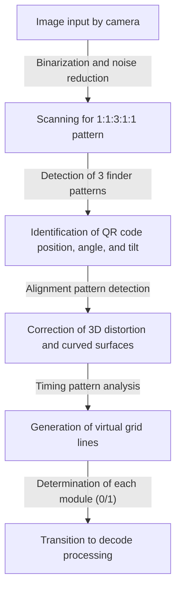
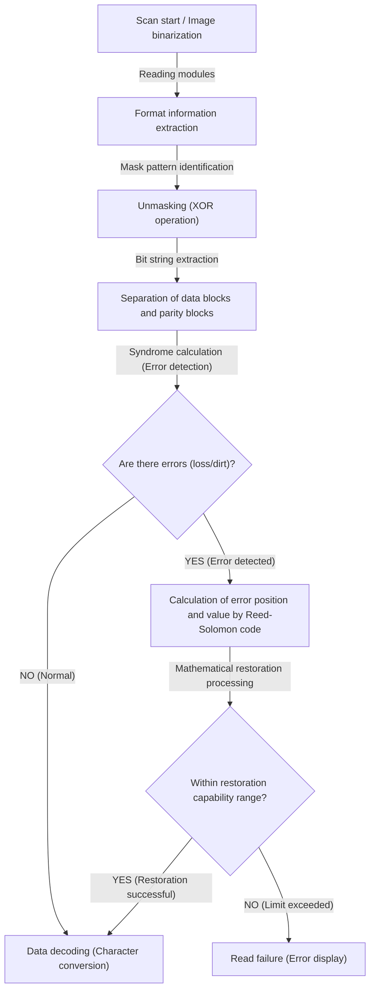

## Introduction: The Masterpiece of 2D Codes Supporting Our Lives

Cashless payments, website access, airplane boarding passes, and even parts management in factories - there is not a day we don't see "QR Codes" (Quick Response Codes) in modern society. This technology, which instantly connects to digital data just by holding a smartphone up to a dedicated reader or camera, can be said to be one of the most widespread infrastructure technologies in the world today.

However, think about it carefully. Even if a QR code printed on a poster is a little blurred from rain, or the paper is bent and partially torn, why can our smartphones access the website without any problems? With conventional 1D barcodes, if even a single line is missing or dirty, it immediately results in a "read error".

Behind this astonishing reading performance lies extremely advanced and sophisticated engineering and mathematical algorithms developed by the Japanese company DENSO WAVE (then DENSO) in 1994. In this article, we will visually and in detail unravel the mystery of why QR codes are fast and overwhelmingly resistant to dirt and damage, based on three core mechanisms: the "meticulous design of arrangement patterns", "masking processing to optimize data recognition", and "error correction technology that resurrects data like a phoenix".

## The First Secret: "Geometric Arrangement Patterns" That Don't Confuse Cameras

The small black and white squares that make up a QR code are called "modules". At first glance, they may look like randomly scattered modem noise, but inside the QR code, there are several "fixed signposts" embedded for the scanner (camera) to recognize the code and grasp the exact orientation and perspective.

The reason cameras on smartphones can instantly find a QR code from within an image frame and read the exact data is thanks to the calculated arrangement patterns shown below.

### 1. Finder Patterns (Position Detection Patterns): Recognizable from 360 Degrees Anywhere
These are large double squares (shaped like target marks) placed at three corners of the QR code (usually top left, top right, and bottom left). It is no exaggeration to say this is the greatest feature of a QR code.

A "magic ratio" is hidden within this finder pattern. No matter what angle a straight line is drawn through the center, it is designed so that the ratio of the lengths of the black and white parts is always "Black: White: Black: White: Black = 1: 1: 3: 1: 1".
When image processing software scans the camera footage with scanning lines, it looks for this "1:1:3:1:1" pattern. Because this ratio extremely rarely occurs by chance in nature or normal printed materials, the software can recognize "there is a QR code here" at high speed and with high precision. Furthermore, because they are placed in three locations, the system can instantly recalculate the correct orientation even if the QR code is upside down or at an angle.

### 2. Alignment Patterns: Relay Points to Correct Distortion
QR codes have sizes from "Version 1" to "Version 40" depending on the amount of data to be stored. As the version increases (the number of modules increases), small square patterns placed inside the code are "alignment patterns".

When paper is bent or a camera is held at an extreme angle, the grid of modules appears distorted due to the lens's perspective. Alignment patterns function as "coordinate reference points" to correct this distortion. The scanner detects these patterns and virtually remaps the bent grid onto a flat 2D plane, enabling accurate reading of the modules.

### 3. Timing Patterns: Rulers That Derive Module Coordinates
These are straight lines consisting of alternating black and white modules placed in an L-shape, connecting the finder patterns. This is called the "timing pattern" and acts as a "ruler" to accurately grasp the coordinates of the modules in the data area. Even when the version of the QR code is unknown, the scanner can accurately calculate the total number of modules (resolution) of the entire QR code by counting the number of alternating black and white, and accurately generate the grid.

### 4. Quiet Zone: The Boundary Separating Noise and Signal
This is a blank space with nothing printed that is always provided around the QR code. The standard specification requires a width of 4 modules around the perimeter. The existence of this blank space allows the image recognition algorithm to clearly separate the QR code body area from surrounding background noise (text, photos, etc.) and establish boundaries.

## The Second Secret: "Masking Processing" That Prevents Software Confusion

If QR code data is converted directly into black and white dots and placed, a serious problem may occur. That is, purely by chance, "large blocks where black modules are clustered" or "areas of mostly white modules" could be created.
Moreover, in the worst-case scenario, it is conceivable that an arrangement identical to the finder pattern's "1:1:3:1:1" might accidentally appear within the data area. If these happen, the scanner would lose track of module boundaries or mistakenly identify them as finder patterns, causing an error.

This is completely prevented by an ingenious technology called "masking processing".

### The Advanced Algorithm of Masking Processing
When generating a QR code, the encoder (generation software) does not place the data as is; it mathematically overlays (XOR operation: exclusive OR) 8 types of pre-defined "mask patterns" (regular patterns such as checkerboards, stripes, diagonal grids, etc.) onto the data area.

The encoder does not just apply a single mask, but surprisingly generates internally "8 test codes applying all 8 types of masks individually". Then, it performs a strict "penalty evaluation" on each test code. The evaluation criteria are as follows:

1. **Consecutive same colors**: Are there 5 or more modules of the same color (black or white) consecutively vertically or horizontally?
2. **Large blocks**: How many blocks of the same color that are 2x2 modules or larger exist?
3. **Occurrence of similar patterns**: Does it contain a "1:1:3:1:1" arrangement resembling a finder pattern?
4. **Overall black and white ratio**: How much does the overall ratio of black to white modules deviate from 50:50?

The system calculates a penalty score based on these conditions and adopts the mask pattern with the lowest score (meaning black and white are most well-balanced and easiest to read) as the final output.

The type of mask adopted (3-bit information from 000 to 111) is recorded in the "format information" area within the QR code. When a scanner reads a QR code, it first retrieves this format information, unmasks it by applying the same mask pattern again via an XOR operation, and restores the original data. Through this unseen ingenuity, the camera is always able to recognize high contrast and uniform patterns.

## The Third Secret: The Biggest Reason It Can Be Read Even If Dirty, "Error Correction Technology"

The biggest reason why QR codes have overwhelming robustness compared to other 2D codes, and the magical mechanism that allows data to be perfectly restored even if partially dirty, torn, or hidden, is the error correction technology utilizing "Reed-Solomon error correction".

### What Is the "Reed-Solomon Code" from Space Communication?
The Reed-Solomon code is a mathematical algorithm originally developed in the 1960s. Its initial uses were for noise correction in weak communications from space probes like Voyager, and for repairing data read errors caused by surface scratches on optical media like CDs and DVDs.

This algorithm performs advanced polynomial calculations on the original data (message) and generates and attaches redundant data for restoration called "parity data". Even if part of the data is lost, by solving the remaining normal data and parity data like a system of simultaneous equations, it is possible to mathematically calculate backwards and completely restore the missing parts of the data.

### Four Error Correction Levels to Choose According to Use
QR codes come standard with this powerful Reed-Solomon code, and you can select from four levels of error correction (ECC levels) depending on the intended use when creating one. The higher the level is set, the higher the restoration capability, but because the proportion of parity data in the code increases, the amount of actual data that can be stored decreases, or the size (version) of the QR code itself must be made larger.

- **Level L (Low - approx. 7% restoration capability)**: Used in favorable reading environments, such as environments with little dirt or QR codes displayed on screens. Ideal when you want to maximize data capacity.
- **Level M (Medium - approx. 15% restoration capability)**: The most standard level used in general printed materials and websites.
- **Level Q (Quartile - approx. 25% restoration capability)**: Recommended for environments where dirt or damage is expected, such as outdoor posters or delivery slips.
- **Level H (High - approx. 30% restoration capability)**: Used in harsh environments like factories for parts management, or in applications requiring the highest reliability.

### The Mechanism of Design QR Codes: Turning Errors to Advantage
Recently, it is common to see highly designed QR codes with corporate logos or character illustrations placed in the center. You might wonder, "Is it okay to paint over a part of a QR code with an illustration?", but this is exactly a clever use (hack) of this "error correction technology".

When creating a design QR code, the encoder sets the error correction level to the highest "Level H (30%)" in advance. Then, it places a logo in the center to intentionally overwrite (destroy) data. From the scanner's perspective, the logo portion is recognized simply as a "massive dirt spot (loss)". However, because there is a 30% restoration capability from Level H, the data hidden by the logo is perfectly restored from the surrounding remaining data and parity data.

## Overall Flow of QR Code Decoding (Reading)

Here is a summary of the sequence of how the technologies explained so far work together and are processed in the mere fraction of a second when holding up a smartphone.

1. **Image Recognition and Geometric Correction**: Finds the 3 finder patterns from the footage captured by the camera and identifies the angle and tilt. Using alignment and timing patterns, it generates a virtual grid (mesh) while correcting image distortion.
2. **Format Information Retrieval**: Reads information on the used "error correction level" and "mask pattern" from special areas around the finder patterns.
3. **Unmasking**: Based on the retrieved mask pattern information, performs an XOR operation on the entire data area to reveal the hidden true data array.
4. **Data Arraying and Error Checking**: Following the rule of zigzagging from the bottom right, converts the black and white modules into binary data (bit strings) of 0s and 1s.
5. **Execution of Error Correction**: Separates the bit string into a data part and a parity part, and performs verification using the Reed-Solomon code. If there is loss or noise, the original data is mathematically restored here.
6. **Data Interpretation**: Finally, it converts the bit strings into text or a URL according to the encoding mode (numeric, alphanumeric, binary, kanji, etc.) and displays it on the user's screen.

## Conclusion: A Crystallization of Engineering Packed into a Small Square

A QR code that you casually hold your smartphone up to. At first glance, it is merely a black and white mosaic pattern, but behind it exist multiple layers of technology: "geometric arrangement patterns" that assist optical image recognition to the limit, "masking processing" that optimizes visibility based on probability theory and computer science, and "error correction technology" utilizing advanced mathematics repurposed from space communication.

These complex algorithms are seamlessly integrated into a square of just a few centimeters, which is exactly why we can utilize QR codes completely stress-free, even under slight dirt, distortion, or poor lighting conditions. The next time you see a QR code at a cafe or on a poster, please give a thought to the meticulous coordination of engineering being executed dozens of times per second behind it.
