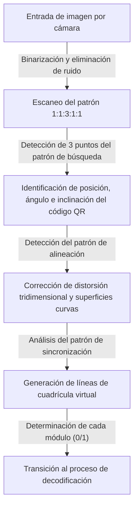
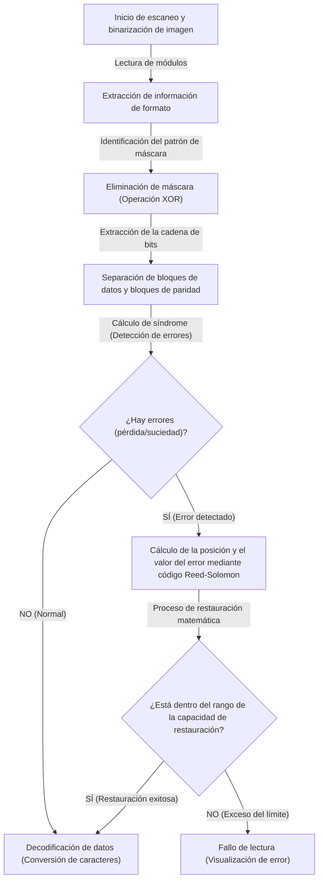

## Introducción: La obra maestra del código 2D que sustenta nuestras vidas

Desde pagos sin efectivo, acceso a sitios web y tarjetas de embarque de aviones, hasta la gestión de piezas en fábricas, no hay día en la sociedad moderna en el que no veamos un "Código QR" (Quick Response Code). Esta tecnología, que conecta instantáneamente con datos digitales con solo pasar un teléfono inteligente sobre un lector dedicado o una cámara, es hoy en día una de las tecnologías de infraestructura más extendidas del mundo.

Pero piénsalo un momento. ¿Por qué nuestros teléfonos inteligentes pueden acceder a un sitio web sin problemas incluso si el código QR impreso en un póster está un poco mojado y borroso por la lluvia, o si el papel está doblado y parcialmente roto? Si se tratara de un código de barras unidimensional tradicional, la falta de una sola línea o un poco de suciedad resultaría en un "error de lectura" inmediato.

Detrás de este asombroso rendimiento de lectura se esconde un nivel de ingeniería y algoritmos matemáticos extremadamente avanzados y sofisticados, desarrollados en 1994 por la empresa japonesa Denso Wave Incorporated (entonces Denso). En este artículo, desentrañaremos de manera visual y detallada la pregunta de por qué los códigos QR son tan rápidos y abrumadoramente resistentes a la suciedad y los daños, a partir de tres mecanismos centrales: "el diseño meticuloso de los patrones de posicionamiento", "el procesamiento de máscaras que optimiza el reconocimiento de datos" y "la tecnología de corrección de errores que revive los datos como un ave fénix".

## El primer secreto: "Patrones geométricos de posicionamiento" que no confunden a la cámara

Los pequeños cuadrados negros y blancos que componen un código QR se llaman "módulos". A primera vista, puede parecer como el ruido de un módem esparcido de manera desordenada, pero dentro de un código QR hay integradas varias "señales fijas" para que el escáner (cámara) reconozca el código y capte la orientación y perspectiva exactas.

El hecho de que la cámara de un teléfono inteligente pueda encontrar instantáneamente el código QR dentro del marco de la imagen y leer los datos con precisión se debe a los patrones de posicionamiento calculados minuciosamente que se muestran a continuación.

### 1. Patrón de búsqueda (Patrón de detección de posición): Reconocible desde cualquier ángulo de 360 grados
Estos son los grandes cuadrados dobles (con forma de marca de objetivo) ubicados en las tres esquinas del código QR (generalmente arriba a la izquierda, arriba a la derecha y abajo a la izquierda). No es exagerado decir que esta es la característica principal de los códigos QR.

Este patrón de búsqueda oculta una "proporción mágica". Está diseñado para que, sin importar en qué ángulo se trace una línea recta a través del centro, la proporción de la longitud de las partes negras y blancas siempre será "Negro: Blanco: Negro: Blanco: Negro = 1: 1: 3: 1: 1".
Cuando el software de procesamiento de imágenes escanea la imagen de la cámara mediante líneas de exploración, busca este patrón "1:1:3:1:1". Como es extremadamente raro que esta proporción ocurra por casualidad en la naturaleza o en materiales impresos regulares, el software puede reconocer que "aquí hay un código QR" a alta velocidad y con gran precisión. Además, dado que está ubicado en tres lugares, incluso si el código QR está al revés o inclinado, el sistema puede recalcular instantáneamente la orientación correcta.

### 2. Patrón de alineación: Punto intermedio para corregir la distorsión
Los códigos QR vienen en tamaños desde la "Versión 1" hasta la "Versión 40" dependiendo de la cantidad de datos que almacenan. A medida que aumenta la versión (y el número de módulos), el pequeño patrón cuadrado colocado dentro del código es el "patrón de alineación".

Si el papel está doblado o la cámara se sostiene en un ángulo extremo, la cuadrícula de módulos parecerá distorsionada debido a la perspectiva de la lente. El patrón de alineación funciona como un "punto de referencia de coordenadas" para corregir esta distorsión. Los escáneres detectan estos patrones y vuelven a mapear virtualmente la cuadrícula curva en un plano bidimensional plano, lo que permite una lectura precisa de los módulos.

### 3. Patrón de sincronización: Regla para derivar las coordenadas de los módulos
Es una línea recta de colores alternos negro y blanco en forma de L que conecta los patrones de búsqueda entre sí. Se denomina "patrón de sincronización" y cumple el rol de "regla" para comprender con precisión las coordenadas de los módulos en el área de datos. Incluso si se desconoce la versión del código QR, el escáner puede contar estos colores alternantes blanco y negro para calcular con precisión el número total de módulos (resolución) de todo el código QR y generar la cuadrícula (matriz) de manera precisa.

### 4. Zona silenciosa: El límite que separa el ruido y la señal
Es un margen en blanco sin imprimir que siempre se proporciona alrededor del código QR. La norma estándar requiere un ancho de 4 módulos alrededor del código. La existencia de este margen permite que el algoritmo de reconocimiento de imágenes separe claramente el área principal del código QR del ruido de fondo circundante (como texto o fotos) y determine los límites.

## El segundo secreto: "Procesamiento de máscaras" para evitar la confusión del software

Si los datos de un código QR se convierten directamente en puntos blancos y negros y se colocan tal cual, puede ocurrir un problema grave. Es decir, pueden formarse accidentalmente "grandes bloques de módulos negros agrupados" o "áreas con solo módulos blancos".
Además, en el peor de los casos, la misma secuencia que el patrón de búsqueda "1:1:3:1:1" podría ocurrir accidentalmente en el área de datos. Si esto sucede, el escáner perderá de vista el límite del módulo o lo identificará erróneamente como un patrón de búsqueda, provocando un error.

La técnica ingeniosa para prevenir esto por completo es el "procesamiento de máscaras (enmascaramiento)".

### Algoritmo avanzado del procesamiento de máscaras
Al generar un código QR, el codificador (software de generación) no coloca los datos tal cual, sino que superpone matemáticamente (operación XOR: O exclusivo) 8 tipos predefinidos de "patrones de máscara" (patrones regulares como tableros de ajedrez, rayas o cuadrículas diagonales) sobre el área de datos.

El codificador no aplica un solo tipo de máscara, sino que sorprendentemente genera internamente "8 códigos de prueba aplicando individualmente cada uno de los 8 tipos de máscara". Luego, realiza una estricta "evaluación de penalización" para cada código de prueba. Los criterios de evaluación son los siguientes:

1. **Continuidad del mismo color**: ¿Hay 5 o más módulos del mismo color (blanco o negro) alineados vertical u horizontalmente?
2. **Bloques grandes**: ¿Cuántos bloques de 2x2 módulos o mayores del mismo color existen?
3. **Aparición de patrones similares**: ¿Está incluida la secuencia "1:1:3:1:1" que se asemeja al patrón de búsqueda?
4. **Proporción total de blanco y negro**: ¿Qué tanto se desvía la proporción total de módulos negros y blancos de 50:50?

El sistema calcula una puntuación de penalización basándose en estas condiciones y adopta el patrón de máscara con la puntuación más baja (es decir, el que tiene la mejor dispersión de blanco y negro y es más fácil de leer) como resultado final.

El tipo de máscara adoptada (información de 3 bits de 000 a 111) se registra en el área de "información de formato" dentro del código QR. Cuando el escáner lee el código QR, primero obtiene esta información de formato y vuelve a aplicar el mismo patrón de máscara a través de una operación XOR para eliminar la máscara y restaurar los datos originales. Gracias a esta ingeniosa técnica invisible, la cámara siempre puede percibir un alto contraste y un patrón uniforme.

## El tercer secreto: La mayor razón por la que se puede leer aunque esté sucio, "Tecnología de corrección de errores"

La principal razón por la que el código QR tiene una robustez abrumadora en comparación con otros códigos bidimensionales, y el mecanismo mágico que permite que los datos se restauren perfectamente incluso si parte de ellos están sucios, rotos u ocultos, es la tecnología de corrección de errores que utiliza el "código Reed-Solomon (Reed-Solomon error correction)".

### ¿Qué es el "código Reed-Solomon" proveniente de la comunicación espacial?
El código Reed-Solomon es un algoritmo matemático desarrollado originalmente en la década de 1960. Sus aplicaciones iniciales fueron para la corrección de ruido en comunicaciones débiles desde sondas espaciales como la Voyager, y para reparar errores de lectura de datos causados por rasguños en la superficie de medios ópticos como CD y DVD.

Este algoritmo realiza operaciones polinómicas avanzadas sobre los datos originales (el mensaje) para generar y adjuntar datos redundantes para la restauración llamados "datos de paridad". Incluso si falta una parte de los datos, resolviendo los datos normales restantes y los datos de paridad como un sistema de ecuaciones simultáneas, los datos de la parte perdida se pueden calcular a la inversa y restaurar completamente de manera matemática.

### Cuatro niveles de corrección de errores para elegir según el uso
El código QR incorpora este poderoso código Reed-Solomon como estándar, permitiendo seleccionar entre 4 niveles de corrección de errores (niveles ECC) según el uso al crearlo. Cuanto más alto sea el nivel, mayor será la capacidad de restauración, pero dado que aumenta la proporción de datos de paridad dentro del código, la cantidad de datos reales que se pueden almacenar disminuye o el tamaño del propio código QR (versión) debe ser mayor.

- **Nivel L (Low - Capacidad de restauración de aprox. 7%)**: Se utiliza en entornos con poca suciedad o para códigos QR que se muestran en pantallas donde el entorno de lectura es óptimo. Es ideal cuando se desea maximizar la capacidad de datos.
- **Nivel M (Medium - Capacidad de restauración de aprox. 15%)**: Es el nivel más estándar y comúnmente utilizado para materiales impresos en general o sitios web.
- **Nivel Q (Quartile - Capacidad de restauración de aprox. 25%)**: Se recomienda para entornos donde se espera suciedad o daño, como en pósteres al aire libre o recibos de entrega.
- **Nivel H (High - Capacidad de restauración de aprox. 30%)**: Se utiliza para la gestión de piezas en entornos difíciles como fábricas o en aplicaciones donde se requiere la más alta fiabilidad.

### El mecanismo de los códigos QR de diseño: Usando los errores a su favor
Últimamente, vemos a menudo códigos QR con diseños atractivos en los que se ha colocado el logotipo de una empresa o la ilustración de un personaje en el centro. Uno podría preguntarse: "¿Está bien tapar parte del código QR con una ilustración?", pero esto es exactamente un uso inteligente (hackeo) de esta "tecnología de corrección de errores".

Al crear un código QR de diseño, el codificador configura de antemano el nivel de corrección de errores al más alto, el "Nivel H (30%)". Luego, coloca un logotipo en el centro, sobrescribiendo (destruyendo) intencionalmente los datos. Desde la perspectiva del escáner, la porción del logotipo simplemente se reconoce como una "gran mancha (pérdida)". Sin embargo, gracias a la capacidad de restauración del 30% del Nivel H, los datos ocultos por el logotipo se restauran perfectamente a partir de los datos circundantes restantes y los datos de paridad.

## Flujo general de decodificación (lectura) del código QR

Resumiremos el flujo para mostrar cómo todas las tecnologías explicadas hasta ahora interactúan y se procesan en menos de 0.1 segundos, justo cuando sostienes tu teléfono inteligente.

1. **Reconocimiento de imagen y corrección geométrica**: A partir de la imagen capturada por la cámara, encuentra los tres patrones de búsqueda e identifica el ángulo e inclinación. Utilizando los patrones de alineación y sincronización, corrige la distorsión de la imagen mientras genera una cuadrícula virtual (malla).
2. **Adquisición de la información de formato**: Desde un área especial alrededor de los patrones de búsqueda, lee la información sobre el "nivel de corrección de errores" y el "patrón de máscara" utilizados.
3. **Eliminación de la máscara**: Con base en la información del patrón de máscara obtenida, realiza una operación XOR en toda el área de datos, revelando la verdadera matriz de datos oculta.
4. **Disposición de datos y verificación de errores**: Siguiendo una regla de movimiento en zigzag desde la parte inferior derecha, convierte los módulos blancos y negros en datos binarios de 0 y 1 (cadenas de bits).
5. **Ejecución de la corrección de errores**: Divide la cadena de bits en la parte de datos y la parte de paridad, y realiza la verificación mediante el código Reed-Solomon. Si hay pérdida o ruido, restaura matemáticamente los datos originales aquí.
6. **Interpretación de datos**: Finalmente, según el modo de codificación (numérico, alfanumérico, binario, kanji, etc.), convierte la cadena de bits en caracteres o una URL y la muestra en la pantalla del usuario.

## Resumen: La cristalización de la ingeniería condensada en un pequeño cuadrado

El código QR que casualmente escaneas con tu smartphone. A primera vista no es más que un simple patrón de mosaico en blanco y negro, pero detrás de él hay múltiples capas de tecnología: "patrones geométricos de posicionamiento" que ayudan al máximo al reconocimiento óptico de imágenes, "procesamiento de máscaras" para optimizar la visibilidad basada en la teoría de la probabilidad y la informática, y "tecnología de corrección de errores" impulsada por matemáticas avanzadas adaptadas de las comunicaciones espaciales.

Solo porque estos complejos algoritmos están integrados de manera perfecta en un cuadrado de pocos centímetros, podemos utilizar los códigos QR sin ningún tipo de estrés, incluso si están un poco sucios, distorsionados o bajo malas condiciones de luz. La próxima vez que veas un código QR en un café o en un póster, piensa en la intrincada colaboración de ingeniería que se ejecuta docenas de veces por segundo en el fondo.
