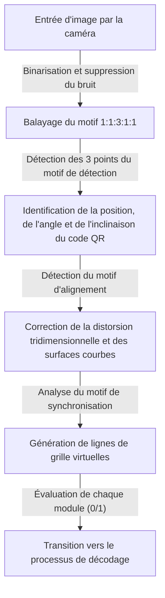
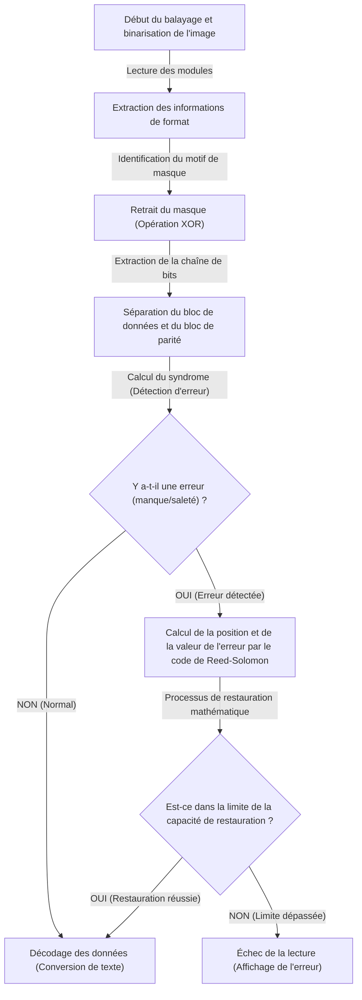

## Introduction : Le chef-d'œuvre des codes bidimensionnels qui soutient notre vie quotidienne

Que ce soit pour les paiements sans espèces, l'accès à un site web, les cartes d'embarquement des avions, ou même la gestion des pièces dans les usines, il ne se passe pas un jour sans que nous ne voyions un « code QR (Quick Response Code) » dans la société moderne. En passant simplement un smartphone devant un lecteur dédié ou une caméra, cette technologie se connecte instantanément aux données numériques, et on peut dire qu'elle est aujourd'hui l'une des technologies d'infrastructure les plus répandues dans le monde.

Cependant, réfléchissez bien. Même si le code QR imprimé sur une affiche est légèrement flou à cause de la pluie, ou si le papier est plié et partiellement déchiré, pourquoi nos smartphones peuvent-ils toujours accéder au site web sans problème ? Avec les codes-barres unidimensionnels traditionnels, s'il manque ne serait-ce qu'une seule ligne ou si elle est sale, une « erreur de lecture » se produit immédiatement.

Derrière cette incroyable performance de lecture se cachent une ingénierie et des algorithmes mathématiques extrêmement avancés et sophistiqués, développés par la société japonaise Denso Wave (anciennement Denso) en 1994. Dans cet article, pour répondre à la question de savoir pourquoi les codes QR sont si rapides et si résistants à la saleté et aux dommages, nous allons analyser visuellement et en détail trois mécanismes fondamentaux : la « conception minutieuse des motifs de positionnement », le « traitement de masquage qui optimise la reconnaissance des données », et la « technologie de correction d'erreurs qui ressuscite les données tel un phénix ».

## Le 1er secret : Les « motifs de positionnement géométriques » qui évitent à la caméra de se perdre

Les petits carrés noirs et blancs qui composent un code QR sont appelés des « modules ». À première vue, cela pourrait ressembler au bruit d'un modem dispersé de manière chaotique, mais à l'intérieur du code QR sont intégrés plusieurs « points de repère fixes » qui permettent au scanner (caméra) de reconnaître le code et de saisir précisément son orientation et sa perspective.

La raison pour laquelle les caméras des smartphones et d'autres appareils peuvent trouver instantanément le code QR dans le cadre de l'image et lire avec précision les données est grâce aux motifs de positionnement calculés présentés ci-dessous.

### 1. Motif de détection (Motif de recherche de position) : Reconnaissable de n'importe où à 360 degrés
Ce sont les grands carrés doubles (ressemblant à une cible) situés aux trois coins du code QR (généralement en haut à gauche, en haut à droite, et en bas à gauche). On ne serait pas exagéré de dire que c'est la caractéristique la plus importante du code QR.

Ce motif de détection cache une certaine « proportion magique ». Même si vous tracez une ligne droite passant par le centre à n'importe quel angle, le rapport de longueur entre les parties noires et les parties blanches est conçu pour être toujours de « noir : blanc : noir : blanc : noir = 1 : 1 : 3 : 1 : 1 ».
Lors du balayage de l'image de la caméra avec des lignes de balayage, le logiciel de traitement d'image recherche ce motif de « 1:1:3:1:1 ». Cette proportion étant extrêmement rare dans la nature ou dans les imprimés ordinaires, le logiciel peut reconnaître à grande vitesse et avec une haute précision qu'« un code QR se trouve ici ». De plus, comme ils sont placés à trois endroits, même si le code QR est à l'envers ou de travers, le système peut recalculer instantanément l'orientation correcte.

### 2. Motif d'alignement : Le point de relais pour corriger la distorsion
Les codes QR existent dans des tailles allant de la « Version 1 » à la « Version 40 » en fonction de la quantité de données à stocker. À mesure que la version augmente (et que le nombre de modules augmente), de petits motifs carrés placés à l'intérieur du code sont appelés « motifs d'alignement ».

Si le papier est plié, ou si la caméra est pointée d'un angle extrême, la grille des modules semble déformée en raison de la perspective de l'objectif (effet de profondeur). Le motif d'alignement sert de « point de référence de coordonnées » pour corriger cette distorsion. Le scanner détecte ces motifs et redéfinit virtuellement la grille courbée sur un plan bidimensionnel plat, permettant ainsi une lecture précise des modules.

### 3. Motif de synchronisation : La règle pour dériver les coordonnées des modules
C'est une ligne droite de couleurs noire et blanche alternées disposée en forme de L, reliant les motifs de détection. On l'appelle le « motif de synchronisation », et il joue le rôle de « règle » pour saisir avec précision les coordonnées des modules dans la zone de données. Même si la version du code QR est inconnue, le scanner peut calculer précisément le nombre total de modules (résolution) du code QR en comptant cette alternance de noir et blanc, et générer la grille avec précision.

### 4. Zone de silence : La frontière séparant le bruit et le signal
C'est la marge vide obligatoire entourant le code QR où rien n'est imprimé. La norme standard exige une largeur équivalente à 4 modules tout autour. Grâce à l'existence de cette marge, l'algorithme de reconnaissance d'image peut séparer clairement la zone principale du code QR des bruits de fond (texte, photos, etc.) et déterminer la ligne de démarcation.

## Le 2ème secret : Le « traitement de masquage » qui empêche la confusion logicielle

Si l'on convertissait directement les données du code QR en points noirs et blancs, un grave problème pourrait survenir. Il pourrait se créer par hasard de « gros blocs où les modules noirs sont concentrés » ou « des zones contenant uniquement des modules blancs ».
De plus, dans le pire des cas, il est également possible qu'une séquence de « 1:1:3:1:1 », identique au motif de détection, apparaisse accidentellement dans la zone de données. Si cela se produit, le scanner perdrait de vue la ligne de démarcation des modules, ou le confondrait avec un motif de détection et provoquerait une erreur.

La technique ingénieuse pour éviter cela complètement est le « traitement de masquage » (masking).

### L'algorithme avancé du traitement de masquage
Lors de la génération d'un code QR, l'encodeur (logiciel de génération) ne place pas les données telles quelles, mais superpose mathématiquement (opération XOR : OU exclusif) l'un des 8 types de « motifs de masquage » prédéfinis (motifs réguliers comme le damier, les rayures, la grille diagonale, etc.) sur la zone de données.

L'encodeur n'applique pas seulement un masque, mais génère en fait « 8 codes de test en appliquant individuellement les 8 types de masques » en interne. Ensuite, il effectue une « évaluation de pénalité » stricte pour chaque code de test. Les critères d'évaluation sont les suivants :

1. **Continuité de la même couleur** : Y a-t-il plus de 5 modules de la même couleur (noir ou blanc) alignés verticalement ou horizontalement ?
2. **Grands blocs** : Combien y a-t-il de blocs de 2×2 modules ou plus de la même couleur ?
3. **Apparition de motifs similaires** : Y a-t-il une séquence de « 1:1:3:1:1 » semblable au motif de détection ?
4. **Ratio global noir/blanc** : De combien le ratio global des modules noirs par rapport aux modules blancs s'écarte-t-il de 50:50 ?

Le système calcule un score de pénalité basé sur ces conditions, et adopte le motif de masque ayant le score le plus bas (c'est-à-dire celui où le noir et le blanc sont le mieux répartis et le plus facile à lire) comme sortie finale.

Le type de masque adopté (informations sur 3 bits de 000 à 111) est enregistré dans la zone d'« informations de format » au sein du code QR. Lors de la lecture du code QR, le scanner acquiert d'abord ces informations de format, puis applique à nouveau le même motif de masque via une opération XOR pour retirer le masque et restaurer les données d'origine. Grâce à cette astuce invisible, la caméra peut toujours percevoir un contraste élevé et un motif uniforme.

## Le 3ème secret : La principale raison pour laquelle il peut être lu même s'il est sale, la « technologie de correction d'erreurs »

La raison majeure pour laquelle le code QR possède une robustesse écrasante par rapport aux autres codes bidimensionnels, et la mécanique magique qui permet de restaurer parfaitement les données même si une partie est sale, déchirée ou cachée, est la technologie de correction d'erreurs utilisant le « code de Reed-Solomon » (Reed-Solomon error correction).

### Qu'est-ce que le « code de Reed-Solomon » issu de la communication spatiale ?
Le code de Reed-Solomon est un algorithme mathématique initialement développé dans les années 1960. Ses premières applications concernaient la correction du bruit dans les communications faibles provenant des sondes spatiales comme Voyager, ainsi que la réparation des erreurs de lecture de données dues aux rayures de surface sur les supports optiques tels que les CD et DVD.

Cet algorithme effectue des opérations polynomiales avancées sur les données d'origine (le message) pour générer et ajouter des données redondantes à des fins de restauration, appelées « données de parité ». Même si une partie des données est perdue, en résolvant mathématiquement les données normales restantes et les données de parité comme des équations simultanées, il est possible de rétro-calculer et de restaurer complètement les données de la partie manquante.

### 4 niveaux de correction d'erreurs sélectionnables selon l'utilisation
Les codes QR intègrent par défaut ce puissant code de Reed-Solomon, et il est possible de choisir lors de la création parmi 4 niveaux de correction d'erreurs (niveaux ECC) en fonction de l'utilisation. Plus le niveau est défini haut, plus la capacité de restauration augmente, mais comme la proportion de données de parité dans le code augmente, la quantité de données réelles stockables diminue, ou bien il faut augmenter la taille (la version) du code QR lui-même.

- **Niveau L (Low - environ 7% de capacité de restauration)** : Utilisé dans les environnements où il y a peu de saleté, comme les codes QR affichés à l'écran, ou lorsque l'environnement de lecture est bon. Idéal lorsque l'on souhaite maximiser la capacité de données.
- **Niveau M (Medium - environ 15% de capacité de restauration)** : Le niveau le plus couramment utilisé pour les imprimés généraux et les sites web.
- **Niveau Q (Quartile - environ 25% de capacité de restauration)** : Recommandé pour les environnements où la saleté et les dommages sont prévus, comme les affiches en extérieur ou les bordereaux de livraison.
- **Niveau H (High - environ 30% de capacité de restauration)** : Utilisé dans des environnements difficiles comme les usines pour la gestion des pièces, ou dans les applications exigeant la plus haute fiabilité.

### Le mécanisme des codes QR de conception : Exploiter les erreurs
Récemment, on voit souvent des codes QR au design élaboré, avec le logo d'une entreprise ou l'illustration d'un personnage placé au centre. Vous pourriez vous demander : « Est-il vraiment possible de colorier une partie du code QR avec une illustration ? », mais cela utilise (pirate) habilement cette « technologie de correction d'erreurs ».

Lors de la création d'un code QR de conception, l'encodeur fixe au préalable le niveau de correction d'erreurs à son maximum, le « Niveau H (30%) ». Ensuite, en plaçant le logo au centre, les données sont intentionnellement écrasées (détruites). Du point de vue du scanner, la partie du logo est simplement perçue comme une « immense saleté (perte) ». Cependant, grâce à la capacité de restauration de 30% offerte par le Niveau H, les données de la partie cachée par le logo sont parfaitement restaurées à partir des données restantes aux alentours et des données de parité.

## Le flux global du décodage (lecture) des codes QR

Voici un résumé du flux complet montrant comment les technologies expliquées jusqu'ici interagissent et sont traitées en moins de 0,1 seconde lorsque vous passez votre smartphone.

1. **Reconnaissance d'image et correction géométrique** : À partir de la vidéo capturée par la caméra, il trouve les trois motifs de détection et détermine l'angle et l'inclinaison. À l'aide de l'alignement et du motif de synchronisation, il génère une grille virtuelle (maillage) tout en corrigeant la distorsion de l'image.
2. **Acquisition des informations de format** : Il lit les informations sur le « niveau de correction d'erreurs » et le « motif de masque » utilisés à partir de la zone spéciale autour du motif de détection.
3. **Retrait du masque** : Sur la base des informations de motif de masque acquises, il effectue une opération XOR sur toute la zone de données, faisant ressortir le véritable tableau de données caché.
4. **Mise en tableau des données et vérification des erreurs** : Selon la règle d'avancement en zigzag à partir du bas à droite, il convertit le noir et le blanc des modules en données binaires 0 et 1 (chaîne de bits).
5. **Exécution de la correction d'erreurs** : Il divise la chaîne de bits en partie de données et partie de parité, et effectue une vérification à l'aide du code de Reed-Solomon. S'il y a des pertes ou du bruit, il restaure mathématiquement les données d'origine ici.
6. **Interprétation des données** : Enfin, selon le mode d'encodage (numérique, alphanumérique, binaire, Kanji, etc.), il convertit la chaîne de bits en caractères ou en URL et l'affiche sur l'écran de l'utilisateur.

## Conclusion : Un chef-d'œuvre d'ingénierie concentré dans un petit carré

Les codes QR devant lesquels nous passons nonchalamment nos smartphones. À première vue, cela n'est rien d'autre qu'un motif de mosaïque noir et blanc, mais derrière, se trouvent de nombreuses couches de technologies : les « motifs de positionnement géométriques » qui aident au maximum la reconnaissance optique d'image, le « traitement de masquage » qui optimise la visibilité sur la base de la théorie des probabilités et de la science informatique, et la « technologie de correction d'erreurs » par des mathématiques avancées détournées de la communication spatiale.

C'est parce que ces algorithmes complexes sont parfaitement intégrés dans un carré de quelques centimètres seulement, que nous pouvons utiliser les codes QR sans aucun stress, même s'il y a un peu de saleté, de distorsion, ou sous des conditions d'éclairage défavorables. La prochaine fois que vous verrez un code QR dans un café ou sur une affiche, pensez à la coordination de l'ingénierie méticuleuse qui s'exécute des dizaines de fois par seconde en arrière-plan.
