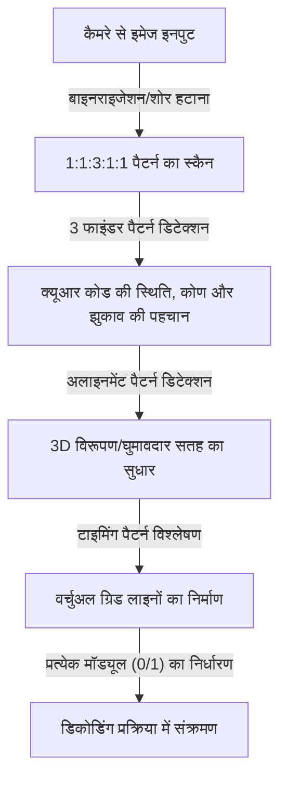
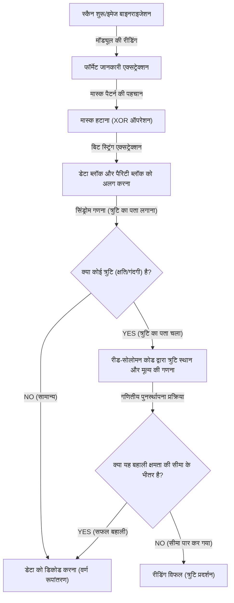

## प्रस्तावना: हमारे जीवन को समर्थन देने वाले 2D कोड की एक उत्कृष्ट कृति

कैशलेस भुगतान, वेबसाइटों तक पहुंच, हवाई जहाज के बोर्डिंग पास, और यहां तक कि कारखानों में इन्वेंट्री प्रबंधन - आधुनिक समाज में शायद ही कोई ऐसा दिन गुजरता हो जब हम "क्यूआर कोड (क्विक रिस्पांस कोड)" न देखते हों। अपने स्मार्टफोन को एक समर्पित रीडर या कैमरे के सामने पकड़कर तुरंत डिजिटल डेटा से जुड़ने की यह तकनीक अब दुनिया में सबसे व्यापक रूप से उपयोग की जाने वाली इंफ्रास्ट्रक्चर तकनीकों में से एक कही जा सकती है।

लेकिन इसके बारे में सोचें। यदि पोस्टर पर छपा क्यूआर कोड बारिश से भीगकर थोड़ा धुंधला हो गया है, या कागज मुड़ गया है और उसका एक हिस्सा फट गया है, तो भी हमारा स्मार्टफोन बिना किसी समस्या के वेबसाइट तक कैसे पहुंच सकता है? पारंपरिक 1D बारकोड के साथ, यदि एक लाइन भी गायब या गंदी है, तो यह तुरंत "रीडिंग एरर" में बदल जाता है।

इस अविश्वसनीय रीडिंग प्रदर्शन के पीछे अत्यंत उन्नत और परिष्कृत इंजीनियरिंग और गणितीय एल्गोरिदम छिपे हैं जिन्हें 1994 में जापानी कंपनी डेंसो वेव (उस समय डेंसो) द्वारा विकसित किया गया था। इस लेख में, हम तीन मुख्य तंत्रों के माध्यम से इस रहस्य को दृष्टिगत और विस्तार से सुलझाएंगे कि क्यूआर कोड इतने तेज़ और गंदगी तथा क्षति के प्रति अत्यधिक प्रतिरोधी क्यों हैं: "लेआउट पैटर्न का सावधानीपूर्वक डिज़ाइन," "डेटा पहचान को अनुकूलित करने के लिए मास्क प्रोसेसिंग," और "त्रुटि सुधार तकनीक जो डेटा को फीनिक्स की तरह पुनर्जीवित करती है।"

## पहला रहस्य: कैमरे को भ्रमित न करने वाला "ज्यामितीय लेआउट पैटर्न"

क्यूआर कोड बनाने वाले छोटे काले और सफेद वर्गों को "मॉड्यूल" कहा जाता है। पहली नज़र में, वे बेतरतीब ढंग से बिखरे हुए मॉडेम शोर की तरह लग सकते हैं, लेकिन क्यूआर कोड के भीतर कई "निश्चित साइनपोस्ट" एम्बेडेड होते हैं जो स्कैनर (कैमरे) को कोड को पहचानने और सटीक अभिविन्यास और परिप्रेक्ष्य को समझने की अनुमति देते हैं।

नीचे दिखाए गए सावधानीपूर्वक गणना किए गए लेआउट पैटर्न के कारण ही स्मार्टफोन जैसे कैमरे इमेज फ्रेम के भीतर क्यूआर कोड को तुरंत ढूंढ सकते हैं और सटीक डेटा पढ़ सकते हैं।

### 1. फाइंडर पैटर्न (पोजिशन डिटेक्शन पैटर्न): 360 डिग्री से कहीं भी पहचाना जा सकता है
ये बड़े दोहरे वर्ग (एक लक्ष्य चिह्न के आकार के) होते हैं जो क्यूआर कोड के तीन कोनों (आमतौर पर ऊपर बाएं, ऊपर दाएं और नीचे बाएं) में स्थित होते हैं। यह कहना अतिशयोक्ति नहीं होगी कि यह क्यूआर कोड की सबसे बड़ी विशेषता है।

इस फाइंडर पैटर्न में एक "जादुई अनुपात" छिपा है। इसे इस तरह डिज़ाइन किया गया है कि चाहे आप केंद्र से गुजरने वाली एक सीधी रेखा किसी भी कोण पर खींचें, काले और सफेद भागों की लंबाई का अनुपात हमेशा "काला: सफेद: काला: सफेद: काला = 1:1:3:1:1" होता है।
जब इमेज प्रोसेसिंग सॉफ्टवेयर स्कैनिंग लाइनों के साथ कैमरे के वीडियो को स्कैन करता है, तो यह इस "1:1:3:1:1" पैटर्न की खोज करता है। चूंकि यह अनुपात प्रकृति या सामान्य मुद्रित सामग्रियों में संयोग से होने की बहुत कम संभावना है, सॉफ्टवेयर उच्च गति और उच्च सटीकता के साथ पहचान सकता है कि "यहाँ एक क्यूआर कोड है"। साथ ही, चूंकि उन्हें तीन स्थानों पर रखा गया है, इसलिए भले ही क्यूआर कोड उल्टा हो या तिरछा हो, सिस्टम तुरंत सही अभिविन्यास की पुनर्गणना कर सकता है।

### 2. अलाइनमेंट पैटर्न: विरूपण को ठीक करने के लिए एक रिले बिंदु
संग्रहीत किए जाने वाले डेटा की मात्रा के आधार पर क्यूआर कोड "संस्करण 1" से "संस्करण 40" तक के आकार में आते हैं। जैसे-जैसे संस्करण बढ़ता है (मॉड्यूल की संख्या बढ़ती है), कोड के अंदर रखे गए छोटे चौकोर पैटर्न "अलाइनमेंट पैटर्न" होते हैं।

यदि कागज मुड़ा हुआ हैচৈতमुड़ा हुआ है या आप कैमरे को अत्यधिक कोण से पकड़ते हैं, तो लेंस के परिप्रेक्ष्य के कारण मॉड्यूल ग्रिड विकृत दिखाई देता है। अलाइनमेंट पैटर्न इस विरूपण को ठीक करने के लिए "निर्देशांक संदर्भ बिंदु" के रूप में कार्य करता है। स्कैनर इन पैटर्नों का पता लगाता है और मुड़े हुए ग्रिड को एक आभासी समतल 2D सतह पर फिर से मैप करता है, जिससे मॉड्यूल को सटीक रूप से पढ़ा जा सकता है।

### 3. टाइमिंग पैटर्न: मॉड्यूल के निर्देशांक प्राप्त करने के लिए एक रूलर
यह L-आकार में व्यवस्थित काले और सफेद रंग की एक वैकल्पिक रेखा है जो फाइंडर पैटर्नों को जोड़ती है। इसे "टाइमिंग पैटर्न" कहा जाता है और यह डेटा क्षेत्र में मॉड्यूल के निर्देशांक को सटीक रूप से समझने के लिए एक "रूलर" के रूप में कार्य करता है। यहां तक कि जब क्यूआर कोड का संस्करण अज्ञात होता है, स्कैनर इन वैकल्पिक काले और सफेद की संख्या की गणना करके पूरे क्यूआर कोड में मॉड्यूल (रिज़ॉल्यूशन) की संख्या की सटीक गणना कर सकता है और सटीक रूप से एक ग्रिड उत्पन्न कर सकता है।

### 4. क्वाइट ज़ोन: शोर और सिग्नल को अलग करने वाली एक सीमा रेखा
यह एक रिक्त मार्जिन है, जिसमें कुछ भी नहीं छपा होता है, जो हमेशा क्यूआर कोड के चारों ओर प्रदान किया जाता है। मानक को चारों ओर 4 मॉड्यूल की चौड़ाई की आवश्यकता होती है। इस मार्जिन के अस्तित्व के कारण, छवि पहचान एल्गोरिथ्म आसपास के पृष्ठभूमि शोर (पाठ, तस्वीरें, आदि) से क्यूआर कोड निकाय के क्षेत्र को स्पष्ट रूप से अलग कर सकता है और सीमा रेखा निर्धारित कर सकता है।

## दूसरा रहस्य: सॉफ़्टवेयर को भ्रमित होने से रोकने के लिए "मास्क प्रोसेसिंग"

यदि क्यूआर कोड के डेटा को सीधे काले और सफेद डॉट्स में बदल दिया जाए और रख दिया जाए, तो एक गंभीर समस्या उत्पन्न हो सकती है। वह यह है कि, संयोग से, "काले मॉड्यूल से भरे बड़े ब्लॉक" या "केवल सफेद मॉड्यूल वाले क्षेत्र" बन सकते हैं।
साथ ही, सबसे खराब स्थिति के रूप में, यह भी संभव है कि डेटा क्षेत्र के भीतर "1:1:3:1:1" का अनुक्रम, जो फाइंडर पैटर्न के समान है, संयोग से बन जाए। यदि ऐसा होता है, तो स्कैनर मॉड्यूल की सीमा का ट्रैक खो सकता है या गलती से इसे फाइंडर पैटर्न समझकर त्रुटि उत्पन्न कर सकता है।

इसे पूरी तरह से रोकने वाली अभिनव तकनीक "मास्क प्रोसेसिंग (मास्किंग)" है।

### मास्क प्रोसेसिंग का उन्नत एल्गोरिदम
क्यूआर कोड बनाते समय, एनकोडर (जेनरेशन सॉफ्टवेयर) डेटा को वैसे ही नहीं रखता है, बल्कि डेटा क्षेत्र पर पहले से परिभाषित 8 प्रकार के "मास्क पैटर्न" (चेकरबोर्ड, धारियां, विकर्ण ग्रिड, आदि जैसे नियमित पैटर्न) को गणितीय रूप से (XOR ऑपरेशन: एक्सक्लूसिव OR) ओवरले करता है।

एनकोडर केवल एक मास्क लागू नहीं करता है, बल्कि आश्चर्यजनक रूप से आंतरिक रूप से "सभी 8 प्रकार के मास्क को व्यक्तिगत रूप से लागू करके 8 परीक्षण कोड" उत्पन्न करता है। फिर, यह प्रत्येक परीक्षण कोड के लिए एक सख्त "पेनल्टी मूल्यांकन" आयोजित करता है। मूल्यांकन मानदंड निम्नलिखित हैं:

1. **एक ही रंग का लगातार होना**: क्या लंबवत या क्षैतिज रूप से लगातार 5 या अधिक मॉड्यूल एक ही रंग (काले या सफेद) के हैं?
2. **बड़े ब्लॉक**: 2x2 मॉड्यूल या उससे बड़े समान रंग के कितने ब्लॉक मौजूद हैं?
3. **समान पैटर्न की घटना**: क्या फाइंडर पैटर्न के समान "1:1:3:1:1" का अनुक्रम शामिल है?
4. **समग्र काला और सफेद अनुपात**: समग्र काले और सफेद मॉड्यूल का अनुपात 50:50 से कितना विचलित होता है?

सिस्टम इन शर्तों के आधार पर पेनल्टी स्कोर की गणना करता है, और सबसे कम स्कोर वाले मास्क पैटर्न (यानी, वह जिसमें काले और सफेद रंग सबसे संतुलित रूप से फैले हुए हैं और पढ़ने में सबसे आसान है) को अंतिम आउटपुट के रूप में अपनाता है।

अपनाए गए मास्क के प्रकार (000 से 111 तक की 3-बिट जानकारी) को क्यूआर कोड के भीतर "प्रारूप जानकारी" क्षेत्र में रिकॉर्ड किया जाता है। क्यूआर कोड पढ़ते समय, स्कैनर पहले इस प्रारूप जानकारी को प्राप्त करता है, उसी मास्क पैटर्न को फिर से XOR ऑपरेशन के साथ लागू करके मास्क को हटाता है, और मूल डेटा को पुनर्स्थापित करता है। इस अदृश्य सरलता के माध्यम से, कैमरा हमेशा उच्च कंट्रास्ट और एकसमान पैटर्न को पहचानने में सक्षम होता है।

## तीसरा रहस्य: गंदे होने पर भी पढ़े जा सकने का सबसे बड़ा कारण "त्रुटि सुधार तकनीक"

यह सबसे बड़ा कारण है कि अन्य 2D कोड की तुलना में क्यूआर कोड में अत्यधिक मजबूती होती है, और जादुई तंत्र जो डेटा को पूरी तरह से पुनर्स्थापित कर सकता है, भले ही इसका कुछ हिस्सा गंदा, फटा हुआ या छिपा हुआ हो, वह त्रुटि सुधार तकनीक है जो "रीड-सोलोमन कोड (Reed-Solomon error correction)" का उपयोग करती है।

### अंतरिक्ष संचार से आया "रीड-सोलोमन कोड" क्या है?
रीड-सोलोमन कोड मूल रूप से 1960 के दशक में विकसित एक गणितीय एल्गोरिदम है। इसके शुरुआती उपयोगों में वॉयजर जैसे अंतरिक्ष जांच से कमजोर संचार में शोर में सुधार, और सीडी तथा डीवीडी जैसे ऑप्टिकल मीडिया में सतह की खरोंच के कारण डेटा पढ़ने की त्रुटियों की मरम्मत करना शामिल था।

यह एल्गोरिदम मूल डेटा (संदेश) पर एक उन्नत बहुपद ऑपरेशन करता है और बहाली के लिए "पैरिटी डेटा" नामक निरर्थक डेटा उत्पन्न और जोड़ता है। यदि डेटा का एक हिस्सा गायब हो जाता है, तो भी शेष सामान्य डेटा और पैरिटी डेटा को एक साथ समीकरणों की तरह हल करके, खोए हुए हिस्से के डेटा को गणितीय रूप से पूरी तरह से उलटा और पुनर्स्थापित किया जा सकता है।

### उद्देश्य के अनुसार चुनने के लिए 4 त्रुटि सुधार स्तर
क्यूआर कोड मानक के रूप में इस शक्तिशाली रीड-सोलोमन कोड से सुसज्जित हैं, और आप निर्माण के समय उद्देश्य के अनुसार 4 स्तर के त्रुटि सुधार (ECC स्तर) का चयन कर सकते हैं। आप जितना ऊंचा स्तर निर्धारित करेंगे, बहाली क्षमता उतनी ही अधिक होगी, लेकिन चूंकि कोड के भीतर पैरिटी डेटा का अनुपात बढ़ जाता है, इसलिए संग्रहीत किए जा सकने वाले वास्तविक डेटा की मात्रा कम हो जाती है, या क्यूआर कोड का आकार (संस्करण) स्वयं बढ़ाना पड़ता है।

- **स्तर L (Low - लगभग 7% बहाली क्षमता)**: इसका उपयोग तब किया जाता है जब पढ़ने का वातावरण अच्छा होता है, जैसे कि कम गंदगी वाले वातावरण में या स्क्रीन पर प्रदर्शित क्यूआर कोड। यह तब आदर्श है जब आप डेटा क्षमता को अधिकतम करना चाहते हैं।
- **स्तर M (Medium - लगभग 15% बहाली क्षमता)**: यह सामान्य मुद्रित सामग्रियों और वेबसाइटों के लिए सबसे अधिक उपयोग किया जाने वाला मानक स्तर है।
- **स्तर Q (Quartile - लगभग 25% बहाली क्षमता)**: यह उन वातावरणों के लिए अनुशंसित है जहां गंदगी या क्षति की उम्मीद होती है, जैसे कि बाहरी पोस्टर या डिलीवरी स्लिप।
- **स्तर H (High - लगभग 30% बहाली क्षमता)**: इसका उपयोग कठोर वातावरण जैसे कारखानों में इन्वेंट्री प्रबंधन के लिए या ऐसे अनुप्रयोगों में किया जाता है जहां उच्चतम विश्वसनीयता की आवश्यकता होती है।

### डिज़ाइन क्यूआर कोड कैसे काम करते हैं: त्रुटियों का लाभ उठाना
हाल ही में, हम अक्सर उच्च डिज़ाइन वाले क्यूआर कोड देखते हैं जिनके केंद्र में किसी कंपनी का लोगो या चरित्र चित्रण रखा होता है। आप सोच सकते हैं, "क्या क्यूआर कोड के एक हिस्से को इलस्ट्रेशन से भर देना ठीक है?", लेकिन यह वास्तव में इस "त्रुटि सुधार तकनीक" का चतुराई से उपयोग (हैक) है।

डिज़ाइन क्यूआर कोड बनाते समय, एनकोडर पहले से ही त्रुटि सुधार स्तर को उच्चतम "स्तर H (30%)" पर सेट कर देता है। फिर, यह केंद्र में एक लोगो रखता है और जानबूझकर डेटा को अधिलेखित (नष्ट) कर देता है। स्कैनर के दृष्टिकोण से, लोगो वाला भाग केवल "एक विशाल गंदगी (क्षति)" के रूप में पहचाना जाता है। हालांकि, स्तर H की 30% बहाली क्षमता के कारण, लोगो द्वारा छिपाए गए डेटा को आसपास के शेष डेटा और पैरिटी डेटा से पूरी तरह से पुनर्स्थापित कर दिया जाता है।

## क्यूआर कोड डिकोडिंग (रीडिंग) का समग्र प्रवाह

हम संक्षेप में बतायेंगे कि स्मार्टफोन पकड़ने के 0.1 सेकंड से भी कम समय के भीतर ऊपर बताई गई तकनीकें कैसे मिलकर काम करती हैं।

1. **छवि पहचान और ज्यामितीय सुधार**: कैमरे द्वारा कैप्चर किए गए वीडियो से 3 फाइंडर पैटर्न खोजें और कोण तथा झुकाव की पहचान करें। अलाइनमेंट और टाइमिंग पैटर्न का उपयोग करते हुए, यह छवि के विरूपण को ठीक करते हुए एक आभासी ग्रिड (जाल) बनाता है।
2. **प्रारूप जानकारी प्राप्त करना**: उपयोग किए जा रहे "त्रुटि सुधार स्तर" और "मास्क पैटर्न" की जानकारी फाइंडर पैटर्न के आसपास के विशेष क्षेत्र से पढ़ी जाती है।
3. **मास्क हटाना**: प्राप्त मास्क पैटर्न की जानकारी के आधार पर, छिपे हुए वास्तविक डेटा सरणी को प्रकट करने के लिए संपूर्ण डेटा क्षेत्र पर एक XOR ऑपरेशन किया जाता है।
4. **डेटा सरणी बनाना और त्रुटि जाँच**: नीचे दाईं ओर से ज़िगज़ैग फैशन में आगे बढ़ने के नियम का पालन करते हुए, मॉड्यूल के काले और सफेद रंग को 0 और 1 के बाइनरी डेटा (बिट स्ट्रिंग) में बदल दिया जाता है।
5. **त्रुटि सुधार निष्पादित करना**: बिट स्ट्रिंग को डेटा भाग और पैरिटी भाग में विभाजित किया जाता है, और रीड-सोलोमन कोड का उपयोग करके सत्यापन किया जाता है। यदि कोई क्षति या शोर है, तो मूल डेटा को गणितीय रूप से यहां पुनर्स्थापित किया जाता है।
6. **डेटा की व्याख्या**: अंत में, एन्कोडिंग मोड (संख्या, अल्फ़ान्यूमेरिक, बाइनरी, कांजी, आदि) के अनुसार बिट स्ट्रिंग को वर्णों या URL में परिवर्तित किया जाता है और उपयोगकर्ता की स्क्रीन पर प्रदर्शित किया जाता है।

## निष्कर्ष: छोटे से वर्ग में पैक की गई इंजीनियरिंग का क्रिस्टलीकरण

हम लापरवाही से अपने स्मार्टफोन को क्यूआर कोड के सामने रखते हैं। पहली नज़र में, यह केवल एक काले और सफेद मोज़ेक पैटर्न से अधिक कुछ नहीं लगता है, लेकिन इसके पीछे तकनीक की कई परतें हैं: "ज्यामितीय लेआउट पैटर्न" जो ऑप्टिकल छवि पहचान की अधिकतम मदद करते हैं, "मास्क प्रोसेसिंग" जो प्रायिकता सिद्धांत और कंप्यूटर विज्ञान के आधार पर दृश्यता को अनुकूलित करता है, और अंतरिक्ष संचार से अनुकूलित उन्नत गणित का उपयोग करने वाली "त्रुटि सुधार तकनीक"।

क्योंकि ये जटिल एल्गोरिदम केवल कुछ सेंटीमीटर के वर्ग में मूल रूप से एकीकृत हैं, हम क्यूआर कोड का उपयोग बिना किसी तनाव के कर सकते हैं, भले ही थोड़ी गंदगी, विरूपण हो, या खराब रोशनी की स्थिति हो। अगली बार जब आप किसी कैफे या पोस्टर पर कोई क्यूआर कोड देखें, तो कृपया इसके पीछे हर सेकंड दर्जनों बार होने वाले सावधानीपूर्वक इंजीनियरिंग सहयोग के बारे में सोचें।
