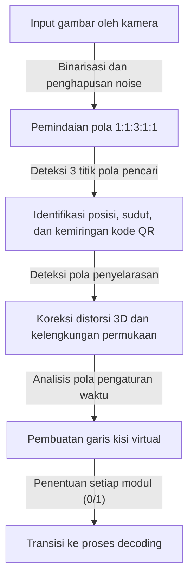
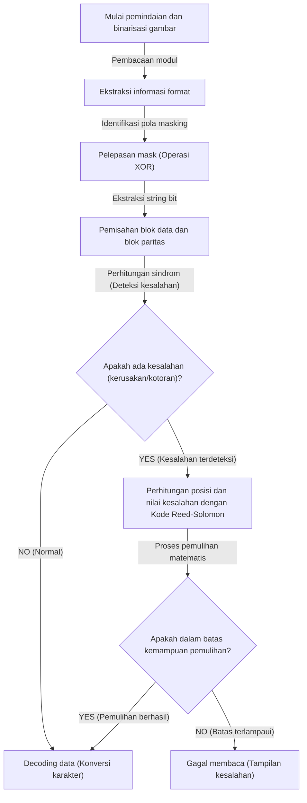

## Pendahuluan: Mahakarya Kode 2D yang Mendukung Kehidupan Kita

Mulai dari pembayaran tanpa uang tunai, akses ke situs web, tiket pesawat, hingga manajemen suku cadang di pabrik, tidak ada hari di mana kita tidak melihat "Kode QR (Quick Response Code)" di masyarakat modern. Teknologi ini, yang langsung menghubungkan kita ke data digital hanya dengan mengarahkan ponsel pintar ke pembaca khusus atau kamera, dapat dikatakan sebagai salah satu teknologi infrastruktur yang paling banyak digunakan di dunia saat ini.

Namun, coba pikirkan. Bahkan jika kode QR yang dicetak pada poster basah karena hujan dan sedikit luntur, atau kertasnya terlipat dan sobek sebagian, mengapa ponsel pintar kita masih dapat mengakses situs web tanpa masalah? Jika itu adalah barcode satu dimensi tradisional, jika satu garis saja hilang atau kotor, itu akan langsung menjadi "kesalahan pembacaan".

Di balik kinerja pembacaan yang luar biasa ini tersembunyi rekayasa teknik dan algoritme matematika yang sangat canggih dan halus, yang dikembangkan pada tahun 1994 oleh perusahaan Jepang, DENSO WAVE INCORPORATED (saat itu DENSO). Dalam artikel ini, kita akan mengungkap secara visual dan mendetail mengapa kode QR begitu cepat dan luar biasa tangguh terhadap kotoran dan kerusakan, melalui tiga mekanisme inti: "desain pola penempatan yang teliti", "proses masking untuk mengoptimalkan pengenalan data", dan "teknologi koreksi kesalahan yang menghidupkan kembali data layaknya burung phoenix".

## Rahasia Ke-1: "Pola Penempatan Geometris" agar Kamera Tidak Kebingungan

Kotak-kotak kecil berwarna hitam dan putih yang membentuk kode QR disebut "modul". Sekilas mungkin terlihat seperti noise modem yang tersebar secara acak, tetapi di dalam kode QR tertanam beberapa "penunjuk jalan tetap" agar pemindai (kamera) dapat mengenali kode serta memahami orientasi dan perspektif yang tepat.

Alasan kamera ponsel pintar dapat menemukan kode QR secara instan di dalam bingkai gambar dan membaca data dengan akurat adalah berkat pola penempatan yang diperhitungkan secara matang seperti yang ditunjukkan di bawah ini.

### 1. Pola Pencari (Pola Deteksi Posisi): Dapat Dikenali dari Sudut 360 Derajat Mana Pun

Ini adalah persegi ganda berukuran besar (berbentuk seperti tanda target) yang ditempatkan di tiga sudut kode QR (biasanya kiri atas, kanan atas, dan kiri bawah). Tidak berlebihan jika dikatakan bahwa ini adalah fitur paling menonjol dari kode QR.

Di dalam pola pencari ini tersembunyi "rasio ajaib". Pola ini dirancang sedemikian rupa sehingga tidak peduli dari sudut mana garis ditarik melalui pusatnya, rasio panjang bagian hitam dan putih akan selalu "hitam: putih: hitam: putih: hitam = 1: 1: 3: 1: 1".
Perangkat lunak pemrosesan gambar mencari pola "1:1:3:1:1" ini saat memindai umpan video kamera dengan garis pindai. Karena rasio ini sangat jarang terjadi secara kebetulan di alam atau dalam cetakan biasa, perangkat lunak dapat secara cepat dan sangat akurat mengenali bahwa "ada kode QR di sini". Selain itu, karena pola ini ditempatkan di tiga lokasi, meskipun kode QR dalam keadaan terbalik atau miring, sistem dapat langsung menghitung ulang orientasi yang benar.

### 2. Pola Penyelarasan (Alignment Pattern): Titik Relai untuk Mengoreksi Distorsi

Kode QR memiliki ukuran mulai dari "Versi 1" hingga "Versi 40" bergantung pada jumlah data yang disimpannya. Seiring dengan peningkatan versi (jumlah modul bertambah), pola persegi kecil yang ditempatkan di dalam kode disebut "pola penyelarasan".

Jika kertas bengkok atau kamera diarahkan dari sudut yang sangat miring, kisi modul akan tampak terdistorsi karena perspektif lensa. Pola penyelarasan berfungsi sebagai "titik referensi koordinat" untuk mengoreksi distorsi ini. Pemindai mendeteksi pola-pola ini dan memetakan kembali kisi yang melengkung ke bidang dua dimensi datar secara virtual, sehingga memungkinkan pembacaan modul yang akurat.

### 3. Pola Pengaturan Waktu (Timing Pattern): Penggaris untuk Menentukan Koordinat Modul

Pola ini merupakan garis lurus berselang-seling hitam dan putih yang disusun membentuk huruf L, menghubungkan pola-pola pencari. Ini disebut "pola pengaturan waktu" dan berfungsi sebagai "penggaris" untuk mengetahui koordinat modul di area data dengan tepat. Bahkan ketika versi kode QR tidak diketahui, pemindai dapat menghitung secara akurat jumlah total modul (resolusi) dari kode QR dengan menghitung selang-seling hitam-putih ini, sehingga kisi-kisi dapat dihasilkan secara akurat.

### 4. Zona Tenang (Quiet Zone): Batas yang Memisahkan Noise dan Sinyal

Ini adalah ruang kosong tanpa cetakan apa pun yang wajib disertakan di sekeliling kode QR. Menurut standar, lebar 4 modul diperlukan di sekelilingnya. Dengan adanya margin ini, algoritme pengenalan gambar dapat dengan jelas memisahkan area utama kode QR dari noise latar belakang di sekitarnya (seperti teks atau foto) dan menentukan garis batasnya.

## Rahasia Ke-2: "Proses Masking" untuk Mencegah Kebingungan Perangkat Lunak

Jika data kode QR langsung diubah menjadi titik hitam dan putih lalu ditempatkan begitu saja, masalah serius bisa terjadi. Masalahnya adalah secara tidak sengaja dapat terbentuk "blok besar modul hitam yang saling berdempetan" atau "area yang hanya berisi modul putih".
Selain itu, kasus terburuknya adalah susunan "1:1:3:1:1" yang identik dengan pola pencari dapat secara tidak sengaja muncul di area data. Jika ini terjadi, pemindai akan kehilangan jejak garis batas modul atau salah mengidentifikasinya sebagai pola pencari, yang akan menyebabkan kesalahan.

Teknologi cerdik untuk mencegah hal ini sepenuhnya adalah "proses masking".

### Algoritme Canggih dari Proses Masking

Saat membuat kode QR, encoder (perangkat lunak pembuat) tidak menempatkan data begitu saja, melainkan melapisinya secara matematis (operasi XOR: eksklusif OR) dengan 8 jenis "pola masking" (pola teratur seperti kotak-kotak, garis-garis, atau kisi diagonal) yang telah ditentukan sebelumnya pada area data.

Encoder tidak hanya menerapkan satu mask, melainkan secara internal menghasilkan "8 kode pengujian yang menerapkan kedelapan jenis mask secara terpisah". Kemudian, "penilaian penalti" yang ketat dilakukan untuk setiap kode pengujian. Kriteria penilaiannya adalah sebagai berikut:

1. **Warna sama berturut-turut**: Apakah ada warna yang sama (hitam atau putih) yang muncul 5 modul atau lebih berturut-turut secara vertikal atau horizontal.
2. **Blok besar**: Seberapa banyak terdapat blok 2x2 modul atau lebih dengan warna yang sama.
3. **Kemunculan pola serupa**: Apakah mengandung susunan "1:1:3:1:1" yang menyerupai pola pencari.
4. **Rasio hitam-putih keseluruhan**: Seberapa jauh rasio modul hitam dan modul putih keseluruhan menyimpang dari 50:50.

Sistem menghitung skor penalti berdasarkan kondisi-kondisi ini, dan mengadopsi pola masking dengan skor terendah (yaitu yang memiliki warna hitam dan putih paling seimbang dan tersebar merata, sehingga paling mudah dibaca) sebagai output akhir.

Jenis mask yang diadopsi (informasi 3-bit dari 000 hingga 111) direkam di area "informasi format" di dalam kode QR. Saat pemindai membaca kode QR, pemindai pertama-tama mengambil informasi format ini, lalu melepaskan mask dengan menerapkan pola masking yang sama menggunakan operasi XOR lagi, dan memulihkan data asli. Melalui trik yang tidak terlihat ini, kamera selalu dapat mengenali kontras tinggi dan pola yang seragam.

## Rahasia Ke-3: Alasan Utama Masih Bisa Dibaca Meskipun Kotor "Teknologi Koreksi Kesalahan"

Alasan utama mengapa kode QR memiliki ketangguhan luar biasa dibandingkan kode 2D lainnya, serta mekanisme magis yang dapat memulihkan data dengan sempurna meskipun sebagian kotor, sobek, atau tersembunyi, adalah teknologi koreksi kesalahan yang memanfaatkan "Kode Reed-Solomon (Reed-Solomon error correction)".

### Apa Itu "Kode Reed-Solomon" yang Berasal dari Komunikasi Luar Angkasa?

Kode Reed-Solomon pada awalnya adalah algoritme matematika yang dikembangkan pada tahun 1960-an. Penggunaan awalnya adalah untuk mengoreksi noise dalam komunikasi sinyal lemah dari wahana antariksa seperti Voyager, atau untuk memperbaiki kesalahan pembacaan data akibat goresan pada permukaan media optik seperti CD dan DVD.

Algoritme ini melakukan operasi polinomial tingkat tinggi pada data asli (pesan) dan menghasilkan serta menambahkan data redundan untuk pemulihan yang disebut "data paritas". Bahkan jika sebagian data hilang, bagian data yang hilang dapat dihitung mundur dan dipulihkan sepenuhnya secara matematis dengan menyelesaikan persamaan simultan menggunakan data normal yang tersisa dan data paritas.

### Empat Tingkat Koreksi Kesalahan yang Dapat Dipilih Sesuai Kebutuhan

Kode QR dilengkapi dengan kode Reed-Solomon yang kuat ini sebagai standar, dan saat membuatnya Anda dapat memilih 4 tingkat koreksi kesalahan (tingkat ECC) sesuai kebutuhan. Semakin tinggi tingkatannya, semakin tinggi pula kemampuan pemulihannya, namun rasio data paritas di dalam kode akan meningkat, sehingga jumlah data aktual yang dapat disimpan akan berkurang, atau ukuran kode QR itu sendiri (versinya) perlu diperbesar.

- **Tingkat L (Low - kemampuan pemulihan sekitar 7%)**: Digunakan di lingkungan dengan sedikit kotoran, atau saat lingkungan pembacaannya baik seperti kode QR yang ditampilkan di layar. Ideal saat Anda ingin memaksimalkan kapasitas data.
- **Tingkat M (Medium - kemampuan pemulihan sekitar 15%)**: Ini adalah tingkat yang paling standar digunakan pada barang cetakan umum atau situs web.
- **Tingkat Q (Quartile - kemampuan pemulihan sekitar 25%)**: Direkomendasikan untuk lingkungan di mana kotoran atau kerusakan mungkin terjadi, seperti poster di luar ruangan atau label pengiriman.
- **Tingkat H (High - kemampuan pemulihan sekitar 30%)**: Digunakan untuk manajemen suku cadang di lingkungan yang keras seperti pabrik, atau untuk aplikasi yang menuntut keandalan tertinggi.

### Mekanisme Kode QR Desain: Memanfaatkan Kesalahan

Akhir-akhir ini, kita sering melihat kode QR berdesain tinggi dengan logo perusahaan atau ilustrasi karakter di tengahnya. Anda mungkin bertanya-tanya, "Apakah tidak apa-apa menutupi sebagian kode QR dengan ilustrasi?". Faktanya, ini benar-benar hasil manipulasi (hack) yang cerdik menggunakan "teknologi koreksi kesalahan" ini.

Saat membuat kode QR desain, encoder mengatur tingkat koreksi kesalahan ke yang tertinggi, "Tingkat H (30%)", sebelumnya. Kemudian, menempatkan logo di tengah dan dengan sengaja menimpa (merusak) data. Dari sudut pandang pemindai, bagian logo hanyalah "kotoran (kerusakan) raksasa". Namun, karena Tingkat H memiliki kemampuan pemulihan 30%, bagian data yang tersembunyi oleh logo dapat dipulihkan dengan sempurna dari data yang tersisa di sekitarnya dan data paritas.

## Alur Keseluruhan Decoding (Pembacaan) Kode QR

Berikut adalah ringkasan serangkaian alur tentang bagaimana teknologi yang telah dijelaskan sejauh ini saling terhubung dan diproses dalam waktu kurang dari 0,1 detik setelah Anda mengarahkan ponsel pintar Anda:

1. **Pengenalan gambar dan koreksi geometris**: Menemukan 3 pola pencari dari gambar yang ditangkap oleh kamera, serta mengidentifikasi sudut dan kemiringan. Menggunakan pola penyelarasan dan pengaturan waktu, kisi virtual (jaring) dibuat sambil mengoreksi distorsi gambar.
2. **Pengambilan informasi format**: Membaca informasi tentang "tingkat koreksi kesalahan" dan "pola masking" yang digunakan dari area khusus di sekitar pola pencari.
3. **Pelepasan mask**: Berdasarkan informasi pola masking yang diperoleh, operasi XOR dilakukan pada seluruh area data, sehingga susunan data asli yang tersembunyi dapat dimunculkan.
4. **Penyusunan data dan pemeriksaan kesalahan**: Menurut aturan yang bergerak zigzag dari kanan bawah, warna hitam dan putih modul diubah menjadi data biner (string bit) berupa 0 dan 1.
5. **Eksekusi koreksi kesalahan**: Memisahkan string bit menjadi bagian data dan bagian paritas, kemudian melakukan verifikasi menggunakan kode Reed-Solomon. Jika ada kerusakan atau noise, data asli dipulihkan secara matematis di sini.
6. **Interpretasi data**: Terakhir, menurut mode pengkodean (angka, alfanumerik, biner, kanji, dll.), string bit diubah menjadi karakter atau URL, lalu ditampilkan di layar pengguna.

## Kesimpulan: Kristalisasi Rekayasa Teknik dalam Sebuah Persegi Kecil

Kode QR yang dengan santainya Anda pindai menggunakan ponsel pintar. Sekilas mungkin hanya terlihat seperti pola mosaik hitam putih biasa, namun di baliknya terdapat banyak lapisan teknologi: "pola penempatan geometris" yang sangat membantu pengenalan gambar optis hingga batas maksimal, "proses masking" yang mengoptimalkan visibilitas berdasarkan teori probabilitas dan ilmu komputer, serta "teknologi koreksi kesalahan" yang memanfaatkan matematika tingkat tinggi hasil alih fungsi dari komunikasi luar angkasa.

Karena algoritme rumit ini terintegrasi secara mulus di dalam sebuah persegi yang hanya berukuran beberapa sentimeter, kita dapat memanfaatkan kode QR tanpa stres sedikit pun, bahkan jika sedikit kotor, terdistorsi, atau berada di bawah pencahayaan yang buruk. Lain kali Anda melihat kode QR di kafe atau poster, luangkanlah waktu sejenak untuk memikirkan kolaborasi rekayasa teknik presisi yang sedang dijalankan puluhan kali per detik di baliknya.
