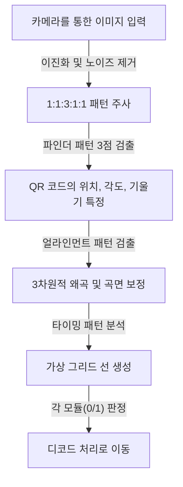
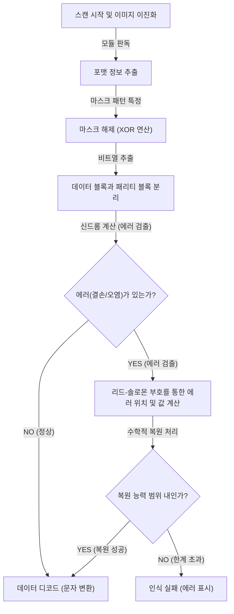

## 도입: 우리의 일상을 뒷받침하는 2차원 바코드의 걸작

현대 사회에서 캐시리스 결제, 웹사이트 접속, 비행기 탑승권, 그리고 공장에서의 부품 관리 등 'QR 코드(Quick Response Code)'를 보지 않는 날은 없습니다. 스마트폰을 전용 리더기나 카메라에 살짝 갖다 대기만 하면 순식간에 디지털 데이터로 연결되는 이 기술은, 현재 세계에서 가장 널리 보급된 인프라 기술 중 하나라고 할 수 있습니다.

하지만, 잘 생각해 보세요. 포스터에 인쇄된 QR 코드가 비에 젖어 조금 번져 있거나, 종이가 접히고 일부가 찢어져 있어도 우리의 스마트폰은 왜 문제없이 웹사이트에 접속할 수 있는 것일까요? 기존의 1차원 바코드라면 선이 하나라도 누락되거나 오염될 경우 즉시 '인식 오류'가 발생하고 맙니다.

이 놀라운 인식 성능의 배경에는 일본의 주식회사 덴소 웨이브(당시 덴소)가 1994년에 개발한 극도로 고도화되고 세련된 엔지니어링과 수학적 알고리즘이 숨겨져 있습니다. 본 기사에서는 QR 코드가 왜 빠르며, 오염이나 훼손에 압도적으로 강한지에 대한 의문을 '배치 패턴의 치밀한 설계', '데이터 인식을 최적화하는 마스크 처리', 그리고 '데이터를 불사조처럼 되살리는 오류 정정 기술'이라는 세 가지 핵심적인 메커니즘을 통해 시각적이고 상세하게 파헤쳐 보겠습니다.

## 첫 번째 비밀: 카메라를 헤매지 않게 하는 '기하학적 배치 패턴'

QR 코드를 구성하는 흑백의 작은 사각형은 '모듈'이라고 불립니다. 얼핏 보면 무질서하게 흩뿌려진 모뎀의 노이즈처럼 보일 수 있지만, QR 코드 내부에는 스캐너(카메라)가 코드를 인식하고 정확한 방향이나 원근감을 파악하기 위한 '고정된 이정표'가 여러 개 심어져 있습니다.

스마트폰 등의 카메라가 이미지 프레임 안에서 QR 코드를 순식간에 발견하고 정확한 데이터를 읽어낼 수 있는 것은, 아래에 제시된 철저하게 계산된 배치 패턴 덕분입니다.

### 1. 파인더 패턴(위치 검출 패턴): 360도 어디서든 인식 가능
QR 코드의 세 모서리(일반적으로 좌측 상단, 우측 상단, 좌측 하단)에 배치되어 있는 커다란 이중 정사각형(타겟 마크와 같은 형태)입니다. 이것이 QR 코드의 가장 큰 특징이라고 해도 과언이 아닙니다.

이 파인더 패턴에는 어떤 '마법의 비율'이 숨겨져 있습니다. 중심을 지나는 직선을 어떤 각도로 그어도, 검은색 부분과 흰색 부분의 길이 비율이 반드시 '검정:흰색:검정:흰색:검정 = 1:1:3:1:1'이 되도록 설계되어 있는 것입니다.
이미지 처리 소프트웨어는 카메라의 영상을 주사선으로 스캔할 때, 이 '1:1:3:1:1' 패턴을 찾습니다. 이 비율은 자연계나 일반적인 인쇄물 속에서 우연히 발생할 확률이 극히 드물기 때문에, 소프트웨어는 고속으로 정밀하게 '여기에 QR 코드가 있다'고 인식할 수 있습니다. 또한 세 곳에 배치되어 있으므로, QR 코드가 위아래로 뒤집혀 있거나 비스듬하게 기울어져 있어도 시스템은 순식간에 올바른 방향을 다시 계산할 수 있습니다.

### 2. 얼라인먼트 패턴: 왜곡을 보정하는 중계 지점
QR 코드에는 저장할 데이터 양에 따라 '버전 1'부터 '버전 40'까지의 크기가 존재합니다. 버전이 커질수록(모듈 수가 증가할수록) 코드 내부에 배치되는 작은 정사각형 패턴이 바로 '얼라인먼트 패턴'입니다.

종이가 구부러져 있거나 카메라를 극단적으로 비스듬히 갖다 대면, 렌즈의 원근감에 의해 모듈의 격자가 왜곡되어 보입니다. 얼라인먼트 패턴은 이러한 왜곡을 보정하기 위한 '좌표의 기준점' 역할을 합니다. 스캐너는 이 패턴들을 검출하여, 휘어진 그리드를 가상의 평평한 2차원 평면에 다시 매핑함으로써 모듈을 정확하게 판독할 수 있게 해줍니다.

### 3. 타이밍 패턴: 모듈의 좌표를 도출하는 자
파인더 패턴끼리 연결하듯, L자 형태로 검은색과 흰색이 교대로 배치된 직선입니다. 이것은 '타이밍 패턴'이라고 불리며, 데이터 영역 내 모듈의 좌표를 정확하게 파악하기 위한 '자'의 역할을 수행합니다. QR 코드의 버전을 모르는 경우라도 스캐너는 이 흑백 교차 횟수를 세어 QR 코드 전체의 모듈 수(해상도)를 정확히 계산하고 그리드(격자)를 생성할 수 있습니다.

### 4. 콰이어트 존: 노이즈와 신호를 분리하는 경계선
QR 코드 주변에 반드시 마련되어 있는, 아무것도 인쇄되지 않은 여백 부분입니다. 표준 규격에서는 주변에 4모듈 너비의 여백이 필요하다고 규정되어 있습니다. 이 여백이 존재함으로써, 이미지 인식 알고리즘은 주변의 배경 노이즈(텍스트나 사진 등)로부터 QR 코드 본체 영역을 명확히 분리하여 경계선을 확정 지을 수 있습니다.

## 두 번째 비밀: 소프트웨어의 혼란을 방지하는 '마스크 처리'

QR 코드의 데이터를 그대로 흑백 점으로 변환하여 배치하면 심각한 문제가 발생할 수 있습니다. 바로 우연히 '검은색 모듈이 밀집된 거대한 블록'이나 '흰색 모듈만 있는 영역'이 생겨버리는 현상입니다.
또한, 최악의 경우 데이터 영역 내에 우연히 '1:1:3:1:1'이라는 파인더 패턴과 동일한 배열이 나타날 수도 있습니다. 만약 이런 일들이 발생하면 스캐너는 모듈의 경계선을 놓치거나 파인더 패턴으로 오인하여 오류를 일으키게 됩니다.

이러한 문제를 원천적으로 차단하기 위한 독창적인 기술이 바로 '마스크 처리(마스킹)'입니다.

### 마스크 처리의 고도화된 알고리즘
QR 코드를 생성할 때, 인코더(생성 소프트웨어)는 데이터를 그대로 배치하는 것이 아니라, 데이터 영역에 미리 정의된 8종류의 '마스크 패턴'(체크무늬, 스트라이프, 대각선 격자 등 규칙적인 패턴)을 수학적(XOR 연산: 배타적 논리합)으로 겹쳐 씌웁니다.

인코더는 단 하나의 마스크만 적용하는 것이 아니라, 무려 '8종류의 마스크를 각각 적용한 8개의 테스트 코드'를 내부적으로 생성합니다. 그리고 각 테스트 코드에 대해 엄격한 '페널티 평가'를 실시합니다. 평가 기준은 다음과 같습니다.

1. **동일 색상의 연속**: 가로나 세로로 같은 색상(검정 또는 흰색)이 5모듈 이상 연속되지 않았는가.
2. **거대한 블록**: 2×2 모듈 이상의 동일 색상 블록이 얼마나 존재하는가.
3. **유사 패턴 발생**: 파인더 패턴과 유사한 '1:1:3:1:1' 배열이 포함되어 있지 않은가.
4. **전체적인 흑백 비율**: 전체 흑백 모듈의 비율이 50:50에서 얼마나 벗어나 있는가.

시스템은 이러한 조건들을 바탕으로 페널티 점수를 계산하여, 가장 점수가 낮은(즉, 흑백이 가장 균형 있게 분산되어 있어 읽기 쉬운) 마스크 패턴을 최종 출력물로 채택합니다.

채택된 마스크의 종류(000부터 111까지의 3비트 정보)는 QR 코드 내의 '포맷 정보' 영역에 기록됩니다. 스캐너가 QR 코드를 읽을 때는 먼저 이 포맷 정보를 습득하고, 동일한 마스크 패턴을 다시 XOR 연산으로 적용하여 마스크 해제하고 원본 데이터를 복원합니다. 이렇게 눈에 보이지 않는 설계 덕분에, 카메라는 항상 높은 대비와 균일한 패턴을 인식할 수 있는 것입니다.

## 세 번째 비밀: 오염되어도 인식할 수 있는 가장 큰 이유 '오류 정정 기술'

QR 코드가 다른 2차원 바코드에 비해 압도적인 견고함을 자랑하는 가장 큰 이유이자, 일부가 오염되거나 찢어지거나 가려져도 데이터를 완벽하게 복원해내는 마법 같은 기술이 바로 '리드-솔로몬 부호(Reed-Solomon error correction)'를 활용한 오류 정정 기술입니다.

### 우주 통신에서 온 '리드-솔로몬 부호'란?
리드-솔로몬 부호는 원래 1960년대에 개발된 수학적 알고리즘입니다. 초기에는 보이저 호 같은 우주 탐사선에서 보내는 미약한 통신의 노이즈 보정이나, CD나 DVD 같은 광학 미디어 표면의 흠집으로 인한 데이터 판독 오류를 복구하기 위해 사용되었습니다.

이 알고리즘은 원본 데이터(메시지)에 대해 고도의 다항식 연산을 수행하여, '패리티 데이터'라고 불리는 복원용 잉여 데이터를 생성 및 부가합니다. 만약 데이터의 일부가 유실되더라도, 남아있는 정상 데이터와 패리티 데이터를 마치 연립방정식을 풀듯이 계산함으로써 잃어버린 데이터를 수학적으로 완벽히 역산하여 복원해 낼 수 있는 것입니다.

### 용도에 맞춰 선택할 수 있는 4단계 오류 정정 레벨
QR 코드는 이 강력한 리드-솔로몬 부호를 기본으로 탑재하고 있으며, 생성 시 용도에 따라 4단계의 오류 정정 레벨(ECC 레벨)을 선택할 수 있습니다. 레벨을 높게 설정할수록 복원 능력은 올라가지만, 코드 내에서 패리티 데이터가 차지하는 비율이 늘어나기 때문에 저장할 수 있는 실제 데이터 양이 줄어들거나 QR 코드 자체의 크기(버전)를 키워야 합니다.

- **레벨 L (Low - 약 7% 복원 능력)**: 오염이 적은 환경이나 화면상에 표시되는 QR 코드 등 인식 환경이 양호할 때 사용됩니다. 데이터 용량을 극대화하고 싶을 때 적합합니다.
- **레벨 M (Medium - 약 15% 복원 능력)**: 일반적인 인쇄물이나 웹사이트에서 가장 표준적으로 사용되는 레벨입니다.
- **레벨 Q (Quartile - 약 25% 복원 능력)**: 야외 포스터나 배송 전표 등 오염이나 훼손이 예상되는 환경에서 권장됩니다.
- **레벨 H (High - 약 30% 복원 능력)**: 공장과 같은 가혹한 환경에서의 부품 관리나 최고의 신뢰성이 요구되는 용도에서 사용됩니다.

### 디자인 QR 코드의 원리: 오류를 역이용하다
최근에는 중앙에 기업의 로고 마크나 캐릭터 일러스트가 들어간 디자인성이 뛰어난 QR 코드를 자주 볼 수 있습니다. "QR 코드의 일부를 일러스트로 덮어버려도 괜찮은 걸까?"라는 의문이 들 수 있지만, 이는 바로 이 '오류 정정 기술'을 교묘하게 활용(해킹)한 결과물입니다.

디자인 QR 코드를 생성할 때 인코더는 미리 오류 정정 레벨을 최고 단계인 '레벨 H(30%)'로 설정합니다. 그리고 중앙에 로고를 배치하여 의도적으로 데이터를 덮어씌웁니다(파괴합니다). 스캐너의 입장에서 보면 로고 부분은 단순한 '거대한 오염(결손)'으로 인식됩니다. 하지만 레벨 H가 가진 30%의 복원 능력이 있기 때문에, 로고에 가려진 데이터 부분은 주변에 남아있는 데이터와 패리티 데이터를 통해 완벽하게 복원되는 것입니다.

## QR 코드 디코드(판독)의 전체 흐름

지금까지 설명한 기술들이 스마트폰을 갖다 대는 불과 0.1초도 안 되는 시간 동안 어떻게 연동되어 처리되는지 전체 흐름을 정리해 보겠습니다.

1. **이미지 인식 및 기하학적 보정**: 카메라가 포착한 영상에서 3개의 파인더 패턴을 찾아내어 각도와 기울기를 특정합니다. 얼라인먼트와 타이밍 패턴을 사용하여 이미지의 왜곡을 보정하면서 가상의 그리드(격자)를 생성합니다.
2. **포맷 정보 획득**: 파인더 패턴 주변에 있는 특별한 영역에서, 사용된 '오류 정정 레벨'과 '마스크 패턴' 정보를 읽어냅니다.
3. **마스크 해제**: 획득한 마스크 패턴 정보를 바탕으로 데이터 영역 전체에 XOR 연산을 수행하여 숨겨져 있던 진짜 데이터 배열을 드러냅니다.
4. **데이터 배열화 및 에러 체크**: 우측 하단에서부터 지그재그로 나아가는 규칙에 따라 모듈의 흑백을 0과 1의 바이너리 데이터(비트열)로 변환합니다.
5. **오류 정정 실행**: 비트열을 데이터 부분과 패리티 부분으로 나누고, 리드-솔로몬 부호를 통한 검증을 진행합니다. 만약 결손이나 노이즈가 있다면 여기에서 수학적으로 원본 데이터를 복원합니다.
6. **데이터 해석**: 마지막으로 인코딩 모드(숫자, 영숫자, 바이너리, 한자 등)에 따라 비트열을 문자나 URL로 변환하여 사용자의 화면에 표시합니다.

## 결론: 작은 정사각형에 집약된 엔지니어링의 결정체

무심코 스마트폰을 갖다 대는 QR 코드. 얼핏 보면 단순한 흑백의 모자이크 무늬에 불과해 보이지만, 그 이면에는 광학적 이미지 인식을 극한까지 돕는 '기하학적 배치 패턴', 확률론과 컴퓨터 과학을 기반으로 시인성을 최적화하는 '마스크 처리', 그리고 우주 통신에서 차용된 고도의 수학을 활용한 '오류 정정 기술'이라는 수많은 기술적 레이어가 존재합니다.

이러한 복잡한 알고리즘들이 불과 수 센티미터의 정사각형 안에 매끄럽게 통합되어 있기 때문에, 다소의 오염이나 왜곡, 악조건의 빛 아래에서도 우리는 아무런 스트레스 없이 QR 코드를 활용할 수 있는 것입니다. 다음번에 카페나 포스터에서 QR 코드를 발견한다면, 그 이면에서 초당 수십 번씩 실행되고 있는 치밀한 엔지니어링의 연계 과정에 대해 꼭 한 번 생각해 보시기 바랍니다.
