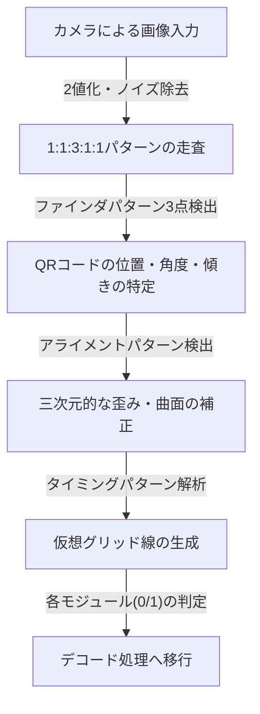
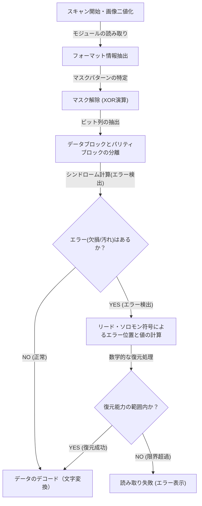

## はじめに：私たちの生活を支える二次元コードの傑作

キャッシュレス決済、ウェブサイトへのアクセス、飛行機の搭乗券、さらには工場での部品管理など、現代社会において「QRコード（Quick Response Code）」を見ない日はありません。スマートフォンをサッと専用のリーダーやカメラにかざすだけで、瞬時にデジタルデータへと繋がるこの技術は、現在では世界中で最も普及しているインフラ技術の一つと言えるでしょう。

しかし、よく考えてみてください。ポスターに印刷されたQRコードが雨に濡れて少し滲んでいたり、紙が折れ曲がって一部が破れていたりしても、なぜ私たちのスマートフォンは問題なくウェブサイトにアクセスできるのでしょうか。従来の一次元バーコードであれば、線が一本でも欠けたり汚れたりすると、すぐに「読み取りエラー」になってしまいます。

この驚異的な読み取り性能の背景には、日本の株式会社デンソーウェーブ（当時のデンソー）が1994年に開発した、極めて高度で洗練されたエンジニアリングと数学的アルゴリズムが隠されています。本記事では、QRコードがなぜ高速で、かつ汚れや破損に圧倒的に強いのかという疑問に対して、「配置パターンの緻密な設計」「データ認識を最適化するマスク処理」、そして「データを不死鳥のように蘇らせる誤り訂正技術」という3つの核心的な仕組みから、視覚的かつ詳細に解き明かしていきます。

## 第1の秘密：カメラを迷わせない「幾何学的な配置パターン」

QRコードを構成する黒と白の小さな四角形は「モジュール」と呼ばれます。一見すると無秩序に散りばめられたモデムのノイズのように見えるかもしれませんが、QRコードの中には、スキャナー（カメラ）がコードを認識し、正確な向きやパースペクティブを把握するための「固定された道標」がいくつも埋め込まれています。

スマートフォンなどのカメラが画像フレーム内からQRコードを瞬時に発見し、正確なデータを読み出せるのは、以下に示す計算し尽くされた配置パターンのおかげです。

### 1. ファインダパターン（位置検出パターン）：360度どこからでも認識可能
QRコードの3つの角（通常は左上、右上、左下）に配置されている、大きな二重の正方形（ターゲットマークのような形状）です。これがQRコードの最大の特徴と言っても過言ではありません。

このファインダパターンには、ある「魔法の比率」が隠されています。中心を通る直線をどの角度で引いても、黒い部分と白い部分の長さの比率が必ず「黒：白：黒：白：黒 ＝ 1：1：3：1：1」になるように設計されているのです。
画像処理ソフトウェアは、カメラの映像を走査線でスキャンする際、この「1:1:3:1:1」のパターンを探します。この比率は自然界や通常の印刷物の中には偶然に発生することが極めて稀であるため、ソフトウェアは高速かつ高精度に「ここにQRコードがある」と認識できます。また、3箇所に配置されているため、QRコードが上下逆さまであっても、斜めになっていても、システムは瞬時に正しい向きを計算し直すことができます。

### 2. アライメントパターン：歪みを補正する中継地点
QRコードには、格納するデータ量に応じて「バージョン1」から「バージョン40」までのサイズが存在します。バージョンが大きくなる（モジュール数が増える）につれて、コード内部に配置される小さな正方形のパターンが「アライメントパターン」です。

紙が曲がっていたり、カメラを極端に斜めからかざしたりすると、レンズのパースペクティブ（遠近感）によってモジュールの格子が歪んで見えます。アライメントパターンは、この歪みを補正するための「座標の基準点」として機能します。スキャナーはこれらのパターンを検出し、曲がったグリッドを仮想的に平らな二次元平面に再マッピングすることで、正確なモジュールの読み取りを可能にします。

### 3. タイミングパターン：モジュールの座標を導き出す定規
ファインダパターン同士を結ぶように、L字型に配置された黒と白が交互に並ぶ直線です。これは「タイミングパターン」と呼ばれ、データ領域のモジュールの座標を正確に把握するための「定規」の役割を果たします。QRコードのバージョンが不明な場合でも、スキャナーはこの白黒の交互の数を数えることで、QRコード全体のモジュール数（解像度）を正確に計算し、グリッド（格子）を正確に生成することができます。

### 4. クワイエットゾーン：ノイズと信号を分離する境界線
QRコードの周囲に必ず設けられている、何も印刷されていない余白部分です。標準規格では周囲に4モジュール分の幅が必要とされています。この余白が存在することで、画像認識アルゴリズムは周囲の背景ノイズ（テキストや写真など）からQRコード本体の領域を明確に分離し、境界線を確定させることができます。

## 第2の秘密：ソフトウェアの混乱を防ぐ「マスク処理」

QRコードのデータをそのまま白黒のドットに変換して配置すると、ある深刻な問題が発生する可能性があります。それは、偶然にも「黒いモジュールが密集した大きなブロック」や「白いモジュールばかりの領域」ができてしまうことです。
また、もっと最悪なケースとして、データ領域の中に偶然「1:1:3:1:1」というファインダパターンと同じ並びが発生してしまうことも考えられます。もしこれらが起きると、スキャナーはモジュールの境界線を見失ったり、ファインダパターンと誤認してエラーを引き起こしてしまいます。

これを完全に防ぐための独創的な技術が「マスク処理（マスキング）」です。

### マスク処理の高度なアルゴリズム
QRコードを生成する際、エンコーダー（生成ソフト）はデータをそのまま配置するのではなく、データ領域に対してあらかじめ定義された8種類の「マスクパターン」（市松模様、ストライプ、斜め格子などの規則的なパターン）を数学的（XOR演算：排他的論理和）に重ね合わせます。

エンコーダーは、ただ1つのマスクを適用するのではなく、なんと「8種類すべてのマスクを個別に適用した8つのテストコード」を内部で生成します。そして、それぞれのテストコードに対して厳格な「ペナルティ評価」を実施します。評価基準は以下の通りです。

1. **同色の連続**: 縦または横に、同じ色（黒または白）が5モジュール以上連続していないか。
2. **大きなブロック**: 2×2モジュール以上の同じ色のブロックがどれくらい存在するか。
3. **類似パターンの発生**: ファインダパターンに似た「1:1:3:1:1」の並びが含まれていないか。
4. **全体的な白黒比率**: 全体の黒モジュールと白モジュールの比率が50:50からどれくらい乖離しているか。

システムはこれらの条件に基づいてペナルティスコアを計算し、最もスコアの低い（つまり最もバランス良く白と黒が分散しており、読み取りやすい）マスクパターンを最終的な出力として採用します。

採用されたマスクの種類（000から111までの3ビット情報）は、QRコード内の「フォーマット情報」領域に記録されます。スキャナーはQRコードを読み取る際、まずこのフォーマット情報を取得し、同じマスクパターンを再度XOR演算で適用することでマスクを解除し、元のデータを復元します。この見えない工夫により、カメラは常に高いコントラストと均一なパターンを認識できているのです。

## 第3の秘密：汚れても読み取れる最大の理由「誤り訂正技術」

QRコードが他の二次元コードと比較しても圧倒的な堅牢性を持つ最大の理由であり、一部が汚れたり、破れたり、隠れたりしてもデータを完璧に復元できる魔法のような仕組みが、「リード・ソロモン符号（Reed-Solomon error correction）」を活用した誤り訂正技術です。

### 宇宙通信からやってきた「リード・ソロモン符号」とは？
リード・ソロモン符号は、もともと1960年代に開発された数学的アルゴリズムです。初期の用途は、ボイジャーなどの宇宙探査機からの微弱な通信におけるノイズ補正や、CD・DVDといった光学メディアにおいて、表面の傷によるデータの読み取りエラーを修復することでした。

このアルゴリズムは、元のデータ（メッセージ）に対して高度な多項式演算を行い、「パリティデータ」と呼ばれる復元用の冗長データを生成して付加します。もしデータの一部が欠損した場合でも、残された正常なデータとパリティデータを連立方程式のように解くことで、失われた部分のデータを数学的に完全に逆算・復元することができるのです。

### 用途に合わせて選べる4つの誤り訂正レベル
QRコードは、この強力なリード・ソロモン符号を標準搭載しており、作成時に用途に応じた4段階の誤り訂正レベル（ECCレベル）を選択することができます。レベルを高く設定すればするほど復元能力は上がりますが、コード内に占めるパリティデータの割合が増えるため、格納できる実データ量が減るか、あるいはQRコード自体のサイズ（バージョン）を大きくする必要があります。

- **レベルL (Low - 約7%の復元能力)**: 汚れが少ない環境や、画面上に表示されるQRコードなど、読み取り環境が良好な場合に使用されます。データ容量を最大化したい場合に最適です。
- **レベルM (Medium - 約15%の復元能力)**: 一般的な印刷物やウェブサイトで最も標準的に使用されるレベルです。
- **レベルQ (Quartile - 約25%の復元能力)**: 屋外のポスターや、配送伝票など、汚れやダメージが想定される環境で推奨されます。
- **レベルH (High - 約30%の復元能力)**: 工場などの過酷な環境での部品管理や、最も高い信頼性が求められる用途で使用されます。

### デザインQRコードの仕組み：エラーを逆手に取る
最近では、中央に企業のロゴマークやキャラクターのイラストが配置された、デザイン性の高いQRコードをよく見かけます。「QRコードの一部をイラストで塗りつぶしてしまって大丈夫なのか？」と疑問に思うかもしれませんが、これはまさにこの「誤り訂正技術」を巧みに利用（ハック）したものです。

デザインQRコードを作成する際、エンコーダーはあらかじめ誤り訂正レベルを最高の「レベルH（30%）」に設定します。そして、中央にロゴを配置して意図的にデータを上書き（破壊）します。スキャナーから見れば、ロゴの部分は単なる「巨大な汚れ（欠損）」として認識されます。しかし、レベルHによる30%の復元能力があるため、ロゴによって隠された部分のデータは、周囲の残されたデータとパリティデータから完璧に復元されるのです。

## QRコードのデコード（読み出し）の全体フロー

ここまで解説した技術が、スマートフォンをかざしたわずか0.1秒以下の間に、どのように連動して処理されているのか、一連のフローをまとめます。

1. **画像認識と幾何学補正**: カメラが捉えた映像から、3つのファインダパターンを見つけ出し、角度や傾きを特定。アライメントとタイミングパターンを用いて、画像の歪みを補正しながら仮想的なグリッド（網目）を生成します。
2. **フォーマット情報の取得**: ファインダパターンの周囲にある特別な領域から、使用されている「誤り訂正レベル」と「マスクパターン」の情報を読み取ります。
3. **マスクの解除**: 取得したマスクパターン情報を基に、データ領域全体にXOR演算を行い、隠されていた真のデータ配列を浮かび上がらせます。
4. **データの配列化とエラーチェック**: 右下からジグザグに進む規則に従って、モジュールの白黒を0と1のバイナリデータ（ビット列）に変換します。
5. **誤り訂正の実行**: ビット列をデータ部分とパリティ部分に分け、リード・ソロモン符号による検証を行います。もし欠損やノイズがあれば、ここで数学的に元のデータを復元します。
6. **データの解釈**: 最後に、エンコーディングモード（数字、英数字、バイナリ、漢字など）に従ってビット列を文字やURLに変換し、ユーザーの画面に表示します。

## まとめ：小さな正方形に詰まったエンジニアリングの結晶

何気なくスマートフォンをかざしているQRコード。一見すると単なる白黒のモザイク模様に過ぎませんが、その裏側には、光学的な画像認識を極限まで助ける「幾何学的な配置パターン」、確率論と計算機科学に基づき視認性を最適化する「マスク処理」、そして宇宙通信から転用された高度な数学による「誤り訂正技術」という、いくつもの技術のレイヤーが存在しています。

これらの複雑なアルゴリズムが、わずか数センチの正方形の中にシームレスに統合されているからこそ、多少の汚れや歪み、悪条件の光の下であっても、私たちは一切のストレスなくQRコードを活用できるのです。次にカフェやポスターでQRコードを見かけた際は、その奥で秒間何十回と実行されている緻密なエンジニアリングの連携に、ぜひ思いを馳せてみてください。
