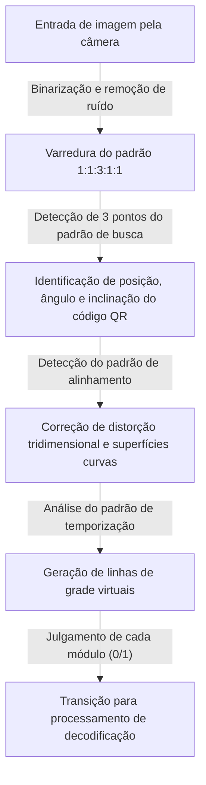
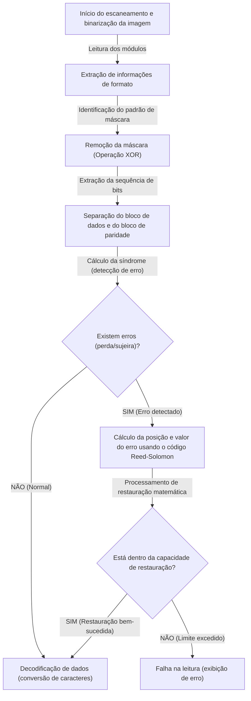

## Introdução: A obra-prima do código bidimensional que sustenta nossas vidas

De pagamentos sem dinheiro e acesso a sites até cartões de embarque de aviões e até mesmo gerenciamento de peças em fábricas, não passa um dia sem que vejamos um "QR Code (Quick Response Code)" na sociedade moderna. Pode-se dizer que essa tecnologia, que se conecta instantaneamente a dados digitais com apenas um simples aceno do seu smartphone para um leitor ou câmera dedicada, é agora uma das tecnologias de infraestrutura mais difundidas no mundo.

No entanto, pense sobre isso com cuidado. Mesmo se um código QR impresso em um pôster estiver um pouco manchado de chuva, ou se o papel estiver dobrado e parcialmente rasgado, por que nosso smartphone consegue acessar o site sem problemas? Com um código de barras unidimensional convencional, se mesmo uma única linha estiver faltando ou suja, resultará imediatamente em um "erro de leitura".

Por trás desse incrível desempenho de leitura está uma engenharia e algoritmos matemáticos extremamente avançados e sofisticados, desenvolvidos em 1994 pela empresa japonesa DENSO WAVE INCORPORATED (na época, DENSO). Neste artigo, para responder à pergunta de por que os códigos QR são tão rápidos e esmagadoramente resistentes a sujeira e danos, vamos desvendar seus segredos visual e detalhadamente a partir de três mecanismos principais: "design meticuloso de padrões de posicionamento", "processamento de máscara que otimiza o reconhecimento de dados" e "tecnologia de correção de erros que revive os dados como uma fênix".

## O Primeiro Segredo: "Padrões de Posicionamento Geométrico" que não confundem a câmera

Os pequenos quadrados pretos e brancos que compõem um código QR são chamados de "módulos". Embora possa parecer um ruído de modem aleatoriamente espalhado à primeira vista, os códigos QR têm vários "sinais fixos" embutidos para que o scanner (câmera) reconheça o código e entenda a orientação e perspectiva exatas.

O fato de a câmera de um smartphone poder encontrar instantaneamente o código QR dentro do quadro de imagem e ler os dados precisos é devido aos padrões de posicionamento calculados mostrados abaixo.

### 1. Padrão de Busca (Padrão de Detecção de Posição): Reconhecível de qualquer ponto em 360 graus
São grandes quadrados duplos (moldados como uma marca de alvo) localizados em três cantos do código QR (geralmente no canto superior esquerdo, superior direito e inferior esquerdo). Não é exagero dizer que essa é a maior característica do código QR.

Uma "proporção mágica" está escondida neste padrão de busca. Não importa em qual ângulo você desenhe uma linha reta através do centro, a proporção do comprimento das partes pretas e brancas é projetada para ser sempre "preto:branco:preto:branco:preto = 1:1:3:1:1".
O software de processamento de imagem, ao escanear a imagem da câmera com linhas de varredura, procura por esse padrão "1:1:3:1:1". Como essa proporção ocorre muito raramente na natureza ou em materiais impressos normais por acaso, o software pode reconhecer rápida e com alta precisão que "há um código QR aqui". Além disso, por estar localizado em três lugares, mesmo se o código QR estiver de cabeça para baixo ou inclinado, o sistema pode recalcular instantaneamente a orientação correta.

### 2. Padrão de Alinhamento: Um ponto de retransmissão para corrigir a distorção
Os códigos QR existem em tamanhos da "Versão 1" até a "Versão 40", dependendo da quantidade de dados a serem armazenados. À medida que a versão aumenta (o número de módulos aumenta), os pequenos padrões quadrados colocados dentro do código são os "padrões de alinhamento".

Se o papel estiver dobrado ou se a câmera estiver em um ângulo extremo, a grade do módulo parecerá distorcida devido à perspectiva da lente. O padrão de alinhamento funciona como um "ponto de referência de coordenadas" para corrigir essa distorção. Ao detectar esses padrões e remapear virtualmente a grade curva em um plano bidimensional plano, o scanner possibilita a leitura precisa dos módulos.

### 3. Padrão de Temporização: A régua que deriva as coordenadas dos módulos
É uma linha reta em que as cores preta e branca se alternam, disposta em forma de L conectando os padrões de busca entre si. Isso é chamado de "padrão de temporização" e desempenha o papel de uma "régua" para captar com precisão as coordenadas dos módulos na área de dados. Mesmo que a versão do código QR seja desconhecida, contando o número dessas alternâncias em preto e branco, o scanner pode calcular com precisão o número de módulos (resolução) de todo o código QR e gerar a grade com precisão.

### 4. Zona de Silêncio: A linha limite que separa o ruído do sinal
Esta é uma área em branco ao redor do código QR onde nada é impresso. O padrão exige uma largura de 4 módulos ao redor da borda. A existência dessa margem permite que o algoritmo de reconhecimento de imagem separe claramente o corpo do código QR do ruído de fundo ao redor (como texto e fotografias) e estabeleça os limites.

## O Segundo Segredo: "Processamento de Máscara" para evitar confusão do software

Se os dados de um código QR fossem simplesmente convertidos em pontos pretos e brancos e organizados, um problema sério poderia ocorrer. Isto é, "grandes blocos com densos módulos pretos" ou "áreas apenas com módulos brancos" podem ser formados por acaso.
Além disso, no pior cenário, o mesmo arranjo que o padrão de busca "1:1:3:1:1" poderia ocorrer por acaso na área de dados. Se isso acontecesse, o scanner perderia de vista o limite do módulo ou o confundiria com um padrão de busca, causando um erro.

A tecnologia engenhosa para evitar isso completamente é o "processamento de máscara (mascaramento)".

### O algoritmo avançado do processo de máscara
Ao gerar um código QR, o codificador (software de geração) não coloca simplesmente os dados como estão, mas sobrepõe matematicamente (operação XOR: ou exclusivo) 8 tipos predefinidos de "padrões de máscara" (padrões regulares, como xadrez, listras, grade diagonal) na área de dados.

O codificador não aplica apenas uma máscara, mas surpreendentemente gera internamente "8 códigos de teste com todas as 8 máscaras aplicadas individualmente". Em seguida, uma avaliação rigorosa de "penalidade" é realizada para cada código de teste. Os critérios de avaliação são os seguintes:

1. **Continuidade da mesma cor**: Existem 5 ou mais módulos da mesma cor (preto ou branco) contínuos verticalmente ou horizontalmente?
2. **Grandes blocos**: Quantos blocos 2x2 ou maiores da mesma cor existem?
3. **Ocorrência de padrões semelhantes**: Há algum padrão "1:1:3:1:1" semelhante a um padrão de busca incluído?
4. **Proporção geral de preto para branco**: Quão distante a proporção geral de módulos pretos para brancos se desvia de 50:50?

O sistema calcula as pontuações de penalidade com base nessas condições e adota o padrão de máscara com a pontuação mais baixa (ou seja, os pixels pretos e brancos estão distribuídos de maneira mais equilibrada e fáceis de ler) como a saída final.

O tipo de máscara adotado (informação de 3 bits de 000 a 111) é gravado na área de "informação de formato" do código QR. Ao ler um código QR, o scanner obtém primeiro essas informações de formato, aplica o mesmo padrão de máscara por operação XOR para desmascará-lo e restaura os dados originais. Com esse mecanismo invisível, a câmera é capaz de reconhecer um alto contraste e um padrão uniforme em todos os momentos.

## O Terceiro Segredo: A Maior Razão Pela Qual Pode Ser Lido Mesmo Sujo - "Tecnologia de Correção de Erros"

A principal razão pela qual o código QR tem uma robustez esmagadora em comparação com outros códigos bidimensionais, e o mecanismo mágico que pode restaurar dados perfeitamente mesmo que algumas partes estejam sujas, rasgadas ou ocultas, é a tecnologia de correção de erros que utiliza os "Códigos de correção de erros Reed-Solomon".

### O que é o "Código Reed-Solomon" vindo da comunicação espacial?
O Código Reed-Solomon é um algoritmo matemático originalmente desenvolvido na década de 1960. Seus primeiros usos foram para correção de ruído em comunicações de sinais fracos de sondas espaciais, como a Voyager, e para reparar erros de leitura de dados causados por arranhões na superfície de mídias ópticas, como CDs e DVDs.

Esse algoritmo executa operações polinomiais avançadas nos dados originais (mensagem), gera dados redundantes para restauração chamados "dados de paridade" e os anexa. Mesmo que parte dos dados seja perdida, os dados perdidos podem ser completamente revertidos matematicamente e restaurados resolvendo os dados normais restantes e os dados de paridade como equações simultâneas.

### Quatro níveis de correção de erros que podem ser selecionados de acordo com o propósito
Os códigos QR são equipados por padrão com esse poderoso Código Reed-Solomon, e 4 níveis de correção de erro (níveis ECC) de acordo com o propósito podem ser selecionados no momento da criação. Quanto maior o nível definido, maior a capacidade de restauração, mas como a proporção de dados de paridade no código aumenta, a quantidade de dados reais que podem ser armazenados diminui, ou o tamanho (versão) do próprio código QR precisa ser maior.

- **Nível L (Baixo - capacidade de restauração de cerca de 7%)**: Usado quando o ambiente de leitura é bom, como em ambientes com pouca sujeira ou códigos QR exibidos nas telas. É ideal para maximizar a capacidade de dados.
- **Nível M (Médio - capacidade de restauração de cerca de 15%)**: O nível mais padronizado usado para material impresso em geral e sites.
- **Nível Q (Quartil - capacidade de restauração de cerca de 25%)**: Recomendado em ambientes onde sujeira e danos são esperados, como pôsteres externos e boletos de entrega.
- **Nível H (Alto - capacidade de restauração de cerca de 30%)**: Usado para gerenciamento de peças em ambientes severos, como fábricas, e para aplicações que exigem a maior confiabilidade.

### O Mecanismo dos QR Codes de Design: Aproveitando Erros
Recentemente, frequentemente vemos códigos QR altamente bem projetados com logotipos corporativos ou ilustrações de personagens colocados no centro. Você pode se perguntar: "É seguro preencher uma parte do código QR com uma ilustração?", mas na verdade, isso é um "hack" inteligente dessa "tecnologia de correção de erros".

Ao criar um código QR de design, o codificador define antecipadamente o nível de correção de erro para o máximo "Nível H (30%)". Em seguida, ele coloca intencionalmente um logotipo no centro e sobrescreve (destrói) os dados. Do ponto de vista do scanner, a parte do logotipo é reconhecida como apenas uma "sujeira gigante (dano)". No entanto, devido à capacidade de restauração de 30% pelo Nível H, os dados ocultos pelo logotipo são perfeitamente restaurados a partir dos dados circundantes restantes e dos dados de paridade.

## Fluxo Geral de Decodificação do Código QR (Leitura)

O fluxo a seguir resume como as tecnologias explicadas até agora funcionam juntas e são processadas em menos de 0,1 segundos quando você aponta seu smartphone.

1. **Reconhecimento de imagem e correção geométrica**: A partir da imagem capturada pela câmera, 3 padrões de busca são encontrados para determinar o ângulo e a inclinação. Padrões de alinhamento e temporização são usados para gerar uma grade virtual (malha) enquanto se corrige a distorção da imagem.
2. **Aquisição de informações de formato**: Da área especial ao redor do padrão de busca, as informações sobre o "nível de correção de erro" e o "padrão de máscara" usadas são lidas.
3. **Remoção da máscara**: Com base nas informações do padrão de máscara adquiridas, uma operação XOR é executada em toda a área de dados para revelar o arranjo de dados verdadeiro oculto.
4. **Organização de dados e verificação de erros**: Seguindo a regra de avançar em zigue-zague a partir da parte inferior direita, o preto e branco dos módulos são convertidos em dados binários de 0 e 1 (sequência de bits).
5. **Execução da correção de erros**: A sequência de bits é dividida em partes de dados e paridade, e a verificação usando o código Reed-Solomon é realizada. Se houver deficiências ou ruídos, os dados originais são matematicamente restaurados aqui.
6. **Interpretação de dados**: Finalmente, de acordo com o modo de codificação (numérico, alfanumérico, binário, kanji, etc.), a sequência de bits é convertida em caracteres ou um URL e exibida na tela do usuário.

## Conclusão: A Cristalização da Engenharia Acondicionada em um Pequeno Quadrado

O código QR para o qual apontamos nossos smartphones casualmente. Embora possa parecer um mero padrão de mosaico em preto e branco à primeira vista, por trás dele existem várias camadas de tecnologia: "padrões de posicionamento geométrico" que ajudam ao máximo o reconhecimento óptico de imagem, "processamento de máscara" que otimiza a visibilidade com base na teoria das probabilidades e na ciência da computação, e "tecnologia de correção de erros" baseada em matemática avançada redirecionada da comunicação espacial.

Porque esses algoritmos complexos são perfeitamente integrados em um quadrado de apenas alguns centímetros, podemos utilizar códigos QR sem qualquer estresse, mesmo com um pouco de sujeira, distorção ou sob condições de iluminação ruins. Da próxima vez que você vir um código QR em um café ou em um pôster, reserve um momento para pensar na coordenação meticulosa de engenharia que está sendo executada dezenas de vezes por segundo por trás dele.
