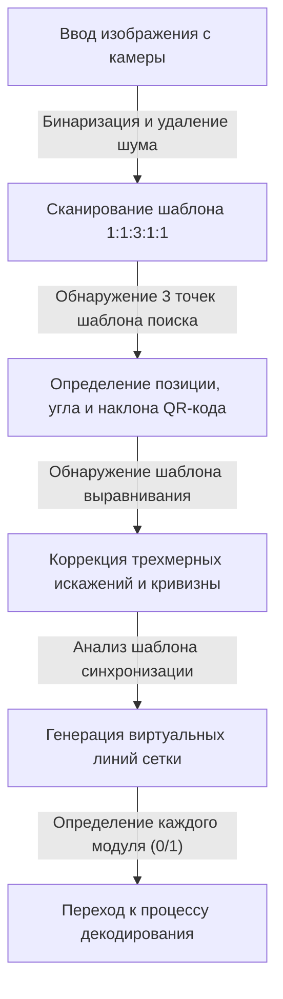
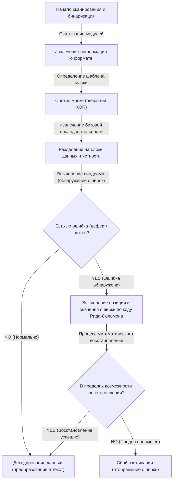

## Введение: Шедевр двумерных кодов, поддерживающий нашу жизнь

От безналичных платежей и доступа к веб-сайтам до посадочных талонов на самолет и даже управления деталями на заводах — в современном обществе не проходит и дня без «QR-кода (Quick Response Code)». Эта технология, позволяющая мгновенно подключаться к цифровым данным простым наведением смартфона или специального сканера, сегодня по праву считается одной из самых распространенных инфраструктурных технологий в мире.

Но задумайтесь на мгновение. Даже если напечатанный на плакате QR-код немного размыт от дождя или бумага помята и частично порвана, почему наш смартфон все равно может без проблем зайти на веб-сайт? В случае с традиционным одномерным штрихкодом, если хоть одна линия будет отсутствовать или испачкана, это сразу же приведет к «ошибке чтения».

За этой поразительной эффективностью считывания скрывается чрезвычайно сложная и изощренная инженерия, а также математические алгоритмы, разработанные японской корпорацией Denso Wave (тогда Denso) в 1994 году. В этой статье мы подробно и наглядно ответим на вопрос, почему QR-коды настолько быстрые и невероятно устойчивые к загрязнениям и повреждениям, разобрав три ключевых механизма: «тщательно продуманный шаблон размещения», «обработку маскирования, оптимизирующую распознавание данных» и «технологию коррекции ошибок, возрождающую данные словно феникса».

## Секрет 1: «Геометрические шаблоны размещения», которые не дают камере запутаться

Маленькие черные и белые квадраты, из которых состоит QR-код, называются «модулями». На первый взгляд они могут показаться хаотичным шумом модема, но внутри QR-кода заложено множество «фиксированных указателей», позволяющих сканеру (камере) распознавать код, а также точно определять его ориентацию и перспективу.

Камеры, например, в смартфонах, могут мгновенно находить QR-коды в кадре изображения и считывать точные данные благодаря тщательно рассчитанным шаблонам размещения, описанным ниже.

### 1. Шаблон поиска (шаблон обнаружения позиции): Распознавание на 360 градусов с любой стороны
Это большие двойные квадраты (по форме напоминающие мишени), расположенные в трех углах QR-кода (обычно в верхнем левом, верхнем правом и нижнем левом). Без преувеличения можно сказать, что это самая главная особенность QR-кода.

В этом шаблоне поиска скрыта некая «магическая пропорция». Под каким бы углом вы ни провели прямую линию через центр, соотношение длины черных и белых участков всегда будет составлять «черный:белый:черный:белый:черный = 1:1:3:1:1».
Когда программное обеспечение для обработки изображений сканирует видео с камеры по строкам, оно ищет именно этот шаблон «1:1:3:1:1». Поскольку такое соотношение крайне редко встречается случайно в природе или обычных печатных материалах, программа может быстро и с высокой точностью распознать: «здесь находится QR-код». Кроме того, поскольку они расположены в трех местах, даже если QR-код перевернут вверх ногами или находится под углом, система мгновенно пересчитывает правильную ориентацию.

### 2. Шаблон выравнивания: Промежуточная точка для исправления искажений
В зависимости от объема хранимых данных QR-коды имеют размеры от «версии 1» до «версии 40». По мере увеличения версии (увеличения числа модулей) внутри кода размещаются небольшие квадратные шаблоны, называемые «шаблонами выравнивания».

Если бумага изогнута или камера поднесена под сильным углом, сетка модулей выглядит искаженной из-за перспективы объектива. Шаблон выравнивания служит «базовой точкой координат» для корректировки этого искажения. Сканер обнаруживает эти шаблоны и виртуально перераспределяет изогнутую сетку на плоскую двумерную плоскость, обеспечивая точное считывание модулей.

### 3. Шаблон синхронизации: Линейка для вычисления координат модулей
Это чередующиеся черные и белые линии, расположенные в форме буквы L, соединяющие шаблоны поиска. Это называется «шаблоном синхронизации» и играет роль «линейки» для точного определения координат модулей в области данных. Даже если версия QR-кода неизвестна, сканер может подсчитать количество этих черно-белых чередований, точно вычислить общее количество модулей (разрешение) всего QR-кода и правильно сгенерировать сетку.

### 4. Свободная зона: Граница, разделяющая шум и сигнал
Это пустое, незапечатанное поле, которое обязательно присутствует вокруг QR-кода. По стандарту требуется ширина в 4 модуля по всему периметру. Наличие этого поля позволяет алгоритму распознавания изображений четко отделять область самого QR-кода от окружающего фонового шума (например, текста или фотографий) и устанавливать границы.

## Секрет 2: «Маскировка», предотвращающая путаницу программного обеспечения

Если данные QR-кода напрямую преобразовать в черно-белые точки и разместить их, может возникнуть серьезная проблема. Случайно могут образоваться «большие блоки плотно расположенных черных модулей» или «области, состоящие только из белых модулей».
Кроме того, в худшем случае внутри области данных случайно может появиться последовательность «1:1:3:1:1», идентичная шаблону поиска. Если это произойдет, сканер потеряет границы модулей или ошибочно примет их за шаблон поиска, что приведет к ошибке.

Оригинальная технология, полностью предотвращающая это, называется «маскировка» (наложение маски).

### Продвинутый алгоритм маскировки
При генерации QR-кода кодер (программа-генератор) не размещает данные как есть, а математически накладывает на область данных 8 заранее определенных «шаблонов масок» (правильных узоров, таких как шахматная доска, полосы, диагональная сетка и т. д.) с помощью операции XOR (исключающее ИЛИ).

Кодер не просто применяет одну маску, а генерирует внутри себя «8 тестовых кодов, к каждому из которых индивидуально применена одна из 8 масок». Затем для каждого тестового кода проводится строгая «оценка штрафов». Критерии оценки следующие:

1. **Последовательность одного цвета**: Нет ли 5 или более модулей одного цвета (черного или белого) подряд по вертикали или горизонтали.
2. **Большие блоки**: Сколько существует блоков одного цвета размером 2×2 модуля и более.
3. **Возникновение похожих шаблонов**: Не содержится ли последовательность «1:1:3:1:1», похожая на шаблон поиска.
4. **Общее соотношение черного и белого**: Насколько соотношение черных и белых модулей в целом отклоняется от 50:50.

Система вычисляет штрафные баллы на основе этих условий и выбирает шаблон маски с наименьшим баллом (то есть с наиболее сбалансированным распределением черного и белого, который легче всего считать) в качестве финального результата.

Тип выбранной маски (3-битная информация от 000 до 111) записывается в область «информации о формате» внутри QR-кода. При считывании QR-кода сканер сначала получает эту информацию о формате и снова применяет тот же шаблон маски через операцию XOR, чтобы снять маску и восстановить исходные данные. Благодаря этому невидимому трюку камера всегда может распознавать высокую контрастность и однородный шаблон.

## Секрет 3: Главная причина читаемости даже с пятнами - «Технология коррекции ошибок»

Самая веская причина, по которой QR-коды обладают подавляющей надежностью по сравнению с другими двумерными кодами, и волшебный механизм, позволяющий идеально восстанавливать данные, даже если часть кода испачкана, порвана или скрыта, — это технология коррекции ошибок, использующая «Код Рида-Соломона (Reed-Solomon error correction)».

### Что такое «Код Рида-Соломона», пришедший из космической связи?
Код Рида-Соломона — это математический алгоритм, первоначально разработанный в 1960-х годах. Вначале он использовался для коррекции шумов при передаче слабых сигналов от космических зондов, таких как «Вояджер», а также для исправления ошибок чтения данных на оптических носителях, таких как CD и DVD, вызванных царапинами на поверхности.

Этот алгоритм выполняет сложные полиномиальные вычисления над исходными данными (сообщением) и генерирует избыточные данные для восстановления, называемые «данными четности», которые затем добавляются к сообщению. Даже если часть данных будет потеряна, решая оставшиеся нормальные данные и данные четности как систему уравнений, можно математически полностью обратить процесс и восстановить утерянную часть.

### 4 уровня коррекции ошибок, выбираемые в зависимости от задачи
QR-коды стандартно оснащены этим мощным кодом Рида-Соломона, и при их создании можно выбрать один из 4 уровней коррекции ошибок (уровень ECC) в зависимости от применения. Чем выше установлен уровень, тем больше способность к восстановлению, но поскольку доля данных четности в коде увеличивается, объем полезных данных, которые можно сохранить, уменьшается, или необходимо увеличить размер (версию) самого QR-кода.

- **Уровень L (Low - около 7% способности к восстановлению)**: Используется в условиях с небольшим загрязнением или при отображении QR-кода на экране, когда условия считывания хорошие. Идеально подходит, если нужно максимизировать объем данных.
- **Уровень M (Medium - около 15% способности к восстановлению)**: Наиболее стандартный уровень, используемый для обычных печатных материалов и веб-сайтов.
- **Уровень Q (Quartile - около 25% способности к восстановлению)**: Рекомендуется для сред, где ожидаются загрязнения и повреждения, например, для уличных плакатов или транспортных накладных.
- **Уровень H (High - около 30% способности к восстановлению)**: Используется для управления деталями в суровых условиях, таких как заводы, или в тех случаях, когда требуется высочайшая надежность.

### Как работают дизайнерские QR-коды: Использование ошибок в своих целях
В последнее время мы часто видим дизайнерские QR-коды с логотипами компаний или иллюстрациями персонажей в центре. Вы, наверное, задаетесь вопросом: «А безопасно ли закрашивать часть QR-кода иллюстрацией?». На самом деле это мастерское использование (взлом) этой самой «технологии коррекции ошибок».

При создании дизайнерского QR-кода кодер заранее устанавливает максимальный уровень коррекции ошибок «Уровень H (30%)». Затем, помещая логотип в центр, он намеренно перезаписывает (разрушает) данные. С точки зрения сканера часть с логотипом распознается просто как «огромное пятно (дефект)». Однако, благодаря 30-процентной способности к восстановлению на уровне H, данные, скрытые логотипом, идеально восстанавливаются из окружающих оставшихся данных и данных четности.

## Общий процесс декодирования (считывания) QR-кода

Подведем итоги того, как описанные выше технологии работают вместе за те менее чем 0,1 секунды, пока вы наводите свой смартфон:

1. **Распознавание изображения и геометрическая коррекция**: Из видео, снятого камерой, находятся 3 шаблона поиска и определяются угол и наклон. Используя шаблоны выравнивания и синхронизации, генерируется виртуальная сетка, одновременно корректируя искажения изображения.
2. **Получение информации о формате**: Из специальных областей вокруг шаблонов поиска считывается информация об используемом «уровне коррекции ошибок» и «шаблоне маски».
3. **Снятие маски**: На основе полученной информации о шаблоне маски ко всей области данных применяется операция XOR, выявляя скрытый истинный массив данных.
4. **Формирование массива данных и проверка ошибок**: Черные и белые модули преобразуются в двоичные данные из 0 и 1 (битовую последовательность) в соответствии с правилом зигзагообразного продвижения с нижнего правого угла.
5. **Выполнение коррекции ошибок**: Битовая последовательность делится на часть данных и часть четности, и проводится проверка с помощью кода Рида-Соломона. Если есть дефекты или шум, исходные данные математически восстанавливаются на этом этапе.
6. **Интерпретация данных**: Наконец, в соответствии с режимом кодирования (цифры, буквенно-цифровые символы, бинарные данные, кандзи и т.д.) битовая последовательность преобразуется в текст или URL-адрес и отображается на экране пользователя.

## Заключение: Кристаллизация инженерии, упакованная в маленьком квадрате

QR-код, на который мы не задумываясь наводим смартфоны. На первый взгляд он кажется просто черно-белым мозаичным узором, но за ним скрывается несколько слоев технологий: «геометрические шаблоны размещения», максимально способствующие оптическому распознаванию изображений, «маскировка», оптимизирующая видимость на основе теории вероятностей и информатики, а также «технология коррекции ошибок» с помощью высшей математики, заимствованная из космической связи.

Именно благодаря тому, что эти сложные алгоритмы бесшовно интегрированы в квадрат размером всего несколько сантиметров, мы можем использовать QR-коды без малейшего стресса, даже при небольших загрязнениях, искажениях или при плохом освещении. В следующий раз, когда вы увидите QR-код в кафе или на плакате, подумайте о тончайшем взаимодействии инженерных решений, которые выполняются внутри него десятки раз в секунду.
