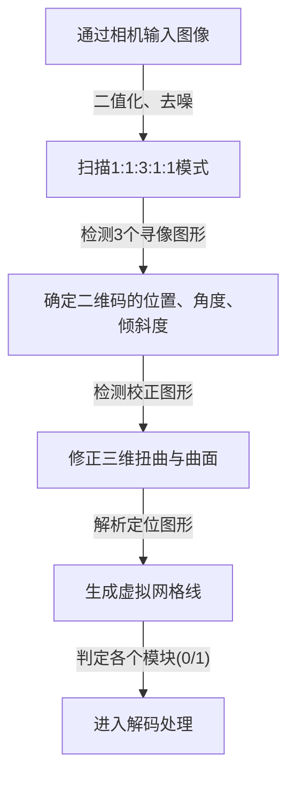
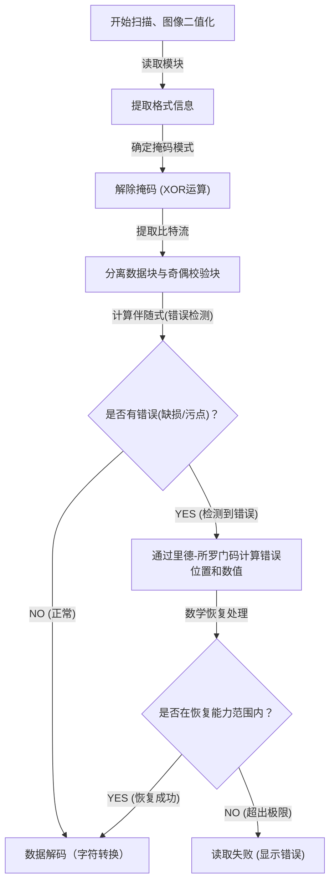

## 前言：支撑我们生活的二维码杰作

无论是无现金支付、访问网站、飞机登机牌，还是工厂里的零件管理，在现代社会中，我们几乎每天都会看到“二维码（Quick Response Code）”。只需用智能手机的专用读取器或相机轻轻一扫，就能瞬间连接到数字数据，这项技术可以说是目前世界上最普及的基础设施技术之一。

然而，请仔细想想。即使印在海报上的二维码被雨水淋湿而有些晕染，或者纸张折叠导致部分破损，为什么我们的智能手机依然能毫无问题地访问网站呢？如果换作传统的一维条形码，哪怕只有一条线缺失或变脏，也会立刻提示“读取错误”。

这种惊人读取性能的背后，隐藏着日本株式会社电装（DENSO WAVE，当时的电装）在1994年开发的极其高级且精密的工程学与数学算法。针对“二维码为何不仅速度快，而且对污损和破损具有压倒性抗性”的疑问，本文将从“精密设计的排列模式”、“优化数据识别的掩码处理”以及“让数据如凤凰涅槃般重生的纠错技术”这三个核心机制出发，进行直观且详细的解密。

## 第1个秘密：不让相机迷失的“几何学排列模式”

构成二维码的黑色和白色小方块被称为“模块”。乍看之下，它们可能像是杂乱无章的调制解调器噪点，但在二维码中，为了让扫描器（相机）能够识别代码并掌握准确的方向和透视关系，嵌入了许多“固定的路标”。

智能手机等相机的图像帧之所以能瞬间发现二维码并读出准确数据，全靠以下经过精心计算的排列模式：

### 1. 寻像图形（位置探测图形）：360度全方位识别
这是布置在二维码三个角（通常是左上、右上、左下）的巨大的双层正方形（形状类似于靶标）。毫不夸张地说，这是二维码最大的特征。

这个寻像图形中隐藏着一个“魔法比例”。无论以什么角度穿过中心画一条直线，黑色部分和白色部分的长度比例必然是“黑：白：黑：白：黑 ＝ 1：1：3：1：1”。
图像处理软件在用扫描线扫描相机画面时，就会寻找这个“1:1:3:1:1”的模式。由于这个比例在自然界或普通印刷品中偶然出现的概率极低，软件可以高速且高精度地识别出“这里有二维码”。此外，因为它们被放置在三个位置，所以即使二维码上下颠倒或倾斜，系统也能瞬间重新计算出正确的方向。

### 2. 校正图形：修正扭曲的中继点
二维码根据所能容纳的数据量，存在从“版本1”到“版本40”的不同尺寸。随着版本变大（模块数增加），代码内部会配置叫做“校正图形”的小正方形模式。

如果纸张弯曲，或者相机以极端的斜角拍摄，由于镜头的透视感（远近感），模块的网格看起来会发生扭曲。校正图形就是用来修正这种扭曲的“坐标基准点”。扫描器通过检测这些图形，将弯曲的网格虚拟地重新映射到一个平坦的二维平面上，从而实现对模块的准确读取。

### 3. 定位图形：推导模块坐标的直尺
这是连接寻像图形之间的、呈L型排列的黑白相间直线。这被称为“定位图形”，起着准确掌握数据区模块坐标的“直尺”作用。即使在不知道二维码版本的情况下，扫描器只需数一数这些黑白相间的数量，就能准确计算出整个二维码的模块数（分辨率），并准确生成网格。

### 4. 留白区：分离噪声和信号的边界线
这是在二维码周围必定留出的、没有印刷任何内容的空白区域。标准规范要求周围需要有4个模块宽度的留白。有了这个留白，图像识别算法就能明确地将二维码本体区域与周围的背景噪声（如文字或照片等）分离开来，确定其边界线。

## 第2个秘密：防止软件混乱的“掩码处理”

如果将二维码的数据直接转换成黑白点阵排列，可能会产生一个严重的问题。那就是偶然形成“黑色模块密集的大块区域”或“全白模块的区域”。
此外，在更糟糕的情况下，数据区内可能偶然出现与寻像图形相同的“1:1:3:1:1”的排列。如果发生这些情况，扫描器就会丢失模块的边界线，或者误认寻像图形而导致错误。

为了完全防止这种情况发生，有一项独创的技术叫做“掩码处理（Masking）”。

### 掩码处理的高级算法
在生成二维码时，编码器（生成软件）并不是直接放置数据，而是将预先定义好的8种“掩码模式”（如棋盘格、条纹、斜格等规则模式）以数学方式（XOR运算：异或运算）叠加在数据区上。

编码器并非只应用一种掩码，而是会在内部生成“分别应用了所有8种掩码的8个测试代码”。然后，它会对每一个测试代码进行严格的“惩罚评估”。评估标准如下：

1. **同色连续**：在纵向或横向上，是否有5个或更多相同颜色（黑色或白色）的模块连续。
2. **大块区域**：存在多少个2×2模块以上的同色块。
3. **出现类似模式**：是否包含类似于寻像图形的“1:1:3:1:1”的排列。
4. **整体黑白比例**：整体的黑色模块和白色模块比例与50:50的偏差有多大。

系统基于这些条件计算惩罚得分，并采用得分最低（即黑白分布最平衡、最容易读取）的掩码模式作为最终输出。

被采用的掩码种类（从000到111的3位信息）会记录在二维码内的“格式信息”区域。扫描器在读取二维码时，首先会获取这个格式信息，并再次应用相同的掩码模式进行XOR运算以解除掩码，从而还原原始数据。正是这种看不见的巧妙设计，让相机始终能够识别出高对比度和均匀的图案。

## 第3个秘密：脏了也能读取的最大原因——“纠错技术”

与其他二维码相比，二维码具有压倒性强韧性的最大原因，以及即使部分变脏、破损或被遮挡也能完美恢复数据的魔法般的机制，就是利用“里德-所罗门码（Reed-Solomon error correction）”的纠错技术。

### 来自宇宙通信的“里德-所罗门码”是什么？
里德-所罗门码原本是20世纪60年代开发的一种数学算法。其最初的用途是用于纠正旅行者号等太空探测器微弱通信中的噪声，以及修复CD、DVD等光学介质上因表面划痕导致的数据读取错误。

该算法对原始数据（信息）进行高级的多项式运算，生成并附加称为“奇偶校验数据”的用于恢复的冗余数据。即使数据的一部分丢失，通过像解联立方程那样将剩余的正常数据和奇偶校验数据结合起来，也能在数学上完美地逆向推算和恢复丢失部分的数据。

### 可根据用途选择的4个纠错级别
二维码标配了这种强大的里德-所罗门码，可以在创建时根据用途选择4个级别的纠错级别（ECC级别）。设置的级别越高，恢复能力就越强，但在代码中所占的奇偶校验数据比例就会增加，因此能容纳的实际数据量会减少，或者需要扩大二维码本身的尺寸（版本）。

- **级别 L (Low - 约7%的恢复能力)**：用于污损较少的环境或屏幕上显示的二维码等读取环境良好的情况。最适合需要最大化数据容量时使用。
- **级别 M (Medium - 约15%的恢复能力)**：在一般印刷品和网站中最常使用的标准级别。
- **级别 Q (Quartile - 约25%的恢复能力)**：推荐用于户外海报、物流运单等可能产生污损或损坏的环境。
- **级别 H (High - 约30%的恢复能力)**：用于工厂等恶劣环境下的零件管理，或需要最高可靠性的用途。

### 设计二维码的原理：反向利用错误
最近，我们经常看到一些设计感很强的二维码，其中央放置了企业标志或卡通人物插图。你可能会疑惑：“把二维码的一部分用插画涂掉没关系吗？”但这正是巧妙利用（Hack）了“纠错技术”。

在创建设计二维码时，编码器会预先将纠错级别设置为最高的“级别H（30%）”。然后，在中心放置标志，故意覆盖（破坏）数据。在扫描器看来，标志部分仅仅是一个“巨大的污点（缺损）”。然而，凭借级别H拥有的30%的恢复能力，被标志遮挡部分的数据可以通过周围剩余的数据和奇偶校验数据完美地恢复出来。

## 二维码解码（读出）的整体流程

以上所讲解的技术，是如何在将智能手机举起后仅仅不到0.1秒的时间内联动处理的呢？以下是整体流程的总结：

1. **图像识别与几何修正**：从相机捕捉到的画面中找出3个寻像图形，确定角度和倾斜度。利用校正图形和定位图形，在修正图像扭曲的同时生成虚拟的网格。
2. **获取格式信息**：从寻像图形周围的特定区域读取正在使用的“纠错级别”和“掩码模式”信息。
3. **解除掩码**：基于获取的掩码模式信息，对整个数据区进行XOR运算，让隐藏的真实数据排列显现出来。
4. **数据排列化与错误检查**：按照从右下角开始呈之字形前进的规则，将模块的黑白转换为0和1的二进制数据（比特流）。
5. **执行纠错**：将比特流分为数据部分和奇偶校验部分，进行基于里德-所罗门码的验证。如果有缺损或噪点，就在这里利用数学方法恢复原始数据。
6. **数据解释**：最后，根据编码模式（数字、字母数字、二进制、汉字等）将比特流转换为字符或URL，并显示在用户的屏幕上。

## 总结：凝聚在小正方形里的工程学结晶

我们平时漫不经心举起手机扫的二维码。乍一看不过是个黑白的马赛克图案，但在它的背后，却存在着多层技术的叠加：将光学图像识别辅助到极致的“几何学排列模式”、基于概率论和计算机科学优化可视性的“掩码处理”，以及转用自宇宙通信的高级数学“纠错技术”。

正因为这些复杂的算法被无缝地集成在只有几厘米见方的正方形中，即使在有少许污点、扭曲或光线条件不佳的情况下，我们依然能毫无压力地使用二维码。下次你在咖啡店或海报上看到二维码时，不妨想象一下在它背后每秒执行着几十次的精密工程学协同处理。
