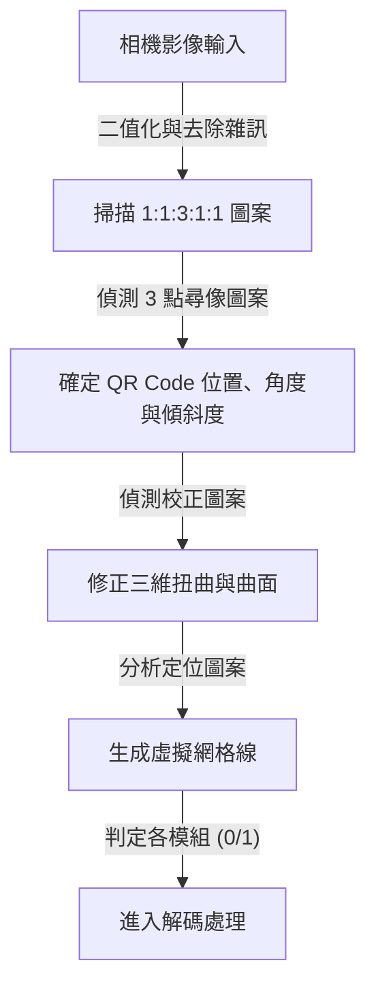
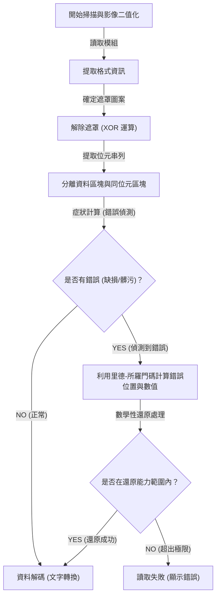

## 前言：支撐我們生活的二維條碼傑作

無論是無現金支付、造訪網站、飛機登機證，甚至工廠中的零件管理，在現代社會中，我們幾乎每天都會看到「QR Code（快速回應條碼）」。只需將智慧型手機迅速對準專用的讀取器或相機，便能瞬間連結至數位資料，這項技術可以說是目前全球最普及的基礎建設技術之一。

然而，請仔細想想。即使印在海報上的 QR Code 被雨淋濕而有些暈開，或者紙張折疊導致部分破損，為什麼我們的智慧型手機依然能毫無問題地造訪網站呢？如果傳統的一維條碼只要缺了一條線或有些許污漬，便會立刻出現「讀取錯誤」。

這項驚人讀取效能的背後，隱藏著由日本 Denso Wave 公司（當時的 Denso）於 1994 年開發的，極度高度且精密的工程學與數學演算法。本文將針對 QR Code 為何如此高速，且對污漬與破損擁有壓倒性抵抗力的問題，從「精密的幾何圖案配置設計」、「最佳化資料辨識的遮罩處理」，以及「讓資料如浴火鳳凰般重生的錯誤修正技術」這三個核心機制，進行視覺化且詳細的解析。

## 第一個秘密：不讓相機迷失的「幾何圖案配置」

構成 QR Code 的黑白小方形被稱為「模組」。乍看之下，或許就像雜亂無章的數據機雜訊，但 QR Code 中其實埋藏了許多「固定的路標」，以便掃描器（相機）辨識條碼並掌握正確的方向與透視角度。

智慧型手機等相機能夠在影像畫面中瞬間發現 QR Code 並讀出正確資料，全歸功於以下經過精心計算的配置圖案。

### 1. 尋像圖案（位置偵測圖案）：360度任何角度皆可辨識
配置在 QR Code 的三個角落（通常為左上、右上、左下），是巨大的雙重正方形（形狀類似標靶符號）。這可以說是 QR Code 最大的特徵。

這個尋像圖案中隱藏著某個「魔法比例」。無論從哪個角度畫一條通過中心的直線，黑色部分與白色部分的長度比例必定被設計成「黑：白：黑：白：黑 ＝ 1：1：3：1：1」。
影像處理軟體在掃描相機影像時，會尋找這個「1:1:3:1:1」的圖案。因為這種比例在自然界或一般印刷品中偶然發生的機率極低，軟體就能夠高速且高精確度地辨識出「這裡有 QR Code」。此外，因為配置在三個地方，所以即使 QR Code 上下顛倒或傾斜，系統也能瞬間重新計算出正確的方向。

### 2. 校正圖案：修正扭曲的中繼站
QR Code 根據儲存資料量的不同，存在從「版本1」到「版本40」的大小差異。隨著版本增大（模組數增加），配置在條碼內部的小正方形圖案便是「校正圖案」。

如果紙張彎曲，或者相機從極度傾斜的角度對準，鏡頭的透視感會讓模組的網格看起來有些扭曲。校正圖案的作用就是作為「座標基準點」來修正這些扭曲。掃描器會偵測這些圖案，並將彎曲的網格虛擬地重新對應至平坦的二維平面上，從而實現精確的模組讀取。

### 3. 定位圖案：導出模組座標的尺規
連接尋像圖案之間，呈現 L 字型配置，由黑白相間交替排列的直線。這被稱為「定位圖案」，扮演著精確掌握資料區塊中模組座標的「尺規」角色。即使在 QR Code 版本未知的情況下，掃描器藉由計算這些黑白交替的數量，便能精確算出整個 QR Code 的模組數（解析度），並正確地生成網格（格子）。

### 4. 靜區：隔離雜訊與訊號的邊界線
QR Code 周圍必定設有無任何印刷的空白區域。標準規格要求周圍需要有 4 個模組寬度的空白。藉由這個空白的存在，影像辨識演算法能夠將周圍的背景雜訊（如文字或照片等）與 QR Code 本體的區域明確分離，並確定邊界線。

## 第二個秘密：防止軟體混亂的「遮罩處理」

如果將 QR Code 的資料直接轉換成黑白點陣來配置，可能會產生嚴重的問題。那便是可能會偶然形成「黑色模組密集的巨大區塊」或是「全是白色模組的區域」。
更糟糕的情況是，資料區塊中可能偶然產生與尋像圖案相同的「1:1:3:1:1」排列。如果發生這些情況，掃描器就會失去模組的邊界線，或是誤認為尋像圖案而引發錯誤。

為了完全防止這種情況發生，所採用的獨創技術便是「遮罩處理（Masking）」。

### 遮罩處理的進階演算法
在生成 QR Code 時，編碼器（生成軟體）並不會直接配置資料，而是對資料區塊數學性地（XOR 運算：互斥或）疊加預先定義好的 8 種「遮罩圖案」（如棋盤格、條紋、斜線網格等規律圖案）。

編碼器不僅僅套用單一遮罩，而是在內部生成「個別套用了所有 8 種遮罩的 8 個測試條碼」。然後對每個測試條碼實施嚴格的「懲罰評估」。評估標準如下：

1. **同色連續**: 在垂直或水平方向上，是否有 5 個以上的相同顏色（黑或白）模組連續出現。
2. **巨大區塊**: 存在多少個 2×2 模組以上的同色區塊。
3. **類似圖案的產生**: 是否包含類似尋像圖案的「1:1:3:1:1」排列。
4. **整體黑白比例**: 整體的黑色模組與白色模組比例，與 50:50 的差異有多大。

系統會根據這些條件計算懲罰分數，並採用分數最低（即黑白分佈最均勻、最容易讀取）的遮罩圖案作為最終輸出。

被採用的遮罩種類（從 000 到 111 的 3 位元資訊）會被記錄在 QR Code 內的「格式資訊」區域。當掃描器讀取 QR Code 時，首先會取得這個格式資訊，並透過再次進行 XOR 運算套用相同的遮罩圖案來解除遮罩，恢復原始資料。這項看不見的巧思，讓相機總能辨識出高對比且均勻的圖案。

## 第三個秘密：就算弄髒也能讀取的最大理由「錯誤修正技術」

QR Code 相比於其他二維條碼具備壓倒性堅固性的最大理由，同時也是即使部分髒污、破損或被遮蔽，依然能完美還原資料的魔法般機制，就是活用了「里德-所羅門碼（Reed-Solomon error correction）」的錯誤修正技術。

### 來自太空通訊的「里德-所羅門碼」是什麼？
里德-所羅門碼最初是 1960 年代開發的數學演算法。早期的用途是用於航海家號等太空探測器微弱通訊中的雜訊補償，以及修復 CD、DVD 等光學媒體表面刮痕導致的資料讀取錯誤。

這項演算法會對原始資料（訊息）進行高階的多項式運算，並生成名為「同位元資料（Parity data）」的還原用冗餘資料並附加於其後。即使有部分資料遺失，只要將剩餘的正常資料與同位元資料當作聯立方程式來解，就能數學性地完全反推並還原出遺失的資料。

### 可依用途選擇的 4 種錯誤修正等級
QR Code 標準搭載了這項強大的里德-所羅門碼，並在建立時可依據用途選擇 4 個階段的錯誤修正等級（ECC 等級）。等級設定得越高，還原能力就越強，但因為同位元資料在條碼中所佔的比例增加，能儲存的實際資料量就會減少，或者需要增大 QR Code 本身的尺寸（版本）。

- **等級 L (Low - 約 7% 的還原能力)**: 用於髒污較少的環境，或是顯示在螢幕上的 QR Code 等讀取環境良好的情況。最適合想要將資料容量最大化時使用。
- **等級 M (Medium - 約 15% 的還原能力)**: 一般印刷品或網站中最常使用的標準等級。
- **等級 Q (Quartile - 約 25% 的還原能力)**: 建議用於戶外海報、物流單等可能發生髒污或損壞的環境。
- **等級 H (High - 約 30% 的還原能力)**: 用於工廠等惡劣環境中的零件管理，或是需要最高可靠性的用途。

### 設計版 QR Code 的原理：反向利用錯誤
最近經常看到中央配置了企業標誌或角色插圖、極具設計感的 QR Code。你或許會疑惑「把 QR Code 的一部分用插圖塗掉沒關係嗎？」，這其實正是巧妙利用（駭客手法）了這項「錯誤修正技術」。

在製作設計版 QR Code 時，編碼器會預先將錯誤修正等級設定為最高的「等級 H（30%）」。然後，在中央配置標誌，刻意覆寫（破壞）資料。對掃描器而言，標誌的部分只會被辨識為單純的「巨大污漬（缺損）」。然而，歸功於等級 H 擁有的 30% 還原能力，被標誌遮蔽部分的資料，能從周圍殘留的資料與同位元資料中完美還原。

## QR Code 解碼（讀出）的整體流程

我們將整理上述解說的各項技術，在將智慧型手機對準條碼短短不到 0.1 秒的時間內，是如何相互配合並處理的一連串流程。

1. **影像辨識與幾何修正**: 從相機捕捉的影像中，找出 3 個尋像圖案，確定角度與傾斜度。使用校正圖案與定位圖案，在修正影像扭曲的同時生成虛擬網格。
2. **取得格式資訊**: 從尋像圖案周圍的特殊區域，讀取出正在使用的「錯誤修正等級」與「遮罩圖案」等資訊。
3. **解除遮罩**: 根據取得的遮罩圖案資訊，對整個資料區塊進行 XOR 運算，讓隱藏的真實資料陣列浮現出來。
4. **資料陣列化與錯誤檢查**: 遵從由右下開始呈 Z 字型前進的規則，將模組的黑白轉換為 0 與 1 的二進制資料（位元串列）。
5. **執行錯誤修正**: 將位元串列分為資料部分與同位元部分，並透過里德-所羅門碼進行驗證。如果有缺損或雜訊，便在此以數學方法還原原始資料。
6. **資料解析**: 最後，依照編碼模式（數字、英數、二進制、漢字等），將位元串列轉換為文字或 URL，並顯示在使用者的螢幕上。

## 總結：凝聚在小正方形中的工程學結晶

我們平時不經意地用智慧型手機掃描的 QR Code，乍看之下不過是單純的黑白馬賽克圖案，但其背後卻存在著好幾層次技術，包含極限輔助光學影像辨識的「幾何圖案配置設計」、基於機率論與計算機科學最佳化可視性的「遮罩處理」，以及由太空通訊轉移而來、採用高階數學的「錯誤修正技術」。

正因為這些複雜的演算法被無縫整合在僅有幾公分大小的正方形中，即使在有些許髒污、扭曲或光線不佳的惡劣條件下，我們依然能毫無壓力地活用 QR Code。下次在咖啡廳或海報上看到 QR Code 時，不妨想像一下隱藏在背後每秒執行幾十次的精密工程協同運作吧。
