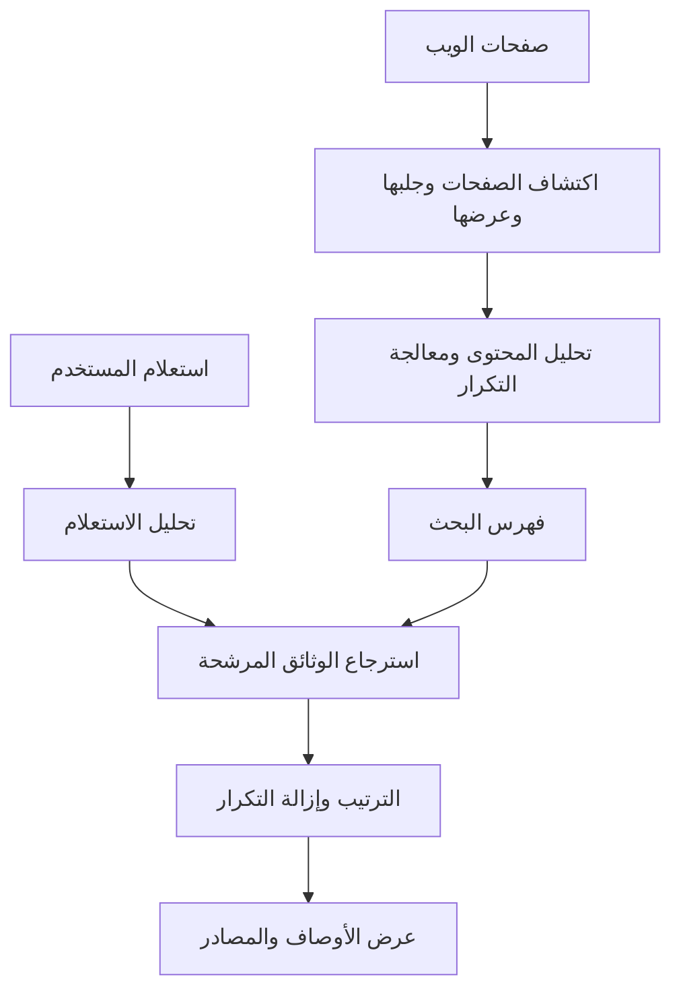
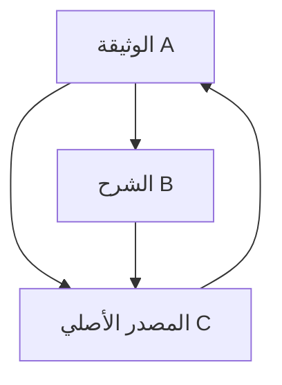
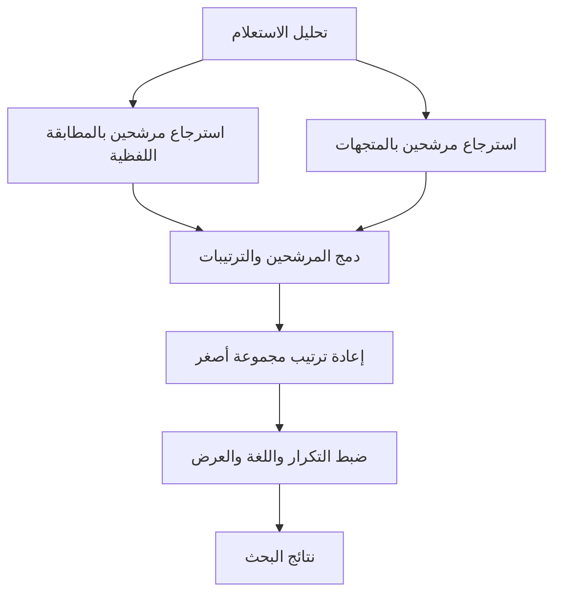

## 1. هل يقرأ المحرك الويب كله مع كل عملية بحث؟

نكتب بضع كلمات فتظهر النتائج بعد انتظار قصير. لا يبدأ محرك البحث في تلك اللحظة بقراءة جميع المواقع. لقد جمع معلومات ونظمها مسبقًا بحيث يمكن استرجاعها، ثم يستخدم استعلامنا هذا العمل التحضيري.

تخيل مكتبة: عندما تطلب كتابًا تمهيديًا في علم الفلك، لا يقرأ أمين المكتبة الكتب كلها من البداية. تساعده قائمة بالعناوين والمؤلفين والموضوعات والمواقع على تضييق الاحتمالات. يعتمد محرك البحث بالمثل على فهرس أُعد قبل وصول السؤال.

لكن الويب أقل استقرارًا من المكتبة. تظهر صفحات وتتغير وتختفي، وقد توجد المادة نفسها في عناوين متعددة. وليس وصف المؤلف لصفحته دقيقًا بالضرورة. لذلك يحتاج المحرك إلى متابعة التحديثات ومعالجة التكرار واختيار ما يناسب السؤال، لا إلى مجرد قائمة بالمحتويات.

يمكن تقسيم العمل إلى **جمع المعلومات، وبناء الفهرس، واختيار النتائج للاستعلام**. يميز شرح Google العام بين هذه المراحل. توضح المعادلات والبنى التالية مبادئ عامة في استرجاع المعلومات، ولا تكشف صيغة ترتيب خاصة بأي شركة. [Google: كيفية عمل البحث][google-overview]

## 2. لماذا ظهرت الحاجة إلى تقنيات البحث؟

البحث عن المعلومات أقدم من الويب. احتاجت فهارس المكتبات وقواعد الوثائق إلى طرق لاسترجاع المادة المناسبة. تنجح الأدلة التي ينظمها البشر مع المجموعات الصغيرة، لكن صيانة التصنيفات وتحديد مكان البحث يصبحان أصعب مع النمو.

ظهر Archie عام 1990 للبحث في أسماء الملفات الموجودة في أرشيفات FTP. لم يكن محركًا حديثًا يبحث في النص الكامل لصفحات الويب. عكس تطويره في جامعة McGill الحاجة إلى العثور على موارد الشبكة من خدمة مركزية. [McGill: تاريخ Archie][archie]

اقترح Tim Berners-Lee الويب في CERN عام 1989، وأتاحت CERN برمجيات الويب الأساسية ضمن الملكية العامة عام 1993. ومع انتشار الوثائق المترابطة، لم يعد البحث في الأسماء كافيًا؛ أصبح المحتوى والعلاقات بين الوثائق مهمين أيضًا. [CERN: نشأة الويب][web-history]

وصفت ورقة Google المنشورة عام 1998 بحثًا واسع النطاق يستخدم بنية الروابط ونصوصها إلى جانب محتوى الصفحات. لم ينشأ البحث الناجح من درجة ذكية واحدة: كان يجب أن يعمل الزحف والتخزين والضغط والفهرسة والترتيب معًا على نطاق متزايد. [ورقة Brin وPage][google-paper]

ولا يصح اختزال التاريخ في الانتقال من الكلمات إلى الذكاء الاصطناعي. تعالج الكلمات الدقيقة والإحصاءات وعلاقات الوثائق والنماذج اللغوية مشكلات مختلفة. لا تلغي الطرق الجديدة ضرورة العثور على رقم طراز محدد أو إبقاء الفهرس محدثًا.

## 3. كيف يختار الزاحف العناوين التي يزورها؟

يجلب الزاحف الصفحات، لكن لا يوجد سجل مركزي كامل لكل عنوان URL. يكتشف عناوين جديدة باتباع الروابط من صفحات يعرفها، وبقراءة خرائط المواقع التي توفرها المواقع.

ولا يعني اكتشاف العنوان جلبه فورًا. تنظم قائمة انتظار أولوية الزيارات المتكررة، والفاصل بين الطلبات إلى المضيف نفسه، والأخطاء، واحتمالات تغير المحتوى. تختلف فائدة إعادة زيارة الصفحة الرئيسية لموقع إخباري عن فائدة زيارة وثيقة ثابتة عمرها عشر سنوات. الزحف عملية تخصيص لموارد اتصال وحوسبة محدودة.

يجب أيضًا تجنب إغراق خادم المصدر. إذا أدت زيادة سرعة الجمع إلى توقف الموقع عن الاستجابة، ضاع الهدف. ينبغي تعديل السلوك عندما تتباطأ الاستجابات أو تتكرر الأخطاء.

وقد تولد روابط التقويم وتوليفات مرشحات البحث عددًا شبه غير محدود من العناوين. اتباع كل رابط بلا تمييز قد لا ينتهي. تساعد أنماط العناوين واكتشاف التكرار والتغير الحقيقي في المحتوى على تجنب الدوران في مسارات قليلة القيمة.

تساعد خريطة الموقع على الاكتشاف، لكنها ليست ضمانًا للفهرسة أو للظهور في مرتبة مرتفعة. معرفة العنوان وجلبه واختيار إدراج محتواه في الفهرس حالات مختلفة. [Google: خرائط المواقع][sitemaps]

## 4. الفرق بين robots.txt وnoindex والتحكم في الوصول

يخبر `robots.txt` الزواحف المتعاونة بالمسارات التي ينبغي ألا تجلبها. ويميز RFC 9309 هذه القواعد صراحةً عن منح صلاحيات الوصول. إنها ليست قفلًا يحمي المعلومات الخاصة. [RFC 9309][robots]

يطلب `noindex` من محرك يدعمه عدم إدراج الصفحة في الفهرس. ولكي يقرأ Google التعليمة داخل الصفحة، يجب أن يتمكن من الوصول إليها. منع الجلب مع توقع قراءة `noindex` الموجود داخل الصفحة أمر متناقض. وقد يعرف المحرك عنوانًا ممنوع الزحف من خلال روابط خارجية. [Google: التحكم في الفهرسة باستخدام noindex][noindex]

أما المصادقة والتحكم في الوصول فيحددان من يستطيع الحصول على المحتوى. قد تبدو هذه الآليات متشابهة، لكنها تعمل عند حدود مختلفة.

| الآلية | ما تتحكم فيه أساسًا | ما لا تضمنه وحدها |
|---|---|---|
| robots.txt | الجلب بواسطة الزواحف المتعاونة | سرية المحتوى أو اختفاء العنوان تمامًا |
| noindex | الإدراج في فهارس المحركات الداعمة | منع قراءة المحتوى |
| المصادقة والتحكم في الوصول | الأشخاص المسموح لهم بالحصول على المحتوى | محو كل نسخة أُنشئت بعد النشر |

عدم الظهور في البحث لا يعني استحالة القراءة. ويهم هذا التمييز أيضًا عند بناء بحث لوثائق شركة داخلية.

## 5. قد يختلف HTML المجلوب عن الصفحة التي يراها الزائر

تعيد بعض الخوادم HTML يتضمن المقال نفسه، بينما تعيد أخرى هيكلًا يملؤه JavaScript لاحقًا. في الحالة الثانية، لا يكفي تنزيل HTML بالضرورة لمعرفة ما يراه الزائر. قد يلزم تنفيذ عملية عرض تشبه عمل المتصفح.

تصف Google الزحف والعرض والفهرسة ضمن المعالجة. لكن دعم العرض لا يعني نجاح كل صفحة بالطريقة نفسها دائمًا. قد تؤثر الموارد المحجوبة والبرامج النصية الفاشلة والنصوص التي لا تظهر إلا بعد تفاعل المستخدم في المحتوى الذي يستطيع المحرك فهمه. [Google: أساسيات JavaScript والبحث][javascript]

بعد ذلك يجب تحليل الوثيقة: للمحتوى الرئيسي والقوائم والإعلانات والوسوم وترميز الأحرف واللغة أدوار مختلفة. إن معاملة الصفحة كسلسلة واحدة غير مميزة قد تجعل القوائم المتكررة تطغى على الموضوع. تقدم العناوين والمتن أنواعًا مختلفة من الأدلة.

وقد تتكرر المادة في عنوان للطباعة أو في عناوين تحمل معاملات تتبع. يجمع المحرك النسخ ويختار عناوين ممثلة حتى لا تمتلئ النتائج بالمقال نفسه. يتيح `rel="canonical"` اقتراح عنوان مفضل؛ وتتعامل معه Google بوصفه إشارة تساعد الاختيار، لا أمرًا غير مشروط. [Google: العناوين الأساسية][canonical]

## 6. تحويل اللغة إلى وحدات قابلة للبحث

يحتاج الحاسوب إلى قواعد تحدد الأجزاء التي تُعامل كمصطلحات بحث. يسمى تقسيم النص إلى وحدات عملية الترميز أو التجزئة. ثم يمكن للتطبيع أن يقرب بين بعض الاختلافات الكتابية أو الصرفية بحسب اللغة.

لا تفصل اليابانية عادةً بين الكلمات بمسافات، لذا لا تكفي قاعدة التقسيم عند المسافة لعبارة تتعلق بالعثور على محل لإصلاح الدراجات. يستطيع التحليل الصرفي تحديد الكلمات، ويمكن استخدام مجموعات قصيرة متتابعة من الأحرف، أو n-grams، بطريقة أخرى. يجب أن تكون معالجة الوثائق والاستعلامات متوافقة، وإلا فقد تفشل المطابقة بين تعبيرات متكافئة. يمثل Kuromoji مثالًا على تحليل مخصص لليابانية. [تجزئة النص][tokenization]، [Elastic: التحليل الياباني][kuromoji]

لكن ليس كل اختلاف جديرًا بالمحو. إزالة علامات الترقيم من C وC++ أو تغيير رقم منتج أو معرف كيميائي قد تلغي فارقًا أساسيًا. وتوسيع اختصار قد يزيد عدد المرشحين لكنه قد يضيف معنى غير مقصود.

من المفيد الاحتفاظ بالنص الأصلي منفصلًا عن تمثيله المستخدم للبحث. لا يلزم تغيير ما يقرأه الإنسان ليلائم الآلة. تحدد معالجة اللغة الاختلافات التي يعتبرها النظام متكافئة؛ فهي أكثر من تنظيف شكلي.

## 7. الفهرس المعكوس يقلب العلاقة بين الوثائق والكلمات

تخبرنا قراءة الوثيقة بالكلمات الموجودة فيها. أما البحث فيحتاج السؤال المعاكس: ما الوثائق التي تحتوي كلمة معينة؟ يحتفظ الفهرس المعكوس بهذه العلاقة.

لنأخذ مجموعة صغيرة، مع فصل المصطلحات مسبقًا للتوضيح.

| معرف الوثيقة | مصطلحات ممثلة |
|---|---|
| D1 | دراجة، إصلاح، أدوات |
| D2 | دراجة، تنقل، سلامة |
| D3 | ساعة، إصلاح، أدوات |
| D4 | دراجة، إصلاح، أسعار |

تحتوي قائمة دراجة على D1 وD2 وD4، وقائمة إصلاح على D1 وD3 وD4. تقاطعهما هو D1 وD4. وجدنا المرشحين بمقارنة قائمتين، دون إعادة قراءة النص الكامل لكل وثيقة. [الفهارس المعكوسة][inverted]

يمكن أن تتضمن قوائم الورود التكرار والمواضع إلى جانب المعرفات. وعند ترتيب المعرفات يمكن تخزين فروقها بصورة مضغوطة، مما يقلل البيانات المطلوب قراءتها. تأتي السرعة من تجنب العمل غير الضروري، لا من إضافة المعالجات فقط.

ولا يستخدم كل استعلام شرطًا صارمًا يقتضي وجود جميع الكلمات؛ قد يسترجع النظام تعبيرات بديلة أيضًا. ومع ذلك يبقى الانتقال السريع من المصطلح إلى الوثائق أساسًا للبحث في النص الكامل.

## 8. لماذا نهتم بمواضع الكلمات؟

تضم عبارتا «من القاهرة إلى الإسكندرية» و«من الإسكندرية إلى القاهرة» الاسمين نفسيهما، لكنهما تصفان رحلتين متعاكستين. وتختلف عبارة «تعلم الآلة» عن ظهور كلمتي تعلم والآلة بعيدتين في وثيقة طويلة.

يسجل الفهرس الموضعي مكان ورود المصطلحات. تتيح مقارنة ما إذا كانت كلمة تلي أخرى مباشرةً مطابقة العبارات، ويمكن لتقارب الكلمات أن يعطي دليلًا أقوى على الصلة بالموضوع. [الفهارس الموضعية][positions]

لكن المواضع لا تنتج فهمًا كاملًا. قد يحتاج النفي والشروط والضمائر والاقتباس إلى أكثر من قرب الكلمات. يحل الفهرس مشكلة استرجاع المرشحين بكفاءة، لا مشكلة التحقق من صدق العبارة.

لهذا قد تحتوي صفحة كلمات الاستعلام ولا تلبي حاجة المستخدم. المطابقة دليل يساعد على تقدير الحاجة، وليست الحاجة نفسها.

## 9. تختلف قيمة الكلمات الشائعة والنادرة

ليس من المفيد إعادة ألف مرشح وكأنهم متساوون. غالبًا ما يميز المصطلح الذي يظهر في وثائق قليلة الموضوع أكثر من كلمة موجودة في معظم الوثائق.

يعبر تكرار الوثيقة العكسي، IDF، عن هذه الفكرة عدديًا. ليكن $N$ عدد الوثائق و$df(t)$ عدد الوثائق التي تحتوي المصطلح $t$. نستخدم هنا صيغة تبقى موجبة:

$$
\operatorname{IDF}(t)=\ln\left(1+\frac{N-df(t)+0.5}{df(t)+0.5}\right)
$$

في مجموعة من 1,000 وثيقة، تبلغ القيمة نحو 4.56 لمصطلح يظهر في 10 وثائق، ونحو 0.693 لمصطلح يظهر في 500. تحمل مطابقة المصطلح الأندر دليلًا أكثر تمييزًا. توثق Lucene هذه الصيغة في تنفيذ BM25. [Apache Lucene: BM25Similarity][lucene]

لا تثبت الندرة الحقيقة أو الجودة. قد يكون خطأ إملائي نادرًا، وقد تسرد صفحة غير ذات صلة مصطلحات غريبة. يقيس IDF خاصية إحصائية للمجموعة، لا المصداقية.

## 10. كيف يجعل BM25 أثر التكرار يتشبع؟

تكرار المصطلح داخل الوثيقة دليل آخر. لكن اعتبار مئة تكرار أفضل بمئة مرة من تكرار واحد سيكافئ حشو الكلمات. وتضم الوثيقة الطويلة كلمات أكثر بطبيعتها، مما قد يظلم شرحًا قصيرًا ودقيقًا.

يقلل BM25 الفائدة الإضافية للتكرار ويضبط أثر طول الوثيقة. يمكن دراسة الصيغة التالية لاستعلام قصير:

$$
S(d,q)=\sum_{t\in q}\operatorname{IDF}(t)
\frac{f(t,d)(k_1+1)}{f(t,d)+k_1\left(1-b+b\frac{|d|}{\overline L}\right)}
$$

يمثل $f(t,d)$ تكرار المصطلح، و$|d|$ طول الوثيقة، و$\overline L$ متوسط الطول. يتحكم $k_1$ في تشبع أثر التكرار، و$b$ في تطبيع الطول. تختلف بعض صيغ IDF والعوامل الثابتة بين التنفيذات. [شرح BM25][bm25]

لوثيقة بطول متوسط ومع $k_1=1.2$، تكون قيمة عامل التكرار، دون IDF، كما يلي:

| عدد مرات الورود | عامل التكرار |
|---|---:|
| 1 | 1.000 |
| 2 | 1.375 |
| 5 | 1.774 |
| 10 | 1.964 |
| عدد كبير جدًا | يقترب من 2.2 |

أثر الانتقال من مرة إلى مرتين أكبر من الانتقال من تسع إلى عشر. يبقى التكرار دليلًا، لكن العامل لا ينمو بلا حد. يلغي $b=0$ تطبيع الطول في هذه الصيغة، وتزيد قيم $b$ الأكبر قوته.

درجة BM25 ليست عمومًا احتمال صحة الصفحة. إنها تقارن مرشحين لاستعلام ضمن فهرس معين. لا يصح التعامل مع درجات من استعلامات أو مجموعات مختلفة كمقياس مطلق للجودة.

## 11. PageRank أكثر من عدّ الأصوات

قد لا يميز النص وحده صفحات كثيرة تتناول الموضوع نفسه. تقدم الروابط نوعًا آخر من الأدلة: اختار شخص صفحةً بوصفها وجهة تستحق الإشارة إليها.

لو عُدّ كل رابط صوتًا متساويًا، لأمكن تصنيع الأصوات بإنشاء صفحات. يأخذ PageRank أهمية المصدر في الحسبان، ويوزع وزنه على روابطه الخارجة. قد تصبح الصفحة مهمة لأن صفحات مهمة تشير إليها؛ أي إن الحساب يعتمد على العلاقات المتبادلة.

تعرض المعادلة التالية نموذجًا تعليميًا مطبعًا. يمثل $N$ عدد الصفحات، و$L(u)$ عدد الروابط الخارجة من الصفحة $u$، و$\alpha$ احتمال اتباع رابط. وللتبسيط نفترض أن لكل صفحة رابطًا خارجًا.

$$
PR(v)=\frac{1-\alpha}{N}
+\alpha\sum_{u\to v}\frac{PR(u)}{L(u)}
$$

تخيل زائرًا يتبع رابطًا باحتمال $\alpha$، وينتقل في غير ذلك إلى صفحة مختارة عشوائيًا. يؤدي تكرار التحديث إلى توزيع يصف نسبة الوقت التي يقضيها في كل صفحة على المدى الطويل. تحتاج الصفحات التي لا تملك روابط خارجة إلى معالجة إضافية، مثل توزيع وزنها على الصفحات كلها.

عند $\alpha=0.85$ تبلغ القيم المستقرة التقريبية في هذا المثال A = 0.388 وB = 0.215 وC = 0.397. تتلقى C إشارات من A وB، بينما تتلقى B جزءًا من وزن A فقط. تهم المصادر وطريقة توزيع أوزانها، لا عدد الروابط الداخلة وحده.

يفسر النموذج PageRank، ولا يمثل نظام الترتيب الكامل لخدمة بحث حديثة. لا تحدد مقاييس الروابط مباشرةً معنى السؤال أو صحة الوقائع. ليست صفحة قديمة مشهورة بالضرورة أفضل مصدر لجدول قطارات اليوم. [الورقة الأصلية][google-paper]، [Google: أنظمة الترتيب][ranking]

## 12. من مطابقة الكلمات إلى فهم المقصود

قد يريد من يبحث عن حاسوب محمول ساخن نصائح للتبريد أو تشخيص العطل، لا تعريفًا للديناميكا الحرارية. وقد تشير كلمة «عين» إلى عضو البصر أو نبع ماء. يهم السياق، لا رسم الكلمة وحده.

يساعد تصحيح الإملاء والمرادفات والتعرف على الأسماء والمنتجات على توسيع الاسترجاع. لكن التصحيح غير المرغوب قد يعرقل البحث عن رقم طراز دقيق أو اسم نادر. يساعد الاحتفاظ بالاستعلام الأصلي وتوضيح التغيير وإتاحة المطابقة الصارمة على صون قصد المستخدم. [تصحيح الإملاء][spelling]

يمكن للبحث الدلالي تمثيل الاستعلام والوثيقة بمتجهات، أي مجموعات من الأعداد تقدم درجة تشابهها دليلًا على العلاقة. ينبغي ربط «البطارية تنفد بسرعة» بموضوع «إطالة مدة عمل البطارية» ولو اختلفت الكلمات.

يقيس تشابه جيب التمام تقارب اتجاهي المتجهين $\mathbf q$ و$\mathbf d$:

$$
\operatorname{sim}(\mathbf q,\mathbf d)=
\frac{\mathbf q\cdot\mathbf d}{\|\mathbf q\|\|\mathbf d\|}
$$

هذا التقارب خاص بالتمثيل الذي تعلمه النموذج. تشترك عبارتا «يمكن استبدال البطارية» و«لا يمكن استبدال البطارية» في معظم الكلمات، لكن الفارق بينهما جوهري. لا يضمن تقارب المتجهات جوابًا صحيحًا. يؤثر اختيار النموذج وحجم مقاطع النص وأسئلة التقييم في الجودة. [Elastic: البحث بالمتجهات][vector]

## 13. لماذا لا نطبق النموذج الأعلى تكلفة على كل صفحة؟

قد تفيد النماذج التي تفحص المعنى بدقة، لكن تقييم كل وثيقة بها مع كل استعلام مكلف. تفصل بنية مفيدة بين استرجاع أولي واسع وسريع، وإعادة ترتيب تفصيلية لمجموعة أصغر.

يختار البحث اللفظي أو البحث التقريبي عن أقرب الجيران المرشحين أولًا. ثم يستطيع نموذج أعلى تكلفة إعادة تقييمهم. تتبادل الطرق التقريبية السرعة واستهلاك الذاكرة مع خطر فقدان بعض الجيران الحقيقيين. ولا يستطيع معيد الترتيب إنقاذ وثيقة لم تدخل مجموعة المرشحين أصلًا.

تفيد المطابقة اللفظية في الأسماء والمعرفات، ويفيد البحث الدلالي في إعادة الصياغة. يجمع البحث الهجين القوتين. لكن اختلاف مقاييس الدرجات قد يجعل جمعها مباشرةً يمنح إحدى الطريقتين تأثيرًا مفرطًا.

دمج مقلوب الرتب، RRF، بديل ممكن. إذا كانت رتبة الوثيقة $d$ في القائمة $i$ هي $r_i(d)$، نجمع على القوائم التي تظهر فيها فقط:

$$
\operatorname{RRF}(d)=\sum_i\frac{1}{k+r_i(d)}
$$

يتحكم الثابت الموجب $k$ في مقدار هيمنة المراتب الأولى. هذه قاعدة لدمج الترتيبات، وليست احتمالًا. لا تسهم القائمة التي لا تحتوي الوثيقة بشيء. توثق Elasticsearch تنفيذًا يجمع النتائج اللفظية والمتجهية باستخدام RRF. [Elastic: دمج مقلوب الرتب][rrf]

هذه بنية توضيحية، وليست ادعاءً بأن جميع المحركات التجارية تتبع المراحل نفسها. الفكرة الأساسية هي إسناد دور مختلف لكل من الاسترجاع الواسع والترتيب الدقيق.

## 14. لا ينتهي العمل بترتيب الدرجات

إذا احتلت صفحات شبه متطابقة من موقع واحد جميع المراتب الأولى، فلن يجد المستخدم مجالًا كبيرًا للمقارنة. إلى جانب الدرجات الفردية، يمكن تقليل التكرار وتوفير وجهات نظر مختلفة ومراعاة اللغة والموقع.

يهم الموقع الجغرافي عند البحث عن إصلاح دراجة قريب، لكن دوره مختلف في تاريخ الدراجات. وتعتمد أهمية الحداثة على السؤال أيضًا: تحتاج معلومات النقل أثناء الطوارئ إلى تحديث، بينما لا يصبح برهان رياضي أفضل لمجرد أن تاريخ نشره أحدث.

تساعد العناوين والمقتطفات المستخدم على اختيار النتيجة التي يفتحها. لكن المقتطف المنتقى بحسب الاستعلام قد يحذف شرطًا مذكورًا في موضع آخر. لا ينبغي اعتباره تلقائيًا خلاصة المصدر الكاملة.

وتختلف الإعلانات عن النتائج العادية. يعمل الموضع المدفوع والترتيب العضوي بآليتين مختلفتين. تذكر Google أن الدفع لا يشتري مرتبة عضوية أعلى أو زحفًا أكثر تكرارًا. [Google: كيفية عمل البحث][google-overview]

## 15. كيف نبحث بسرعة في فهرس ضخم؟

تحد الآلة الواحدة من سعة الفهرس ومعدل الطلبات والقدرة على تحمل الأعطال. تقسم الأنظمة الموزعة الفهرس إلى أجزاء، تبحث فيها آلات مختلفة، ثم تدمج النتائج. تسمى هذه الأجزاء غالبًا شظايا أو shards.

في التقسيم بحسب الوثائق، يصل الاستعلام إلى كل جزء، ويعيد كل جزء مرشحين واعدين. يقارن المنسق بينهم لبناء الترتيب العام. لكن إحصاءات تكرار الوثائق المحلية قد تختلف، فتظهر مسألة قابلية مقارنة الدرجات. يؤثر الاختيار بين الإحصاءات المحلية والعامة في الجودة والسرعة معًا. [توزيع الفهارس][distributed]

التقسيم غير النسخ المتماثل. يوزع التقسيم البيانات أو العمل، بينما يحتفظ النسخ المتماثل بعدة نسخ. تساعد النسخ في تحمل الأعطال وتوزيع الحمل، لكنها تضيف مشكلة إيصال التحديثات إليها.

عندما تشارك آلات كثيرة، قد تطيل أبطأ استجابة زمن العملية كلها. لا يكفي المتوسط؛ يجب الانتباه إلى تجربة من ينتظرون طويلًا أيضًا. الانتظار لجميع النتائج أو فرض مهلة أو تجربة نسخة أخرى خيارات توازن بين الاكتمال والاستجابة السريعة.

يحفظ التخزين المؤقت نتائج شائعة أو حسابات وسيطة لتقليل العمل. لكن إعادة جواب الأمس مرارًا قد تخفي تعديلًا أو حذفًا. تحتاج وسائل تسريع الأداء إلى آليات تحفظ حداثة المعلومات.

## 16. يجب أن تصل الإضافات والتعديلات والحذف إلى الفهرس

تعديل صفحة لا يغير بالضرورة فهرسًا خارجيًا فورًا. يستغرق الجلب والتحليل وتحديث الفهرس وخدمة النتائج وقتًا. تمثل النتائج معلومات شوهدت وعولجت، لا الويب نفسه في كل لحظة.

يحتاج نظام البحث الخاص إلى مسارات للتحديث والحذف منذ البداية. إذا أنشأت كل عملية استيراد وثيقة جديدة، تراكمت النسخ. تسمح المعرفات المستقرة باستبدال المدخل الصحيح، ويجب أن يصل الحذف إلى النسخ التي تجيب عن الاستعلامات.

في البحث الداخلي، تغيير الصلاحيات تحديث أيضًا. لا يجوز أن تتسرب وثيقة أصبحت سرية اليوم عبر عنوان أو مقتطف محفوظ بالأمس. ينبغي فحص الوصول قبل إنتاج النتائج، وأن تحترم الذاكرات المؤقتة صلاحيات المستخدم.

عند إعادة بناء الفهرس، يمكن للنسخة القديمة الاستمرار في الخدمة حتى تكتمل الجديدة وتُفحص، ثم يحدث انتقال مضبوط. لا ينبغي إجبار المستخدم على البحث في فهرس نصف مكتمل. تدعم هذه الممارسات التشغيلية الهادئة موثوقية النظام.

## 17. مقاومة المحتوى المزعج جزء من البحث

يؤثر الترتيب في الزيارات والإيرادات، مما يخلق حوافز للتلاعب به. من الأمثلة التكرار المفرط للكلمات والروابط المصطنعة والكميات الكبيرة من الصفحات قليلة القيمة. لا يستطيع المحرك افتراض حسن النية في كل وثيقة.

تتناول سياسات Google حشو الكلمات والروابط المزعجة وما يتصل بهما. لذلك لا تقتصر الصلة على العثور على الكلمات المطابقة؛ يجب الحفاظ على المعلومات المفيدة رغم محاولات استغلال المقاييس. [Google: سياسات المحتوى المزعج][spam]

كثرة الروابط لا تثبت الحقيقة، والطول لا يثبت العمق، والحداثة لا تثبت الثقة. عندما تصبح الإشارة البديلة هدفًا، يمكن تحسينها دون تحسين القيمة الفعلية. يلزم استخدام أدلة متعددة وتقييم مستمر وفحص الحالات التي صُنفت خطأً.

واستبعاد المواقع الصغيرة غير المعروفة تلقائيًا يخلق مشكلة أخرى. قد يكون مصدر متخصص جديد قليل الروابط. ينبغي الاستفادة من الأدلة القائمة مع الاستمرار في اكتشاف معلومات جديدة قيّمة.

## 18. كيف نقيس جودة البحث؟

يتطلب التقييم استعلامات تمثل حاجات حقيقية وأحكامًا تحدد الوثائق المفيدة. لا تكفي أمثلة مختارة تبدو مقنعة. إذا كانت $A$ مجموعة الوثائق المعادة و$R$ مجموعة الوثائق ذات الصلة، فإن الإحكام يقيس نسبة المفيد مما أعدناه:

$$
\operatorname{Precision}=\frac{|A\cap R|}{|A|}
$$

أما الاستدعاء فيقيس نسبة ما استرجعناه من جميع الوثائق المفيدة:

$$
\operatorname{Recall}=\frac{|A\cap R|}{|R|}
$$

لنفترض وجود ثماني وثائق مفيدة. أعاد النظام خمسًا، كانت أربع منها مفيدة. يكون الإحكام 4/5 = 80%، والاستدعاء 4/8 = 50%. قد تبدو النتائج المعادة جيدة رغم ضياع نصف المادة المفيدة. [تقييم النتائج غير المرتبة][evaluation]

قد تقلل القيود الشديدة النتائج الخاطئة لكنها تستبعد نتائج مفيدة أيضًا. وقد يزيد التوسيع الاستدعاء والضجيج معًا. ليست هذه مبادلة ثابتة دائمًا؛ يمكن لتحليل أفضل أن يحسن المقياسين.

| ما نريد التحقق منه | مقياس مفيد |
|---|---|
| فائدة النتائج المعادة | الإحكام |
| مقدار المادة المفيدة المفقودة | الاستدعاء |
| جودة النتائج الأولى | الإحكام ضمن المراتب الأولى ومقاييس تراعي الترتيب |
| سرعة الإجابة | الوسيط وأزمنة الاستجابات البطيئة |
| تطبيق التحديثات والصلاحيات | تأخر التحديث وفحوص الحذف والوصول |

للترتيب أهمية كذلك. العثور على الوثيقة الصحيحة أولًا ليس كالعثور عليها في المرتبة المئة. تراعي مقاييس مثل NDCG درجات مختلفة للفائدة وتمنح المواضع العليا أهمية أكبر. [تقييم النتائج المرتبة][ranked-evaluation]

قد يخفي المتوسط الجيد ضعفًا في لغة معينة أو في الاستعلامات الطويلة والنادرة، لذا ينبغي تحليل هذه المجموعات منفصلة. والنقرة ليست حقيقة نهائية: قد يزيد الموضع العلوي النقرات، ويخيب عنوان جذاب الآمال، ويجيب مقتطف مفيد عن الحاجة دون نقرة.

## 19. ماذا يتغير عند إضافة توليد الإجابات؟

في التوليد المعزز بالاسترجاع، RAG، تُعطى الوثائق المسترجعة لنموذج لغوي ليستفيد منها عند صياغة الإجابة. تمثل ورقة Lewis وزملائه عام 2020 مرجعًا معروفًا لهذا النهج. [ورقة RAG][rag]

الاسترجاع والتوليد مرحلتان مختلفتان. إذا لم يُعثر على المصدر المناسب، فقد يكون أساس الإجابة ناقصًا. وحتى مع وجوده قد يحذف النموذج شرطًا أو يخلط عبارات من سياقات مختلفة. لا تضمن جودة الاسترجاع وحدها صحة النص المولد.

ولا يكفي ظهور إحالة إلى مصدر. يجب فحص ما إذا كان المصدر يدعم الادعاء بالفعل، وتاريخه ونطاق انطباقه والتعارض مع مصادر أخرى. ينبغي تقييم فقدان المصادر وحداثتها والتزام الإجابة بها كلًّا على حدة.

كما لا ينبغي اعتبار تعليمات مكتوبة داخل وثيقة خارجية أوامر إدارية للنظام. يمكن للمادة أن تكون دليلًا، لكنها لا تكتسب سلطة التحكم. يضيف الذكاء الاصطناعي مسؤولية صياغة الإجابة والتحقق منها، ولا يلغي ضرورة الفهرسة والتقييم.

## 20. تتبع عملية بحث من البداية إلى النهاية

تخيل البحث عن «أدوات إصلاح ثقب إطار دراجة». قبل وصول الاستعلام، جمع المحرك صفحات وحللها، وبنى فهارس للكلمات وربما للمتجهات.

عند وصول السؤال، يحلله بما يناسب اللغة. يسترجع البحث اللفظي والدلالي المرشحين، ثم يقدر الترتيب فائدتهم. تُخفض النسخ المتكررة وتُراعى اللغة وتُعد العناوين والمقتطفات. تتعاون آلات متعددة على نطاق واسع، بينما تستمر الإضافات والتعديلات والحذف في الخلفية.

بالنسبة إلى صاحب الموقع، الدرس العملي هو إتاحة محتوى يمكن جلبه، واستخدام عناوين وروابط ذات معنى، وتنظيم النسخ المكررة واللغات، وتلبية حاجة القارئ. تساعد هذه الأمور على فهم المحتوى، لكنها ليست حيلة سرية أو ضمانًا للصدارة.

أما القارئ، فلا ينبغي أن يساوي بين المرتبة العالية والحقيقة. يفيده السؤال الدقيق وتاريخ المصدر والوثيقة الأصلية والمعلومات البديلة. ينظم محرك البحث معلومات سبق رصدها ليصل بنا، ضمن وقت محدود، إلى مادة يُحتمل أن تفيدنا. فهم هذه القوة وحدودها معًا هو أساس استخدامه جيدًا.

### ملاحظات حول المصادر والرسوم

المعادلات نماذج تعليمية وليست درجات خاصة بخدمة تجارية. بُسطت المخططات لغرض الشرح. صورة الغلاف مولدة بالذكاء الاصطناعي وتصور الجمع والفهرسة والبحث بصورة مفاهيمية؛ وليست لقطة لواجهة خدمة حقيقية. تقود المراجع الواردة في النص إلى الأبحاث الأصلية والمعايير والوثائق الرسمية.

[google-overview]: https://developers.google.com/search/docs/fundamentals/how-search-works
[archie]: https://200.mcgill.ca/history/creation-of-the-first-internet-search-engine/
[web-history]: https://home.cern/science/computing/the-birth-of-the-web/where-web-was-born/
[google-paper]: https://infolab.stanford.edu/~backrub/google.html
[sitemaps]: https://developers.google.com/search/docs/crawling-indexing/sitemaps/overview
[robots]: https://www.rfc-editor.org/rfc/rfc9309.html
[noindex]: https://developers.google.com/search/docs/crawling-indexing/block-indexing
[javascript]: https://developers.google.com/search/docs/crawling-indexing/javascript/javascript-seo-basics
[canonical]: https://developers.google.com/search/docs/crawling-indexing/consolidate-duplicate-urls
[tokenization]: https://nlp.stanford.edu/IR-book/html/htmledition/tokenization-1.html
[kuromoji]: https://www.elastic.co/docs/reference/elasticsearch/plugins/analysis-kuromoji
[inverted]: https://nlp.stanford.edu/IR-book/html/htmledition/an-example-information-retrieval-problem-1.html
[positions]: https://nlp.stanford.edu/IR-book/html/htmledition/positional-indexes-1.html
[lucene]: https://lucene.apache.org/core/9_9_1/core/org/apache/lucene/search/similarities/BM25Similarity.html
[bm25]: https://nlp.stanford.edu/IR-book/html/htmledition/okapi-bm25-a-non-binary-model-1.html
[ranking]: https://developers.google.com/search/docs/appearance/ranking-systems-guide
[spelling]: https://nlp.stanford.edu/IR-book/html/htmledition/implementing-spelling-correction-1.html
[vector]: https://www.elastic.co/docs/solutions/search/vector
[rrf]: https://www.elastic.co/docs/reference/elasticsearch/rest-apis/reciprocal-rank-fusion
[distributed]: https://nlp.stanford.edu/IR-book/html/htmledition/distributing-indexes-1.html
[spam]: https://developers.google.com/search/docs/essentials/spam-policies
[evaluation]: https://nlp.stanford.edu/IR-book/html/htmledition/evaluation-of-unranked-retrieval-sets-1.html
[ranked-evaluation]: https://nlp.stanford.edu/IR-book/html/htmledition/evaluation-of-ranked-retrieval-results-1.html
[rag]: https://arxiv.org/abs/2005.11401
