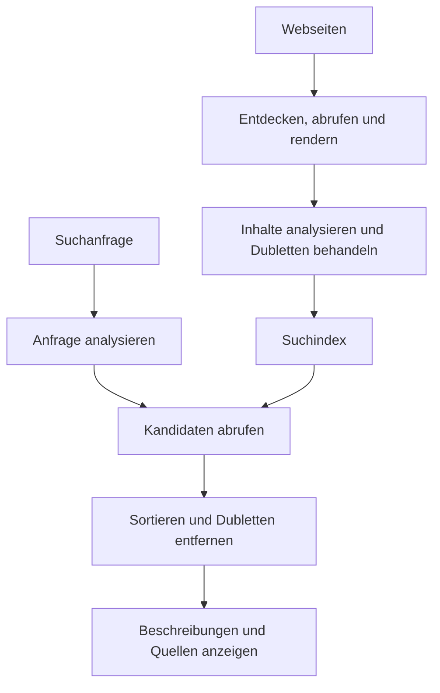
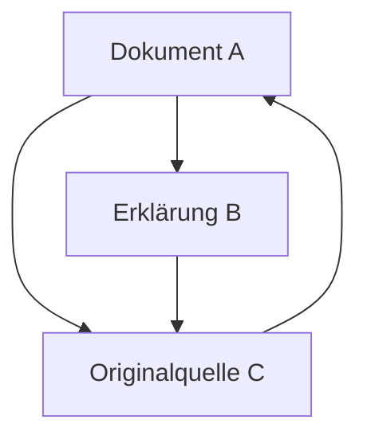
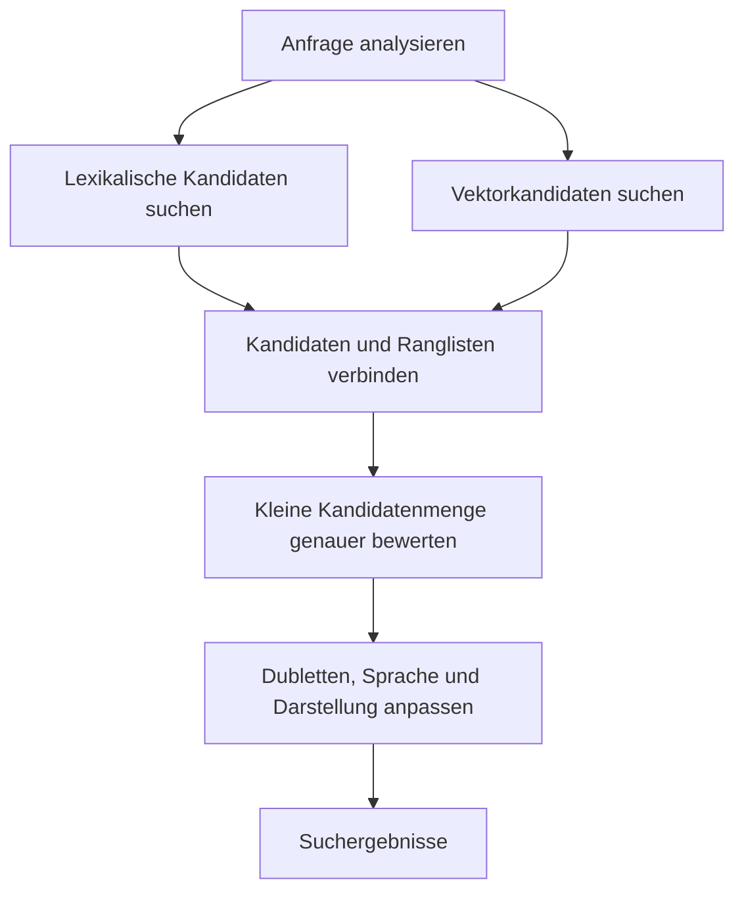

## 1. Liest jede Suche das gesamte Web neu?

Nach wenigen Wörtern im Suchfeld erscheinen rasch Ergebnisse. Die Suchmaschine beginnt aber nicht erst dann, sämtliche Webseiten zu lesen. Sie sammelt laufend Informationen und bereitet sie für spätere Anfragen auf.

Eine Bibliothek macht das Prinzip anschaulich. Fragt jemand nach einer Einführung in die Astronomie, liest die Bibliothekarin nicht den gesamten Bestand. Ein Katalog mit Titeln, Autoren, Themen und Standorten grenzt die Auswahl ein. Auch Suchmaschinen verdanken ihre Geschwindigkeit wesentlich einem vorher aufgebauten Index.

Das Web ist allerdings unbeständiger als ein Bücherbestand. Seiten entstehen, verändern sich und verschwinden; derselbe Inhalt hat manchmal mehrere Adressen. Selbstbeschreibungen der Autoren sind nicht unbedingt zuverlässig. Deshalb braucht das System zusätzlich Aktualisierung, Dublettenerkennung und eine Auswahl passend zur Frage.

Die grundlegenden Schritte heißen **Informationen sammeln, einen Index aufbauen und Ergebnisse zur Anfrage auswählen**. Auch Google beschreibt diese Unterscheidung. Die folgenden Formeln und Architekturen erklären allgemeine Prinzipien der Informationssuche, keine geheimen Rankingformeln eines Anbieters. [Google: Funktionsweise der Suche][google-overview]

## 2. Warum Suchtechnik notwendig wurde

Die Informationssuche ist älter als das Web. Bibliothekskataloge und Literaturdatenbanken benötigten bereits geeignete Verfahren. Menschlich gepflegte Verzeichnisse funktionieren bei kleinen Sammlungen gut; mit dem Wachstum werden sowohl ihre Pflege als auch die Wahl der richtigen Kategorie schwieriger.

Archie, 1990 eingeführt, suchte nach Dateinamen in FTP-Archiven. Es war keine heutige Volltextsuche über Webseiten. Die Entwicklung an der McGill University zeigte das Bedürfnis, verteilte Netzressourcen über einen gemeinsamen Dienst zu finden. [McGill: Geschichte von Archie][archie]

Tim Berners-Lee schlug das Web 1989 am CERN vor. 1993 stellte CERN grundlegende Websoftware in die Public Domain. Mit der Verbreitung verlinkter Dokumente genügte die Suche nach Namen nicht mehr: Inhalte und Beziehungen zwischen Dokumenten wurden wichtig. [CERN: Entstehung des Web][web-history]

Die Google-Veröffentlichung von 1998 beschrieb groß angelegte Suche mit Text, Linkstruktur und Linkbeschriftungen. Ein einziger kluger Zahlenwert reichte nicht: Erfassung, Speicherung, Kompression, Indexierung und Ranking mussten zusammen mit dem Informationsbestand wachsen. [Brin und Page: Aufbau einer Suchmaschine][google-paper]

Auch die Einteilung „früher Wörter, heute KI“ greift zu kurz. Exakte Begriffe, Dokumentbeziehungen, Statistik und Sprachmodelle ergänzen einander. Neue Methoden ersetzen weder die genaue Suche nach einer Modellnummer noch die laufende Pflege des Index.

## 3. Welche URLs besucht ein Crawler?

Ein Crawler ruft Webseiten ab. Ein vollständiges zentrales Register aller URLs existiert jedoch nicht. Neue Adressen werden etwa durch Links bekannter Seiten und durch bereitgestellte Sitemaps entdeckt.

Entdeckung bedeutet nicht sofortigen Abruf. Eine Warteschlange verwaltet Prioritäten für Wiederbesuche, Abstände zwischen Anfragen an denselben Host, Fehler und erwartete Änderungen. Eine Nachrichtenseite und ein zehn Jahre altes unverändertes Dokument profitieren unterschiedlich von einem erneuten Besuch. Begrenzte Bandbreite und Rechenleistung müssen verteilt werden.

Dabei darf der fremde Server nicht überlastet werden. Eine Quelle durch zu schnelles Abrufen lahmzulegen widerspricht dem Ziel. Langsame Antworten und wiederholte Fehler sollten das Verhalten des Crawlers beeinflussen.

Kalenderlinks und Kombinationen von Filterparametern können praktisch unbegrenzt viele Adressen erzeugen. Blind jedem Link zu folgen hat dann kein Ende. URL-Muster, Dubletten und Inhaltsänderungen helfen, wenig ergiebige Schleifen zu vermeiden.

Eine Sitemap unterstützt die Entdeckung, garantiert aber weder Aufnahme noch hohe Platzierung. Eine URL zu kennen, sie abrufen zu können und ihren Inhalt zu indexieren sind verschiedene Zustände. [Google: Sitemaps][sitemaps]

## 4. robots.txt, noindex und Anmeldung haben verschiedene Aufgaben

`robots.txt` teilt kooperierenden Crawlern mit, welche Pfade sie nicht abrufen sollen. RFC 9309 grenzt dies ausdrücklich von Zugriffsberechtigung ab. Die Datei ist kein Schloss für vertrauliche Informationen. [RFC 9309: Robots Exclusion Protocol][robots]

`noindex` fordert unterstützende Suchmaschinen auf, eine Seite nicht in ihren Index aufzunehmen. Um eine Anweisung innerhalb der Seite zu lesen, muss Google sie abrufen können. Den Abruf zu verbieten und zugleich das Lesen von `noindex` zu erwarten, funktioniert daher nicht. Eine gesperrte URL kann durch externe Links trotzdem bekannt werden. [Google: Indexierung mit noindex steuern][noindex]

Authentifizierung und Zugriffskontrolle bestimmen dagegen, wer den Inhalt überhaupt erhalten darf. Die Mechanismen betreffen unterschiedliche Grenzen.

| Mechanismus | Steuert hauptsächlich | Garantiert allein nicht |
|---|---|---|
| robots.txt | Abruf durch kooperierende Crawler | Vertraulichkeit oder vollständiges Verschwinden einer URL |
| noindex | Aufnahme in unterstützende Suchindizes | Verhinderung des Zugriffs auf Inhalte |
| Authentifizierung und Zugriffskontrolle | Wer Inhalte abrufen darf | Löschung aller nach Veröffentlichung entstandenen Kopien |

Nicht in der Suche aufzutauchen ist etwas anderes, als unlesbar zu sein. Diese Unterscheidung gilt auch für unternehmensinterne Dokumentensuche.

## 5. Heruntergeladenes HTML ist nicht immer die sichtbare Seite

Manche Server liefern den eigentlichen Text bereits im HTML, andere lassen ihn erst durch JavaScript erzeugen. Im zweiten Fall zeigt der ursprüngliche Download nicht unbedingt den Inhalt, den Besucher sehen. Dafür kann browserähnliches Rendering nötig sein.

Google beschreibt Crawling, Rendering und Indexierung als Verarbeitungsschritte. Rendering-Unterstützung garantiert jedoch nicht, dass jede Seite funktioniert. Gesperrte Ressourcen, fehlgeschlagene Skripte oder erst nach einer Interaktion sichtbare Inhalte können die Erfassung beeinträchtigen. [Google: Grundlagen zu JavaScript und Suche][javascript]

Anschließend müssen Tags, Navigation, Werbung und Haupttext unterschieden sowie Zeichencodierung und Sprache behandelt werden. Wer die ganze Seite als undifferenzierte Zeichenfolge zählt, lässt womöglich wiederholte Menüs das Thema überdecken. Titel, Überschriften und Haupttext liefern unterschiedliche Hinweise.

Identischer Inhalt kann unter Druckansichten oder URLs mit Trackingparametern erscheinen. Systeme gruppieren Dubletten und wählen repräsentative Adressen. `rel="canonical"` signalisiert eine bevorzugte URL; für Google ist es ein Hinweis zur Auswahl, kein bedingungsloser Befehl. [Google: kanonische URLs][canonical]

## 6. Sprache in durchsuchbare Einheiten zerlegen

Computer benötigen Regeln dafür, welche Textteile als Suchbegriffe gelten. Diese Zerlegung heißt Tokenisierung. Normalisierung kann anschließend Großschreibung, Zeichenbreite oder Wortformen vereinheitlichen.

Japanisch trennt Wörter normalerweise nicht durch Leerzeichen. Eine Aussage über eine Fahrradwerkstatt braucht daher sprachabhängige Verarbeitung. Morphologische Analyse kann Wörter erkennen; Zeichen-n-Gramme bilden eine Alternative. Dokumente und Anfragen müssen kompatibel verarbeitet werden, sonst passen gleichbedeutende Ausdrücke nicht zusammen. Kuromoji ist ein konkretes Beispiel japanischer Textanalyse. [Lehrbuch: Tokenisierung][tokenization], [Elastic: japanische Analyse][kuromoji]

Normalisierung sollte nicht jede Unterscheidung beseitigen. Satzzeichen in C und C++, Modellnummern oder chemischen Bezeichnungen können entscheidend sein. Die Auflösung einer Abkürzung findet zusätzliche Kandidaten, kann aber auch eine andere Bedeutung hineintragen.

Es hilft, Originaltext und Suchdarstellung getrennt zu speichern. Der sichtbare Text muss nicht maschinenfreundlich umgeschrieben werden. Sprachverarbeitung legt fest, welche Varianten als gleich gelten; sie ist mehr als kosmetische Bereinigung.

## 7. Der invertierte Index kehrt die Blickrichtung um

Beim Lesen erfahren wir, welche Wörter ein Dokument enthält. Eine Suche braucht die Umkehrung: Welche Dokumente enthalten ein Wort? Diese Zuordnung speichert der invertierte Index.

Betrachten wir eine kleine Sammlung mit bereits getrennten Begriffen.

| Dokument-ID | Repräsentative Begriffe |
|---|---|
| D1 | Fahrrad, Reparatur, Werkzeug |
| D2 | Fahrrad, Pendeln, Sicherheit |
| D3 | Uhr, Reparatur, Werkzeug |
| D4 | Fahrrad, Reparatur, Preise |

Die Liste zu Fahrrad enthält D1, D2 und D4; Reparatur enthält D1, D3 und D4. Die Schnittmenge ist D1 und D4. Zwei Listen genügen, ohne sämtliche Volltexte erneut zu lesen. [Lehrbuch: invertierte Indizes][inverted]

Praktische Einträge können Häufigkeiten und Positionen enthalten. Sortierte Dokumentkennungen lassen sich als komprimierte Differenzen speichern, wodurch weniger Daten gelesen werden. Geschwindigkeit entsteht auch durch vermiedene Arbeit, nicht nur durch zusätzliche Prozessoren.

Nicht jede Anfrage verlangt ein strenges UND. Systeme können alternative Formulierungen berücksichtigen. Der schnelle Weg vom Begriff zu Kandidatendokumenten bleibt dennoch eine Grundlage der Volltextsuche.

## 8. Warum Wortpositionen wichtig sind

Von Berlin nach München und von München nach Berlin enthalten dieselben Ortsnamen, beschreiben aber entgegengesetzte Reisen. Ebenso unterscheidet sich maschinelles Lernen als Ausdruck von weit auseinanderstehenden Wörtern in einem langen Text.

Ein Positionsindex hält fest, wo ein Begriff vorkommt. Der Vergleich aufeinanderfolgender Positionen unterstützt Phrasensuche; räumliche Nähe kann außerdem ein stärkeres Relevanzsignal liefern. [Lehrbuch: Positionsindizes][positions]

Positionen ergeben noch kein vollständiges Verständnis. Verneinung, Bedingungen, Pronomen und Zitate lassen sich nicht allein aus Nähe erschließen. Ein Index löst die schnelle Kandidatensuche, nicht die Wahrheitsprüfung.

Deshalb kann ein Text die Suchwörter enthalten und trotzdem am Bedarf vorbeigehen. Wortübereinstimmung ist ein Hinweis, nicht das Anliegen selbst.

## 9. Seltene und häufige Wörter liefern unterschiedliche Hinweise

Tausend gleichwertig präsentierte Treffer helfen wenig. Ein Begriff, der nur in wenigen Dokumenten vorkommt, unterscheidet Themen häufig besser als ein beinahe überall vorhandenes Wort.

Inverse Dokumenthäufigkeit, IDF, quantifiziert diese Idee. $N$ bezeichnet die Dokumentzahl und $df(t)$ die Zahl der Dokumente mit Begriff $t$. Wir verwenden eine positive Variante:

$$
\operatorname{IDF}(t)=\ln\left(1+\frac{N-df(t)+0.5}{df(t)+0.5}\right)
$$

In 1.000 Dokumenten erhält ein Begriff mit 10 Vorkommensdokumenten ungefähr 4,56; bei 500 Dokumenten ungefähr 0,693. Ein einzelner Treffer des selteneren Begriffs liefert mehr Unterscheidungskraft. Diese Form dokumentiert auch Lucenes BM25-Implementierung. [Apache Lucene: BM25Similarity][lucene]

Seltenheit beweist weder Wahrheit noch Qualität. Tippfehler können selten sein, und unpassende Seiten können Fachwörter aufzählen. IDF beschreibt eine statistische Eigenschaft, keine Glaubwürdigkeit.

## 10. BM25 lässt Wiederholungen sättigen

Die Häufigkeit eines Begriffs im Dokument ist ein weiterer Hinweis. Wären hundert Wiederholungen hundertmal besser als eine, würde das Überladen mit Schlüsselwörtern belohnt. Lange Texte enthalten zudem mehr Wörter und könnten kurze präzise Erklärungen verdrängen.

BM25 reduziert den zusätzlichen Nutzen weiterer Wiederholungen und berücksichtigt die Dokumentlänge. Für eine kurze Anfrage lässt sich folgende Form untersuchen:

$$
S(d,q)=\sum_{t\in q}\operatorname{IDF}(t)
\frac{f(t,d)(k_1+1)}{f(t,d)+k_1\left(1-b+b\frac{|d|}{\overline L}\right)}
$$

$f(t,d)$ ist die Begriffshäufigkeit, $|d|$ die Dokumentlänge, $\overline L$ die Durchschnittslänge. $k_1$ steuert die Sättigung, $b$ die Längennormalisierung. IDF-Varianten und konstante Faktoren unterscheiden sich zwischen Implementierungen. [Lehrbuch: BM25][bm25]

Für durchschnittliche Dokumentlänge und $k_1=1.2$ ergibt der Häufigkeitsteil ohne IDF:

| Vorkommen | Häufigkeitsfaktor |
|---|---:|
| 1 | 1,000 |
| 2 | 1,375 |
| 5 | 1,774 |
| 10 | 1,964 |
| Sehr viele | Nähert sich 2,2 |

Der Schritt von eins auf zwei wirkt stärker als der von neun auf zehn. Wiederholung bleibt ein Hinweis, steigert den Faktor aber nicht unbegrenzt. Mit $b=0$ entfällt hier die Längennormalisierung; größere Werte verstärken sie.

Ein BM25-Wert ist normalerweise nicht die Wahrscheinlichkeit, dass eine Seite richtig ist. Er vergleicht Kandidaten für eine Anfrage in einem Index. Werte verschiedener Anfragen oder Sammlungen sind keine absoluten Qualitätsnoten.

## 11. PageRank ist mehr als eine einfache Abstimmung

Ähnliche Texte lassen sich mit Wörtern allein schwer unterscheiden. Links liefern zusätzliche Hinweise: Jemand hat die Zielseite als Referenz ausgewählt. Würde jeder Link gleich zählen, ließen sich Stimmen durch massenhaft erzeugte Seiten vermehren.

PageRank berücksichtigt stattdessen das Gewicht der Quelle und verteilt es auf ihre ausgehenden Links. Eine Seite kann wichtig werden, weil wichtige Seiten auf sie verweisen. Die Berechnung ist wechselseitig abhängig.

Eine normalisierte Lehrform lautet wie folgt. $N$ ist die Seitenzahl, $L(u)$ die Zahl ausgehender Links von $u$ und $\alpha$ die Wahrscheinlichkeit, einem Link zu folgen. Zunächst nehmen wir an, dass jede Seite ausgehende Links besitzt.

$$
PR(v)=\frac{1-\alpha}{N}
+\alpha\sum_{u\to v}\frac{PR(u)}{L(u)}
$$

Ein zufälliger Besucher folgt mit Wahrscheinlichkeit $\alpha$ einem Link und springt sonst zu einer zufällig gewählten Seite. Wiederholte Aktualisierung führt zu einer Verteilung der langfristigen Aufenthaltsorte. Seiten ohne ausgehende Links benötigen eine Zusatzregel, etwa die Verteilung ihres Gewichts auf alle Seiten.

Mit $\alpha=0.85$ ergeben sich ungefähr A = 0,388, B = 0,215 und C = 0,397. C erhält Verweise von A und B; B bekommt nur einen Teil des Gewichts von A. Quellen und Verteilung zählen, nicht bloß die Zahl eingehender Links.

Dieses Modell erklärt PageRank, nicht das vollständige Ranking einer heutigen Suchmaschine. Links bestimmen weder direkt die Bedeutung einer Frage noch die Wahrheit einer Behauptung. Eine berühmte alte Seite ist nicht automatisch die beste Quelle für den heutigen Fahrplan. [Originalarbeit von Brin und Page][google-paper], [Google: Rankingsysteme][ranking]

## 12. Von Wortübereinstimmung zur Suchabsicht

Wer nach einem heißen Laptop sucht, braucht vielleicht Kühlung oder Fehlerbehebung statt einer Definition aus der Thermodynamik. Bank kann ein Geldinstitut oder eine Sitzgelegenheit bezeichnen. Kontext geht über Schreibweise hinaus.

Rechtschreibkorrektur, Synonyme und die Erkennung von Orts- oder Produktnamen können die Auswahl erweitern. Unerwünschte Korrekturen stören jedoch bei exakten Modellnummern oder ungewöhnlichen Namen. Die Originalanfrage zu erhalten, Änderungen zu erklären und strengere Suche zuzulassen hilft. [Lehrbuch: Rechtschreibkorrektur][spelling]

Semantische Suche kann Fragen und Dokumente als Zahlenvektoren darstellen und deren Nähe nutzen. Der Akku ist schnell leer und die Akkulaufzeit verbessern sollten auch ohne identische Wörter zusammenpassen können.

Die Kosinusähnlichkeit misst die Richtungsgleichheit von $\mathbf q$ und $\mathbf d$:

$$
\operatorname{sim}(\mathbf q,\mathbf d)=
\frac{\mathbf q\cdot\mathbf d}{\|\mathbf q\|\|\mathbf d\|}
$$

Nähe besteht innerhalb der gelernten Darstellung. Der Akku kann ersetzt werden und der Akku kann nicht ersetzt werden teilen viele Wörter, unterscheiden sich aber entscheidend. Nahe Vektoren garantieren keine richtige Antwort. Modell, Textabschnittslänge und Testanfragen müssen gemeinsam bewertet werden. [Elastic: Vektorsuche][vector]

## 13. Nicht jede Seite braucht das teuerste Modell

Modelle zur detaillierten Bedeutungsanalyse helfen, wären aber für alle Dokumente bei jeder Anfrage zu langsam und teuer. Eine nützliche Architektur trennt schnelle breite Kandidatensuche von genauer Neubewertung einer kleineren Menge.

Zuerst liefern lexikalische Suche oder eine approximative Suche nach nächsten Nachbarn Kandidaten. Danach kann ein rechenintensiveres Modell neu sortieren. Approximation spart Zeit und Speicher, kann aber echte Nachbarn übersehen. Ein bereits in der ersten Stufe fehlendes Dokument kann die spätere Bewertung nicht zurückholen.

Lexikalische Suche hilft bei Namen und Kennungen, semantische Suche bei Umschreibungen. Hybride Suche kombiniert beide. Unterschiedliche Punkteskalen machen einfaches Addieren problematisch, weil ein Verfahren dominieren kann.

Reciprocal Rank Fusion, RRF, ist eine Alternative. Für Dokument $d$ auf Rang $r_i(d)$ in Liste $i$ wird über die Listen summiert, in denen es vorkommt:

$$
\operatorname{RRF}(d)=\sum_i\frac{1}{k+r_i(d)}
$$

Die positive Konstante $k$ steuert den Einfluss der obersten Plätze. Das ist eine Regel zur Rangfusion, keine Wahrscheinlichkeit. Fehlt das Dokument in einer Liste, liefert diese keinen Beitrag. Elasticsearch dokumentiert die Verbindung lexikalischer und vektorbasierter Ergebnisse durch RRF. [Elastic: RRF][rrf]

Die Grafik zeigt ein Architekturbeispiel, keine identische Pipeline aller kommerziellen Dienste. Entscheidend ist die Aufteilung zwischen möglichst vollständiger Kandidatenauswahl und genauer Reihenfolge.

## 14. Eine Rangliste ist noch nicht das fertige Ergebnis

Wenn fast identische Seiten einer Website die Spitzenplätze belegen, bleibt wenig Vergleichsmöglichkeit. Systeme können daher Dubletten reduzieren, verschiedene Perspektiven berücksichtigen sowie Sprache und Region einbeziehen.

Der Standort ist für eine Fahrradwerkstatt in der Nähe wichtig, aber anders zu gewichten als bei der Geschichte des Fahrrads. Auch Aktualität hängt von der Frage ab: Verkehrsinformationen im Notfall müssen frisch sein; ein mathematischer Beweis wird nicht allein durch ein neueres Datum besser.

Titel und Ausschnitte helfen bei der Auswahl. Ein auf die Anfrage zugeschnittener Auszug kann jedoch Bedingungen aus dem übrigen Text auslassen. Seine Kurzform ist nicht automatisch die vollständige Aussage der Quelle.

Werbung und reguläre Ergebnisse sind ebenfalls zu unterscheiden. Bezahlte Platzierungen und organisches Ranking folgen verschiedenen Mechanismen. Google erklärt, dass Zahlungen weder höhere organische Positionen noch häufigeres Crawling kaufen können. [Google: Suchprinzip][google-overview]

## 15. Einen riesigen Index schnell durchsuchen

Eine einzelne Maschine begrenzt Kapazität, Durchsatz und Ausfallsicherheit. [Verteilte Systeme](/de/p/cap-theorem-distributed-systems-tradeoff/) zerlegen den Index, durchsuchen Teile auf mehreren Rechnern und führen Ergebnisse zusammen. Die Teile heißen häufig Shards.

Bei dokumentweiser Aufteilung geht eine Anfrage an die Shards, die jeweils aussichtsreiche Kandidaten liefern. Ein Koordinator vergleicht sie für das Gesamtranking. Unterschiedliche lokale Dokumenthäufigkeiten können allerdings die Vergleichbarkeit der Werte beeinflussen. Lokale und globale Statistik betrifft daher auch die Qualität. [Lehrbuch: verteilte Indizes][distributed]

Partitionierung ist nicht Replikation. Erstere teilt Daten oder Arbeit, Letztere hält mehrere Kopien derselben Daten. Kopien helfen bei Fehlern und Lastverteilung, bringen aber Fragen zur Verbreitung von Änderungen mit sich.

Bei vielen beteiligten Maschinen kann die langsamste Antwort die Gesamtzeit verlängern. Nicht nur der Durchschnitt, sondern auch die langsame Seite der Nutzererfahrung zählt. Auf alles warten, Fristen setzen oder eine andere Kopie anfragen bedeutet, Vollständigkeit und Reaktionszeit abzuwägen.

Caches für häufige Ergebnisse oder Zwischenberechnungen sparen Arbeit. Wer ständig die Antwort von gestern nutzt, übersieht aber Änderungen und Löschungen. Geschwindigkeit braucht deshalb ergänzende Aktualitätsregeln.

## 16. Auch Änderungen und Löschungen müssen den Index erreichen

Eine geänderte Webseite erscheint nicht zwangsläufig sofort verändert im Suchindex. Erneuter Abruf, Analyse, Indexänderung und Auslieferung benötigen Zeit. Ergebnisse repräsentieren beobachtete und verarbeitete Informationen, nicht das Web in jedem Augenblick.

Eine eigene Suche sollte Aktualisierung und Löschung von Anfang an vorsehen. Wenn jeder Import neue Dokumente anlegt, wachsen Dubletten. Stabile Kennungen ermöglichen das Ersetzen des richtigen Eintrags; Löschungen müssen auch die abfragenden Replikate erreichen.

In Unternehmen sind Berechtigungsänderungen ebenfalls Aktualisierungen. Ein seit heute vertrauliches Dokument darf nicht durch einen alten Titel oder Ausschnitt verraten werden. Rechte müssen vor der Ergebnisbildung geprüft werden, und Caches müssen sie respektieren.

Bei einem Indexneubau kann der alte Index weiterarbeiten, bis der neue vollständig und geprüft ist. Erst dann wird umgeschaltet. Nutzer sollten keinen halbfertigen Index durchsuchen müssen. Solche unscheinbaren Betriebsverfahren tragen die Zuverlässigkeit.

## 17. Spamschutz gehört zur Suche selbst

Ranking beeinflusst Reichweite und Einnahmen und schafft damit Manipulationsanreize. Übermäßige Wortwiederholung, künstliche Links und massenhaft wertarme Seiten sind Beispiele. Eine Suchmaschine kann nicht ausschließlich gutgläubige Autoren voraussetzen.

Googles Spamrichtlinien behandeln unter anderem Keyword-Stuffing und Linkspam. Qualität bedeutet also mehr als passende Wörter zu finden: Nützliche Informationen müssen auch gegen Manipulation der Messgrößen bestehen. [Google: Spamrichtlinien][spam]

Viele Links beweisen keine Wahrheit, Länge keine Tiefe und ein neues Datum keine Verlässlichkeit. Wird eine Ersatzgröße zum Ziel, lässt sie sich ohne echten Nutzen optimieren. Mehrere Signale, fortlaufende Bewertung und die Untersuchung falscher Verdächtigungen sind erforderlich.

Unbekannte kleine Websites pauschal abzuwerten wäre ebenfalls falsch. Eine neue Fachquelle hat vielleicht noch kaum Links. Suche muss vorhandene Reputation nutzen und zugleich neue wertvolle Informationen entdecken.

## 18. Wie misst man gute Suche?

Geschwindigkeit genügt nicht, wenn das benötigte Dokument fehlt. Bewertung benötigt repräsentative Anfragen und Urteile darüber, welche Dokumente jeweils relevant sind.

Zwei Grundmaße sind Präzision und Recall. Sei $A$ die zurückgegebene Menge und $R$ die relevante Menge:

$$
\operatorname{Precision}=\frac{|A\cap R|}{|A|}
$$

$$
\operatorname{Recall}=\frac{|A\cap R|}{|R|}
$$

Sind acht Dokumente relevant und vier der fünf Treffer relevant, beträgt die Präzision 4/5 = 80% und der Recall 4/8 = 50%. Eine enge Auswahl sicherer Treffer begünstigt oft Präzision, breitere Suche häufig Recall. Verbesserungen müssen aber nicht immer ein einfacher Tausch sein. [Lehrbuch: Mengenbewertung][evaluation]

| Frage | Maß oder Prüfaspekt |
|---|---|
| Sind die Treffer überwiegend brauchbar? | Präzision |
| Werden relevante Dokumente übersehen? | Recall |
| Helfen die ersten Ergebnisse? | Präzision bis zu einem Rang und rangbezogene Maße |
| Reagiert das System schnell genug? | Median und langsamer Bereich der Latenzverteilung |
| Werden Änderungen und Rechte berücksichtigt? | Verzögerung, Löschung und Berechtigungsprüfung |

Ein relevanter Treffer auf Platz eins unterscheidet sich von einem auf Platz hundert. Maße wie NDCG berücksichtigen Relevanzstufen und Positionen. Auswertungen nach Sprache, Anfrageart oder Länge machen Probleme sichtbar, die ein Gesamtdurchschnitt verdeckt. [Lehrbuch: Bewertung sortierter Ergebnisse][ranked-evaluation]

Klicks sind keine eindeutige Wahrheit. Ein Ergebnis kann wegen der oberen Position oder eines reißerischen Titels angeklickt und sofort enttäuscht verlassen werden. Umgekehrt kann ein guter Ausschnitt die Frage ohne Klick beantworten. Beobachtetes Verhalten verlangt Interpretation.

## 19. KI-Antworten benötigen weiterhin Suche

Retrieval-Augmented Generation, RAG, übergibt gefundene Dokumente an ein Sprachmodell, das eine Antwort erzeugt. Eine Arbeit von 2020 stellte die Verbindung eines vortrainierten Modells mit extern abgerufenen Informationen vor. [Lewis und weitere Autoren: RAG][rag]

Abruf und Generierung bleiben verschiedene Aufgaben. Fehlt die richtige Quelle, fehlen Belege. Auch mit der richtigen Quelle kann die Antwort Bedingungen auslassen oder Aussagen falsch verbinden. Retrieval beseitigt Fehler nicht automatisch.

Ein Quellenlink beweist ebenfalls nicht, dass jeder Satz gestützt ist. Die Quelle muss die Behauptung enthalten; Datum und Anwendungsbereich müssen passen; Widersprüche benötigen Aufmerksamkeit.

Beim eigenen System helfen getrennte Prüfungen von übersehenen Dokumenten, Quellenaktualität und Übereinstimmung zwischen Antwort und Beleg. Außerdem dürfen Anweisungen in externen Dokumenten nicht zu Systembefehlen werden. Dokumente liefern Informationen, keine Verwaltungs- oder Zugriffsrechte.

KI schafft Indizes und Quellen daher nicht ab, sondern ergänzt Verarbeitung und Prüfung. Je leichter die Antwort zu lesen ist, desto wichtiger bleibt ihre Nachvollziehbarkeit.

## 20. Hinter dem Suchfeld stehen Vorbereitung und Urteil

Nehmen wir eine Anfrage nach Werkzeug für einen Fahrradplatten. Schon vorher werden Seiten gesammelt, analysiert und Wörter, Positionen sowie Beziehungen geordnet. Bei der Anfrage folgen Normalisierung, Kandidatenauswahl und Sortierung für die Aufgabe.

Danach werden Dubletten, Sprache, Beschreibungen und Darstellung angepasst. Im Hintergrund arbeiten mehrere Rechner und übernehmen Änderungen, Löschungen und Rechte. Eine schnelle Antwort beruht auf langer Vorbereitung und dauernder Pflege.

Für Websitebetreiber sind abrufbarer Inhalt, klare Überschriften und Links, geordnete Dubletten- und Sprachbeziehungen sowie hilfreiche Erklärungen die Grundlage. Versteckte Tricks ersetzen sie nicht, und ihre Einhaltung garantiert keinen bestimmten Rang.

Für Suchende ist eine hohe Position kein absoluter Wahrheitsbeweis. Präzisere Fragen, ein Blick auf Datum und Quellen sowie andere Formulierungen liefern zusätzliche Anhaltspunkte.

Eine Suchmaschine ist kein perfekter Spiegel der Welt. **Sie ordnet beobachtbare Informationen und bildet unter Zeitgrenzen eine Reihenfolge, die bei einer Frage helfen soll.** Diese Grenzen erklären Geschwindigkeit, Auslassungen und den sinnvollen Umgang mit Ergebnissen.

## Quellen und Einordnung der Abbildungen

Der Artikel verbindet allgemeine Retrievalprinzipien mit öffentlichen Unterlagen. BM25, PageRank und RRF dienen als Lehrmodelle, nicht als interne Bewertung eines Anbieters. Diagramme vereinfachen Abläufe. Das KI-generierte Titelbild ist eine konzeptionelle Illustration, keine reale Anlage oder Benutzeroberfläche.

- [Google: Überblick][google-overview], [Sitemaps][sitemaps], [JavaScript][javascript], [noindex][noindex], [kanonische URLs][canonical]
- [Google: Rankingsysteme][ranking], [Spamrichtlinien][spam]
- [CERN: Webgeschichte][web-history], [McGill: Archie][archie], [Originalarbeit von Brin und Page][google-paper]
- [Lehrbuch: Tokenisierung][tokenization], [invertierte Indizes][inverted], [Positionen][positions], [BM25][bm25], [verteilte Indizes][distributed], [Rechtschreibkorrektur][spelling]
- [Lehrbuch: Präzision und Recall][evaluation], [Rangbewertung][ranked-evaluation], [Lucene: BM25][lucene]
- [Elastic: japanische Analyse][kuromoji], [Vektorsuche][vector], [RRF][rrf], [RAG-Originalarbeit][rag]
- [RFC 9309: Regeln für Crawler][robots]

[google-overview]: https://developers.google.com/search/docs/fundamentals/how-search-works
[archie]: https://200.mcgill.ca/history/creation-of-the-first-internet-search-engine/
[web-history]: https://home.cern/science/computing/the-birth-of-the-web/where-web-was-born/
[google-paper]: https://infolab.stanford.edu/~backrub/google.html
[sitemaps]: https://developers.google.com/search/docs/crawling-indexing/sitemaps/overview
[robots]: https://www.rfc-editor.org/rfc/rfc9309.html
[noindex]: https://developers.google.com/search/docs/crawling-indexing/block-indexing
[javascript]: https://developers.google.com/search/docs/crawling-indexing/javascript/javascript-seo-basics
[canonical]: https://developers.google.com/search/docs/crawling-indexing/consolidate-duplicate-urls
[tokenization]: https://nlp.stanford.edu/IR-book/html/htmledition/tokenization-1.html
[kuromoji]: https://www.elastic.co/docs/reference/elasticsearch/plugins/analysis-kuromoji
[inverted]: https://nlp.stanford.edu/IR-book/html/htmledition/an-example-information-retrieval-problem-1.html
[positions]: https://nlp.stanford.edu/IR-book/html/htmledition/positional-indexes-1.html
[lucene]: https://lucene.apache.org/core/9_9_1/core/org/apache/lucene/search/similarities/BM25Similarity.html
[bm25]: https://nlp.stanford.edu/IR-book/html/htmledition/okapi-bm25-a-non-binary-model-1.html
[ranking]: https://developers.google.com/search/docs/appearance/ranking-systems-guide
[spelling]: https://nlp.stanford.edu/IR-book/html/htmledition/implementing-spelling-correction-1.html
[vector]: https://www.elastic.co/docs/solutions/search/vector
[rrf]: https://www.elastic.co/docs/reference/elasticsearch/rest-apis/reciprocal-rank-fusion
[distributed]: https://nlp.stanford.edu/IR-book/html/htmledition/distributing-indexes-1.html
[spam]: https://developers.google.com/search/docs/essentials/spam-policies
[evaluation]: https://nlp.stanford.edu/IR-book/html/htmledition/evaluation-of-unranked-retrieval-sets-1.html
[ranked-evaluation]: https://nlp.stanford.edu/IR-book/html/htmledition/evaluation-of-ranked-retrieval-results-1.html
[rag]: https://arxiv.org/abs/2005.11401
