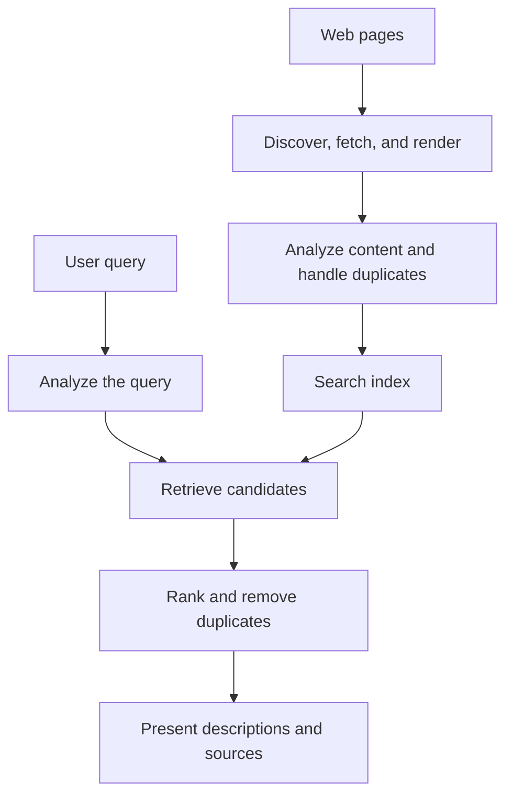
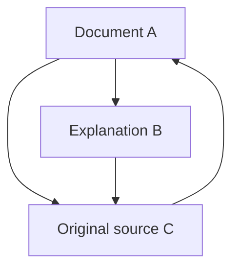
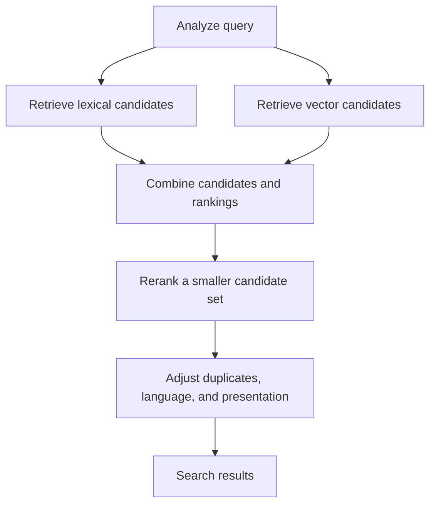

## 1. Does every search read the entire web again?

Type a few words into a search box and results appear after a short wait. The engine does not start reading every website at that moment. It has already collected information and organized it for retrieval; the query uses that preparation.

Think of a library. When someone asks for an introductory astronomy book, the librarian does not read the entire collection from the beginning. A catalog of titles, authors, subjects, and locations narrows the possibilities. Search engines similarly depend on indexes built beforehand.

The web is less stable than a library, however. Pages appear, change, and disappear; the same content can exist at several URLs. Authors' descriptions are not necessarily accurate. A useful engine therefore needs more than a catalog: it must track updates, handle duplicates, and select material appropriate to a question.

The broad stages are **collecting information, building an index, and selecting results for a query**. Google's public explanation uses this distinction. The formulas and architectures below illustrate general information-retrieval principles; they do not reconstruct any service's private ranking formula. [Google: how Search works][google-overview]

## 2. Why search technology became necessary

Finding information predates the web. Library catalogs and document databases already needed retrieval methods. Human-maintained directories work well for small collections, but as collections grow, both maintaining categories and deciding where to look become harder.

Archie, introduced in 1990, searched filenames in FTP archives. It was not a modern engine searching the full text of web pages. Its development at McGill University reflected the need to locate network resources from a central service. [McGill: the history of Archie][archie]

Tim Berners-Lee proposed the web at CERN in 1989; in 1993 CERN placed its basic web software in the public domain. As linked documents spread, searching names was no longer enough. Systems needed to examine content and relationships between documents. [CERN: the birth of the web][web-history]

The 1998 Google paper described large-scale search using link structure and anchor text as well as page content. Search did not emerge from one clever score alone: crawling, storage, compression, indexing, and ranking all had to work as information grew. [Brin and Page: the anatomy of a search engine][google-paper]

Nor is history simply a transition from words to AI. Exact terms, document relationships, statistics, and language models address different weaknesses. New methods do not remove the need to retrieve a precise product identifier or keep an index current.

## 3. Which URLs does a crawler visit?

A crawler fetches pages, but there is no complete central register of every URL. It discovers candidates by following links from known pages and consulting sitemaps supplied by sites.

Discovery does not mean immediate retrieval. A queue manages revisit priorities, spacing between requests to one host, failures, and likely changes. A news homepage and a ten-year-old static document offer different benefits from a fresh visit. Crawling allocates limited bandwidth and computation.

The remote server must not be overloaded. Accelerating collection until the source fails defeats the purpose. A crawler needs to adjust its behavior when responses slow down or errors persist.

Calendar links and combinations of search filters can also create effectively unlimited URLs. Following every link blindly may never finish. URL patterns, duplicate detection, and changes in content help avoid low-value loops.

A sitemap assists discovery; it is not an application guaranteeing indexing or a high position. Knowing a URL, fetching it, and choosing to index its content are different states. [Google: sitemap overview][sitemaps]

## 4. robots.txt, noindex, and authentication do different jobs

`robots.txt` tells cooperating crawlers which paths they should avoid fetching. RFC 9309 explicitly distinguishes these rules from access authorization. They are not locks protecting private information. [RFC 9309: Robots Exclusion Protocol][robots]

`noindex` asks a supporting search engine not to index a page. To read an instruction inside a page, Google must be able to access that page. Blocking retrieval while expecting it to read the page's `noindex` directive is therefore contradictory. A blocked URL can still become known through external links. [Google: controlling indexing with noindex][noindex]

Authentication and access control instead determine who may retrieve the content. The mechanisms can appear related, but operate at different boundaries.

| Mechanism | Mainly controls | Does not guarantee by itself |
|---|---|---|
| robots.txt | Fetching by cooperating crawlers | Confidentiality or complete disappearance of a URL |
| noindex | Inclusion in supporting search indexes | Prevention of content access |
| Authentication and access control | Who can retrieve content | Erasure of every copy made after publication |

Not appearing in search is different from being unreadable. This distinction also matters when building search for internal company documents.

## 5. Downloaded HTML may differ from the visible page

Some servers return HTML containing the article itself; others return a shell whose text is created later by JavaScript. Merely downloading the latter does not necessarily reveal what a visitor sees. Browser-like rendering may be required.

Google describes crawling, rendering, and indexing as parts of its processing. Rendering support does not mean every page always works identically. Blocked resources, failed scripts, or text that appears only after interaction can affect what is understood. [Google: JavaScript SEO basics][javascript]

The resulting document must also be analyzed: tags, navigation, advertisements, main text, character encoding, and language have different roles. Counting the entire page as an undifferentiated string can let repeated menus overwhelm its subject. Titles, headings, and body text provide different kinds of evidence.

Identical content can appear at print URLs or URLs containing tracking parameters. Engines group duplicates and choose representative URLs so results are not filled with copies. `rel="canonical"` is one way to suggest a preferred URL; for Google it is a signal supporting selection, not an unconditional command. [Google: canonical URLs][canonical]

## 6. Turning language into searchable units

Computers need rules for deciding which parts of a sentence count as searchable terms. Splitting text into units is tokenization. Normalization can then reconcile differences such as capitalization, character width, or inflected forms.

Japanese usually has no spaces separating words, so a phrase about finding a bicycle repair shop needs language-aware processing. Morphological analysis can identify words; character n-grams offer another approach. Documents and queries require compatible processing or equivalent expressions may fail to match. Kuromoji is a concrete example of Japanese-specific analysis. [Information retrieval textbook: tokenization][tokenization], [Elastic: Japanese analysis][kuromoji]

Normalization should not collapse every difference. Removing punctuation from C and C++, a product number, or a chemical identifier can erase distinctions essential to the user. Expanding an abbreviation may find more candidates but also introduce a different meaning.

Keeping original text separately from its searchable representation is useful. Displayed writing need not be rewritten to suit a machine. Language processing defines which variations the system treats as equivalent; it is not merely cosmetic cleanup.

## 7. The inverted index reverses the document-to-word relationship

Reading a document tells us which terms occur in it. Search needs the reverse: which documents contain a term? An inverted index stores that mapping.

Consider this small collection, with terms already separated for illustration.

| Document ID | Representative terms |
|---|---|
| D1 | bicycle, repair, tools |
| D2 | bicycle, commuting, safety |
| D3 | watch, repair, tools |
| D4 | bicycle, repair, prices |

The list for bicycle contains D1, D2, and D4; repair contains D1, D3, and D4. Their intersection is D1 and D4. Comparing two lists finds candidates without rereading every full document. [Information retrieval textbook: inverted indexes][inverted]

Practical postings can contain frequencies and positions as well as document identifiers. Sorted identifiers can be stored as compressed differences, reducing how much data must be read. Speed comes from avoiding unnecessary work, not only from adding processors.

Not every query uses a strict AND condition; systems may retrieve documents with alternative expressions too. Nevertheless, moving quickly from terms to candidate documents remains a foundation of full-text search.

## 8. Why term positions matter

From Paris to London and from London to Paris contain the same place names, but describe opposite journeys. Similarly, the phrase machine learning differs from machine and learning appearing far apart in a long document.

A positional index records where terms occur. Comparing whether one term immediately follows another supports phrase matching; nearby terms can also supply stronger evidence of relevance. [Information retrieval textbook: positional indexes][positions]

Positions do not create complete understanding. Negation, conditions, pronouns, and quotation can require more than proximity. An index solves efficient candidate retrieval, not the truth of a statement.

This explains why a page can contain the search terms and still fail the user's need. Matching words is evidence, not the need itself.

## 9. Common words and rare words carry different evidence

Returning a thousand candidates as equals is not very helpful. A term appearing in only a few documents often distinguishes the subject better than a word found almost everywhere.

Inverse document frequency, IDF, quantifies this idea. Let $N$ be the number of documents and $df(t)$ the number containing term $t$. We use a version that remains positive:

$$
\operatorname{IDF}(t)=\ln\left(1+\frac{N-df(t)+0.5}{df(t)+0.5}\right)
$$

In a collection of 1,000 documents, a term found in 10 has IDF about 4.56; one found in 500 has IDF about 0.693. A single match to the rarer term gives more distinguishing evidence. This form is documented by Lucene's BM25 implementation. [Apache Lucene: BM25Similarity][lucene]

Rarity does not prove truth or quality. A typo can be rare, and an irrelevant page can list unusual jargon. IDF measures a statistical property of the collection, not credibility.

## 10. BM25 makes repetition saturate

Term frequency within a document is another clue. But if a hundred repetitions were a hundred times better than one, keyword stuffing would be rewarded. Long documents also contain more words, potentially disadvantaging a short, precise explanation.

BM25 is a widely used method that reduces the marginal benefit of repetition and adjusts for document length. For a short query, we can study the following form:

$$
S(d,q)=\sum_{t\in q}\operatorname{IDF}(t)
\frac{f(t,d)(k_1+1)}{f(t,d)+k_1\left(1-b+b\frac{|d|}{\overline L}\right)}
$$

$f(t,d)$ is term frequency, $|d|$ document length, and $\overline L$ average length. Parameter $k_1$ controls frequency saturation; $b$ controls length normalization. IDF variants and constant factors differ between implementations. [Information retrieval textbook: BM25][bm25]

For a document of average length with $k_1=1.2$, the frequency factor, excluding IDF, is:

| Occurrences | Frequency factor |
|---|---:|
| 1 | 1.000 |
| 2 | 1.375 |
| 5 | 1.774 |
| 10 | 1.964 |
| Very many | Approaches 2.2 |

Going from one occurrence to two matters more than going from nine to ten. Repetition remains evidence, but cannot raise this factor without bound. In this formula, $b=0$ removes length normalization; larger $b$ strengthens it.

A BM25 score is not generally the probability that a page is correct. It compares candidates for a query in a particular index. Treating scores from different queries or collections as absolute quality measurements is inappropriate.

## 11. PageRank is more than a simple popularity vote

Text alone may not distinguish many pages about the same subject. Links provide another kind of evidence: someone selected a page as a destination worth referencing.

Counting every link as an equal vote would let anyone manufacture votes by creating pages. PageRank instead considers the importance of the source and distributes its weight among outgoing links. A page referenced by important pages can become important itself: the calculation is recursive.

A normalized teaching version is shown below. $N$ is the number of pages, $L(u)$ the number of outgoing links from page $u$, and $\alpha$ the probability of following a link. For simplicity, assume every page has an outgoing link.

$$
PR(v)=\frac{1-\alpha}{N}
+\alpha\sum_{u\to v}\frac{PR(u)}{L(u)}
$$

Imagine a random visitor who follows a link with probability $\alpha$ and otherwise jumps to a randomly chosen page. Repeated updates lead to a distribution describing where the visitor spends time in the long run. Dangling pages with no outgoing links need additional handling, such as redistributing their weight across all pages.

With $\alpha=0.85$, this three-page graph has approximate stationary values A = 0.388, B = 0.215, and C = 0.397. C receives references from both A and B, while B receives only part of A's weight. Sources and how their weight is divided matter, not just incoming-link counts.

This small model explains PageRank; it is not the entire ranking system of a modern search service. Link measures do not directly determine query meaning or factual truth. A famous old page is not necessarily the right source for today's train timetable. [Brin and Page's original paper][google-paper], [Google: ranking systems][ranking]

## 12. From matching words to understanding intent

Someone searching for a hot laptop may want cooling or troubleshooting advice rather than a thermodynamics definition. Bank can refer to a financial institution or the side of a river. Context matters beyond spelling.

Spelling correction, synonyms, and recognizing names or products can broaden retrieval. But unwanted correction can obstruct someone seeking a precise model number or unusual name. Keeping the original query, explaining changes, or allowing stricter matching helps preserve the user's intent. [Information retrieval textbook: spelling correction][spelling]

Semantic retrieval can encode queries and documents as vectors: collections of numbers whose similarity supplies evidence. A battery dies quickly and improving battery life should be connected even without identical wording.

Cosine similarity measures the directional closeness of vectors $\mathbf q$ and $\mathbf d$:

$$
\operatorname{sim}(\mathbf q,\mathbf d)=
\frac{\mathbf q\cdot\mathbf d}{\|\mathbf q\|\|\mathbf d\|}
$$

Closeness belongs to the representation the model learned. The battery can be replaced and the battery cannot be replaced share much of their language but differ critically. Nearby vectors do not guarantee a correct answer. Model choice, text chunk size, and evaluation queries all affect quality. [Elastic: vector search][vector]

## 13. Do not apply the most expensive model to every page

Models that examine meaning closely can help, but evaluating every document with them for every query is costly. A useful architecture separates fast, broad candidate retrieval from detailed reranking of a smaller set.

Lexical search or approximate nearest-neighbor search first selects candidates. A more expensive model can then reconsider them. Approximation trades speed and memory against the risk of missing true neighbors. A document omitted from the initial candidate set cannot be rescued by the reranker.

Lexical matching is valuable for names and identifiers; semantic retrieval helps with paraphrases. Hybrid search combines these strengths. Because their score scales differ, adding raw scores can let one method dominate.

Reciprocal rank fusion, RRF, is one alternative. If document $d$ appears at rank $r_i(d)$ in list $i$, sum over the lists in which it occurs:

$$
\operatorname{RRF}(d)=\sum_i\frac{1}{k+r_i(d)}
$$

The positive constant $k$ controls how strongly top positions dominate. This is a rule for merging rankings, not a probability. A list that does not contain the document contributes nothing. Elasticsearch documents an implementation combining lexical and vector results through RRF. [Elastic: reciprocal rank fusion][rrf]

This is an illustrative architecture, not a claim that every commercial engine uses identical stages. The key is assigning different roles to broad retrieval and fine ordering.

## 14. A ranked list is not the end of the job

If near-identical pages from one site occupy every leading position, the user has little to compare. Beyond individual scores, systems may reduce duplicates, include different perspectives, and account for language and location.

Location matters for nearby bicycle repair, but deserves different treatment for the history of bicycles. Freshness also depends on the question: emergency transport updates need current information, while a mathematical proof is not better simply because its publication date is newer.

Titles and snippets help users decide which result to open. A query-dependent excerpt may omit conditions stated elsewhere. Its short wording should not automatically be treated as the full conclusion of the source.

Advertising also differs from ordinary search results. Paid placement and organic ranking operate through different mechanisms. Google states that payment cannot buy higher organic positions or more frequent crawling. [Google: how Search works][google-overview]

## 15. Searching a huge index quickly

One machine limits index capacity, throughput, and resilience. [Distributed systems](/en/p/cap-theorem-distributed-systems-tradeoff/) divide an index into parts, search those parts on different machines, and merge results. Such partitions are often called shards.

With document-based partitioning, a query goes to each shard, which returns promising candidates. A coordinator compares them for the overall ranking. Local document-frequency statistics may differ, however, making score comparability a design issue. Local and global statistics affect quality as well as speed. [Information retrieval textbook: distributing indexes][distributed]

Partitioning differs from replication. Partitioning divides data or work; replication maintains multiple copies. Copies help with failures and load, but introduce update-propagation problems.

When many machines participate, the slowest response can extend total latency. Average response time is not enough: the slower end of the user experience matters too. Waiting for all results, applying deadlines, and trying another replica involve trade-offs between completeness and responsiveness.

Caching common results or intermediate calculations can save work. But repeatedly reusing yesterday's answer may hide an update or deletion. Performance techniques need freshness mechanisms alongside them.

## 16. Additions, changes, and deletions must reach the index

Changing a web page does not necessarily change an external search index immediately. Retrieval, analysis, index updates, and serving take time. Search results represent observed and processed information, not the web itself at every instant.

A custom search system needs update and deletion paths from the start. If each reimport creates a new document, duplicates accumulate. Stable identifiers let updates replace the correct entry, while deletions must reach the replicas used for queries.

For internal search, a permission change is an update too. A document made confidential today must not leak through yesterday's cached title or snippet. Access should be checked before results are produced, and caches must respect user permissions.

When rebuilding an index, the old version can continue serving until the new one is complete and verified, followed by a controlled switch. Users should not have to search a half-built index. These quiet operational practices support reliability.

## 17. Spam resistance is part of search itself

Ranking affects traffic and revenue, creating incentives to manipulate it. Excessive keyword repetition, artificial links, and large quantities of low-value pages illustrate the problem. A search engine cannot assume every document was produced in good faith.

Google's spam policies address keyword stuffing, link spam, and related behavior. Relevance is therefore more than finding matching terms: a system must retain useful information despite attempts to exploit its measures. [Google: spam policies][spam]

Many links do not prove truth; length does not prove depth; recency does not prove reliability. When a proxy becomes a target, people can optimize the proxy without improving the underlying value. Multiple signals, continuing evaluation, and investigation of false positives are needed.

Automatically dismissing unfamiliar small sites would create a different problem. A new expert resource may have few links. Search must use established evidence while still discovering valuable new information.

## 18. How do we measure good search?

Speed is not enough if the needed document is absent. Evaluation uses a set of queries and judgments about which documents are relevant. The queries should represent actual user needs.

Two basic measures are precision and recall. Let $A$ be the retrieved set and $R$ the relevant set:

$$
\operatorname{Precision}=\frac{|A\cap R|}{|A|}
$$

$$
\operatorname{Recall}=\frac{|A\cap R|}{|R|}
$$

Suppose eight documents are relevant and four of the five returned documents are relevant. Precision is 4/5, or 80%; recall is 4/8, or 50%. Restricting results to confident matches tends to help precision; widening retrieval tends to help recall. Improvements are not always a simple one-for-one trade, however. [Information retrieval textbook: set evaluation][evaluation]

| Question | Measure or consideration |
|---|---|
| Are returned results mostly useful? | Precision |
| Are relevant documents being missed? | Recall |
| Are the first few results useful? | Precision at a cutoff and rank-aware measures |
| Is the service responsive? | Median latency and the slow end of the distribution |
| Are updates and permissions respected? | Update delay, deletion, and access-control checks |

In ranked search, a relevant document at position one differs from one at position one hundred. Measures such as NDCG account for relevance levels and position. Breaking evaluation down by language, query type, or query length can reveal users whose problems are hidden by one overall average. [Information retrieval textbook: ranked evaluation][ranked-evaluation]

Clicks alone are not ground truth. A result may be clicked because it is first or has a sensational title, followed by immediate disappointment. Conversely, a helpful snippet may answer the question without a click. Observed behavior needs interpretation.

## 19. AI answers still depend on retrieval

Retrieval-augmented generation, RAG, supplies retrieved documents to a language model that creates an answer. A 2020 research paper presented an approach combining a pretrained model with externally retrieved information. [Lewis and colleagues: retrieval-augmented generation][rag]

Retrieval and generation remain distinct tasks. Missing the right source leaves the answer without evidence. Even with the right source, generation can drop conditions or incorrectly combine multiple accounts. Adding retrieval does not make errors disappear.

Nor does the presence of a citation prove every sentence is supported. The source must actually contain the claim, its date and jurisdiction or context must fit, and contradictions between sources require attention.

When building such a system, evaluate retrieval misses, source freshness, and answer-to-evidence correspondence separately. This helps identify the failing stage. Instructions embedded in an external document should not become instructions to the system: documents supply information, not administrative permission or access rights.

AI therefore adds processing and verification on top of indexes and sources rather than removing their purpose. The easier an answer is to read, the more valuable it is to trace how it was produced.

## 20. Behind the search box is a chain of preparation and judgment

Consider a query for tools needed to repair a bicycle puncture. Before the query arrives, pages are collected and analyzed, and terms, positions, and relationships are organized. The query is normalized, likely candidates are retrieved, and they are ordered for the user's task.

Duplicates are then reduced and language, descriptions, and presentation adjusted. Behind the scenes, machines cooperate while indexes reflect changes, deletions, and permissions. One quick response rests on substantial preparation and continuing maintenance.

For site owners, the foundation is accessible content, clear headings and links, organized duplicate and language relationships, and explanations that serve readers. Secret tricks are not a substitute for those basics, and following them does not guarantee a particular position.

For users, a high rank is not absolute proof of correctness. More specific queries, checking dates and sources, and trying alternative wording supply better evidence and expose different possibilities.

A search engine is not a perfect mirror of the world. **It organizes what it can observe and, within limited time, constructs an order intended to help with a question.** Understanding these constraints explains its speed, its omissions, and how to read the results responsibly.

## References and scope of the diagrams

This article combines general retrieval principles with public documentation. BM25, PageRank, and RRF examples are teaching models, not private Google or other commercial scores. Diagrams simplify the workflow. The AI-generated cover is conceptual, not a picture of actual equipment or a software interface.

- [Google: Search overview][google-overview], [sitemaps][sitemaps], [JavaScript][javascript], [noindex][noindex], [canonical URLs][canonical]
- [Google: ranking systems][ranking], [spam policies][spam]
- [CERN: web history][web-history], [McGill: Archie][archie], [Brin and Page's original paper][google-paper]
- [Retrieval textbook: tokenization][tokenization], [inverted indexes][inverted], [positions][positions], [BM25][bm25], [distributed indexes][distributed], [spelling correction][spelling]
- [Retrieval textbook: precision and recall][evaluation], [ranked evaluation][ranked-evaluation], [Lucene: BM25][lucene]
- [Elastic: Japanese analysis][kuromoji], [vector search][vector], [RRF][rrf], [original RAG paper][rag]
- [RFC 9309: crawler rules][robots]

[google-overview]: https://developers.google.com/search/docs/fundamentals/how-search-works
[archie]: https://200.mcgill.ca/history/creation-of-the-first-internet-search-engine/
[web-history]: https://home.cern/science/computing/the-birth-of-the-web/where-web-was-born/
[google-paper]: https://infolab.stanford.edu/~backrub/google.html
[sitemaps]: https://developers.google.com/search/docs/crawling-indexing/sitemaps/overview
[robots]: https://www.rfc-editor.org/rfc/rfc9309.html
[noindex]: https://developers.google.com/search/docs/crawling-indexing/block-indexing
[javascript]: https://developers.google.com/search/docs/crawling-indexing/javascript/javascript-seo-basics
[canonical]: https://developers.google.com/search/docs/crawling-indexing/consolidate-duplicate-urls
[tokenization]: https://nlp.stanford.edu/IR-book/html/htmledition/tokenization-1.html
[kuromoji]: https://www.elastic.co/docs/reference/elasticsearch/plugins/analysis-kuromoji
[inverted]: https://nlp.stanford.edu/IR-book/html/htmledition/an-example-information-retrieval-problem-1.html
[positions]: https://nlp.stanford.edu/IR-book/html/htmledition/positional-indexes-1.html
[lucene]: https://lucene.apache.org/core/9_9_1/core/org/apache/lucene/search/similarities/BM25Similarity.html
[bm25]: https://nlp.stanford.edu/IR-book/html/htmledition/okapi-bm25-a-non-binary-model-1.html
[ranking]: https://developers.google.com/search/docs/appearance/ranking-systems-guide
[spelling]: https://nlp.stanford.edu/IR-book/html/htmledition/implementing-spelling-correction-1.html
[vector]: https://www.elastic.co/docs/solutions/search/vector
[rrf]: https://www.elastic.co/docs/reference/elasticsearch/rest-apis/reciprocal-rank-fusion
[distributed]: https://nlp.stanford.edu/IR-book/html/htmledition/distributing-indexes-1.html
[spam]: https://developers.google.com/search/docs/essentials/spam-policies
[evaluation]: https://nlp.stanford.edu/IR-book/html/htmledition/evaluation-of-unranked-retrieval-sets-1.html
[ranked-evaluation]: https://nlp.stanford.edu/IR-book/html/htmledition/evaluation-of-ranked-retrieval-results-1.html
[rag]: https://arxiv.org/abs/2005.11401
