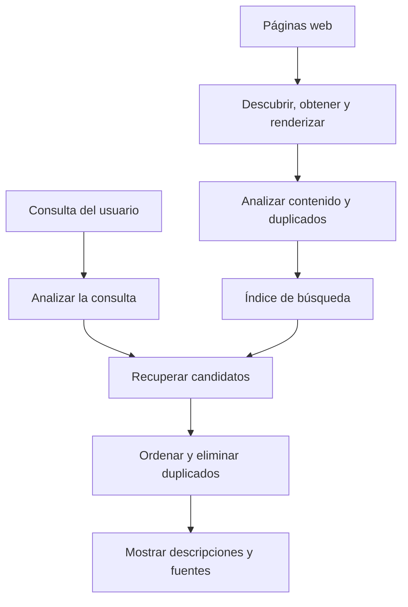
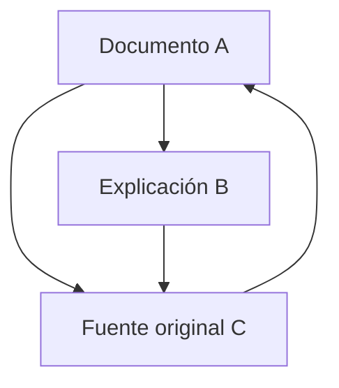
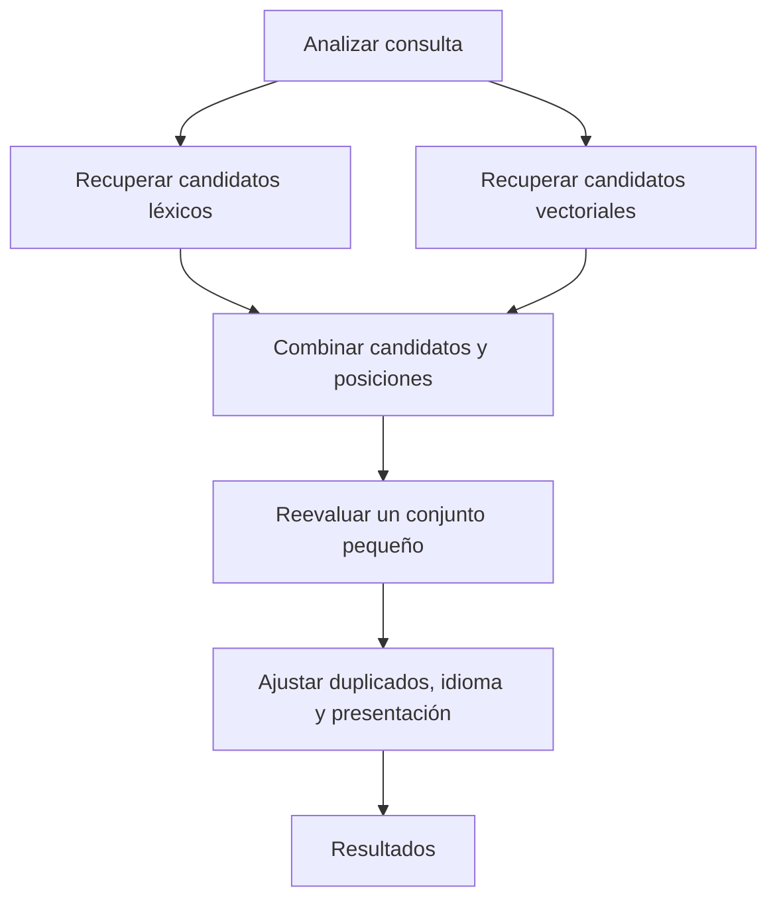

## 1. ¿Cada búsqueda vuelve a leer toda la web?

Escribimos unas palabras y aparecen resultados casi enseguida. El buscador no empieza entonces a leer todos los sitios: lleva tiempo recopilando información y organizándola para responder consultas.

En una biblioteca, pedir una introducción a la astronomía no obliga a releer todos los libros. El catálogo de títulos, autores, temas y ubicaciones permite reducir las opciones. Los buscadores también dependen de índices preparados con antelación.

La web es menos estable: las páginas surgen, cambian y desaparecen; un mismo contenido puede tener varias direcciones. Las descripciones de sus autores tampoco son necesariamente exactas. Hacen falta actualizaciones, tratamiento de duplicados y selección según la pregunta.

Distinguimos **recopilación, construcción del índice y selección de resultados para una consulta**. Google describe igualmente estas etapas. Las fórmulas y arquitecturas de este artículo explican principios generales de recuperación de información, no reconstruyen algoritmos privados de clasificación. [Google: funcionamiento de la búsqueda][google-overview]

## 2. Por qué se necesitó esta tecnología

Buscar información es anterior a la web. Los catálogos bibliotecarios y las bases documentales ya necesitaban métodos de recuperación. Las clasificaciones humanas funcionan a pequeña escala, pero mantenerlas y elegir la categoría adecuada se complica con el crecimiento.

Archie, presentado en 1990, buscaba nombres de archivos en servidores FTP. No era un buscador moderno del texto completo de páginas web. Su desarrollo en McGill respondía a la necesidad de localizar recursos dispersos desde un servicio común. [McGill: historia de Archie][archie]

Tim Berners-Lee propuso la web en el CERN en 1989; en 1993, el CERN puso su software web básico en el dominio público. Con la expansión de documentos enlazados, buscar nombres dejó de bastar: también importaban contenidos y relaciones. [CERN: nacimiento de la web][web-history]

El artículo de Google de 1998 describió búsqueda a gran escala con estructura de enlaces y texto de anclaje, además del contenido. Un único número ingenioso no era suficiente: rastreo, almacenamiento, compresión, indexación y clasificación debían crecer juntos. [Brin y Page: anatomía de un buscador][google-paper]

Tampoco se trata simplemente de pasar de palabras a IA. Coincidencias exactas, relaciones, estadística y modelos lingüísticos compensan limitaciones diferentes. Ninguna novedad elimina la necesidad de localizar un identificador preciso o actualizar el índice.

## 3. ¿Qué direcciones visita el rastreador?

Un rastreador obtiene páginas, pero no existe un registro central completo de todas las URL. Descubre direcciones siguiendo enlaces conocidos y consultando mapas del sitio.

Descubrir no implica descargar inmediatamente. Una cola gestiona prioridades de revisita, pausas entre solicitudes al mismo servidor, fallos y cambios probables. Una portada informativa y un documento estático de hace diez años justifican frecuencias distintas. Hay que repartir ancho de banda y cálculo limitados.

También debe evitarse sobrecargar el servidor ajeno. Acelerar hasta dejar la fuente fuera de servicio sería contraproducente. Respuestas lentas y errores persistentes deben influir en la frecuencia.

Los calendarios y combinaciones de filtros pueden producir prácticamente infinitas direcciones. Seguir cada enlace ciegamente puede no terminar. Patrones de URL, duplicados y cambios de contenido ayudan a evitar recorridos poco útiles.

Un mapa del sitio facilita el descubrimiento, pero no garantiza indexación ni una buena posición. Conocer la URL, poder obtenerla y decidir indexarla son estados diferentes. [Google: mapas del sitio][sitemaps]

## 4. robots.txt, noindex y autenticación tienen funciones distintas

`robots.txt` comunica a los rastreadores cooperativos qué rutas no deberían obtener. RFC 9309 lo distingue explícitamente de la autorización de acceso: no es una cerradura para proteger secretos. [RFC 9309: protocolo de exclusión de robots][robots]

`noindex` pide a los buscadores compatibles que no indexen una página. Para leer esa instrucción dentro de ella, Google debe poder acceder. Bloquear la descarga mientras se espera que lea `noindex` resulta contradictorio. Una URL bloqueada puede seguir siendo conocida mediante enlaces externos. [Google: controlar la indexación][noindex]

La autenticación y el control de acceso determinan quién puede obtener el contenido. Actúan sobre una frontera diferente.

| Mecanismo | Control principal | No garantiza por sí solo |
|---|---|---|
| robots.txt | Acceso de rastreadores cooperativos | Confidencialidad o desaparición total de la URL |
| noindex | Inclusión en índices compatibles | Prohibición de leer el contenido |
| Autenticación y permisos | Quién obtiene el contenido | Borrado de todas las copias ya publicadas |

No aparecer en una búsqueda no significa ser ilegible. La diferencia también importa en buscadores de documentos internos.

## 5. El HTML descargado no siempre es la página visible

Algunos servidores incluyen el texto en el HTML; otros dejan que JavaScript lo genere después. En estos últimos, descargar el archivo inicial puede no revelar lo que ve una persona. Puede hacer falta renderizar como un navegador.

Google describe rastreo, renderizado e indexación. Poder ejecutar JavaScript no garantiza procesar cualquier página correctamente. Recursos bloqueados, errores de scripts o contenido visible solo después de interactuar pueden dificultarlo. [Google: fundamentos de JavaScript y búsqueda][javascript]

Después hay que distinguir etiquetas, navegación, anuncios y contenido principal, y manejar codificación e idioma. Contar toda la página como una cadena indiferenciada permitiría que los menús repetidos ocultaran el tema. Título, encabezados y cuerpo aportan señales diferentes.

El mismo contenido puede aparecer en versiones de impresión o direcciones con parámetros de seguimiento. Los motores agrupan duplicados y eligen representantes. `rel="canonical"` sugiere una URL preferida; para Google es una señal, no una orden incondicional. [Google: URL canónicas][canonical]

## 6. Convertir lenguaje en unidades de búsqueda

El sistema necesita decidir qué fragmentos cuentan como términos. Esa división es la tokenización. Después, la normalización puede reconciliar mayúsculas, variantes de caracteres o formas flexionadas.

El japonés normalmente no separa palabras con espacios. Una frase sobre un taller de bicicletas exige análisis lingüístico o técnicas como n-gramas de caracteres. Documentos y consultas necesitan procesos compatibles. Kuromoji ilustra una implementación específica para japonés. [Manual: tokenización][tokenization], [Elastic: análisis japonés][kuromoji]

No conviene borrar todas las diferencias. La puntuación de C y C++, una referencia de producto o un identificador químico puede ser esencial. Expandir una abreviatura aumenta candidatos, pero también puede introducir otro significado.

Es útil conservar el original y una representación separada para buscar. El texto mostrado no necesita reescribirse para la máquina. El análisis lingüístico define qué variantes se consideran equivalentes; no es mera limpieza estética.

## 7. El índice invertido cambia la dirección de la pregunta

Al leer sabemos qué palabras contiene un documento. La búsqueda pregunta lo contrario: ¿qué documentos contienen una palabra? El índice invertido conserva esa relación.

Consideremos una colección pequeña con términos ya separados.

| Documento | Términos representativos |
|---|---|
| D1 | bicicleta, reparación, herramientas |
| D2 | bicicleta, desplazamiento, seguridad |
| D3 | reloj, reparación, herramientas |
| D4 | bicicleta, reparación, precios |

La lista de bicicleta contiene D1, D2 y D4; reparación contiene D1, D3 y D4. Su intersección es D1 y D4. Comparar las listas evita releer todos los textos. [Manual: índices invertidos][inverted]

Los registros pueden incluir frecuencias y posiciones. Ordenar identificadores y comprimir sus diferencias reduce los datos que se leen. La velocidad también viene de evitar trabajo, no solo de añadir procesadores.

No todas las consultas aplican un AND estricto: pueden admitirse expresiones alternativas. Pasar rápidamente de términos a candidatos sigue siendo una base de la búsqueda de texto completo.

## 8. Por qué importan las posiciones

De Madrid a Valencia y de Valencia a Madrid contienen las mismas ciudades, pero describen viajes opuestos. Aprendizaje automático como expresión tampoco equivale a sus palabras muy separadas dentro de un texto largo.

Un índice posicional registra dónde aparece cada término. Comprobar posiciones consecutivas permite buscar frases; la proximidad también puede ser evidencia de relevancia. [Manual: índices posicionales][positions]

Las posiciones no proporcionan comprensión completa. Negaciones, condiciones, pronombres y citas requieren algo más. Un índice resuelve recuperación eficiente de candidatos, no verificación de la verdad.

Así se entiende que una página contenga las palabras y no satisfaga la necesidad. La coincidencia es una pista, no el objetivo mismo.

## 9. Las palabras comunes y raras aportan señales diferentes

Mil candidatos presentados como iguales ayudan poco. Un término presente en pocos documentos suele distinguir mejor el tema que una palabra casi universal.

La frecuencia inversa de documentos, IDF, cuantifica esa idea. Si $N$ es el número de documentos y $df(t)$ los que contienen $t$, podemos usar una variante positiva:

$$
\operatorname{IDF}(t)=\ln\left(1+\frac{N-df(t)+0.5}{df(t)+0.5}\right)
$$

En 1 000 documentos, un término presente en 10 obtiene aproximadamente 4,56; presente en 500, unos 0,693. Una coincidencia con el término raro distingue más. Lucene documenta esta forma en su implementación de BM25. [Apache Lucene: BM25Similarity][lucene]

La rareza no demuestra verdad ni calidad. Un error tipográfico puede ser raro, y una página irrelevante puede enumerar jerga. IDF mide una propiedad estadística, no credibilidad.

## 10. BM25 limita el beneficio de repetir

La frecuencia dentro del documento es otra pista. Pero si cien repeticiones valieran cien veces una, se premiaría el relleno de palabras clave. Los textos largos también contienen más palabras y podrían desplazar explicaciones breves y precisas.

BM25 reduce el beneficio marginal de repetir y ajusta por longitud. Para consultas cortas puede estudiarse esta forma:

$$
S(d,q)=\sum_{t\in q}\operatorname{IDF}(t)
\frac{f(t,d)(k_1+1)}{f(t,d)+k_1\left(1-b+b\frac{|d|}{\overline L}\right)}
$$

$f(t,d)$ es la frecuencia, $|d|$ la longitud y $\overline L$ su promedio. $k_1$ controla la saturación; $b$, la normalización de longitud. Variantes de IDF y constantes difieren según la implementación. [Manual: BM25][bm25]

Con longitud media y $k_1=1.2$, el factor de frecuencia sin IDF resulta:

| Apariciones | Factor de frecuencia |
|---|---:|
| 1 | 1,000 |
| 2 | 1,375 |
| 5 | 1,774 |
| 10 | 1,964 |
| Muchísimas | Se aproxima a 2,2 |

Pasar de una a dos importa más que de nueve a diez. Repetir sigue aportando evidencia, pero no ilimitada. Aquí $b=0$ elimina la normalización de longitud y valores mayores la refuerzan.

Una puntuación BM25 no es normalmente la probabilidad de que una página sea correcta. Compara candidatos de una consulta en un índice; no es una nota absoluta entre distintas consultas o colecciones.

## 11. PageRank supera el voto simple de popularidad

Cuando los textos se parecen, los enlaces aportan otra señal: alguien eligió esa página como referencia. Pero contar cada enlace como un voto igual permitiría fabricar votos creando páginas.

PageRank considera la importancia del origen y reparte su peso entre los enlaces salientes. Una página citada por páginas importantes puede adquirir importancia: el cálculo es recursivo.

Esta forma normalizada sirve para aprender. $N$ es el número de páginas, $L(u)$ sus enlaces salientes y $\alpha$ la probabilidad de seguir un enlace. Supongamos que todas tienen alguna salida.

$$
PR(v)=\frac{1-\alpha}{N}
+\alpha\sum_{u\to v}\frac{PR(u)}{L(u)}
$$

Un visitante aleatorio sigue enlaces con probabilidad $\alpha$ y, en otro caso, salta a una página elegida al azar. Actualizar repetidamente conduce a una distribución de su ubicación a largo plazo. Las páginas sin salidas requieren una regla adicional, como repartir su peso entre todas.

Con $\alpha=0.85$, los valores estacionarios aproximados son A = 0,388, B = 0,215 y C = 0,397. C recibe referencias de A y B; B recibe solo parte del peso de A. Importan los orígenes y el reparto, no únicamente el número de enlaces entrantes.

Este modelo explica PageRank, no toda clasificación moderna. Los enlaces no determinan directamente la intención ni la verdad. Una página antigua famosa no es necesariamente la mejor para el horario ferroviario de hoy. [Artículo original de Brin y Page][google-paper], [Google: sistemas de clasificación][ranking]

## 12. De las palabras a la intención

Quien busca un portátil que se calienta quizá necesita refrigeración o diagnóstico, no una definición de termodinámica. Banco puede designar una entidad financiera o un asiento. El contexto importa.

Corrección ortográfica, sinónimos y reconocimiento de lugares o productos amplían candidatos. Pero una corrección impuesta puede dificultar encontrar un modelo exacto o nombre raro. Conservar la consulta original, explicar cambios y permitir coincidencia estricta ayuda a respetar la intención. [Manual: corrección ortográfica][spelling]

La búsqueda semántica representa consultas y documentos como vectores numéricos y compara su cercanía. La batería se agota rápido y mejorar la autonomía pueden estar relacionados sin palabras idénticas.

La similitud coseno mide la proximidad direccional entre $\mathbf q$ y $\mathbf d$:

$$
\operatorname{sim}(\mathbf q,\mathbf d)=
\frac{\mathbf q\cdot\mathbf d}{\|\mathbf q\|\|\mathbf d\|}
$$

Esa cercanía pertenece a la representación aprendida. La batería se puede cambiar y la batería no se puede cambiar comparten casi todo el vocabulario, con una diferencia decisiva. Vectores próximos no garantizan respuestas correctas. Modelo, tamaño de fragmentos y consultas de prueba deben evaluarse juntos. [Elastic: búsqueda vectorial][vector]

## 13. No aplicar el modelo más caro a todas las páginas

Los modelos de análisis detallado ayudan, pero examinar cada documento para cada consulta sería costoso. Una arquitectura útil separa recuperación amplia y rápida de reclasificación detallada de pocos candidatos.

Primero se emplea búsqueda léxica o aproximada de vecinos cercanos; después, un modelo más exigente. La aproximación intercambia velocidad y memoria por riesgo de omitir vecinos verdaderos. Un documento excluido inicialmente no puede ser recuperado por el reclasificador.

Las palabras exactas ayudan con nombres e identificadores; la semántica, con reformulaciones. La búsqueda híbrida reúne ambas. Sus escalas distintas hacen que sumar puntuaciones directamente pueda dar demasiado peso a una.

La fusión de rangos recíprocos, RRF, ofrece otra opción. Para el documento $d$ en la posición $r_i(d)$ de la lista $i$, se suman las listas donde aparece:

$$
\operatorname{RRF}(d)=\sum_i\frac{1}{k+r_i(d)}
$$

La constante positiva $k$ regula el dominio de las primeras posiciones. Es una regla de combinación, no una probabilidad. Si una lista no contiene el documento, no aporta puntos. Elasticsearch documenta la combinación léxica y vectorial mediante RRF. [Elastic: RRF][rrf]

Es un ejemplo de arquitectura, no una afirmación de que todos los servicios sigan etapas idénticas. Lo esencial es separar la reducción de omisiones del ordenamiento fino.

## 14. Clasificar no termina el trabajo

Si páginas casi idénticas del mismo sitio ocupan todo el inicio, el usuario puede comparar poco. Conviene reducir duplicados, considerar perspectivas distintas y ajustar idioma o región.

La ubicación importa para talleres cercanos, pero de otra manera para la historia de la bicicleta. La actualidad también depende del propósito: transporte durante una emergencia requiere datos recientes; una prueba matemática no mejora solo porque cambie su fecha.

Títulos y fragmentos ayudan a elegir, pero un extracto seleccionado para la consulta puede omitir condiciones. No equivale automáticamente a la conclusión completa de la fuente.

Los anuncios también se distinguen de los resultados ordinarios. La publicidad y la clasificación orgánica usan mecanismos diferentes. Google afirma que pagar no compra posiciones orgánicas superiores ni rastreo más frecuente. [Google: funcionamiento][google-overview]

## 15. Buscar rápidamente en un índice enorme

Una máquina limita capacidad, rendimiento y tolerancia a fallos. Los sistemas distribuidos dividen el índice, consultan sus partes en distintas máquinas y fusionan respuestas. Esas particiones suelen llamarse fragmentos o shards.

En una división por documentos, cada fragmento recibe la consulta y devuelve candidatos prometedores. Un coordinador compara el conjunto. Las estadísticas locales de frecuencia pueden diferir, afectando la comparabilidad. La elección entre estadísticas locales y globales influye también en la calidad. [Manual: distribución de índices][distributed]

Particionar y replicar no son sinónimos. Lo primero divide datos o trabajo; lo segundo mantiene copias. Las réplicas ayudan con fallos y carga, pero añaden el problema de propagar actualizaciones.

Cuando participan muchas máquinas, la más lenta puede alargar el tiempo total. Importa la parte lenta de la experiencia, no solo el promedio. Esperar todo, fijar plazos o consultar otra réplica exige equilibrar integridad y rapidez.

Guardar resultados frecuentes o cálculos intermedios en caché ahorra trabajo. Reutilizar siempre la respuesta de ayer puede ocultar cambios y borrados. La rapidez necesita mecanismos de actualización.

## 16. Altas, cambios y borrados deben llegar al índice

Modificar una página no modifica instantáneamente el índice externo. Obtención, análisis, actualización y entrega toman tiempo. Los resultados representan información observada y procesada, no toda la web en cada instante.

Un buscador propio necesita vías de actualización y borrado desde el inicio. Si cada importación crea otro documento, se acumulan duplicados. Identificadores estables permiten sustituir la entrada correcta; el borrado debe alcanzar las réplicas consultadas.

En una empresa, cambiar permisos también es una actualización. Un documento hoy confidencial no debe filtrarse mediante un título o extracto antiguo. Los permisos se comprueban antes de producir resultados y deben respetarse en las cachés.

Durante una reconstrucción, el índice viejo puede seguir atendiendo hasta que el nuevo esté completo y verificado. Entonces se cambia. El usuario no debería consultar un índice a medio hacer. Estas prácticas discretas sostienen la fiabilidad.

## 17. Resistir el spam forma parte de buscar

El orden afecta tráfico e ingresos y crea incentivos para manipularlo. Repetición excesiva, enlaces artificiales y grandes volúmenes de páginas pobres son ejemplos. No puede suponerse buena fe en todos los documentos.

Las políticas de Google cubren relleno de palabras clave y spam de enlaces. La calidad, por tanto, incluye resistir intentos de explotar las medidas, además de encontrar términos relacionados. [Google: políticas de spam][spam]

Muchos enlaces no prueban verdad; extensión no prueba profundidad; novedad no prueba fiabilidad. Cuando una medida indirecta se vuelve objetivo, puede optimizarse sin mejorar el valor real. Hacen falta varias señales, evaluación continua y análisis de falsos positivos.

Descartar sistemáticamente sitios pequeños desconocidos también sería un error. Una fuente experta nueva puede tener pocos enlaces. La búsqueda debe aprovechar evidencias consolidadas sin dejar de descubrir información nueva útil.

## 18. Cómo medir una buena búsqueda

La velocidad no basta si falta lo necesario. La evaluación utiliza consultas representativas y juicios de relevancia sobre los documentos.

Dos medidas básicas son precisión y exhaustividad, también llamada recall. Sean $A$ el conjunto devuelto y $R$ el relevante:

$$
\operatorname{Precision}=\frac{|A\cap R|}{|A|}
$$

$$
\operatorname{Recall}=\frac{|A\cap R|}{|R|}
$$

Si existen ocho documentos relevantes y cuatro de los cinco devueltos lo son, la precisión es 4/5, un 80 %, y la exhaustividad 4/8, un 50 %. Restringir a coincidencias seguras suele favorecer precisión; ampliar recuperación suele favorecer exhaustividad. No toda mejora implica necesariamente empeorar la otra. [Manual: evaluación de conjuntos][evaluation]

| Pregunta | Medida o comprobación |
|---|---|
| ¿Los resultados son mayormente útiles? | Precisión |
| ¿Faltan documentos necesarios? | Exhaustividad |
| ¿Son útiles las primeras posiciones? | Precisión hasta un corte y métricas de clasificación |
| ¿Responde a tiempo? | Mediana y parte lenta de la distribución |
| ¿Respeta cambios y permisos? | Retraso de actualización, borrados y acceso |

Un documento relevante en primera posición no equivale al mismo en la centésima. NDCG y otras métricas consideran grados de relevancia y posición. Separar por idioma, tipo o longitud de consulta revela problemas ocultos por un promedio global. [Manual: evaluación de resultados ordenados][ranked-evaluation]

Los clics no son verdad absoluta. Se puede pulsar porque algo aparece primero o su título llama la atención, y salir decepcionado. Un buen fragmento también puede resolver sin clic. El comportamiento observado necesita interpretación.

## 19. Las respuestas de IA siguen necesitando recuperación

La generación aumentada por recuperación, RAG, entrega documentos encontrados a un modelo que redacta una respuesta. Un trabajo de 2020 presentó una forma de combinar un modelo preentrenado con información externa recuperada. [Lewis y colaboradores: RAG][rag]

Recuperación y generación son tareas distintas. Perder la fuente adecuada deja la respuesta sin respaldo. Aun con la fuente correcta, se pueden omitir condiciones o mezclar mal afirmaciones. Añadir búsqueda no elimina todo error.

Una cita tampoco prueba cada frase. La fuente debe contener la afirmación, coincidir en fecha y contexto y permitir resolver contradicciones.

Evaluar por separado omisiones, actualidad de fuentes y correspondencia entre respuesta y evidencia ayuda a localizar fallos. Las instrucciones dentro de documentos externos no deben convertirse en órdenes del sistema: son fuentes informativas, no administradores que otorguen permisos.

La IA añade procesamiento y comprobación sobre índices y fuentes. Cuanto más fácil resulte leer una respuesta, más importante es poder rastrear cómo se construyó.

## 20. Detrás del buscador hay preparación y decisiones

Pensemos en buscar herramientas para reparar un pinchazo. Antes de la consulta ya se recogieron páginas y se organizaron términos, posiciones y relaciones. Después se normaliza la consulta, se recuperan candidatos y se ordenan según la tarea.

Se ajustan duplicados, idioma, descripciones y presentación. Varias máquinas cooperan mientras propagan cambios, borrados y permisos. Una respuesta rápida descansa sobre preparación extensa y mantenimiento continuo.

Para quien publica, la base es contenido accesible, títulos y enlaces claros, relaciones coherentes entre duplicados e idiomas y explicaciones útiles. Los trucos ocultos no sustituyen esa base, que tampoco garantiza una posición concreta.

Para quien busca, estar arriba no prueba corrección absoluta. Precisar preguntas, revisar fechas y fuentes y probar otras formulaciones aporta más información para decidir.

Un buscador no es un espejo perfecto del mundo. **Organiza lo que puede observar y, con tiempo limitado, construye un orden pensado para ayudar ante una pregunta.** Entender esas restricciones explica su rapidez, sus omisiones y cómo interpretar resultados.

## Fuentes y alcance de las ilustraciones

El artículo combina principios generales y documentación pública. BM25, PageRank y RRF son modelos didácticos, no puntuaciones privadas de servicios comerciales. Los diagramas simplifican procesos. La portada generada por IA es conceptual, no una instalación ni interfaz real.

- [Google: presentación][google-overview], [mapas del sitio][sitemaps], [JavaScript][javascript], [noindex][noindex], [URL canónicas][canonical]
- [Google: clasificación][ranking], [políticas de spam][spam]
- [CERN: historia web][web-history], [McGill: Archie][archie], [Brin y Page][google-paper]
- [Manual: tokenización][tokenization], [índices invertidos][inverted], [posiciones][positions], [BM25][bm25], [índices distribuidos][distributed], [ortografía][spelling]
- [Manual: precisión y exhaustividad][evaluation], [evaluación de rangos][ranked-evaluation], [Lucene: BM25][lucene]
- [Elastic: análisis japonés][kuromoji], [búsqueda vectorial][vector], [RRF][rrf], [trabajo original RAG][rag]
- [RFC 9309: reglas para rastreadores][robots]

[google-overview]: https://developers.google.com/search/docs/fundamentals/how-search-works
[archie]: https://200.mcgill.ca/history/creation-of-the-first-internet-search-engine/
[web-history]: https://home.cern/science/computing/the-birth-of-the-web/where-web-was-born/
[google-paper]: https://infolab.stanford.edu/~backrub/google.html
[sitemaps]: https://developers.google.com/search/docs/crawling-indexing/sitemaps/overview
[robots]: https://www.rfc-editor.org/rfc/rfc9309.html
[noindex]: https://developers.google.com/search/docs/crawling-indexing/block-indexing
[javascript]: https://developers.google.com/search/docs/crawling-indexing/javascript/javascript-seo-basics
[canonical]: https://developers.google.com/search/docs/crawling-indexing/consolidate-duplicate-urls
[tokenization]: https://nlp.stanford.edu/IR-book/html/htmledition/tokenization-1.html
[kuromoji]: https://www.elastic.co/docs/reference/elasticsearch/plugins/analysis-kuromoji
[inverted]: https://nlp.stanford.edu/IR-book/html/htmledition/an-example-information-retrieval-problem-1.html
[positions]: https://nlp.stanford.edu/IR-book/html/htmledition/positional-indexes-1.html
[lucene]: https://lucene.apache.org/core/9_9_1/core/org/apache/lucene/search/similarities/BM25Similarity.html
[bm25]: https://nlp.stanford.edu/IR-book/html/htmledition/okapi-bm25-a-non-binary-model-1.html
[ranking]: https://developers.google.com/search/docs/appearance/ranking-systems-guide
[spelling]: https://nlp.stanford.edu/IR-book/html/htmledition/implementing-spelling-correction-1.html
[vector]: https://www.elastic.co/docs/solutions/search/vector
[rrf]: https://www.elastic.co/docs/reference/elasticsearch/rest-apis/reciprocal-rank-fusion
[distributed]: https://nlp.stanford.edu/IR-book/html/htmledition/distributing-indexes-1.html
[spam]: https://developers.google.com/search/docs/essentials/spam-policies
[evaluation]: https://nlp.stanford.edu/IR-book/html/htmledition/evaluation-of-unranked-retrieval-sets-1.html
[ranked-evaluation]: https://nlp.stanford.edu/IR-book/html/htmledition/evaluation-of-ranked-retrieval-results-1.html
[rag]: https://arxiv.org/abs/2005.11401
