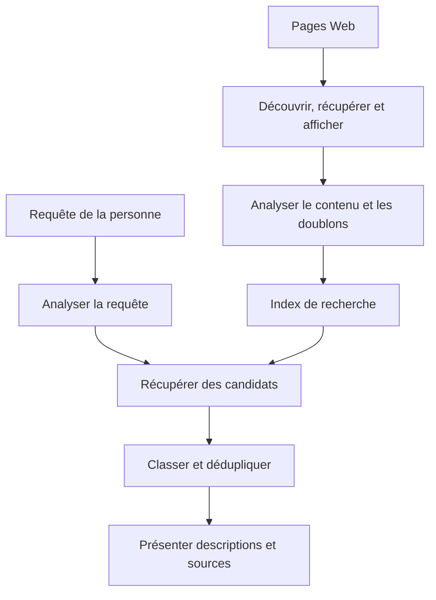
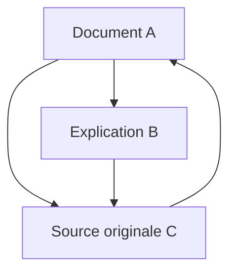
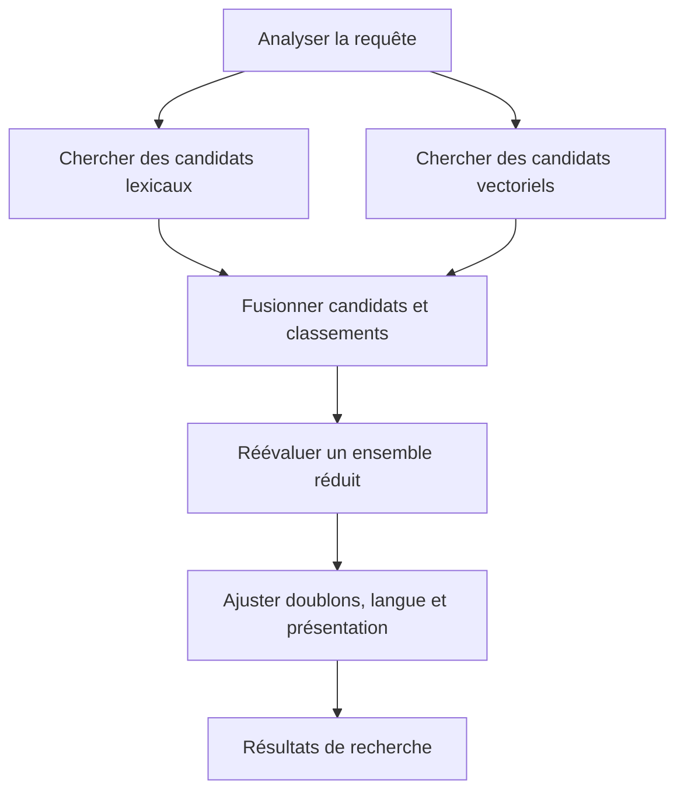

## 1. Chaque recherche relit-elle tout le Web ?

Quelques mots saisis, une courte attente, puis des résultats : le moteur ne commence pourtant pas à lire tous les sites à cet instant. Il collecte et organise les informations à l'avance, puis exploite cette préparation.

Dans une bibliothèque, demander une initiation à l'astronomie ne conduit pas la bibliothécaire à relire chaque livre. Un catalogue de titres, d'auteurs, de sujets et d'emplacements réduit les possibilités. Les moteurs doivent eux aussi une grande partie de leur rapidité à un index préparé auparavant.

Le Web est toutefois moins stable qu'une bibliothèque. Des pages apparaissent, changent et disparaissent ; un contenu peut avoir plusieurs adresses. Les descriptions données par les auteurs ne sont pas forcément exactes. Il faut suivre les mises à jour, traiter les doublons et choisir selon la question.

On distingue **la collecte, la construction de l'index et la sélection des résultats pour une requête**. Google présente également ces étapes. Les formules et architectures ci-dessous expliquent des principes généraux de recherche d'information ; elles ne reproduisent pas le classement confidentiel d'un service. [Google : fonctionnement de la recherche][google-overview]

## 2. Pourquoi la recherche est devenue nécessaire

Le problème précède le Web : catalogues de bibliothèques et bases bibliographiques avaient déjà besoin de méthodes de recherche. Une classification humaine fonctionne à petite échelle, mais son entretien et le choix de la bonne catégorie deviennent difficiles lorsque la collection augmente.

Archie, apparu en 1990, recherchait des noms de fichiers dans des archives FTP. Ce n'était pas une recherche moderne dans le texte intégral des pages. Son développement à l'Université McGill répondait au besoin de trouver des ressources dispersées depuis un point d'entrée commun. [McGill : histoire d'Archie][archie]

Tim Berners-Lee proposa le Web au CERN en 1989 ; en 1993, le CERN plaça ses logiciels Web de base dans le domaine public. Avec la diffusion des documents liés, les noms ne suffisaient plus : il fallait examiner les contenus et leurs relations. [CERN : naissance du Web][web-history]

L'article Google de 1998 décrivait une recherche à grande échelle utilisant les liens et leurs libellés en plus du texte. Un score ingénieux ne suffisait pas : collecte, stockage, compression, indexation et classement devaient fonctionner ensemble malgré la croissance. [Brin et Page : anatomie d'un moteur de recherche][google-paper]

L'histoire ne se réduit donc pas à « les mots autrefois, l'IA aujourd'hui ». Correspondances exactes, relations, statistiques et modèles linguistiques répondent à des faiblesses différentes. Les nouveautés n'éliminent ni la recherche d'une référence exacte ni l'entretien de l'index.

## 3. Quelles adresses le robot visite-t-il ?

Un robot d'exploration récupère les pages, mais il n'existe aucun registre central complet de toutes les URL. Il découvre des adresses en suivant les liens connus et en consultant les plans de site.

Découvrir n'est pas récupérer immédiatement. Une file gère les priorités de revisite, les intervalles entre requêtes vers un même serveur, les échecs et les changements probables. Une page d'actualités et un document figé depuis dix ans ne justifient pas la même fréquence. Bande passante et calcul sont limités.

Il faut aussi éviter de surcharger la source. Accélérer la collecte jusqu'à mettre son serveur hors service serait contre-productif. Des réponses lentes ou des erreurs répétées doivent influencer la fréquence.

Les calendriers et combinaisons de filtres peuvent engendrer presque une infinité d'adresses. Suivre aveuglément chaque lien peut ne jamais finir. Motifs d'URL, détection de doublons et variations du contenu réduisent les boucles peu utiles.

Un plan de site aide à découvrir ; il ne garantit ni indexation ni bonne position. Connaître l'adresse, pouvoir la récupérer et décider de l'indexer sont des états distincts. [Google : plans de site][sitemaps]

## 4. robots.txt, noindex et authentification ont des rôles distincts

`robots.txt` indique aux robots coopératifs les chemins à ne pas récupérer. La RFC 9309 le distingue explicitement d'une autorisation d'accès. Ce n'est pas un verrou protégeant un secret. [RFC 9309 : protocole d'exclusion des robots][robots]

`noindex` demande aux moteurs compatibles de ne pas indexer une page. Pour lire cette instruction dans la page, Google doit pouvoir y accéder. Interdire la récupération tout en attendant la lecture de `noindex` est contradictoire. Une URL bloquée peut néanmoins être connue grâce à des liens externes. [Google : contrôler l'indexation avec noindex][noindex]

L'authentification et le contrôle d'accès déterminent, eux, qui peut obtenir le contenu. Ces mécanismes agissent à des frontières différentes.

| Mécanisme | Contrôle principal | Ne garantit pas à lui seul |
|---|---|---|
| robots.txt | Récupération par les robots coopératifs | Confidentialité ou disparition complète d'une URL |
| noindex | Présence dans les index compatibles | Interdiction d'accéder au contenu |
| Authentification et droits | Personnes pouvant obtenir le contenu | Effacement de toutes les copies déjà publiées |

Être absent d'un moteur n'est pas être illisible. La distinction compte aussi pour les documents internes d'une entreprise.

## 5. Le HTML téléchargé n'est pas toujours la page visible

Certains serveurs renvoient directement le texte dans le HTML ; d'autres laissent JavaScript le créer ensuite. Dans le second cas, télécharger le fichier initial ne suffit pas forcément. Un rendu comparable à celui d'un navigateur peut être nécessaire.

Google distingue exploration, rendu et indexation. Pouvoir exécuter JavaScript ne garantit pas que toute page soit traitée correctement : ressources bloquées, scripts en échec ou contenu apparaissant seulement après une interaction peuvent gêner l'analyse. [Google : bases du référencement JavaScript][javascript]

Il faut ensuite distinguer balises, navigation, publicité et texte principal, puis traiter encodage et langue. Compter toute la page comme une chaîne indifférenciée risque de laisser les menus répétitifs masquer le sujet. Titre, intertitres et corps apportent des indices différents.

Le même contenu peut exister à une adresse d'impression ou avec des paramètres de suivi. Les moteurs regroupent les doublons et choisissent des représentants. `rel="canonical"` suggère une adresse préférée ; pour Google, c'est un signal, pas un ordre inconditionnel. [Google : URL canoniques][canonical]

## 6. Transformer le langage en unités de recherche

L'ordinateur doit décider quelles portions de texte constituent des termes. Cette segmentation s'appelle tokenisation. Une normalisation peut ensuite rapprocher majuscules, variantes de caractères ou formes fléchies.

Le japonais n'utilise généralement pas d'espaces entre les mots. Une phrase sur un atelier de réparation de vélos demande donc un traitement linguistique. L'analyse morphologique peut repérer les mots ; les n-grammes de caractères constituent une autre approche. Documents et requêtes doivent être traités de manière compatible. Kuromoji illustre une analyse propre au japonais. [Manuel : tokenisation][tokenization], [Elastic : analyse japonaise][kuromoji]

Tout normaliser serait dangereux. Supprimer la ponctuation de C et C++, d'un modèle de produit ou d'une formule chimique peut effacer une distinction essentielle. Développer une abréviation retrouve davantage de candidats, mais peut introduire un autre sens.

Conserver le texte original séparément de sa représentation de recherche est utile. Le texte affiché n'a pas besoin d'être réécrit pour la machine. Le traitement linguistique définit les variantes considérées comme équivalentes ; ce n'est pas un simple nettoyage visuel.

## 7. L'index inversé retourne la relation document–mot

Lire un document indique quels mots il contient. Rechercher demande l'inverse : quels documents contiennent ce mot ? L'index inversé conserve cette correspondance.

Prenons une petite collection déjà segmentée.

| Identifiant | Termes représentatifs |
|---|---|
| D1 | vélo, réparation, outils |
| D2 | vélo, trajet, sécurité |
| D3 | montre, réparation, outils |
| D4 | vélo, réparation, tarifs |

La liste de vélo contient D1, D2 et D4 ; celle de réparation, D1, D3 et D4. Leur intersection donne D1 et D4. Comparer deux listes évite de relire tous les textes. [Manuel : index inversés][inverted]

Les entrées peuvent également enregistrer fréquences et positions. Des identifiants triés se compressent sous forme de différences, réduisant les données lues. La vitesse vient aussi du travail évité, pas seulement du nombre de processeurs.

Toutes les requêtes n'appliquent pas un ET strict : des formulations alternatives peuvent être admises. Passer rapidement des termes aux documents reste néanmoins fondamental.

## 8. Pourquoi enregistrer les positions ?

De Paris à Lyon et de Lyon à Paris contiennent les mêmes villes, mais décrivent des trajets opposés. De même, apprentissage automatique comme expression diffère de deux mots éloignés dans un long texte.

Un index positionnel conserve l'emplacement des termes. Vérifier qu'un terme suit immédiatement un autre permet la recherche d'expressions ; leur proximité peut aussi renforcer la pertinence. [Manuel : index positionnels][positions]

Cela ne donne pas une compréhension complète. Négation, conditions, pronoms et citations nécessitent davantage que la proximité. L'index résout la récupération rapide de candidats, pas la vérité d'une affirmation.

Une page peut donc contenir les termes et manquer le besoin. La correspondance lexicale est un indice, pas l'objectif de la personne.

## 9. Les mots rares et fréquents n'apportent pas le même indice

Présenter mille candidats comme équivalents aide peu. Un terme présent dans peu de documents distingue souvent mieux le sujet qu'un mot presque universel.

La fréquence documentaire inverse, IDF, quantifie cette idée. Avec $N$ documents et $df(t)$ documents contenant le terme $t$, utilisons une variante positive :

$$
\operatorname{IDF}(t)=\ln\left(1+\frac{N-df(t)+0.5}{df(t)+0.5}\right)
$$

Dans 1 000 documents, un terme présent dans 10 obtient environ 4,56 ; s'il apparaît dans 500, environ 0,693. Une seule correspondance au terme rare distingue davantage. L'implémentation BM25 de Lucene documente cette forme. [Apache Lucene : BM25Similarity][lucene]

La rareté ne prouve ni vérité ni qualité. Une faute peut être rare, et une page hors sujet peut énumérer du jargon. IDF mesure une propriété statistique de la collection, pas la crédibilité.

## 10. BM25 fait saturer l'effet des répétitions

La fréquence d'un terme dans un document fournit un autre indice. Mais cent répétitions ne devraient pas valoir cent fois une occurrence : cela favoriserait le bourrage de mots-clés. Les textes longs contiennent aussi davantage de mots, au risque de pénaliser une réponse courte et précise.

BM25 réduit le bénéfice marginal des répétitions et corrige la longueur. Pour une courte requête, considérons :

$$
S(d,q)=\sum_{t\in q}\operatorname{IDF}(t)
\frac{f(t,d)(k_1+1)}{f(t,d)+k_1\left(1-b+b\frac{|d|}{\overline L}\right)}
$$

$f(t,d)$ est la fréquence, $|d|$ la longueur du document et $\overline L$ la longueur moyenne. $k_1$ règle la saturation ; $b$ règle la normalisation de longueur. Les variantes d'IDF et constantes diffèrent selon les implémentations. [Manuel : BM25][bm25]

Pour un document de longueur moyenne avec $k_1=1.2$, le facteur de fréquence sans IDF vaut :

| Occurrences | Facteur de fréquence |
|---|---:|
| 1 | 1,000 |
| 2 | 1,375 |
| 5 | 1,774 |
| 10 | 1,964 |
| Très nombreuses | Tend vers 2,2 |

Passer de une à deux occurrences compte davantage que de neuf à dix. La répétition conserve un effet, mais pas sans limite. Ici, $b=0$ supprime la correction de longueur ; une valeur supérieure la renforce.

Un score BM25 n'est généralement pas la probabilité que la page soit correcte. Il compare des candidats pour une requête dans un index. Des scores de requêtes ou de collections différentes ne sont pas des notes absolues de qualité.

## 11. PageRank dépasse le simple vote de popularité

Quand les textes se ressemblent, les liens fournissent un autre indice : quelqu'un a choisi la page comme référence. Compter chaque lien comme un vote égal permettrait cependant de fabriquer des votes en créant des pages.

PageRank tient compte de l'importance de la source, puis répartit son poids entre ses liens sortants. Une page référencée par des pages importantes peut devenir importante : le calcul est récursif.

Voici une forme normalisée pédagogique. $N$ est le nombre de pages, $L(u)$ le nombre de liens sortants de $u$, et $\alpha$ la probabilité de suivre un lien. Supposons d'abord que chaque page possède un lien sortant.

$$
PR(v)=\frac{1-\alpha}{N}
+\alpha\sum_{u\to v}\frac{PR(u)}{L(u)}
$$

Un visiteur aléatoire suit un lien avec probabilité $\alpha$ et, sinon, saute vers une page choisie au hasard. Les mises à jour successives conduisent à une distribution des lieux où il se trouve à long terme. Les pages sans lien sortant demandent une règle supplémentaire, par exemple redistribuer leur poids à toutes les pages.

Avec $\alpha=0.85$, les valeurs stationnaires sont environ A = 0,388, B = 0,215 et C = 0,397. C reçoit des références de A et B, tandis que B reçoit seulement une partie du poids de A. La provenance et le partage comptent, au-delà du nombre de liens.

Ce modèle explique PageRank, pas tout le classement moderne. Les liens ne déterminent directement ni l'intention ni la vérité. Une ancienne page célèbre n'est pas nécessairement adaptée aux horaires ferroviaires d'aujourd'hui. [Article original de Brin et Page][google-paper], [Google : systèmes de classement][ranking]

## 12. De la correspondance des mots à l'intention

Une recherche sur un ordinateur qui chauffe peut viser le refroidissement ou le dépannage plutôt qu'une définition de thermodynamique. En anglais, bank désigne une banque ou une rive. Le contexte importe autant que la forme.

Correction orthographique, synonymes et reconnaissance des lieux ou produits élargissent les candidats. Mais une correction imposée peut gêner la recherche d'une référence exacte ou d'un nom rare. Préserver la requête initiale, expliquer les changements et permettre une recherche stricte sont utiles. [Manuel : correction orthographique][spelling]

La recherche sémantique peut représenter requêtes et documents par des vecteurs numériques, puis comparer leur proximité. Une batterie se vide vite et améliorer l'autonomie devraient pouvoir être reliés sans mots identiques.

La similarité cosinus mesure la proximité directionnelle de $\mathbf q$ et $\mathbf d$ :

$$
\operatorname{sim}(\mathbf q,\mathbf d)=
\frac{\mathbf q\cdot\mathbf d}{\|\mathbf q\|\|\mathbf d\|}
$$

Cette proximité appartient à la représentation apprise. La batterie est remplaçable et la batterie n'est pas remplaçable partagent beaucoup de mots, avec une différence essentielle. Des vecteurs proches ne garantissent donc pas une bonne réponse. Modèle, longueur des passages et requêtes d'évaluation doivent être examinés ensemble. [Elastic : recherche vectorielle][vector]

## 13. Ne pas appliquer le modèle le plus coûteux à chaque page

Un modèle analysant finement le sens peut aider, mais traiter toute la collection pour chaque requête coûterait trop cher. Une architecture utile sépare récupération rapide et large, puis reclassement détaillé d'un petit ensemble.

La recherche lexicale ou la recherche approximative de plus proches voisins fournit d'abord des candidats. Un modèle plus coûteux les réévalue ensuite. L'approximation échange vitesse et mémoire contre le risque de manquer de vrais voisins. Un document absent de la première sélection ne peut pas être sauvé par le reclassement.

La recherche lexicale convient aux noms et identifiants ; la sémantique aide avec les reformulations. La recherche hybride combine les deux. Leurs échelles de score différentes rendent une addition brute délicate.

La fusion par rang réciproque, RRF, est une option. Si le document $d$ est au rang $r_i(d)$ dans la liste $i$, on additionne sur les listes qui le contiennent :

$$
\operatorname{RRF}(d)=\sum_i\frac{1}{k+r_i(d)}
$$

La constante positive $k$ règle l'influence des premières places. Il s'agit d'une règle de fusion, pas d'une probabilité. Une liste sans le document ne contribue pas. Elasticsearch documente la combinaison de résultats lexicaux et vectoriels par RRF. [Elastic : RRF][rrf]

C'est un exemple d'architecture, sans prétendre que tous les services suivent les mêmes étapes. L'idée essentielle est de séparer la limitation des omissions et la mise en ordre fine.

## 14. Le classement n'est pas la fin du travail

Si des pages presque identiques d'un même site occupent toutes les premières places, la comparaison devient pauvre. Les systèmes peuvent réduire les doublons, inclure plusieurs perspectives et tenir compte de la langue ou de la région.

La position géographique importe pour un réparateur de vélos proche, mais autrement pour l'histoire du vélo. La fraîcheur dépend aussi de la question : les transports pendant une catastrophe exigent des nouvelles récentes ; une preuve mathématique n'est pas meilleure uniquement parce que sa date change.

Titres et extraits aident à choisir. Mais un passage sélectionné selon la requête peut omettre des conditions présentes ailleurs. Son texte bref n'est pas automatiquement la conclusion complète de la source.

La publicité se distingue également des résultats ordinaires. Placement payant et classement naturel suivent des mécanismes différents. Google indique qu'un paiement ne peut acheter ni meilleure position naturelle ni exploration plus fréquente. [Google : fonctionnement][google-overview]

## 15. Interroger rapidement un index immense

Une seule machine limite stockage, débit et résistance aux pannes. Les [systèmes distribués](/fr/p/cap-theorem-distributed-systems-tradeoff/) divisent l'index, interrogent différentes machines puis fusionnent les réponses. Ces partitions sont souvent appelées fragments, ou shards.

Avec un découpage par documents, chaque fragment reçoit la requête et renvoie ses candidats prometteurs. Un coordinateur les compare. Des statistiques locales différentes peuvent cependant rendre les scores moins comparables. Le choix entre statistiques locales et globales concerne aussi la qualité. [Manuel : distribution des index][distributed]

Partitionnement et réplication ne sont pas synonymes. Le premier partage les données ou le travail ; la seconde conserve plusieurs copies. Les répliques facilitent tolérance aux pannes et répartition de charge, mais compliquent la propagation des mises à jour.

Lorsque beaucoup de machines participent, la plus lente peut allonger le délai total. Il faut examiner les attentes les plus longues, pas seulement la moyenne. Attendre toutes les réponses, fixer une échéance ou consulter une autre réplique implique des compromis entre exhaustivité et rapidité.

Mettre en cache des résultats fréquents ou des calculs intermédiaires économise du travail. Réutiliser sans cesse la réponse d'hier risque pourtant de manquer modifications et suppressions. Les gains de vitesse nécessitent une politique de fraîcheur.

## 16. Ajouts, modifications et suppressions doivent atteindre l'index

Une page modifiée ne change pas nécessairement immédiatement dans l'index externe. Nouvelle récupération, analyse, mise à jour et diffusion prennent du temps. Les résultats représentent des informations observées et traitées, pas le Web à chaque instant.

Une recherche interne doit prévoir modifications et suppressions dès le départ. Si chaque réimportation crée un nouveau document, les doublons s'accumulent. Des identifiants stables permettent de remplacer la bonne entrée ; les suppressions doivent atteindre les répliques utilisées pour les requêtes.

En entreprise, changer les droits est aussi une mise à jour. Un document devenu confidentiel aujourd'hui ne doit pas fuir par un ancien titre ou extrait. Les droits doivent être vérifiés avant la production des résultats et respectés par les caches.

Lors d'une reconstruction, l'ancien index peut continuer à servir jusqu'à ce que le nouveau soit complet et vérifié, puis on bascule. Les utilisateurs ne devraient pas interroger un index à moitié construit. Ces pratiques discrètes soutiennent la fiabilité.

## 17. La lutte contre le spam fait partie de la recherche

Le classement influence trafic et revenus, donc incite à la manipulation. Répétitions excessives, liens artificiels et nombreuses pages sans valeur en sont des exemples. Le moteur ne peut supposer la bonne foi de tous les documents.

Les règles de Google traitent notamment du bourrage de mots-clés et du spam de liens. La qualité dépasse ainsi les termes correspondants : elle doit résister aux tentatives d'exploitation des mesures. [Google : règles antispam][spam]

Beaucoup de liens ne prouvent pas la vérité, la longueur ne prouve pas la profondeur, et une date récente ne prouve pas la fiabilité. Lorsqu'un indicateur devient un objectif, il peut être optimisé sans améliorer le service. Il faut plusieurs indices, une évaluation continue et l'examen des faux positifs.

Rejeter systématiquement les petits sites inconnus serait également problématique. Une nouvelle ressource experte peut avoir peu de liens. Le moteur doit exploiter les preuves établies tout en découvrant l'information nouvelle.

## 18. Comment mesurer une bonne recherche ?

La rapidité ne suffit pas si le document nécessaire manque. L'évaluation repose sur des requêtes représentatives et des jugements de pertinence.

Deux mesures fondamentales sont la précision et le rappel. Soit $A$ l'ensemble retourné et $R$ l'ensemble pertinent :

$$
\operatorname{Precision}=\frac{|A\cap R|}{|A|}
$$

$$
\operatorname{Recall}=\frac{|A\cap R|}{|R|}
$$

S'il existe huit documents pertinents et que quatre des cinq résultats le sont, la précision vaut 4/5, soit 80 %, et le rappel 4/8, soit 50 %. Restreindre aux correspondances sûres favorise souvent la précision ; élargir la récupération favorise souvent le rappel. Les progrès ne sont toutefois pas toujours un simple échange entre les deux. [Manuel : évaluation d'ensembles][evaluation]

| Question | Mesure ou vérification |
|---|---|
| Les résultats sont-ils majoritairement utiles ? | Précision |
| Des documents nécessaires sont-ils manqués ? | Rappel |
| Les premières positions sont-elles utiles ? | Précision à un seuil et mesures tenant compte du rang |
| Le service répond-il assez vite ? | Médiane et partie lente des délais |
| Mises à jour et droits sont-ils respectés ? | Retard, suppressions et contrôle d'accès |

Un document pertinent en première position n'équivaut pas au même document en centième. Des mesures comme NDCG prennent en compte le degré de pertinence et la place. Une analyse par langue, type ou longueur de requête révèle des difficultés masquées par une moyenne globale. [Manuel : évaluation des classements][ranked-evaluation]

Les clics ne sont pas une vérité absolue. Un résultat peut être choisi parce qu'il est premier ou sensationnaliste, puis décevoir immédiatement. À l'inverse, un bon extrait peut répondre sans clic. Le comportement observé doit être interprété.

## 19. Les réponses d'IA ont toujours besoin de recherche

La génération augmentée par récupération, RAG, transmet des documents retrouvés à un modèle de langage qui produit une réponse. Un article de 2020 présentait une méthode associant modèle préentraîné et informations externes récupérées. [Lewis et ses collègues : RAG][rag]

Recherche et génération restent deux tâches. Une source manquée laisse la réponse sans preuve. Même avec la bonne source, le modèle peut omettre des conditions ou mal combiner plusieurs textes. Ajouter la récupération n'élimine pas toute erreur.

La présence d'un lien ne prouve pas non plus chaque phrase. Il faut vérifier que la source contient l'affirmation, que dates et contexte conviennent, et que les contradictions sont traitées.

Pour diagnostiquer un système, évaluer séparément documents manqués, fraîcheur des sources et correspondance entre réponse et preuves est utile. Les instructions contenues dans des documents externes ne doivent pas devenir des commandes au système : ces documents apportent de l'information, pas des droits d'administration.

L'IA ajoute donc traitement et vérification au-dessus des index et des sources. Plus la réponse est facile à lire, plus il importe de pouvoir retracer sa construction.

## 20. Derrière le champ de recherche, préparation et jugement

Prenons une demande sur les outils nécessaires pour réparer une crevaison de vélo. Avant la requête, les pages sont collectées, analysées et organisées par termes, positions et relations. Ensuite viennent normalisation, récupération de candidats et classement selon la tâche.

On ajuste enfin doublons, langue, extraits et présentation. Plusieurs machines coopèrent en arrière-plan, tandis que mises à jour, suppressions et droits sont propagés. Une réponse rapide dépend d'une longue préparation et d'un entretien permanent.

Pour les propriétaires de sites, les fondations sont un contenu accessible, des titres et liens clairs, des relations de langue et de doublons cohérentes, et des explications utiles. Les astuces cachées ne les remplacent pas, et ces bonnes bases ne garantissent pas un rang précis.

Pour les utilisateurs, une première place n'est pas une preuve absolue. Préciser la question, vérifier dates et sources, et essayer une autre formulation enrichissent les éléments de jugement.

Un moteur n'est pas un miroir parfait du monde. **Il organise ce qu'il peut observer et construit, dans un temps limité, un ordre censé aider à résoudre une question.** Comprendre ces contraintes explique sa vitesse, ses omissions et la façon de lire ses résultats.

## Sources et portée des illustrations

Le texte associe principes généraux et documentation publique. BM25, PageRank et RRF sont des modèles pédagogiques, pas des scores internes de services commerciaux. Les schémas simplifient les traitements. La couverture générée par IA est conceptuelle et ne représente ni équipement réel ni interface.

- [Google : présentation][google-overview], [plans de site][sitemaps], [JavaScript][javascript], [noindex][noindex], [URL canoniques][canonical]
- [Google : classement][ranking], [règles antispam][spam]
- [CERN : histoire du Web][web-history], [McGill : Archie][archie], [article de Brin et Page][google-paper]
- [Manuel : tokenisation][tokenization], [index inversés][inverted], [positions][positions], [BM25][bm25], [index distribués][distributed], [orthographe][spelling]
- [Manuel : précision et rappel][evaluation], [évaluation des rangs][ranked-evaluation], [Lucene : BM25][lucene]
- [Elastic : analyse japonaise][kuromoji], [recherche vectorielle][vector], [RRF][rrf], [article original RAG][rag]
- [RFC 9309 : règles des robots][robots]

[google-overview]: https://developers.google.com/search/docs/fundamentals/how-search-works
[archie]: https://200.mcgill.ca/history/creation-of-the-first-internet-search-engine/
[web-history]: https://home.cern/science/computing/the-birth-of-the-web/where-web-was-born/
[google-paper]: https://infolab.stanford.edu/~backrub/google.html
[sitemaps]: https://developers.google.com/search/docs/crawling-indexing/sitemaps/overview
[robots]: https://www.rfc-editor.org/rfc/rfc9309.html
[noindex]: https://developers.google.com/search/docs/crawling-indexing/block-indexing
[javascript]: https://developers.google.com/search/docs/crawling-indexing/javascript/javascript-seo-basics
[canonical]: https://developers.google.com/search/docs/crawling-indexing/consolidate-duplicate-urls
[tokenization]: https://nlp.stanford.edu/IR-book/html/htmledition/tokenization-1.html
[kuromoji]: https://www.elastic.co/docs/reference/elasticsearch/plugins/analysis-kuromoji
[inverted]: https://nlp.stanford.edu/IR-book/html/htmledition/an-example-information-retrieval-problem-1.html
[positions]: https://nlp.stanford.edu/IR-book/html/htmledition/positional-indexes-1.html
[lucene]: https://lucene.apache.org/core/9_9_1/core/org/apache/lucene/search/similarities/BM25Similarity.html
[bm25]: https://nlp.stanford.edu/IR-book/html/htmledition/okapi-bm25-a-non-binary-model-1.html
[ranking]: https://developers.google.com/search/docs/appearance/ranking-systems-guide
[spelling]: https://nlp.stanford.edu/IR-book/html/htmledition/implementing-spelling-correction-1.html
[vector]: https://www.elastic.co/docs/solutions/search/vector
[rrf]: https://www.elastic.co/docs/reference/elasticsearch/rest-apis/reciprocal-rank-fusion
[distributed]: https://nlp.stanford.edu/IR-book/html/htmledition/distributing-indexes-1.html
[spam]: https://developers.google.com/search/docs/essentials/spam-policies
[evaluation]: https://nlp.stanford.edu/IR-book/html/htmledition/evaluation-of-unranked-retrieval-sets-1.html
[ranked-evaluation]: https://nlp.stanford.edu/IR-book/html/htmledition/evaluation-of-ranked-retrieval-results-1.html
[rag]: https://arxiv.org/abs/2005.11401
